# High-Level Design

[← Back to Index](./00-index.md)

---

## System Architecture Overview

The Distributed Transaction Coordinator provides multiple patterns for coordinating transactions across services. The architecture supports 2PC, Saga (both orchestration and choreography), and TCC patterns.

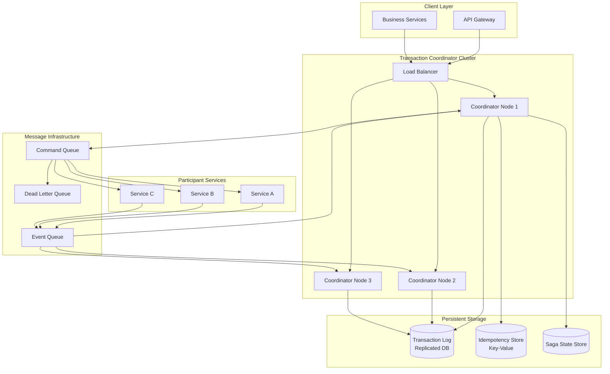

### Component Responsibilities

| Component | Responsibility |
|-----------|----------------|
| **Transaction Coordinator** | Orchestrates transaction lifecycle, state management, decision making |
| **Transaction Log** | Durable record of all transaction states and decisions |
| **Idempotency Store** | Tracks processed operations to prevent duplicates |
| **Saga State Store** | Persists saga state machines and step progress |
| **Command Queue** | Delivers commands to participant services |
| **Event Queue** | Receives completion events from participants |
| **Dead Letter Queue** | Holds failed messages for manual review |
| **Participant Services** | Execute business operations with compensation support |

---

## Two-Phase Commit (2PC) Architecture

### Sequence Diagram

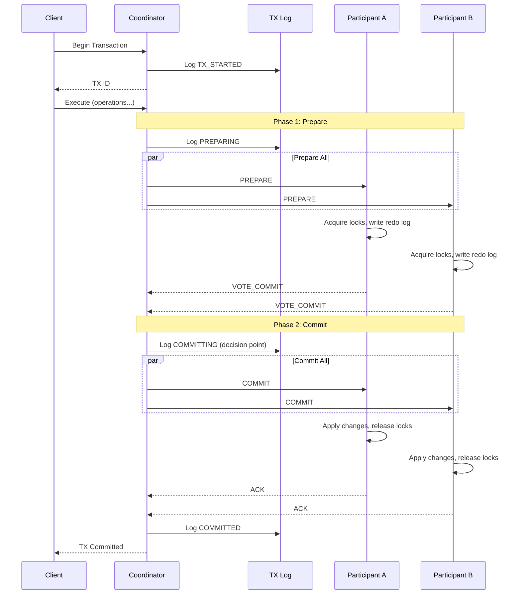

### 2PC Component Architecture

```
┌────────────────────────────────────────────────────────────────────┐
│ TWO-PHASE COMMIT ARCHITECTURE                                       │
├────────────────────────────────────────────────────────────────────┤
│                                                                     │
│  ┌─────────────────────────────────────────────────────────────┐   │
│  │                    COORDINATOR                               │   │
│  │  ┌──────────────┐  ┌──────────────┐  ┌──────────────┐      │   │
│  │  │   Request    │  │    State     │  │   Recovery   │      │   │
│  │  │   Handler    │→ │   Machine    │→ │   Manager    │      │   │
│  │  └──────────────┘  └──────────────┘  └──────────────┘      │   │
│  │         │                 │                 ↑               │   │
│  │         ↓                 ↓                 │               │   │
│  │  ┌──────────────┐  ┌──────────────┐  ┌──────────────┐      │   │
│  │  │  Participant │  │ Transaction  │  │    Timer     │      │   │
│  │  │   Registry   │  │     Log      │  │   Manager    │      │   │
│  │  └──────────────┘  └──────────────┘  └──────────────┘      │   │
│  └─────────────────────────────────────────────────────────────┘   │
│                              │                                      │
│                              ↓                                      │
│  ┌────────────────┐  ┌────────────────┐  ┌────────────────┐       │
│  │  Participant A │  │  Participant B │  │  Participant C │       │
│  │  ┌──────────┐  │  │  ┌──────────┐  │  │  ┌──────────┐  │       │
│  │  │ Resource │  │  │  │ Resource │  │  │  │ Resource │  │       │
│  │  │ Manager  │  │  │  │ Manager  │  │  │  │ Manager  │  │       │
│  │  └──────────┘  │  │  └──────────┘  │  │  └──────────┘  │       │
│  │  ┌──────────┐  │  │  ┌──────────┐  │  │  ┌──────────┐  │       │
│  │  │   Redo   │  │  │  │   Redo   │  │  │  │   Redo   │  │       │
│  │  │   Log    │  │  │  │   Log    │  │  │  │   Log    │  │       │
│  │  └──────────┘  │  │  └──────────┘  │  │  └──────────┘  │       │
│  └────────────────┘  └────────────────┘  └────────────────┘       │
│                                                                     │
└────────────────────────────────────────────────────────────────────┘
```

### 2PC Decision Rules

| All Votes | Coordinator Failure | Decision |
|-----------|---------------------|----------|
| All COMMIT | Before logging decision | ABORT (timeout) |
| All COMMIT | After logging COMMIT | COMMIT on recovery |
| Any ABORT | Any time | ABORT |
| Timeout | Any time | ABORT |

---

## Three-Phase Commit (3PC) Architecture

### Sequence Diagram

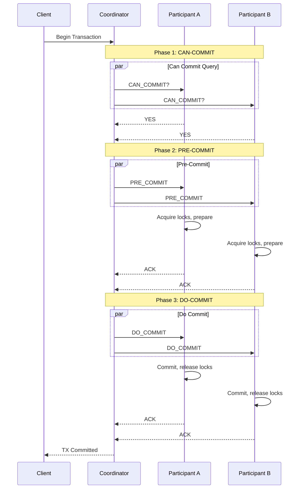

### 3PC vs 2PC

| Aspect | 2PC | 3PC |
|--------|-----|-----|
| **Phases** | 2 (Prepare, Commit) | 3 (CanCommit, PreCommit, DoCommit) |
| **Blocking** | Blocks on coordinator failure | Non-blocking (participants can decide) |
| **Latency** | 2 round trips | 3 round trips |
| **Network Partition** | Safe (blocks) | Unsafe (can diverge) |
| **Real-World Use** | XA transactions, databases | Rarely used in practice |

---

## Saga Orchestration Architecture

### Sequence Diagram

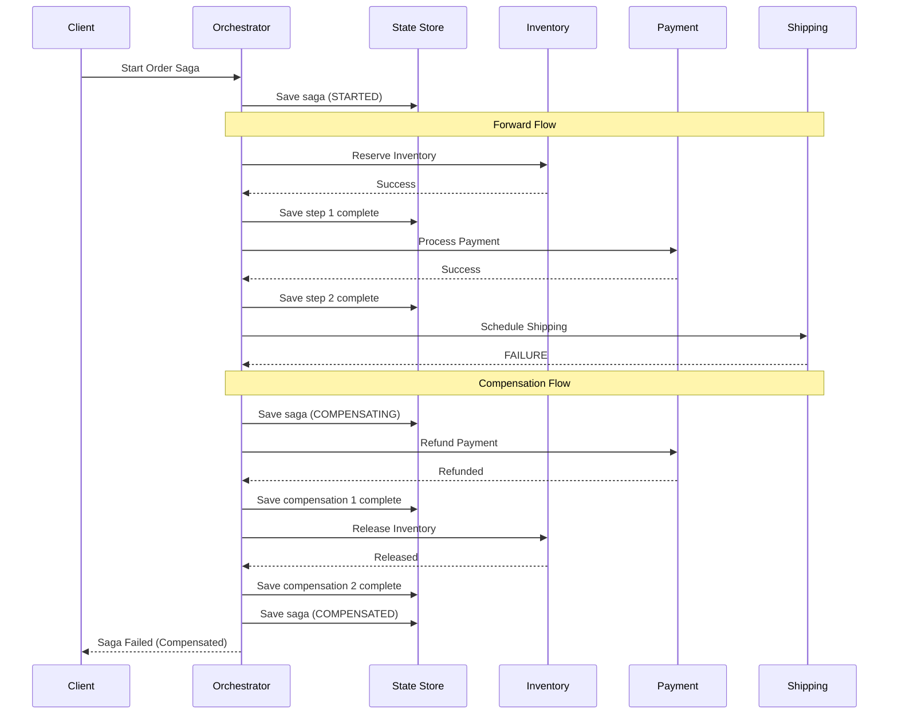

### Orchestration Component Architecture

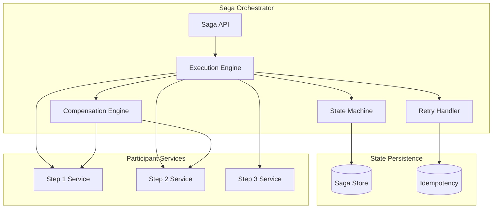

### Orchestrator Responsibilities

```
┌────────────────────────────────────────────────────────────────────┐
│ SAGA ORCHESTRATOR COMPONENTS                                        │
├────────────────────────────────────────────────────────────────────┤
│                                                                     │
│ Execution Engine:                                                   │
│ • Execute saga steps in defined order                              │
│ • Handle step responses (success/failure)                          │
│ • Trigger compensations on failure                                 │
│ • Manage timeouts and retries                                      │
│                                                                     │
│ State Machine:                                                      │
│ • Track saga state (RUNNING, COMPENSATING, COMPLETED, FAILED)     │
│ • Track individual step states                                     │
│ • Persist state after each transition                             │
│                                                                     │
│ Compensation Engine:                                                │
│ • Execute compensating transactions in reverse order               │
│ • Handle compensation failures                                     │
│ • Support partial compensation                                     │
│                                                                     │
│ Retry Handler:                                                      │
│ • Implement exponential backoff                                    │
│ • Respect max retry limits                                         │
│ • Move to DLQ after exhaustion                                     │
│                                                                     │
│ Idempotency Manager:                                                │
│ • Generate/validate idempotency keys                               │
│ • Deduplicate retry attempts                                       │
│ • Cache previous results                                           │
│                                                                     │
└────────────────────────────────────────────────────────────────────┘
```

---

## Saga Choreography Architecture

### Event-Driven Flow

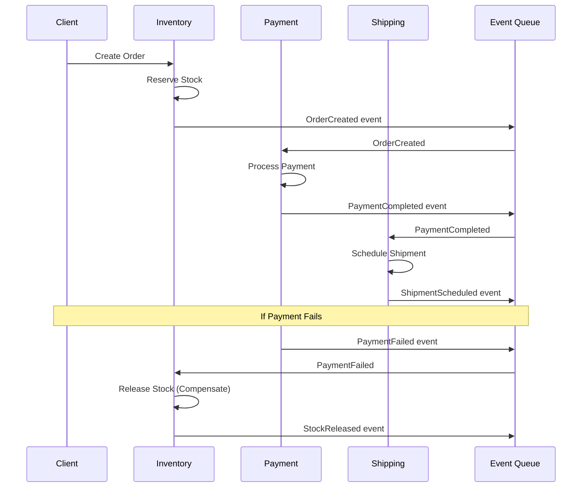

### Choreography Architecture

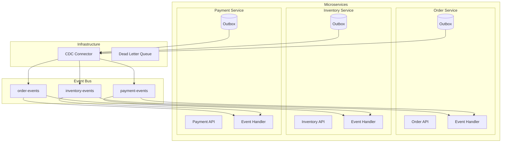

### Transactional Outbox Pattern

```
┌────────────────────────────────────────────────────────────────────┐
│ TRANSACTIONAL OUTBOX PATTERN                                        │
├────────────────────────────────────────────────────────────────────┤
│                                                                     │
│ Problem: How to atomically update DB and publish event?            │
│                                                                     │
│ Solution: Write event to outbox table in same transaction          │
│                                                                     │
│ ┌──────────────────────────────────────────────────────────────┐   │
│ │  BEGIN TRANSACTION                                            │   │
│ │    UPDATE inventory SET quantity = quantity - 1               │   │
│ │    INSERT INTO outbox (event_type, payload, created_at)      │   │
│ │      VALUES ('InventoryReserved', '{"orderId": "123"}', now) │   │
│ │  COMMIT                                                       │   │
│ └──────────────────────────────────────────────────────────────┘   │
│                                                                     │
│ CDC (Change Data Capture) or Polling reads outbox:                 │
│ ┌──────────────────────────────────────────────────────────────┐   │
│ │  Outbox Table                        Event Bus               │   │
│ │  ┌─────────────────────┐             ┌──────────────┐        │   │
│ │  │ id │ event │ status │  ────────►  │ Message Queue│        │   │
│ │  │ 1  │ {...} │ SENT   │  CDC/Poll   │              │        │   │
│ │  │ 2  │ {...} │ PENDING│             └──────────────┘        │   │
│ │  └─────────────────────┘                                     │   │
│ └──────────────────────────────────────────────────────────────┘   │
│                                                                     │
│ Benefits:                                                           │
│ • Atomic: DB change + event in one transaction                    │
│ • Reliable: No event loss even on crash                           │
│ • Ordered: Events processed in order                               │
│                                                                     │
└────────────────────────────────────────────────────────────────────┘
```

---

## TCC (Try-Confirm-Cancel) Architecture

### Sequence Diagram

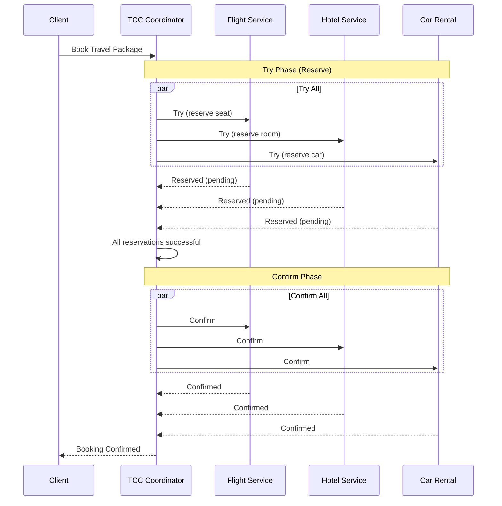

### TCC Failure Handling

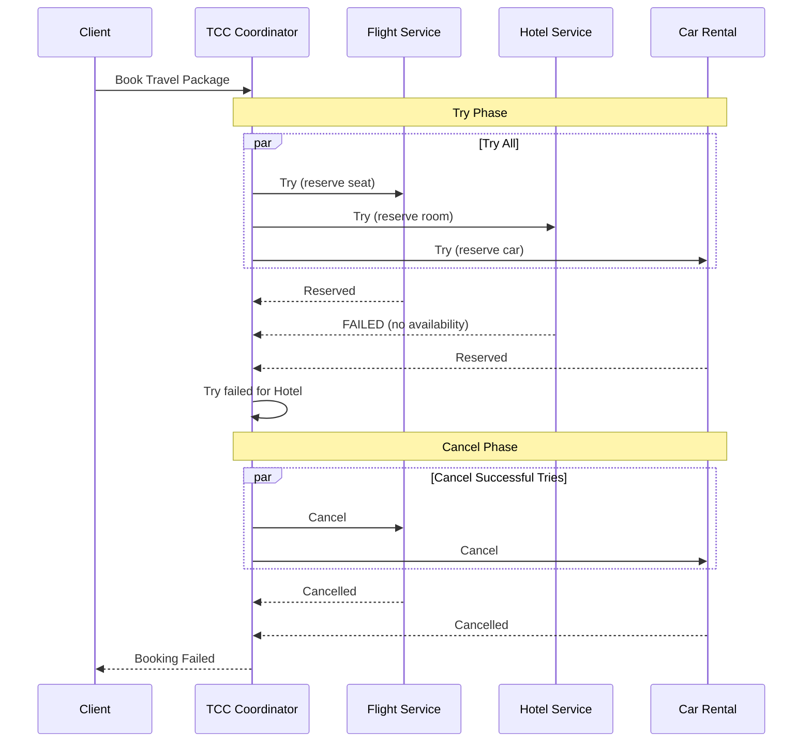

### TCC Resource States

```
┌────────────────────────────────────────────────────────────────────┐
│ TCC RESOURCE STATE MACHINE                                          │
├────────────────────────────────────────────────────────────────────┤
│                                                                     │
│              ┌─────────────┐                                       │
│              │  AVAILABLE  │                                       │
│              └──────┬──────┘                                       │
│                     │ Try()                                        │
│                     ↓                                              │
│              ┌─────────────┐                                       │
│         ┌────│   PENDING   │────┐                                  │
│         │    └─────────────┘    │                                  │
│         │                       │                                  │
│  Cancel() / Timeout       Confirm()                                │
│         │                       │                                  │
│         ↓                       ↓                                  │
│  ┌─────────────┐        ┌─────────────┐                           │
│  │  AVAILABLE  │        │  CONFIRMED  │                           │
│  └─────────────┘        └─────────────┘                           │
│                                                                     │
│  Key Properties:                                                    │
│  • PENDING resources are reserved but not committed                │
│  • PENDING has timeout (e.g., 15 minutes)                         │
│  • Timeout auto-triggers Cancel()                                  │
│  • Confirm/Cancel must be idempotent                              │
│                                                                     │
└────────────────────────────────────────────────────────────────────┘
```

---

## Key Design Decisions

### Decision 1: Coordinator High Availability

```
┌────────────────────────────────────────────────────────────────────┐
│ COORDINATOR HA OPTIONS                                              │
├────────────────────────────────────────────────────────────────────┤
│                                                                     │
│ Option A: Active-Passive with Shared Storage                       │
│ ┌────────────┐      ┌────────────────┐      ┌────────────┐        │
│ │  Active    │─────►│  Shared Log    │◄─────│  Standby   │        │
│ │ Coordinator│      │  (Replicated)  │      │ Coordinator│        │
│ └────────────┘      └────────────────┘      └────────────┘        │
│ Pros: Simple, consistent state                                     │
│ Cons: Failover delay, single writer                               │
│                                                                     │
│ Option B: Active-Active with Partitioning                          │
│ ┌────────────┐  ┌────────────┐  ┌────────────┐                    │
│ │ Coord 1    │  │ Coord 2    │  │ Coord 3    │                    │
│ │ (TX 0-99)  │  │ (TX 100-199)│ │ (TX 200-299)│                   │
│ └────────────┘  └────────────┘  └────────────┘                    │
│ Pros: Higher throughput, no single point of failure               │
│ Cons: More complex, partition rebalancing                         │
│                                                                     │
│ Decision: Active-Active with consistent hashing by TX ID          │
│                                                                     │
└────────────────────────────────────────────────────────────────────┘
```

### Decision 2: State Persistence Strategy

| Option | Durability | Performance | Complexity |
|--------|------------|-------------|------------|
| **Synchronous Replication** | Highest | Lower | Medium |
| **Async with WAL** | High | Higher | Medium |
| **In-Memory with Checkpoints** | Medium | Highest | Low |

**Decision**: Synchronous replication for transaction log (durability critical), async for audit logs.

### Decision 3: Message Delivery Guarantee

```
┌────────────────────────────────────────────────────────────────────┐
│ MESSAGE DELIVERY OPTIONS                                            │
├────────────────────────────────────────────────────────────────────┤
│                                                                     │
│ At-Most-Once:                                                       │
│   Fire and forget, may lose messages                               │
│   NOT suitable for transactions                                    │
│                                                                     │
│ At-Least-Once:                                                      │
│   Retry until acknowledged                                         │
│   Requires idempotent consumers                                    │
│   ✓ Suitable with idempotency                                      │
│                                                                     │
│ Exactly-Once:                                                       │
│   Deduplication + at-least-once                                    │
│   Higher complexity and latency                                    │
│   ✓ Best for financial transactions                                │
│                                                                     │
│ Decision: At-least-once with idempotency (practical exactly-once) │
│                                                                     │
└────────────────────────────────────────────────────────────────────┘
```

---

## Data Flow Diagrams

### 2PC Data Flow

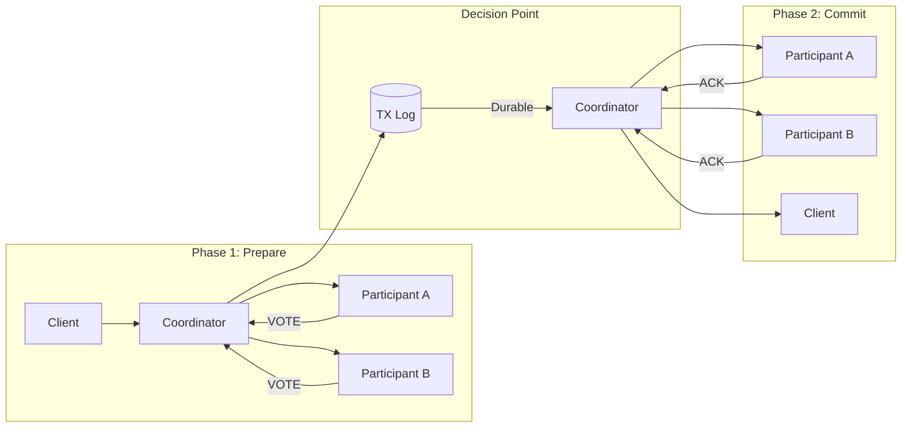

### Saga Data Flow (Orchestration)

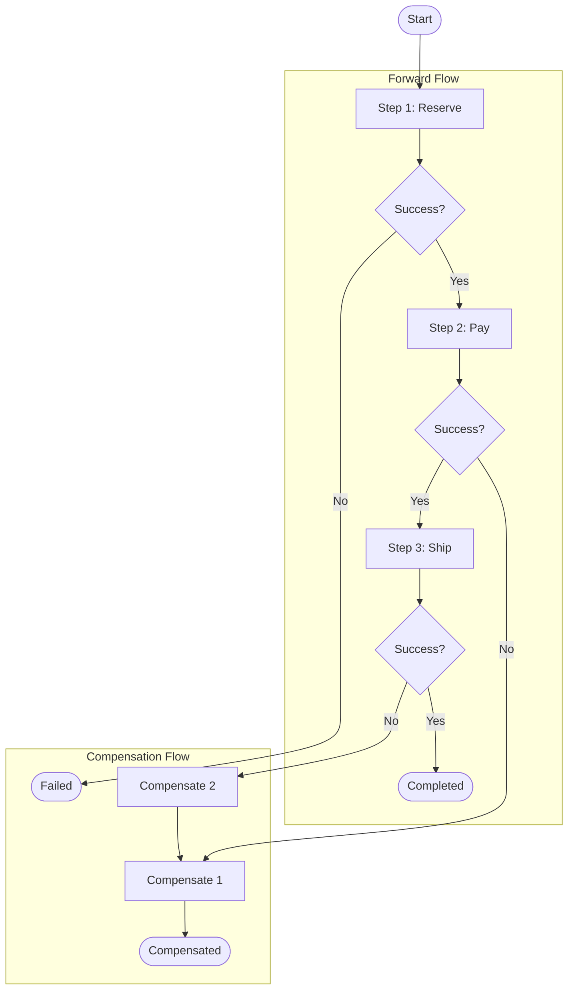

---

## Integration Points

### External System Integration

| System | Integration Method | Purpose |
|--------|-------------------|---------|
| **Database** | JDBC/XA Driver | 2PC participant |
| **Message Queue** | Native client | Command/event delivery |
| **Service Discovery** | DNS/API | Participant location |
| **Monitoring** | Metrics exporter | Observability |
| **Config Service** | Pull/push | Timeout/retry configs |

### API Contracts

```
┌────────────────────────────────────────────────────────────────────┐
│ PARTICIPANT SERVICE CONTRACT                                        │
├────────────────────────────────────────────────────────────────────┤
│                                                                     │
│ For 2PC Participants:                                              │
│   POST /prepare                                                    │
│   POST /commit                                                     │
│   POST /rollback                                                   │
│   GET  /status/{txId}                                              │
│                                                                     │
│ For Saga Steps:                                                     │
│   POST /execute                                                    │
│   POST /compensate                                                 │
│   Headers: Idempotency-Key, Saga-ID, Step-ID                       │
│                                                                     │
│ For TCC Resources:                                                  │
│   POST /try                                                        │
│   POST /confirm                                                    │
│   POST /cancel                                                     │
│   Headers: Reservation-ID, Timeout                                 │
│                                                                     │
└────────────────────────────────────────────────────────────────────┘
```

---

## Summary

| Pattern | Architecture Style | State Management | Best For |
|---------|-------------------|------------------|----------|
| **2PC** | Synchronous, coordinator-driven | Transaction log | Homogeneous DBs |
| **3PC** | Synchronous, non-blocking | Transaction log | Theoretical only |
| **Saga (Orch)** | Async, centralized | Saga state store | Complex workflows |
| **Saga (Chor)** | Event-driven, distributed | Outbox + events | Loosely coupled |
| **TCC** | Sync try, async confirm | Reservation store | Resource booking |
