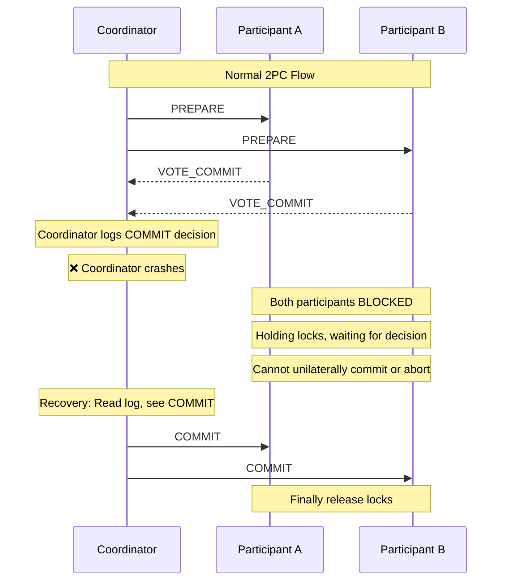
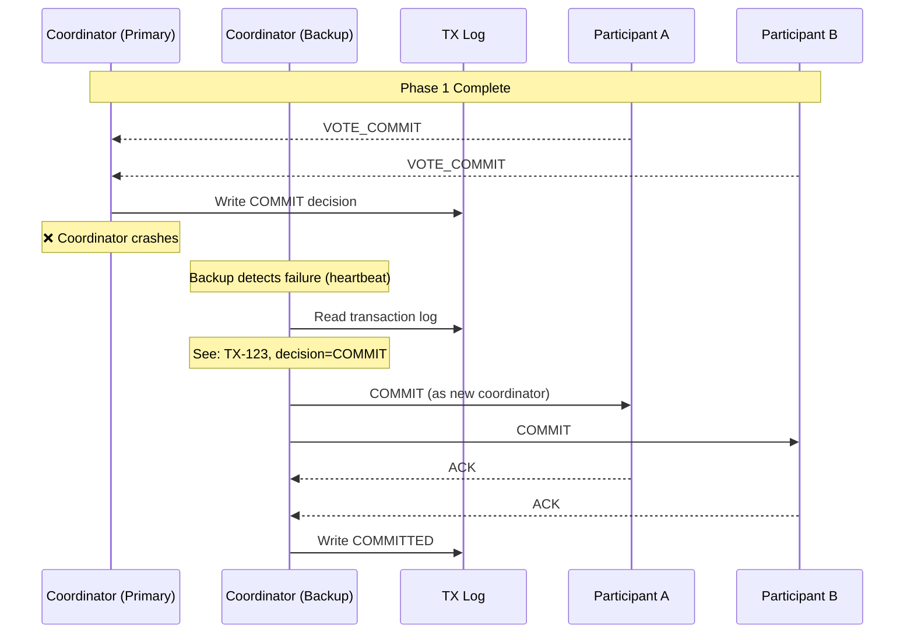
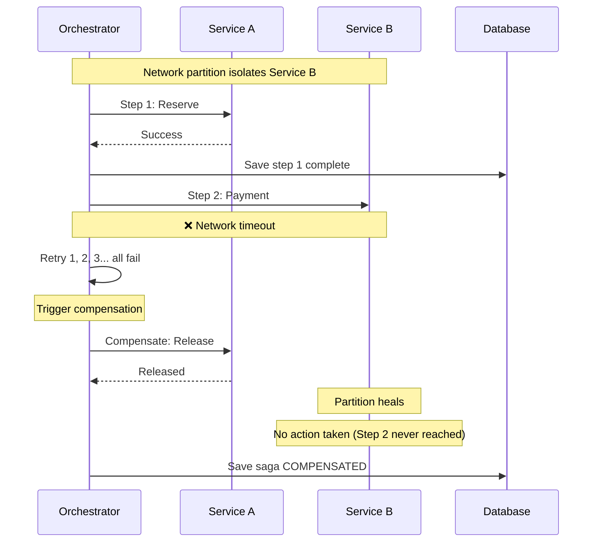

# Deep Dive and Bottlenecks

[← Back to Index](./00-index.md)

---

## Critical Component Analysis

### 1. Transaction Coordinator

The coordinator is the brain of distributed transactions. Its failure modes and recovery capabilities define system reliability.

```
┌────────────────────────────────────────────────────────────────────┐
│ COORDINATOR DEEP DIVE                                               │
├────────────────────────────────────────────────────────────────────┤
│                                                                     │
│ Responsibilities:                                                   │
│ • Receive transaction requests from clients                        │
│ • Manage participant lifecycle (registration, health)              │
│ • Drive 2PC/3PC protocol phases                                    │
│ • Make commit/abort decisions                                      │
│ • Persist transaction state durably                                │
│ • Recover incomplete transactions on startup                       │
│                                                                     │
│ Critical Data Structures:                                           │
│ ┌────────────────────────────────────────────────────────────────┐ │
│ │ In-Memory State                                                 │ │
│ │ ├── active_transactions: Map<TxId, TransactionContext>         │ │
│ │ ├── participant_connections: Map<ParticipantId, Connection>    │ │
│ │ ├── timeout_heap: MinHeap<(TxId, timeout_at)>                 │ │
│ │ └── pending_acks: Map<TxId, Set<ParticipantId>>               │ │
│ └────────────────────────────────────────────────────────────────┘ │
│                                                                     │
│ Failure Scenarios:                                                  │
│                                                                     │
│ 1. Coordinator Crash Before Decision                               │
│    State: PREPARING or PREPARED                                    │
│    Impact: Participants holding locks                              │
│    Recovery: New coordinator reads log, decides ABORT              │
│                                                                     │
│ 2. Coordinator Crash After Decision                                │
│    State: COMMITTING or ABORTING                                   │
│    Impact: Some participants may not have received decision        │
│    Recovery: New coordinator resends decision to all               │
│                                                                     │
│ 3. Coordinator-Participant Network Partition                       │
│    Impact: Participant times out, may abort unilaterally          │
│    Mitigation: Participant queries coordinator on timeout          │
│                                                                     │
└────────────────────────────────────────────────────────────────────┘
```

### 2PC Blocking Problem



### 2. Saga Orchestrator Engine

```
┌────────────────────────────────────────────────────────────────────┐
│ SAGA ORCHESTRATOR DEEP DIVE                                         │
├────────────────────────────────────────────────────────────────────┤
│                                                                     │
│ Execution Model:                                                    │
│                                                                     │
│ ┌─────────────────────────────────────────────────────────────┐    │
│ │                    Saga Executor Thread                      │    │
│ │                                                              │    │
│ │  WHILE saga not complete:                                   │    │
│ │    step = GetNextStep(saga)                                 │    │
│ │    result = ExecuteWithRetry(step)                          │    │
│ │                                                              │    │
│ │    IF result.success:                                       │    │
│ │      SaveStepResult(saga, step, result)                     │    │
│ │      saga.current_step++                                    │    │
│ │    ELSE:                                                    │    │
│ │      TriggerCompensation(saga, step)                        │    │
│ │                                                              │    │
│ │    PersistSaga(saga)  // After EVERY state change          │    │
│ │  END WHILE                                                  │    │
│ └─────────────────────────────────────────────────────────────┘    │
│                                                                     │
│ Key Design Choices:                                                 │
│                                                                     │
│ 1. Synchronous vs Asynchronous Execution                           │
│    Sync: Simpler, easier debugging                                 │
│    Async: Higher throughput, more complex                          │
│                                                                     │
│ 2. Step Timeout Handling                                           │
│    Option A: Per-step timeout, retry then fail                     │
│    Option B: Saga-level timeout, compensation on breach            │
│                                                                     │
│ 3. Compensation Order                                               │
│    Standard: Reverse order of execution                            │
│    Optimized: Parallel where no dependencies                       │
│                                                                     │
└────────────────────────────────────────────────────────────────────┘
```

### 3. Compensation Engine

The compensation engine must handle the most complex failure scenarios.

```
┌────────────────────────────────────────────────────────────────────┐
│ COMPENSATION ENGINE CHALLENGES                                      │
├────────────────────────────────────────────────────────────────────┤
│                                                                     │
│ Challenge 1: Compensation Failure                                   │
│ ─────────────────────────────────                                  │
│ What if compensation itself fails?                                 │
│                                                                     │
│ Options:                                                            │
│ a) Retry indefinitely (with backoff)                               │
│    Risk: May never complete                                        │
│ b) Retry N times, then manual intervention                         │
│    Risk: Leaves inconsistent state                                 │
│ c) Compensation compensation (meta-compensation)                   │
│    Complexity: Very high                                           │
│                                                                     │
│ Recommended: Option B with robust alerting                         │
│                                                                     │
│ ─────────────────────────────────                                  │
│                                                                     │
│ Challenge 2: Non-Compensatable Operations                          │
│ ─────────────────────────────────────────                          │
│ Some operations cannot be undone:                                  │
│ • Email sent                                                       │
│ • External API call (payment captured)                             │
│ • Physical action triggered (warehouse picking)                    │
│                                                                     │
│ Strategies:                                                         │
│ a) Place non-compensatable steps at the end                        │
│ b) Use two-phase reservation (TCC pattern)                         │
│ c) Accept business-level compensation (refund vs void)             │
│                                                                     │
│ ─────────────────────────────────                                  │
│                                                                     │
│ Challenge 3: Partial Compensation                                   │
│ ─────────────────────────────────                                  │
│ What if compensation partially succeeds?                           │
│                                                                     │
│ Scenario:                                                           │
│   Step 1: Reserve 5 items  → Compensate: Release 5                │
│   But only 3 items available (someone else took 2)                 │
│                                                                     │
│ Solution: Compensations must be idempotent AND                     │
│           handle partial state gracefully                          │
│                                                                     │
└────────────────────────────────────────────────────────────────────┘
```

### 4. Idempotency Handler

```
┌────────────────────────────────────────────────────────────────────┐
│ IDEMPOTENCY IMPLEMENTATION DEEP DIVE                                │
├────────────────────────────────────────────────────────────────────┤
│                                                                     │
│ Key Design Decisions:                                               │
│                                                                     │
│ 1. Key Generation Strategy                                         │
│    ┌─────────────────────────────────────────────────────────┐    │
│    │ Option A: Client-provided key                            │    │
│    │   Pro: Client controls uniqueness                        │    │
│    │   Con: Clients may generate collisions                   │    │
│    │                                                          │    │
│    │ Option B: Server-generated from request                  │    │
│    │   Key = Hash(saga_id + step_id + attempt)               │    │
│    │   Pro: Automatic, deterministic                          │    │
│    │   Con: Hash collisions theoretically possible            │    │
│    │                                                          │    │
│    │ Recommended: Combination - client key for saga,         │    │
│    │              derived keys for steps                      │    │
│    └─────────────────────────────────────────────────────────┘    │
│                                                                     │
│ 2. Storage Strategy                                                 │
│    ┌─────────────────────────────────────────────────────────┐    │
│    │ Hot Path: In-memory cache (Redis/local)                 │    │
│    │   TTL: 1 hour                                           │    │
│    │   Purpose: Fast deduplication                           │    │
│    │                                                          │    │
│    │ Cold Path: Persistent store (DB)                        │    │
│    │   TTL: 24-72 hours                                      │    │
│    │   Purpose: Retry scenarios, crash recovery              │    │
│    └─────────────────────────────────────────────────────────┘    │
│                                                                     │
│ 3. Race Condition Handling                                          │
│    Two requests with same key arrive simultaneously:               │
│                                                                     │
│    Request A                    Request B                          │
│    ─────────                    ─────────                          │
│    Check cache: MISS            Check cache: MISS                  │
│    Check DB: MISS               Check DB: MISS                     │
│    Insert IN_PROGRESS           Insert IN_PROGRESS ← CONFLICT!    │
│    Execute operation            Wait and retry                     │
│    Store COMPLETED              Check DB: COMPLETED               │
│    Return result                Return cached result               │
│                                                                     │
│    Solution: Atomic insert with unique constraint                  │
│              Second insert fails, triggers wait-and-retry          │
│                                                                     │
└────────────────────────────────────────────────────────────────────┘
```

---

## Failure Scenarios

### Scenario 1: Coordinator Failure During 2PC



### Scenario 2: Participant Failure During Saga

```
┌────────────────────────────────────────────────────────────────────┐
│ PARTICIPANT FAILURE SCENARIOS                                       │
├────────────────────────────────────────────────────────────────────┤
│                                                                     │
│ Scenario 2a: Participant fails DURING step execution               │
│                                                                     │
│   Orchestrator                    Participant                      │
│       │                               │                            │
│       │──── Execute Step ────────────►│                            │
│       │                               │ Processing...              │
│       │                               │ ❌ Crash                   │
│       │                               │                            │
│       │◄─── Timeout ─────────────────│                            │
│       │                               │                            │
│   Retry with                          │                            │
│   idempotency key                     │                            │
│       │──── Execute Step ────────────►│ (after restart)           │
│       │                               │                            │
│       │◄─── Success ─────────────────│                            │
│                                                                     │
│ Key: Idempotency key ensures operation isn't duplicated           │
│                                                                     │
│ ───────────────────────────────────────────────────────────────── │
│                                                                     │
│ Scenario 2b: Participant fails AFTER step, BEFORE ack              │
│                                                                     │
│   Orchestrator                    Participant                      │
│       │                               │                            │
│       │──── Execute Step ────────────►│                            │
│       │                               │ Execute                    │
│       │                               │ Write to outbox            │
│       │                               │ ❌ Crash before ack        │
│       │                               │                            │
│       │◄─── Timeout ─────────────────│                            │
│       │                               │                            │
│   Retry with                          │ (after restart)           │
│   idempotency key                     │                            │
│       │──── Execute Step ────────────►│                            │
│       │                               │ Check idempotency          │
│       │                               │ Already done!              │
│       │◄─── Return cached result ────│                            │
│                                                                     │
└────────────────────────────────────────────────────────────────────┘
```

### Scenario 3: Network Partition



### Scenario 4: Message Queue Failure

```
┌────────────────────────────────────────────────────────────────────┐
│ MESSAGE QUEUE FAILURE HANDLING                                      │
├────────────────────────────────────────────────────────────────────┤
│                                                                     │
│ Scenario: Queue unavailable during choreography saga               │
│                                                                     │
│ Without Outbox Pattern:                                            │
│   Service A                   Queue                   Service B    │
│       │                         │                         │        │
│       │ Execute & commit        │                         │        │
│       │─────────────────────────┼────────────────────────►│        │
│       │                         │ ❌ Queue down           │        │
│       │                         │                         │        │
│   Result: DB committed, event lost → Inconsistency                │
│                                                                     │
│ ─────────────────────────────────────────────────────────────────  │
│                                                                     │
│ With Outbox Pattern:                                               │
│   Service A                   Queue                   Service B    │
│       │                         │                         │        │
│       │ BEGIN TX                │                         │        │
│       │ Execute business logic  │                         │        │
│       │ INSERT into outbox      │                         │        │
│       │ COMMIT TX               │                         │        │
│       │                         │                         │        │
│       │ CDC reads outbox        │ ❌ Queue down           │        │
│       │ Retry later             │                         │        │
│       │                         │ Queue recovers          │        │
│       │ CDC reads outbox        │                         │        │
│       │──────────────────────►  │                         │        │
│       │                         │ ─────────────────────►  │        │
│       │                         │                         │        │
│   Result: Event eventually delivered → Consistency                 │
│                                                                     │
└────────────────────────────────────────────────────────────────────┘
```

---

## Race Conditions

### Race Condition 1: Duplicate Saga Start

```
┌────────────────────────────────────────────────────────────────────┐
│ DUPLICATE SAGA START PREVENTION                                     │
├────────────────────────────────────────────────────────────────────┤
│                                                                     │
│ Problem: User clicks "Submit Order" twice quickly                  │
│                                                                     │
│   Request 1                         Request 2                      │
│   ─────────                         ─────────                      │
│   Start OrderSaga(order-123)        Start OrderSaga(order-123)     │
│   Insert saga record                Insert saga record             │
│   Saga-A created                    Saga-B created                 │
│   Reserve inventory                 Reserve inventory              │
│   Process payment                   Process payment                │
│                                                                     │
│   Result: Double charge, double inventory reservation!             │
│                                                                     │
│ ─────────────────────────────────────────────────────────────────  │
│                                                                     │
│ Solution: Idempotency at saga creation level                       │
│                                                                     │
│   Request 1                         Request 2                      │
│   ─────────                         ─────────                      │
│   Check: saga for order-123?        Check: saga for order-123?     │
│   Not found                         Not found                      │
│   Insert with unique constraint     Insert with unique constraint  │
│   on (saga_type, business_key)      ❌ CONFLICT!                   │
│   Saga-A created                    Return existing Saga-A         │
│   Continue execution                Return Saga-A status           │
│                                                                     │
│ Schema:                                                             │
│   CREATE UNIQUE INDEX idx_saga_business_key                        │
│   ON sagas (saga_type, (input_data->>'order_id'))                 │
│   WHERE state NOT IN ('COMPLETED', 'COMPENSATED', 'FAILED')       │
│                                                                     │
└────────────────────────────────────────────────────────────────────┘
```

### Race Condition 2: Concurrent Compensation

```
┌────────────────────────────────────────────────────────────────────┐
│ CONCURRENT COMPENSATION RACE                                        │
├────────────────────────────────────────────────────────────────────┤
│                                                                     │
│ Problem: Two triggers try to compensate same saga                  │
│                                                                     │
│   Timeout Monitor                   Admin API                      │
│   ───────────────                   ─────────                      │
│   Saga-123 timed out                Admin: "Cancel Saga-123"       │
│   Read saga: state=RUNNING          Read saga: state=RUNNING       │
│   Trigger compensation              Trigger compensation           │
│   Set state=COMPENSATING            Set state=COMPENSATING         │
│   Compensate step 2                 Compensate step 2              │
│   Refund issued                     Refund issued ← DOUBLE!        │
│                                                                     │
│ ─────────────────────────────────────────────────────────────────  │
│                                                                     │
│ Solution: Optimistic locking with version                          │
│                                                                     │
│   Timeout Monitor                   Admin API                      │
│   ───────────────                   ─────────                      │
│   Read saga: state=RUNNING,         Read saga: state=RUNNING,      │
│              version=5                         version=5           │
│   UPDATE SET state=COMPENSATING     UPDATE SET state=COMPENSATING  │
│   WHERE version=5                   WHERE version=5                │
│   Success, version=6                ❌ 0 rows affected             │
│   Proceed with compensation         Read saga: state=COMPENSATING  │
│                                     Already being compensated      │
│                                     No action needed               │
│                                                                     │
│ SQL:                                                               │
│   UPDATE sagas                                                     │
│   SET state = 'COMPENSATING', version = version + 1               │
│   WHERE saga_id = ? AND version = ? AND state = 'RUNNING'         │
│                                                                     │
└────────────────────────────────────────────────────────────────────┘
```

### Race Condition 3: Step Execution vs Timeout

```
┌────────────────────────────────────────────────────────────────────┐
│ STEP EXECUTION VS TIMEOUT RACE                                      │
├────────────────────────────────────────────────────────────────────┤
│                                                                     │
│ Problem: Step completes just as timeout fires                      │
│                                                                     │
│   Step Executor                     Timeout Monitor                │
│   ─────────────                     ───────────────                │
│   Execute payment                   Check: step timeout?           │
│   (slow network)                    Yes, 30s exceeded              │
│   Response received: SUCCESS        Mark step FAILED               │
│   Mark step SUCCEEDED               Trigger compensation           │
│                                                                     │
│   Result: Payment succeeded but refund also issued!                │
│                                                                     │
│ ─────────────────────────────────────────────────────────────────  │
│                                                                     │
│ Solution: Atomic state transition with check                       │
│                                                                     │
│   Step Executor                     Timeout Monitor                │
│   ─────────────                     ───────────────                │
│   Execute payment                   Check: step timeout?           │
│   Response: SUCCESS                 Yes, 30s exceeded              │
│   CAS: RUNNING→SUCCEEDED            CAS: RUNNING→FAILED           │
│        Success!                          ❌ State changed!         │
│                                     No compensation needed         │
│                                                                     │
│ Implementation:                                                     │
│   UPDATE saga_steps                                                │
│   SET state = 'SUCCEEDED', output = ?                             │
│   WHERE saga_id = ? AND step_index = ? AND state = 'RUNNING'      │
│   -- Returns 0 rows if state already changed by timeout           │
│                                                                     │
└────────────────────────────────────────────────────────────────────┘
```

---

## Bottleneck Analysis

### Bottleneck 1: Coordinator as Single Point of Contention

```
┌────────────────────────────────────────────────────────────────────┐
│ COORDINATOR BOTTLENECK                                              │
├────────────────────────────────────────────────────────────────────┤
│                                                                     │
│ Problem:                                                            │
│ • All transactions route through single coordinator               │
│ • State persistence is synchronous (durability requirement)        │
│ • Network I/O for participant communication                        │
│                                                                     │
│ Bottleneck Metrics:                                                 │
│ ┌────────────────────────────────────────────────────────────┐    │
│ │ Single Coordinator Limits:                                  │    │
│ │ • TX Log writes: ~10,000 writes/sec (SSD)                  │    │
│ │ • Network I/O: ~50,000 messages/sec                        │    │
│ │ • State updates: ~5,000 TPS (with sync replication)       │    │
│ │                                                             │    │
│ │ Effective limit: ~3,000-5,000 TPS per coordinator         │    │
│ └────────────────────────────────────────────────────────────┘    │
│                                                                     │
│ Solutions:                                                          │
│                                                                     │
│ 1. Horizontal Partitioning                                         │
│    Partition by transaction_id hash                                │
│    Each coordinator handles subset of transactions                 │
│    Scale: Linear with coordinator count                            │
│                                                                     │
│ 2. Async Persistence (where safe)                                  │
│    Batch transaction log writes                                    │
│    Trade: Slightly higher risk of data loss                        │
│                                                                     │
│ 3. Local State Caching                                             │
│    Cache active transactions in memory                             │
│    Reduce DB round trips                                           │
│                                                                     │
└────────────────────────────────────────────────────────────────────┘
```

### Bottleneck 2: Transaction Log Write Throughput

```
┌────────────────────────────────────────────────────────────────────┐
│ TX LOG BOTTLENECK                                                   │
├────────────────────────────────────────────────────────────────────┤
│                                                                     │
│ Problem: Synchronous writes to transaction log                     │
│                                                                     │
│ Per Transaction Writes:                                            │
│   1. TX_STARTED (begin)                                            │
│   2. PREPARING (before prepare)                                    │
│   3. PREPARED or ABORTING (after votes)                           │
│   4. COMMITTING or ABORTING (decision)                            │
│   5. COMMITTED or ABORTED (completion)                             │
│   Total: 5 writes per transaction                                  │
│                                                                     │
│ At 5,000 TPS: 25,000 writes/sec to TX log                         │
│                                                                     │
│ Solutions:                                                          │
│                                                                     │
│ 1. Write Batching                                                   │
│    Batch multiple state changes into single write                  │
│    Tradeoff: Slight latency increase for throughput                │
│    Example: Batch 10 transactions, write every 10ms               │
│                                                                     │
│ 2. Reduce State Transitions                                         │
│    Combine PREPARING + PREPARED into single write                  │
│    Fewer writes: 5 → 3 per transaction                            │
│                                                                     │
│ 3. Partitioned Log                                                  │
│    Separate log partitions per coordinator                         │
│    No cross-partition coordination                                 │
│                                                                     │
│ 4. In-Memory Log with Async Flush                                  │
│    Write to memory, async flush to disk                            │
│    Tradeoff: Risk of data loss on crash                            │
│    Mitigation: Replicate to standby before ack                     │
│                                                                     │
└────────────────────────────────────────────────────────────────────┘
```

### Bottleneck 3: Participant Latency Impact

```
┌────────────────────────────────────────────────────────────────────┐
│ PARTICIPANT LATENCY IMPACT                                          │
├────────────────────────────────────────────────────────────────────┤
│                                                                     │
│ 2PC Latency Formula:                                               │
│                                                                     │
│   T_total = T_log_write × 2                    (prepare + commit)  │
│           + T_network × 4                      (prepare + commit,  │
│                                                 request + response)│
│           + T_participant_processing × 2       (prepare + commit)  │
│           + max(T_participant_latency)         (slowest wins)      │
│                                                                     │
│ Example with 3 participants:                                       │
│   T_log_write = 2ms                                                │
│   T_network = 1ms (same DC)                                        │
│   T_processing = 5ms                                               │
│   Participant latencies: 5ms, 10ms, 50ms                          │
│                                                                     │
│   T_total = 2×2 + 4×1 + 2×5 + 50 = 68ms                          │
│                                                                     │
│   The slowest participant (50ms) dominates!                        │
│                                                                     │
│ ─────────────────────────────────────────────────────────────────  │
│                                                                     │
│ Solutions:                                                          │
│                                                                     │
│ 1. Participant SLOs                                                 │
│    Require all participants to meet latency SLO                    │
│    Reject slow participants from 2PC                               │
│                                                                     │
│ 2. Parallel Prepare/Commit                                         │
│    Already parallel, but ensure truly concurrent                   │
│                                                                     │
│ 3. Use Saga for Slow Operations                                    │
│    If participant is inherently slow (external API),               │
│    use Saga pattern instead of 2PC                                 │
│                                                                     │
│ 4. Participant Caching                                             │
│    Cache participant endpoints, avoid discovery latency            │
│                                                                     │
└────────────────────────────────────────────────────────────────────┘
```

### Bottleneck 4: Saga Message Queue Throughput

```
┌────────────────────────────────────────────────────────────────────┐
│ MESSAGE QUEUE BOTTLENECK (CHOREOGRAPHY)                             │
├────────────────────────────────────────────────────────────────────┤
│                                                                     │
│ Problem: All saga events flow through message queue                │
│                                                                     │
│ Message Volume per Saga (5-step order):                            │
│   Step 1: OrderCreated event                                       │
│   Step 2: InventoryReserved event                                  │
│   Step 3: PaymentProcessed event                                   │
│   Step 4: FraudCheckPassed event                                   │
│   Step 5: ShippingScheduled event                                  │
│   Completion: OrderCompleted event                                 │
│   Total: 6 events per saga                                         │
│                                                                     │
│ With 5% failure rate (compensation adds 3 more events):            │
│   Average: 6 + 0.05×3 = 6.15 events per saga                      │
│                                                                     │
│ At 10,000 sagas/min:                                               │
│   61,500 events/min = 1,025 events/sec                            │
│                                                                     │
│ ─────────────────────────────────────────────────────────────────  │
│                                                                     │
│ Solutions:                                                          │
│                                                                     │
│ 1. Topic Partitioning                                              │
│    Partition by saga_id or customer_id                             │
│    Parallelism = partition count                                   │
│                                                                     │
│ 2. Consumer Scaling                                                 │
│    Add consumers up to partition count                             │
│    Each consumer handles subset of partitions                      │
│                                                                     │
│ 3. Message Batching                                                 │
│    Batch events from same saga                                     │
│    Reduce network overhead                                         │
│                                                                     │
│ 4. Local Event Bus for Same-Service                                │
│    If two steps are in same service, skip queue                    │
│    Direct in-process event delivery                                │
│                                                                     │
└────────────────────────────────────────────────────────────────────┘
```

---

## Trade-off Deep Dive

### Consistency vs Availability

| Approach | Consistency | Availability | When to Use |
|----------|-------------|--------------|-------------|
| **2PC** | Strong (ACID) | Lower (blocking) | Financial transactions, inventory |
| **Saga** | Eventual | Higher | E-commerce, booking systems |
| **TCC** | Eventual (strong during try) | High | Seat reservation, appointments |

### Coordinator Centralization

| Aspect | Centralized (Orchestration) | Decentralized (Choreography) |
|--------|----------------------------|------------------------------|
| **Visibility** | Full transaction visibility | Hard to trace end-to-end |
| **Failure Domain** | Single point of failure | Distributed failure |
| **Testing** | Easier (mock orchestrator) | Complex (mock events) |
| **Coupling** | Services coupled to orchestrator | Services coupled to events |
| **Evolution** | Change orchestrator | Change all event handlers |

### State Storage Trade-offs

| Storage | Durability | Latency | Cost |
|---------|------------|---------|------|
| **Sync Replicated DB** | Highest | 5-10ms | High |
| **Async Replicated DB** | High | 1-2ms | Medium |
| **In-Memory + WAL** | Medium | <1ms | Medium |
| **Pure In-Memory** | Low | <0.1ms | Low |

---

## Summary

| Challenge | Impact | Mitigation |
|-----------|--------|------------|
| Coordinator failure | Transaction blocking | Active-passive failover, shared log |
| Participant failure | Step timeout/retry | Idempotency, compensation |
| Network partition | Split-brain risk | Saga pattern, eventual consistency |
| Message loss | Inconsistent state | Transactional outbox |
| Race conditions | Data corruption | Optimistic locking, CAS |
| TX log bottleneck | Throughput limit | Batching, partitioning |
| Slow participants | Latency spike | SLOs, use saga for slow ops |
