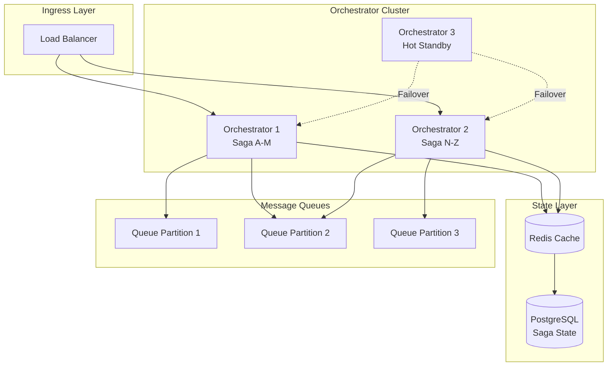
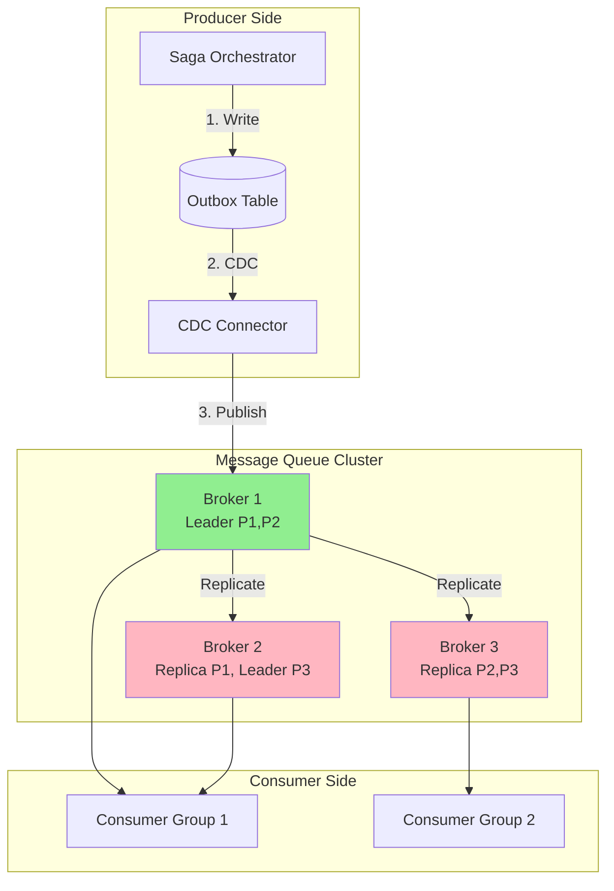

# Scalability and Reliability

[← Back to Index](./00-index.md)

---

## Horizontal Scaling Strategies

### Coordinator Scaling

```
┌────────────────────────────────────────────────────────────────────┐
│ COORDINATOR HORIZONTAL SCALING                                      │
├────────────────────────────────────────────────────────────────────┤
│                                                                     │
│ Strategy 1: Partitioning by Transaction ID                         │
│                                                                     │
│   ┌─────────────────────────────────────────────────────────────┐  │
│   │                     Load Balancer                           │  │
│   │                          │                                   │  │
│   │     ┌────────────────────┼────────────────────┐             │  │
│   │     │                    │                    │             │  │
│   │     ▼                    ▼                    ▼             │  │
│   │ ┌────────┐          ┌────────┐          ┌────────┐         │  │
│   │ │Coord 1 │          │Coord 2 │          │Coord 3 │         │  │
│   │ │TX 0-99 │          │TX 100- │          │TX 200- │         │  │
│   │ │        │          │   199  │          │   299  │         │  │
│   │ └────────┘          └────────┘          └────────┘         │  │
│   │     │                    │                    │             │  │
│   │     └────────────────────┼────────────────────┘             │  │
│   │                          │                                   │  │
│   │                    ┌─────┴─────┐                            │  │
│   │                    │  Shared   │                            │  │
│   │                    │ TX Log DB │                            │  │
│   │                    └───────────┘                            │  │
│   └─────────────────────────────────────────────────────────────┘  │
│                                                                     │
│   Partition Function: coordinator_id = hash(tx_id) % N             │
│   Rebalancing: Add coordinator, migrate partition range            │
│                                                                     │
│ ─────────────────────────────────────────────────────────────────  │
│                                                                     │
│ Strategy 2: Consistent Hashing for Coordinators                    │
│                                                                     │
│   Benefits:                                                         │
│   • Minimal rebalancing when adding/removing coordinators          │
│   • ~1/N transactions move when adding Nth coordinator             │
│   • Virtual nodes for better distribution                          │
│                                                                     │
│   Implementation:                                                   │
│   • Each coordinator owns hash ring segment                        │
│   • Transaction routes to coordinator owning hash(tx_id)           │
│   • Successor handles failover                                     │
│                                                                     │
└────────────────────────────────────────────────────────────────────┘
```

### Saga Orchestrator Scaling



### Scaling Dimensions

| Dimension | Scaling Approach | Considerations |
|-----------|-----------------|----------------|
| **Coordinators** | Partition by tx_id | State must be migrated on rebalance |
| **Transaction Log** | Sharded database | Cross-shard queries for reporting |
| **Message Queue** | Add partitions | Consumers scale with partitions |
| **Participants** | Independent scaling | No coordinator dependency |
| **Idempotency Store** | Sharded cache | TTL-based cleanup |

### Auto-Scaling Triggers

```
┌────────────────────────────────────────────────────────────────────┐
│ AUTO-SCALING CONFIGURATION                                          │
├────────────────────────────────────────────────────────────────────┤
│                                                                     │
│ Metric-Based Scaling:                                               │
│                                                                     │
│ ┌─────────────────────────────────────────────────────────────┐    │
│ │ Coordinator Scaling                                          │    │
│ │ Scale UP when:                                               │    │
│ │   • CPU > 70% for 2 minutes                                 │    │
│ │   • Active transactions > 80% capacity                      │    │
│ │   • Request queue depth > 1000                              │    │
│ │                                                              │    │
│ │ Scale DOWN when:                                             │    │
│ │   • CPU < 30% for 10 minutes                                │    │
│ │   • Active transactions < 30% capacity                      │    │
│ │   Cooldown: 5 minutes between scale events                  │    │
│ └─────────────────────────────────────────────────────────────┘    │
│                                                                     │
│ ┌─────────────────────────────────────────────────────────────┐    │
│ │ Queue Consumer Scaling                                       │    │
│ │ Scale UP when:                                               │    │
│ │   • Consumer lag > 10,000 messages                          │    │
│ │   • Message age > 30 seconds                                │    │
│ │                                                              │    │
│ │ Scale DOWN when:                                             │    │
│ │   • Consumer lag < 100 messages for 10 minutes              │    │
│ │   • Consumers idle > 50% time                               │    │
│ └─────────────────────────────────────────────────────────────┘    │
│                                                                     │
│ Predictive Scaling (optional):                                      │
│   • Time-based: Scale up before known traffic peaks               │
│   • ML-based: Predict load from historical patterns                │
│                                                                     │
└────────────────────────────────────────────────────────────────────┘
```

---

## Fault Tolerance

### Coordinator High Availability

```
┌────────────────────────────────────────────────────────────────────┐
│ COORDINATOR HA ARCHITECTURE                                         │
├────────────────────────────────────────────────────────────────────┤
│                                                                     │
│ Option A: Active-Passive with Leader Election                      │
│                                                                     │
│   ┌─────────────────────────────────────────────────────────────┐  │
│   │                                                              │  │
│   │    ┌──────────┐      ┌──────────────┐      ┌──────────┐    │  │
│   │    │ Active   │      │   Consensus  │      │ Standby  │    │  │
│   │    │ Coord    │◄────►│   (Raft/ZK)  │◄────►│ Coord    │    │  │
│   │    └────┬─────┘      └──────────────┘      └─────┬────┘    │  │
│   │         │                                        │          │  │
│   │         │         Leader Election                │          │  │
│   │         │                                        │          │  │
│   │         ▼                                        ▼          │  │
│   │    ┌──────────────────────────────────────────────────┐    │  │
│   │    │              Shared Transaction Log              │    │  │
│   │    │              (Replicated Database)               │    │  │
│   │    └──────────────────────────────────────────────────┘    │  │
│   │                                                              │  │
│   └─────────────────────────────────────────────────────────────┘  │
│                                                                     │
│   Failover Process:                                                │
│   1. Standby detects leader heartbeat timeout (5s)                │
│   2. Standby requests leadership via consensus                    │
│   3. Consensus grants leadership (quorum required)                │
│   4. New leader reads incomplete TXs from log                     │
│   5. New leader resumes transaction processing                    │
│   Total failover time: 10-30 seconds                              │
│                                                                     │
│ ─────────────────────────────────────────────────────────────────  │
│                                                                     │
│ Option B: Active-Active with Partitioning                          │
│                                                                     │
│   ┌─────────────────────────────────────────────────────────────┐  │
│   │                                                              │  │
│   │   ┌────────┐   ┌────────┐   ┌────────┐   ┌────────┐        │  │
│   │   │Coord 1 │   │Coord 2 │   │Coord 3 │   │Coord 4 │        │  │
│   │   │Active  │   │Active  │   │Active  │   │Active  │        │  │
│   │   │Part 1  │   │Part 2  │   │Part 3  │   │Part 4  │        │  │
│   │   └───┬────┘   └───┬────┘   └───┬────┘   └───┬────┘        │  │
│   │       │            │            │            │              │  │
│   │       │     Peer Ring (Consistent Hashing)   │              │  │
│   │       └────────────┴──────┬─────┴────────────┘              │  │
│   │                           │                                  │  │
│   │                           ▼                                  │  │
│   │          ┌────────────────────────────────┐                 │  │
│   │          │    Partitioned TX Log          │                 │  │
│   │          │  (Each coord owns partition)   │                 │  │
│   │          └────────────────────────────────┘                 │  │
│   │                                                              │  │
│   └─────────────────────────────────────────────────────────────┘  │
│                                                                     │
│   Failover: Peer takes over failed node's partition               │
│   No single point of failure                                       │
│                                                                     │
└────────────────────────────────────────────────────────────────────┘
```

### Participant Failure Handling

```
┌────────────────────────────────────────────────────────────────────┐
│ PARTICIPANT FAILURE STRATEGIES                                      │
├────────────────────────────────────────────────────────────────────┤
│                                                                     │
│ Strategy 1: Retry with Exponential Backoff                         │
│                                                                     │
│   Attempt 1: Immediate                                             │
│   Attempt 2: Wait 100ms                                            │
│   Attempt 3: Wait 200ms                                            │
│   Attempt 4: Wait 400ms                                            │
│   Attempt 5: Wait 800ms                                            │
│   Max attempts: 5 (configurable)                                   │
│   Max wait: 32 seconds (with jitter)                               │
│                                                                     │
│ ─────────────────────────────────────────────────────────────────  │
│                                                                     │
│ Strategy 2: Circuit Breaker                                        │
│                                                                     │
│   States:                                                          │
│   ┌────────┐      failures > threshold      ┌────────┐            │
│   │ CLOSED │─────────────────────────────►│  OPEN  │             │
│   │(normal)│                                │(reject)│             │
│   └────────┘                                └───┬────┘             │
│       ▲                                         │                  │
│       │                                    timeout                  │
│       │       success                          │                   │
│       │                                         ▼                  │
│       │                                  ┌───────────┐             │
│       └──────────────────────────────────│HALF-OPEN │             │
│                                          │(test)    │             │
│                                          └───────────┘             │
│                                                                     │
│   Configuration:                                                   │
│   • Failure threshold: 5 failures in 60 seconds                   │
│   • Open duration: 30 seconds                                     │
│   • Half-open attempts: 3                                         │
│                                                                     │
│ ─────────────────────────────────────────────────────────────────  │
│                                                                     │
│ Strategy 3: Fallback Participant                                   │
│                                                                     │
│   Primary: payment-service-us-east                                 │
│   Fallback: payment-service-us-west                                │
│                                                                     │
│   IF primary.health == DOWN:                                       │
│       route to fallback                                            │
│                                                                     │
│   Consideration: Ensure fallback has same data consistency        │
│                                                                     │
└────────────────────────────────────────────────────────────────────┘
```

### Message Queue Fault Tolerance



**Key guarantees:**
- Replication factor: 3 (survives 2 broker failures)
- Min in-sync replicas: 2 (prevents data loss)
- Producer acks: all (wait for all replicas)

---

## Disaster Recovery

### Multi-Region Architecture

```
┌────────────────────────────────────────────────────────────────────┐
│ MULTI-REGION DISASTER RECOVERY                                      │
├────────────────────────────────────────────────────────────────────┤
│                                                                     │
│     Region A (Primary)                Region B (DR)                │
│   ┌────────────────────┐          ┌────────────────────┐          │
│   │                    │          │                    │          │
│   │  ┌──────────────┐  │          │  ┌──────────────┐  │          │
│   │  │ Coordinator  │  │          │  │ Coordinator  │  │          │
│   │  │   Cluster    │  │          │  │   (Standby)  │  │          │
│   │  └──────┬───────┘  │          │  └──────┬───────┘  │          │
│   │         │          │          │         │          │          │
│   │         ▼          │          │         ▼          │          │
│   │  ┌──────────────┐  │  Async   │  ┌──────────────┐  │          │
│   │  │   TX Log     │──┼─────────►│  │  TX Log      │  │          │
│   │  │   (Primary)  │  │  Repl    │  │  (Replica)   │  │          │
│   │  └──────────────┘  │          │  └──────────────┘  │          │
│   │                    │          │                    │          │
│   │  ┌──────────────┐  │  Async   │  ┌──────────────┐  │          │
│   │  │ Message Queue│──┼─────────►│  │ Message Queue│  │          │
│   │  │   Cluster    │  │  Mirror  │  │   (Mirror)   │  │          │
│   │  └──────────────┘  │          │  └──────────────┘  │          │
│   │                    │          │                    │          │
│   └────────────────────┘          └────────────────────┘          │
│                                                                     │
│   RTO: 15 minutes (time to failover)                              │
│   RPO: 1 minute (max data loss)                                   │
│                                                                     │
│   Failover Procedure:                                              │
│   1. Detect Region A failure (health checks)                      │
│   2. DNS failover to Region B                                     │
│   3. Promote Region B coordinators to active                      │
│   4. Recover incomplete transactions from log                     │
│   5. Resume processing                                            │
│                                                                     │
└────────────────────────────────────────────────────────────────────┘
```

### Recovery Point and Time Objectives

| Scenario | RTO | RPO | Strategy |
|----------|-----|-----|----------|
| **Single Coordinator Failure** | < 30s | 0 | Automatic failover |
| **Database Failure** | < 5 min | 0 | Synchronous replica promotion |
| **Availability Zone Loss** | < 5 min | 0 | Cross-AZ replicas |
| **Region Failure** | < 15 min | < 1 min | Async cross-region replication |
| **Data Corruption** | < 1 hour | Variable | Point-in-time recovery |

### Backup and Recovery

```
┌────────────────────────────────────────────────────────────────────┐
│ BACKUP STRATEGY                                                     │
├────────────────────────────────────────────────────────────────────┤
│                                                                     │
│ Transaction Log Backup:                                            │
│ ┌────────────────────────────────────────────────────────────┐    │
│ │ • Continuous WAL archiving (every 5 minutes)               │    │
│ │ • Full backup daily (during low traffic)                   │    │
│ │ • Retention: 30 days                                       │    │
│ │ • Cross-region copy for DR                                 │    │
│ └────────────────────────────────────────────────────────────┘    │
│                                                                     │
│ Saga State Backup:                                                  │
│ ┌────────────────────────────────────────────────────────────┐    │
│ │ • Incremental backup every hour                            │    │
│ │ • Full backup daily                                        │    │
│ │ • Retention: 7 days (older sagas are completed/archived)   │    │
│ └────────────────────────────────────────────────────────────┘    │
│                                                                     │
│ Message Queue Backup:                                               │
│ ┌────────────────────────────────────────────────────────────┐    │
│ │ • Replication factor 3 (inherent redundancy)               │    │
│ │ • Cross-region mirroring (async)                           │    │
│ │ • Retention: 7 days in queue                               │    │
│ └────────────────────────────────────────────────────────────┘    │
│                                                                     │
│ Recovery Procedures:                                                │
│                                                                     │
│ Scenario: Coordinator crashes, TX log intact                       │
│   1. New coordinator starts                                        │
│   2. Reads incomplete TXs from log                                 │
│   3. Resumes processing (commit/abort based on state)             │
│   4. No data loss                                                  │
│                                                                     │
│ Scenario: TX log corruption                                         │
│   1. Stop all coordinators                                         │
│   2. Restore from last good backup                                 │
│   3. Replay WAL to point before corruption                         │
│   4. Manual reconciliation of in-flight TXs                        │
│   5. Restart coordinators                                          │
│                                                                     │
└────────────────────────────────────────────────────────────────────┘
```

---

## Performance Optimization

### Latency Optimization

```
┌────────────────────────────────────────────────────────────────────┐
│ LATENCY OPTIMIZATION TECHNIQUES                                     │
├────────────────────────────────────────────────────────────────────┤
│                                                                     │
│ 1. Connection Pooling                                              │
│    ┌────────────────────────────────────────────────────────┐     │
│    │ Coordinator → Participant connections                   │     │
│    │ • Pre-established connection pool                       │     │
│    │ • Pool size: 10-50 per participant                     │     │
│    │ • Health check: TCP keepalive every 30s                │     │
│    │ • Benefit: Avoid connection setup latency (3-way HS)   │     │
│    └────────────────────────────────────────────────────────┘     │
│                                                                     │
│ 2. Batching State Updates                                          │
│    ┌────────────────────────────────────────────────────────┐     │
│    │ Instead of:                                             │     │
│    │   Update TX1 → fsync                                   │     │
│    │   Update TX2 → fsync                                   │     │
│    │   Update TX3 → fsync                                   │     │
│    │                                                         │     │
│    │ Batch:                                                  │     │
│    │   Update TX1, TX2, TX3 → single fsync                  │     │
│    │                                                         │     │
│    │ Trade-off: 10ms batch window → 3x throughput          │     │
│    └────────────────────────────────────────────────────────┘     │
│                                                                     │
│ 3. Parallel Participant Communication                              │
│    ┌────────────────────────────────────────────────────────┐     │
│    │ Sequential (bad):                                       │     │
│    │   Prepare(A) → wait → Prepare(B) → wait → Prepare(C)  │     │
│    │   Total: 3 × RTT                                       │     │
│    │                                                         │     │
│    │ Parallel (good):                                        │     │
│    │   Prepare(A), Prepare(B), Prepare(C) → wait for all   │     │
│    │   Total: max(RTT_A, RTT_B, RTT_C)                     │     │
│    └────────────────────────────────────────────────────────┘     │
│                                                                     │
│ 4. Read-Through Caching for Status Queries                         │
│    ┌────────────────────────────────────────────────────────┐     │
│    │ Cache active transaction state in memory               │     │
│    │ TTL: 5 seconds (short for consistency)                 │     │
│    │ Invalidate on state change                             │     │
│    │ Benefit: Status queries < 1ms instead of 5-10ms       │     │
│    └────────────────────────────────────────────────────────┘     │
│                                                                     │
└────────────────────────────────────────────────────────────────────┘
```

### Throughput Optimization

| Technique | Impact | Trade-off |
|-----------|--------|-----------|
| **Write Batching** | 3-5x throughput | +10ms latency |
| **Connection Pooling** | -5ms per request | Memory overhead |
| **Async Logging** | 2x throughput | Risk of data loss |
| **Sharded Coordinators** | Linear scaling | Operational complexity |
| **Queue Partitioning** | Linear scaling | Ordering complexity |

### Memory Optimization

```
┌────────────────────────────────────────────────────────────────────┐
│ MEMORY MANAGEMENT                                                   │
├────────────────────────────────────────────────────────────────────┤
│                                                                     │
│ Active Transaction Cache:                                          │
│   Size: 100K transactions × 2KB = 200MB                           │
│   Eviction: LRU on completed transactions                          │
│   Persistence: Write-through to TX log                             │
│                                                                     │
│ Idempotency Cache:                                                  │
│   Size: 1M keys × 320 bytes = 320MB                               │
│   Eviction: TTL-based (24 hours)                                   │
│   Persistence: Async write to persistent store                     │
│                                                                     │
│ Connection Pool:                                                    │
│   Per participant: 20 connections × 100 participants = 2000       │
│   Memory: ~50KB per connection = 100MB                            │
│                                                                     │
│ Total Coordinator Memory:                                          │
│   Base: 500MB (JVM/runtime)                                       │
│   TX cache: 200MB                                                  │
│   Idempotency: 320MB                                              │
│   Connections: 100MB                                               │
│   Buffer: 400MB                                                    │
│   Total: ~1.5GB per coordinator                                   │
│                                                                     │
│ Scaling Rule: 1 coordinator per 50K concurrent TXs               │
│                                                                     │
└────────────────────────────────────────────────────────────────────┘
```

---

## Capacity Planning

### Sizing Calculator

```
┌────────────────────────────────────────────────────────────────────┐
│ CAPACITY PLANNING FORMULAS                                          │
├────────────────────────────────────────────────────────────────────┤
│                                                                     │
│ Number of Coordinators:                                            │
│   N = ceil(Peak_TPS / TPS_per_coordinator)                        │
│   Where TPS_per_coordinator ≈ 5,000 (with sync replication)       │
│                                                                     │
│ Example:                                                            │
│   Peak TPS: 20,000                                                 │
│   N = ceil(20,000 / 5,000) = 4 coordinators                       │
│   With 50% headroom: 6 coordinators                               │
│                                                                     │
│ ─────────────────────────────────────────────────────────────────  │
│                                                                     │
│ TX Log Storage:                                                     │
│   Daily_storage = TPS × 86,400 × bytes_per_tx × (1 + overhead)    │
│   Where bytes_per_tx ≈ 2KB, overhead ≈ 0.5 (indexes)              │
│                                                                     │
│ Example:                                                            │
│   TPS: 1,000 average                                               │
│   Daily = 1,000 × 86,400 × 2KB × 1.5 = 259GB/day                 │
│   Monthly = 7.8TB                                                  │
│   With 90-day retention: 23.4TB                                   │
│                                                                     │
│ ─────────────────────────────────────────────────────────────────  │
│                                                                     │
│ Message Queue Sizing:                                               │
│   Messages_per_day = TPS × 86,400 × messages_per_tx               │
│   Where messages_per_tx ≈ 6 (saga steps)                          │
│                                                                     │
│ Example:                                                            │
│   TPS: 1,000                                                       │
│   Daily messages = 1,000 × 86,400 × 6 = 518M messages/day         │
│   With 1KB/message = 518GB/day                                     │
│   7-day retention = 3.6TB                                          │
│                                                                     │
└────────────────────────────────────────────────────────────────────┘
```

### Scaling Tiers

| Tier | TPS | Coordinators | DB Size | Queue Size |
|------|-----|--------------|---------|------------|
| **Small** | < 1,000 | 2 | 500GB | 500GB |
| **Medium** | 1,000-10,000 | 4-6 | 2TB | 2TB |
| **Large** | 10,000-50,000 | 10-15 | 10TB | 10TB |
| **Enterprise** | > 50,000 | 20+ | 50TB+ | 50TB+ |

---

## Summary

| Aspect | Strategy | Target |
|--------|----------|--------|
| **Coordinator Scaling** | Horizontal partitioning | 5,000 TPS per node |
| **State Storage** | Sharded with replication | 99.999% durability |
| **Queue Scaling** | Partitioned with consumer groups | Linear with partitions |
| **Failover Time** | Active-passive with leader election | < 30 seconds |
| **Regional DR** | Async replication | RPO < 1 minute |
| **Latency** | Connection pooling, batching | p99 < 200ms |
