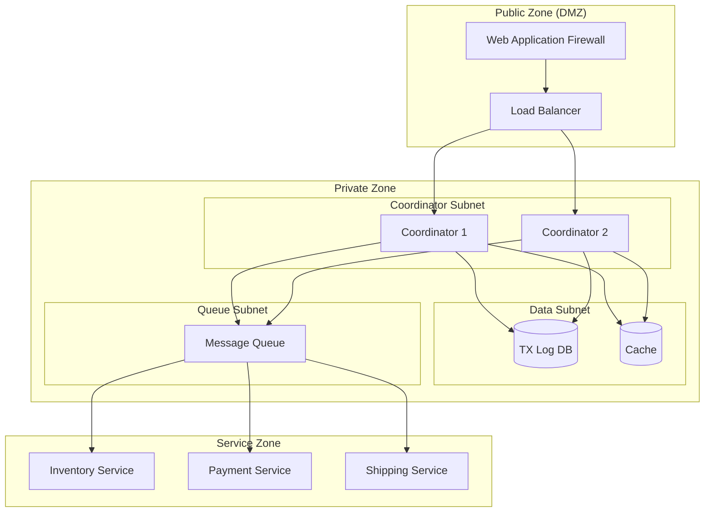

# Security and Compliance

[← Back to Index](./00-index.md)

---

## Threat Model

### Attack Surface Analysis

```
┌────────────────────────────────────────────────────────────────────┐
│ DISTRIBUTED TRANSACTION COORDINATOR ATTACK SURFACE                  │
├────────────────────────────────────────────────────────────────────┤
│                                                                     │
│   ┌─────────────┐          ┌─────────────────────┐                 │
│   │   Client    │──────────│  API Gateway/LB    │                 │
│   │             │          │ [A1: API Abuse]    │                 │
│   └─────────────┘          └──────────┬──────────┘                 │
│                                       │                            │
│                              [A2: Network MITM]                    │
│                                       │                            │
│                            ┌──────────▼──────────┐                 │
│                            │    Coordinator      │                 │
│                            │ [A3: Unauthorized   │                 │
│                            │  TX Manipulation]   │                 │
│                            └──────────┬──────────┘                 │
│                                       │                            │
│            ┌──────────────────────────┼──────────────────────┐    │
│            │                          │                       │    │
│   ┌────────▼────────┐      ┌─────────▼─────────┐    ┌────────▼───┐│
│   │  TX Log Store   │      │  Message Queue    │    │Participants││
│   │[A4: Data Breach]│      │[A5: Message Spoof]│    │[A6: Inject]││
│   └─────────────────┘      └───────────────────┘    └────────────┘│
│                                                                     │
│                                                                     │
│ Attack Vectors:                                                     │
│ A1: API Abuse - Unauthorized transaction creation, DDoS           │
│ A2: Network MITM - Intercepting transaction data, replay attacks  │
│ A3: TX Manipulation - Forging votes, corrupting state             │
│ A4: Data Breach - Accessing sensitive transaction data            │
│ A5: Message Spoofing - Injecting fake saga events                 │
│ A6: Participant Injection - Malicious service pretending to be    │
│                            legitimate participant                  │
│                                                                     │
└────────────────────────────────────────────────────────────────────┘
```

### Risk Assessment

| Threat | Likelihood | Impact | Risk Level | Mitigation |
|--------|------------|--------|------------|------------|
| **Unauthorized TX creation** | Medium | High | High | API authentication, rate limiting |
| **TX data interception** | Medium | High | High | mTLS, encryption |
| **Vote/state manipulation** | Low | Critical | High | Message signing, audit logging |
| **Replay attacks** | Medium | High | High | Idempotency, nonces |
| **Participant impersonation** | Low | Critical | High | mTLS, service identity |
| **Denial of Service** | High | Medium | Medium | Rate limiting, circuit breakers |
| **Data breach (at rest)** | Low | Critical | High | Encryption, access controls |

---

## Authentication and Authorization

### Service-to-Service Authentication

```
┌────────────────────────────────────────────────────────────────────┐
│ MTLS (MUTUAL TLS) ARCHITECTURE                                      │
├────────────────────────────────────────────────────────────────────┤
│                                                                     │
│  Certificate Authority (CA)                                        │
│  ┌────────────────────────────────────────────────────────────┐   │
│  │  Root CA (Offline, HSM-protected)                          │   │
│  │       │                                                     │   │
│  │       ├──► Intermediate CA (Coordinator signing)           │   │
│  │       │       │                                             │   │
│  │       │       └──► coordinator-1.tx.internal               │   │
│  │       │       └──► coordinator-2.tx.internal               │   │
│  │       │                                                     │   │
│  │       └──► Intermediate CA (Participant signing)           │   │
│  │               │                                             │   │
│  │               └──► inventory-service.svc.internal          │   │
│  │               └──► payment-service.svc.internal            │   │
│  └────────────────────────────────────────────────────────────┘   │
│                                                                     │
│  Connection Flow:                                                   │
│  ┌──────────────┐          TLS Handshake          ┌──────────────┐│
│  │  Coordinator │◄─────────────────────────────►│  Participant ││
│  │              │                                 │              ││
│  │  Presents:   │                                 │  Presents:   ││
│  │  - Server    │                                 │  - Client    ││
│  │    cert      │                                 │    cert      ││
│  │  - Chain     │                                 │  - Chain     ││
│  │              │                                 │              ││
│  │  Verifies:   │                                 │  Verifies:   ││
│  │  - Client    │                                 │  - Server    ││
│  │    cert      │                                 │    cert      ││
│  │  - Chain     │                                 │  - Chain     ││
│  └──────────────┘                                 └──────────────┘│
│                                                                     │
│  Certificate Rotation:                                              │
│  • Certificate validity: 90 days                                   │
│  • Automatic renewal: 30 days before expiry                        │
│  • Grace period: 7 days overlap                                    │
│                                                                     │
└────────────────────────────────────────────────────────────────────┘
```

### Client Authentication

```
┌────────────────────────────────────────────────────────────────────┐
│ CLIENT AUTHENTICATION FLOW                                          │
├────────────────────────────────────────────────────────────────────┤
│                                                                     │
│  Option A: API Key + HMAC Signature                                │
│                                                                     │
│  Request:                                                           │
│  POST /sagas                                                       │
│  Authorization: HMAC api_key_id:signature                          │
│  X-Timestamp: 1705312800                                           │
│  X-Nonce: abc123                                                   │
│                                                                     │
│  Signature = HMAC-SHA256(                                          │
│    secret_key,                                                     │
│    "POST\n/sagas\n1705312800\nabc123\n{body_hash}"                │
│  )                                                                 │
│                                                                     │
│  Validation:                                                       │
│  1. Lookup secret_key by api_key_id                               │
│  2. Verify timestamp within 5 minutes                              │
│  3. Check nonce not reused                                         │
│  4. Recompute signature and compare                                │
│                                                                     │
│ ─────────────────────────────────────────────────────────────────  │
│                                                                     │
│  Option B: JWT with Service Identity                               │
│                                                                     │
│  JWT Claims:                                                        │
│  {                                                                  │
│    "iss": "auth-service.internal",                                 │
│    "sub": "order-service",                                         │
│    "aud": "transaction-coordinator",                               │
│    "exp": 1705316400,                                              │
│    "iat": 1705312800,                                              │
│    "jti": "unique-token-id",                                       │
│    "scope": ["saga:create", "saga:read"]                          │
│  }                                                                  │
│                                                                     │
│  Validation:                                                       │
│  1. Verify signature with public key                               │
│  2. Check expiration                                               │
│  3. Validate audience                                              │
│  4. Check scope for requested operation                            │
│                                                                     │
└────────────────────────────────────────────────────────────────────┘
```

### Authorization Model

```
┌────────────────────────────────────────────────────────────────────┐
│ ROLE-BASED ACCESS CONTROL (RBAC)                                    │
├────────────────────────────────────────────────────────────────────┤
│                                                                     │
│ Roles:                                                              │
│ ┌────────────────────────────────────────────────────────────┐    │
│ │ tx_creator                                                  │    │
│ │   • Create new transactions/sagas                          │    │
│ │   • Read own transaction status                            │    │
│ │   • Cannot modify/cancel others' transactions              │    │
│ │                                                             │    │
│ │ tx_participant                                              │    │
│ │   • Receive prepare/commit/compensate commands             │    │
│ │   • Send votes/acknowledgments                             │    │
│ │   • Cannot create transactions                             │    │
│ │                                                             │    │
│ │ tx_admin                                                    │    │
│ │   • All tx_creator permissions                             │    │
│ │   • Cancel any transaction                                 │    │
│ │   • Force compensation                                     │    │
│ │   • View all transaction details                           │    │
│ │                                                             │    │
│ │ tx_auditor (read-only)                                     │    │
│ │   • Read all transaction logs                              │    │
│ │   • Export audit reports                                   │    │
│ │   • Cannot modify any data                                 │    │
│ └────────────────────────────────────────────────────────────┘    │
│                                                                     │
│ Permission Matrix:                                                  │
│                                                                     │
│ Operation          │ creator │ participant │ admin │ auditor       │
│ ───────────────────┼─────────┼─────────────┼───────┼───────        │
│ Create TX/Saga     │    ✓    │      ✗      │   ✓   │    ✗          │
│ Read Own TX        │    ✓    │      ✓      │   ✓   │    ✓          │
│ Read All TX        │    ✗    │      ✗      │   ✓   │    ✓          │
│ Cancel TX          │   Own   │      ✗      │  All  │    ✗          │
│ Force Compensate   │    ✗    │      ✗      │   ✓   │    ✗          │
│ Process Commands   │    ✗    │      ✓      │   ✓   │    ✗          │
│ Export Audit       │    ✗    │      ✗      │   ✓   │    ✓          │
│                                                                     │
└────────────────────────────────────────────────────────────────────┘
```

---

## Data Security

### Encryption at Rest

```
┌────────────────────────────────────────────────────────────────────┐
│ DATA ENCRYPTION AT REST                                             │
├────────────────────────────────────────────────────────────────────┤
│                                                                     │
│ Transaction Log Encryption:                                         │
│ ┌────────────────────────────────────────────────────────────┐    │
│ │                                                             │    │
│ │  ┌─────────────┐    ┌─────────────┐    ┌─────────────┐    │    │
│ │  │ TX Data     │───►│ DEK         │───►│ Encrypted   │    │    │
│ │  │ (plaintext) │    │ (per-table) │    │ Data        │    │    │
│ │  └─────────────┘    └──────┬──────┘    └─────────────┘    │    │
│ │                            │                               │    │
│ │                            │ encrypted with                │    │
│ │                            ▼                               │    │
│ │                     ┌─────────────┐                        │    │
│ │                     │ KEK (KMS)   │                        │    │
│ │                     │ (master key)│                        │    │
│ │                     └─────────────┘                        │    │
│ │                                                             │    │
│ │  Encryption: AES-256-GCM                                   │    │
│ │  Key Rotation: Every 90 days                               │    │
│ │  Key Storage: Hardware Security Module (HSM) or KMS        │    │
│ │                                                             │    │
│ └────────────────────────────────────────────────────────────┘    │
│                                                                     │
│ Sensitive Field Encryption:                                         │
│ ┌────────────────────────────────────────────────────────────┐    │
│ │                                                             │    │
│ │  Field-level encryption for PII in transaction payloads:  │    │
│ │                                                             │    │
│ │  {                                                          │    │
│ │    "transaction_id": "tx-123",      // not encrypted       │    │
│ │    "customer_id": "cust-456",       // not encrypted       │    │
│ │    "card_number": "ENC:aGVsbG8...", // encrypted           │    │
│ │    "ssn": "ENC:d29ybGQ...",         // encrypted           │    │
│ │    "amount": 100.00                 // not encrypted       │    │
│ │  }                                                          │    │
│ │                                                             │    │
│ │  Decryption: Only at point of use, with audit logging     │    │
│ │                                                             │    │
│ └────────────────────────────────────────────────────────────┘    │
│                                                                     │
└────────────────────────────────────────────────────────────────────┘
```

### Encryption in Transit

| Connection | Protocol | Cipher Suite |
|------------|----------|--------------|
| Client → Coordinator | TLS 1.3 | AES-256-GCM, ChaCha20-Poly1305 |
| Coordinator → Participant | mTLS 1.3 | AES-256-GCM |
| Coordinator → TX Log DB | TLS 1.3 | AES-256-GCM |
| Coordinator → Message Queue | TLS 1.3 | AES-256-GCM |
| Internal cluster | mTLS 1.3 | AES-256-GCM |

### Data Masking

```
┌────────────────────────────────────────────────────────────────────┐
│ DATA MASKING FOR LOGS AND DEBUGGING                                 │
├────────────────────────────────────────────────────────────────────┤
│                                                                     │
│ Original Transaction Payload:                                       │
│ {                                                                   │
│   "order_id": "ORD-12345",                                         │
│   "customer": {                                                    │
│     "name": "John Smith",                                          │
│     "email": "john@example.com",                                   │
│     "ssn": "123-45-6789"                                           │
│   },                                                               │
│   "payment": {                                                     │
│     "card_number": "4111-1111-1111-1111",                         │
│     "cvv": "123",                                                  │
│     "amount": 99.99                                                │
│   }                                                                │
│ }                                                                   │
│                                                                     │
│ Masked for Logging:                                                 │
│ {                                                                   │
│   "order_id": "ORD-12345",                                         │
│   "customer": {                                                    │
│     "name": "J*** S****",                                          │
│     "email": "j***@e******.com",                                   │
│     "ssn": "***-**-6789"                                           │
│   },                                                               │
│   "payment": {                                                     │
│     "card_number": "****-****-****-1111",                         │
│     "cvv": "***",                                                  │
│     "amount": 99.99                                                │
│   }                                                                │
│ }                                                                   │
│                                                                     │
│ Masking Rules:                                                      │
│ • PII: First letter visible, rest masked                          │
│ • Card numbers: Last 4 digits visible                              │
│ • CVV: Fully masked                                                │
│ • SSN: Last 4 digits visible                                       │
│ • Amounts: Not masked (needed for debugging)                       │
│                                                                     │
└────────────────────────────────────────────────────────────────────┘
```

---

## Audit and Compliance

### Audit Logging

```
┌────────────────────────────────────────────────────────────────────┐
│ AUDIT LOG SCHEMA                                                    │
├────────────────────────────────────────────────────────────────────┤
│                                                                     │
│ TABLE audit_log:                                                    │
│   event_id:           UUID          // Unique event identifier     │
│   timestamp:          TIMESTAMP     // Event time (UTC)            │
│   event_type:         VARCHAR       // e.g., TX_CREATED, TX_COMMIT│
│   actor:              VARCHAR       // Service/user identity       │
│   actor_ip:           INET          // Source IP address           │
│   resource_type:      VARCHAR       // e.g., "transaction", "saga"│
│   resource_id:        VARCHAR       // Transaction/saga ID         │
│   action:             VARCHAR       // CREATE, UPDATE, DELETE      │
│   old_value:          JSONB         // Previous state (if UPDATE) │
│   new_value:          JSONB         // New state                   │
│   correlation_id:     VARCHAR       // Request correlation ID      │
│   outcome:            VARCHAR       // SUCCESS, FAILURE, DENIED   │
│   failure_reason:     TEXT          // If FAILURE/DENIED          │
│                                                                     │
│ Example Entry:                                                      │
│ {                                                                   │
│   "event_id": "evt-789",                                           │
│   "timestamp": "2024-01-15T10:30:00Z",                            │
│   "event_type": "SAGA_COMPENSATION_TRIGGERED",                     │
│   "actor": "order-service",                                        │
│   "actor_ip": "10.0.1.50",                                         │
│   "resource_type": "saga",                                         │
│   "resource_id": "saga-12345",                                     │
│   "action": "UPDATE",                                              │
│   "old_value": {"state": "RUNNING", "step": 3},                   │
│   "new_value": {"state": "COMPENSATING", "step": 3},              │
│   "correlation_id": "req-abc123",                                  │
│   "outcome": "SUCCESS"                                             │
│ }                                                                   │
│                                                                     │
│ Retention: 7 years (configurable per compliance requirement)       │
│ Storage: Append-only, immutable                                    │
│ Integrity: Merkle tree hash chain                                  │
│                                                                     │
└────────────────────────────────────────────────────────────────────┘
```

### Events to Audit

| Category | Events | Required Fields |
|----------|--------|-----------------|
| **Transaction Lifecycle** | TX_CREATED, TX_PREPARED, TX_COMMITTED, TX_ABORTED | tx_id, participants, decision |
| **Saga Lifecycle** | SAGA_STARTED, SAGA_STEP_COMPLETED, SAGA_COMPENSATED | saga_id, step, input/output |
| **Authentication** | AUTH_SUCCESS, AUTH_FAILURE, TOKEN_ISSUED | actor, ip, reason |
| **Authorization** | AUTHZ_GRANTED, AUTHZ_DENIED | actor, resource, permission |
| **Admin Actions** | FORCE_COMPENSATE, TX_CANCEL, CONFIG_CHANGE | admin_id, reason, approval |
| **Data Access** | SENSITIVE_DATA_READ, EXPORT_REQUESTED | accessor, data_type, purpose |

### Compliance Requirements

```
┌────────────────────────────────────────────────────────────────────┐
│ COMPLIANCE MATRIX                                                   │
├────────────────────────────────────────────────────────────────────┤
│                                                                     │
│                    │  SOX    │  PCI-DSS │  GDPR   │  HIPAA  │      │
│ ───────────────────┼─────────┼──────────┼─────────┼─────────│      │
│ Audit logging      │    ✓    │    ✓     │    ✓    │    ✓    │      │
│ Access controls    │    ✓    │    ✓     │    ✓    │    ✓    │      │
│ Encryption at rest │    ✓    │    ✓     │    ✓    │    ✓    │      │
│ Encryption transit │    ✓    │    ✓     │    ✓    │    ✓    │      │
│ Key management     │    ✓    │    ✓     │    ✓    │    ✓    │      │
│ Log retention      │  7 yrs  │   1 yr   │  varies │  6 yrs  │      │
│ Data masking       │    -    │    ✓     │    ✓    │    ✓    │      │
│ Right to deletion  │    -    │    -     │    ✓    │    -    │      │
│ Breach notification│    -    │    ✓     │   72hr  │   60d   │      │
│                                                                     │
│ ─────────────────────────────────────────────────────────────────  │
│                                                                     │
│ SOX (Sarbanes-Oxley):                                              │
│ • Financial transaction audit trail                                │
│ • Change management controls                                       │
│ • Segregation of duties                                            │
│                                                                     │
│ PCI-DSS:                                                            │
│ • Card data never stored in transaction logs                       │
│ • Tokenization for card references                                 │
│ • Quarterly vulnerability scans                                    │
│                                                                     │
│ GDPR:                                                               │
│ • Data subject access requests (export transaction history)       │
│ • Right to erasure (anonymize completed transactions)              │
│ • Data minimization (only necessary data in transactions)          │
│                                                                     │
│ HIPAA:                                                              │
│ • PHI encryption in transaction payloads                          │
│ • Access logging for healthcare transactions                       │
│ • Business associate agreements with participants                  │
│                                                                     │
└────────────────────────────────────────────────────────────────────┘
```

---

## Network Security

### Network Segmentation



### Firewall Rules

| Source | Destination | Port | Protocol | Action |
|--------|-------------|------|----------|--------|
| WAF | Load Balancer | 443 | HTTPS | Allow |
| Load Balancer | Coordinators | 8443 | HTTPS | Allow |
| Coordinators | TX Log DB | 5432 | PostgreSQL/TLS | Allow |
| Coordinators | Cache | 6379 | Redis/TLS | Allow |
| Coordinators | Message Queue | 9093 | SASL_SSL | Allow |
| Message Queue | Participants | 8443 | HTTPS | Allow |
| Any | Any | Any | Any | Deny |

### Rate Limiting and DDoS Protection

```
┌────────────────────────────────────────────────────────────────────┐
│ RATE LIMITING CONFIGURATION                                         │
├────────────────────────────────────────────────────────────────────┤
│                                                                     │
│ Per-Client Limits:                                                  │
│ ┌────────────────────────────────────────────────────────────┐    │
│ │ Operation          │ Rate Limit      │ Burst   │ Window    │    │
│ │ ───────────────────┼─────────────────┼─────────┼───────    │    │
│ │ Create Transaction │ 100/sec         │ 200     │ 1 sec     │    │
│ │ Query Status       │ 1000/sec        │ 2000    │ 1 sec     │    │
│ │ Admin Operations   │ 10/sec          │ 20      │ 1 sec     │    │
│ └────────────────────────────────────────────────────────────┘    │
│                                                                     │
│ Global Limits:                                                      │
│ ┌────────────────────────────────────────────────────────────┐    │
│ │ Total API requests: 50,000/sec                             │    │
│ │ Concurrent connections: 10,000                             │    │
│ │ Request body size: 1MB max                                 │    │
│ └────────────────────────────────────────────────────────────┘    │
│                                                                     │
│ Response on Limit:                                                  │
│ HTTP 429 Too Many Requests                                         │
│ Retry-After: 60                                                    │
│ X-RateLimit-Remaining: 0                                           │
│ X-RateLimit-Reset: 1705313100                                      │
│                                                                     │
└────────────────────────────────────────────────────────────────────┘
```

---

## Message Integrity

### Message Signing

```
┌────────────────────────────────────────────────────────────────────┐
│ MESSAGE SIGNING FOR SAGA EVENTS                                     │
├────────────────────────────────────────────────────────────────────┤
│                                                                     │
│ Signed Message Structure:                                          │
│                                                                     │
│ {                                                                   │
│   "header": {                                                      │
│     "message_id": "msg-12345",                                     │
│     "timestamp": "2024-01-15T10:30:00Z",                          │
│     "sender": "order-service",                                     │
│     "signature_algorithm": "ECDSA-SHA256"                          │
│   },                                                               │
│   "payload": {                                                     │
│     "saga_id": "saga-67890",                                       │
│     "event_type": "InventoryReserved",                             │
│     "data": { ... }                                                │
│   },                                                               │
│   "signature": "MEUCIQDx...base64..."                              │
│ }                                                                   │
│                                                                     │
│ Signing Process:                                                   │
│ 1. Canonicalize header + payload (deterministic JSON)              │
│ 2. Sign with sender's private key                                  │
│ 3. Attach signature                                                │
│                                                                     │
│ Verification Process:                                               │
│ 1. Lookup sender's public key from certificate store               │
│ 2. Verify timestamp within acceptable window (5 minutes)           │
│ 3. Verify signature against canonicalized content                  │
│ 4. Check message_id not already processed (replay prevention)      │
│                                                                     │
│ Key Management:                                                     │
│ • Each service has signing key pair                                │
│ • Keys rotated every 30 days                                       │
│ • Public keys distributed via service mesh / PKI                   │
│                                                                     │
└────────────────────────────────────────────────────────────────────┘
```

---

## Security Monitoring

### Security Events

| Event | Severity | Action |
|-------|----------|--------|
| Multiple auth failures | Medium | Alert, temporary block |
| Unusual transaction pattern | Medium | Alert, review |
| Admin action without approval | High | Alert, audit |
| Certificate expiry warning | Low | Alert, auto-renew |
| Encryption key access | Medium | Log, audit |
| Rate limit exceeded | Low | Log, temporary block |
| Unauthorized API access attempt | High | Alert, block, investigate |

### Incident Response

```
┌────────────────────────────────────────────────────────────────────┐
│ SECURITY INCIDENT RESPONSE                                          │
├────────────────────────────────────────────────────────────────────┤
│                                                                     │
│ Severity Levels:                                                    │
│                                                                     │
│ SEV1 (Critical): Active breach, data exfiltration                 │
│   Response: Immediate isolation, executive notification            │
│   SLA: 15 minutes to acknowledge, 1 hour to contain               │
│                                                                     │
│ SEV2 (High): Potential breach, suspicious activity                │
│   Response: Investigation, enhanced monitoring                     │
│   SLA: 1 hour to acknowledge, 4 hours to investigate              │
│                                                                     │
│ SEV3 (Medium): Policy violation, failed attacks                   │
│   Response: Review, adjust controls                                │
│   SLA: 24 hours to review                                         │
│                                                                     │
│ Response Playbook:                                                  │
│ 1. Detection → Alert triggered                                     │
│ 2. Triage → Assess severity, assign responder                     │
│ 3. Containment → Isolate affected components                      │
│ 4. Investigation → Forensic analysis, root cause                  │
│ 5. Remediation → Fix vulnerability, patch systems                 │
│ 6. Recovery → Restore services, verify integrity                  │
│ 7. Post-mortem → Document lessons, update playbook                │
│                                                                     │
└────────────────────────────────────────────────────────────────────┘
```

---

## Summary

| Security Domain | Implementation | Standard |
|-----------------|----------------|----------|
| **Authentication** | mTLS + JWT | OAuth 2.0 |
| **Authorization** | RBAC | Least privilege |
| **Encryption (transit)** | TLS 1.3 | AES-256-GCM |
| **Encryption (rest)** | AES-256-GCM | FIPS 140-2 |
| **Audit Logging** | Immutable, 7 year retention | SOX, PCI-DSS |
| **Key Management** | HSM/KMS, 90-day rotation | NIST SP 800-57 |
| **Network Security** | Segmentation, WAF | Defense in depth |
| **Message Integrity** | ECDSA signing | Replay prevention |
