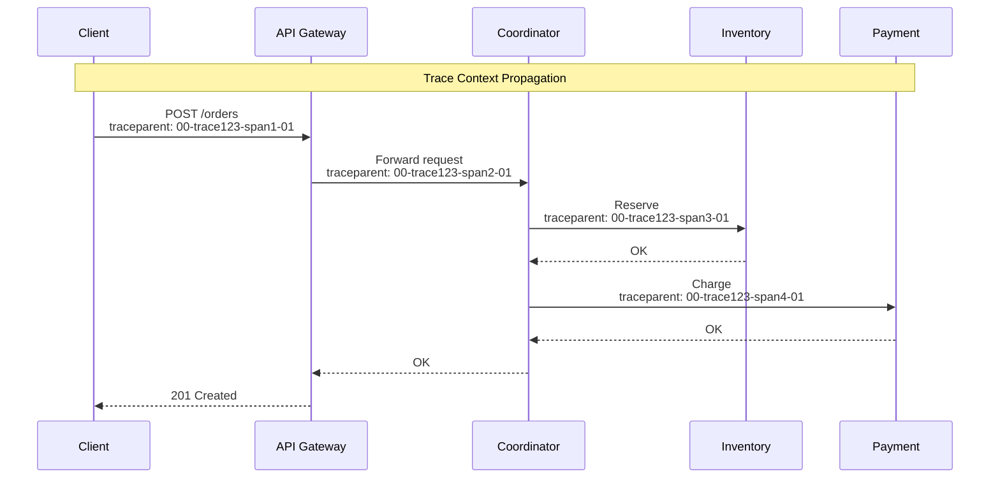

# Observability

[← Back to Index](./00-index.md)

---

## Metrics Strategy

### Key Performance Indicators (KPIs)

```
┌────────────────────────────────────────────────────────────────────┐
│ TRANSACTION COORDINATOR KPIS                                        │
├────────────────────────────────────────────────────────────────────┤
│                                                                     │
│ Availability:                                                       │
│   • Coordinator uptime: 99.99%                                     │
│   • Transaction success rate: > 99.5%                              │
│   • Compensation success rate: > 99.99%                            │
│                                                                     │
│ Latency:                                                            │
│   • 2PC transaction p50: < 50ms                                    │
│   • 2PC transaction p99: < 200ms                                   │
│   • Saga step p50: < 100ms                                         │
│   • Saga end-to-end p50: < 500ms                                   │
│                                                                     │
│ Throughput:                                                         │
│   • Transactions per second: target based on capacity              │
│   • Messages processed per second                                  │
│                                                                     │
│ Resource Utilization:                                               │
│   • CPU utilization: < 70%                                         │
│   • Memory utilization: < 80%                                      │
│   • Queue depth: < 1000 messages                                   │
│                                                                     │
└────────────────────────────────────────────────────────────────────┘
```

### RED Metrics (Rate, Errors, Duration)

```
┌────────────────────────────────────────────────────────────────────┐
│ RED METRICS FOR TRANSACTION COORDINATOR                             │
├────────────────────────────────────────────────────────────────────┤
│                                                                     │
│ Rate (Throughput):                                                  │
│ ┌────────────────────────────────────────────────────────────┐    │
│ │ tx_started_total                                            │    │
│ │   Labels: coordinator, tx_type (2pc, saga, tcc)            │    │
│ │   Description: Total transactions started                   │    │
│ │                                                             │    │
│ │ tx_completed_total                                          │    │
│ │   Labels: coordinator, tx_type, outcome (commit, abort,    │    │
│ │           compensate)                                       │    │
│ │   Description: Total transactions completed                 │    │
│ │                                                             │    │
│ │ saga_steps_executed_total                                   │    │
│ │   Labels: saga_type, step_name, outcome                    │    │
│ │   Description: Total saga steps executed                    │    │
│ │                                                             │    │
│ │ messages_processed_total                                    │    │
│ │   Labels: queue, message_type                              │    │
│ │   Description: Total messages consumed                      │    │
│ └────────────────────────────────────────────────────────────┘    │
│                                                                     │
│ Errors:                                                             │
│ ┌────────────────────────────────────────────────────────────┐    │
│ │ tx_errors_total                                             │    │
│ │   Labels: coordinator, tx_type, error_type                 │    │
│ │   Description: Total transaction errors                     │    │
│ │                                                             │    │
│ │ compensation_failures_total                                 │    │
│ │   Labels: saga_type, step_name                             │    │
│ │   Description: Compensations that failed                    │    │
│ │                                                             │    │
│ │ participant_errors_total                                    │    │
│ │   Labels: participant, error_type                          │    │
│ │   Description: Errors from participants                     │    │
│ │                                                             │    │
│ │ message_processing_errors_total                             │    │
│ │   Labels: queue, error_type                                │    │
│ │   Description: Message processing failures                  │    │
│ └────────────────────────────────────────────────────────────┘    │
│                                                                     │
│ Duration:                                                           │
│ ┌────────────────────────────────────────────────────────────┐    │
│ │ tx_duration_seconds                                         │    │
│ │   Type: Histogram                                           │    │
│ │   Buckets: 0.01, 0.05, 0.1, 0.25, 0.5, 1, 2.5, 5, 10      │    │
│ │   Labels: tx_type, outcome                                 │    │
│ │                                                             │    │
│ │ saga_step_duration_seconds                                  │    │
│ │   Type: Histogram                                           │    │
│ │   Labels: saga_type, step_name                             │    │
│ │                                                             │    │
│ │ saga_total_duration_seconds                                 │    │
│ │   Type: Histogram                                           │    │
│ │   Labels: saga_type, outcome                               │    │
│ │                                                             │    │
│ │ participant_response_seconds                                │    │
│ │   Type: Histogram                                           │    │
│ │   Labels: participant, operation (prepare, commit, etc.)   │    │
│ └────────────────────────────────────────────────────────────┘    │
│                                                                     │
└────────────────────────────────────────────────────────────────────┘
```

### USE Metrics (Utilization, Saturation, Errors)

| Resource | Utilization | Saturation | Errors |
|----------|-------------|------------|--------|
| **Coordinator CPU** | `cpu_usage_percent` | `runqueue_length` | N/A |
| **Coordinator Memory** | `memory_used_bytes` | `gc_pause_seconds` | `oom_kills_total` |
| **TX Log DB** | `db_connections_active` | `db_connections_waiting` | `db_errors_total` |
| **Message Queue** | `queue_messages_count` | `consumer_lag` | `message_errors_total` |
| **Network** | `bytes_sent/received` | `connection_queue_length` | `connection_errors_total` |

### Business Metrics

```
┌────────────────────────────────────────────────────────────────────┐
│ BUSINESS-LEVEL METRICS                                              │
├────────────────────────────────────────────────────────────────────┤
│                                                                     │
│ Transaction Success Rate:                                          │
│   tx_success_rate = tx_completed{outcome="commit"}                │
│                     / tx_started                                   │
│   Target: > 99.5%                                                  │
│                                                                     │
│ Compensation Rate:                                                  │
│   compensation_rate = tx_completed{outcome="compensate"}          │
│                       / tx_started                                 │
│   Alert if: > 5%                                                   │
│                                                                     │
│ Saga Completion Time by Type:                                       │
│   saga_completion_p95{saga_type="OrderSaga"}: < 1s                │
│   saga_completion_p95{saga_type="PaymentSaga"}: < 500ms           │
│                                                                     │
│ Active Transactions:                                                │
│   active_transactions_gauge                                        │
│   Labels: state (running, compensating, stuck)                    │
│   Alert if: stuck > 0 for 5 minutes                               │
│                                                                     │
│ Dead Letter Queue Size:                                             │
│   dlq_messages_count                                               │
│   Alert if: > 0 (requires manual intervention)                    │
│                                                                     │
└────────────────────────────────────────────────────────────────────┘
```

---

## Logging Strategy

### Structured Log Format

```
┌────────────────────────────────────────────────────────────────────┐
│ STRUCTURED LOG SCHEMA                                               │
├────────────────────────────────────────────────────────────────────┤
│                                                                     │
│ Standard Fields (all logs):                                        │
│ {                                                                   │
│   "timestamp": "2024-01-15T10:30:00.123Z",                        │
│   "level": "INFO",                                                 │
│   "service": "transaction-coordinator",                            │
│   "instance": "coord-1",                                           │
│   "trace_id": "abc123def456",                                      │
│   "span_id": "span789",                                            │
│   "correlation_id": "req-xyz",                                     │
│   "message": "Transaction committed",                              │
│   "event_type": "TX_COMMITTED"                                    │
│ }                                                                   │
│                                                                     │
│ Transaction-Specific Fields:                                       │
│ {                                                                   │
│   ...standard fields...,                                           │
│   "transaction_id": "tx-12345",                                    │
│   "transaction_type": "saga",                                      │
│   "saga_type": "OrderSaga",                                        │
│   "participant_count": 3,                                          │
│   "current_step": 2,                                               │
│   "state_before": "RUNNING",                                       │
│   "state_after": "COMPENSATING",                                   │
│   "duration_ms": 150,                                              │
│   "error_code": null,                                              │
│   "error_message": null                                            │
│ }                                                                   │
│                                                                     │
│ Participant Communication:                                         │
│ {                                                                   │
│   ...standard fields...,                                           │
│   "event_type": "PARTICIPANT_RESPONSE",                           │
│   "transaction_id": "tx-12345",                                    │
│   "participant": "inventory-service",                              │
│   "operation": "prepare",                                          │
│   "response_code": 200,                                            │
│   "vote": "COMMIT",                                                │
│   "latency_ms": 45                                                 │
│ }                                                                   │
│                                                                     │
└────────────────────────────────────────────────────────────────────┘
```

### Log Levels

| Level | Usage | Examples |
|-------|-------|----------|
| **ERROR** | Operation failures requiring attention | Compensation failure, DB connection lost |
| **WARN** | Potential issues, degraded operation | Retry triggered, slow participant |
| **INFO** | Normal operations, state changes | TX started, step completed, TX committed |
| **DEBUG** | Detailed debugging info | Request/response payloads, timing breakdown |
| **TRACE** | Very detailed, high volume | Every state machine transition |

### Log Sampling Strategy

```
┌────────────────────────────────────────────────────────────────────┐
│ LOG SAMPLING CONFIGURATION                                          │
├────────────────────────────────────────────────────────────────────┤
│                                                                     │
│ Always Log (100%):                                                 │
│ • ERROR and WARN levels                                            │
│ • Transaction start/complete events                                │
│ • Compensation events                                              │
│ • Authentication failures                                          │
│ • State transitions                                                │
│                                                                     │
│ Sampled (10%):                                                     │
│ • INFO level for successful operations                            │
│ • Participant communication (success)                              │
│                                                                     │
│ Debug Mode (on-demand):                                            │
│ • Enable per-transaction via header: X-Debug-Transaction: true    │
│ • Enable per-saga-type via config                                 │
│ • Full payload logging for specific transaction IDs               │
│                                                                     │
│ Sampling Rules:                                                     │
│ {                                                                   │
│   "rules": [                                                       │
│     {"level": "ERROR", "sample_rate": 1.0},                       │
│     {"level": "WARN", "sample_rate": 1.0},                        │
│     {"event_type": "TX_*", "sample_rate": 1.0},                   │
│     {"level": "INFO", "sample_rate": 0.1},                        │
│     {"level": "DEBUG", "sample_rate": 0.01}                       │
│   ]                                                                │
│ }                                                                   │
│                                                                     │
└────────────────────────────────────────────────────────────────────┘
```

---

## Distributed Tracing

### Trace Propagation



### Span Instrumentation

```
┌────────────────────────────────────────────────────────────────────┐
│ SPAN STRUCTURE FOR DISTRIBUTED TRANSACTIONS                         │
├────────────────────────────────────────────────────────────────────┤
│                                                                     │
│ Root Span: Transaction/Saga                                        │
│ ├── Span: Validate Request                                         │
│ ├── Span: Create Transaction Record                                │
│ │   └── Span: DB Write                                             │
│ ├── Span: Prepare Phase                                            │
│ │   ├── Span: Prepare Participant A                               │
│ │   │   ├── Span: HTTP Request                                    │
│ │   │   └── Span: Process Response                                │
│ │   └── Span: Prepare Participant B (parallel)                    │
│ │       ├── Span: HTTP Request                                    │
│ │       └── Span: Process Response                                │
│ ├── Span: Log Decision                                             │
│ │   └── Span: DB Write                                             │
│ ├── Span: Commit Phase                                             │
│ │   ├── Span: Commit Participant A                                │
│ │   └── Span: Commit Participant B                                │
│ └── Span: Finalize Transaction                                     │
│     └── Span: DB Write                                             │
│                                                                     │
│ Span Attributes:                                                    │
│ {                                                                   │
│   "tx.id": "tx-12345",                                             │
│   "tx.type": "saga",                                               │
│   "tx.saga_type": "OrderSaga",                                     │
│   "tx.step": "process-payment",                                    │
│   "tx.participant": "payment-service",                             │
│   "tx.outcome": "success",                                         │
│   "db.system": "postgresql",                                       │
│   "db.operation": "INSERT",                                        │
│   "http.method": "POST",                                           │
│   "http.status_code": 200                                          │
│ }                                                                   │
│                                                                     │
└────────────────────────────────────────────────────────────────────┘
```

### Trace Sampling

| Scenario | Sample Rate | Rationale |
|----------|-------------|-----------|
| All transactions | 1% | Baseline visibility |
| Failed transactions | 100% | Debug all failures |
| Slow transactions (> p95) | 100% | Performance analysis |
| Compensating sagas | 100% | Critical path |
| Specific transaction ID | 100% | On-demand debugging |
| High-value transactions | 100% | Business critical |

---

## Alerting

### Alert Definitions

```
┌────────────────────────────────────────────────────────────────────┐
│ CRITICAL ALERTS (Page On-Call)                                      │
├────────────────────────────────────────────────────────────────────┤
│                                                                     │
│ Alert: TransactionSuccessRateLow                                   │
│ Condition: tx_success_rate < 99% for 5 minutes                    │
│ Severity: CRITICAL                                                 │
│ Action: Page on-call, investigate failures                        │
│ Runbook: /runbooks/low-success-rate                               │
│                                                                     │
│ Alert: CompensationFailure                                         │
│ Condition: compensation_failures_total increases                  │
│ Severity: CRITICAL                                                 │
│ Action: Page on-call, may cause data inconsistency               │
│ Runbook: /runbooks/compensation-failure                           │
│                                                                     │
│ Alert: CoordinatorDown                                             │
│ Condition: coordinator_up == 0 for any coordinator                │
│ Severity: CRITICAL                                                 │
│ Action: Page on-call, check failover                              │
│ Runbook: /runbooks/coordinator-down                               │
│                                                                     │
│ Alert: TransactionLogWriteFailure                                  │
│ Condition: tx_log_write_errors > 0                                │
│ Severity: CRITICAL                                                 │
│ Action: Page on-call, durability at risk                          │
│ Runbook: /runbooks/tx-log-failure                                 │
│                                                                     │
└────────────────────────────────────────────────────────────────────┘
```

```
┌────────────────────────────────────────────────────────────────────┐
│ HIGH ALERTS (Notify Team)                                           │
├────────────────────────────────────────────────────────────────────┤
│                                                                     │
│ Alert: TransactionLatencyHigh                                      │
│ Condition: tx_duration_p99 > 500ms for 5 minutes                  │
│ Severity: HIGH                                                     │
│ Action: Notify team, investigate slow participants                │
│                                                                     │
│ Alert: QueueLagHigh                                                │
│ Condition: consumer_lag > 10000 for 5 minutes                     │
│ Severity: HIGH                                                     │
│ Action: Notify team, scale consumers                              │
│                                                                     │
│ Alert: DeadLetterQueueNotEmpty                                     │
│ Condition: dlq_messages_count > 0                                 │
│ Severity: HIGH                                                     │
│ Action: Notify team, manual intervention needed                   │
│                                                                     │
│ Alert: ParticipantErrorRateHigh                                    │
│ Condition: participant_error_rate > 5% for 5 minutes              │
│ Severity: HIGH                                                     │
│ Action: Notify team, check participant health                     │
│                                                                     │
└────────────────────────────────────────────────────────────────────┘
```

```
┌────────────────────────────────────────────────────────────────────┐
│ MEDIUM/LOW ALERTS (Log/Dashboard)                                   │
├────────────────────────────────────────────────────────────────────┤
│                                                                     │
│ Alert: ActiveTransactionsHigh                                      │
│ Condition: active_transactions > 80% capacity                     │
│ Severity: MEDIUM                                                   │
│ Action: Log, consider scaling                                     │
│                                                                     │
│ Alert: RetryRateElevated                                           │
│ Condition: retry_rate > 10%                                       │
│ Severity: MEDIUM                                                   │
│ Action: Log, investigate transient failures                       │
│                                                                     │
│ Alert: CPUUtilizationHigh                                          │
│ Condition: cpu_usage > 70% for 10 minutes                         │
│ Severity: LOW                                                      │
│ Action: Dashboard, consider scaling                               │
│                                                                     │
└────────────────────────────────────────────────────────────────────┘
```

### Alert Routing

| Severity | Notification Channel | Response Time |
|----------|---------------------|---------------|
| CRITICAL | PagerDuty, SMS, Phone | < 5 minutes |
| HIGH | Slack #alerts, Email | < 30 minutes |
| MEDIUM | Slack #ops | < 4 hours |
| LOW | Dashboard only | Next business day |

---

## Dashboards

### Operational Dashboard

```
┌────────────────────────────────────────────────────────────────────┐
│ TRANSACTION COORDINATOR - OPERATIONAL DASHBOARD                     │
├────────────────────────────────────────────────────────────────────┤
│                                                                     │
│ ┌─────────────────────────────────────────────────────────────┐   │
│ │ SERVICE HEALTH                                               │   │
│ │ ┌──────────┐  ┌──────────┐  ┌──────────┐  ┌──────────┐     │   │
│ │ │ Coord 1  │  │ Coord 2  │  │ Coord 3  │  │ TX Log   │     │   │
│ │ │   ✓ UP   │  │   ✓ UP   │  │   ✓ UP   │  │   ✓ UP   │     │   │
│ │ └──────────┘  └──────────┘  └──────────┘  └──────────┘     │   │
│ └─────────────────────────────────────────────────────────────┘   │
│                                                                     │
│ ┌──────────────────────────┐  ┌──────────────────────────────┐   │
│ │ THROUGHPUT               │  │ SUCCESS RATE                  │   │
│ │                          │  │                               │   │
│ │     ▲                    │  │  99.7%                       │   │
│ │   ▲ │ ▲ ▲               │  │  ████████████████░░          │   │
│ │  ▲  │  ▲  ▲ ▲ ▲        │  │                               │   │
│ │ ────┴─────────── time   │  │  Target: 99.5%               │   │
│ │ Current: 1,234 TPS      │  │                               │   │
│ └──────────────────────────┘  └──────────────────────────────┘   │
│                                                                     │
│ ┌──────────────────────────┐  ┌──────────────────────────────┐   │
│ │ LATENCY (p50/p99)        │  │ ACTIVE TRANSACTIONS          │   │
│ │                          │  │                               │   │
│ │ 2PC:  45ms / 180ms      │  │  Running:      1,234         │   │
│ │ Saga: 120ms / 450ms     │  │  Compensating:    12         │   │
│ │ TCC:  35ms / 150ms      │  │  Stuck:            0         │   │
│ │                          │  │                               │   │
│ └──────────────────────────┘  └──────────────────────────────┘   │
│                                                                     │
│ ┌─────────────────────────────────────────────────────────────┐   │
│ │ TRANSACTION STATES OVER TIME                                 │   │
│ │                                                              │   │
│ │ ████████ Running                                            │   │
│ │ ░░░░ Compensating                                           │   │
│ │ ▓▓ Failed                                                   │   │
│ │ ─────────────────────────────────────────────────── time    │   │
│ └─────────────────────────────────────────────────────────────┘   │
│                                                                     │
└────────────────────────────────────────────────────────────────────┘
```

### Debugging Dashboard

```
┌────────────────────────────────────────────────────────────────────┐
│ TRANSACTION DEBUGGING DASHBOARD                                     │
├────────────────────────────────────────────────────────────────────┤
│                                                                     │
│ Search: [tx-12345____________] [Search]                            │
│                                                                     │
│ ┌─────────────────────────────────────────────────────────────┐   │
│ │ TRANSACTION DETAILS                                          │   │
│ │                                                              │   │
│ │ ID:         tx-12345                                        │   │
│ │ Type:       Saga (OrderSaga)                                │   │
│ │ State:      COMPENSATING                                    │   │
│ │ Started:    2024-01-15 10:30:00 UTC                        │   │
│ │ Duration:   2.5 seconds (and counting)                      │   │
│ │ Correlation: req-abc123                                     │   │
│ └─────────────────────────────────────────────────────────────┘   │
│                                                                     │
│ ┌─────────────────────────────────────────────────────────────┐   │
│ │ STEP TIMELINE                                                │   │
│ │                                                              │   │
│ │ Step 1: Reserve Inventory    [✓ SUCCESS]  150ms             │   │
│ │ ├─ Request sent:  10:30:00.100                              │   │
│ │ ├─ Response:      10:30:00.250                              │   │
│ │ └─ Output: {"reservation_id": "res-789"}                   │   │
│ │                                                              │   │
│ │ Step 2: Process Payment      [✓ SUCCESS]  200ms             │   │
│ │ ├─ Request sent:  10:30:00.260                              │   │
│ │ ├─ Response:      10:30:00.460                              │   │
│ │ └─ Output: {"payment_id": "pay-456"}                       │   │
│ │                                                              │   │
│ │ Step 3: Schedule Shipping    [✗ FAILED]   timeout           │   │
│ │ ├─ Request sent:  10:30:00.470                              │   │
│ │ ├─ Timeout:       10:30:30.470 (30s)                        │   │
│ │ └─ Error: "Connection refused"                              │   │
│ │                                                              │   │
│ │ Compensation 2: Refund Payment [⏳ RUNNING]                  │   │
│ │ └─ Started: 10:30:30.500                                    │   │
│ │                                                              │   │
│ └─────────────────────────────────────────────────────────────┘   │
│                                                                     │
│ [View Full Trace] [View Logs] [Export JSON]                       │
│                                                                     │
└────────────────────────────────────────────────────────────────────┘
```

---

## Health Checks

### Liveness and Readiness

```
┌────────────────────────────────────────────────────────────────────┐
│ HEALTH CHECK ENDPOINTS                                              │
├────────────────────────────────────────────────────────────────────┤
│                                                                     │
│ GET /health/live                                                   │
│ Purpose: Is the process running?                                   │
│ Checks:                                                             │
│   - Process is up                                                  │
│   - Not in crash loop                                              │
│ Response:                                                           │
│   200 OK: {"status": "alive"}                                      │
│   503: {"status": "dead", "reason": "..."}                        │
│                                                                     │
│ ─────────────────────────────────────────────────────────────────  │
│                                                                     │
│ GET /health/ready                                                  │
│ Purpose: Can the service handle requests?                          │
│ Checks:                                                             │
│   - TX Log DB connection healthy                                   │
│   - Message queue connection healthy                               │
│   - Leader election status (if applicable)                         │
│   - Warmup complete                                                │
│ Response:                                                           │
│   200 OK: {"status": "ready", "checks": {...}}                    │
│   503: {"status": "not_ready", "failed_checks": [...]}            │
│                                                                     │
│ ─────────────────────────────────────────────────────────────────  │
│                                                                     │
│ GET /health/deep                                                   │
│ Purpose: Detailed health for debugging                             │
│ Response:                                                           │
│ {                                                                   │
│   "status": "healthy",                                             │
│   "checks": {                                                      │
│     "tx_log_db": {"status": "up", "latency_ms": 5},              │
│     "message_queue": {"status": "up", "lag": 100},               │
│     "cache": {"status": "up", "hit_rate": 0.95},                 │
│     "participants": {                                              │
│       "inventory": {"status": "up", "circuit": "closed"},        │
│       "payment": {"status": "up", "circuit": "closed"}           │
│     }                                                              │
│   },                                                               │
│   "version": "1.2.3",                                              │
│   "uptime_seconds": 86400                                         │
│ }                                                                   │
│                                                                     │
└────────────────────────────────────────────────────────────────────┘
```

---

## Runbooks

### Runbook: High Failure Rate

```
┌────────────────────────────────────────────────────────────────────┐
│ RUNBOOK: HIGH TRANSACTION FAILURE RATE                              │
├────────────────────────────────────────────────────────────────────┤
│                                                                     │
│ Trigger: tx_success_rate < 99% for 5 minutes                      │
│                                                                     │
│ Step 1: Assess Scope                                               │
│   - Check if failures are isolated to specific:                   │
│     - Saga type (OrderSaga, PaymentSaga, etc.)                   │
│     - Participant (inventory, payment, shipping)                  │
│     - Coordinator node                                            │
│   - Query: tx_errors_total by saga_type, participant              │
│                                                                     │
│ Step 2: Check Participant Health                                   │
│   - Verify all participants are up: GET /health/ready             │
│   - Check circuit breaker states                                  │
│   - Check participant error rates                                 │
│                                                                     │
│ Step 3: Check Infrastructure                                       │
│   - TX Log DB: connection count, query latency                    │
│   - Message Queue: consumer lag, error rate                       │
│   - Network: connectivity between coordinator and participants    │
│                                                                     │
│ Step 4: Examine Recent Errors                                      │
│   - Query error logs for pattern:                                 │
│     level:ERROR service:transaction-coordinator                   │
│   - Look for common error types:                                  │
│     - Timeout: participant slow or down                           │
│     - Connection refused: participant down                        │
│     - Vote ABORT: participant business logic rejection            │
│                                                                     │
│ Step 5: Mitigate                                                   │
│   - If participant down: engage participant team                  │
│   - If overloaded: scale coordinators/consumers                   │
│   - If timeout: increase timeout or investigate slowness          │
│                                                                     │
│ Step 6: Verify Recovery                                            │
│   - Monitor tx_success_rate returning to normal                   │
│   - Check no stuck transactions remain                            │
│                                                                     │
│ Escalation: If unresolved after 30 min → page senior engineer     │
│                                                                     │
└────────────────────────────────────────────────────────────────────┘
```

---

## Summary

| Pillar | Key Metrics | Tools |
|--------|-------------|-------|
| **Metrics** | TPS, success rate, latency p50/p99 | Time-series DB |
| **Logging** | Structured JSON, correlation IDs | Log aggregation |
| **Tracing** | End-to-end trace, span breakdown | Distributed tracing |
| **Alerting** | Critical: page, High: notify | Alerting platform |
| **Dashboards** | Operational, debugging views | Visualization |
| **Health Checks** | Liveness, readiness, deep | Built-in endpoints |
