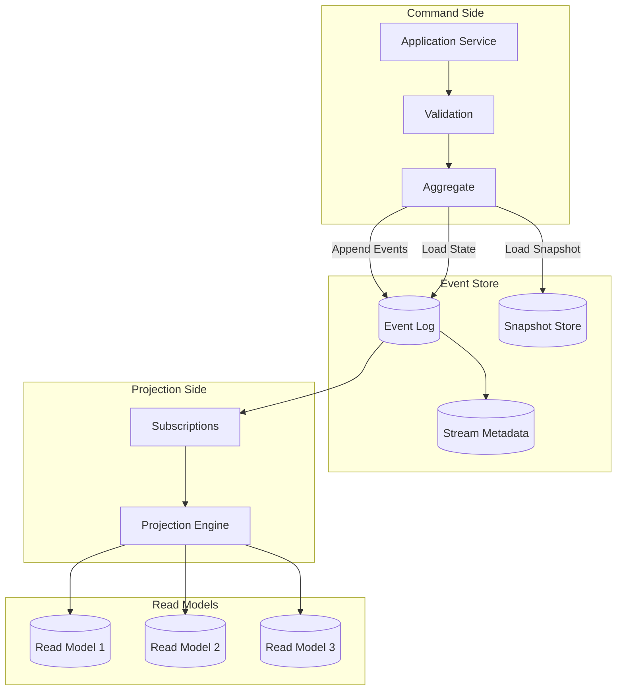
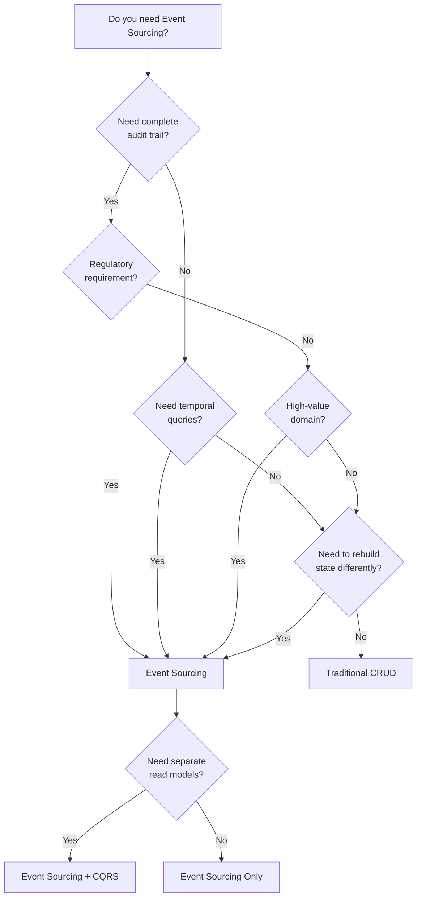
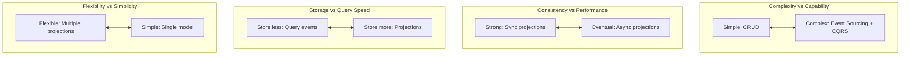

# Event Sourcing System

## System Design Document

| Attribute | Value |
|-----------|-------|
| **Complexity** | High |
| **Category** | Core Infrastructure |
| **Prerequisites** | Message Queue (1.6), Distributed Transaction Coordinator (1.17), Key-Value Store (1.3) |
| **Related Topics** | Distributed Transaction Coordinator (1.17), CQRS (1.19), Message Queue (1.6) |

---

## Quick Navigation

| Document | Description |
|----------|-------------|
| [01 - Requirements & Estimations](./01-requirements-and-estimations.md) | Functional/non-functional requirements, capacity planning |
| [02 - High-Level Design](./02-high-level-design.md) | Architecture diagrams, event store, projections |
| [03 - Low-Level Design](./03-low-level-design.md) | Event schema, APIs, replay algorithms |
| [04 - Deep Dive & Bottlenecks](./04-deep-dive-and-bottlenecks.md) | Schema evolution, projection consistency, hot aggregates |
| [05 - Scalability & Reliability](./05-scalability-and-reliability.md) | Stream partitioning, snapshot optimization, disaster recovery |
| [06 - Security & Compliance](./06-security-and-compliance.md) | Immutability, GDPR challenges, encryption |
| [07 - Observability](./07-observability.md) | Metrics, projection lag, event tracing |
| [08 - Interview Guide](./08-interview-guide.md) | 45-min pacing, trap questions, quick reference |

---

## System Overview

**Event Sourcing** is an architectural pattern where the state of an application is determined by a sequence of events. Instead of storing only the current state, the system persists every state change as an immutable event in an append-only log (Event Store). The current state is derived by replaying these events from the beginning or from a snapshot.



---

## What Makes Event Sourcing Valuable

| Aspect | Traditional CRUD | Event Sourcing |
|--------|------------------|----------------|
| **Data Model** | Current state only | Complete history of changes |
| **Audit Trail** | Requires separate logging | Built-in, immutable |
| **Temporal Queries** | Complex or impossible | Native ("what was state at time T?") |
| **Debugging** | Lost intermediate states | Replay to any point |
| **Schema Evolution** | Migration scripts | Upcasting/downcasting |
| **Recovery** | Restore from backup | Replay from events |
| **Analytics** | Limited to current data | Full behavioral history |

---

## Core Concepts

### Event Store

The Event Store is an append-only log that persists all events. Events are organized into **streams**, typically one stream per aggregate instance.

```
┌────────────────────────────────────────────────────────────────────┐
│ EVENT STORE STRUCTURE                                               │
├────────────────────────────────────────────────────────────────────┤
│                                                                     │
│  Stream: "order-123"                                               │
│  ┌─────────────────────────────────────────────────────────────┐   │
│  │ Position │ Event Type        │ Data              │ Timestamp │   │
│  ├──────────┼───────────────────┼───────────────────┼───────────┤   │
│  │ 0        │ OrderCreated      │ {items, customer} │ T1        │   │
│  │ 1        │ ItemAdded         │ {productId, qty}  │ T2        │   │
│  │ 2        │ PaymentReceived   │ {amount, method}  │ T3        │   │
│  │ 3        │ OrderShipped      │ {trackingNo}      │ T4        │   │
│  └─────────────────────────────────────────────────────────────┘   │
│                                                                     │
│  Stream: "order-456"                                               │
│  ┌─────────────────────────────────────────────────────────────┐   │
│  │ Position │ Event Type        │ Data              │ Timestamp │   │
│  ├──────────┼───────────────────┼───────────────────┼───────────┤   │
│  │ 0        │ OrderCreated      │ {items, customer} │ T5        │   │
│  │ 1        │ OrderCancelled    │ {reason}          │ T6        │   │
│  └─────────────────────────────────────────────────────────────┘   │
│                                                                     │
│  Key Properties:                                                    │
│  • Events are immutable (never updated or deleted)                 │
│  • Events are ordered within a stream                              │
│  • Each event has a unique global position and stream position     │
│                                                                     │
└────────────────────────────────────────────────────────────────────┘
```

### Event Replay

State is reconstructed by replaying events from the Event Store.

```
┌────────────────────────────────────────────────────────────────────┐
│ EVENT REPLAY PROCESS                                                │
├────────────────────────────────────────────────────────────────────┤
│                                                                     │
│  1. Load events from stream (or from snapshot)                     │
│  2. Apply each event to aggregate state                            │
│  3. Final state = result of all applications                       │
│                                                                     │
│  Example: Replaying "order-123"                                    │
│                                                                     │
│  Initial State: {}                                                 │
│                                                                     │
│  Apply OrderCreated:                                               │
│    state = {status: "created", items: [...], customer: "cust-1"}  │
│                                                                     │
│  Apply ItemAdded:                                                  │
│    state.items.push({productId: "prod-1", qty: 2})                │
│                                                                     │
│  Apply PaymentReceived:                                            │
│    state = {...state, status: "paid", payment: {...}}             │
│                                                                     │
│  Apply OrderShipped:                                               │
│    state = {...state, status: "shipped", tracking: "TRK123"}      │
│                                                                     │
│  Final State: {status: "shipped", items: [...], ...}              │
│                                                                     │
└────────────────────────────────────────────────────────────────────┘
```

### Snapshotting

For streams with many events, replaying from the beginning is slow. **Snapshots** are periodic state captures that optimize replay.

```
┌────────────────────────────────────────────────────────────────────┐
│ SNAPSHOTTING STRATEGY                                               │
├────────────────────────────────────────────────────────────────────┤
│                                                                     │
│  Without Snapshot:                                                  │
│  ┌─────┬─────┬─────┬─────┬─────┬─────┬─────┬─────┬─────┬─────┐    │
│  │ E0  │ E1  │ E2  │ E3  │ E4  │ E5  │ E6  │ E7  │ E8  │ E9  │    │
│  └─────┴─────┴─────┴─────┴─────┴─────┴─────┴─────┴─────┴─────┘    │
│  ← Replay all 10 events ────────────────────────────────────→      │
│                                                                     │
│  With Snapshot at E5:                                              │
│  ┌─────┬─────┬─────┬─────┬─────┐ ┌────┐ ┌─────┬─────┬─────┬─────┐ │
│  │ E0  │ E1  │ E2  │ E3  │ E4  │ │SNAP│ │ E6  │ E7  │ E8  │ E9  │ │
│  └─────┴─────┴─────┴─────┴─────┘ │ @5 │ └─────┴─────┴─────┴─────┘ │
│                                   └────┘                           │
│                                   Load snap + replay 4 events     │
│                                                                     │
│  Snapshot Triggers:                                                 │
│  • Event count threshold (e.g., every 100 events)                 │
│  • Time-based (e.g., daily)                                       │
│  • Size-based (e.g., when state exceeds threshold)                │
│                                                                     │
└────────────────────────────────────────────────────────────────────┘
```

### Projections

**Projections** are read-optimized views built by processing event streams. They transform the event log into queryable read models.

```
┌────────────────────────────────────────────────────────────────────┐
│ PROJECTIONS ARCHITECTURE                                            │
├────────────────────────────────────────────────────────────────────┤
│                                                                     │
│  Event Stream                                                       │
│  ┌─────────────────────────────────────────────────────────────┐   │
│  │ OrderCreated → ItemAdded → PaymentReceived → OrderShipped  │   │
│  └─────────────────────────────────────────────────────────────┘   │
│           │              │              │              │            │
│           ▼              ▼              ▼              ▼            │
│  ┌─────────────────────────────────────────────────────────────┐   │
│  │                   Projection Engine                          │   │
│  │  ┌─────────────────────────────────────────────────────────┐ │   │
│  │  │ Checkpoint: "global-position: 1234"                     │ │   │
│  │  └─────────────────────────────────────────────────────────┘ │   │
│  └─────────────────────────────────────────────────────────────┘   │
│           │              │              │                           │
│           ▼              ▼              ▼                           │
│  ┌──────────────┐ ┌──────────────┐ ┌──────────────┐                │
│  │ Order List   │ │ Revenue by   │ │ Customer     │                │
│  │ Read Model   │ │ Product      │ │ Order History│                │
│  │              │ │              │ │              │                │
│  │ Optimized for│ │ Aggregated   │ │ Denormalized │                │
│  │ listing/search│ │ analytics   │ │ for customer │                │
│  └──────────────┘ └──────────────┘ └──────────────┘                │
│                                                                     │
│  Projection Types:                                                  │
│  • Catch-up: Process historical events to build initial state     │
│  • Live: Process new events in real-time                          │
│  • Continuous: Combination of catch-up + live                      │
│                                                                     │
└────────────────────────────────────────────────────────────────────┘
```

---

## Pattern Comparison

| Aspect | Traditional CRUD | Event Sourcing | Event Sourcing + CQRS |
|--------|------------------|----------------|----------------------|
| **Write Model** | Single table/document | Event stream | Event stream |
| **Read Model** | Same as write | Replay from events | Dedicated projections |
| **Query Performance** | Direct reads | Slow (replay required) | Fast (pre-computed) |
| **Consistency** | Strong | Strong (stream) | Eventual (projections) |
| **Complexity** | Low | Medium | High |
| **Scalability** | Limited | Good | Excellent |

---

## Decision Matrix: When to Use Event Sourcing



---

## When to Use Event Sourcing

| Scenario | Recommended |
|----------|-------------|
| **Financial systems** | Yes - audit trail mandatory |
| **Healthcare records** | Yes - regulatory compliance |
| **E-commerce orders** | Yes - order history valuable |
| **Collaboration tools** | Yes - version history needed |
| **Gaming (player actions)** | Yes - replay and anti-cheat |
| **Simple CRUD apps** | No - overkill |
| **High-frequency updates** | Maybe - consider snapshot strategy |
| **Tight latency requirements** | Maybe - projections add latency |

---

## When NOT to Use Event Sourcing

| Scenario | Alternative |
|----------|-------------|
| **Simple CRUD with no audit needs** | Traditional database |
| **High write volume, low read** | Append-only log without replay |
| **Requires strong consistency on reads** | State-based with read replicas |
| **Team unfamiliar with pattern** | Start simpler, evolve if needed |
| **No business value from history** | Traditional CRUD |

---

## Real-World Implementations

| System | Type | Key Features | Use Case |
|--------|------|--------------|----------|
| **EventStoreDB** | Purpose-built | Native projections, subscriptions | General event sourcing |
| **Marten** | PostgreSQL-based | .NET integration, document store | .NET applications |
| **Axon Framework** | Framework | Java/Kotlin, CQRS integration | Enterprise Java |
| **Eventide** | Ruby framework | Message-based, autonomous services | Ruby microservices |
| **Kafka + Custom** | DIY | High throughput, exactly-once | Custom requirements |
| **DynamoDB Streams** | AWS managed | Serverless, CDC triggers | AWS-native apps |

---

## Key Trade-offs



### Trade-off Analysis

| Trade-off | Option A | Option B | Decision Factors |
|-----------|----------|----------|------------------|
| **Sync vs Async Projections** | Sync: Strong consistency | Async: Better performance | Read latency tolerance |
| **Snapshot Frequency** | Frequent: Fast replay | Infrequent: Less storage | Stream length, access patterns |
| **Schema Approach** | Weak schema: Flexible | Strong schema: Safe | Team discipline, evolution needs |
| **Event Granularity** | Fine-grained: Detailed | Coarse-grained: Simpler | Business requirements |

---

## Complexity Rating Breakdown

| Area | Complexity | Reason |
|------|------------|--------|
| **Basic Event Store** | Medium | Append-only is simple |
| **Replay Logic** | Medium | State reconstruction well-defined |
| **Snapshotting** | Medium | Strategy selection matters |
| **Projections** | High | Consistency, error handling |
| **Schema Evolution** | High | Upcasting/downcasting complexity |
| **CQRS Integration** | High | Two models to maintain |
| **Production Operations** | High | Debugging, projection rebuilds |

---

## Document Reading Order

### For Interview Prep (Time-Limited)
1. This index (overview)
2. [02 - High-Level Design](./02-high-level-design.md) (architecture diagrams)
3. [08 - Interview Guide](./08-interview-guide.md) (pacing, trade-offs)

### For Deep Understanding
1. All documents in order (00 → 08)
2. Focus on [04 - Deep Dive](./04-deep-dive-and-bottlenecks.md) for production challenges
3. Study [03 - Low-Level Design](./03-low-level-design.md) for algorithms

### For Production Design
1. [01 - Requirements](./01-requirements-and-estimations.md) (capacity planning)
2. [05 - Scalability](./05-scalability-and-reliability.md) (production concerns)
3. [06 - Security](./06-security-and-compliance.md) (GDPR, compliance)
4. [07 - Observability](./07-observability.md) (monitoring)

---

## Related System Designs

| Design | Relationship |
|--------|--------------|
| [1.17 Distributed Transaction Coordinator](../1.17-distributed-transaction-coordinator/00-index.md) | Saga with event sourcing |
| [1.6 Distributed Message Queue](../1.6-distributed-message-queue/00-index.md) | Event distribution |
| [1.5 Distributed Log-Based Broker](../1.5-distributed-log-based-broker/00-index.md) | Similar append-only architecture |
| [1.3 Distributed Key-Value Store](../1.3-distributed-key-value-store/00-index.md) | Snapshot storage |

---

## Further Reading

- Martin Fowler: Event Sourcing
- Microsoft Azure: Event Sourcing Pattern
- Greg Young: CQRS and Event Sourcing
- Kurrent.io (EventStoreDB): Event Sourcing Documentation
- Event-Driven.io: Projections and Read Models
- Event-Driven.io: Schema Versioning Patterns
