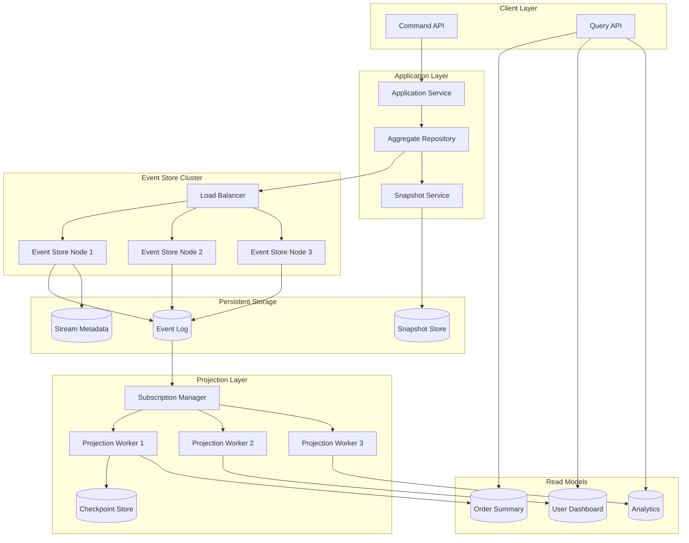
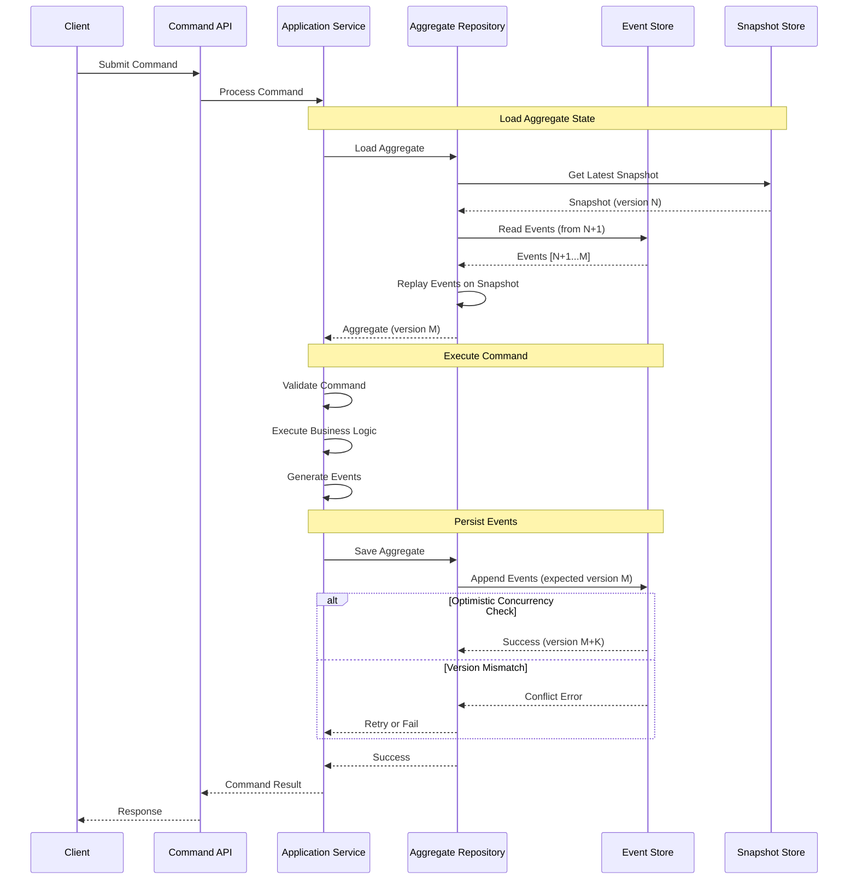
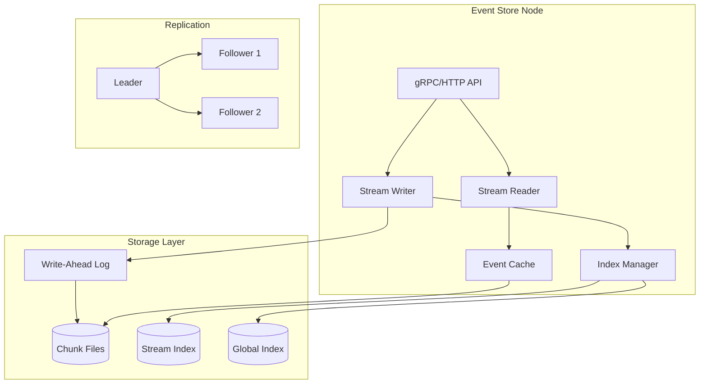
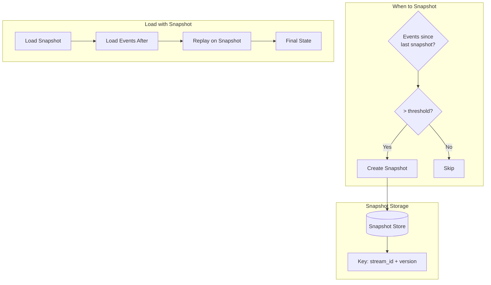
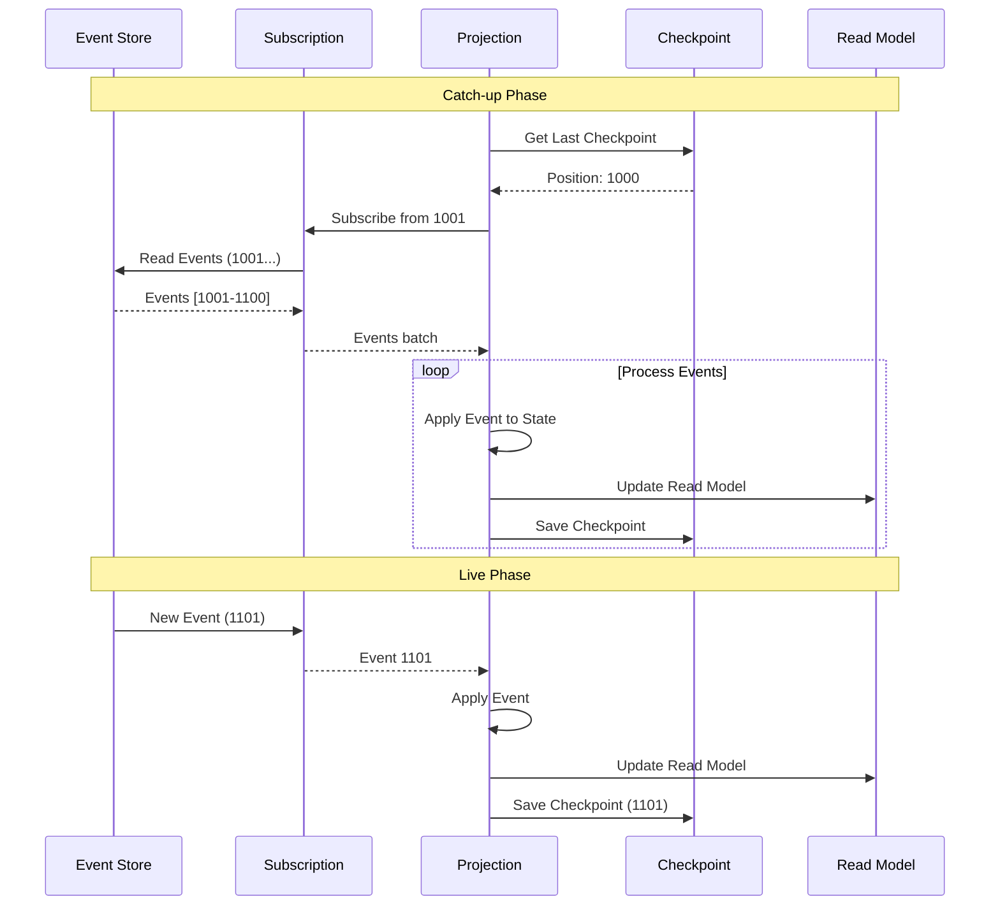
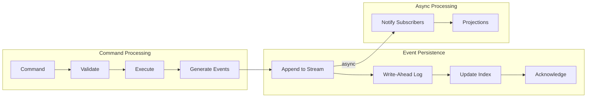
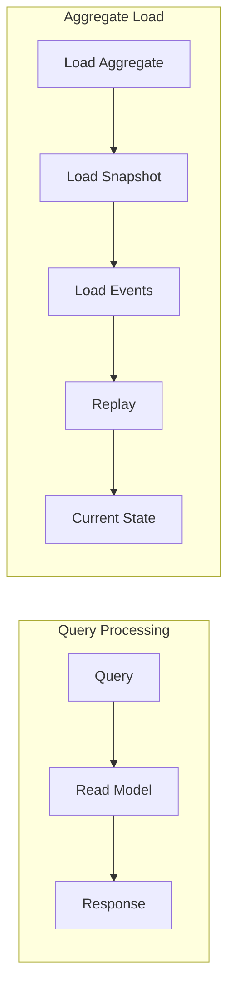
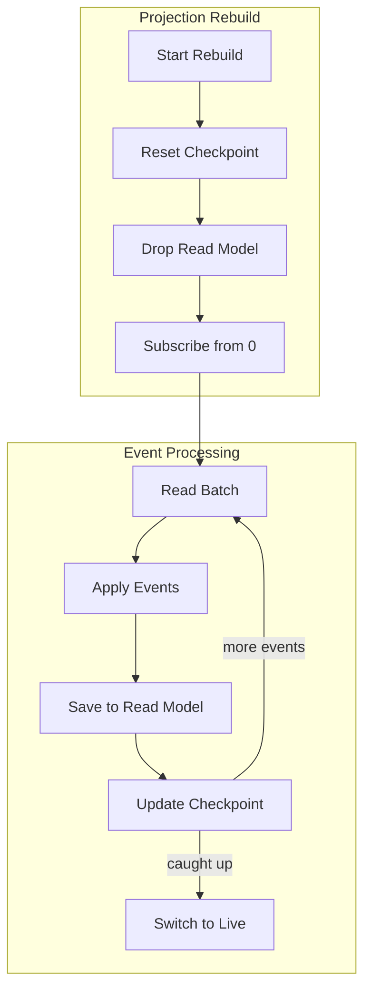

# High-Level Design

[← Back to Index](./00-index.md)

---

## System Architecture Overview

The Event Sourcing System consists of four primary components: the Event Store (append-only log), Snapshot Store, Projection Engine, and Read Models. Commands are processed by application services that emit events, which are then consumed by projections to build queryable read models.



### Component Responsibilities

| Component | Responsibility |
|-----------|----------------|
| **Application Service** | Handle commands, coordinate aggregate operations |
| **Aggregate Repository** | Load/save aggregates via events and snapshots |
| **Event Store** | Persist events, ensure ordering, provide subscriptions |
| **Snapshot Store** | Store periodic state snapshots for fast loading |
| **Subscription Manager** | Manage event subscriptions, distribute to projections |
| **Projection Workers** | Process events, update read models |
| **Checkpoint Store** | Track projection progress positions |
| **Read Models** | Query-optimized views for different use cases |

---

## Write Path Architecture

### Command Processing Flow



### Write Path Component Architecture

```
┌────────────────────────────────────────────────────────────────────┐
│ WRITE PATH ARCHITECTURE                                             │
├────────────────────────────────────────────────────────────────────┤
│                                                                     │
│  ┌─────────────────────────────────────────────────────────────┐   │
│  │                    APPLICATION SERVICE                       │   │
│  │  ┌──────────────┐  ┌──────────────┐  ┌──────────────┐      │   │
│  │  │   Command    │  │   Domain     │  │    Event     │      │   │
│  │  │   Handler    │→ │   Logic      │→ │   Emitter    │      │   │
│  │  └──────────────┘  └──────────────┘  └──────────────┘      │   │
│  └─────────────────────────────────────────────────────────────┘   │
│                              │                                      │
│                              ▼                                      │
│  ┌─────────────────────────────────────────────────────────────┐   │
│  │                   AGGREGATE REPOSITORY                       │   │
│  │  ┌──────────────┐  ┌──────────────┐  ┌──────────────┐      │   │
│  │  │   Snapshot   │  │   Event      │  │   Version    │      │   │
│  │  │   Loader     │  │   Replayer   │  │   Manager    │      │   │
│  │  └──────────────┘  └──────────────┘  └──────────────┘      │   │
│  └─────────────────────────────────────────────────────────────┘   │
│                              │                                      │
│                              ▼                                      │
│  ┌─────────────────────────────────────────────────────────────┐   │
│  │                      EVENT STORE                             │   │
│  │  ┌──────────────┐  ┌──────────────┐  ┌──────────────┐      │   │
│  │  │   Stream     │  │   Version    │  │   Global     │      │   │
│  │  │   Writer     │  │   Checker    │  │   Sequencer  │      │   │
│  │  └──────────────┘  └──────────────┘  └──────────────┘      │   │
│  └─────────────────────────────────────────────────────────────┘   │
│                                                                     │
└────────────────────────────────────────────────────────────────────┘
```

---

## Event Store Architecture

### Internal Structure



### Event Storage Format

```
┌────────────────────────────────────────────────────────────────────┐
│ EVENT STORAGE STRUCTURE                                             │
├────────────────────────────────────────────────────────────────────┤
│                                                                     │
│ Chunk File Structure:                                              │
│ ┌────────────────────────────────────────────────────────────────┐ │
│ │ Chunk Header                                                    │ │
│ │ ├── Chunk ID: uint64                                           │ │
│ │ ├── Start Position: uint64                                     │ │
│ │ ├── End Position: uint64                                       │ │
│ │ └── Checksum: uint32                                          │ │
│ ├────────────────────────────────────────────────────────────────┤ │
│ │ Event 1                                                        │ │
│ │ ├── Length: uint32                                            │ │
│ │ ├── Global Position: uint64                                   │ │
│ │ ├── Stream ID: string                                         │ │
│ │ ├── Stream Position: uint64                                   │ │
│ │ ├── Event Type: string                                        │ │
│ │ ├── Timestamp: uint64                                         │ │
│ │ ├── Metadata: bytes                                           │ │
│ │ ├── Data: bytes                                               │ │
│ │ └── CRC: uint32                                               │ │
│ ├────────────────────────────────────────────────────────────────┤ │
│ │ Event 2                                                        │ │
│ │ ...                                                            │ │
│ ├────────────────────────────────────────────────────────────────┤ │
│ │ Chunk Footer                                                   │ │
│ │ └── Total Events: uint32                                      │ │
│ └────────────────────────────────────────────────────────────────┘ │
│                                                                     │
│ Index Structure:                                                    │
│ ┌────────────────────────────────────────────────────────────────┐ │
│ │ Stream Index (per stream)                                      │ │
│ │ ├── Stream ID → [Position 0: Chunk:Offset, Position 1: ...]   │ │
│ │                                                                │ │
│ │ Global Index                                                   │ │
│ │ ├── Global Position → Chunk:Offset                            │ │
│ │                                                                │ │
│ │ Category Index                                                 │ │
│ │ ├── Category → [Stream IDs...]                                │ │
│ └────────────────────────────────────────────────────────────────┘ │
│                                                                     │
└────────────────────────────────────────────────────────────────────┘
```

---

## Snapshot Architecture

### Snapshot Strategy



### Snapshot Storage Options

| Storage | Pros | Cons | Use Case |
|---------|------|------|----------|
| **Same DB as events** | Transactional consistency | Storage growth | Small-medium systems |
| **Separate key-value store** | Fast reads, scalable | Extra infrastructure | Large systems |
| **Object storage** | Cost-effective, unlimited | Higher latency | Cold snapshots |
| **In-memory cache** | Fastest reads | Memory limits | Hot aggregates |

---

## Projection Architecture

### Projection Flow



### Projection Engine Architecture

```
┌────────────────────────────────────────────────────────────────────┐
│ PROJECTION ENGINE                                                   │
├────────────────────────────────────────────────────────────────────┤
│                                                                     │
│  ┌─────────────────────────────────────────────────────────────┐   │
│  │                   SUBSCRIPTION MANAGER                       │   │
│  │  ┌──────────────┐  ┌──────────────┐  ┌──────────────┐      │   │
│  │  │   $all       │  │   Stream     │  │   Category   │      │   │
│  │  │ Subscription │  │ Subscription │  │ Subscription │      │   │
│  │  └──────────────┘  └──────────────┘  └──────────────┘      │   │
│  └─────────────────────────────────────────────────────────────┘   │
│                              │                                      │
│                              ▼                                      │
│  ┌─────────────────────────────────────────────────────────────┐   │
│  │                   PROJECTION WORKERS                         │   │
│  │                                                              │   │
│  │  ┌────────────────────────────────────────────────────────┐ │   │
│  │  │ Worker 1: Order Projections                            │ │   │
│  │  │ ├── OrderSummaryProjection                            │ │   │
│  │  │ ├── OrderHistoryProjection                            │ │   │
│  │  │ └── Checkpoint: orders-checkpoint                      │ │   │
│  │  └────────────────────────────────────────────────────────┘ │   │
│  │                                                              │   │
│  │  ┌────────────────────────────────────────────────────────┐ │   │
│  │  │ Worker 2: Analytics Projections                        │ │   │
│  │  │ ├── RevenueByDayProjection                            │ │   │
│  │  │ ├── ProductMetricsProjection                          │ │   │
│  │  │ └── Checkpoint: analytics-checkpoint                   │ │   │
│  │  └────────────────────────────────────────────────────────┘ │   │
│  │                                                              │   │
│  └─────────────────────────────────────────────────────────────┘   │
│                              │                                      │
│                              ▼                                      │
│  ┌─────────────────────────────────────────────────────────────┐   │
│  │                     READ MODELS                              │   │
│  │  ┌──────────────┐  ┌──────────────┐  ┌──────────────┐      │   │
│  │  │  PostgreSQL  │  │   MongoDB    │  │ Elasticsearch │      │   │
│  │  │  (Orders)    │  │  (Documents) │  │   (Search)   │      │   │
│  │  └──────────────┘  └──────────────┘  └──────────────┘      │   │
│  └─────────────────────────────────────────────────────────────┘   │
│                                                                     │
└────────────────────────────────────────────────────────────────────┘
```

### Projection Types

| Type | Execution | Use Case | Consistency |
|------|-----------|----------|-------------|
| **Inline** | During write | Critical reads | Strong |
| **Async** | Background | Most read models | Eventual |
| **On-demand** | At query time | Rarely accessed | Real-time |
| **Catch-up** | Historical replay | Rebuilds | Batch |

---

## Subscription Architecture

### Subscription Types

```
┌────────────────────────────────────────────────────────────────────┐
│ SUBSCRIPTION TYPES                                                  │
├────────────────────────────────────────────────────────────────────┤
│                                                                     │
│ 1. Volatile Subscription (Live Only)                               │
│    ┌─────────────────────────────────────────────────────────────┐ │
│    │ Client connects → Only receives NEW events                  │ │
│    │ No checkpointing, client manages position                   │ │
│    │ Use: Real-time notifications, live dashboards               │ │
│    └─────────────────────────────────────────────────────────────┘ │
│                                                                     │
│ 2. Catch-up Subscription (Historical + Live)                       │
│    ┌─────────────────────────────────────────────────────────────┐ │
│    │ Client specifies start position                             │ │
│    │ Reads historical events, then switches to live              │ │
│    │ Client manages checkpoint                                   │ │
│    │ Use: Projection rebuilds, new consumers                     │ │
│    └─────────────────────────────────────────────────────────────┘ │
│                                                                     │
│ 3. Persistent Subscription (Server-managed)                        │
│    ┌─────────────────────────────────────────────────────────────┐ │
│    │ Server tracks checkpoint                                    │ │
│    │ Supports consumer groups (competing consumers)              │ │
│    │ Acknowledgment required                                     │ │
│    │ Use: Durable event processing, distributed consumers        │ │
│    └─────────────────────────────────────────────────────────────┘ │
│                                                                     │
└────────────────────────────────────────────────────────────────────┘
```

### Subscription Delivery Guarantees

| Mode | Guarantee | Trade-off |
|------|-----------|-----------|
| **At-most-once** | No redelivery | May lose events |
| **At-least-once** | Retry until ack | Requires idempotent handlers |
| **Exactly-once** | Dedup + at-least-once | Higher complexity |

---

## Key Design Decisions

### Decision 1: Event Storage Format

```
┌────────────────────────────────────────────────────────────────────┐
│ EVENT FORMAT OPTIONS                                                │
├────────────────────────────────────────────────────────────────────┤
│                                                                     │
│ Option A: JSON                                                      │
│   Pros: Human-readable, flexible schema, easy debugging            │
│   Cons: Larger size, slower parsing                                │
│   Example: {"orderId": "123", "amount": 99.99}                    │
│                                                                     │
│ Option B: Protocol Buffers                                         │
│   Pros: Compact, fast, schema evolution support                    │
│   Cons: Requires schema registry, less readable                    │
│   Example: Binary encoded                                          │
│                                                                     │
│ Option C: Avro                                                      │
│   Pros: Schema evolution, compact with schema                      │
│   Cons: Schema registry dependency                                 │
│   Example: Binary with schema fingerprint                          │
│                                                                     │
│ Decision: JSON for flexibility + optional Protobuf for hot paths   │
│                                                                     │
└────────────────────────────────────────────────────────────────────┘
```

### Decision 2: Stream Organization

| Strategy | Description | Use Case |
|----------|-------------|----------|
| **Per-aggregate** | One stream per aggregate instance | Most common, recommended |
| **Per-entity-type** | All entities of type in one stream | Small systems |
| **Category streams** | Virtual streams by event type | Cross-aggregate queries |
| **Partitioned** | Sharded by key | High-volume writes |

**Decision**: Per-aggregate with category projections for cross-aggregate queries.

### Decision 3: Projection Execution

```
┌────────────────────────────────────────────────────────────────────┐
│ PROJECTION EXECUTION OPTIONS                                        │
├────────────────────────────────────────────────────────────────────┤
│                                                                     │
│ Option A: Synchronous (In-process)                                 │
│   ┌──────────────────────────────────────────────────────────┐    │
│   │ Command → Events → Projection → Response                  │    │
│   │ Pros: Strong consistency, simple                         │    │
│   │ Cons: Slower writes, projection failure blocks writes    │    │
│   └──────────────────────────────────────────────────────────┘    │
│                                                                     │
│ Option B: Asynchronous (Background)                                │
│   ┌──────────────────────────────────────────────────────────┐    │
│   │ Command → Events → Response                              │    │
│   │                    ↓                                      │    │
│   │              Projection (async)                           │    │
│   │ Pros: Fast writes, decoupled                             │    │
│   │ Cons: Eventual consistency, projection lag               │    │
│   └──────────────────────────────────────────────────────────┘    │
│                                                                     │
│ Decision: Async by default, sync for critical consistency needs    │
│                                                                     │
└────────────────────────────────────────────────────────────────────┘
```

### Decision 4: Snapshot Strategy

| Strategy | Trigger | Trade-off |
|----------|---------|-----------|
| **Event count** | Every N events | Predictable, may snapshot unnecessarily |
| **Time-based** | Every T minutes | Regular, may not align with usage |
| **Size-based** | When state > threshold | Adaptive, complex to implement |
| **On-demand** | Explicit command | Manual, may forget |

**Decision**: Event count (every 100 events) with time-based fallback (daily for active streams).

---

## Data Flow Diagrams

### Write Path Data Flow



### Read Path Data Flow



### Projection Rebuild Flow



---

## Integration Points

### External System Integration

| System | Integration Method | Purpose |
|--------|-------------------|---------|
| **Message Queue** | Pub/sub | Distribute events to external systems |
| **Search Engine** | Projection | Build searchable indexes |
| **Analytics** | CDC/Export | Feed data warehouse |
| **Cache** | Projection | Maintain hot caches |
| **Monitoring** | Metrics export | Observability |

### API Contracts

```
┌────────────────────────────────────────────────────────────────────┐
│ EVENT STORE API                                                     │
├────────────────────────────────────────────────────────────────────┤
│                                                                     │
│ Write API:                                                          │
│   POST /streams/{streamId}/events                                  │
│   Headers: Expected-Version: {version}                             │
│   Body: [{ type, data, metadata }, ...]                           │
│                                                                     │
│ Read API:                                                           │
│   GET /streams/{streamId}?from={position}&count={count}           │
│   GET /streams/$all?from={globalPosition}&count={count}           │
│   GET /streams/{streamId}/metadata                                 │
│                                                                     │
│ Subscription API:                                                   │
│   WS /subscribe/streams/{streamId}?from={position}                │
│   WS /subscribe/$all?from={globalPosition}                        │
│   POST /subscriptions/{name}/ack/{eventId}                        │
│                                                                     │
│ Snapshot API:                                                       │
│   POST /snapshots/{streamId}                                       │
│   GET /snapshots/{streamId}/latest                                 │
│                                                                     │
│ Projection API:                                                     │
│   POST /projections                                                │
│   GET /projections/{name}/state                                   │
│   POST /projections/{name}/reset                                  │
│                                                                     │
└────────────────────────────────────────────────────────────────────┘
```

---

## Summary

| Component | Architecture Style | Key Decisions |
|-----------|-------------------|---------------|
| **Event Store** | Append-only log, replicated | Per-aggregate streams, global ordering |
| **Snapshots** | Key-value store | Event count trigger, separate storage |
| **Projections** | Async background workers | Checkpoint-based, idempotent |
| **Subscriptions** | Push-based with catch-up | At-least-once delivery |
| **Read Models** | Purpose-built databases | Technology per use case |
