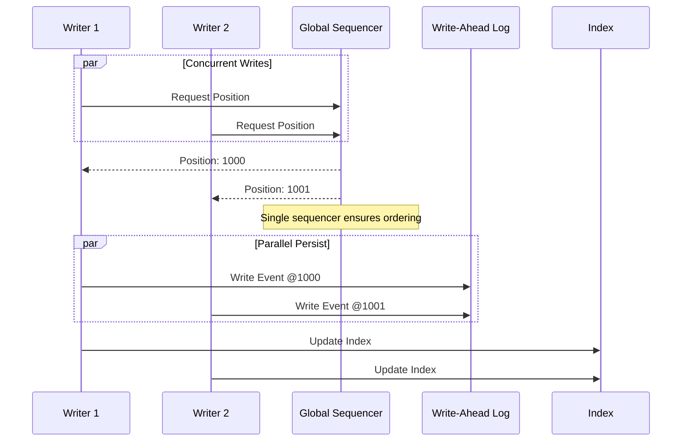
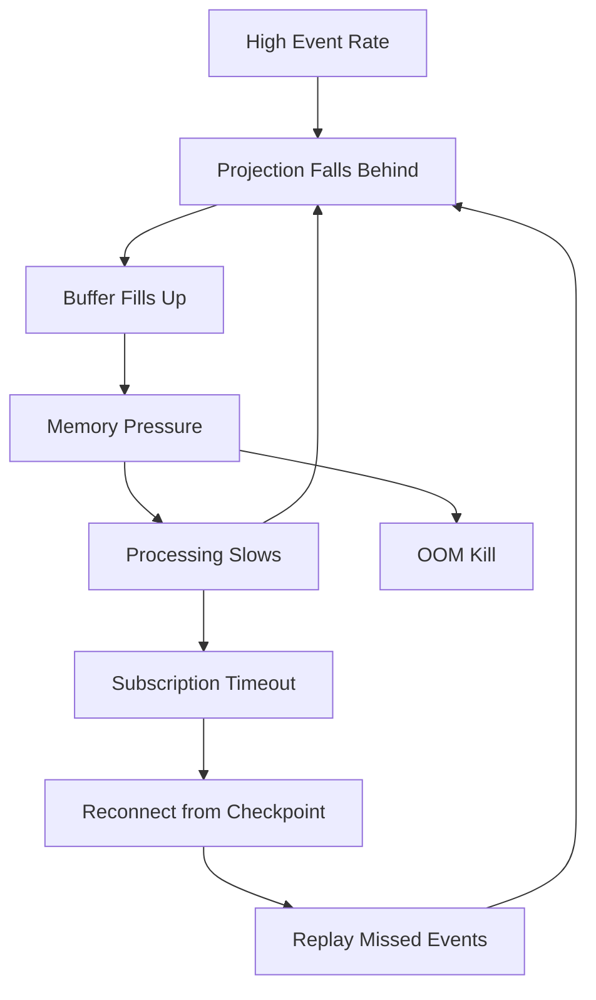

# Deep Dive and Bottlenecks

[← Back to Index](./00-index.md)

---

## Critical Component Analysis

### 1. Event Store Write Path

The Event Store write path is the most critical component. Every command results in events being durably stored.

```
┌────────────────────────────────────────────────────────────────────┐
│ EVENT STORE WRITE PATH DEEP DIVE                                    │
├────────────────────────────────────────────────────────────────────┤
│                                                                     │
│ Responsibilities:                                                   │
│ • Accept event append requests                                     │
│ • Validate optimistic concurrency                                  │
│ • Assign global position (total ordering)                          │
│ • Persist events durably                                           │
│ • Replicate to followers                                           │
│ • Notify subscribers                                               │
│                                                                     │
│ Critical Data Structures:                                           │
│ ┌────────────────────────────────────────────────────────────────┐ │
│ │ Write-Ahead Log (WAL):                                         │ │
│ │ ├── Append-only file                                           │ │
│ │ ├── Fsync on commit for durability                            │ │
│ │ └── Checkpoint periodically                                    │ │
│ │                                                                │ │
│ │ Global Position Counter:                                       │ │
│ │ ├── Single source of truth for ordering                       │ │
│ │ ├── Atomic increment                                           │ │
│ │ └── Potential bottleneck                                       │ │
│ │                                                                │ │
│ │ Stream Version Cache:                                          │ │
│ │ ├── In-memory map: stream_id → current_version                │ │
│ │ ├── Used for fast optimistic concurrency check                │ │
│ │ └── Must be consistent with persisted data                    │ │
│ └────────────────────────────────────────────────────────────────┘ │
│                                                                     │
│ Failure Scenarios:                                                  │
│                                                                     │
│ 1. Write fails after WAL commit                                    │
│    Impact: Event in WAL but not indexed                            │
│    Recovery: Replay WAL on startup, rebuild indexes                │
│                                                                     │
│ 2. Network partition during replication                            │
│    Impact: Followers may lag                                       │
│    Recovery: Catch-up replication when healed                      │
│                                                                     │
│ 3. Disk full                                                       │
│    Impact: Cannot accept new writes                                │
│    Mitigation: Alerts, archival, cleanup policies                  │
│                                                                     │
└────────────────────────────────────────────────────────────────────┘
```

### Global Position Assignment



### 2. Projection Engine

The projection engine transforms events into read models. Its reliability determines system consistency.

```
┌────────────────────────────────────────────────────────────────────┐
│ PROJECTION ENGINE DEEP DIVE                                         │
├────────────────────────────────────────────────────────────────────┤
│                                                                     │
│ Processing Modes:                                                   │
│                                                                     │
│ 1. Catch-up (Historical Replay):                                   │
│    ┌────────────────────────────────────────────────────────────┐  │
│    │ • Process events from checkpoint to current head           │  │
│    │ • Batch processing for efficiency                          │  │
│    │ • Can take hours for large event stores                    │  │
│    │ • Progress: events_processed / total_events                │  │
│    └────────────────────────────────────────────────────────────┘  │
│                                                                     │
│ 2. Live (Real-time):                                               │
│    ┌────────────────────────────────────────────────────────────┐  │
│    │ • Subscribe to new events                                  │  │
│    │ • Process immediately on arrival                           │  │
│    │ • Low latency required                                     │  │
│    │ • Must handle bursts                                       │  │
│    └────────────────────────────────────────────────────────────┘  │
│                                                                     │
│ Critical Concerns:                                                  │
│                                                                     │
│ • Ordering: Must process events in global order                    │
│ • Idempotency: Re-processing same event must be safe               │
│ • Error handling: What to do when projection fails?                │
│ • Consistency: Read model may lag behind write model               │
│                                                                     │
└────────────────────────────────────────────────────────────────────┘
```

### Projection Consistency Models

```
┌────────────────────────────────────────────────────────────────────┐
│ PROJECTION CONSISTENCY OPTIONS                                      │
├────────────────────────────────────────────────────────────────────┤
│                                                                     │
│ Option 1: Asynchronous (Eventually Consistent)                     │
│                                                                     │
│   Write ────► Event Store ────► Projection ────► Read Model        │
│                    │                  │                             │
│                    │              (async)                           │
│                    ▼                                                │
│              Response                                               │
│                                                                     │
│   Pros: Fast writes, decoupled                                     │
│   Cons: Stale reads possible, eventual consistency                 │
│                                                                     │
│ ─────────────────────────────────────────────────────────────────  │
│                                                                     │
│ Option 2: Synchronous (Strongly Consistent)                        │
│                                                                     │
│   Write ────► Event Store ────► Projection ────► Response          │
│                    │                  │                             │
│                    └──────────────────┘                             │
│                      (same transaction)                             │
│                                                                     │
│   Pros: Strong consistency, no lag                                 │
│   Cons: Slower writes, tight coupling                              │
│                                                                     │
│ ─────────────────────────────────────────────────────────────────  │
│                                                                     │
│ Option 3: Read-Your-Writes                                         │
│                                                                     │
│   Write ────► Event Store ────► Response (with position)           │
│                    │                                                │
│                    ▼                                                │
│   Read  ────► Wait for position ────► Read Model                   │
│                                                                     │
│   Pros: Balanced, user sees own writes                             │
│   Cons: More complex, requires position tracking                   │
│                                                                     │
└────────────────────────────────────────────────────────────────────┘
```

### 3. Snapshot Management

Snapshots are critical for performance but add complexity.

```
┌────────────────────────────────────────────────────────────────────┐
│ SNAPSHOT MANAGEMENT CHALLENGES                                      │
├────────────────────────────────────────────────────────────────────┤
│                                                                     │
│ Challenge 1: When to Snapshot                                       │
│ ─────────────────────────────                                      │
│                                                                     │
│ Strategy A: Every N events                                         │
│   threshold = 100 events                                           │
│   Pro: Predictable                                                 │
│   Con: May snapshot rarely-accessed aggregates                     │
│                                                                     │
│ Strategy B: Access-based                                           │
│   Snapshot on Nth reload without recent snapshot                   │
│   Pro: Adapts to access patterns                                   │
│   Con: First access after inactivity is slow                       │
│                                                                     │
│ Strategy C: Time-based                                             │
│   Snapshot if last snapshot > T hours old                          │
│   Pro: Bounded staleness                                           │
│   Con: May snapshot unchanged aggregates                           │
│                                                                     │
│ Recommended: Hybrid (N events OR access threshold)                 │
│                                                                     │
│ ─────────────────────────────────────────────────────────────────  │
│                                                                     │
│ Challenge 2: Snapshot Schema Evolution                             │
│ ──────────────────────────────────────                             │
│                                                                     │
│ When aggregate state schema changes:                               │
│                                                                     │
│ Option A: Version snapshots                                        │
│   Store schema_version with snapshot                               │
│   Migrate on load if needed                                        │
│   Pro: Simple, lazy migration                                      │
│   Con: Old snapshots accumulate                                    │
│                                                                     │
│ Option B: Invalidate on schema change                              │
│   Delete all snapshots when schema changes                         │
│   Pro: Clean, no migration code                                    │
│   Con: Performance hit during transition                           │
│                                                                     │
│ Option C: Background migration                                     │
│   Re-snapshot all aggregates with new schema                       │
│   Pro: No runtime impact                                           │
│   Con: Complex, resource intensive                                 │
│                                                                     │
└────────────────────────────────────────────────────────────────────┘
```

---

## Schema Evolution

### Event Versioning Strategies

```
┌────────────────────────────────────────────────────────────────────┐
│ SCHEMA EVOLUTION APPROACHES                                         │
├────────────────────────────────────────────────────────────────────┤
│                                                                     │
│ Approach 1: Weak Schema (Schema-on-Read)                           │
│ ─────────────────────────────────────────                          │
│   Events stored as JSON without strict schema validation           │
│                                                                     │
│   Event V1: {"orderId": "123", "amount": 100}                     │
│   Event V2: {"orderId": "123", "amount": 100, "currency": "USD"}  │
│                                                                     │
│   Reader handles missing fields with defaults                      │
│   Pro: Flexible, easy to evolve                                    │
│   Con: No compile-time safety, runtime errors possible             │
│                                                                     │
│ ─────────────────────────────────────────────────────────────────  │
│                                                                     │
│ Approach 2: Strong Schema with Upcasting                           │
│ ────────────────────────────────────────                           │
│   Events have explicit schema version, upcast on read              │
│                                                                     │
│   Stored: {type: "OrderCreated", version: 1, data: {...}}         │
│                                                                     │
│   Upcaster chain:                                                  │
│   V1 → V2: Add default currency                                   │
│   V2 → V3: Rename field                                           │
│                                                                     │
│   Read: Apply upcasters until current version                      │
│                                                                     │
│   Pro: Type safety, clear migration path                           │
│   Con: More code to maintain                                       │
│                                                                     │
│ ─────────────────────────────────────────────────────────────────  │
│                                                                     │
│ Approach 3: Copy-and-Transform                                     │
│ ──────────────────────────────                                     │
│   Create new event type, write migration events                    │
│                                                                     │
│   Old stream: [OrderCreatedV1, ...]                               │
│   Migration: Create compensating events to "transform"             │
│   Result: Application logic handles both versions                  │
│                                                                     │
│   Pro: Clear audit trail                                           │
│   Con: More events, more complexity                                │
│                                                                     │
└────────────────────────────────────────────────────────────────────┘
```

### Upcasting Implementation

```
┌────────────────────────────────────────────────────────────────────┐
│ UPCASTER IMPLEMENTATION EXAMPLE                                     │
├────────────────────────────────────────────────────────────────────┤
│                                                                     │
│ Event: OrderCreated                                                 │
│                                                                     │
│ Version 1 (original):                                              │
│ {                                                                   │
│   "orderId": "123",                                                │
│   "customerName": "John Doe",                                      │
│   "items": [{"sku": "ITEM1", "qty": 2}],                          │
│   "total": 99.99                                                   │
│ }                                                                   │
│                                                                     │
│ Version 2 (split customer name):                                   │
│ {                                                                   │
│   "orderId": "123",                                                │
│   "customer": {                                                    │
│     "firstName": "John",                                           │
│     "lastName": "Doe"                                              │
│   },                                                               │
│   "items": [{"sku": "ITEM1", "qty": 2}],                          │
│   "total": 99.99                                                   │
│ }                                                                   │
│                                                                     │
│ Upcaster V1 → V2:                                                  │
│ ─────────────────                                                  │
│ FUNCTION UpcastOrderCreatedV1ToV2(v1_data):                        │
│     parts = v1_data.customerName.split(" ")                        │
│     RETURN {                                                       │
│         "orderId": v1_data.orderId,                                │
│         "customer": {                                              │
│             "firstName": parts[0],                                 │
│             "lastName": parts[1] OR ""                             │
│         },                                                         │
│         "items": v1_data.items,                                    │
│         "total": v1_data.total                                     │
│     }                                                              │
│ END FUNCTION                                                       │
│                                                                     │
│ Registration:                                                       │
│ RegisterUpcaster("OrderCreated", 1, 2, UpcastOrderCreatedV1ToV2)   │
│                                                                     │
└────────────────────────────────────────────────────────────────────┘
```

---

## Production Pitfalls

### Pitfall 1: Out-of-Order Event Commits

```
┌────────────────────────────────────────────────────────────────────┐
│ OUT-OF-ORDER COMMITS                                                │
├────────────────────────────────────────────────────────────────────┤
│                                                                     │
│ Scenario: Two concurrent transactions get global positions but     │
│           commit in different order                                │
│                                                                     │
│   Transaction A                    Transaction B                   │
│   ─────────────                    ─────────────                   │
│   Get position: 100                Get position: 101               │
│   (slow disk I/O)                  Write to disk                   │
│                                    Commit (101 visible)            │
│   Write to disk                                                    │
│   Commit (100 visible)                                             │
│                                                                     │
│ Problem: Subscribers see 101 before 100                            │
│                                                                     │
│ Impact:                                                             │
│ • Projection processes events out of order                         │
│ • Causal relationships violated                                    │
│ • Inconsistent read models                                         │
│                                                                     │
│ Solutions:                                                          │
│                                                                     │
│ 1. Sequential writes (single writer)                               │
│    Serialize all writes through one thread                         │
│    Trade-off: Lower throughput                                     │
│                                                                     │
│ 2. Gap detection in subscribers                                    │
│    Subscribers wait for gaps to fill                               │
│    Trade-off: Added latency, complexity                            │
│                                                                     │
│ 3. Position assigned on commit                                     │
│    Position comes from commit log, not pre-assigned                │
│    Trade-off: Position unknown until commit                        │
│                                                                     │
└────────────────────────────────────────────────────────────────────┘
```

### Pitfall 2: Projection Rebuild Failures

```
┌────────────────────────────────────────────────────────────────────┐
│ PROJECTION REBUILD CHALLENGES                                       │
├────────────────────────────────────────────────────────────────────┤
│                                                                     │
│ Scenario: Projection needs rebuild after bug fix or new feature    │
│                                                                     │
│ Challenges:                                                         │
│                                                                     │
│ 1. Long rebuild time                                               │
│    100M events at 10K/sec = 2.7 hours                             │
│    System may be partially unavailable                             │
│                                                                     │
│ 2. Events written during rebuild                                   │
│    Old projection still processing live events                     │
│    New projection catching up on history                           │
│    Must coordinate switchover                                      │
│                                                                     │
│ 3. Schema changes during rebuild                                   │
│    New events have new schema                                      │
│    Old events being replayed have old schema                       │
│    Projection must handle both                                     │
│                                                                     │
│ 4. Memory pressure                                                  │
│    Processing backlog accumulates                                  │
│    May cause OOM if not throttled                                  │
│                                                                     │
│ Best Practices:                                                     │
│                                                                     │
│ • Blue-green projections: Build new alongside old, switch          │
│ • Incremental rebuilds: Rebuild portions, not everything           │
│ • Throttle rebuild rate: Leave capacity for live events           │
│ • Test rebuild on replica: Validate before production              │
│                                                                     │
└────────────────────────────────────────────────────────────────────┘
```

### Pitfall 3: Hot Aggregates

```
┌────────────────────────────────────────────────────────────────────┐
│ HOT AGGREGATE PROBLEM                                               │
├────────────────────────────────────────────────────────────────────┤
│                                                                     │
│ Scenario: Single aggregate receives very high write rate           │
│                                                                     │
│ Example: Global inventory counter, popular product                 │
│                                                                     │
│   Stream: "inventory-product-popular"                              │
│   Events/sec: 10,000 (every purchase)                              │
│   Stream length after 1 day: 864M events!                          │
│                                                                     │
│ Problems:                                                           │
│                                                                     │
│ 1. Concurrency conflicts                                           │
│    Many writers, constant version conflicts                        │
│    Retry storms, degraded throughput                               │
│                                                                     │
│ 2. Long replay time                                                │
│    Even with snapshots, backlog between snapshots grows            │
│    Load time increases continuously                                │
│                                                                     │
│ 3. Write amplification                                             │
│    Every update = new event + potential snapshot                   │
│    Significant I/O                                                 │
│                                                                     │
│ Solutions:                                                          │
│                                                                     │
│ 1. Shard the aggregate                                             │
│    inventory-product-popular-shard-1                               │
│    inventory-product-popular-shard-2                               │
│    Aggregate shards for reads                                      │
│                                                                     │
│ 2. Use CQRS for counters                                           │
│    Don't event source the counter                                  │
│    Use atomic increment in read model                              │
│                                                                     │
│ 3. Batch writes                                                    │
│    Collect updates, emit periodically                              │
│    Trade-off: Delayed consistency                                  │
│                                                                     │
└────────────────────────────────────────────────────────────────────┘
```

### Pitfall 4: Subscription Lag Spiral



```
┌────────────────────────────────────────────────────────────────────┐
│ SUBSCRIPTION LAG SPIRAL                                             │
├────────────────────────────────────────────────────────────────────┤
│                                                                     │
│ Scenario: Projection can't keep up with event rate                 │
│                                                                     │
│ Timeline:                                                           │
│   T0: Normal operation, lag = 0                                    │
│   T1: Traffic spike, processing slower than input                  │
│   T2: Lag grows to 10,000 events                                   │
│   T3: Memory buffer fills, GC pressure                             │
│   T4: Processing slows further due to GC                           │
│   T5: Lag reaches 100,000 events                                   │
│   T6: Subscription times out, reconnects                           │
│   T7: Replays from checkpoint, doubles the lag!                    │
│                                                                     │
│ Prevention:                                                         │
│                                                                     │
│ • Monitor lag, alert early                                         │
│ • Auto-scale projection workers                                    │
│ • Backpressure mechanisms                                          │
│ • Rate limit event production if necessary                         │
│ • Circuit breaker on projections                                   │
│                                                                     │
└────────────────────────────────────────────────────────────────────┘
```

---

## Race Conditions

### Race Condition 1: Concurrent Aggregate Modification

```
┌────────────────────────────────────────────────────────────────────┐
│ CONCURRENT MODIFICATION                                             │
├────────────────────────────────────────────────────────────────────┤
│                                                                     │
│ Scenario: Two users modify same order simultaneously               │
│                                                                     │
│   User A                            User B                         │
│   ──────                            ──────                         │
│   Load order (version=5)            Load order (version=5)         │
│   Add item                          Remove item                    │
│   Save (expect version=5)           Save (expect version=5)        │
│   Success! (version=6)              CONFLICT! (current=6)          │
│                                                                     │
│ Handling Conflict:                                                  │
│                                                                     │
│ Option A: Retry                                                    │
│   Reload aggregate, re-apply command                               │
│   May succeed or conflict again                                    │
│   Suitable for: Non-conflicting operations                         │
│                                                                     │
│ Option B: Merge                                                    │
│   If commands are commutative, merge changes                       │
│   Suitable for: Counters, sets                                     │
│                                                                     │
│ Option C: Fail                                                     │
│   Return error to user, ask to refresh                             │
│   Suitable for: Conflicting operations                             │
│                                                                     │
│ Implementation:                                                     │
│                                                                     │
│ FUNCTION SaveAggregate(aggregate, expected_version):               │
│     TRY:                                                           │
│         AppendEvents(aggregate.stream_id,                          │
│                      aggregate.uncommitted_events,                 │
│                      expected_version)                             │
│     CATCH WrongExpectedVersionException:                           │
│         IF can_retry AND retry_count < max_retries:               │
│             aggregate = LoadAggregate(stream_id)                   │
│             command.Execute(aggregate)  // Re-execute             │
│             RETURN SaveAggregate(aggregate, aggregate.version)    │
│         ELSE:                                                      │
│             THROW ConcurrencyConflictException                     │
│         END IF                                                     │
│     END TRY                                                        │
│ END FUNCTION                                                       │
│                                                                     │
└────────────────────────────────────────────────────────────────────┘
```

### Race Condition 2: Projection Checkpoint vs Event Delivery

```
┌────────────────────────────────────────────────────────────────────┐
│ CHECKPOINT RACE CONDITION                                           │
├────────────────────────────────────────────────────────────────────┤
│                                                                     │
│ Scenario: Projection crashes between processing and checkpointing  │
│                                                                     │
│   Processing                       Checkpointing                   │
│   ──────────                       ─────────────                   │
│   Read event @1000                                                 │
│   Apply to read model                                              │
│   (SUCCESS)                                                        │
│                                    Save checkpoint = 1000          │
│                                    ❌ CRASH before commit           │
│                                                                     │
│ On Restart:                                                         │
│   Load checkpoint: 999                                             │
│   Resume from 1000                                                 │
│   Re-process event @1000                                           │
│   ⚠️  DUPLICATE PROCESSING                                         │
│                                                                     │
│ Solution: Idempotent Projections                                   │
│                                                                     │
│ 1. Use event_id as dedup key                                       │
│    IF read_model.contains(event_id):                               │
│        SKIP                                                        │
│                                                                     │
│ 2. Transactional checkpoint with read model                        │
│    BEGIN TRANSACTION:                                              │
│        UPDATE read_model                                           │
│        UPDATE checkpoint                                           │
│    COMMIT                                                          │
│                                                                     │
│ 3. Store processed position in read model                          │
│    Read model row has: data + last_processed_position              │
│    Skip if position <= last_processed                              │
│                                                                     │
└────────────────────────────────────────────────────────────────────┘
```

---

## Bottleneck Analysis

### Bottleneck 1: Global Position Sequencer

```
┌────────────────────────────────────────────────────────────────────┐
│ GLOBAL SEQUENCER BOTTLENECK                                         │
├────────────────────────────────────────────────────────────────────┤
│                                                                     │
│ Problem:                                                            │
│ • Single point for assigning global positions                      │
│ • All writes must coordinate through sequencer                     │
│ • Throughput limited by sequencer capacity                         │
│                                                                     │
│ Bottleneck Metrics:                                                 │
│ ┌────────────────────────────────────────────────────────────┐    │
│ │ Atomic counter: ~1M increments/sec                         │    │
│ │ With persistence: ~100K/sec                                │    │
│ │ With replication: ~50K/sec                                 │    │
│ │                                                             │    │
│ │ This limits global event rate to ~50K events/sec           │    │
│ └────────────────────────────────────────────────────────────┘    │
│                                                                     │
│ Solutions:                                                          │
│                                                                     │
│ 1. Batch position assignment                                       │
│    Request range of positions, use locally                         │
│    Trade-off: Gaps in position sequence                            │
│                                                                     │
│ 2. Hierarchical ordering                                           │
│    {epoch}.{partition}.{local_sequence}                            │
│    Global order within epoch, not absolute                         │
│                                                                     │
│ 3. Accept partial ordering                                         │
│    Only guarantee ordering within stream                           │
│    Cross-stream ordering via timestamps                            │
│                                                                     │
└────────────────────────────────────────────────────────────────────┘
```

### Bottleneck 2: Long Event Streams

```
┌────────────────────────────────────────────────────────────────────┐
│ LONG STREAM BOTTLENECK                                              │
├────────────────────────────────────────────────────────────────────┤
│                                                                     │
│ Problem:                                                            │
│ • Some aggregates accumulate many events                           │
│ • Loading requires reading all events since snapshot               │
│ • Long load times affect latency                                   │
│                                                                     │
│ Example:                                                            │
│   User aggregate with 10 years of activity                         │
│   Events: 100,000+                                                 │
│   Snapshot every 1000 events = 100 snapshots                       │
│   Events since last snapshot: up to 999                            │
│   Load time: ~100ms (acceptable)                                   │
│                                                                     │
│   BUT if snapshot fails or is stale:                               │
│   Load time: 100,000 events × 0.1ms = 10 seconds!                 │
│                                                                     │
│ Solutions:                                                          │
│                                                                     │
│ 1. Aggressive snapshotting                                         │
│    Snapshot every 100 events instead of 1000                       │
│    Trade-off: More storage, more snapshot I/O                      │
│                                                                     │
│ 2. Stream archival                                                  │
│    Archive events older than snapshot to cold storage              │
│    Trade-off: Full replay requires archive access                  │
│                                                                     │
│ 3. Stream splitting                                                 │
│    Create new stream periodically (yearly?)                        │
│    Link streams via metadata                                       │
│    Trade-off: Complex querying across streams                      │
│                                                                     │
└────────────────────────────────────────────────────────────────────┘
```

### Bottleneck 3: Projection Throughput

```
┌────────────────────────────────────────────────────────────────────┐
│ PROJECTION THROUGHPUT BOTTLENECK                                    │
├────────────────────────────────────────────────────────────────────┤
│                                                                     │
│ Problem:                                                            │
│ • Projections must keep up with event rate                         │
│ • Single projection processes events sequentially                  │
│ • Complex projections may be slow                                  │
│                                                                     │
│ Throughput Analysis:                                                │
│ ┌────────────────────────────────────────────────────────────┐    │
│ │ Event rate: 10,000 events/sec                              │    │
│ │ Projection processing: 1ms/event                           │    │
│ │ Single worker throughput: 1,000 events/sec                 │    │
│ │ Required workers: 10                                       │    │
│ │                                                             │    │
│ │ With database writes:                                       │    │
│ │ Processing: 1ms, DB write: 5ms = 6ms/event                │    │
│ │ Single worker: 166 events/sec                              │    │
│ │ Required workers: 60!                                       │    │
│ └────────────────────────────────────────────────────────────┘    │
│                                                                     │
│ Solutions:                                                          │
│                                                                     │
│ 1. Batch updates                                                    │
│    Accumulate updates, write in batches                            │
│    Trade-off: Delayed visibility, crash risk                       │
│                                                                     │
│ 2. Parallel projections                                            │
│    Partition events, parallel workers                              │
│    Trade-off: Complex ordering guarantees                          │
│                                                                     │
│ 3. Simplify projection logic                                       │
│    Pre-compute, denormalize, avoid joins                           │
│    Trade-off: More storage, simpler reads                          │
│                                                                     │
└────────────────────────────────────────────────────────────────────┘
```

---

## Summary

| Challenge | Impact | Mitigation |
|-----------|--------|------------|
| Out-of-order commits | Inconsistent projections | Single writer, gap detection |
| Projection rebuild | Long downtime | Blue-green, incremental |
| Hot aggregates | Contention, long streams | Sharding, batching |
| Schema evolution | Migration complexity | Upcasting, versioning |
| Subscription lag | Growing backlog | Auto-scaling, backpressure |
| Concurrent modification | Conflicts | Optimistic concurrency, retry |
| Checkpoint races | Duplicate processing | Idempotent projections |
| Global sequencer | Throughput limit | Batching, partial ordering |
