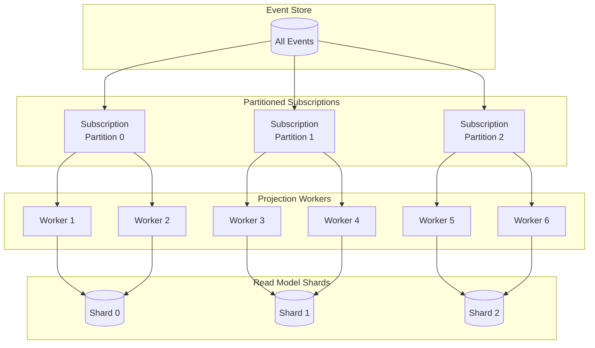
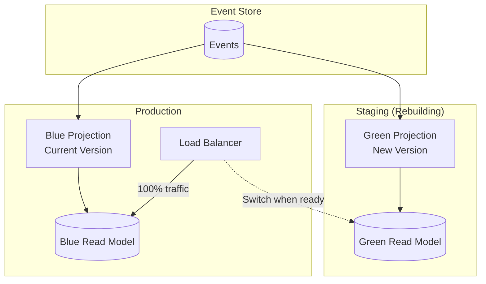
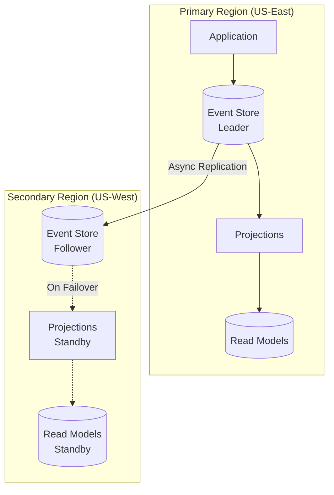

# Scalability and Reliability

[← Back to Index](./00-index.md)

---

## Horizontal Scaling Strategies

### Event Store Scaling

```
┌────────────────────────────────────────────────────────────────────┐
│ EVENT STORE SCALING OPTIONS                                         │
├────────────────────────────────────────────────────────────────────┤
│                                                                     │
│ Option 1: Single Leader with Read Replicas                         │
│ ──────────────────────────────────────────                         │
│   ┌─────────┐                                                      │
│   │ Leader  │ ← All writes                                         │
│   │ (Write) │                                                      │
│   └────┬────┘                                                      │
│        │ Replication                                               │
│   ┌────┴────┬──────────┐                                          │
│   ▼         ▼          ▼                                           │
│ ┌─────┐  ┌─────┐   ┌─────┐                                        │
│ │Read │  │Read │   │Read │ ← Subscriptions, reads                 │
│ │Rep 1│  │Rep 2│   │Rep 3│                                        │
│ └─────┘  └─────┘   └─────┘                                        │
│                                                                     │
│ Pros: Simple, strong consistency for writes                        │
│ Cons: Write throughput limited by single node                      │
│                                                                     │
│ ─────────────────────────────────────────────────────────────────  │
│                                                                     │
│ Option 2: Partitioned by Stream Category                           │
│ ────────────────────────────────────────                           │
│                                                                     │
│ Category: orders    Category: users    Category: products          │
│ ┌─────────────┐     ┌─────────────┐    ┌─────────────┐            │
│ │ Partition 1 │     │ Partition 2 │    │ Partition 3 │            │
│ │ order-*     │     │ user-*      │    │ product-*   │            │
│ └─────────────┘     └─────────────┘    └─────────────┘            │
│                                                                     │
│ Pros: Parallel writes, isolated failures                           │
│ Cons: Cross-partition queries complex, no global ordering          │
│                                                                     │
│ ─────────────────────────────────────────────────────────────────  │
│                                                                     │
│ Option 3: Consistent Hash Partitioning                             │
│ ──────────────────────────────────────                             │
│                                                                     │
│ stream_id → hash → partition (0-N)                                 │
│                                                                     │
│ Partition 0    Partition 1    Partition 2    Partition 3           │
│ ┌──────────┐   ┌──────────┐   ┌──────────┐   ┌──────────┐         │
│ │hash 0-63│   │hash 64-127│  │hash 128-191│ │hash 192-255│        │
│ └──────────┘   └──────────┘   └──────────┘   └──────────┘         │
│                                                                     │
│ Pros: Even distribution, easy to add partitions                    │
│ Cons: Stream moves on rebalance, no global ordering               │
│                                                                     │
└────────────────────────────────────────────────────────────────────┘
```

### Projection Scaling



```
┌────────────────────────────────────────────────────────────────────┐
│ PROJECTION PARALLELIZATION                                          │
├────────────────────────────────────────────────────────────────────┤
│                                                                     │
│ Strategy 1: Partition by Stream Category                           │
│ ─────────────────────────────────────────                          │
│   Worker 1: Processes order-* streams                              │
│   Worker 2: Processes user-* streams                               │
│   Worker 3: Processes product-* streams                            │
│                                                                     │
│   Pros: Natural partitioning, independent scaling                  │
│   Cons: Uneven load if categories have different volumes           │
│                                                                     │
│ Strategy 2: Partition by Hash                                       │
│ ──────────────────────────────                                     │
│   Worker 1: hash(stream_id) % N == 0                               │
│   Worker 2: hash(stream_id) % N == 1                               │
│   ...                                                              │
│                                                                     │
│   Pros: Even distribution                                          │
│   Cons: Same stream always goes to same worker                     │
│                                                                     │
│ Strategy 3: Competing Consumers                                    │
│ ───────────────────────────────                                    │
│   Multiple workers subscribe to same partition                     │
│   Server distributes events round-robin                            │
│                                                                     │
│   Pros: Simple, auto load-balancing                                │
│   Cons: Ordering not guaranteed across workers                     │
│                                                                     │
│ Strategy 4: Stream-Based Locking                                   │
│ ────────────────────────────────                                   │
│   Worker acquires lock on stream                                   │
│   Processes all events for that stream                             │
│   Releases lock, another worker can take                           │
│                                                                     │
│   Pros: Ordering guaranteed per stream                             │
│   Cons: Lock overhead, potential hotspots                          │
│                                                                     │
└────────────────────────────────────────────────────────────────────┘
```

### Snapshot Store Scaling

| Approach | Description | Use Case |
|----------|-------------|----------|
| **Single database** | PostgreSQL with indexes | Small-medium systems |
| **Distributed KV** | Redis Cluster, DynamoDB | High read throughput |
| **Object storage** | S3 with CDN | Very large snapshots |
| **Tiered storage** | Hot (Redis) + Warm (DB) + Cold (S3) | Cost optimization |

---

## Snapshot Optimization Strategies

### Snapshot Strategy Matrix

```
┌────────────────────────────────────────────────────────────────────┐
│ SNAPSHOT OPTIMIZATION                                               │
├────────────────────────────────────────────────────────────────────┤
│                                                                     │
│ Access Pattern → Snapshot Strategy                                 │
│                                                                     │
│ High-frequency access:                                             │
│   • Aggressive snapshotting (every 50 events)                     │
│   • Cache snapshots in memory                                      │
│   • Pre-warm on startup                                            │
│                                                                     │
│ Medium-frequency access:                                           │
│   • Standard snapshotting (every 100-500 events)                  │
│   • LRU cache for recent snapshots                                │
│   • Background refresh                                             │
│                                                                     │
│ Low-frequency access:                                              │
│   • Lazy snapshotting (on access or daily)                        │
│   • Cold storage acceptable                                        │
│   • Async snapshot creation                                        │
│                                                                     │
│ Very long streams (10K+ events):                                   │
│   • Mandatory snapshotting                                         │
│   • Consider stream archival                                       │
│   • Multiple snapshot points for safety                            │
│                                                                     │
└────────────────────────────────────────────────────────────────────┘
```

### Incremental Snapshots

```
┌────────────────────────────────────────────────────────────────────┐
│ INCREMENTAL SNAPSHOT APPROACH                                       │
├────────────────────────────────────────────────────────────────────┤
│                                                                     │
│ Instead of full state, store deltas:                               │
│                                                                     │
│ Snapshot Chain:                                                     │
│ ┌────────────────┐   ┌────────────────┐   ┌────────────────┐      │
│ │ Full Snapshot  │   │   Delta @150   │   │   Delta @200   │      │
│ │    @100        │ → │ (+50 events)   │ → │ (+50 events)   │      │
│ │   Size: 10KB   │   │   Size: 2KB    │   │   Size: 2KB    │      │
│ └────────────────┘   └────────────────┘   └────────────────┘      │
│                                                                     │
│ Load Process:                                                       │
│   1. Load full snapshot @100                                       │
│   2. Apply delta @150                                              │
│   3. Apply delta @200                                              │
│   4. Replay events 201+                                            │
│                                                                     │
│ Periodic Compaction:                                                │
│   When delta chain > threshold, create new full snapshot           │
│                                                                     │
│ Benefits:                                                           │
│   • Smaller storage for frequent changes                           │
│   • Faster snapshot creation                                       │
│                                                                     │
│ Drawbacks:                                                          │
│   • More complex loading                                           │
│   • Chain can get long if not compacted                           │
│                                                                     │
└────────────────────────────────────────────────────────────────────┘
```

---

## Projection Rebuilding at Scale

### Blue-Green Projection Deployment



```
┌────────────────────────────────────────────────────────────────────┐
│ BLUE-GREEN PROJECTION DEPLOYMENT                                    │
├────────────────────────────────────────────────────────────────────┤
│                                                                     │
│ Phase 1: Build New Projection (Green)                              │
│ ──────────────────────────────────────                             │
│   • Deploy green projection workers                                │
│   • Start from position 0                                          │
│   • Process all historical events                                  │
│   • Traffic still goes to blue                                     │
│                                                                     │
│ Phase 2: Catch Up                                                   │
│ ─────────────────                                                  │
│   • Green projection approaches current position                   │
│   • Monitor lag: should be < 1 minute                              │
│   • Validate data integrity                                        │
│                                                                     │
│ Phase 3: Switch Traffic                                            │
│ ───────────────────────                                            │
│   • Route read traffic to green read model                         │
│   • Monitor for errors                                             │
│   • Blue still running as fallback                                 │
│                                                                     │
│ Phase 4: Cleanup                                                    │
│ ─────────────────                                                  │
│   • Stop blue projection workers                                   │
│   • Archive or delete blue read model                              │
│   • Green becomes new blue                                         │
│                                                                     │
│ Rollback: If green fails, switch traffic back to blue              │
│                                                                     │
└────────────────────────────────────────────────────────────────────┘
```

### Parallel Rebuild Optimization

```
┌────────────────────────────────────────────────────────────────────┐
│ PARALLEL REBUILD STRATEGIES                                         │
├────────────────────────────────────────────────────────────────────┤
│                                                                     │
│ Strategy 1: Time-Based Partitioning                                │
│ ───────────────────────────────────                                │
│   Worker 1: Events from Jan 1 - Mar 31                            │
│   Worker 2: Events from Apr 1 - Jun 30                            │
│   Worker 3: Events from Jul 1 - Sep 30                            │
│   Worker 4: Events from Oct 1 - Dec 31                            │
│                                                                     │
│   Final: Merge results                                             │
│   Works for: Aggregations, non-overlapping data                    │
│                                                                     │
│ Strategy 2: Stream-Based Partitioning                              │
│ ─────────────────────────────────────                              │
│   Worker 1: Streams order-0* to order-3*                          │
│   Worker 2: Streams order-4* to order-6*                          │
│   Worker 3: Streams order-7* to order-9*                          │
│                                                                     │
│   Final: Each worker writes to same read model                     │
│   Works for: Entity-based projections                              │
│                                                                     │
│ Strategy 3: Map-Reduce Style                                       │
│ ────────────────────────────                                       │
│   Map Phase:                                                       │
│     Multiple workers emit intermediate results                     │
│   Reduce Phase:                                                    │
│     Single worker aggregates results                               │
│                                                                     │
│   Works for: Analytics, counts, aggregations                       │
│                                                                     │
│ Speed Comparison:                                                   │
│   100M events, single worker: 2.7 hours                           │
│   100M events, 10 workers: ~20 minutes                            │
│   100M events, 50 workers: ~5 minutes                             │
│                                                                     │
└────────────────────────────────────────────────────────────────────┘
```

---

## Disaster Recovery

### Event Store Backup Strategies

```
┌────────────────────────────────────────────────────────────────────┐
│ BACKUP AND RECOVERY                                                 │
├────────────────────────────────────────────────────────────────────┤
│                                                                     │
│ Backup Types:                                                       │
│                                                                     │
│ 1. Continuous Replication                                          │
│    • Sync replicas in same region                                  │
│    • Async replicas in other regions                               │
│    • RPO: 0 (sync) or seconds (async)                             │
│                                                                     │
│ 2. Point-in-Time Snapshots                                         │
│    • Periodic database snapshots                                   │
│    • Stored in object storage                                      │
│    • RPO: Hours (depends on frequency)                            │
│                                                                     │
│ 3. WAL Archiving                                                   │
│    • Stream WAL to object storage                                  │
│    • Can replay to any point                                       │
│    • RPO: Minutes                                                  │
│                                                                     │
│ Recovery Scenarios:                                                 │
│                                                                     │
│ Single Node Failure:                                               │
│   • Failover to replica                                            │
│   • RTO: < 30 seconds (automatic)                                 │
│                                                                     │
│ Datacenter Failure:                                                │
│   • Failover to DR region                                         │
│   • RTO: < 5 minutes (automatic)                                  │
│   • RPO: Depends on replication lag                               │
│                                                                     │
│ Data Corruption:                                                   │
│   • Restore from snapshot                                          │
│   • Replay WAL to desired point                                   │
│   • RTO: Hours (depends on data size)                             │
│   • RPO: Minutes (WAL granularity)                                │
│                                                                     │
└────────────────────────────────────────────────────────────────────┘
```

### Projection Recovery

```
┌────────────────────────────────────────────────────────────────────┐
│ PROJECTION RECOVERY PROCEDURES                                      │
├────────────────────────────────────────────────────────────────────┤
│                                                                     │
│ Scenario 1: Projection Worker Crash                                │
│ ────────────────────────────────────                               │
│   1. Worker restarts automatically                                 │
│   2. Load checkpoint from store                                    │
│   3. Resume from last checkpoint                                   │
│   4. Re-process events since checkpoint (idempotent)               │
│                                                                     │
│   Recovery time: Seconds                                           │
│                                                                     │
│ Scenario 2: Read Model Corruption                                  │
│ ─────────────────────────────────                                  │
│   1. Stop projection                                               │
│   2. Drop read model                                               │
│   3. Reset checkpoint to 0                                         │
│   4. Restart projection (full rebuild)                             │
│                                                                     │
│   Recovery time: Hours (depends on event count)                    │
│                                                                     │
│ Scenario 3: Checkpoint Lost                                        │
│ ───────────────────────────                                        │
│   1. Stop projection                                               │
│   2. Inspect read model for last known position                    │
│   3. Set checkpoint manually or restart from 0                     │
│   4. Resume (idempotent processing handles overlap)                │
│                                                                     │
│   Recovery time: Minutes to hours                                  │
│                                                                     │
│ Scenario 4: Bug in Projection Logic                                │
│ ────────────────────────────────────                               │
│   1. Fix the bug                                                   │
│   2. Deploy new projection version                                 │
│   3. Use blue-green deployment for rebuild                         │
│   4. Switch traffic when ready                                     │
│                                                                     │
│   Recovery time: Hours (rebuild time)                              │
│                                                                     │
└────────────────────────────────────────────────────────────────────┘
```

---

## Multi-Region Considerations

### Active-Passive Setup



### Active-Active Challenges

```
┌────────────────────────────────────────────────────────────────────┐
│ ACTIVE-ACTIVE EVENT SOURCING CHALLENGES                             │
├────────────────────────────────────────────────────────────────────┤
│                                                                     │
│ Challenge 1: Global Ordering                                       │
│ ────────────────────────────                                       │
│   Events written in different regions have no inherent order       │
│                                                                     │
│   Solution A: Logical clocks (Lamport/Vector)                      │
│     Partial ordering, may not be total                             │
│                                                                     │
│   Solution B: Hybrid logical clocks                                │
│     Combines physical time + logical counter                       │
│                                                                     │
│   Solution C: Single global sequencer                              │
│     All writes route through one region                            │
│     Trade-off: Added latency                                       │
│                                                                     │
│ Challenge 2: Optimistic Concurrency Conflicts                      │
│ ─────────────────────────────────────────────                      │
│   Same aggregate updated in multiple regions                       │
│                                                                     │
│   Solution A: Region affinity                                      │
│     Route aggregate to "home" region                               │
│                                                                     │
│   Solution B: Conflict resolution                                  │
│     Last-write-wins or custom merge                                │
│                                                                     │
│   Solution C: CRDTs for conflict-free updates                      │
│     Works for certain data types                                   │
│                                                                     │
│ Challenge 3: Projection Consistency                                │
│ ───────────────────────────────────                                │
│   Projections in each region may see different event order         │
│                                                                     │
│   Solution: Deterministic ordering for projections                 │
│     Sort by timestamp + region + position before processing        │
│                                                                     │
│ Recommendation:                                                     │
│   Start with active-passive, only go active-active if needed      │
│   Active-active adds significant complexity                        │
│                                                                     │
└────────────────────────────────────────────────────────────────────┘
```

---

## Fault Tolerance

### Event Store Fault Tolerance

| Failure Mode | Detection | Recovery | Impact |
|--------------|-----------|----------|--------|
| **Leader failure** | Heartbeat timeout | Follower promotion | Brief write unavailability |
| **Follower failure** | Health check | Replace node | Reduced read capacity |
| **Network partition** | Connectivity check | Majority quorum | Minority side unavailable |
| **Disk failure** | I/O errors | Rebuild from replica | Node unavailable |
| **Corruption** | Checksum validation | Restore from backup | Data loss possible |

### Projection Fault Tolerance

```
┌────────────────────────────────────────────────────────────────────┐
│ PROJECTION FAULT TOLERANCE                                          │
├────────────────────────────────────────────────────────────────────┤
│                                                                     │
│ Failure Handling Strategies:                                       │
│                                                                     │
│ 1. Retry with Backoff                                              │
│    ┌────────────────────────────────────────────────────────────┐  │
│    │ Attempt 1: Process event                                   │  │
│    │ Failure → Wait 1s                                          │  │
│    │ Attempt 2: Process event                                   │  │
│    │ Failure → Wait 2s                                          │  │
│    │ Attempt 3: Process event                                   │  │
│    │ Failure → Wait 4s                                          │  │
│    │ ...                                                        │  │
│    │ Max retries reached → Dead letter                          │  │
│    └────────────────────────────────────────────────────────────┘  │
│                                                                     │
│ 2. Skip and Continue                                               │
│    Log error, skip problematic event, continue                     │
│    Use for: Non-critical projections                               │
│    Risk: Missing data in read model                                │
│                                                                     │
│ 3. Stop and Alert                                                   │
│    Halt projection, alert operators                                │
│    Use for: Critical projections where data integrity matters      │
│    Risk: Growing lag while stopped                                 │
│                                                                     │
│ 4. Quarantine Event                                                │
│    Move event to separate queue                                    │
│    Continue with remaining events                                  │
│    Process quarantine manually later                               │
│                                                                     │
└────────────────────────────────────────────────────────────────────┘
```

---

## Summary

| Aspect | Strategy | Trade-off |
|--------|----------|-----------|
| **Event Store scaling** | Partition by stream | No global ordering |
| **Projection scaling** | Partition by category/hash | Complex coordination |
| **Snapshot optimization** | Access-based strategy | Storage vs latency |
| **Projection rebuild** | Blue-green deployment | Temporary resource overhead |
| **Disaster recovery** | Continuous replication + WAL | Storage cost |
| **Multi-region** | Active-passive recommended | Failover latency |
| **Fault tolerance** | Retry + dead letter | May lose some events |
