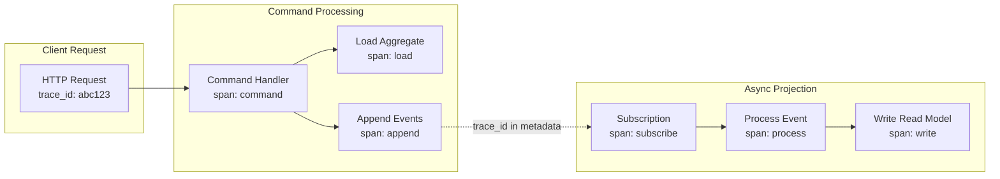

# Observability

[← Back to Index](./00-index.md)

---

## Key Metrics

### Event Store Metrics

```
┌────────────────────────────────────────────────────────────────────┐
│ EVENT STORE METRICS                                                 │
├────────────────────────────────────────────────────────────────────┤
│                                                                     │
│ Write Path Metrics:                                                 │
│                                                                     │
│ event_append_total                                                 │
│   Type: Counter                                                    │
│   Labels: stream_category, event_type, status                     │
│   Description: Total events appended                               │
│                                                                     │
│ event_append_duration_seconds                                      │
│   Type: Histogram                                                  │
│   Labels: stream_category                                          │
│   Buckets: 0.001, 0.005, 0.01, 0.025, 0.05, 0.1, 0.25, 0.5, 1    │
│   Description: Event append latency                                │
│                                                                     │
│ event_append_batch_size                                            │
│   Type: Histogram                                                  │
│   Buckets: 1, 5, 10, 25, 50, 100                                  │
│   Description: Events per append operation                         │
│                                                                     │
│ optimistic_concurrency_conflicts_total                             │
│   Type: Counter                                                    │
│   Labels: stream_category                                          │
│   Description: Version conflicts (retries needed)                  │
│                                                                     │
│ ─────────────────────────────────────────────────────────────────  │
│                                                                     │
│ Read Path Metrics:                                                  │
│                                                                     │
│ event_read_total                                                   │
│   Type: Counter                                                    │
│   Labels: stream_category, read_type (stream/all)                 │
│   Description: Total read operations                               │
│                                                                     │
│ event_read_duration_seconds                                        │
│   Type: Histogram                                                  │
│   Labels: stream_category, read_type                              │
│   Description: Read operation latency                              │
│                                                                     │
│ events_read_per_operation                                          │
│   Type: Histogram                                                  │
│   Buckets: 1, 10, 50, 100, 500, 1000                             │
│   Description: Events returned per read                            │
│                                                                     │
│ ─────────────────────────────────────────────────────────────────  │
│                                                                     │
│ Storage Metrics:                                                    │
│                                                                     │
│ total_events                                                       │
│   Type: Gauge                                                      │
│   Description: Total events stored                                 │
│                                                                     │
│ total_streams                                                      │
│   Type: Gauge                                                      │
│   Description: Total active streams                                │
│                                                                     │
│ storage_bytes                                                      │
│   Type: Gauge                                                      │
│   Labels: type (events/snapshots/indexes)                         │
│   Description: Storage utilization                                 │
│                                                                     │
│ global_position                                                    │
│   Type: Gauge                                                      │
│   Description: Current global position (head)                      │
│                                                                     │
└────────────────────────────────────────────────────────────────────┘
```

### Projection Metrics

```
┌────────────────────────────────────────────────────────────────────┐
│ PROJECTION METRICS                                                  │
├────────────────────────────────────────────────────────────────────┤
│                                                                     │
│ Lag Metrics (Critical):                                            │
│                                                                     │
│ projection_lag_events                                              │
│   Type: Gauge                                                      │
│   Labels: projection_name                                          │
│   Description: Events behind head position                         │
│   Alert: > 1000 events                                            │
│                                                                     │
│ projection_lag_seconds                                             │
│   Type: Gauge                                                      │
│   Labels: projection_name                                          │
│   Description: Time behind (based on event timestamps)             │
│   Alert: > 60 seconds                                             │
│                                                                     │
│ ─────────────────────────────────────────────────────────────────  │
│                                                                     │
│ Processing Metrics:                                                 │
│                                                                     │
│ projection_events_processed_total                                  │
│   Type: Counter                                                    │
│   Labels: projection_name, event_type, status                     │
│   Description: Total events processed                              │
│                                                                     │
│ projection_event_processing_duration_seconds                       │
│   Type: Histogram                                                  │
│   Labels: projection_name, event_type                             │
│   Buckets: 0.0001, 0.0005, 0.001, 0.005, 0.01, 0.05, 0.1         │
│   Description: Per-event processing time                          │
│                                                                     │
│ projection_batch_processing_duration_seconds                       │
│   Type: Histogram                                                  │
│   Labels: projection_name                                          │
│   Description: Batch processing time                               │
│                                                                     │
│ projection_checkpoint_position                                     │
│   Type: Gauge                                                      │
│   Labels: projection_name                                          │
│   Description: Last checkpointed position                          │
│                                                                     │
│ ─────────────────────────────────────────────────────────────────  │
│                                                                     │
│ Error Metrics:                                                      │
│                                                                     │
│ projection_errors_total                                            │
│   Type: Counter                                                    │
│   Labels: projection_name, error_type                             │
│   Description: Processing errors                                   │
│   Alert: Any increase                                             │
│                                                                     │
│ projection_retries_total                                           │
│   Type: Counter                                                    │
│   Labels: projection_name                                          │
│   Description: Retry attempts                                      │
│                                                                     │
│ projection_dead_letter_total                                       │
│   Type: Counter                                                    │
│   Labels: projection_name                                          │
│   Description: Events sent to dead letter                          │
│   Alert: Any increase                                             │
│                                                                     │
└────────────────────────────────────────────────────────────────────┘
```

### Snapshot Metrics

```
┌────────────────────────────────────────────────────────────────────┐
│ SNAPSHOT METRICS                                                    │
├────────────────────────────────────────────────────────────────────┤
│                                                                     │
│ snapshot_created_total                                             │
│   Type: Counter                                                    │
│   Labels: aggregate_type                                           │
│   Description: Snapshots created                                   │
│                                                                     │
│ snapshot_size_bytes                                                │
│   Type: Histogram                                                  │
│   Labels: aggregate_type                                           │
│   Buckets: 1KB, 5KB, 10KB, 50KB, 100KB, 500KB, 1MB               │
│   Description: Snapshot sizes                                      │
│                                                                     │
│ snapshot_age_events                                                │
│   Type: Gauge                                                      │
│   Labels: stream_id                                                │
│   Description: Events since last snapshot                          │
│   Alert: > 1000 for active streams                                │
│                                                                     │
│ snapshot_load_duration_seconds                                     │
│   Type: Histogram                                                  │
│   Labels: aggregate_type                                           │
│   Description: Time to load snapshot                               │
│                                                                     │
│ aggregate_load_duration_seconds                                    │
│   Type: Histogram                                                  │
│   Labels: aggregate_type, load_type (with_snapshot/from_scratch)  │
│   Description: Total aggregate load time                           │
│                                                                     │
│ events_replayed_per_load                                           │
│   Type: Histogram                                                  │
│   Labels: aggregate_type                                           │
│   Buckets: 0, 10, 50, 100, 500, 1000, 5000                        │
│   Description: Events replayed after snapshot                      │
│   Alert: p99 > 500                                                │
│                                                                     │
└────────────────────────────────────────────────────────────────────┘
```

---

## Logging Strategy

### Structured Logging Schema

```
┌────────────────────────────────────────────────────────────────────┐
│ LOG SCHEMA                                                          │
├────────────────────────────────────────────────────────────────────┤
│                                                                     │
│ Common Fields (all logs):                                          │
│ {                                                                   │
│   "timestamp": "2024-01-15T10:30:00.123Z",                        │
│   "level": "info",                                                │
│   "service": "event-store",                                       │
│   "host": "es-node-1",                                            │
│   "correlation_id": "req-123",                                    │
│   "trace_id": "abc123",                                           │
│   "span_id": "def456"                                             │
│ }                                                                   │
│                                                                     │
│ ─────────────────────────────────────────────────────────────────  │
│                                                                     │
│ Event Append Log:                                                   │
│ {                                                                   │
│   "event": "event_appended",                                      │
│   "stream_id": "order-123",                                       │
│   "event_type": "OrderCreated",                                   │
│   "stream_position": 5,                                           │
│   "global_position": 12345,                                       │
│   "expected_version": 4,                                          │
│   "duration_ms": 3.2,                                             │
│   "batch_size": 1                                                 │
│ }                                                                   │
│                                                                     │
│ Concurrency Conflict Log:                                          │
│ {                                                                   │
│   "event": "concurrency_conflict",                                │
│   "stream_id": "order-123",                                       │
│   "expected_version": 4,                                          │
│   "actual_version": 6,                                            │
│   "client": "order-service",                                      │
│   "level": "warn"                                                 │
│ }                                                                   │
│                                                                     │
│ Projection Processing Log:                                         │
│ {                                                                   │
│   "event": "projection_batch_processed",                          │
│   "projection": "order-summary",                                  │
│   "from_position": 1000,                                          │
│   "to_position": 1100,                                            │
│   "events_processed": 100,                                        │
│   "duration_ms": 250,                                             │
│   "lag_events": 50                                                │
│ }                                                                   │
│                                                                     │
│ Projection Error Log:                                              │
│ {                                                                   │
│   "event": "projection_error",                                    │
│   "projection": "order-summary",                                  │
│   "event_id": "evt-456",                                          │
│   "global_position": 1050,                                        │
│   "error": "Database connection failed",                          │
│   "stack_trace": "...",                                           │
│   "retry_count": 2,                                               │
│   "level": "error"                                                │
│ }                                                                   │
│                                                                     │
│ Snapshot Log:                                                       │
│ {                                                                   │
│   "event": "snapshot_created",                                    │
│   "stream_id": "user-789",                                        │
│   "version": 500,                                                 │
│   "size_bytes": 4096,                                             │
│   "duration_ms": 15                                               │
│ }                                                                   │
│                                                                     │
└────────────────────────────────────────────────────────────────────┘
```

### Log Levels by Component

| Component | Level | Events |
|-----------|-------|--------|
| **Event Store** | INFO | Append success, stream created |
| **Event Store** | WARN | Concurrency conflict, slow query |
| **Event Store** | ERROR | Write failure, corruption detected |
| **Projection** | INFO | Batch processed, caught up |
| **Projection** | WARN | High lag, retry |
| **Projection** | ERROR | Processing failed, dead letter |
| **Snapshot** | INFO | Snapshot created, loaded |
| **Snapshot** | WARN | Old snapshot, large size |

---

## Distributed Tracing

### Trace Propagation



### Trace Context in Events

```
┌────────────────────────────────────────────────────────────────────┐
│ TRACING IN EVENT METADATA                                           │
├────────────────────────────────────────────────────────────────────┤
│                                                                     │
│ Event with Trace Context:                                          │
│ {                                                                   │
│   "event_id": "evt-123",                                          │
│   "event_type": "OrderCreated",                                   │
│   "data": {...},                                                  │
│   "metadata": {                                                   │
│     "trace_id": "abc123def456",                                   │
│     "span_id": "789xyz",                                          │
│     "parent_span_id": "456uvw",                                   │
│     "correlation_id": "req-001",                                  │
│     "causation_id": "evt-122"                                     │
│   }                                                                │
│ }                                                                   │
│                                                                     │
│ Projection Tracing:                                                 │
│                                                                     │
│ When processing event:                                             │
│ 1. Extract trace_id from event metadata                           │
│ 2. Create new span with original trace_id                         │
│ 3. Set span parent to event's span_id                             │
│ 4. Process event within this span                                 │
│                                                                     │
│ Benefits:                                                           │
│ • Trace request → event → projection → read model                 │
│ • Debug async flows                                                │
│ • Measure end-to-end latency                                      │
│                                                                     │
└────────────────────────────────────────────────────────────────────┘
```

---

## Alerting Rules

### Critical Alerts

```
┌────────────────────────────────────────────────────────────────────┐
│ CRITICAL ALERTS (Page On-Call)                                      │
├────────────────────────────────────────────────────────────────────┤
│                                                                     │
│ Alert: EventStoreWriteFailure                                      │
│ Condition: rate(event_append_total{status="error"}[5m]) > 0        │
│ Severity: Critical                                                 │
│ Description: Events failing to append                              │
│ Runbook: Check disk space, replication status                      │
│                                                                     │
│ Alert: ProjectionFaulted                                           │
│ Condition: projection_status{status="faulted"} > 0                 │
│ Severity: Critical                                                 │
│ Description: Projection stopped due to error                       │
│ Runbook: Check projection logs, restart or fix                     │
│                                                                     │
│ Alert: ProjectionDeadLetter                                        │
│ Condition: increase(projection_dead_letter_total[1h]) > 0          │
│ Severity: Critical                                                 │
│ Description: Events moved to dead letter queue                     │
│ Runbook: Investigate dead letter events, manual intervention       │
│                                                                     │
│ Alert: EventStoreReplicationLag                                    │
│ Condition: event_store_replication_lag_bytes > 100MB               │
│ Severity: Critical                                                 │
│ Description: Replication falling behind                            │
│ Runbook: Check network, follower health                            │
│                                                                     │
│ Alert: DiskSpaceCritical                                           │
│ Condition: disk_free_bytes < 10GB                                  │
│ Severity: Critical                                                 │
│ Description: Running out of disk space                             │
│ Runbook: Archive old events, expand storage                        │
│                                                                     │
└────────────────────────────────────────────────────────────────────┘
```

### Warning Alerts

```
┌────────────────────────────────────────────────────────────────────┐
│ WARNING ALERTS (Notify Team)                                        │
├────────────────────────────────────────────────────────────────────┤
│                                                                     │
│ Alert: ProjectionLagHigh                                           │
│ Condition: projection_lag_seconds > 60 for 5m                      │
│ Severity: Warning                                                  │
│ Description: Projection more than 1 minute behind                  │
│ Runbook: Check projection throughput, scale workers                │
│                                                                     │
│ Alert: SnapshotAgeHigh                                             │
│ Condition: snapshot_age_events > 5000 for active streams           │
│ Severity: Warning                                                  │
│ Description: Aggregate may have slow load times                    │
│ Runbook: Force snapshot creation, check snapshot job               │
│                                                                     │
│ Alert: ConcurrencyConflictsHigh                                    │
│ Condition: rate(concurrency_conflicts_total[5m]) > 100             │
│ Severity: Warning                                                  │
│ Description: High rate of version conflicts                        │
│ Runbook: Check for hot aggregates, review access patterns          │
│                                                                     │
│ Alert: AppendLatencyHigh                                           │
│ Condition: histogram_quantile(0.99, event_append_duration) > 100ms │
│ Severity: Warning                                                  │
│ Description: Event append latency degraded                         │
│ Runbook: Check I/O, replication health                            │
│                                                                     │
│ Alert: ProjectionRetryRateHigh                                     │
│ Condition: rate(projection_retries_total[5m]) > 10                 │
│ Severity: Warning                                                  │
│ Description: Projections retrying frequently                       │
│ Runbook: Check downstream dependencies                             │
│                                                                     │
└────────────────────────────────────────────────────────────────────┘
```

---

## Debugging Tools

### Event Stream Inspector

```
┌────────────────────────────────────────────────────────────────────┐
│ EVENT STREAM DEBUGGING QUERIES                                      │
├────────────────────────────────────────────────────────────────────┤
│                                                                     │
│ View recent events for a stream:                                   │
│ ────────────────────────────────                                   │
│ GET /streams/order-123?direction=backward&count=20                 │
│                                                                     │
│ Search events by correlation ID:                                   │
│ ───────────────────────────────                                    │
│ SELECT * FROM events                                               │
│ WHERE metadata->>'correlation_id' = 'req-456'                     │
│ ORDER BY global_position                                           │
│                                                                     │
│ Find events around a point in time:                                │
│ ───────────────────────────────────                                │
│ SELECT * FROM events                                               │
│ WHERE timestamp BETWEEN '2024-01-15 10:00:00'                     │
│                     AND '2024-01-15 10:15:00'                     │
│ AND stream_id LIKE 'order-%'                                       │
│ ORDER BY global_position                                           │
│                                                                     │
│ Reconstruct state at a point in time:                              │
│ ─────────────────────────────────────                              │
│ SELECT * FROM events                                               │
│ WHERE stream_id = 'order-123'                                      │
│ AND timestamp <= '2024-01-15 10:00:00'                            │
│ ORDER BY stream_position                                           │
│ -- Then replay these events to get state                          │
│                                                                     │
│ Event rate by type over time:                                      │
│ ──────────────────────────────                                     │
│ SELECT                                                              │
│   date_trunc('hour', timestamp) as hour,                          │
│   event_type,                                                      │
│   count(*) as count                                                │
│ FROM events                                                        │
│ WHERE timestamp > NOW() - INTERVAL '24 hours'                     │
│ GROUP BY hour, event_type                                          │
│ ORDER BY hour, count DESC                                          │
│                                                                     │
└────────────────────────────────────────────────────────────────────┘
```

### Projection Debugging

```
┌────────────────────────────────────────────────────────────────────┐
│ PROJECTION DEBUGGING TOOLS                                          │
├────────────────────────────────────────────────────────────────────┤
│                                                                     │
│ Check projection status:                                           │
│ ────────────────────────                                           │
│ GET /projections/order-summary/status                              │
│                                                                     │
│ Response:                                                           │
│ {                                                                   │
│   "name": "order-summary",                                        │
│   "status": "running",                                            │
│   "checkpoint": 1234567,                                          │
│   "head_position": 1234600,                                       │
│   "lag_events": 33,                                               │
│   "lag_seconds": 2.5,                                             │
│   "last_event_at": "2024-01-15T10:30:00Z",                       │
│   "events_per_second": 150,                                       │
│   "last_error": null                                              │
│ }                                                                   │
│                                                                     │
│ Replay specific event (dry-run):                                   │
│ ────────────────────────────────                                   │
│ POST /projections/order-summary/replay                             │
│ {                                                                   │
│   "global_position": 1234500,                                     │
│   "dry_run": true                                                 │
│ }                                                                   │
│                                                                     │
│ Response:                                                           │
│ {                                                                   │
│   "event": {...},                                                 │
│   "would_update": [                                               │
│     {"table": "order_summaries", "id": "order-123",              │
│      "changes": {"status": "shipped"}}                           │
│   ]                                                                │
│ }                                                                   │
│                                                                     │
│ Force rebuild from position:                                       │
│ ────────────────────────────                                       │
│ POST /projections/order-summary/reset                              │
│ {                                                                   │
│   "from_position": 0,                                             │
│   "reason": "Bug fix in projection logic"                         │
│ }                                                                   │
│                                                                     │
│ Compare read model with events:                                    │
│ ───────────────────────────────                                    │
│ POST /projections/order-summary/validate                           │
│ {                                                                   │
│   "stream_ids": ["order-123", "order-456"]                       │
│ }                                                                   │
│                                                                     │
│ Response:                                                           │
│ {                                                                   │
│   "valid": false,                                                 │
│   "mismatches": [                                                 │
│     {"stream": "order-456", "field": "total",                    │
│      "expected": 99.99, "actual": 89.99}                         │
│   ]                                                                │
│ }                                                                   │
│                                                                     │
└────────────────────────────────────────────────────────────────────┘
```

---

## Dashboards

### Event Store Dashboard

```
┌────────────────────────────────────────────────────────────────────┐
│ EVENT STORE DASHBOARD PANELS                                        │
├────────────────────────────────────────────────────────────────────┤
│                                                                     │
│ Row 1: Overview                                                     │
│ ┌──────────────┬──────────────┬──────────────┬──────────────┐     │
│ │ Events/sec   │ Streams      │ Storage      │ Uptime       │     │
│ │    1,234     │   10.5M      │   2.3 TB     │  99.99%      │     │
│ └──────────────┴──────────────┴──────────────┴──────────────┘     │
│                                                                     │
│ Row 2: Write Performance                                           │
│ ┌────────────────────────────────────────────────────────────┐    │
│ │ Event Append Rate (events/sec)                             │    │
│ │ [Line chart: rate over time]                               │    │
│ └────────────────────────────────────────────────────────────┘    │
│ ┌────────────────────────────────────────────────────────────┐    │
│ │ Append Latency (p50, p95, p99)                            │    │
│ │ [Line chart: latency percentiles over time]                │    │
│ └────────────────────────────────────────────────────────────┘    │
│                                                                     │
│ Row 3: Read Performance                                            │
│ ┌────────────────────────────────────────────────────────────┐    │
│ │ Read Rate by Type (stream vs all)                          │    │
│ │ [Stacked area chart]                                       │    │
│ └────────────────────────────────────────────────────────────┘    │
│                                                                     │
│ Row 4: Health                                                       │
│ ┌──────────────┬──────────────┬──────────────┬──────────────┐     │
│ │ Replication  │ Disk Usage   │ Conflicts    │ Errors       │     │
│ │ Lag: 0ms     │ 67%          │ 5/min        │ 0            │     │
│ └──────────────┴──────────────┴──────────────┴──────────────┘     │
│                                                                     │
└────────────────────────────────────────────────────────────────────┘
```

### Projection Dashboard

```
┌────────────────────────────────────────────────────────────────────┐
│ PROJECTION DASHBOARD PANELS                                         │
├────────────────────────────────────────────────────────────────────┤
│                                                                     │
│ Row 1: Projection Status                                           │
│ ┌────────────────────────────────────────────────────────────┐    │
│ │ Projection         Status    Lag       Rate     Errors    │    │
│ │ order-summary      Running   32        150/s    0         │    │
│ │ user-dashboard     Running   5         45/s     0         │    │
│ │ analytics          Paused    10,000    0/s      1         │    │
│ │ search-index       Running   120       200/s    0         │    │
│ └────────────────────────────────────────────────────────────┘    │
│                                                                     │
│ Row 2: Lag Over Time                                               │
│ ┌────────────────────────────────────────────────────────────┐    │
│ │ Projection Lag (events)                                    │    │
│ │ [Multi-line chart: lag per projection over time]           │    │
│ └────────────────────────────────────────────────────────────┘    │
│                                                                     │
│ Row 3: Processing Rate                                             │
│ ┌────────────────────────────────────────────────────────────┐    │
│ │ Events Processed per Second                                │    │
│ │ [Stacked area: by projection]                              │    │
│ └────────────────────────────────────────────────────────────┘    │
│                                                                     │
│ Row 4: Errors                                                       │
│ ┌────────────────────────────────────────────────────────────┐    │
│ │ Errors and Retries                                         │    │
│ │ [Bar chart: errors by projection and type]                 │    │
│ └────────────────────────────────────────────────────────────┘    │
│                                                                     │
└────────────────────────────────────────────────────────────────────┘
```

---

## Summary

| Observability Area | Key Metrics | Alert Thresholds |
|--------------------|-------------|------------------|
| **Event Store Writes** | Append rate, latency, errors | Error rate > 0 |
| **Event Store Reads** | Read rate, latency | p99 latency > 100ms |
| **Projection Lag** | Events behind, seconds behind | > 60 seconds |
| **Projection Health** | Status, errors, dead letter | Any faulted/dead letter |
| **Snapshots** | Age, size, load time | Age > 5000 events |
| **Storage** | Total size, growth rate | Disk < 10GB free |
