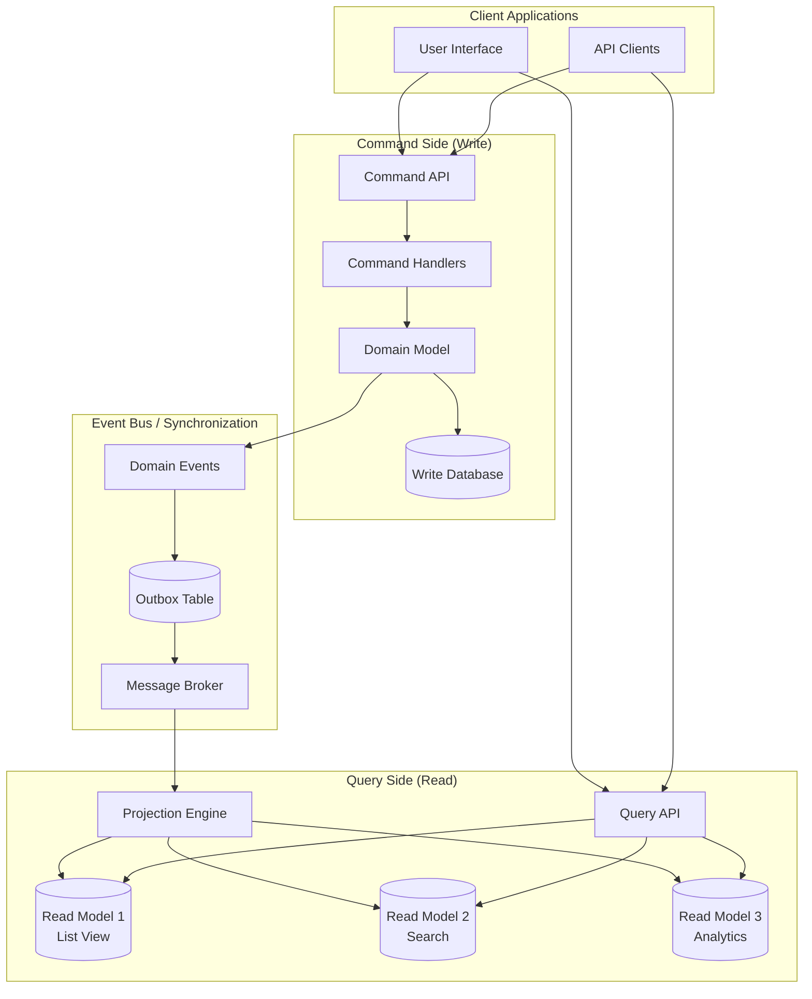
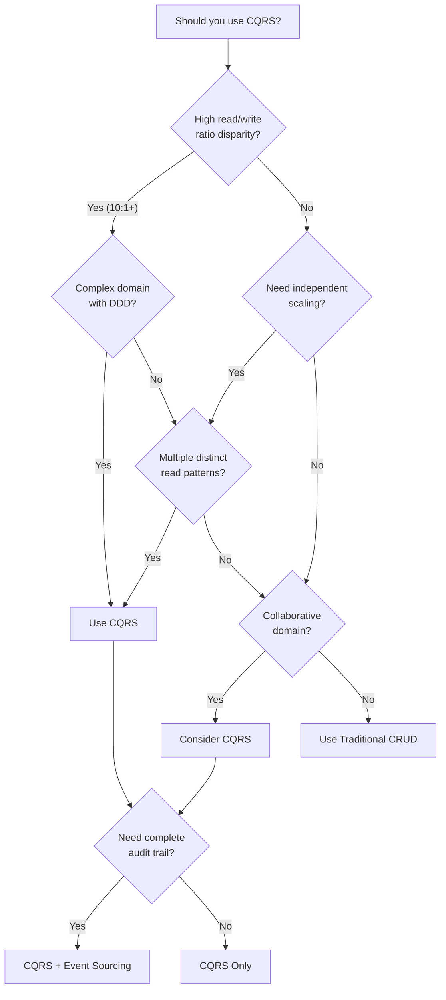
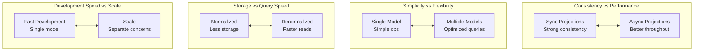

# CQRS Implementation

## System Design Document

| Attribute | Value |
|-----------|-------|
| **Complexity** | High |
| **Category** | Core Infrastructure |
| **Prerequisites** | Event Sourcing (1.18), Message Queue (1.6), Key-Value Store (1.3) |
| **Related Topics** | Event Sourcing (1.18), Distributed Transaction Coordinator (1.17), Message Queue (1.6) |

---

## Quick Navigation

| Document | Description |
|----------|-------------|
| [01 - Requirements & Estimations](./01-requirements-and-estimations.md) | Functional/non-functional requirements, capacity planning |
| [02 - High-Level Design](./02-high-level-design.md) | Architecture diagrams, command/query paths |
| [03 - Low-Level Design](./03-low-level-design.md) | Data models, APIs, projection algorithms |
| [04 - Deep Dive & Bottlenecks](./04-deep-dive-and-bottlenecks.md) | Projection engine, consistency, race conditions |
| [05 - Scalability & Reliability](./05-scalability-and-reliability.md) | Independent scaling, projection rebuilding, disaster recovery |
| [06 - Security & Compliance](./06-security-and-compliance.md) | Authorization, data masking, GDPR challenges |
| [07 - Observability](./07-observability.md) | Metrics, projection lag monitoring, tracing |
| [08 - Interview Guide](./08-interview-guide.md) | 45-min pacing, trap questions, quick reference |

---

## System Overview

**CQRS (Command Query Responsibility Segregation)** is an architectural pattern that separates the read and write sides of an application into distinct models. Commands (writes) modify state through a command model optimized for business logic validation, while Queries (reads) retrieve data from read models optimized for specific query patterns.



---

## What Makes CQRS Valuable

| Aspect | Traditional CRUD | CQRS |
|--------|------------------|------|
| **Data Model** | Single model for read/write | Separate models optimized for each |
| **Query Performance** | Compromised by normalization | Denormalized, pre-computed |
| **Write Performance** | Compromised by indexes | Minimal indexes needed |
| **Scalability** | Scale both together | Scale read/write independently |
| **Complexity** | Simple | Higher (two models to maintain) |
| **Flexibility** | Limited by shared schema | Multiple read models per use case |
| **Consistency** | Strong (single source) | Eventual (async projections) |

---

## Core Concepts

### Command vs Query Separation

The fundamental principle of CQRS is that methods that change state (Commands) should be separate from methods that read state (Queries).

```
┌────────────────────────────────────────────────────────────────────┐
│ COMMAND vs QUERY                                                    │
├────────────────────────────────────────────────────────────────────┤
│                                                                     │
│  COMMANDS (Write Operations)          QUERIES (Read Operations)    │
│  ┌─────────────────────────┐         ┌─────────────────────────┐   │
│  │ • CreateOrder           │         │ • GetOrderById          │   │
│  │ • UpdateOrderStatus     │         │ • ListOrdersByCustomer  │   │
│  │ • CancelOrder           │         │ • SearchOrders          │   │
│  │ • AddItemToCart         │         │ • GetOrderAnalytics     │   │
│  └─────────────────────────┘         └─────────────────────────┘   │
│                                                                     │
│  Characteristics:                     Characteristics:              │
│  • Return void or ID only            • Return data                 │
│  • Validate business rules           • No side effects             │
│  • May fail with domain errors       • Optimized for read patterns │
│  • Processed sequentially            • Can be cached               │
│  • Single write path                 • Multiple read paths         │
│                                                                     │
└────────────────────────────────────────────────────────────────────┘
```

### Write Model (Command Side)

The write model focuses on business logic, validation, and maintaining invariants.

```
┌────────────────────────────────────────────────────────────────────┐
│ WRITE MODEL STRUCTURE                                               │
├────────────────────────────────────────────────────────────────────┤
│                                                                     │
│  Command Flow:                                                      │
│                                                                     │
│  ┌──────────┐    ┌─────────────┐    ┌──────────┐    ┌──────────┐  │
│  │ Command  │ -> │   Handler   │ -> │  Domain  │ -> │   Write  │  │
│  │   DTO    │    │  Validation │    │  Logic   │    │    DB    │  │
│  └──────────┘    └─────────────┘    └──────────┘    └──────────┘  │
│                                            │                        │
│                                            ▼                        │
│                                     ┌──────────┐                   │
│                                     │  Domain  │                   │
│                                     │  Events  │                   │
│                                     └──────────┘                   │
│                                                                     │
│  Write Database Schema (Normalized):                               │
│  ┌─────────────────────────────────────────────────────────────┐   │
│  │ orders                     │ order_items                    │   │
│  │ ├── id (PK)               │ ├── id (PK)                    │   │
│  │ ├── customer_id (FK)      │ ├── order_id (FK)              │   │
│  │ ├── status                │ ├── product_id (FK)            │   │
│  │ ├── created_at            │ ├── quantity                   │   │
│  │ └── updated_at            │ └── unit_price                 │   │
│  └─────────────────────────────────────────────────────────────┘   │
│                                                                     │
└────────────────────────────────────────────────────────────────────┘
```

### Read Model (Query Side)

The read model is optimized for specific query patterns with denormalized, pre-computed data.

```
┌────────────────────────────────────────────────────────────────────┐
│ READ MODEL STRUCTURE                                                │
├────────────────────────────────────────────────────────────────────┤
│                                                                     │
│  Multiple Read Models for Different Use Cases:                     │
│                                                                     │
│  ┌─────────────────────────────────────────────────────────────┐   │
│  │ Read Model 1: Order List View                               │   │
│  │ ┌───────────────────────────────────────────────────────┐   │   │
│  │ │ order_list_view                                       │   │   │
│  │ │ ├── order_id                                          │   │   │
│  │ │ ├── customer_name (denormalized)                      │   │   │
│  │ │ ├── total_amount (pre-computed)                       │   │   │
│  │ │ ├── item_count (pre-computed)                         │   │   │
│  │ │ ├── status                                            │   │   │
│  │ │ └── last_updated                                      │   │   │
│  │ └───────────────────────────────────────────────────────┘   │   │
│  └─────────────────────────────────────────────────────────────┘   │
│                                                                     │
│  ┌─────────────────────────────────────────────────────────────┐   │
│  │ Read Model 2: Customer Order History                        │   │
│  │ ┌───────────────────────────────────────────────────────┐   │   │
│  │ │ customer_order_history                                │   │   │
│  │ │ ├── customer_id (partition key)                       │   │   │
│  │ │ ├── order_id                                          │   │   │
│  │ │ ├── order_summary (JSON blob)                         │   │   │
│  │ │ ├── items_preview (first 3 items)                     │   │   │
│  │ │ └── created_at (sort key)                             │   │   │
│  │ └───────────────────────────────────────────────────────┘   │   │
│  └─────────────────────────────────────────────────────────────┘   │
│                                                                     │
│  ┌─────────────────────────────────────────────────────────────┐   │
│  │ Read Model 3: Search Index (Elasticsearch)                  │   │
│  │ ┌───────────────────────────────────────────────────────┐   │   │
│  │ │ orders_search_index                                   │   │   │
│  │ │ ├── Full-text searchable fields                       │   │   │
│  │ │ ├── Faceted filters (status, date range, amount)     │   │   │
│  │ │ └── Autocomplete suggestions                          │   │   │
│  │ └───────────────────────────────────────────────────────┘   │   │
│  └─────────────────────────────────────────────────────────────┘   │
│                                                                     │
└────────────────────────────────────────────────────────────────────┘
```

### Projection Engine

The projection engine transforms domain events into read model updates.

```
┌────────────────────────────────────────────────────────────────────┐
│ PROJECTION ENGINE                                                   │
├────────────────────────────────────────────────────────────────────┤
│                                                                     │
│  Event Stream                                                       │
│  ┌─────────────────────────────────────────────────────────────┐   │
│  │ OrderCreated → ItemAdded → ItemAdded → OrderShipped        │   │
│  └─────────────────────────────────────────────────────────────┘   │
│           │           │           │            │                    │
│           ▼           ▼           ▼            ▼                    │
│  ┌─────────────────────────────────────────────────────────────┐   │
│  │                   Projection Engine                          │   │
│  │  ┌───────────────────────────────────────────────────────┐   │   │
│  │  │ Checkpoint Store                                      │   │   │
│  │  │ ├── list_view_projection: position 1234               │   │   │
│  │  │ ├── customer_history_projection: position 1234        │   │   │
│  │  │ └── search_projection: position 1230 (catching up)   │   │   │
│  │  └───────────────────────────────────────────────────────┘   │   │
│  └─────────────────────────────────────────────────────────────┘   │
│           │           │           │                                 │
│           ▼           ▼           ▼                                 │
│  ┌──────────────┐ ┌──────────────┐ ┌──────────────┐                │
│  │  List View   │ │  Customer    │ │   Search     │                │
│  │  Projection  │ │  History     │ │   Index      │                │
│  │              │ │  Projection  │ │  Projection  │                │
│  └──────────────┘ └──────────────┘ └──────────────┘                │
│                                                                     │
│  Projection Modes:                                                  │
│  • Sync: Block command until projection updated (strong)           │
│  • Async: Process events asynchronously (eventual)                 │
│  • Hybrid: Critical projections sync, others async                 │
│                                                                     │
└────────────────────────────────────────────────────────────────────┘
```

---

## Pattern Comparison

| Aspect | CRUD | CQRS | CQRS + Event Sourcing |
|--------|------|------|----------------------|
| **Write Model** | Single table | Normalized schema | Event stream |
| **Read Model** | Same as write | Denormalized projections | Denormalized projections |
| **Sync Mechanism** | N/A (same DB) | CDC / Outbox pattern | Event subscriptions |
| **Consistency** | Strong | Eventual (typically) | Eventual |
| **History** | None (without audit log) | None (unless added) | Complete |
| **Complexity** | Low | Medium | High |
| **Best For** | Simple apps | Read-heavy workloads | Complex domains + audit |

---

## Decision Matrix: When to Use CQRS



---

## When to Use CQRS

| Scenario | Recommended |
|----------|-------------|
| **Read-heavy applications (100:1+ ratio)** | Yes - scale reads independently |
| **Complex domain models (DDD)** | Yes - separate concerns cleanly |
| **Multiple query patterns** | Yes - optimize each read model |
| **Collaborative domains (concurrent edits)** | Yes - handle conflicts elegantly |
| **Event Sourcing implementation** | Yes - natural pairing |
| **Microservices with distinct read/write services** | Yes - clear boundaries |
| **Real-time dashboards with high write volume** | Yes - pre-compute aggregates |

---

## When NOT to Use CQRS

| Scenario | Alternative |
|----------|-------------|
| **Simple CRUD applications** | Traditional database with read replicas |
| **Small teams (1-3 developers)** | Start simple, evolve if needed |
| **Strong consistency requirements everywhere** | Single database model |
| **No scaling requirements** | Monolithic with caching |
| **Low read-write disparity (1:1)** | Standard architecture |
| **Prototypes and MVPs** | KISS principle - simplest solution |

---

## Real-World Implementations

| System | Approach | Key Features | Use Case |
|--------|----------|--------------|----------|
| **Axon Framework** | Java Framework | Event Sourcing + CQRS, Projections | Enterprise Java |
| **EventStoreDB** | Event Store | Built-in projections, subscriptions | General CQRS |
| **Netflix Downloads** | Custom | Event sourcing for downloads, CQRS | Offline viewing |
| **Walmart** | Microservices | Separate read/write services | E-commerce |
| **DynamoDB + Aurora** | AWS | DynamoDB for reads, Aurora for writes | Serverless |
| **Cosmos DB + CDC** | Azure | Change feed for projections | Global distribution |

---

## Key Trade-offs



### Trade-off Analysis

| Trade-off | Option A | Option B | Decision Factors |
|-----------|----------|----------|------------------|
| **Sync vs Async Projections** | Sync: Immediate consistency | Async: Higher throughput | Latency tolerance, write volume |
| **Single vs Multiple Read DBs** | Single: Simpler ops | Multiple: Query-optimized | Query diversity, team size |
| **Outbox vs CDC** | Outbox: Explicit control | CDC: Less intrusive | Existing DB, change volume |
| **Strong vs Eventual Consistency** | Strong: Simpler reasoning | Eventual: Better scale | Business requirements |

---

## Complexity Rating Breakdown

| Area | Complexity | Reason |
|------|------------|--------|
| **Basic Separation** | Low | Simple concept |
| **Async Projections** | Medium | Event handling, ordering |
| **Multiple Read Models** | Medium | Schema management |
| **Consistency Handling** | High | Eventual consistency patterns |
| **Projection Rebuilding** | High | Zero-downtime updates |
| **Operations** | High | Multiple DBs, monitoring |
| **CQRS + Event Sourcing** | Very High | Combined complexity |

---

## Document Reading Order

### For Interview Prep (Time-Limited)
1. This index (overview)
2. [02 - High-Level Design](./02-high-level-design.md) (architecture diagrams)
3. [08 - Interview Guide](./08-interview-guide.md) (pacing, trade-offs)

### For Deep Understanding
1. All documents in order (00 → 08)
2. Focus on [04 - Deep Dive](./04-deep-dive-and-bottlenecks.md) for production challenges
3. Study [03 - Low-Level Design](./03-low-level-design.md) for algorithms

### For Production Design
1. [01 - Requirements](./01-requirements-and-estimations.md) (capacity planning)
2. [05 - Scalability](./05-scalability-and-reliability.md) (production concerns)
3. [06 - Security](./06-security-and-compliance.md) (authorization, compliance)
4. [07 - Observability](./07-observability.md) (monitoring)

---

## Related System Designs

| Design | Relationship |
|--------|--------------|
| [1.18 Event Sourcing System](../1.18-event-sourcing-system/00-index.md) | Often paired with CQRS |
| [1.17 Distributed Transaction Coordinator](../1.17-distributed-transaction-coordinator/00-index.md) | Saga pattern with CQRS |
| [1.6 Distributed Message Queue](../1.6-distributed-message-queue/00-index.md) | Event distribution |
| [1.3 Distributed Key-Value Store](../1.3-distributed-key-value-store/00-index.md) | Read model storage |

---

## Further Reading

- Martin Fowler: CQRS Pattern
- Microsoft Azure: CQRS Pattern Documentation
- Greg Young: CQRS, Task Based UIs, Event Sourcing
- Udi Dahan: Clarified CQRS
- Kurrent.io: CQRS and Event Sourcing
- Axon Framework: Reference Guide
