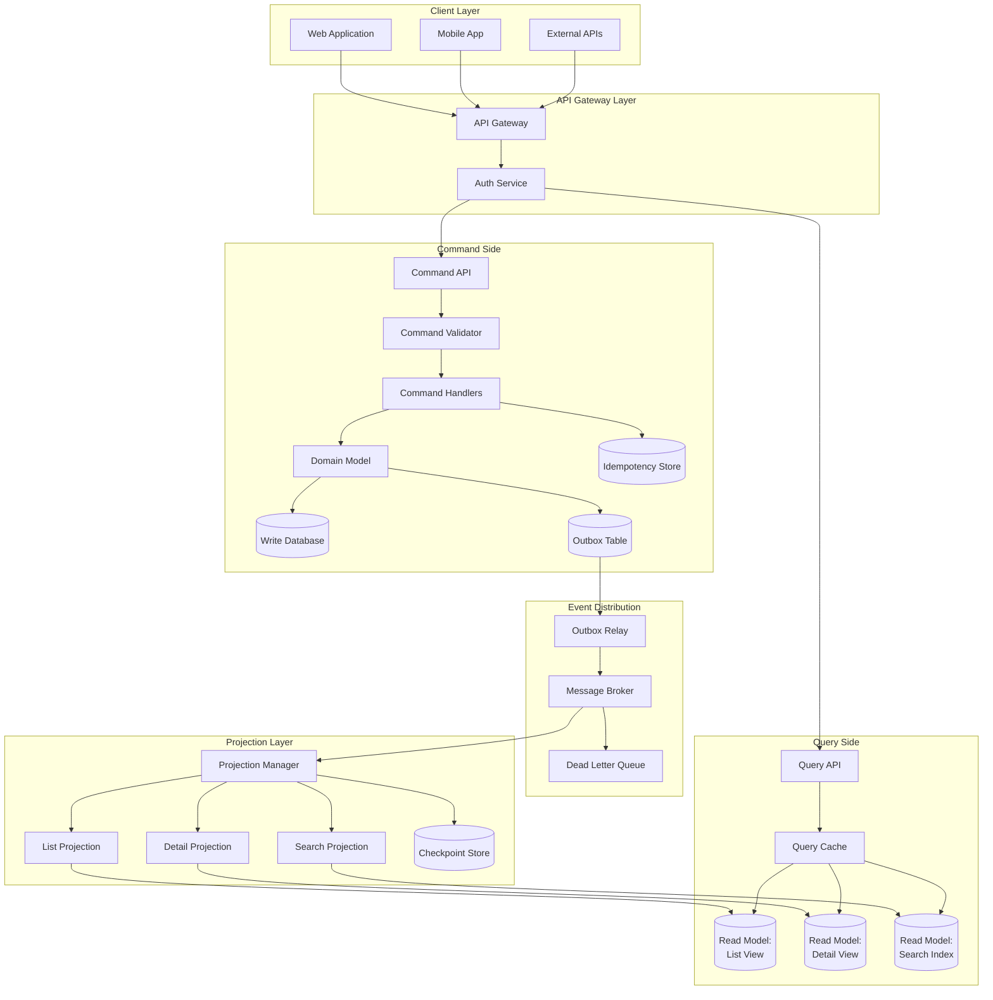
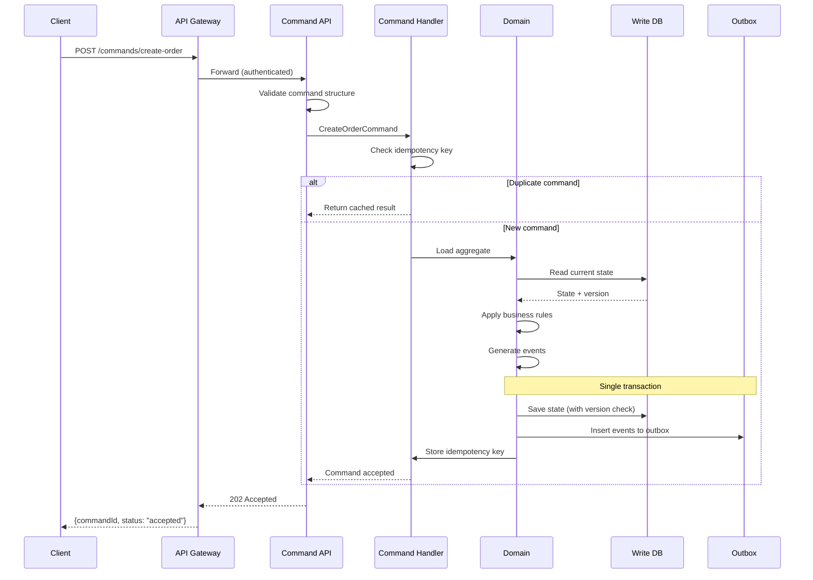
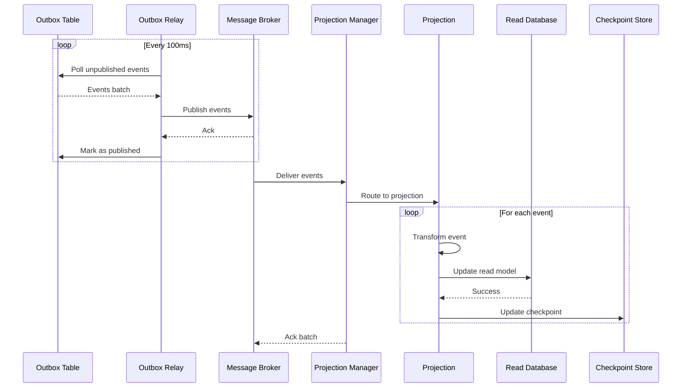
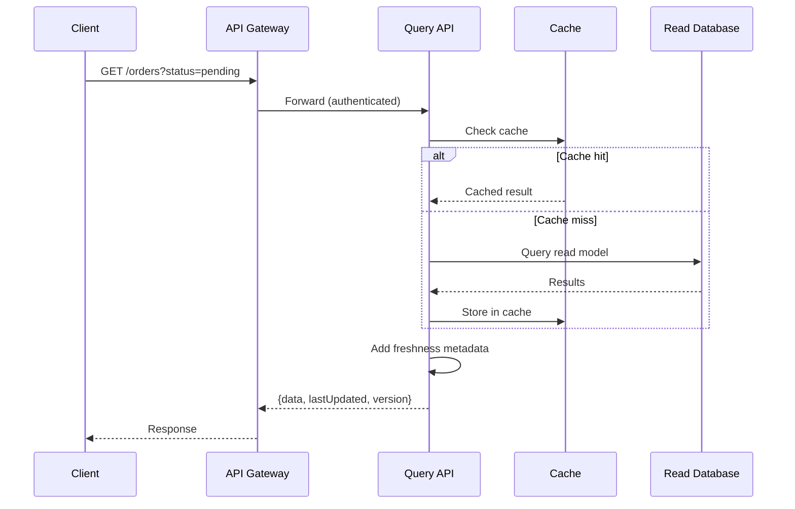
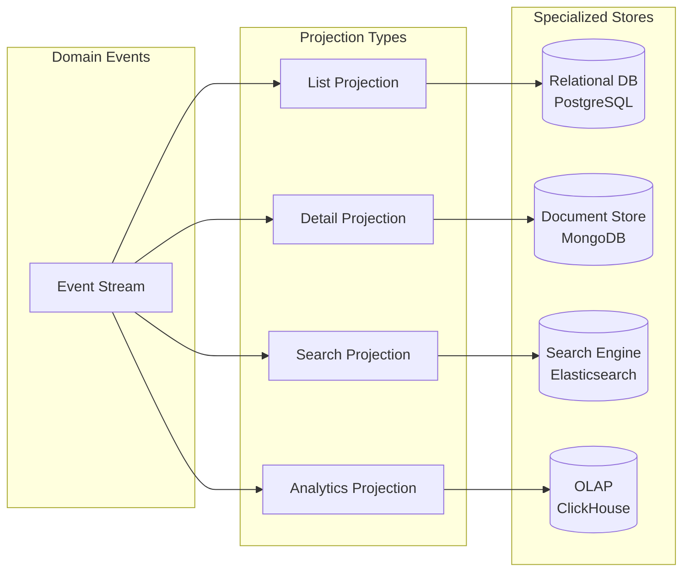
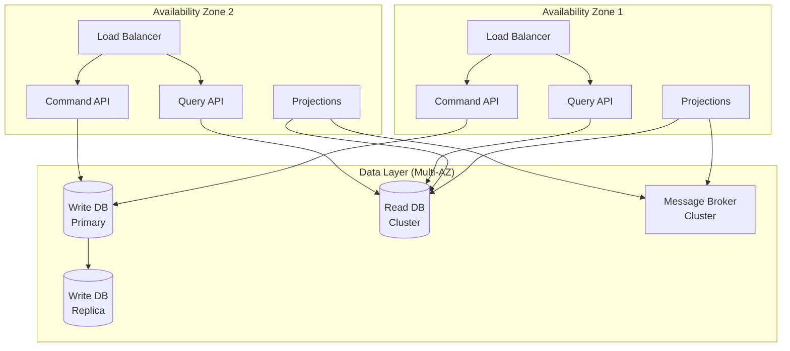
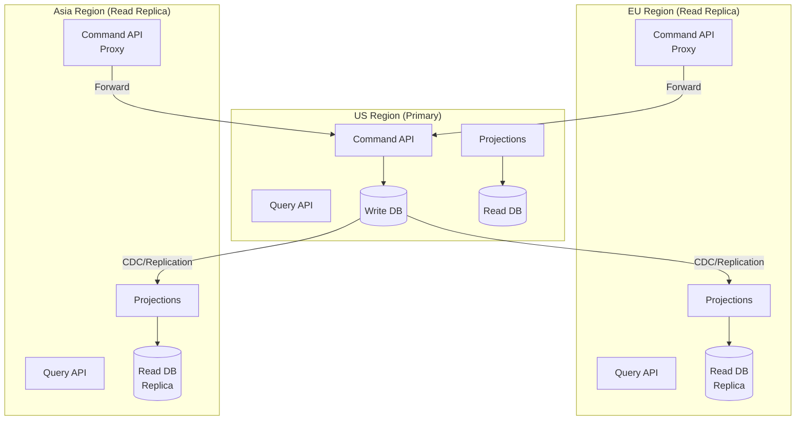
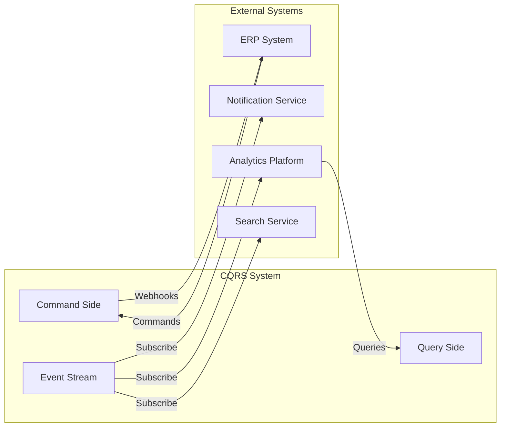

# High-Level Design

## Overview

This document presents the high-level architecture for a CQRS implementation, including data flow diagrams, component interactions, and key architectural decisions.

---

## System Architecture

### Complete Architecture Diagram



---

## Component Overview

### Command Side Components

| Component | Responsibility | Technology Options |
|-----------|---------------|-------------------|
| Command API | HTTP endpoints for commands | REST, gRPC |
| Command Validator | Input validation, authorization | Application code |
| Command Handler | Business logic orchestration | Domain services |
| Domain Model | Business rules, invariants | DDD aggregates |
| Write Database | Persistent state storage | PostgreSQL, MySQL |
| Outbox Table | Event staging for reliable delivery | Same DB as write |
| Idempotency Store | Track processed commands | Redis, DB table |

### Query Side Components

| Component | Responsibility | Technology Options |
|-----------|---------------|-------------------|
| Query API | HTTP endpoints for queries | REST, GraphQL |
| Query Cache | Reduce read model load | Redis, Memcached |
| Read Model (List) | Paginated list queries | PostgreSQL, MongoDB |
| Read Model (Detail) | Single entity queries | PostgreSQL, DynamoDB |
| Read Model (Search) | Full-text search | Elasticsearch, Algolia |

### Projection Components

| Component | Responsibility | Technology Options |
|-----------|---------------|-------------------|
| Outbox Relay | Poll outbox, publish to broker | Debezium, custom |
| Message Broker | Event distribution | Kafka, RabbitMQ |
| Projection Manager | Coordinate projection workers | Custom orchestrator |
| Projections | Transform events to read models | Event handlers |
| Checkpoint Store | Track processing position | Redis, DB table |
| Dead Letter Queue | Failed event storage | Broker feature |

---

## Data Flow Diagrams

### Command (Write) Path



### Event Synchronization Path



### Query (Read) Path



---

## Key Architectural Decisions

### Decision 1: Synchronization Mechanism

```
┌────────────────────────────────────────────────────────────────────┐
│ SYNC MECHANISM OPTIONS                                              │
├────────────────────────────────────────────────────────────────────┤
│                                                                     │
│  Option A: Outbox Pattern                                          │
│  ┌─────────────────────────────────────────────────────────────┐   │
│  │ Write DB + Outbox Table → Relay → Message Broker            │   │
│  │                                                              │   │
│  │ Pros:                                                        │   │
│  │ • Atomicity with write (same transaction)                   │   │
│  │ • No dual-write problem                                     │   │
│  │ • Works with any database                                   │   │
│  │                                                              │   │
│  │ Cons:                                                        │   │
│  │ • Polling overhead                                          │   │
│  │ • Additional table management                               │   │
│  │ • Relay component to maintain                               │   │
│  └─────────────────────────────────────────────────────────────┘   │
│                                                                     │
│  Option B: Change Data Capture (CDC)                               │
│  ┌─────────────────────────────────────────────────────────────┐   │
│  │ Write DB → CDC Connector → Message Broker                   │   │
│  │                                                              │   │
│  │ Pros:                                                        │   │
│  │ • No application changes                                    │   │
│  │ • Captures all changes automatically                        │   │
│  │ • Lower latency (log-based)                                 │   │
│  │                                                              │   │
│  │ Cons:                                                        │   │
│  │ • DB-specific (need connector)                              │   │
│  │ • Schema changes more complex                               │   │
│  │ • Less control over event format                            │   │
│  └─────────────────────────────────────────────────────────────┘   │
│                                                                     │
│  Option C: Domain Events (Direct Publish)                          │
│  ┌─────────────────────────────────────────────────────────────┐   │
│  │ Write DB + Broker (dual write)                              │   │
│  │                                                              │   │
│  │ Pros:                                                        │   │
│  │ • Simplest implementation                                   │   │
│  │ • Low latency                                               │   │
│  │                                                              │   │
│  │ Cons:                                                        │   │
│  │ • Dual-write consistency issues                             │   │
│  │ • Message loss possible                                     │   │
│  │ • NOT RECOMMENDED for production                            │   │
│  └─────────────────────────────────────────────────────────────┘   │
│                                                                     │
│  RECOMMENDATION: Outbox Pattern for most cases                     │
│                  CDC when capturing existing DB changes            │
│                                                                     │
└────────────────────────────────────────────────────────────────────┘
```

### Decision 2: Read Model Stores



| Read Model | Best Store Type | Use Case |
|------------|-----------------|----------|
| List views with filtering | Relational (PostgreSQL) | Paginated tables with sorting |
| Nested/hierarchical data | Document (MongoDB) | Order with embedded items |
| Full-text search | Search engine (Elasticsearch) | Product search, logs |
| Time-series analytics | OLAP (ClickHouse) | Dashboards, reports |
| High-speed key-value | Cache (Redis) | Session data, counters |

### Decision 3: Consistency Strategy

```
┌────────────────────────────────────────────────────────────────────┐
│ CONSISTENCY STRATEGIES                                              │
├────────────────────────────────────────────────────────────────────┤
│                                                                     │
│  Strategy 1: Full Async (Eventual Consistency)                     │
│  ┌─────────────────────────────────────────────────────────────┐   │
│  │ Command → Ack → (async) → Projection → Read Model           │   │
│  │                                                              │   │
│  │ • Highest throughput                                        │   │
│  │ • Unbounded staleness possible                              │   │
│  │ • Best for: Analytics, dashboards, non-critical reads       │   │
│  └─────────────────────────────────────────────────────────────┘   │
│                                                                     │
│  Strategy 2: Read-Your-Writes (Version Token)                      │
│  ┌─────────────────────────────────────────────────────────────┐   │
│  │ Command → Ack(version) → Query(minVersion) → Wait/Return    │   │
│  │                                                              │   │
│  │ • User sees their own writes                                │   │
│  │ • Others may see stale data                                 │   │
│  │ • Best for: User-facing UIs after mutation                  │   │
│  └─────────────────────────────────────────────────────────────┘   │
│                                                                     │
│  Strategy 3: Sync Projection (Strong Consistency)                  │
│  ┌─────────────────────────────────────────────────────────────┐   │
│  │ Command → DB + Projection (same transaction) → Ack          │   │
│  │                                                              │   │
│  │ • No staleness                                              │   │
│  │ • Lower throughput                                          │   │
│  │ • Best for: Critical financial data                         │   │
│  └─────────────────────────────────────────────────────────────┘   │
│                                                                     │
│  Strategy 4: Hybrid (Per-Projection)                               │
│  ┌─────────────────────────────────────────────────────────────┐   │
│  │ Critical projections: Sync                                  │   │
│  │ Others: Async with bounded lag                              │   │
│  │                                                              │   │
│  │ • Balance of consistency and performance                    │   │
│  │ • More complex to implement                                 │   │
│  │ • Best for: Mixed requirements                              │   │
│  └─────────────────────────────────────────────────────────────┘   │
│                                                                     │
└────────────────────────────────────────────────────────────────────┘
```

### Decision 4: Event Schema

```
┌────────────────────────────────────────────────────────────────────┐
│ EVENT ENVELOPE STRUCTURE                                            │
├────────────────────────────────────────────────────────────────────┤
│                                                                     │
│  {                                                                  │
│    // Metadata (for routing and processing)                        │
│    "eventId": "uuid-v4",                                           │
│    "eventType": "OrderCreated",                                    │
│    "aggregateType": "Order",                                       │
│    "aggregateId": "order-123",                                     │
│    "version": 1,                                                   │
│    "timestamp": "2025-01-15T10:30:00Z",                           │
│    "correlationId": "request-abc",                                 │
│    "causationId": "command-xyz",                                   │
│                                                                     │
│    // Schema versioning                                            │
│    "schemaVersion": "1.0",                                         │
│                                                                     │
│    // Business data                                                │
│    "data": {                                                       │
│      "customerId": "cust-456",                                     │
│      "items": [...],                                               │
│      "totalAmount": 99.99                                          │
│    }                                                                │
│  }                                                                  │
│                                                                     │
│  Key Design Choices:                                                │
│  • Include all data needed for projection (no lookups)             │
│  • Schema version for forward compatibility                        │
│  • Correlation ID for distributed tracing                          │
│  • Causation ID for event lineage                                  │
│                                                                     │
└────────────────────────────────────────────────────────────────────┘
```

---

## Deployment Architecture

### Single-Region Deployment



### Multi-Region Deployment



---

## API Design Overview

### Command API

```
┌────────────────────────────────────────────────────────────────────┐
│ COMMAND API PATTERNS                                                │
├────────────────────────────────────────────────────────────────────┤
│                                                                     │
│  Pattern 1: REST-style Commands                                    │
│  ┌─────────────────────────────────────────────────────────────┐   │
│  │ POST /orders                        (CreateOrder)           │   │
│  │ POST /orders/{id}/cancel            (CancelOrder)           │   │
│  │ POST /orders/{id}/items             (AddItem)               │   │
│  │ DELETE /orders/{id}/items/{itemId}  (RemoveItem)            │   │
│  └─────────────────────────────────────────────────────────────┘   │
│                                                                     │
│  Pattern 2: Task-Based Commands                                    │
│  ┌─────────────────────────────────────────────────────────────┐   │
│  │ POST /commands/create-order                                 │   │
│  │ POST /commands/cancel-order                                 │   │
│  │ POST /commands/add-item-to-order                            │   │
│  │ POST /commands/remove-item-from-order                       │   │
│  └─────────────────────────────────────────────────────────────┘   │
│                                                                     │
│  Response Pattern:                                                  │
│  ┌─────────────────────────────────────────────────────────────┐   │
│  │ {                                                           │   │
│  │   "commandId": "cmd-123",                                   │   │
│  │   "status": "accepted",                                     │   │
│  │   "aggregateId": "order-456",                               │   │
│  │   "version": 3,                 // For read-your-writes    │   │
│  │   "timestamp": "2025-01-15T10:30:00Z"                       │   │
│  │ }                                                           │   │
│  └─────────────────────────────────────────────────────────────┘   │
│                                                                     │
└────────────────────────────────────────────────────────────────────┘
```

### Query API

```
┌────────────────────────────────────────────────────────────────────┐
│ QUERY API PATTERNS                                                  │
├────────────────────────────────────────────────────────────────────┤
│                                                                     │
│  List Queries:                                                      │
│  ┌─────────────────────────────────────────────────────────────┐   │
│  │ GET /orders?status=pending&page=1&limit=20                  │   │
│  │ GET /orders?customerId=123&sort=createdAt:desc              │   │
│  └─────────────────────────────────────────────────────────────┘   │
│                                                                     │
│  Detail Queries:                                                    │
│  ┌─────────────────────────────────────────────────────────────┐   │
│  │ GET /orders/{id}                                            │   │
│  │ GET /orders/{id}/items                                      │   │
│  └─────────────────────────────────────────────────────────────┘   │
│                                                                     │
│  Search Queries:                                                    │
│  ┌─────────────────────────────────────────────────────────────┐   │
│  │ GET /orders/search?q=laptop&filters=status:pending          │   │
│  └─────────────────────────────────────────────────────────────┘   │
│                                                                     │
│  Response Pattern (with freshness):                                │
│  ┌─────────────────────────────────────────────────────────────┐   │
│  │ {                                                           │   │
│  │   "data": [...],                                            │   │
│  │   "pagination": { "page": 1, "limit": 20, "total": 150 },  │   │
│  │   "meta": {                                                 │   │
│  │     "lastUpdated": "2025-01-15T10:30:00Z",                 │   │
│  │     "version": 1234,            // For consistency check   │   │
│  │     "cached": false                                         │   │
│  │   }                                                         │   │
│  │ }                                                           │   │
│  └─────────────────────────────────────────────────────────────┘   │
│                                                                     │
│  Read-Your-Writes Pattern:                                         │
│  ┌─────────────────────────────────────────────────────────────┐   │
│  │ GET /orders/{id}?minVersion=3                               │   │
│  │                                                              │   │
│  │ • If version >= 3: Return immediately                       │   │
│  │ • If version < 3: Wait (with timeout) or return stale      │   │
│  └─────────────────────────────────────────────────────────────┘   │
│                                                                     │
└────────────────────────────────────────────────────────────────────┘
```

---

## Integration Points

### External System Integration



### Integration Patterns

| Integration | Pattern | Description |
|-------------|---------|-------------|
| Incoming commands | REST API, gRPC | External systems send commands |
| Event consumption | Message subscription | External systems react to events |
| Outbound webhooks | Event-driven | Notify external systems of changes |
| Query federation | API composition | Combine data from multiple read models |
| Batch import | Command batching | Bulk data import via commands |
