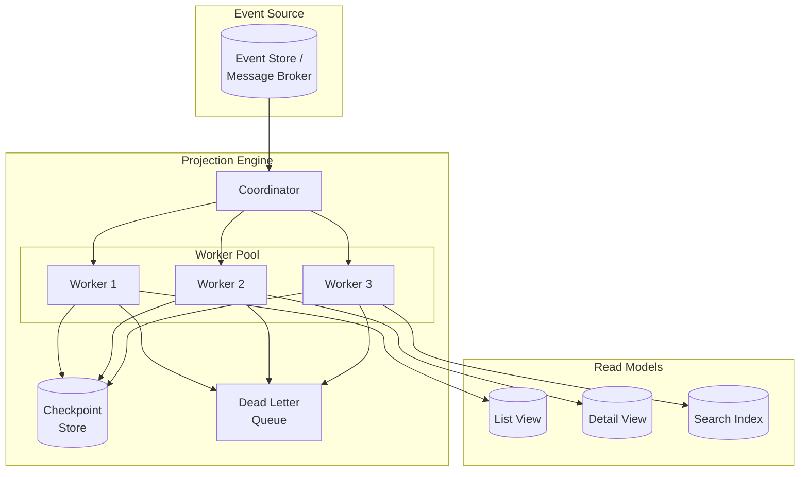
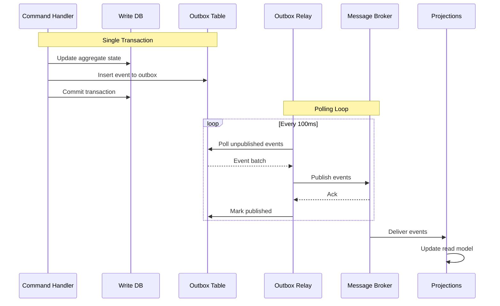
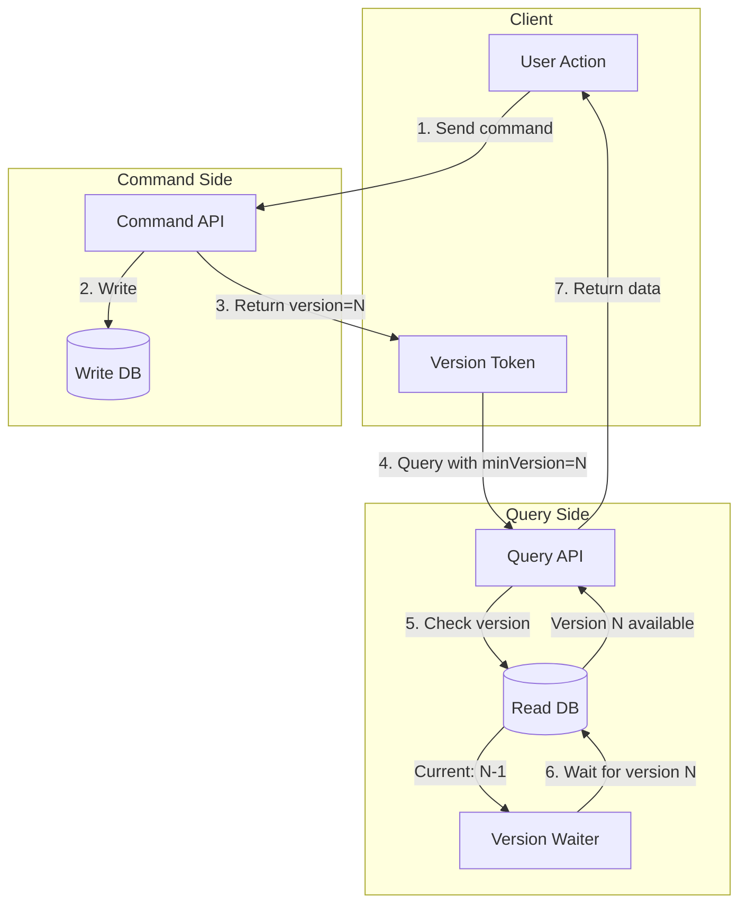

# Deep Dive and Bottlenecks

## Overview

This document examines the critical components of a CQRS implementation, analyzes potential race conditions, and identifies bottlenecks with mitigation strategies.

---

## Critical Component #1: Projection Engine

### Architecture



### Deep Dive: Event Ordering

```
┌────────────────────────────────────────────────────────────────────┐
│ EVENT ORDERING CHALLENGES                                           │
├────────────────────────────────────────────────────────────────────┤
│                                                                     │
│  Problem: Events for same aggregate must be processed in order     │
│                                                                     │
│  Scenario: Order-123 events arrive out of order                    │
│  ┌─────────────────────────────────────────────────────────────┐   │
│  │ Broker Partition 1:  [OrderCreated(v1)] [ItemAdded(v2)]     │   │
│  │ Broker Partition 2:  [StatusChanged(v3)]                    │   │
│  │                                                              │   │
│  │ If v3 processed before v2:                                  │   │
│  │ • Read model may have inconsistent state                    │   │
│  │ • Version checks may fail incorrectly                       │   │
│  └─────────────────────────────────────────────────────────────┘   │
│                                                                     │
│  Solutions:                                                         │
│                                                                     │
│  1. Partition by Aggregate ID                                      │
│     ┌───────────────────────────────────────────────────────┐      │
│     │ • All events for same aggregate go to same partition  │      │
│     │ • Single consumer per partition ensures ordering      │      │
│     │ • Partition key = aggregateId                         │      │
│     └───────────────────────────────────────────────────────┘      │
│                                                                     │
│  2. Version-Based Reordering                                       │
│     ┌───────────────────────────────────────────────────────┐      │
│     │ • Buffer out-of-order events temporarily              │      │
│     │ • Process when gap is filled                          │      │
│     │ • Timeout after configured wait period                │      │
│     └───────────────────────────────────────────────────────┘      │
│                                                                     │
│  3. Idempotent + Replayable Handlers                               │
│     ┌───────────────────────────────────────────────────────┐      │
│     │ • Handlers check current version before applying      │      │
│     │ • Skip if event already applied (version check)       │      │
│     │ • Safe to replay entire stream if needed              │      │
│     └───────────────────────────────────────────────────────┘      │
│                                                                     │
└────────────────────────────────────────────────────────────────────┘
```

### Deep Dive: Error Handling

```
┌────────────────────────────────────────────────────────────────────┐
│ PROJECTION ERROR HANDLING STRATEGIES                                │
├────────────────────────────────────────────────────────────────────┤
│                                                                     │
│  Error Types:                                                       │
│                                                                     │
│  1. Transient Errors (Retryable)                                   │
│     • Database connection timeout                                  │
│     • Network glitch                                               │
│     • Read model temporarily unavailable                           │
│                                                                     │
│  2. Permanent Errors (Non-Retryable)                               │
│     • Schema mismatch                                              │
│     • Business logic error                                         │
│     • Corrupt event data                                           │
│                                                                     │
│  3. Poison Events                                                   │
│     • Events that consistently fail                                │
│     • Unknown event types                                          │
│     • Invalid data format                                          │
│                                                                     │
│  Handling Strategy:                                                 │
│  ┌─────────────────────────────────────────────────────────────┐   │
│  │                                                              │   │
│  │  Event Received                                              │   │
│  │       │                                                      │   │
│  │       ▼                                                      │   │
│  │  ┌─────────┐  success   ┌──────────────┐                    │   │
│  │  │ Process │──────────▶ │ Update       │                    │   │
│  │  │ Event   │            │ Checkpoint   │                    │   │
│  │  └────┬────┘            └──────────────┘                    │   │
│  │       │ failure                                              │   │
│  │       ▼                                                      │   │
│  │  ┌─────────────┐                                            │   │
│  │  │ Classify    │                                            │   │
│  │  │ Error       │                                            │   │
│  │  └──────┬──────┘                                            │   │
│  │         │                                                    │   │
│  │    ┌────┴────────────────┐                                  │   │
│  │    │                     │                                  │   │
│  │    ▼                     ▼                                  │   │
│  │  Transient           Permanent                              │   │
│  │    │                     │                                  │   │
│  │    ▼                     ▼                                  │   │
│  │  ┌──────────┐      ┌──────────┐                            │   │
│  │  │ Retry    │      │ Dead     │                            │   │
│  │  │ (backoff)│      │ Letter   │                            │   │
│  │  └────┬─────┘      │ Queue    │                            │   │
│  │       │            └────┬─────┘                            │   │
│  │       │                 │                                   │   │
│  │       │  max retries    │                                   │   │
│  │       └────────────────▶│                                   │   │
│  │                         │                                   │   │
│  │                         ▼                                   │   │
│  │                   Alert + Skip                              │   │
│  │                                                              │   │
│  └─────────────────────────────────────────────────────────────┘   │
│                                                                     │
└────────────────────────────────────────────────────────────────────┘
```

---

## Critical Component #2: Synchronization Layer

### Outbox Pattern Analysis



### Deep Dive: Dual Write Problem

```
┌────────────────────────────────────────────────────────────────────┐
│ DUAL WRITE PROBLEM AND SOLUTIONS                                    │
├────────────────────────────────────────────────────────────────────┤
│                                                                     │
│  The Problem (Anti-pattern):                                       │
│  ┌─────────────────────────────────────────────────────────────┐   │
│  │                                                              │   │
│  │  Command Handler:                                            │   │
│  │    1. Write to Database         ← May succeed               │   │
│  │    2. Publish to Message Broker ← May fail!                 │   │
│  │                                                              │   │
│  │  Result: DB updated but event lost = inconsistency          │   │
│  │                                                              │   │
│  └─────────────────────────────────────────────────────────────┘   │
│                                                                     │
│  Solution 1: Outbox Pattern (Recommended)                          │
│  ┌─────────────────────────────────────────────────────────────┐   │
│  │                                                              │   │
│  │  Command Handler:                                            │   │
│  │    BEGIN TRANSACTION                                        │   │
│  │      1. Write to aggregate table                            │   │
│  │      2. Write to outbox table                               │   │
│  │    COMMIT                                                   │   │
│  │                                                              │   │
│  │  Separate Relay Process:                                    │   │
│  │    3. Poll outbox → Publish to broker → Mark published     │   │
│  │                                                              │   │
│  │  Guarantees: At-least-once delivery                         │   │
│  │                                                              │   │
│  └─────────────────────────────────────────────────────────────┘   │
│                                                                     │
│  Solution 2: Change Data Capture (CDC)                             │
│  ┌─────────────────────────────────────────────────────────────┐   │
│  │                                                              │   │
│  │  Command Handler:                                            │   │
│  │    1. Write to Database (events as rows or log)             │   │
│  │                                                              │   │
│  │  CDC Connector (Debezium):                                  │   │
│  │    2. Read database transaction log (WAL)                   │   │
│  │    3. Publish changes to message broker                     │   │
│  │                                                              │   │
│  │  Guarantees: At-least-once, log-based ordering              │   │
│  │                                                              │   │
│  └─────────────────────────────────────────────────────────────┘   │
│                                                                     │
│  Solution 3: Event Store as Source of Truth                        │
│  ┌─────────────────────────────────────────────────────────────┐   │
│  │                                                              │   │
│  │  Command Handler:                                            │   │
│  │    1. Append event to Event Store                           │   │
│  │                                                              │   │
│  │  Event Store:                                                │   │
│  │    2. Notify subscribers (built-in pub/sub)                 │   │
│  │                                                              │   │
│  │  Guarantees: Single write, built-in consistency             │   │
│  │                                                              │   │
│  └─────────────────────────────────────────────────────────────┘   │
│                                                                     │
└────────────────────────────────────────────────────────────────────┘
```

### Outbox Relay Optimization

```
┌────────────────────────────────────────────────────────────────────┐
│ OUTBOX RELAY OPTIMIZATION                                           │
├────────────────────────────────────────────────────────────────────┤
│                                                                     │
│  Basic Polling (Simple but inefficient):                           │
│  ┌─────────────────────────────────────────────────────────────┐   │
│  │ WHILE true:                                                  │   │
│  │   SELECT * FROM outbox WHERE published_at IS NULL LIMIT 100 │   │
│  │   SLEEP(100ms)                                              │   │
│  │                                                              │   │
│  │ Problems:                                                    │   │
│  │   • Constant polling even when idle                         │   │
│  │   • Wasted database connections                             │   │
│  │   • Fixed latency (avg 50ms)                                │   │
│  └─────────────────────────────────────────────────────────────┘   │
│                                                                     │
│  Optimized Polling:                                                 │
│  ┌─────────────────────────────────────────────────────────────┐   │
│  │ WHILE true:                                                  │   │
│  │   events = SELECT ... FOR UPDATE SKIP LOCKED  // Parallel   │   │
│  │   IF events.isEmpty:                                        │   │
│  │     SLEEP(adaptive_backoff)  // 100ms → 200ms → 500ms       │   │
│  │   ELSE:                                                      │   │
│  │     publish(events)                                         │   │
│  │     reset_backoff()                                         │   │
│  │                                                              │   │
│  │ Benefits:                                                    │   │
│  │   • Multiple relays can work in parallel (SKIP LOCKED)      │   │
│  │   • Adaptive polling reduces idle load                      │   │
│  └─────────────────────────────────────────────────────────────┘   │
│                                                                     │
│  Push-based (Using DB notifications):                              │
│  ┌─────────────────────────────────────────────────────────────┐   │
│  │ PostgreSQL LISTEN/NOTIFY:                                   │   │
│  │                                                              │   │
│  │ Trigger on INSERT to outbox:                                │   │
│  │   NOTIFY outbox_events, new_event_id                        │   │
│  │                                                              │   │
│  │ Relay:                                                       │   │
│  │   LISTEN outbox_events                                      │   │
│  │   ON notification: fetch and publish                        │   │
│  │                                                              │   │
│  │ Benefits:                                                    │   │
│  │   • Near-zero latency                                       │   │
│  │   • No polling overhead                                     │   │
│  │ Caveats:                                                     │   │
│  │   • Still need polling fallback for reliability             │   │
│  └─────────────────────────────────────────────────────────────┘   │
│                                                                     │
└────────────────────────────────────────────────────────────────────┘
```

---

## Critical Component #3: Consistency Manager

### Consistency Patterns



### Deep Dive: Handling Stale Reads

```
┌────────────────────────────────────────────────────────────────────┐
│ STALE READ MITIGATION STRATEGIES                                    │
├────────────────────────────────────────────────────────────────────┤
│                                                                     │
│  Strategy 1: Version Tokens (Read-Your-Writes)                     │
│  ┌─────────────────────────────────────────────────────────────┐   │
│  │                                                              │   │
│  │  After Command Success:                                      │   │
│  │    client.setVersionToken(aggregateId, response.version)    │   │
│  │                                                              │   │
│  │  Before Query:                                               │   │
│  │    minVersion = client.getVersionToken(aggregateId)         │   │
│  │    GET /orders/{id}?minVersion={minVersion}                 │   │
│  │                                                              │   │
│  │  Server Behavior:                                            │   │
│  │    IF readModel.version >= minVersion:                      │   │
│  │      return data                                            │   │
│  │    ELSE:                                                     │   │
│  │      wait(timeout) OR return stale with warning             │   │
│  │                                                              │   │
│  └─────────────────────────────────────────────────────────────┘   │
│                                                                     │
│  Strategy 2: Causal Consistency Tokens                             │
│  ┌─────────────────────────────────────────────────────────────┐   │
│  │                                                              │   │
│  │  Token includes:                                             │   │
│  │    { globalPosition: 12345, timestamp: T }                  │   │
│  │                                                              │   │
│  │  Every response includes latest token                       │   │
│  │  Client sends token with every request                      │   │
│  │  Server waits for projection to reach position              │   │
│  │                                                              │   │
│  │  Provides: Causal consistency across all aggregates         │   │
│  │                                                              │   │
│  └─────────────────────────────────────────────────────────────┘   │
│                                                                     │
│  Strategy 3: Synchronous Projection (Strong Consistency)           │
│  ┌─────────────────────────────────────────────────────────────┐   │
│  │                                                              │   │
│  │  Command Processing:                                         │   │
│  │    BEGIN TRANSACTION                                        │   │
│  │      1. Update write model                                  │   │
│  │      2. Update read model (same transaction)               │   │
│  │    COMMIT                                                   │   │
│  │                                                              │   │
│  │  Provides: Immediate consistency                            │   │
│  │  Cost: Higher latency, reduced throughput, tight coupling   │   │
│  │                                                              │   │
│  └─────────────────────────────────────────────────────────────┘   │
│                                                                     │
│  Strategy 4: Read from Write Model (Fallback)                      │
│  ┌─────────────────────────────────────────────────────────────┐   │
│  │                                                              │   │
│  │  For critical single-item reads:                            │   │
│  │    IF needsStrongConsistency(query):                        │   │
│  │      return writeDB.query(...)  // Bypass read model       │   │
│  │    ELSE:                                                     │   │
│  │      return readDB.query(...)                               │   │
│  │                                                              │   │
│  │  Use cases: Immediately after mutation, financial data      │   │
│  │                                                              │   │
│  └─────────────────────────────────────────────────────────────┘   │
│                                                                     │
│  Strategy 5: UI Optimistic Updates                                 │
│  ┌─────────────────────────────────────────────────────────────┐   │
│  │                                                              │   │
│  │  Client-side:                                                │   │
│  │    1. Send command                                          │   │
│  │    2. Immediately update UI optimistically                  │   │
│  │    3. Refresh from server in background                     │   │
│  │    4. Reconcile or rollback if conflict                     │   │
│  │                                                              │   │
│  │  Provides: Instant perceived responsiveness                 │   │
│  │                                                              │   │
│  └─────────────────────────────────────────────────────────────┘   │
│                                                                     │
└────────────────────────────────────────────────────────────────────┘
```

---

## Race Conditions

### Race Condition #1: Concurrent Commands on Same Aggregate

```
┌────────────────────────────────────────────────────────────────────┐
│ RACE: Concurrent Commands                                           │
├────────────────────────────────────────────────────────────────────┤
│                                                                     │
│  Scenario: Two users update the same order simultaneously          │
│                                                                     │
│  Timeline:                                                          │
│  ┌─────────────────────────────────────────────────────────────┐   │
│  │ T1: User A loads order (version 1)                          │   │
│  │ T2: User B loads order (version 1)                          │   │
│  │ T3: User A submits update                                   │   │
│  │ T4: User A's update succeeds (version 2)                    │   │
│  │ T5: User B submits update (expecting version 1)             │   │
│  │ T6: User B's update should FAIL (stale version)             │   │
│  └─────────────────────────────────────────────────────────────┘   │
│                                                                     │
│  Solution: Optimistic Concurrency Control                          │
│  ┌─────────────────────────────────────────────────────────────┐   │
│  │                                                              │   │
│  │  UPDATE orders                                               │   │
│  │  SET status = 'shipped', version = version + 1              │   │
│  │  WHERE id = 'order-123' AND version = 1;                    │   │
│  │                                                              │   │
│  │  IF rowsAffected == 0:                                      │   │
│  │    THROW ConcurrencyConflictException                       │   │
│  │                                                              │   │
│  └─────────────────────────────────────────────────────────────┘   │
│                                                                     │
│  Client Handling:                                                   │
│  ┌─────────────────────────────────────────────────────────────┐   │
│  │                                                              │   │
│  │  TRY:                                                        │   │
│  │    response = sendCommand(command, expectedVersion)         │   │
│  │  CATCH ConcurrencyConflict:                                 │   │
│  │    // Option 1: Reload and retry                            │   │
│  │    newData = fetchLatest()                                  │   │
│  │    showMergeDialog(localChanges, newData)                   │   │
│  │                                                              │   │
│  │    // Option 2: Auto-retry with latest version              │   │
│  │    command.expectedVersion = conflict.currentVersion        │   │
│  │    retry(command)                                           │   │
│  │                                                              │   │
│  └─────────────────────────────────────────────────────────────┘   │
│                                                                     │
└────────────────────────────────────────────────────────────────────┘
```

### Race Condition #2: Projection Lag vs User Expectation

```
┌────────────────────────────────────────────────────────────────────┐
│ RACE: Read After Write Appears Missing                              │
├────────────────────────────────────────────────────────────────────┤
│                                                                     │
│  Scenario: User creates order but doesn't see it in list           │
│                                                                     │
│  Timeline:                                                          │
│  ┌─────────────────────────────────────────────────────────────┐   │
│  │ T1: User creates order → Command succeeds (version 1)       │   │
│  │ T2: User immediately views order list                       │   │
│  │ T3: Projection still processing (lag = 500ms)               │   │
│  │ T4: Order list query returns → Order NOT visible!           │   │
│  │ T5: User confused: "Where's my order?"                      │   │
│  └─────────────────────────────────────────────────────────────┘   │
│                                                                     │
│  Solutions:                                                         │
│                                                                     │
│  1. Return version token, pass to query                            │
│  ┌─────────────────────────────────────────────────────────────┐   │
│  │ Command Response: { orderId: "123", version: 1 }            │   │
│  │ Query Request: GET /orders?includeVersion[123]=1            │   │
│  │ Query waits until order-123 at version 1 is visible         │   │
│  └─────────────────────────────────────────────────────────────┘   │
│                                                                     │
│  2. Client-side merge                                              │
│  ┌─────────────────────────────────────────────────────────────┐   │
│  │ After command:                                               │   │
│  │   localPendingItems.add(newOrder)                           │   │
│  │                                                              │   │
│  │ Render list:                                                 │   │
│  │   serverItems + localPendingItems.notYetVisible             │   │
│  │                                                              │   │
│  │ On server refresh:                                           │   │
│  │   Remove from pending if now visible                        │   │
│  └─────────────────────────────────────────────────────────────┘   │
│                                                                     │
│  3. Redirect to detail page (bypass list)                          │
│  ┌─────────────────────────────────────────────────────────────┐   │
│  │ After create:                                                │   │
│  │   redirect("/orders/" + orderId + "?created=true")          │   │
│  │                                                              │   │
│  │ Detail page can read from write DB if needed                │   │
│  └─────────────────────────────────────────────────────────────┘   │
│                                                                     │
└────────────────────────────────────────────────────────────────────┘
```

### Race Condition #3: Out-of-Order Event Processing

```
┌────────────────────────────────────────────────────────────────────┐
│ RACE: Events Arrive Out of Order                                    │
├────────────────────────────────────────────────────────────────────┤
│                                                                     │
│  Scenario: Network delays cause events to arrive out of order      │
│                                                                     │
│  Expected Order:      Actual Arrival:                              │
│  1. OrderCreated      1. ItemAdded (v2) ← Arrives first!          │
│  2. ItemAdded         2. OrderCreated (v1)                         │
│  3. OrderShipped      3. OrderShipped (v3)                         │
│                                                                     │
│  Problem: ItemAdded tries to update non-existent order             │
│                                                                     │
│  Solution: Version-Aware Projection                                │
│  ┌─────────────────────────────────────────────────────────────┐   │
│  │                                                              │   │
│  │  FUNCTION handleEvent(event):                                │   │
│  │    currentVersion = readModel.getVersion(event.aggregateId) │   │
│  │    expectedVersion = event.version - 1                      │   │
│  │                                                              │   │
│  │    IF currentVersion < expectedVersion:                     │   │
│  │      // Gap detected - buffer event                         │   │
│  │      eventBuffer.add(event)                                 │   │
│  │      scheduleRetry(event, delay=100ms)                      │   │
│  │      RETURN                                                  │   │
│  │                                                              │   │
│  │    IF currentVersion >= event.version:                      │   │
│  │      // Already processed - skip (idempotent)               │   │
│  │      RETURN                                                  │   │
│  │                                                              │   │
│  │    // Process event                                          │   │
│  │    applyEvent(event)                                        │   │
│  │                                                              │   │
│  │    // Check buffer for next events                          │   │
│  │    processBufferedEvents(event.aggregateId)                 │   │
│  │                                                              │   │
│  └─────────────────────────────────────────────────────────────┘   │
│                                                                     │
└────────────────────────────────────────────────────────────────────┘
```

---

## Bottleneck Analysis

### Bottleneck #1: Event Bus Throughput

```
┌────────────────────────────────────────────────────────────────────┐
│ BOTTLENECK: Message Broker Throughput                               │
├────────────────────────────────────────────────────────────────────┤
│                                                                     │
│  Symptoms:                                                          │
│  • Projection lag increasing                                       │
│  • Event queue depth growing                                       │
│  • Command latency increases (if waiting for ack)                  │
│                                                                     │
│  Diagnosis:                                                         │
│  ┌─────────────────────────────────────────────────────────────┐   │
│  │ Metrics to monitor:                                          │   │
│  │ • messages_per_second (in/out)                              │   │
│  │ • queue_depth                                               │   │
│  │ • consumer_lag                                              │   │
│  │ • publish_latency_p99                                       │   │
│  └─────────────────────────────────────────────────────────────┘   │
│                                                                     │
│  Mitigations:                                                       │
│                                                                     │
│  1. Increase partitions (Kafka) / queues (RabbitMQ)               │
│     ┌───────────────────────────────────────────────────────┐      │
│     │ Before: 10 partitions → After: 50 partitions          │      │
│     │ More partitions = more parallel consumers             │      │
│     └───────────────────────────────────────────────────────┘      │
│                                                                     │
│  2. Batch event publishing                                         │
│     ┌───────────────────────────────────────────────────────┐      │
│     │ Instead of: publish(event1); publish(event2);         │      │
│     │ Use: publishBatch([event1, event2, ...event100]);     │      │
│     │ Amortizes network overhead                            │      │
│     └───────────────────────────────────────────────────────┘      │
│                                                                     │
│  3. Compress event payloads                                        │
│     ┌───────────────────────────────────────────────────────┐      │
│     │ Enable: compression.type=lz4                          │      │
│     │ Reduces network bandwidth by 50-70%                   │      │
│     └───────────────────────────────────────────────────────┘      │
│                                                                     │
│  4. Dedicated broker cluster                                       │
│     ┌───────────────────────────────────────────────────────┐      │
│     │ Separate CQRS events from other application traffic   │      │
│     │ Allows independent scaling and tuning                 │      │
│     └───────────────────────────────────────────────────────┘      │
│                                                                     │
└────────────────────────────────────────────────────────────────────┘
```

### Bottleneck #2: Projection Processing Speed

```
┌────────────────────────────────────────────────────────────────────┐
│ BOTTLENECK: Slow Projection Updates                                 │
├────────────────────────────────────────────────────────────────────┤
│                                                                     │
│  Symptoms:                                                          │
│  • High projection lag                                             │
│  • Consumer group rebalancing frequently                           │
│  • Read model staleness complaints                                 │
│                                                                     │
│  Causes:                                                            │
│  ┌─────────────────────────────────────────────────────────────┐   │
│  │ 1. Slow read model writes (bad indexes, contention)         │   │
│  │ 2. Complex event handlers (N+1 queries, heavy computation) │   │
│  │ 3. External service calls in handlers                       │   │
│  │ 4. Single-threaded processing                               │   │
│  └─────────────────────────────────────────────────────────────┘   │
│                                                                     │
│  Mitigations:                                                       │
│                                                                     │
│  1. Batch writes to read model                                     │
│     ┌───────────────────────────────────────────────────────┐      │
│     │ events = fetchBatch(100)                              │      │
│     │ updates = events.map(transform)                       │      │
│     │ readModel.bulkWrite(updates)  // Single round-trip   │      │
│     └───────────────────────────────────────────────────────┘      │
│                                                                     │
│  2. Parallel projection workers per partition                      │
│     ┌───────────────────────────────────────────────────────┐      │
│     │ Partition 1 → Worker 1A, 1B (parallel for diff aggs) │      │
│     │ Partition 2 → Worker 2A, 2B                          │      │
│     │ Maintain order per aggregate, parallel across        │      │
│     └───────────────────────────────────────────────────────┘      │
│                                                                     │
│  3. Denormalize data in events                                     │
│     ┌───────────────────────────────────────────────────────┐      │
│     │ Event includes all needed data (customer name, etc.) │      │
│     │ Projection doesn't need to query other services      │      │
│     └───────────────────────────────────────────────────────┘      │
│                                                                     │
│  4. Async external calls                                           │
│     ┌───────────────────────────────────────────────────────┐      │
│     │ Core projection: sync, fast                          │      │
│     │ Enrichment: separate async process                   │      │
│     └───────────────────────────────────────────────────────┘      │
│                                                                     │
└────────────────────────────────────────────────────────────────────┘
```

### Bottleneck #3: Projection Rebuild Time

```
┌────────────────────────────────────────────────────────────────────┐
│ BOTTLENECK: Slow Projection Rebuilds                                │
├────────────────────────────────────────────────────────────────────┤
│                                                                     │
│  Problem: Rebuilding projection from 100M events takes hours       │
│                                                                     │
│  Impact:                                                            │
│  • Schema changes require long maintenance windows                 │
│  • Recovery from corruption is slow                                │
│  • New projections take too long to populate                       │
│                                                                     │
│  Mitigations:                                                       │
│                                                                     │
│  1. Parallel rebuild with multiple workers                         │
│     ┌───────────────────────────────────────────────────────┐      │
│     │ Divide event stream into ranges                       │      │
│     │ Worker 1: events 0 - 25M                             │      │
│     │ Worker 2: events 25M - 50M                           │      │
│     │ Worker 3: events 50M - 75M                           │      │
│     │ Worker 4: events 75M - 100M                          │      │
│     │ Merge results at end                                  │      │
│     └───────────────────────────────────────────────────────┘      │
│                                                                     │
│  2. Snapshot-based rebuild                                         │
│     ┌───────────────────────────────────────────────────────┐      │
│     │ Daily snapshot of read model state                    │      │
│     │ Rebuild: restore snapshot + replay last 24h events   │      │
│     │ Reduces rebuild from 100M events to 1M events        │      │
│     └───────────────────────────────────────────────────────┘      │
│                                                                     │
│  3. Blue-green projection deployment                               │
│     ┌───────────────────────────────────────────────────────┐      │
│     │ While old projection serves traffic:                  │      │
│     │   1. Build new projection in background              │      │
│     │   2. Catch up to live                                │      │
│     │   3. Atomic switch                                   │      │
│     │                                                       │      │
│     │ Zero downtime, no maintenance window                 │      │
│     └───────────────────────────────────────────────────────┘      │
│                                                                     │
│  4. Incremental schema changes                                     │
│     ┌───────────────────────────────────────────────────────┐      │
│     │ Instead of rebuild, migrate in place:                 │      │
│     │   ALTER TABLE ADD COLUMN new_field DEFAULT null;     │      │
│     │   Backfill: UPDATE ... WHERE new_field IS NULL;      │      │
│     │   New events: projection sets new_field              │      │
│     └───────────────────────────────────────────────────────┘      │
│                                                                     │
└────────────────────────────────────────────────────────────────────┘
```

---

## Performance Optimization Summary

| Component | Bottleneck | Optimization | Expected Improvement |
|-----------|------------|--------------|---------------------|
| Command API | Idempotency check | Use Redis with local cache | 5x latency reduction |
| Outbox Relay | Polling overhead | LISTEN/NOTIFY + polling fallback | 10x latency reduction |
| Event Bus | Throughput | Increase partitions + batching | 3-5x throughput |
| Projections | Processing speed | Batch writes + parallelization | 5-10x throughput |
| Read Model | Query latency | Add indexes + caching | 10-100x faster queries |
| Rebuild | Duration | Parallel rebuild + snapshots | 4-8x faster rebuild |
