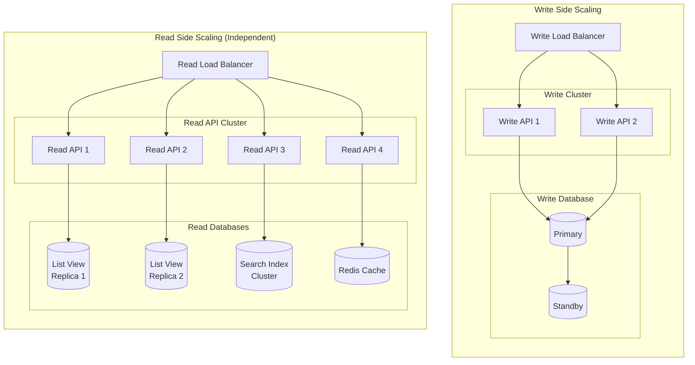
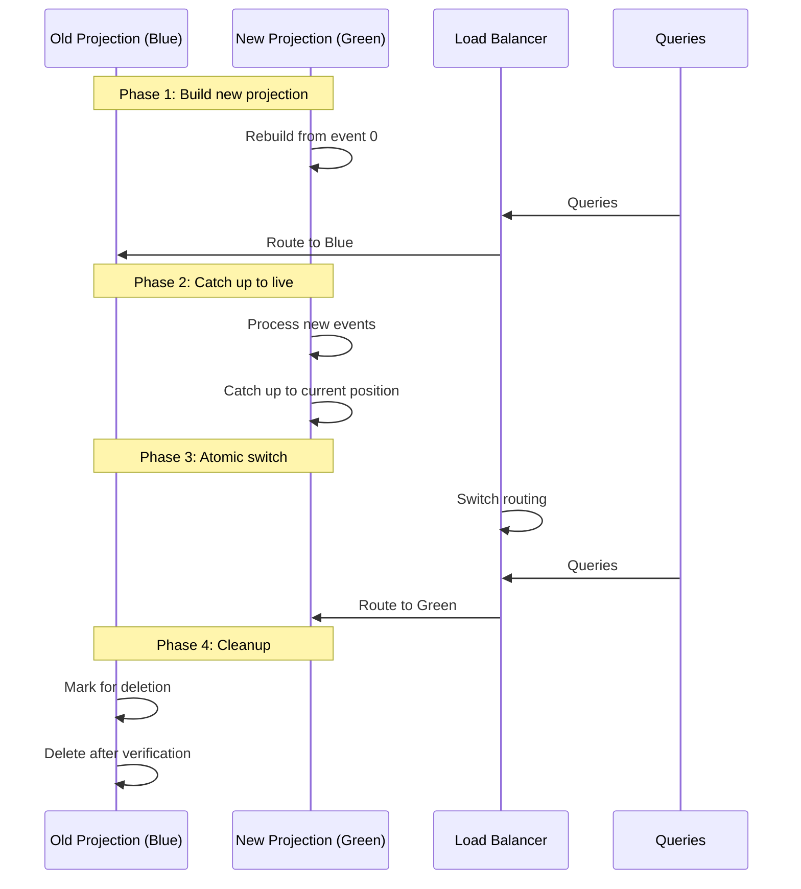
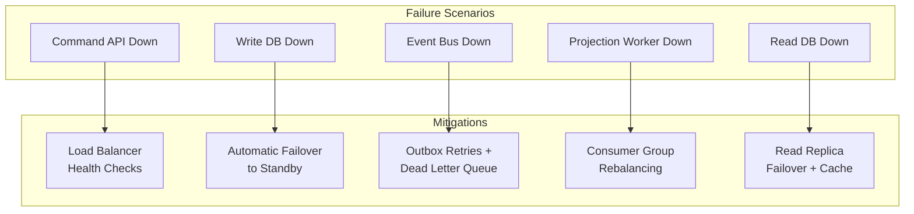
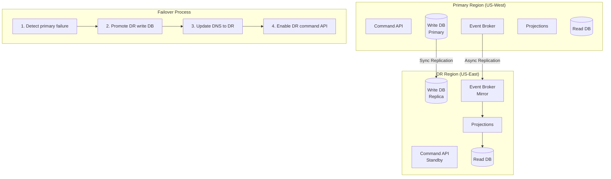

# Scalability and Reliability

## Overview

This document covers scaling strategies, fault tolerance patterns, and disaster recovery approaches for CQRS implementations.

---

## Scaling Strategies

### Independent Scaling of Read and Write Sides



### Scaling Dimensions

```
┌────────────────────────────────────────────────────────────────────┐
│ CQRS SCALING DIMENSIONS                                             │
├────────────────────────────────────────────────────────────────────┤
│                                                                     │
│  1. Write Side Scaling                                              │
│  ┌─────────────────────────────────────────────────────────────┐   │
│  │ Vertical:                                                    │   │
│  │   • Larger DB instance                                      │   │
│  │   • More IOPS                                               │   │
│  │   • Faster CPU for validation                               │   │
│  │                                                              │   │
│  │ Horizontal (Limited):                                        │   │
│  │   • Shard by aggregate (tenant, region)                     │   │
│  │   • Multiple write DBs for different aggregate types        │   │
│  │   • Stateless command handlers (easy to scale)              │   │
│  │                                                              │   │
│  │ Typical ratio: 2-4 write nodes                              │   │
│  └─────────────────────────────────────────────────────────────┘   │
│                                                                     │
│  2. Read Side Scaling                                               │
│  ┌─────────────────────────────────────────────────────────────┐   │
│  │ Horizontal (Unlimited):                                      │   │
│  │   • Add read replicas                                       │   │
│  │   • Add cache layers                                        │   │
│  │   • Add specialized read stores                             │   │
│  │   • Stateless query handlers (trivial to scale)             │   │
│  │                                                              │   │
│  │ Typical ratio: 10-100 read nodes per write node             │   │
│  └─────────────────────────────────────────────────────────────┘   │
│                                                                     │
│  3. Projection Scaling                                              │
│  ┌─────────────────────────────────────────────────────────────┐   │
│  │ Horizontal:                                                  │   │
│  │   • More projection workers                                 │   │
│  │   • Partition events by aggregate type                      │   │
│  │   • Parallel projections per partition                      │   │
│  │                                                              │   │
│  │ Constraint: Events per aggregate must be processed in order │   │
│  │ Solution: Partition by aggregateId                          │   │
│  └─────────────────────────────────────────────────────────────┘   │
│                                                                     │
│  4. Event Bus Scaling                                               │
│  ┌─────────────────────────────────────────────────────────────┐   │
│  │ Horizontal:                                                  │   │
│  │   • More partitions                                         │   │
│  │   • More brokers in cluster                                 │   │
│  │   • Multiple topics for different event types               │   │
│  │                                                              │   │
│  │ Key: Partitions = parallelism ceiling for consumers         │   │
│  └─────────────────────────────────────────────────────────────┘   │
│                                                                     │
└────────────────────────────────────────────────────────────────────┘
```

### Read Replica Strategies

```
┌────────────────────────────────────────────────────────────────────┐
│ READ REPLICA TOPOLOGIES                                             │
├────────────────────────────────────────────────────────────────────┤
│                                                                     │
│  Strategy 1: Database Read Replicas                                │
│  ┌─────────────────────────────────────────────────────────────┐   │
│  │                                                              │   │
│  │  ┌──────────┐                                               │   │
│  │  │ Primary  │─────┬──────────┬──────────┐                   │   │
│  │  └──────────┘     │          │          │                   │   │
│  │                   ▼          ▼          ▼                   │   │
│  │              ┌────────┐ ┌────────┐ ┌────────┐               │   │
│  │              │Replica1│ │Replica2│ │Replica3│               │   │
│  │              └────────┘ └────────┘ └────────┘               │   │
│  │                                                              │   │
│  │  Use for: Same schema, simple scaling                       │   │
│  │  Lag: 10-100ms typically                                    │   │
│  │                                                              │   │
│  └─────────────────────────────────────────────────────────────┘   │
│                                                                     │
│  Strategy 2: Specialized Read Stores                               │
│  ┌─────────────────────────────────────────────────────────────┐   │
│  │                                                              │   │
│  │  Events ───┬───────────────────────────────────────┐        │   │
│  │            │              │              │          │        │   │
│  │            ▼              ▼              ▼          ▼        │   │
│  │       ┌────────┐    ┌────────┐    ┌────────┐  ┌────────┐   │   │
│  │       │Postgres│    │MongoDB │    │Elastic │  │ Redis  │   │   │
│  │       │ List   │    │ Detail │    │ Search │  │ Cache  │   │   │
│  │       └────────┘    └────────┘    └────────┘  └────────┘   │   │
│  │                                                              │   │
│  │  Use for: Different query patterns, polyglot persistence    │   │
│  │                                                              │   │
│  └─────────────────────────────────────────────────────────────┘   │
│                                                                     │
│  Strategy 3: Geo-Distributed Replicas                              │
│  ┌─────────────────────────────────────────────────────────────┐   │
│  │                                                              │   │
│  │  US-WEST          US-EAST          EU-WEST                  │   │
│  │  ┌──────┐         ┌──────┐         ┌──────┐                 │   │
│  │  │Write │────────▶│Read  │────────▶│Read  │                 │   │
│  │  │Primary│        │Replica│        │Replica│                 │   │
│  │  └──────┘         └──────┘         └──────┘                 │   │
│  │                                                              │   │
│  │  Use for: Global users, latency optimization                │   │
│  │  Lag: 100-500ms cross-region                                │   │
│  │                                                              │   │
│  └─────────────────────────────────────────────────────────────┘   │
│                                                                     │
└────────────────────────────────────────────────────────────────────┘
```

### Auto-Scaling Configuration

```
┌────────────────────────────────────────────────────────────────────┐
│ AUTO-SCALING POLICIES                                               │
├────────────────────────────────────────────────────────────────────┤
│                                                                     │
│  Command API Auto-Scaling:                                          │
│  ┌─────────────────────────────────────────────────────────────┐   │
│  │ Metric: CPU utilization                                      │   │
│  │ Scale up: CPU > 70% for 2 minutes                           │   │
│  │ Scale down: CPU < 30% for 10 minutes                        │   │
│  │ Min instances: 2                                             │   │
│  │ Max instances: 10                                            │   │
│  │ Cool-down: 5 minutes                                         │   │
│  └─────────────────────────────────────────────────────────────┘   │
│                                                                     │
│  Query API Auto-Scaling:                                            │
│  ┌─────────────────────────────────────────────────────────────┐   │
│  │ Metric: Request count + latency                             │   │
│  │ Scale up: RPS > 1000 OR p99 > 100ms                         │   │
│  │ Scale down: RPS < 500 AND p99 < 50ms                        │   │
│  │ Min instances: 3                                             │   │
│  │ Max instances: 50                                            │   │
│  │ Cool-down: 3 minutes                                         │   │
│  └─────────────────────────────────────────────────────────────┘   │
│                                                                     │
│  Projection Workers Auto-Scaling:                                   │
│  ┌─────────────────────────────────────────────────────────────┐   │
│  │ Metric: Consumer lag                                         │   │
│  │ Scale up: Lag > 10,000 events for 1 minute                  │   │
│  │ Scale down: Lag < 1,000 events for 5 minutes                │   │
│  │ Min instances: 2                                             │   │
│  │ Max instances: partitions (can't exceed partition count)    │   │
│  │ Cool-down: 2 minutes                                         │   │
│  └─────────────────────────────────────────────────────────────┘   │
│                                                                     │
└────────────────────────────────────────────────────────────────────┘
```

---

## Projection Rebuilding

### Blue-Green Projection Deployment



### Rebuild Process

```
┌────────────────────────────────────────────────────────────────────┐
│ PROJECTION REBUILD PROCESS                                          │
├────────────────────────────────────────────────────────────────────┤
│                                                                     │
│  Step 1: Create New Read Model                                      │
│  ┌─────────────────────────────────────────────────────────────┐   │
│  │ newTableName = "order_list_view_v2"                         │   │
│  │ CREATE TABLE order_list_view_v2 (...)                       │   │
│  │ CREATE INDEX ...                                            │   │
│  └─────────────────────────────────────────────────────────────┘   │
│                                                                     │
│  Step 2: Initialize Checkpoint                                      │
│  ┌─────────────────────────────────────────────────────────────┐   │
│  │ INSERT INTO checkpoints (projection, position)              │   │
│  │ VALUES ('order_list_view_v2', 0)                            │   │
│  └─────────────────────────────────────────────────────────────┘   │
│                                                                     │
│  Step 3: Parallel Rebuild                                           │
│  ┌─────────────────────────────────────────────────────────────┐   │
│  │ // Split event stream into chunks                           │   │
│  │ totalEvents = 100,000,000                                   │   │
│  │ workers = 10                                                 │   │
│  │ chunkSize = totalEvents / workers                           │   │
│  │                                                              │   │
│  │ FOR i = 0 TO workers:                                       │   │
│  │   startPosition = i * chunkSize                             │   │
│  │   endPosition = (i + 1) * chunkSize                         │   │
│  │   spawn(rebuildWorker, startPosition, endPosition)          │   │
│  │                                                              │   │
│  │ waitForAll(workers)                                         │   │
│  └─────────────────────────────────────────────────────────────┘   │
│                                                                     │
│  Step 4: Catch Up to Live                                           │
│  ┌─────────────────────────────────────────────────────────────┐   │
│  │ // Switch to live processing mode                           │   │
│  │ startLiveProjection('order_list_view_v2', lastPosition)     │   │
│  │                                                              │   │
│  │ // Wait until caught up                                     │   │
│  │ WHILE lag('order_list_view_v2') > 100:                      │   │
│  │   SLEEP(1s)                                                 │   │
│  └─────────────────────────────────────────────────────────────┘   │
│                                                                     │
│  Step 5: Atomic Switch                                              │
│  ┌─────────────────────────────────────────────────────────────┐   │
│  │ BEGIN TRANSACTION                                           │   │
│  │   // Rename tables atomically                               │   │
│  │   ALTER TABLE order_list_view                               │   │
│  │     RENAME TO order_list_view_old;                          │   │
│  │   ALTER TABLE order_list_view_v2                            │   │
│  │     RENAME TO order_list_view;                              │   │
│  │                                                              │   │
│  │   // Update checkpoint reference                            │   │
│  │   UPDATE checkpoints                                        │   │
│  │   SET projection = 'order_list_view'                        │   │
│  │   WHERE projection = 'order_list_view_v2';                  │   │
│  │ COMMIT                                                      │   │
│  └─────────────────────────────────────────────────────────────┘   │
│                                                                     │
│  Step 6: Cleanup (After Verification)                               │
│  ┌─────────────────────────────────────────────────────────────┐   │
│  │ // Wait for verification period (1 hour)                    │   │
│  │ SLEEP(1h)                                                   │   │
│  │                                                              │   │
│  │ // Verify new projection is healthy                         │   │
│  │ IF healthy('order_list_view'):                              │   │
│  │   DROP TABLE order_list_view_old;                           │   │
│  │   DELETE FROM checkpoints                                   │   │
│  │     WHERE projection = 'order_list_view_old';               │   │
│  └─────────────────────────────────────────────────────────────┘   │
│                                                                     │
└────────────────────────────────────────────────────────────────────┘
```

---

## Fault Tolerance

### Component Failure Handling



### Circuit Breaker Patterns

```
┌────────────────────────────────────────────────────────────────────┐
│ CIRCUIT BREAKER IMPLEMENTATION                                      │
├────────────────────────────────────────────────────────────────────┤
│                                                                     │
│  Query API → Read Model Circuit Breaker:                           │
│  ┌─────────────────────────────────────────────────────────────┐   │
│  │                                                              │   │
│  │  States:                                                     │   │
│  │  ┌────────┐ failures    ┌──────┐  timeout   ┌──────────┐    │   │
│  │  │ CLOSED │───────────▶ │ OPEN │───────────▶│HALF-OPEN │    │   │
│  │  └────────┘  >= 5/10s   └──────┘   30s      └──────────┘    │   │
│  │       ▲                                          │          │   │
│  │       │                                          │          │   │
│  │       └──────────success──────────────────────────┘          │   │
│  │                                          failure→OPEN       │   │
│  │                                                              │   │
│  │  Configuration:                                              │   │
│  │    failureThreshold: 5                                      │   │
│  │    windowSize: 10s                                          │   │
│  │    openDuration: 30s                                        │   │
│  │    halfOpenRequests: 3                                      │   │
│  │                                                              │   │
│  └─────────────────────────────────────────────────────────────┘   │
│                                                                     │
│  Fallback Behavior When Open:                                      │
│  ┌─────────────────────────────────────────────────────────────┐   │
│  │                                                              │   │
│  │  FUNCTION queryWithFallback(aggregateId):                   │   │
│  │    IF circuitBreaker.isOpen:                                │   │
│  │      // Fallback options:                                   │   │
│  │      1. Return cached data (if available)                   │   │
│  │      2. Query write DB (strong consistency)                 │   │
│  │      3. Return degraded response                            │   │
│  │      4. Return error with retry-after header                │   │
│  │                                                              │   │
│  │    TRY:                                                      │   │
│  │      result = readModel.query(aggregateId)                  │   │
│  │      circuitBreaker.recordSuccess()                         │   │
│  │      RETURN result                                          │   │
│  │    CATCH:                                                    │   │
│  │      circuitBreaker.recordFailure()                         │   │
│  │      RETURN fallback()                                      │   │
│  │                                                              │   │
│  └─────────────────────────────────────────────────────────────┘   │
│                                                                     │
└────────────────────────────────────────────────────────────────────┘
```

### Graceful Degradation

```
┌────────────────────────────────────────────────────────────────────┐
│ GRACEFUL DEGRADATION STRATEGIES                                     │
├────────────────────────────────────────────────────────────────────┤
│                                                                     │
│  Scenario 1: Read Model Unavailable                                │
│  ┌─────────────────────────────────────────────────────────────┐   │
│  │                                                              │   │
│  │  Primary: Dedicated read model (PostgreSQL replica)         │   │
│  │  Fallback 1: Cache (Redis) - may be stale                  │   │
│  │  Fallback 2: Write DB - high latency, limited queries      │   │
│  │  Fallback 3: Partial response with warning                  │   │
│  │                                                              │   │
│  │  Implementation:                                             │   │
│  │    TRY readModel.query()                                    │   │
│  │    CATCH → TRY cache.get()                                  │   │
│  │    CATCH → TRY writeDB.query()                              │   │
│  │    CATCH → RETURN { data: null, status: "degraded" }        │   │
│  │                                                              │   │
│  └─────────────────────────────────────────────────────────────┘   │
│                                                                     │
│  Scenario 2: Event Bus Unavailable                                 │
│  ┌─────────────────────────────────────────────────────────────┐   │
│  │                                                              │   │
│  │  Impact: Projections stop updating, reads become stale      │   │
│  │                                                              │   │
│  │  Mitigation:                                                 │   │
│  │    • Commands continue working (outbox buffers events)      │   │
│  │    • Queries return stale data with warning                 │   │
│  │    • Display "Data may be delayed" banner in UI             │   │
│  │    • Alert operations team                                  │   │
│  │                                                              │   │
│  │  Recovery:                                                   │   │
│  │    • When broker recovers, outbox catches up                │   │
│  │    • Projections process backlog                            │   │
│  │    • System self-heals                                      │   │
│  │                                                              │   │
│  └─────────────────────────────────────────────────────────────┘   │
│                                                                     │
│  Scenario 3: Projection Lag Exceeds SLO                            │
│  ┌─────────────────────────────────────────────────────────────┐   │
│  │                                                              │   │
│  │  Trigger: projection_lag > 30 seconds                       │   │
│  │                                                              │   │
│  │  Actions:                                                    │   │
│  │    1. Auto-scale projection workers                         │   │
│  │    2. Enable "stale read" indicator in responses            │   │
│  │    3. For critical queries: route to write DB               │   │
│  │    4. Page on-call if lag > 5 minutes                       │   │
│  │                                                              │   │
│  │  Response header:                                            │   │
│  │    X-Data-Freshness: stale                                  │   │
│  │    X-Data-Age: 45s                                          │   │
│  │                                                              │   │
│  └─────────────────────────────────────────────────────────────┘   │
│                                                                     │
└────────────────────────────────────────────────────────────────────┘
```

---

## Disaster Recovery

### RPO and RTO Targets

| Component | RPO (Data Loss) | RTO (Downtime) |
|-----------|-----------------|----------------|
| Write Database | 0 (sync replication) | < 1 minute |
| Event Store / Outbox | 0 (sync replication) | < 1 minute |
| Read Models | Rebuildable | < 5 minutes (failover) |
| Message Broker | < 1 second | < 2 minutes |
| Cache | N/A (ephemeral) | < 30 seconds |

### Backup Strategy

```
┌────────────────────────────────────────────────────────────────────┐
│ BACKUP AND RECOVERY STRATEGY                                        │
├────────────────────────────────────────────────────────────────────┤
│                                                                     │
│  Write Database Backup:                                             │
│  ┌─────────────────────────────────────────────────────────────┐   │
│  │ • Continuous WAL archiving (point-in-time recovery)         │   │
│  │ • Daily full backups to object storage                      │   │
│  │ • Cross-region replication for DR                           │   │
│  │ • Test restore monthly                                      │   │
│  │                                                              │   │
│  │ Recovery:                                                    │   │
│  │   1. Restore from latest backup                             │   │
│  │   2. Apply WAL to point-in-time                             │   │
│  │   3. Promote standby if available                           │   │
│  └─────────────────────────────────────────────────────────────┘   │
│                                                                     │
│  Event Store Backup:                                                │
│  ┌─────────────────────────────────────────────────────────────┐   │
│  │ • Events are append-only (natural audit trail)              │   │
│  │ • Replicate to DR region                                    │   │
│  │ • Archive old events to cold storage                        │   │
│  │                                                              │   │
│  │ Recovery:                                                    │   │
│  │   1. Restore event store                                    │   │
│  │   2. Rebuild all projections from events                    │   │
│  │   3. System is fully recovered                              │   │
│  └─────────────────────────────────────────────────────────────┘   │
│                                                                     │
│  Read Model Backup:                                                 │
│  ┌─────────────────────────────────────────────────────────────┐   │
│  │ • Read models are derived (can be rebuilt)                  │   │
│  │ • Optional: Daily snapshots for faster recovery             │   │
│  │                                                              │   │
│  │ Recovery options:                                            │   │
│  │   1. Restore from snapshot + replay recent events           │   │
│  │   2. Full rebuild from event store (slower but complete)   │   │
│  │   3. Failover to replica                                    │   │
│  └─────────────────────────────────────────────────────────────┘   │
│                                                                     │
│  Message Broker Backup:                                             │
│  ┌─────────────────────────────────────────────────────────────┐   │
│  │ • Multi-AZ replication (sync)                               │   │
│  │ • Cross-region replication (async for DR)                   │   │
│  │ • Topic configuration backup                                │   │
│  │                                                              │   │
│  │ Recovery:                                                    │   │
│  │   1. Failover to replica broker                             │   │
│  │   2. Consumers reconnect automatically                      │   │
│  │   3. Resume from last committed offset                      │   │
│  └─────────────────────────────────────────────────────────────┘   │
│                                                                     │
└────────────────────────────────────────────────────────────────────┘
```

### Multi-Region DR



### Disaster Recovery Runbook

```
┌────────────────────────────────────────────────────────────────────┐
│ DR RUNBOOK: Primary Region Failure                                  │
├────────────────────────────────────────────────────────────────────┤
│                                                                     │
│  Detection (Automated):                                             │
│  ┌─────────────────────────────────────────────────────────────┐   │
│  │ 1. Health checks fail for > 30 seconds                      │   │
│  │ 2. Multiple independent monitors confirm outage             │   │
│  │ 3. Auto-page on-call engineer                               │   │
│  │ 4. Slack alert to #incidents channel                        │   │
│  └─────────────────────────────────────────────────────────────┘   │
│                                                                     │
│  Decision (Manual):                                                 │
│  ┌─────────────────────────────────────────────────────────────┐   │
│  │ 1. Assess: Is this a full region failure?                   │   │
│  │ 2. Estimate: How long until primary recovers?               │   │
│  │ 3. Decide: Failover if recovery > 15 minutes               │   │
│  │ 4. Communicate: Notify stakeholders                         │   │
│  └─────────────────────────────────────────────────────────────┘   │
│                                                                     │
│  Failover Execution:                                                │
│  ┌─────────────────────────────────────────────────────────────┐   │
│  │ 1. Promote DR write DB to primary                           │   │
│  │    $ db-promote --region us-east --force                    │   │
│  │                                                              │   │
│  │ 2. Update DNS to point to DR region                         │   │
│  │    $ dns-failover --to us-east --ttl 60                     │   │
│  │                                                              │   │
│  │ 3. Enable DR command API (was read-only)                    │   │
│  │    $ kubectl scale deployment/command-api --replicas=4      │   │
│  │                                                              │   │
│  │ 4. Verify projections are processing                        │   │
│  │    $ projection-status --all                                │   │
│  │                                                              │   │
│  │ 5. Run smoke tests                                          │   │
│  │    $ ./smoke-tests.sh --region us-east                      │   │
│  │                                                              │   │
│  │ 6. Update status page                                       │   │
│  │    "Service restored. Operating from DR region."            │   │
│  └─────────────────────────────────────────────────────────────┘   │
│                                                                     │
│  Post-Failover:                                                     │
│  ┌─────────────────────────────────────────────────────────────┐   │
│  │ 1. Monitor DR region closely                                │   │
│  │ 2. Assess data loss (check event positions)                 │   │
│  │ 3. Plan failback when primary recovers                      │   │
│  │ 4. Post-incident review within 48 hours                     │   │
│  └─────────────────────────────────────────────────────────────┘   │
│                                                                     │
└────────────────────────────────────────────────────────────────────┘
```

---

## Reliability Metrics

### Key Reliability Indicators

| Metric | Target | Measurement |
|--------|--------|-------------|
| Command success rate | > 99.9% | Successful / Total commands |
| Query success rate | > 99.95% | Successful / Total queries |
| Projection lag (p99) | < 5s | Time from event to read model |
| Failover time | < 1 min | Time to restore service |
| Data durability | 99.999999999% | No data loss |
| MTTR | < 15 min | Mean time to recovery |
| MTBF | > 30 days | Mean time between failures |

### Reliability Testing

```
┌────────────────────────────────────────────────────────────────────┐
│ RELIABILITY TESTING SCHEDULE                                        │
├────────────────────────────────────────────────────────────────────┤
│                                                                     │
│  Weekly:                                                            │
│  • Chaos testing: Kill random projection worker                    │
│  • Chaos testing: Simulate broker partition                        │
│  • Verify circuit breakers trigger correctly                       │
│                                                                     │
│  Monthly:                                                           │
│  • DR failover drill (read-only, no DNS change)                    │
│  • Projection rebuild test                                         │
│  • Backup restore verification                                     │
│                                                                     │
│  Quarterly:                                                         │
│  • Full DR failover drill (with DNS)                               │
│  • Capacity planning review                                        │
│  • SLO review and adjustment                                       │
│                                                                     │
│  Annually:                                                          │
│  • Multi-region failover exercise                                  │
│  • Full disaster recovery simulation                               │
│  • Architecture review                                             │
│                                                                     │
└────────────────────────────────────────────────────────────────────┘
```
