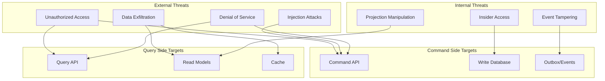

# Security and Compliance

## Overview

This document covers security considerations and compliance challenges specific to CQRS implementations, including authorization patterns, data protection, and regulatory requirements.

---

## Threat Model

### Attack Surface Analysis



### Threat Categories

```
┌────────────────────────────────────────────────────────────────────┐
│ CQRS-SPECIFIC SECURITY THREATS                                      │
├────────────────────────────────────────────────────────────────────┤
│                                                                     │
│  1. Command Side Threats                                            │
│  ┌─────────────────────────────────────────────────────────────┐   │
│  │ • Unauthorized command execution                            │   │
│  │ • Command injection (malicious payloads)                    │   │
│  │ • Command replay attacks                                    │   │
│  │ • Privilege escalation via commands                         │   │
│  │ • Rate limiting bypass                                      │   │
│  └─────────────────────────────────────────────────────────────┘   │
│                                                                     │
│  2. Query Side Threats                                              │
│  ┌─────────────────────────────────────────────────────────────┐   │
│  │ • Unauthorized data access                                  │   │
│  │ • Data leakage via read models                             │   │
│  │ • Excessive data exposure (over-fetching)                  │   │
│  │ • Cache poisoning                                          │   │
│  │ • Query injection                                          │   │
│  └─────────────────────────────────────────────────────────────┘   │
│                                                                     │
│  3. Event/Projection Threats                                        │
│  ┌─────────────────────────────────────────────────────────────┐   │
│  │ • Event tampering (if not immutable)                       │   │
│  │ • Unauthorized event access                                │   │
│  │ • Projection poisoning via malformed events                │   │
│  │ • Sensitive data in events (long retention)                │   │
│  │ • Event replay for information gathering                   │   │
│  └─────────────────────────────────────────────────────────────┘   │
│                                                                     │
│  4. Cross-Cutting Threats                                           │
│  ┌─────────────────────────────────────────────────────────────┐   │
│  │ • Inconsistent security between read/write                 │   │
│  │ • Stale authorization data in projections                  │   │
│  │ • Audit trail gaps                                         │   │
│  │ • Key management for encryption                            │   │
│  └─────────────────────────────────────────────────────────────┘   │
│                                                                     │
└────────────────────────────────────────────────────────────────────┘
```

---

## Authentication and Authorization

### Separate AuthZ for Commands and Queries

```
┌────────────────────────────────────────────────────────────────────┐
│ AUTHORIZATION PATTERNS                                              │
├────────────────────────────────────────────────────────────────────┤
│                                                                     │
│  Command Authorization (Write):                                     │
│  ┌─────────────────────────────────────────────────────────────┐   │
│  │                                                              │   │
│  │  Required checks:                                            │   │
│  │  1. Is user authenticated?                                  │   │
│  │  2. Can user execute this command type?                     │   │
│  │  3. Can user act on this specific resource?                 │   │
│  │  4. Is the action valid in current context?                 │   │
│  │                                                              │   │
│  │  Example: UpdateOrderStatus                                  │   │
│  │  ┌───────────────────────────────────────────────────────┐   │   │
│  │  │ FUNCTION authorizeCommand(user, command):             │   │   │
│  │  │   // Check command-level permission                   │   │   │
│  │  │   IF NOT user.hasPermission("orders:update"):        │   │   │
│  │  │     DENY "Missing permission"                        │   │   │
│  │  │                                                       │   │   │
│  │  │   // Check resource-level access                      │   │   │
│  │  │   order = loadOrder(command.orderId)                 │   │   │
│  │  │   IF NOT canAccessOrder(user, order):                │   │   │
│  │  │     DENY "Not authorized for this order"             │   │   │
│  │  │                                                       │   │   │
│  │  │   // Check business rules                             │   │   │
│  │  │   IF order.status == "shipped":                      │   │   │
│  │  │     DENY "Cannot modify shipped orders"              │   │   │
│  │  │                                                       │   │   │
│  │  │   ALLOW                                               │   │   │
│  │  └───────────────────────────────────────────────────────┘   │   │
│  │                                                              │   │
│  └─────────────────────────────────────────────────────────────┘   │
│                                                                     │
│  Query Authorization (Read):                                        │
│  ┌─────────────────────────────────────────────────────────────┐   │
│  │                                                              │   │
│  │  Approaches:                                                 │   │
│  │                                                              │   │
│  │  1. Filter at query time                                    │   │
│  │  ┌───────────────────────────────────────────────────────┐   │   │
│  │  │ SELECT * FROM order_list_view                         │   │   │
│  │  │ WHERE tenant_id = :userTenantId                       │   │   │
│  │  │   AND (owner_id = :userId                             │   │   │
│  │  │        OR :userId IN (team_members))                  │   │   │
│  │  └───────────────────────────────────────────────────────┘   │   │
│  │                                                              │   │
│  │  2. Separate read models per tenant/role                    │   │
│  │  ┌───────────────────────────────────────────────────────┐   │   │
│  │  │ order_list_view_tenant_A                              │   │   │
│  │  │ order_list_view_tenant_B                              │   │   │
│  │  │ (Projection filters by tenant at build time)          │   │   │
│  │  └───────────────────────────────────────────────────────┘   │   │
│  │                                                              │   │
│  │  3. Row-level security (database enforced)                  │   │
│  │  ┌───────────────────────────────────────────────────────┐   │   │
│  │  │ CREATE POLICY tenant_isolation ON order_list_view     │   │   │
│  │  │ USING (tenant_id = current_setting('app.tenant_id')); │   │   │
│  │  └───────────────────────────────────────────────────────┘   │   │
│  │                                                              │   │
│  └─────────────────────────────────────────────────────────────┘   │
│                                                                     │
└────────────────────────────────────────────────────────────────────┘
```

### Authorization Consistency Challenge

```
┌────────────────────────────────────────────────────────────────────┐
│ STALE AUTHORIZATION PROBLEM                                         │
├────────────────────────────────────────────────────────────────────┤
│                                                                     │
│  Problem: User permissions change but read model has old data      │
│                                                                     │
│  Timeline:                                                          │
│  ┌─────────────────────────────────────────────────────────────┐   │
│  │ T1: Order created, user A is owner                          │   │
│  │ T2: User A removed from team (permission revoked)           │   │
│  │ T3: Projection not yet updated                              │   │
│  │ T4: User A queries order list                               │   │
│  │ T5: Read model still shows order (stale permission!)        │   │
│  └─────────────────────────────────────────────────────────────┘   │
│                                                                     │
│  Solutions:                                                         │
│                                                                     │
│  1. Query-time authorization (always current)                      │
│  ┌─────────────────────────────────────────────────────────────┐   │
│  │ FUNCTION query(user):                                        │   │
│  │   data = readModel.fetch()                                  │   │
│  │   permissions = authService.getCurrentPermissions(user)     │   │
│  │   RETURN data.filter(item => canAccess(permissions, item)) │   │
│  │                                                              │   │
│  │ Pros: Always consistent                                      │   │
│  │ Cons: Additional latency, authService dependency            │   │
│  └─────────────────────────────────────────────────────────────┘   │
│                                                                     │
│  2. Permission events update projections                           │
│  ┌─────────────────────────────────────────────────────────────┐   │
│  │ Events:                                                      │   │
│  │   UserRemovedFromTeam                                       │   │
│  │   UserPermissionRevoked                                     │   │
│  │                                                              │   │
│  │ Projection handler:                                          │   │
│  │   ON UserRemovedFromTeam:                                   │   │
│  │     UPDATE read_model SET team_members = ...                │   │
│  │                                                              │   │
│  │ Pros: Fast queries, eventually consistent                   │   │
│  │ Cons: Lag between permission change and query update        │   │
│  └─────────────────────────────────────────────────────────────┘   │
│                                                                     │
│  3. Hybrid: Fast path + validation                                 │
│  ┌─────────────────────────────────────────────────────────────┐   │
│  │ // Fetch from read model (fast)                             │   │
│  │ candidates = readModel.fetch()                              │   │
│  │                                                              │   │
│  │ // Validate critical items (when data is sensitive)         │   │
│  │ FOR item IN candidates WHERE item.sensitive:                │   │
│  │   IF NOT authService.canAccess(user, item.id):             │   │
│  │     candidates.remove(item)                                 │   │
│  │                                                              │   │
│  │ RETURN candidates                                           │   │
│  └─────────────────────────────────────────────────────────────┘   │
│                                                                     │
└────────────────────────────────────────────────────────────────────┘
```

---

## Data Protection

### Data Masking in Read Models

```
┌────────────────────────────────────────────────────────────────────┐
│ DATA MASKING STRATEGIES                                             │
├────────────────────────────────────────────────────────────────────┤
│                                                                     │
│  Strategy 1: Mask at Projection Time                               │
│  ┌─────────────────────────────────────────────────────────────┐   │
│  │                                                              │   │
│  │  Event: CustomerCreated                                      │   │
│  │  {                                                           │   │
│  │    "email": "john.doe@example.com",                         │   │
│  │    "phone": "+1-555-123-4567",                              │   │
│  │    "ssn": "123-45-6789"                                     │   │
│  │  }                                                           │   │
│  │                                                              │   │
│  │  Read Model (List View - masked):                           │   │
│  │  {                                                           │   │
│  │    "email": "j***@example.com",                             │   │
│  │    "phone": "+1-555-***-4567",                              │   │
│  │    "ssn": null  // Not stored                               │   │
│  │  }                                                           │   │
│  │                                                              │   │
│  │  Read Model (Admin View - full):                            │   │
│  │  {                                                           │   │
│  │    "email": "john.doe@example.com",                         │   │
│  │    "phone": "+1-555-123-4567",                              │   │
│  │    "ssn": "123-45-6789"  // Encrypted at rest               │   │
│  │  }                                                           │   │
│  │                                                              │   │
│  └─────────────────────────────────────────────────────────────┘   │
│                                                                     │
│  Strategy 2: Mask at Query Time                                    │
│  ┌─────────────────────────────────────────────────────────────┐   │
│  │                                                              │   │
│  │  FUNCTION queryCustomer(user, customerId):                  │   │
│  │    customer = readModel.get(customerId)                     │   │
│  │                                                              │   │
│  │    IF NOT user.hasPermission("pii:read"):                  │   │
│  │      customer.email = maskEmail(customer.email)             │   │
│  │      customer.phone = maskPhone(customer.phone)             │   │
│  │      customer.ssn = null                                    │   │
│  │                                                              │   │
│  │    RETURN customer                                          │   │
│  │                                                              │   │
│  └─────────────────────────────────────────────────────────────┘   │
│                                                                     │
│  Strategy 3: Tokenization                                          │
│  ┌─────────────────────────────────────────────────────────────┐   │
│  │                                                              │   │
│  │  Read Model stores token:                                    │   │
│  │  {                                                           │   │
│  │    "emailToken": "tok_abc123",                              │   │
│  │    "phoneToken": "tok_def456"                               │   │
│  │  }                                                           │   │
│  │                                                              │   │
│  │  Query with de-tokenization:                                │   │
│  │  {                                                           │   │
│  │    "email": tokenService.reveal("tok_abc123"),              │   │
│  │    "phone": tokenService.reveal("tok_def456")               │   │
│  │  }                                                           │   │
│  │                                                              │   │
│  │  Benefits:                                                   │   │
│  │    • Real data never in read model                          │   │
│  │    • Centralized access control                             │   │
│  │    • Easy revocation                                        │   │
│  │                                                              │   │
│  └─────────────────────────────────────────────────────────────┘   │
│                                                                     │
└────────────────────────────────────────────────────────────────────┘
```

### Encryption

```
┌────────────────────────────────────────────────────────────────────┐
│ ENCRYPTION STRATEGY                                                 │
├────────────────────────────────────────────────────────────────────┤
│                                                                     │
│  Data at Rest:                                                      │
│  ┌─────────────────────────────────────────────────────────────┐   │
│  │                                                              │   │
│  │  Component              Encryption                          │   │
│  │  ─────────────────────────────────────────────────────────  │   │
│  │  Write Database         TDE (Transparent Data Encryption)   │   │
│  │  Event Store            TDE + field-level for PII           │   │
│  │  Read Models            TDE                                 │   │
│  │  Backups                Encrypted with managed keys         │   │
│  │  Message Broker         Encryption at rest enabled          │   │
│  │                                                              │   │
│  └─────────────────────────────────────────────────────────────┘   │
│                                                                     │
│  Data in Transit:                                                   │
│  ┌─────────────────────────────────────────────────────────────┐   │
│  │                                                              │   │
│  │  • TLS 1.3 for all API endpoints                            │   │
│  │  • TLS for database connections                             │   │
│  │  • TLS for message broker connections                       │   │
│  │  • mTLS for internal service-to-service                     │   │
│  │                                                              │   │
│  └─────────────────────────────────────────────────────────────┘   │
│                                                                     │
│  Field-Level Encryption (Sensitive Data):                          │
│  ┌─────────────────────────────────────────────────────────────┐   │
│  │                                                              │   │
│  │  // Store encrypted                                          │   │
│  │  event.data.ssn = encrypt(ssn, dataKey)                     │   │
│  │                                                              │   │
│  │  // Read with decryption                                     │   │
│  │  ssn = decrypt(event.data.ssn, dataKey)                     │   │
│  │                                                              │   │
│  │  Key rotation:                                               │   │
│  │    • Rotate data keys quarterly                             │   │
│  │    • Re-encrypt on read (lazy re-encryption)                │   │
│  │    • Full re-encryption during maintenance window           │   │
│  │                                                              │   │
│  └─────────────────────────────────────────────────────────────┘   │
│                                                                     │
└────────────────────────────────────────────────────────────────────┘
```

---

## Audit Trail

### Event Sourcing + CQRS Audit Integration

```
┌────────────────────────────────────────────────────────────────────┐
│ AUDIT TRAIL ARCHITECTURE                                            │
├────────────────────────────────────────────────────────────────────┤
│                                                                     │
│  With Event Sourcing (Comprehensive):                              │
│  ┌─────────────────────────────────────────────────────────────┐   │
│  │                                                              │   │
│  │  Events ARE the audit trail:                                │   │
│  │  {                                                           │   │
│  │    "eventId": "evt-123",                                    │   │
│  │    "eventType": "OrderStatusChanged",                       │   │
│  │    "timestamp": "2025-01-15T10:30:00Z",                     │   │
│  │    "actor": {                                                │   │
│  │      "userId": "user-456",                                  │   │
│  │      "role": "admin",                                       │   │
│  │      "ip": "192.168.1.100"                                  │   │
│  │    },                                                        │   │
│  │    "data": {                                                 │   │
│  │      "orderId": "order-789",                                │   │
│  │      "previousStatus": "pending",                           │   │
│  │      "newStatus": "shipped",                                │   │
│  │      "reason": "Customer requested"                         │   │
│  │    },                                                        │   │
│  │    "correlationId": "req-abc"                               │   │
│  │  }                                                           │   │
│  │                                                              │   │
│  │  Query audit: "Who changed order-789 status?"               │   │
│  │  SELECT * FROM events                                       │   │
│  │  WHERE aggregate_id = 'order-789'                           │   │
│  │    AND event_type = 'OrderStatusChanged'                    │   │
│  │  ORDER BY timestamp;                                        │   │
│  │                                                              │   │
│  └─────────────────────────────────────────────────────────────┘   │
│                                                                     │
│  Without Event Sourcing (Explicit Audit Log):                      │
│  ┌─────────────────────────────────────────────────────────────┐   │
│  │                                                              │   │
│  │  Separate audit_log table:                                  │   │
│  │  {                                                           │   │
│  │    "auditId": "aud-123",                                    │   │
│  │    "action": "UPDATE",                                      │   │
│  │    "resource": "Order",                                     │   │
│  │    "resourceId": "order-789",                               │   │
│  │    "actor": "user-456",                                     │   │
│  │    "timestamp": "2025-01-15T10:30:00Z",                     │   │
│  │    "changes": {                                              │   │
│  │      "status": { "from": "pending", "to": "shipped" }       │   │
│  │    },                                                        │   │
│  │    "metadata": { "ip": "...", "userAgent": "..." }          │   │
│  │  }                                                           │   │
│  │                                                              │   │
│  │  Written in same transaction as command                     │   │
│  │                                                              │   │
│  └─────────────────────────────────────────────────────────────┘   │
│                                                                     │
│  Read Access Auditing:                                              │
│  ┌─────────────────────────────────────────────────────────────┐   │
│  │                                                              │   │
│  │  Log sensitive data access:                                  │   │
│  │  {                                                           │   │
│  │    "action": "READ",                                        │   │
│  │    "resource": "Customer",                                  │   │
│  │    "resourceId": "cust-123",                                │   │
│  │    "fieldsAccessed": ["email", "phone", "ssn"],            │   │
│  │    "actor": "user-456",                                     │   │
│  │    "timestamp": "2025-01-15T10:30:00Z",                     │   │
│  │    "purpose": "support_ticket_123"                          │   │
│  │  }                                                           │   │
│  │                                                              │   │
│  │  Required for: HIPAA, SOC2, PCI-DSS                         │   │
│  │                                                              │   │
│  └─────────────────────────────────────────────────────────────┘   │
│                                                                     │
└────────────────────────────────────────────────────────────────────┘
```

---

## Compliance Challenges

### GDPR: Right to Erasure

```
┌────────────────────────────────────────────────────────────────────┐
│ GDPR RIGHT TO ERASURE (Right to be Forgotten)                       │
├────────────────────────────────────────────────────────────────────┤
│                                                                     │
│  Challenge: Events are immutable, but GDPR requires deletion       │
│                                                                     │
│  Solution 1: Crypto-Shredding                                      │
│  ┌─────────────────────────────────────────────────────────────┐   │
│  │                                                              │   │
│  │  How it works:                                               │   │
│  │  1. Encrypt PII with per-user key                           │   │
│  │  2. Store key in separate key store                         │   │
│  │  3. On deletion request: delete the key                     │   │
│  │  4. PII becomes unreadable (effectively deleted)            │   │
│  │                                                              │   │
│  │  Event with encrypted PII:                                   │   │
│  │  {                                                           │   │
│  │    "eventType": "CustomerCreated",                          │   │
│  │    "data": {                                                 │   │
│  │      "customerId": "cust-123",                              │   │
│  │      "name_encrypted": "enc_abc...",                        │   │
│  │      "email_encrypted": "enc_def...",                       │   │
│  │      "keyId": "key-user-123"                                │   │
│  │    }                                                         │   │
│  │  }                                                           │   │
│  │                                                              │   │
│  │  After crypto-shredding (key deleted):                      │   │
│  │  {                                                           │   │
│  │    "customerId": "cust-123",                                │   │
│  │    "name": "[DELETED]",  // Cannot decrypt                 │   │
│  │    "email": "[DELETED]"                                     │   │
│  │  }                                                           │   │
│  │                                                              │   │
│  └─────────────────────────────────────────────────────────────┘   │
│                                                                     │
│  Solution 2: Event Tombstoning                                     │
│  ┌─────────────────────────────────────────────────────────────┐   │
│  │                                                              │   │
│  │  Add tombstone event:                                        │   │
│  │  {                                                           │   │
│  │    "eventType": "CustomerDataErased",                       │   │
│  │    "customerId": "cust-123",                                │   │
│  │    "timestamp": "2025-01-20T00:00:00Z",                     │   │
│  │    "reason": "GDPR_ERASURE_REQUEST",                        │   │
│  │    "requestId": "gdpr-req-456"                              │   │
│  │  }                                                           │   │
│  │                                                              │   │
│  │  Projection handles tombstone:                               │   │
│  │    • Removes PII from read models                           │   │
│  │    • Replaces with "[DELETED]" or anonymized data           │   │
│  │    • Maintains aggregate structure for reporting            │   │
│  │                                                              │   │
│  └─────────────────────────────────────────────────────────────┘   │
│                                                                     │
│  Read Model After Erasure:                                         │
│  ┌─────────────────────────────────────────────────────────────┐   │
│  │                                                              │   │
│  │  Before:                                                     │   │
│  │  { "customerId": "cust-123", "name": "John Doe", ... }      │   │
│  │                                                              │   │
│  │  After:                                                      │   │
│  │  { "customerId": "cust-123", "name": "[DELETED]", ... }     │   │
│  │                                                              │   │
│  │  Or completely removed from read model                      │   │
│  │                                                              │   │
│  └─────────────────────────────────────────────────────────────┘   │
│                                                                     │
└────────────────────────────────────────────────────────────────────┘
```

### Data Retention Policies

```
┌────────────────────────────────────────────────────────────────────┐
│ DATA RETENTION IMPLEMENTATION                                       │
├────────────────────────────────────────────────────────────────────┤
│                                                                     │
│  Retention by Data Type:                                            │
│  ┌─────────────────────────────────────────────────────────────┐   │
│  │                                                              │   │
│  │  Data Type              Retention        Action              │   │
│  │  ──────────────────────────────────────────────────────────  │   │
│  │  Transaction events     7 years          Archive to cold    │   │
│  │  User PII events        Until erasure    Crypto-shred       │   │
│  │  Session events         90 days          Delete             │   │
│  │  Audit logs             7 years          Archive            │   │
│  │  Read model cache       24 hours         Auto-expire        │   │
│  │                                                              │   │
│  └─────────────────────────────────────────────────────────────┘   │
│                                                                     │
│  Retention Implementation:                                          │
│  ┌─────────────────────────────────────────────────────────────┐   │
│  │                                                              │   │
│  │  // Daily retention job                                      │   │
│  │  FUNCTION enforceRetention():                               │   │
│  │    // Archive old events to cold storage                    │   │
│  │    archiveEvents(olderThan: 1 year, type: "transaction")   │   │
│  │                                                              │   │
│  │    // Delete expired session events                         │   │
│  │    deleteEvents(olderThan: 90 days, type: "session")       │   │
│  │                                                              │   │
│  │    // Process pending erasure requests                      │   │
│  │    FOR request IN pendingErasureRequests:                   │   │
│  │      cryptoShred(request.userId)                            │   │
│  │      rebuildAffectedProjections(request.userId)             │   │
│  │                                                              │   │
│  └─────────────────────────────────────────────────────────────┘   │
│                                                                     │
└────────────────────────────────────────────────────────────────────┘
```

---

## Security Best Practices

### Command Security Checklist

```
┌────────────────────────────────────────────────────────────────────┐
│ COMMAND SECURITY CHECKLIST                                          │
├────────────────────────────────────────────────────────────────────┤
│                                                                     │
│  [ ] Authentication required for all commands                      │
│  [ ] Authorization checked at command and resource level           │
│  [ ] Input validation (type, length, format)                       │
│  [ ] Idempotency keys prevent replay attacks                       │
│  [ ] Rate limiting per user/IP                                     │
│  [ ] Sensitive data encrypted in events                            │
│  [ ] Actor information captured in events                          │
│  [ ] Command payload size limits                                   │
│  [ ] Injection prevention (parameterized queries)                  │
│  [ ] Audit logging for all commands                                │
│                                                                     │
└────────────────────────────────────────────────────────────────────┘
```

### Query Security Checklist

```
┌────────────────────────────────────────────────────────────────────┐
│ QUERY SECURITY CHECKLIST                                            │
├────────────────────────────────────────────────────────────────────┤
│                                                                     │
│  [ ] Authentication required (or explicit public endpoints)        │
│  [ ] Row-level security for multi-tenant data                     │
│  [ ] Data masking for sensitive fields                            │
│  [ ] Query result size limits                                      │
│  [ ] Rate limiting for expensive queries                          │
│  [ ] No sensitive data in cache keys                              │
│  [ ] Cache entries respect authorization                          │
│  [ ] Audit logging for sensitive data access                       │
│  [ ] Pagination enforced (no unbounded queries)                   │
│  [ ] Search queries sanitized                                      │
│                                                                     │
└────────────────────────────────────────────────────────────────────┘
```

### Event Security Checklist

```
┌────────────────────────────────────────────────────────────────────┐
│ EVENT SECURITY CHECKLIST                                            │
├────────────────────────────────────────────────────────────────────┤
│                                                                     │
│  [ ] Events are immutable (append-only store)                     │
│  [ ] PII encrypted at field level                                 │
│  [ ] Crypto-shredding strategy for GDPR                           │
│  [ ] Event schema validation before storage                       │
│  [ ] Access control for event subscriptions                       │
│  [ ] Event retention policies implemented                         │
│  [ ] Sensitive events not logged in plaintext                     │
│  [ ] Event tampering detection (checksums/signing)                │
│  [ ] Dead letter queue monitored for data leaks                   │
│  [ ] Event replays authorized and logged                          │
│                                                                     │
└────────────────────────────────────────────────────────────────────┘
```

---

## Compliance Matrix

| Requirement | GDPR | HIPAA | SOC2 | PCI-DSS |
|-------------|------|-------|------|---------|
| Data encryption at rest | Required | Required | Required | Required |
| Data encryption in transit | Required | Required | Required | Required |
| Access controls | Required | Required | Required | Required |
| Audit logging | Required | Required | Required | Required |
| Data retention limits | Required | Varies | Varies | 1 year |
| Right to erasure | Required | N/A | N/A | N/A |
| Data masking | Recommended | Required | Recommended | Required |
| Breach notification | 72 hours | 60 days | Required | Varies |
