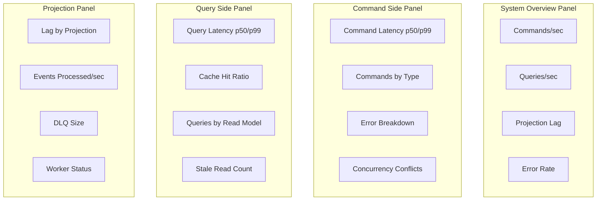
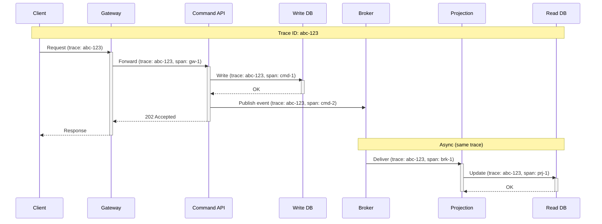

# Observability

## Overview

This document covers monitoring, logging, tracing, and alerting strategies specific to CQRS implementations, with a focus on tracking the health of both command and query sides.

---

## Key Metrics

### Command Side Metrics

```
┌────────────────────────────────────────────────────────────────────┐
│ COMMAND METRICS                                                     │
├────────────────────────────────────────────────────────────────────┤
│                                                                     │
│  Throughput Metrics:                                                │
│  ┌─────────────────────────────────────────────────────────────┐   │
│  │ commands_total                                               │   │
│  │   Labels: command_type, status (success/failure/rejected)   │   │
│  │   Purpose: Track command volume and success rate            │   │
│  │                                                              │   │
│  │ commands_per_second                                          │   │
│  │   Labels: command_type                                      │   │
│  │   Purpose: Real-time throughput                             │   │
│  └─────────────────────────────────────────────────────────────┘   │
│                                                                     │
│  Latency Metrics:                                                   │
│  ┌─────────────────────────────────────────────────────────────┐   │
│  │ command_duration_seconds                                     │   │
│  │   Type: Histogram                                           │   │
│  │   Buckets: 0.01, 0.025, 0.05, 0.1, 0.25, 0.5, 1, 2.5       │   │
│  │   Labels: command_type                                      │   │
│  │   Purpose: Track command processing time                    │   │
│  │                                                              │   │
│  │ command_validation_duration_seconds                          │   │
│  │   Purpose: Time spent in validation phase                   │   │
│  │                                                              │   │
│  │ command_db_write_duration_seconds                            │   │
│  │   Purpose: Time spent writing to database                   │   │
│  └─────────────────────────────────────────────────────────────┘   │
│                                                                     │
│  Error Metrics:                                                     │
│  ┌─────────────────────────────────────────────────────────────┐   │
│  │ command_errors_total                                         │   │
│  │   Labels: command_type, error_type                          │   │
│  │   error_type: validation, domain, concurrency, system       │   │
│  │                                                              │   │
│  │ command_concurrency_conflicts_total                          │   │
│  │   Purpose: Track optimistic concurrency failures            │   │
│  │                                                              │   │
│  │ command_idempotency_hits_total                               │   │
│  │   Purpose: Track duplicate command detections               │   │
│  └─────────────────────────────────────────────────────────────┘   │
│                                                                     │
└────────────────────────────────────────────────────────────────────┘
```

### Query Side Metrics

```
┌────────────────────────────────────────────────────────────────────┐
│ QUERY METRICS                                                       │
├────────────────────────────────────────────────────────────────────┤
│                                                                     │
│  Throughput Metrics:                                                │
│  ┌─────────────────────────────────────────────────────────────┐   │
│  │ queries_total                                                │   │
│  │   Labels: query_type, read_model, status                    │   │
│  │                                                              │   │
│  │ queries_per_second                                           │   │
│  │   Labels: query_type, read_model                            │   │
│  └─────────────────────────────────────────────────────────────┘   │
│                                                                     │
│  Latency Metrics:                                                   │
│  ┌─────────────────────────────────────────────────────────────┐   │
│  │ query_duration_seconds                                       │   │
│  │   Type: Histogram                                           │   │
│  │   Buckets: 0.005, 0.01, 0.025, 0.05, 0.1, 0.25, 0.5        │   │
│  │   Labels: query_type, read_model, cache_status              │   │
│  │   cache_status: hit, miss                                   │   │
│  │                                                              │   │
│  │ query_db_duration_seconds                                    │   │
│  │   Purpose: Time spent in database query                     │   │
│  │                                                              │   │
│  │ query_serialization_duration_seconds                         │   │
│  │   Purpose: Time spent serializing response                  │   │
│  └─────────────────────────────────────────────────────────────┘   │
│                                                                     │
│  Cache Metrics:                                                     │
│  ┌─────────────────────────────────────────────────────────────┐   │
│  │ cache_hits_total                                             │   │
│  │ cache_misses_total                                           │   │
│  │ cache_hit_ratio                                              │   │
│  │   Formula: hits / (hits + misses)                           │   │
│  │   Target: > 90% for hot data                                │   │
│  │                                                              │   │
│  │ cache_evictions_total                                        │   │
│  │   Purpose: Track cache pressure                             │   │
│  └─────────────────────────────────────────────────────────────┘   │
│                                                                     │
│  Freshness Metrics:                                                 │
│  ┌─────────────────────────────────────────────────────────────┐   │
│  │ query_stale_reads_total                                      │   │
│  │   Purpose: Queries returning stale data                     │   │
│  │                                                              │   │
│  │ query_version_wait_duration_seconds                          │   │
│  │   Purpose: Time waiting for read-your-writes                │   │
│  │                                                              │   │
│  │ query_version_wait_timeouts_total                            │   │
│  │   Purpose: Consistency wait failures                        │   │
│  └─────────────────────────────────────────────────────────────┘   │
│                                                                     │
└────────────────────────────────────────────────────────────────────┘
```

### Projection Metrics (Critical)

```
┌────────────────────────────────────────────────────────────────────┐
│ PROJECTION METRICS                                                  │
├────────────────────────────────────────────────────────────────────┤
│                                                                     │
│  Lag Metrics (Most Important):                                      │
│  ┌─────────────────────────────────────────────────────────────┐   │
│  │ projection_lag_seconds                                       │   │
│  │   Type: Gauge                                               │   │
│  │   Labels: projection_name                                   │   │
│  │   Calculation: now() - last_processed_event_timestamp       │   │
│  │   Alert: > 5 seconds                                        │   │
│  │                                                              │   │
│  │ projection_lag_events                                        │   │
│  │   Type: Gauge                                               │   │
│  │   Labels: projection_name                                   │   │
│  │   Calculation: latest_event_position - checkpoint_position  │   │
│  │   Alert: > 10,000 events                                    │   │
│  │                                                              │   │
│  │ projection_position                                          │   │
│  │   Type: Gauge                                               │   │
│  │   Labels: projection_name                                   │   │
│  │   Purpose: Track absolute position                          │   │
│  └─────────────────────────────────────────────────────────────┘   │
│                                                                     │
│  Processing Metrics:                                                │
│  ┌─────────────────────────────────────────────────────────────┐   │
│  │ projection_events_processed_total                            │   │
│  │   Labels: projection_name, event_type                       │   │
│  │                                                              │   │
│  │ projection_events_per_second                                 │   │
│  │   Labels: projection_name                                   │   │
│  │                                                              │   │
│  │ projection_event_processing_duration_seconds                 │   │
│  │   Type: Histogram                                           │   │
│  │   Labels: projection_name, event_type                       │   │
│  │                                                              │   │
│  │ projection_batch_size                                        │   │
│  │   Type: Histogram                                           │   │
│  │   Purpose: Track batch processing efficiency                │   │
│  └─────────────────────────────────────────────────────────────┘   │
│                                                                     │
│  Error Metrics:                                                     │
│  ┌─────────────────────────────────────────────────────────────┐   │
│  │ projection_errors_total                                      │   │
│  │   Labels: projection_name, error_type                       │   │
│  │   error_type: transient, permanent, poison                  │   │
│  │                                                              │   │
│  │ projection_dead_letter_queue_size                            │   │
│  │   Type: Gauge                                               │   │
│  │   Alert: > 0 (any DLQ entry needs attention)               │   │
│  │                                                              │   │
│  │ projection_retries_total                                     │   │
│  │   Labels: projection_name                                   │   │
│  │   Purpose: Track retry frequency                            │   │
│  └─────────────────────────────────────────────────────────────┘   │
│                                                                     │
│  Health Metrics:                                                    │
│  ┌─────────────────────────────────────────────────────────────┐   │
│  │ projection_status                                            │   │
│  │   Type: Gauge (enum)                                        │   │
│  │   Values: 0=stopped, 1=running, 2=catching_up, 3=error     │   │
│  │   Labels: projection_name                                   │   │
│  │                                                              │   │
│  │ projection_workers_active                                    │   │
│  │   Type: Gauge                                               │   │
│  │   Purpose: Number of active projection workers              │   │
│  └─────────────────────────────────────────────────────────────┘   │
│                                                                     │
└────────────────────────────────────────────────────────────────────┘
```

### Event Bus Metrics

```
┌────────────────────────────────────────────────────────────────────┐
│ EVENT BUS METRICS                                                   │
├────────────────────────────────────────────────────────────────────┤
│                                                                     │
│  Outbox Metrics:                                                    │
│  ┌─────────────────────────────────────────────────────────────┐   │
│  │ outbox_pending_events                                        │   │
│  │   Type: Gauge                                               │   │
│  │   Purpose: Events waiting to be published                   │   │
│  │   Alert: > 1000 (relay may be stuck)                        │   │
│  │                                                              │   │
│  │ outbox_publish_duration_seconds                              │   │
│  │   Type: Histogram                                           │   │
│  │   Purpose: Time to publish batch to broker                  │   │
│  │                                                              │   │
│  │ outbox_publish_errors_total                                  │   │
│  │   Purpose: Track broker publish failures                    │   │
│  └─────────────────────────────────────────────────────────────┘   │
│                                                                     │
│  Broker Metrics:                                                    │
│  ┌─────────────────────────────────────────────────────────────┐   │
│  │ broker_messages_in_total                                     │   │
│  │ broker_messages_out_total                                    │   │
│  │ broker_consumer_lag                                          │   │
│  │   Labels: consumer_group, topic, partition                  │   │
│  │                                                              │   │
│  │ broker_partition_count                                       │   │
│  │ broker_replication_lag                                       │   │
│  └─────────────────────────────────────────────────────────────┘   │
│                                                                     │
└────────────────────────────────────────────────────────────────────┘
```

---

## Dashboards

### Main CQRS Dashboard



### Dashboard Layout

```
┌────────────────────────────────────────────────────────────────────┐
│ CQRS SYSTEM HEALTH DASHBOARD                                        │
├────────────────────────────────────────────────────────────────────┤
│                                                                     │
│  ┌─────────────────────────────────────────────────────────────┐   │
│  │ SYSTEM OVERVIEW                                              │   │
│  │ ┌──────────┐ ┌──────────┐ ┌──────────┐ ┌──────────┐        │   │
│  │ │ Commands │ │ Queries  │ │ Max Lag  │ │ Error    │        │   │
│  │ │ 1.2K/s   │ │ 45K/s    │ │ 1.2s     │ │ 0.02%    │        │   │
│  │ │ ▲ +5%    │ │ ▲ +12%   │ │ ✓ OK     │ │ ✓ OK     │        │   │
│  │ └──────────┘ └──────────┘ └──────────┘ └──────────┘        │   │
│  └─────────────────────────────────────────────────────────────┘   │
│                                                                     │
│  ┌──────────────────────────┐ ┌──────────────────────────┐        │
│  │ COMMAND LATENCY          │ │ QUERY LATENCY            │        │
│  │                          │ │                          │        │
│  │  p99 ━━━━━━━━━━━ 85ms   │ │  p99 ━━━━━━━━━━━ 42ms   │        │
│  │  p50 ━━━━━━━━━━━ 23ms   │ │  p50 ━━━━━━━━━━━ 12ms   │        │
│  │                          │ │                          │        │
│  │ [════════════════════]   │ │ [════════════════════]   │        │
│  │  0ms    50ms    100ms    │ │  0ms    25ms     50ms    │        │
│  └──────────────────────────┘ └──────────────────────────┘        │
│                                                                     │
│  ┌─────────────────────────────────────────────────────────────┐   │
│  │ PROJECTION LAG (Critical Metric)                             │   │
│  │                                                              │   │
│  │  order_list_view      [██████████________] 1.2s             │   │
│  │  order_detail_view    [██████████████____] 0.8s             │   │
│  │  order_search_index   [████████__________] 2.1s ⚠           │   │
│  │  customer_analytics   [██████████████████] 0.3s             │   │
│  │                                                              │   │
│  │  ──────────────────────────────────────────────             │   │
│  │  0s            2.5s            5s (SLO threshold)           │   │
│  └─────────────────────────────────────────────────────────────┘   │
│                                                                     │
│  ┌──────────────────────────┐ ┌──────────────────────────┐        │
│  │ COMMANDS BY TYPE         │ │ CACHE PERFORMANCE        │        │
│  │                          │ │                          │        │
│  │  CreateOrder    ███ 45%  │ │  Hit Ratio: 94.2%       │        │
│  │  UpdateStatus   ██  28%  │ │                          │        │
│  │  AddItem        █   15%  │ │  Hits:   42,350/min     │        │
│  │  CancelOrder    ░   12%  │ │  Misses:  2,650/min     │        │
│  │                          │ │                          │        │
│  └──────────────────────────┘ └──────────────────────────┘        │
│                                                                     │
│  ┌─────────────────────────────────────────────────────────────┐   │
│  │ RECENT ALERTS                                                │   │
│  │                                                              │   │
│  │  🟡 14:32 - Projection lag warning (search_index: 3.2s)     │   │
│  │  🟢 14:28 - Resolved: High error rate                       │   │
│  │  🟡 13:45 - Cache hit ratio dropped below 90%               │   │
│  │                                                              │   │
│  └─────────────────────────────────────────────────────────────┘   │
│                                                                     │
└────────────────────────────────────────────────────────────────────┘
```

### Projection Lag Dashboard

```
┌────────────────────────────────────────────────────────────────────┐
│ PROJECTION LAG MONITORING                                           │
├────────────────────────────────────────────────────────────────────┤
│                                                                     │
│  Real-time Lag by Projection:                                      │
│  ┌─────────────────────────────────────────────────────────────┐   │
│  │                                                              │   │
│  │  Projection          │ Position   │ Lag (events) │ Lag (s) │   │
│  │  ────────────────────┼────────────┼──────────────┼─────────│   │
│  │  order_list_view     │ 1,234,567  │ 150          │ 1.2     │   │
│  │  order_detail_view   │ 1,234,600  │ 117          │ 0.8     │   │
│  │  order_search_index  │ 1,234,200  │ 517 ⚠       │ 2.1     │   │
│  │  customer_history    │ 1,234,700  │ 17           │ 0.1     │   │
│  │  ────────────────────┼────────────┼──────────────┼─────────│   │
│  │  Latest Event        │ 1,234,717  │ -            │ -       │   │
│  │                                                              │   │
│  └─────────────────────────────────────────────────────────────┘   │
│                                                                     │
│  Lag Trend (24h):                                                  │
│  ┌─────────────────────────────────────────────────────────────┐   │
│  │     5s │                                                     │   │
│  │        │    ╭╮                                               │   │
│  │   2.5s │────╯╰──╮   ╭──╮      ╭─╮                           │   │
│  │        │        ╰───╯  ╰──────╯ ╰──────────────────         │   │
│  │     0s │────────────────────────────────────────────        │   │
│  │        └───────────────────────────────────────────→        │   │
│  │         00:00    06:00    12:00    18:00    now             │   │
│  │                                                              │   │
│  │  Legend: ── order_list  ── order_search  ── customer        │   │
│  │                                                              │   │
│  └─────────────────────────────────────────────────────────────┘   │
│                                                                     │
│  Processing Rate:                                                   │
│  ┌─────────────────────────────────────────────────────────────┐   │
│  │  order_list_view:     1,250 events/sec                      │   │
│  │  order_search_index:    450 events/sec ⚠ (below incoming)   │   │
│  │  Incoming event rate: 1,200 events/sec                      │   │
│  └─────────────────────────────────────────────────────────────┘   │
│                                                                     │
└────────────────────────────────────────────────────────────────────┘
```

---

## Logging Strategy

### Structured Log Format

```
┌────────────────────────────────────────────────────────────────────┐
│ STRUCTURED LOGGING FORMAT                                           │
├────────────────────────────────────────────────────────────────────┤
│                                                                     │
│  Command Log:                                                       │
│  ┌─────────────────────────────────────────────────────────────┐   │
│  │ {                                                            │   │
│  │   "timestamp": "2025-01-15T10:30:00.123Z",                  │   │
│  │   "level": "INFO",                                          │   │
│  │   "service": "command-api",                                 │   │
│  │   "traceId": "abc123",                                      │   │
│  │   "spanId": "def456",                                       │   │
│  │   "event": "command.processed",                             │   │
│  │   "command": {                                               │   │
│  │     "type": "CreateOrder",                                  │   │
│  │     "id": "cmd-xyz",                                        │   │
│  │     "aggregateId": "order-789"                              │   │
│  │   },                                                         │   │
│  │   "result": "success",                                      │   │
│  │   "version": 1,                                             │   │
│  │   "duration_ms": 45,                                        │   │
│  │   "user": {                                                  │   │
│  │     "id": "user-123",                                       │   │
│  │     "role": "customer"                                      │   │
│  │   }                                                          │   │
│  │ }                                                            │   │
│  └─────────────────────────────────────────────────────────────┘   │
│                                                                     │
│  Query Log:                                                         │
│  ┌─────────────────────────────────────────────────────────────┐   │
│  │ {                                                            │   │
│  │   "timestamp": "2025-01-15T10:30:00.456Z",                  │   │
│  │   "level": "INFO",                                          │   │
│  │   "service": "query-api",                                   │   │
│  │   "traceId": "abc123",                                      │   │
│  │   "event": "query.executed",                                │   │
│  │   "query": {                                                 │   │
│  │     "type": "ListOrders",                                   │   │
│  │     "readModel": "order_list_view",                         │   │
│  │     "filters": { "status": "pending" }                      │   │
│  │   },                                                         │   │
│  │   "cache": "miss",                                          │   │
│  │   "result_count": 25,                                       │   │
│  │   "duration_ms": 12,                                        │   │
│  │   "data_freshness_ms": 850                                  │   │
│  │ }                                                            │   │
│  └─────────────────────────────────────────────────────────────┘   │
│                                                                     │
│  Projection Log:                                                    │
│  ┌─────────────────────────────────────────────────────────────┐   │
│  │ {                                                            │   │
│  │   "timestamp": "2025-01-15T10:30:00.789Z",                  │   │
│  │   "level": "INFO",                                          │   │
│  │   "service": "projection-worker",                           │   │
│  │   "event": "projection.event_processed",                    │   │
│  │   "projection": "order_list_view",                          │   │
│  │   "eventType": "OrderCreated",                              │   │
│  │   "eventId": "evt-abc",                                     │   │
│  │   "position": 1234567,                                      │   │
│  │   "lag_ms": 1200,                                           │   │
│  │   "duration_ms": 5                                          │   │
│  │ }                                                            │   │
│  └─────────────────────────────────────────────────────────────┘   │
│                                                                     │
└────────────────────────────────────────────────────────────────────┘
```

### Log Levels by Event Type

| Event Type | Level | Log Details |
|------------|-------|-------------|
| Command received | DEBUG | Command type, aggregate ID |
| Command processed | INFO | Duration, result, version |
| Command failed (validation) | WARN | Validation errors |
| Command failed (domain) | WARN | Domain error code, message |
| Command failed (system) | ERROR | Full stack trace |
| Query executed | DEBUG | Query type, duration, cache status |
| Query slow (> p99) | WARN | Full query details, duration |
| Projection event processed | DEBUG | Event type, position, duration |
| Projection lag warning | WARN | Current lag, threshold |
| Projection error | ERROR | Event details, error, stack trace |
| DLQ entry | ERROR | Failed event, error, retry count |

---

## Distributed Tracing

### Trace Propagation



### Trace Attributes

```
┌────────────────────────────────────────────────────────────────────┐
│ CQRS-SPECIFIC TRACE ATTRIBUTES                                      │
├────────────────────────────────────────────────────────────────────┤
│                                                                     │
│  Command Span Attributes:                                           │
│  ┌─────────────────────────────────────────────────────────────┐   │
│  │ cqrs.command.type = "CreateOrder"                           │   │
│  │ cqrs.command.id = "cmd-xyz"                                 │   │
│  │ cqrs.aggregate.type = "Order"                               │   │
│  │ cqrs.aggregate.id = "order-789"                             │   │
│  │ cqrs.aggregate.version = 1                                  │   │
│  │ cqrs.result = "success"                                     │   │
│  │ cqrs.idempotency.hit = false                                │   │
│  └─────────────────────────────────────────────────────────────┘   │
│                                                                     │
│  Query Span Attributes:                                             │
│  ┌─────────────────────────────────────────────────────────────┐   │
│  │ cqrs.query.type = "ListOrders"                              │   │
│  │ cqrs.query.read_model = "order_list_view"                   │   │
│  │ cqrs.query.cache = "miss"                                   │   │
│  │ cqrs.query.result_count = 25                                │   │
│  │ cqrs.query.data_version = 1234567                           │   │
│  │ cqrs.query.data_age_ms = 850                                │   │
│  └─────────────────────────────────────────────────────────────┘   │
│                                                                     │
│  Projection Span Attributes:                                        │
│  ┌─────────────────────────────────────────────────────────────┐   │
│  │ cqrs.projection.name = "order_list_view"                    │   │
│  │ cqrs.event.type = "OrderCreated"                            │   │
│  │ cqrs.event.id = "evt-abc"                                   │   │
│  │ cqrs.event.position = 1234567                               │   │
│  │ cqrs.projection.lag_ms = 1200                               │   │
│  └─────────────────────────────────────────────────────────────┘   │
│                                                                     │
└────────────────────────────────────────────────────────────────────┘
```

---

## Alerting Rules

### Critical Alerts

```
┌────────────────────────────────────────────────────────────────────┐
│ CRITICAL ALERTS (Page Immediately)                                  │
├────────────────────────────────────────────────────────────────────┤
│                                                                     │
│  1. Projection Stopped                                              │
│  ┌─────────────────────────────────────────────────────────────┐   │
│  │ Alert: projection_status == 0 for > 1 minute                │   │
│  │ Severity: CRITICAL                                          │   │
│  │ Action: Page on-call, check projection worker health        │   │
│  └─────────────────────────────────────────────────────────────┘   │
│                                                                     │
│  2. Dead Letter Queue Growing                                       │
│  ┌─────────────────────────────────────────────────────────────┐   │
│  │ Alert: projection_dlq_size > 0 AND increasing              │   │
│  │ Severity: CRITICAL                                          │   │
│  │ Action: Investigate failed events, potential data loss      │   │
│  └─────────────────────────────────────────────────────────────┘   │
│                                                                     │
│  3. Command API Error Rate                                          │
│  ┌─────────────────────────────────────────────────────────────┐   │
│  │ Alert: command_error_rate > 5% for > 5 minutes             │   │
│  │ Severity: CRITICAL                                          │   │
│  │ Action: Check database, investigate errors                  │   │
│  └─────────────────────────────────────────────────────────────┘   │
│                                                                     │
│  4. Write Database Unavailable                                      │
│  ┌─────────────────────────────────────────────────────────────┐   │
│  │ Alert: db_connection_errors > 10 in 1 minute               │   │
│  │ Severity: CRITICAL                                          │   │
│  │ Action: Check DB health, failover if needed                 │   │
│  └─────────────────────────────────────────────────────────────┘   │
│                                                                     │
└────────────────────────────────────────────────────────────────────┘
```

### Warning Alerts

```
┌────────────────────────────────────────────────────────────────────┐
│ WARNING ALERTS (Investigate Soon)                                   │
├────────────────────────────────────────────────────────────────────┤
│                                                                     │
│  1. Projection Lag Exceeds SLO                                      │
│  ┌─────────────────────────────────────────────────────────────┐   │
│  │ Alert: projection_lag_seconds > 5 for > 2 minutes          │   │
│  │ Severity: WARNING                                           │   │
│  │ Action: Scale projection workers, investigate slowdown      │   │
│  │                                                              │   │
│  │ Escalate to CRITICAL: lag > 30 seconds                     │   │
│  └─────────────────────────────────────────────────────────────┘   │
│                                                                     │
│  2. Command Latency Elevated                                        │
│  ┌─────────────────────────────────────────────────────────────┐   │
│  │ Alert: command_duration_p99 > 100ms for > 5 minutes        │   │
│  │ Severity: WARNING                                           │   │
│  │ Action: Check database performance, scale if needed         │   │
│  └─────────────────────────────────────────────────────────────┘   │
│                                                                     │
│  3. Cache Hit Ratio Drop                                            │
│  ┌─────────────────────────────────────────────────────────────┐   │
│  │ Alert: cache_hit_ratio < 80% for > 10 minutes              │   │
│  │ Severity: WARNING                                           │   │
│  │ Action: Check cache size, review query patterns             │   │
│  └─────────────────────────────────────────────────────────────┘   │
│                                                                     │
│  4. Outbox Backlog                                                  │
│  ┌─────────────────────────────────────────────────────────────┐   │
│  │ Alert: outbox_pending_events > 1000 for > 1 minute         │   │
│  │ Severity: WARNING                                           │   │
│  │ Action: Check outbox relay, broker connectivity             │   │
│  └─────────────────────────────────────────────────────────────┘   │
│                                                                     │
│  5. Concurrency Conflicts Spike                                     │
│  ┌─────────────────────────────────────────────────────────────┐   │
│  │ Alert: concurrency_conflicts_rate > 5% for > 5 minutes     │   │
│  │ Severity: WARNING                                           │   │
│  │ Action: Review command patterns, possible hot aggregate     │   │
│  └─────────────────────────────────────────────────────────────┘   │
│                                                                     │
└────────────────────────────────────────────────────────────────────┘
```

---

## Health Checks

### Component Health Endpoints

```
┌────────────────────────────────────────────────────────────────────┐
│ HEALTH CHECK ENDPOINTS                                              │
├────────────────────────────────────────────────────────────────────┤
│                                                                     │
│  Command API Health:                                                │
│  GET /health                                                        │
│  ┌─────────────────────────────────────────────────────────────┐   │
│  │ {                                                            │   │
│  │   "status": "healthy",                                      │   │
│  │   "checks": {                                                │   │
│  │     "database": {                                            │   │
│  │       "status": "healthy",                                  │   │
│  │       "latency_ms": 5                                       │   │
│  │     },                                                       │   │
│  │     "broker": {                                              │   │
│  │       "status": "healthy",                                  │   │
│  │       "connected": true                                     │   │
│  │     },                                                       │   │
│  │     "idempotency_store": {                                   │   │
│  │       "status": "healthy",                                  │   │
│  │       "latency_ms": 2                                       │   │
│  │     }                                                        │   │
│  │   }                                                          │   │
│  │ }                                                            │   │
│  └─────────────────────────────────────────────────────────────┘   │
│                                                                     │
│  Query API Health:                                                  │
│  GET /health                                                        │
│  ┌─────────────────────────────────────────────────────────────┐   │
│  │ {                                                            │   │
│  │   "status": "healthy",                                      │   │
│  │   "checks": {                                                │   │
│  │     "read_models": {                                         │   │
│  │       "order_list_view": { "status": "healthy" },           │   │
│  │       "order_detail_view": { "status": "healthy" },         │   │
│  │       "order_search_index": { "status": "healthy" }         │   │
│  │     },                                                       │   │
│  │     "cache": {                                               │   │
│  │       "status": "healthy",                                  │   │
│  │       "hit_ratio": 0.94                                     │   │
│  │     }                                                        │   │
│  │   }                                                          │   │
│  │ }                                                            │   │
│  └─────────────────────────────────────────────────────────────┘   │
│                                                                     │
│  Projection Health:                                                 │
│  GET /health                                                        │
│  ┌─────────────────────────────────────────────────────────────┐   │
│  │ {                                                            │   │
│  │   "status": "degraded",                                     │   │
│  │   "projections": {                                           │   │
│  │     "order_list_view": {                                     │   │
│  │       "status": "healthy",                                  │   │
│  │       "lag_seconds": 1.2,                                   │   │
│  │       "position": 1234567                                   │   │
│  │     },                                                       │   │
│  │     "order_search_index": {                                  │   │
│  │       "status": "degraded",                                 │   │
│  │       "lag_seconds": 8.5,        // Exceeds SLO            │   │
│  │       "position": 1234200                                   │   │
│  │     }                                                        │   │
│  │   },                                                         │   │
│  │   "dlq_size": 0                                             │   │
│  │ }                                                            │   │
│  └─────────────────────────────────────────────────────────────┘   │
│                                                                     │
└────────────────────────────────────────────────────────────────────┘
```

---

## Observability Checklist

```
┌────────────────────────────────────────────────────────────────────┐
│ OBSERVABILITY IMPLEMENTATION CHECKLIST                              │
├────────────────────────────────────────────────────────────────────┤
│                                                                     │
│  Metrics:                                                           │
│  [ ] Command throughput and latency histograms                     │
│  [ ] Query throughput and latency histograms                       │
│  [ ] Projection lag (seconds and events) per projection            │
│  [ ] Cache hit/miss ratios                                         │
│  [ ] Error rates by type                                           │
│  [ ] Concurrency conflict rate                                     │
│  [ ] DLQ size                                                      │
│  [ ] Outbox pending count                                          │
│                                                                     │
│  Logging:                                                           │
│  [ ] Structured JSON logs                                          │
│  [ ] Trace ID correlation                                          │
│  [ ] Command/Query/Projection specific fields                      │
│  [ ] Appropriate log levels                                        │
│  [ ] Sensitive data redaction                                      │
│                                                                     │
│  Tracing:                                                           │
│  [ ] Trace propagation across command path                         │
│  [ ] Trace propagation to async projections                        │
│  [ ] CQRS-specific span attributes                                 │
│  [ ] Sampling configuration                                        │
│                                                                     │
│  Dashboards:                                                        │
│  [ ] System overview dashboard                                     │
│  [ ] Projection lag dedicated dashboard                            │
│  [ ] Error investigation dashboard                                 │
│  [ ] Capacity planning dashboard                                   │
│                                                                     │
│  Alerts:                                                            │
│  [ ] Projection stopped (critical)                                 │
│  [ ] DLQ growing (critical)                                        │
│  [ ] Projection lag SLO breach (warning → critical)               │
│  [ ] Error rate threshold                                          │
│  [ ] Latency threshold                                             │
│                                                                     │
│  Health Checks:                                                     │
│  [ ] Command API /health endpoint                                  │
│  [ ] Query API /health endpoint                                    │
│  [ ] Projection /health with lag info                             │
│  [ ] Load balancer integration                                     │
│                                                                     │
└────────────────────────────────────────────────────────────────────┘
```
