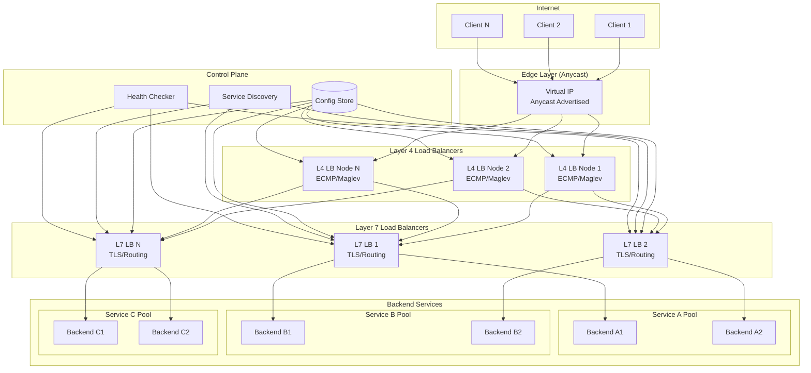
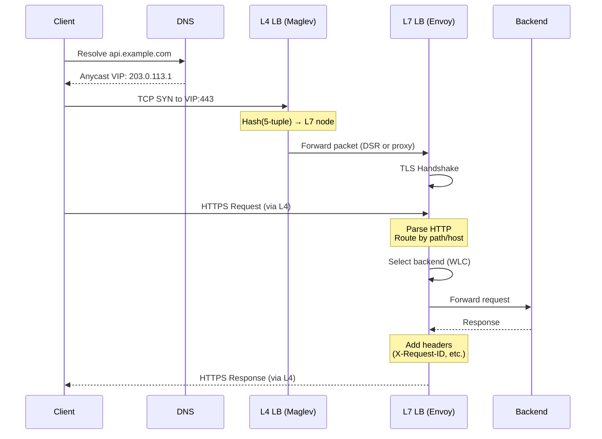
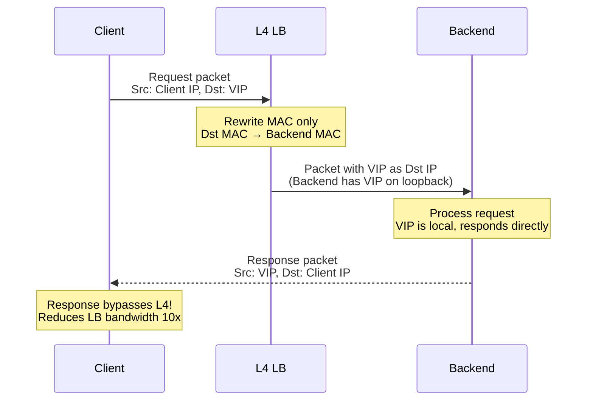
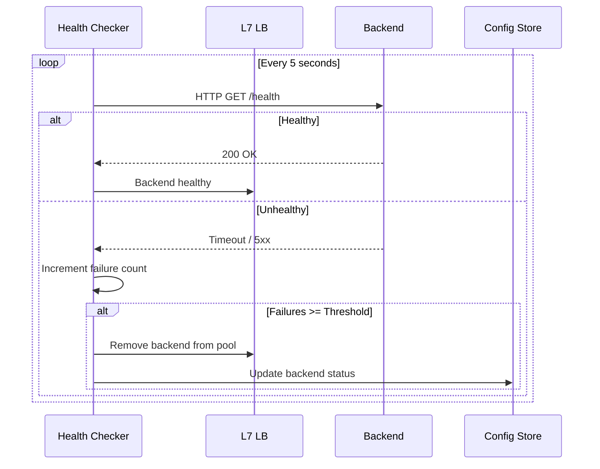
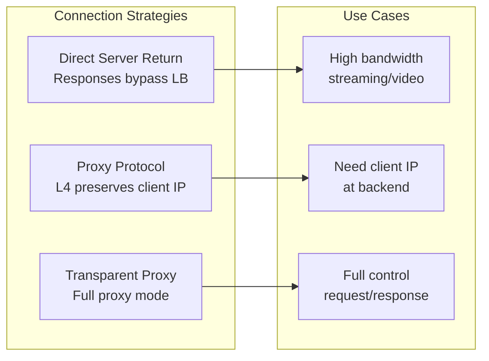
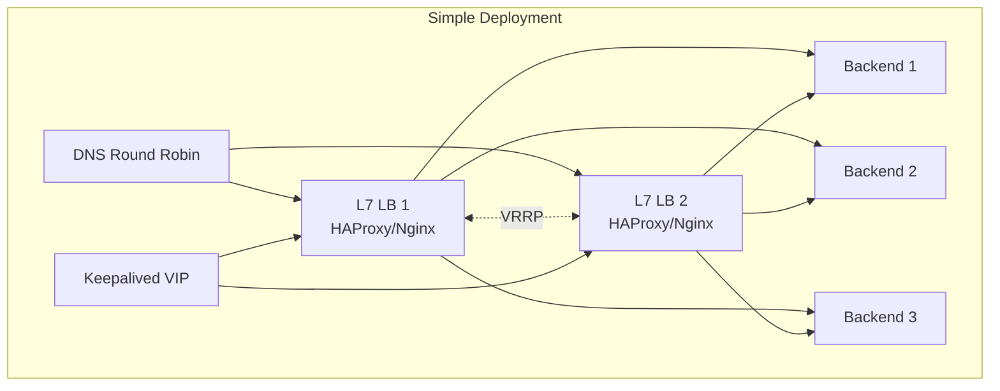
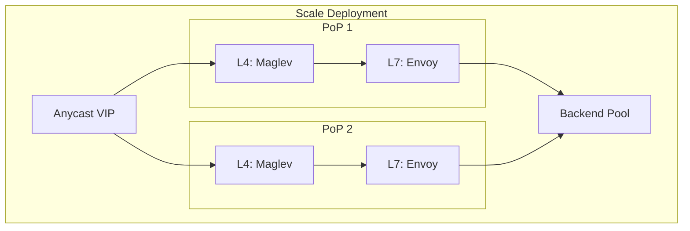
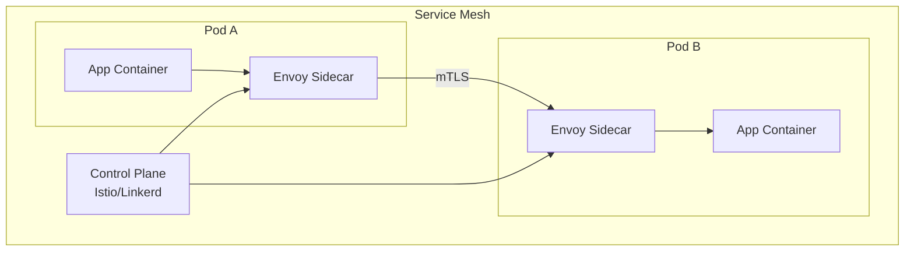
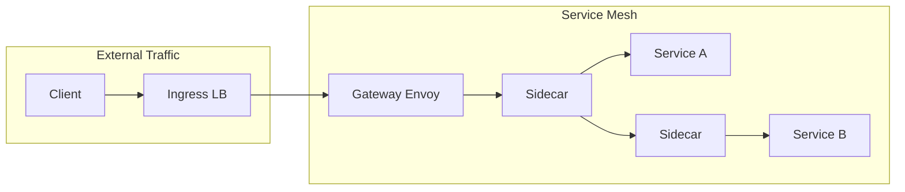
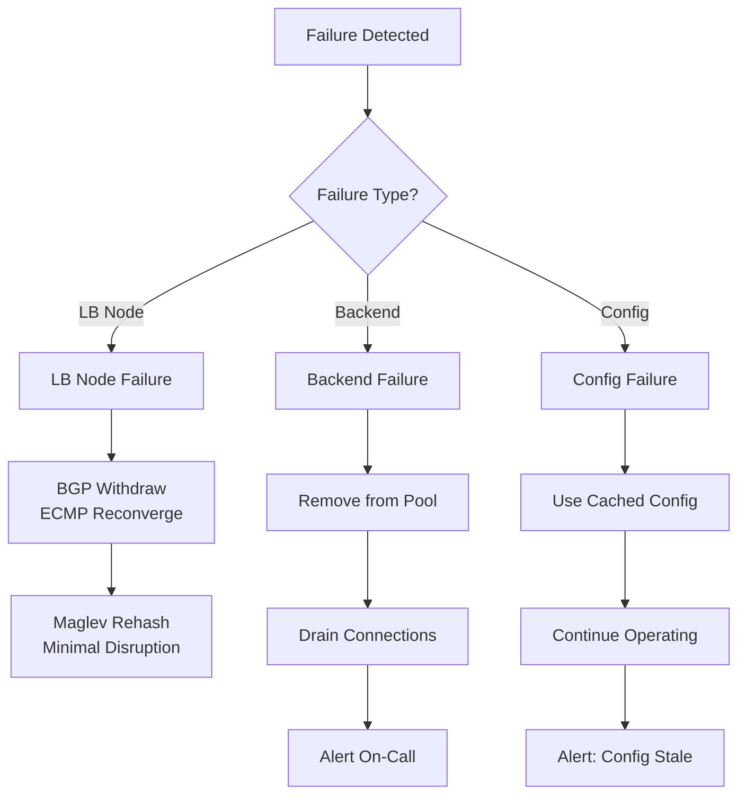

# High-Level Design

[← Back to Index](./00-index.md)

---

## System Architecture

### Two-Tier L4/L7 Architecture (Recommended)



### Component Responsibilities

| Component | Layer | Responsibility |
|-----------|-------|---------------|
| **Anycast VIP** | Network | Single IP advertised from multiple PoPs, BGP routing |
| **L4 Load Balancer** | Transport | Packet forwarding, ECMP distribution, consistent hashing |
| **L7 Load Balancer** | Application | TLS termination, content routing, health checks, retries |
| **Config Store** | Control Plane | Backend pool definitions, routing rules, weights |
| **Service Discovery** | Control Plane | Dynamic backend registration, DNS or API-based |
| **Health Checker** | Control Plane | Active health probes, status aggregation |

---

## Data Flow

### Normal Request Flow (L4 + L7)



### Direct Server Return (DSR) Flow



### Health Check Flow



---

## Key Architectural Decisions

### 1. L4 vs L7: When to Use Each

| Decision Factor | Choose L4 | Choose L7 |
|-----------------|-----------|-----------|
| **Protocol** | Non-HTTP (TCP/UDP raw) | HTTP/HTTPS/gRPC |
| **Latency** | Ultra-low latency critical | Can tolerate ms overhead |
| **Routing** | Simple (any backend works) | Content-based (path, header) |
| **TLS** | Pass-through or terminate elsewhere | Terminate at LB |
| **Scale** | 10M+ connections | Moderate connections |
| **Inspection** | No payload inspection needed | Need to read/modify requests |

**Recommendation:** Use two-tier (L4 → L7) for large-scale production systems.

### 2. Active-Active vs Active-Passive

| Approach | Pros | Cons | Use When |
|----------|------|------|----------|
| **Active-Active** | Full utilization, no wasted capacity | Complex state sync | High traffic, need all capacity |
| **Active-Passive** | Simple failover, no state sync | 50% idle capacity | Lower traffic, simpler ops |

**Recommendation:** Active-Active with Anycast for L4, Active-Active with DNS for L7.

### 3. State Management

| State Type | Storage | Sharing |
|------------|---------|---------|
| **Connection Table** | In-memory per node | Not shared (use consistent hashing) |
| **Health Status** | In-memory, gossip sync | Eventually consistent |
| **Configuration** | External store (etcd) | Strongly consistent |
| **TLS Sessions** | Local cache + shared cache | Optional sharing for resumption |

**Recommendation:** Minimize shared state. Use consistent hashing to route same client to same LB node.

### 4. Database/Storage Choice

| Component | Storage Type | Technology Options |
|-----------|--------------|-------------------|
| **Config Store** | Distributed KV | etcd, Consul, ZooKeeper |
| **Health State** | In-memory + gossip | SWIM protocol, Serf |
| **Metrics** | Time-series | Prometheus, InfluxDB |
| **Logs** | Log aggregator | Elasticsearch, Loki |

### 5. Connection Handling Strategy



---

## Architecture Pattern Checklist

- [x] **Sync vs Async:** Synchronous forwarding (inline path)
- [x] **Event-driven vs Request-response:** Request-response (proxy)
- [x] **Push vs Pull:** Pull for health checks, Push for config updates
- [x] **Stateless vs Stateful:** Mostly stateless (connection table is ephemeral)
- [x] **Read-heavy vs Write-heavy:** Read-heavy (route lookups >> config changes)
- [x] **Real-time vs Batch:** Real-time (every packet/request)
- [x] **Edge vs Origin:** Edge deployment with Anycast

---

## Deployment Options

### Option A: Single-Tier L7 (Simple)



**Pros:** Simple, fewer components, easy to troubleshoot
**Cons:** Limited scale, L7 processing limits throughput
**Use Case:** Moderate traffic (< 50K QPS), single region

### Option B: Two-Tier with Anycast (Scale)



**Pros:** High throughput, global distribution, separation of concerns
**Cons:** Complex operations, more components
**Use Case:** High traffic (> 100K QPS), multi-region

### Option C: Service Mesh (Cloud Native)



**Pros:** Per-service policies, mTLS everywhere, observability built-in
**Cons:** Latency overhead, operational complexity
**Use Case:** Kubernetes, microservices, need fine-grained control

---

## Integration Points

### Upstream (Network Layer)

```
BGP / Anycast:
├── Advertise VIP from multiple locations
├── BGP communities for traffic engineering
└── ECMP for multi-path routing

DNS:
├── GeoDNS for regional routing
├── Low TTL for quick failover (30-60s)
└── Health-check integrated DNS
```

### Downstream (Backends)

```
Backend Registration:
├── Service Discovery (Consul, K8s endpoints)
├── Static configuration (config files)
├── DNS-based discovery
└── API-based registration

Health Endpoints:
├── /health - Basic liveness
├── /ready - Readiness with dependencies
└── Custom health check paths
```

### Sidecar Pattern Integration



---

## Failure Modes and Mitigations

| Failure | Impact | Detection | Mitigation |
|---------|--------|-----------|------------|
| **L4 LB node failure** | Traffic to that node lost | BGP withdrawal, ECMP reconverges | Anycast + multiple nodes |
| **L7 LB node failure** | Connections dropped | Health check from L4 | Consistent hashing minimizes impact |
| **All backends unhealthy** | Service unavailable | All health checks fail | Fail-open (serve stale), alert |
| **Config store unavailable** | No config updates | Heartbeat timeout | Use cached config, continue operating |
| **Network partition** | Split-brain possible | Gossip protocol | Prefer availability, accept staleness |
| **TLS certificate expiry** | Connection failures | Cert monitoring | Auto-renewal, alerting |

### Failure Handling Strategy


