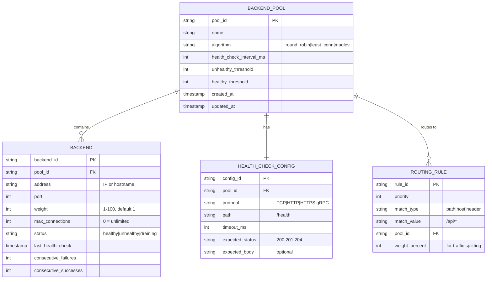
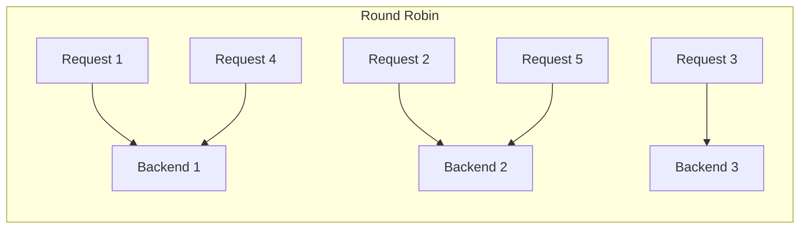
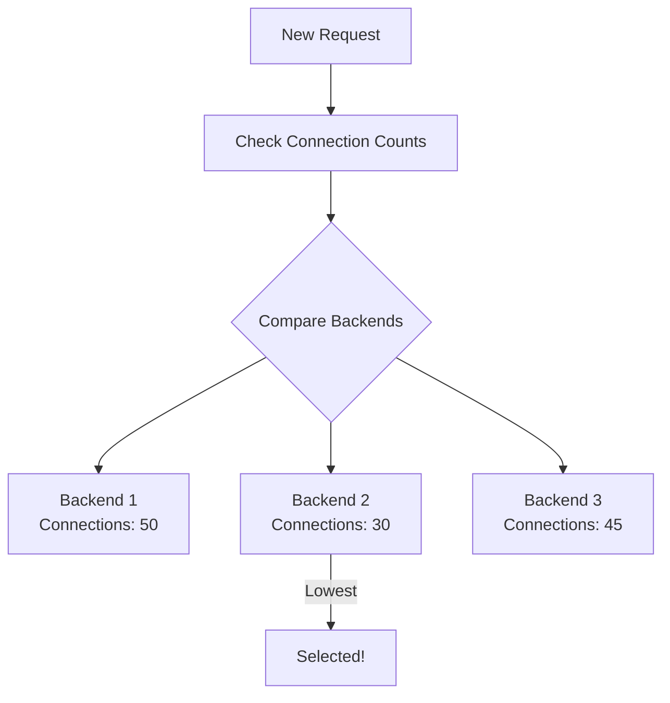
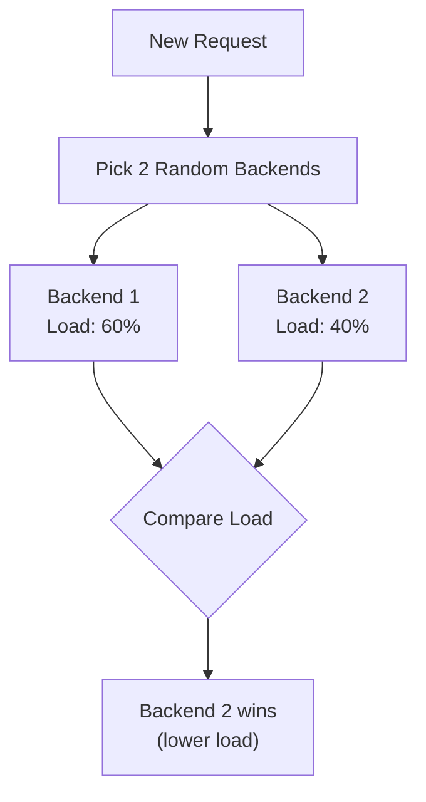
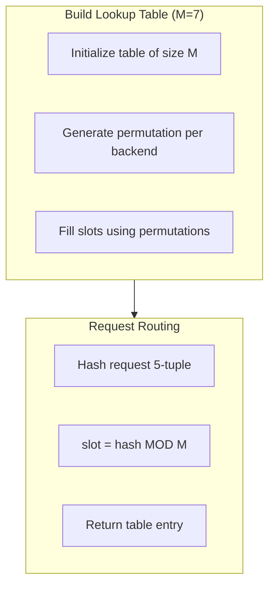
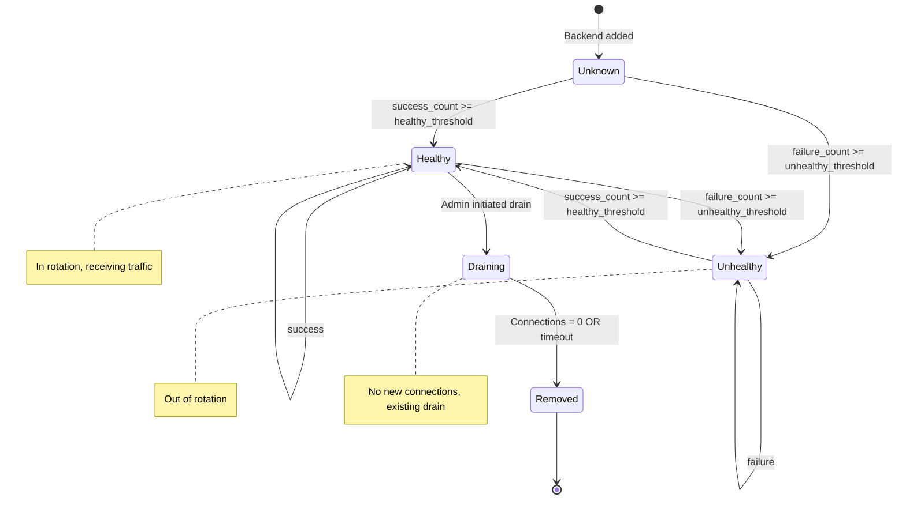

# Low-Level Design

[← Back to Index](./00-index.md)

---

## Data Model

### Connection Tracking Table

```
Connection Entry Structure:
┌─────────────────────────────────────────────────────────────────┐
│ Key: 5-tuple hash                                               │
│ ┌───────────────┬───────────────┬──────────┬──────────┬───────┐ │
│ │ Src IP        │ Dst IP (VIP)  │ Src Port │ Dst Port │ Proto │ │
│ └───────────────┴───────────────┴──────────┴──────────┴───────┘ │
│                                                                 │
│ Value:                                                          │
│ ┌───────────────────────────────────────────────────────────┐   │
│ │ backend_ip: 10.0.1.5                                      │   │
│ │ backend_port: 8080                                        │   │
│ │ state: ESTABLISHED | SYN_SENT | TIME_WAIT                 │   │
│ │ created_at: 1640000000                                    │   │
│ │ last_seen: 1640000100                                     │   │
│ │ bytes_in: 4096                                            │   │
│ │ bytes_out: 102400                                         │   │
│ │ packets_in: 50                                            │   │
│ │ packets_out: 200                                          │   │
│ └───────────────────────────────────────────────────────────┘   │
└─────────────────────────────────────────────────────────────────┘
```

### Backend Pool Configuration



### Health State Storage

| Field | Type | Description |
|-------|------|-------------|
| backend_id | string | Unique backend identifier |
| status | enum | healthy, unhealthy, draining |
| last_check_time | timestamp | Last health check execution |
| last_success_time | timestamp | Last successful check |
| consecutive_failures | int | Failures since last success |
| consecutive_successes | int | Successes since last failure |
| latency_ms | int | Last health check latency |
| error_message | string | Last error (if any) |

### TLS Session Cache

```
TLS Session Entry:
┌─────────────────────────────────────────┐
│ session_id: SHA256 hash (32 bytes)      │
│ session_ticket: encrypted blob          │
│ cipher_suite: TLS_AES_256_GCM_SHA384    │
│ created_at: timestamp                   │
│ expires_at: timestamp (typically 1hr)   │
│ client_ip: for session affinity         │
└─────────────────────────────────────────┘
```

---

## API Design

### Control Plane API (REST/gRPC)

#### Backend Pool Management

```
# List all pools
GET /api/v1/pools
Response: { pools: [Pool], total: int }

# Get specific pool with backends
GET /api/v1/pools/{pool_id}
Response: { pool: Pool, backends: [Backend], health: HealthSummary }

# Create pool
POST /api/v1/pools
Body: { name, algorithm, health_check: {...} }
Response: { pool_id, created_at }

# Update pool (partial)
PATCH /api/v1/pools/{pool_id}
Body: { algorithm?, health_check?: {...} }
Response: { pool: Pool }

# Delete pool
DELETE /api/v1/pools/{pool_id}
Response: 204 No Content
```

#### Backend Management

```
# Add backend to pool
POST /api/v1/pools/{pool_id}/backends
Body: { address, port, weight?, max_connections? }
Response: { backend_id, status }

# Update backend
PATCH /api/v1/pools/{pool_id}/backends/{backend_id}
Body: { weight?, max_connections?, status? }
Response: { backend: Backend }

# Remove backend (with drain)
DELETE /api/v1/pools/{pool_id}/backends/{backend_id}?drain=true&timeout=30s
Response: 202 Accepted (async drain)

# Get backend health
GET /api/v1/pools/{pool_id}/backends/{backend_id}/health
Response: { status, last_check, latency_ms, consecutive_failures }
```

#### Routing Rules

```
# List routing rules
GET /api/v1/routes
Response: { rules: [Rule] }

# Create routing rule
POST /api/v1/routes
Body: { priority, match: {type, value}, pool_id, weight_percent }
Response: { rule_id }

# Traffic splitting example
POST /api/v1/routes
Body: {
  priority: 10,
  match: { type: "path", value: "/api/v2/*" },
  targets: [
    { pool_id: "pool-v1", weight: 90 },
    { pool_id: "pool-v2", weight: 10 }  // canary
  ]
}
```

### Data Plane API (Internal)

```
# Health check endpoint (on each LB node)
GET /internal/health
Response: { status: "healthy", uptime: 3600 }

# Get current connection stats
GET /internal/stats
Response: {
  active_connections: 150000,
  connections_per_second: 5000,
  bytes_in_per_second: 500000000,
  bytes_out_per_second: 5000000000,
  backends: [{ id, active_connections, status }]
}

# Force sync configuration
POST /internal/sync
Response: { synced_at, config_version }
```

### Idempotency Handling

```
Request Header: X-Idempotency-Key: {uuid}

Pseudocode:
FUNCTION handle_request(request):
    idempotency_key = request.headers["X-Idempotency-Key"]

    IF idempotency_key IS NOT NULL THEN
        cached = GET("idempotency:" + idempotency_key)
        IF cached EXISTS THEN
            RETURN cached.response

    result = process_request(request)

    IF idempotency_key IS NOT NULL THEN
        SET("idempotency:" + idempotency_key, result, TTL=24h)

    RETURN result
```

### API Versioning Strategy

- URL path versioning: `/api/v1/`, `/api/v2/`
- Version header fallback: `Accept: application/vnd.lb.v1+json`
- Deprecation header: `Deprecation: true`, `Sunset: 2024-06-01`
- Minimum 6-month deprecation notice

---

## Core Algorithms

### 1. Round Robin

**Concept:** Cycle through backends sequentially.



**Pseudocode:**

```
CLASS RoundRobinBalancer:
    backends = []
    current_index = 0
    lock = Mutex()

    FUNCTION add_backend(backend):
        backends.append(backend)

    FUNCTION remove_backend(backend):
        backends.remove(backend)
        IF current_index >= LENGTH(backends) THEN
            current_index = 0

    FUNCTION select_backend():
        lock.acquire()
        TRY:
            IF LENGTH(backends) == 0 THEN
                RETURN NULL

            backend = backends[current_index]
            current_index = (current_index + 1) MOD LENGTH(backends)
            RETURN backend
        FINALLY:
            lock.release()
```

**Complexity:** Time O(1), Space O(n) for backend list

**Pros:** Simple, even distribution for homogeneous backends
**Cons:** Ignores backend load/capacity differences

---

### 2. Weighted Round Robin

**Concept:** Distribute requests proportionally to backend weights.

**Pseudocode:**

```
CLASS WeightedRoundRobinBalancer:
    backends = []          // [{backend, weight, current_weight}]

    FUNCTION select_backend():
        total_weight = 0
        best = NULL

        FOR EACH b IN backends:
            IF b.status != HEALTHY THEN
                CONTINUE

            b.current_weight = b.current_weight + b.weight
            total_weight = total_weight + b.weight

            IF best IS NULL OR b.current_weight > best.current_weight THEN
                best = b

        IF best IS NOT NULL THEN
            best.current_weight = best.current_weight - total_weight

        RETURN best.backend

// Example: backends with weights [5, 3, 2]
// Selection sequence: A, A, B, A, C, A, B, A, B, C, (repeat)
```

**Complexity:** Time O(n), Space O(n)

---

### 3. Least Connections

**Concept:** Route to backend with fewest active connections.



**Pseudocode:**

```
CLASS LeastConnectionsBalancer:
    backends = []  // [{backend, active_connections, weight}]
    lock = Mutex()

    FUNCTION select_backend():
        lock.acquire()
        TRY:
            best = NULL
            best_score = INFINITY

            FOR EACH b IN backends:
                IF b.status != HEALTHY THEN
                    CONTINUE

                // Weighted least connections
                score = b.active_connections / b.weight

                IF score < best_score THEN
                    best_score = score
                    best = b

            IF best IS NOT NULL THEN
                best.active_connections = best.active_connections + 1

            RETURN best.backend
        FINALLY:
            lock.release()

    FUNCTION connection_closed(backend):
        lock.acquire()
        backend.active_connections = backend.active_connections - 1
        lock.release()
```

**Complexity:** Time O(n), Space O(n)

**Pros:** Adapts to varying request durations
**Cons:** Requires connection tracking, O(n) selection

---

### 4. Power of Two Random Choices (P2C)

**Concept:** Pick 2 random backends, choose the one with fewer connections.



**Pseudocode:**

```
CLASS PowerOfTwoBalancer:
    backends = []
    random = RandomGenerator()

    FUNCTION select_backend():
        healthy_backends = FILTER(backends, b -> b.status == HEALTHY)

        IF LENGTH(healthy_backends) == 0 THEN
            RETURN NULL

        IF LENGTH(healthy_backends) == 1 THEN
            RETURN healthy_backends[0]

        // Pick two random backends
        idx1 = random.int(0, LENGTH(healthy_backends) - 1)
        idx2 = random.int(0, LENGTH(healthy_backends) - 1)

        // Ensure different backends
        WHILE idx2 == idx1:
            idx2 = random.int(0, LENGTH(healthy_backends) - 1)

        b1 = healthy_backends[idx1]
        b2 = healthy_backends[idx2]

        // Choose one with lower load
        // Netflix uses: client_health + server_utilization + inflight_requests
        score1 = calculate_score(b1)
        score2 = calculate_score(b2)

        IF score1 < score2 THEN
            RETURN b1
        ELSE
            RETURN b2

    FUNCTION calculate_score(backend):
        // Lower is better
        RETURN (backend.active_connections / backend.weight) +
               (backend.server_utilization * 0.5) +
               (backend.recent_errors * 10)
```

**Complexity:** Time O(1), Space O(n)

**Pros:** Near-optimal distribution with minimal overhead (Netflix uses this)
**Cons:** Requires load metrics from backends

---

### 5. Maglev Consistent Hashing

**Concept:** Create a lookup table where backends claim slots; hash of request key → slot → backend. Minimizes remapping when backends change.



**Pseudocode:**

```
CLASS MaglevHasher:
    M = 65537                  // Table size (prime, Google default)
    table = ARRAY[M]           // Lookup table
    backends = []              // List of {name, permutation}

    FUNCTION build_table():
        // Generate permutation for each backend
        FOR EACH backend IN backends:
            offset = hash(backend.name) MOD M
            skip = (hash(backend.name + "_skip") MOD (M - 1)) + 1
            backend.permutation = []

            FOR i FROM 0 TO M - 1:
                backend.permutation[i] = (offset + i * skip) MOD M

        // Fill the table
        table = ARRAY[M] initialized to -1
        next_index = ARRAY[len(backends)] initialized to 0
        filled = 0

        WHILE filled < M:
            FOR i FROM 0 TO LENGTH(backends) - 1:
                backend = backends[i]

                // Find next empty slot for this backend
                slot = backend.permutation[next_index[i]]
                WHILE table[slot] != -1:
                    next_index[i] = next_index[i] + 1
                    slot = backend.permutation[next_index[i]]

                table[slot] = i
                next_index[i] = next_index[i] + 1
                filled = filled + 1

                IF filled >= M THEN
                    BREAK

    FUNCTION lookup(key):
        hash_value = hash(key)
        slot = hash_value MOD M
        backend_index = table[slot]
        RETURN backends[backend_index]

    FUNCTION add_backend(backend):
        backends.append(backend)
        build_table()  // Rebuild needed

    FUNCTION remove_backend(backend):
        backends.remove(backend)
        build_table()  // Rebuild needed
```

**Lookup Table Example (M=7, 3 backends):**

```
Slot:     0   1   2   3   4   5   6
Backend:  A   B   C   A   B   C   A

After removing B:
Slot:     0   1   2   3   4   5   6
Backend:  A   C   C   A   A   C   A
          ↑   ↑       ↑
          same changed same (minimal disruption)
```

**Complexity:**
- Build: O(M * n) where n = number of backends
- Lookup: O(1)
- Space: O(M + n)

**Disruption Analysis:**
- When backend removed: ~1/n keys remapped (optimal)
- Google uses M=65537 for < 0.5% error rate

---

### 6. Source IP Hash

**Concept:** Hash client IP to ensure same client always reaches same backend.

**Pseudocode:**

```
CLASS SourceIPHashBalancer:
    backends = []

    FUNCTION select_backend(client_ip):
        healthy_backends = FILTER(backends, b -> b.status == HEALTHY)

        IF LENGTH(healthy_backends) == 0 THEN
            RETURN NULL

        hash_value = hash(client_ip)
        index = hash_value MOD LENGTH(healthy_backends)

        RETURN healthy_backends[index]
```

**Complexity:** Time O(1), Space O(n)

**Pros:** Simple session affinity
**Cons:** Uneven distribution if client IPs not uniform, disruption on backend changes

---

## Health Check Implementation

### Health Check State Machine



### Health Check Pseudocode

```
CLASS HealthChecker:
    check_interval = 5000        // ms
    timeout = 2000               // ms
    healthy_threshold = 2        // consecutive successes needed
    unhealthy_threshold = 3      // consecutive failures needed

    FUNCTION run_health_check(backend):
        LOOP FOREVER:
            start_time = NOW()

            TRY:
                response = http_request(
                    method: "GET",
                    url: backend.address + ":" + backend.port + backend.health_path,
                    timeout: timeout
                )

                IF response.status_code IN backend.expected_codes THEN
                    handle_success(backend, NOW() - start_time)
                ELSE
                    handle_failure(backend, "Unexpected status: " + response.status_code)

            CATCH timeout_error:
                handle_failure(backend, "Timeout after " + timeout + "ms")

            CATCH connection_error:
                handle_failure(backend, "Connection refused")

            SLEEP(check_interval)

    FUNCTION handle_success(backend, latency_ms):
        backend.consecutive_failures = 0
        backend.consecutive_successes = backend.consecutive_successes + 1
        backend.last_latency = latency_ms
        backend.last_check_time = NOW()

        IF backend.status == UNHEALTHY AND
           backend.consecutive_successes >= healthy_threshold THEN
            backend.status = HEALTHY
            notify_status_change(backend, HEALTHY)
            log("Backend " + backend.id + " is now HEALTHY")

    FUNCTION handle_failure(backend, error):
        backend.consecutive_successes = 0
        backend.consecutive_failures = backend.consecutive_failures + 1
        backend.last_error = error
        backend.last_check_time = NOW()

        IF backend.status == HEALTHY AND
           backend.consecutive_failures >= unhealthy_threshold THEN
            backend.status = UNHEALTHY
            notify_status_change(backend, UNHEALTHY)
            log("Backend " + backend.id + " is now UNHEALTHY: " + error)
```

---

## Connection Draining

**Pseudocode:**

```
FUNCTION drain_backend(backend, timeout_seconds):
    backend.status = DRAINING
    backend.drain_start_time = NOW()

    // Stop sending new connections
    remove_from_active_pool(backend)

    // Wait for existing connections to complete
    WHILE backend.active_connections > 0:
        IF NOW() - backend.drain_start_time > timeout_seconds THEN
            // Force close remaining connections
            force_close_connections(backend)
            log("Force closed " + backend.active_connections + " connections")
            BREAK

        SLEEP(1000)  // Check every second

    backend.status = REMOVED
    log("Backend " + backend.id + " fully drained")
```

---

## Algorithm Comparison Summary

| Algorithm | Time | Space | Session Affinity | Load Awareness | Disruption on Change |
|-----------|------|-------|-----------------|----------------|---------------------|
| Round Robin | O(1) | O(n) | No | No | All connections |
| Weighted RR | O(n) | O(n) | No | Partial | All connections |
| Least Connections | O(n) | O(n) | No | Yes | Current connection only |
| Power of Two | O(1) | O(n) | No | Yes | Minimal |
| **Maglev Hash** | **O(1)** | **O(M)** | **Yes** | **No** | **~1/n keys** |
| Source IP Hash | O(1) | O(n) | Yes | No | Varies |
