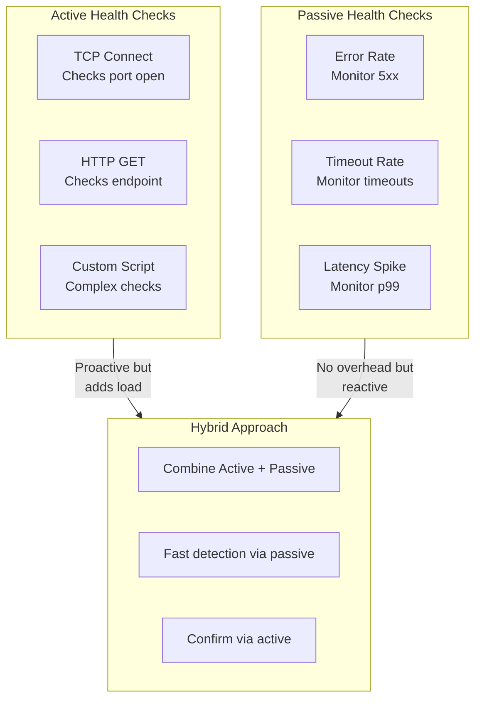
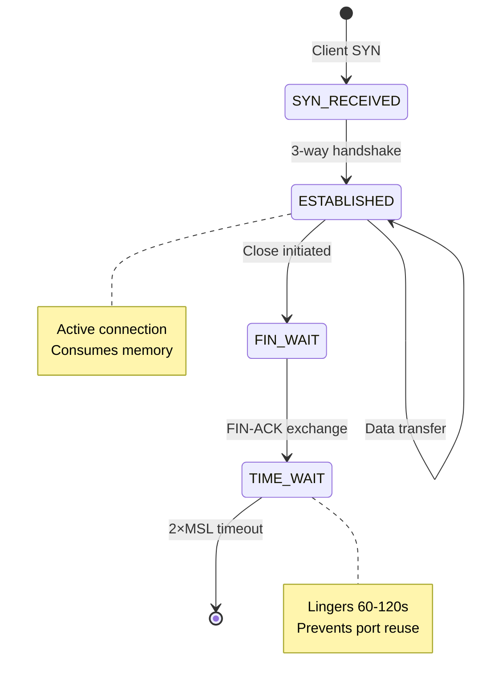
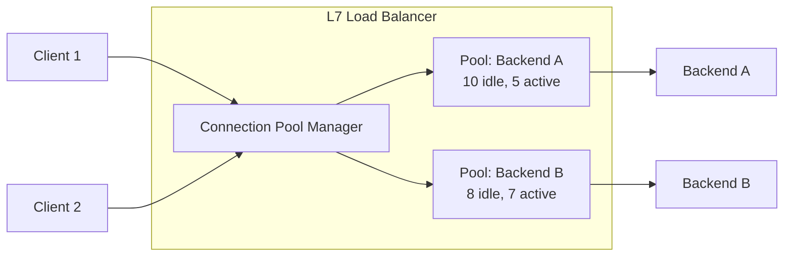
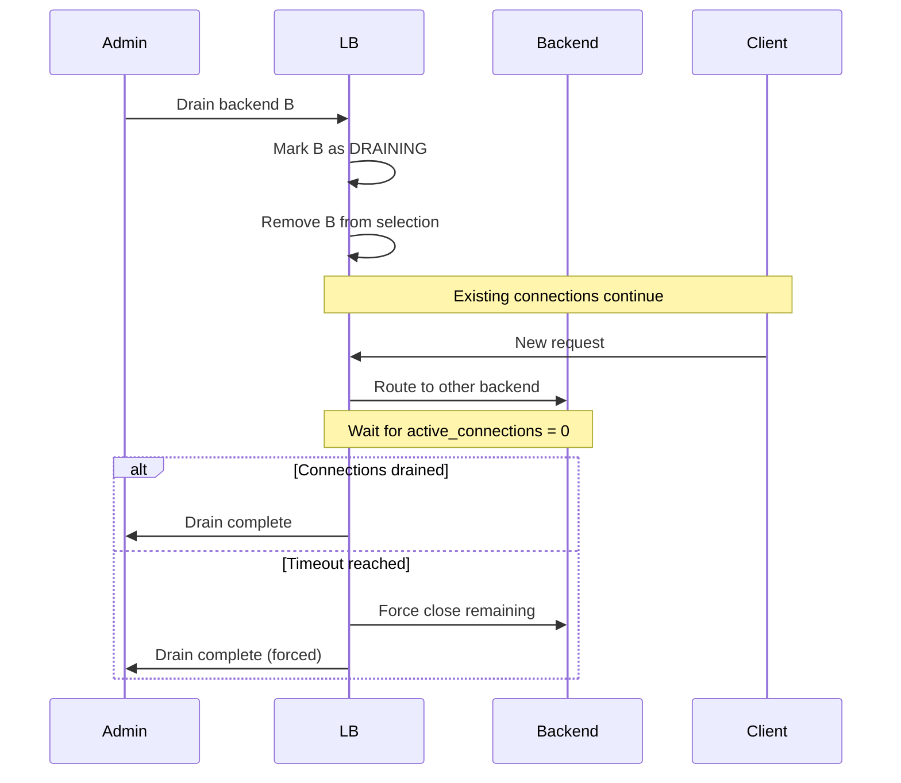
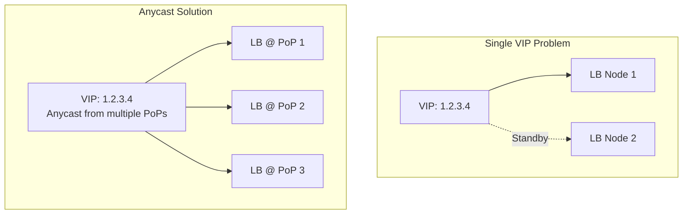

# Deep Dive & Bottlenecks

[← Back to Index](./00-index.md)

---

## Critical Component #1: Maglev Consistent Hashing

### Why This Is Critical

Maglev consistent hashing is essential for stateful backends (caches, session servers) where routing consistency matters. When backends are added/removed, traditional hashing causes massive key redistribution. Maglev minimizes this disruption to approximately 1/n keys.

### How It Works Internally

#### Step 1: Generate Permutation Table

Each backend generates a unique permutation of slot indices:

```
Given:
- M = 7 (table size, should be prime)
- Backend A, B, C

For Backend A:
  offset = hash("A") MOD 7 = 3
  skip = (hash("A_skip") MOD 6) + 1 = 4

  Permutation for A:
  i=0: (3 + 0*4) MOD 7 = 3
  i=1: (3 + 1*4) MOD 7 = 0
  i=2: (3 + 2*4) MOD 7 = 4
  i=3: (3 + 3*4) MOD 7 = 1
  i=4: (3 + 4*4) MOD 7 = 5
  i=5: (3 + 5*4) MOD 7 = 2
  i=6: (3 + 6*4) MOD 7 = 6

  A's permutation: [3, 0, 4, 1, 5, 2, 6]
```

#### Step 2: Build Lookup Table

Backends take turns claiming empty slots:

```
Round 1:
- A claims slot 3 (first in A's permutation)
- B claims slot 1 (first in B's permutation)
- C claims slot 2 (first in C's permutation)

Table: [_, B, C, A, _, _, _]

Round 2:
- A claims slot 0 (next empty in A's permutation)
- B claims slot 5 (next empty in B's permutation)
- C claims slot 4 (next empty in C's permutation)

Table: [A, B, C, A, C, B, _]

Round 3:
- A claims slot 6 (next empty)

Final Table: [A, B, C, A, C, B, A]
```

#### Step 3: Lookup

```
For request with key K:
  slot = hash(K) MOD M
  backend = table[slot]
```

### Disruption Analysis

When Backend B is removed:

```
Before: [A, B, C, A, C, B, A]
After:  [A, C, C, A, C, A, A]
         ↑  ↑      ↑  ↑
         ok chg    ok chg

Changed slots: 1, 5 (slots that were B)
Unchanged: 0, 2, 3, 4, 6 (5/7 = 71% unchanged)

With larger M (65537), disruption approaches theoretical minimum of 1/n
```

### Failure Modes

| Failure | Impact | Mitigation |
|---------|--------|------------|
| Table build too slow | Stale routing | Pre-compute table, atomic swap |
| Hash collisions | Uneven distribution | Use cryptographic hash (xxHash, SipHash) |
| Backend flapping | Constant rebuilds | Debounce backend status changes |
| Memory for large M | High memory usage | M=65537 uses ~65KB per table |

### Implementation Considerations

```
Google's Production Settings:
- M = 65537 (prime number)
- Hash function: xxHash or SipHash
- Table rebuild on membership change
- Connection tracking as fallback for established connections
```

---

## Critical Component #2: Health Check System

### Why This Is Critical

Health checks determine traffic routing. Too aggressive = backends bounce in/out (flapping). Too lenient = traffic sent to dead backends. The balance is critical for availability.

### Health Check Types Deep Dive



### Shallow vs Deep Health Checks

| Check Type | What It Checks | Pros | Cons |
|------------|---------------|------|------|
| **Shallow** | Process running, port open | Fast, low overhead | Misses dependency failures |
| **Deep** | Process + DB + cache + external APIs | Comprehensive | Slow, cascade risk |

**Best Practice:** Use shallow for LB routing, deep for alerting/diagnostics.

```
Shallow Health Check (/health):
  - Web server responding: YES
  - Process running: YES
  => Return 200 OK

Deep Health Check (/health/deep):
  - Web server responding: YES
  - Database connection: YES
  - Cache connection: YES
  - External API reachable: NO
  => Return 503 (but don't remove from LB!)
```

### Timing Tuning

```
Detection Time = (unhealthy_threshold × check_interval) + check_timeout

Example configurations:

Fast detection (aggressive):
  interval=2s, threshold=2, timeout=1s
  Detection time = 2×2 + 1 = 5 seconds
  Risk: More false positives (flapping)

Balanced (recommended):
  interval=5s, threshold=3, timeout=2s
  Detection time = 3×5 + 2 = 17 seconds
  Risk: Moderate delay but stable

Conservative:
  interval=10s, threshold=5, timeout=5s
  Detection time = 5×10 + 5 = 55 seconds
  Risk: Traffic to dead backend for nearly a minute
```

### Failure Modes

| Failure | Impact | Mitigation |
|---------|--------|------------|
| Health checker overloaded | Checks delayed, false positives | Dedicated health check threads |
| Network partition to backend | Backend marked unhealthy | Use multiple check sources |
| Dependency failure (deep check) | Mass backend removal | Use shallow checks for routing |
| Clock skew | Inconsistent detection | Use relative time, not absolute |

### Health Check Jitter

Stagger health checks to avoid thundering herd:

```
FUNCTION schedule_health_check(backend, interval):
    // Add random jitter (0-20% of interval)
    jitter = random(0, interval * 0.2)
    next_check = NOW() + interval + jitter
    schedule_at(next_check, run_check, backend)
```

---

## Critical Component #3: Connection Handling

### Why This Is Critical

A load balancer may handle millions of concurrent connections. Inefficient connection handling leads to resource exhaustion, latency spikes, and cascading failures.

### Connection Lifecycle



### Connection Table Management

```
Connection Entry Size:
├── 5-tuple key: 13 bytes (IPs + ports + proto)
├── Backend mapping: 8 bytes
├── State: 4 bytes
├── Timestamps: 16 bytes
├── Counters: 16 bytes
├── Overhead: ~43 bytes
└── Total: ~100 bytes per connection

For 1 million connections: ~100 MB
For 10 million connections: ~1 GB
```

### Connection Pooling (L7)



**Pooling Benefits:**
- Reduces TCP handshake overhead
- Amortizes TLS handshake cost
- Limits backend connection count
- Enables connection reuse (HTTP keep-alive)

### Keep-Alive Handling

```
Client-side Keep-Alive:
├── Multiple requests per TCP connection
├── Reduces latency (no handshake per request)
└── LB must track client-side idle timeout

Backend-side Keep-Alive:
├── Persistent connections to backends
├── Connection pool per backend
├── Must handle backend closing connections
└── Health check connections can use dedicated pool
```

### Connection Draining Deep Dive



### Failure Modes

| Failure | Impact | Mitigation |
|---------|--------|------------|
| Connection table exhaustion | New connections rejected | Max connections limit, monitoring |
| TIME_WAIT accumulation | Port exhaustion | tcp_tw_reuse, connection pooling |
| Slow backend | Connection pile-up | Timeouts, circuit breaker |
| Backend connection limit | Connections refused | Pool sizing, backpressure |

---

## Bottleneck Analysis

### Bottleneck #1: TLS Termination CPU

**Problem:** TLS handshakes are CPU-intensive. At high scale, TLS termination becomes the bottleneck.

**Impact:**
- Full TLS handshake: ~10-15ms, thousands of CPU cycles
- RSA key exchange: Very expensive
- High connection rate = high CPU load

**Mitigations:**

| Strategy | Reduction | Trade-off |
|----------|-----------|-----------|
| Session resumption (TLS tickets) | 10x faster | Requires ticket key management |
| ECDHE over RSA | 3x faster | Slightly less compatible |
| Hardware acceleration (AES-NI) | 2-3x faster | Requires modern CPU |
| Dedicated TLS termination tier | Isolates load | More components |
| TLS 1.3 | 1 RTT handshake | Client support needed |

```
Capacity Planning for TLS:
- RSA-2048 handshakes per core: ~400/sec
- ECDSA-P256 handshakes per core: ~2000/sec
- With session reuse: ~10,000+ ops/sec

For 10,000 new TLS connections/sec:
- RSA: 25 cores dedicated to TLS
- ECDSA with reuse: 1-2 cores
```

### Bottleneck #2: Single Point of Failure at VIP

**Problem:** Even with multiple LB nodes, the VIP can be a single point of failure.



**Mitigations:**

| Strategy | How It Works | Trade-off |
|----------|--------------|-----------|
| VRRP/Keepalived | Active-passive VIP failover | 50% capacity idle |
| DNS round-robin | Multiple A records | Client caching delays failover |
| Anycast | Same IP from multiple locations | Complex BGP setup |
| ECMP | Router splits traffic to multiple LBs | Requires router configuration |

### Bottleneck #3: Connection Table Memory

**Problem:** Each connection consumes memory. High connection counts exhaust memory.

**Impact:**
- 10M connections × 100 bytes = 1 GB
- Plus per-connection buffers
- Plus TLS state

**Mitigations:**

| Strategy | Reduction | Trade-off |
|----------|-----------|-----------|
| Connection limiting | Caps memory usage | Rejects clients |
| DSR (Direct Server Return) | Only track inbound | No response inspection |
| Connection timeout tuning | Faster cleanup | May drop idle clients |
| Larger LB nodes | More capacity | More expensive |

### Bottleneck #4: Health Check Scalability

**Problem:** With thousands of backends, health checks generate significant traffic.

```
10,000 backends × (1 check / 5 seconds) = 2,000 checks/second
Each check: TCP handshake + HTTP request = ~10 packets
Total: 20,000 packets/second just for health checks
```

**Mitigations:**

| Strategy | Reduction | Trade-off |
|----------|-----------|-----------|
| Increase check interval | Linear reduction | Slower detection |
| Share health state across LBs | Divide checks | Gossip complexity |
| Passive health checks | Zero probe overhead | Reactive only |
| Hierarchical checks | Check aggregators | More components |

---

## Concurrency & Race Conditions

### Race Condition #1: Backend Status Update

**Problem:** Health checker updates status while selection is in progress.

```
Thread A (Selection):          Thread B (Health Check):
  backends = get_backends()
                                 backends[2].status = UNHEALTHY
  selected = select(backends)   // May select unhealthy backend!
```

**Solution:** Copy-on-write or lock-free data structures

```
FUNCTION update_backend_status(backend_id, new_status):
    // Atomic pointer swap
    old_list = atomic_load(backends_ptr)
    new_list = copy(old_list)
    new_list[backend_id].status = new_status
    atomic_store(backends_ptr, new_list)
    // Old list garbage collected after readers done
```

### Race Condition #2: Connection Count Tracking

**Problem:** Multiple threads updating connection count simultaneously.

```
Thread A:                    Thread B:
  count = backend.conns       count = backend.conns
  count = count + 1           count = count + 1
  backend.conns = count       backend.conns = count
  // Lost update! Count should be +2, but is +1
```

**Solution:** Atomic operations

```
FUNCTION increment_connections(backend):
    atomic_increment(backend.active_connections)

FUNCTION decrement_connections(backend):
    atomic_decrement(backend.active_connections)
```

### Race Condition #3: Configuration Update During Request

**Problem:** Config changes while request is being routed.

**Solution:** Versioned configuration with graceful transition

```
FUNCTION route_request(request):
    config_version = atomic_load(current_config_version)
    config = get_config(config_version)

    // Use same config for entire request lifetime
    backend = select_backend(config, request)
    response = forward_request(backend, request)

    RETURN response
```

---

## Performance Optimization Techniques

### 1. Kernel Bypass (DPDK/XDP)

```
Traditional Path:
  NIC → Kernel driver → TCP stack → User space → LB logic

DPDK Path:
  NIC → User space (poll mode) → LB logic

Benefit: 10x+ packet rate improvement
Used by: Google Maglev, Cloudflare
```

### 2. Zero-Copy Forwarding

```
Traditional:
  Receive buffer → Kernel copy → User buffer → Kernel copy → Send buffer

Zero-copy (sendfile/splice):
  Receive buffer → Send buffer (kernel-to-kernel)

Benefit: 50% CPU reduction for large payloads
```

### 3. Connection Coalescing (HTTP/2)

```
Without HTTP/2:
  Client 1 → Connection 1 → Backend
  Client 2 → Connection 2 → Backend
  Client 3 → Connection 3 → Backend

With HTTP/2 multiplexing:
  Client 1 ↘
  Client 2 → Single connection (streams) → Backend
  Client 3 ↗

Benefit: Fewer backend connections, better resource utilization
```
