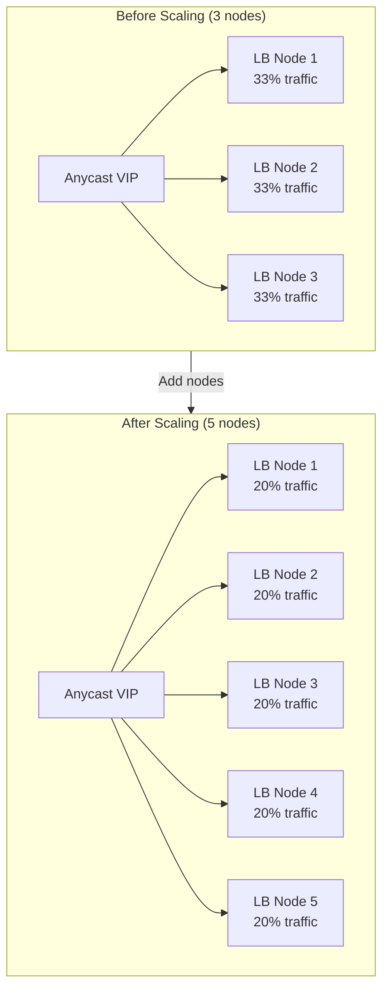
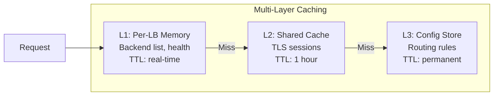
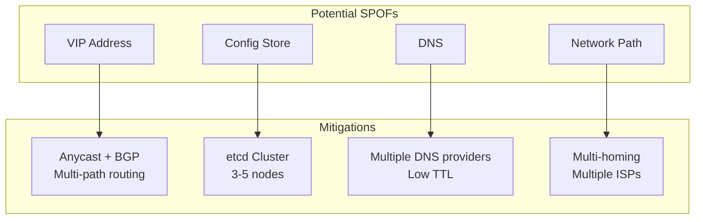
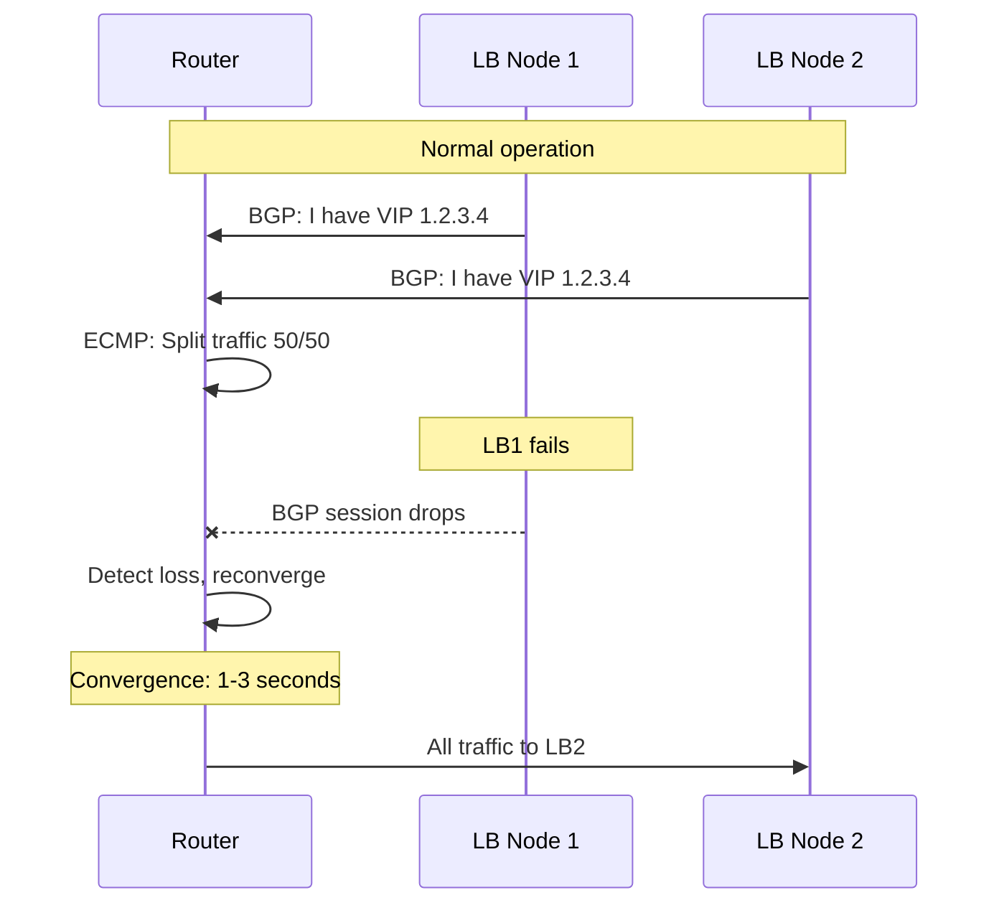
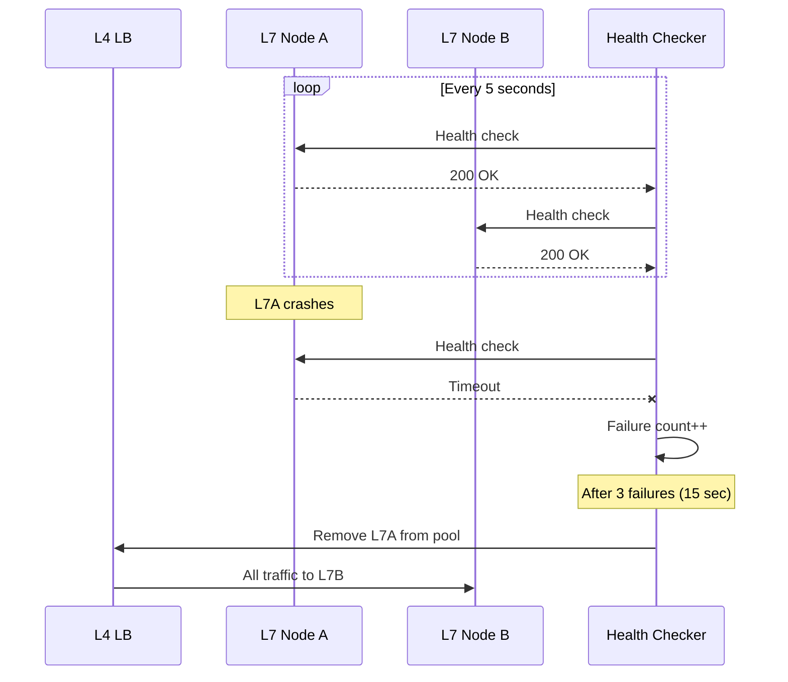
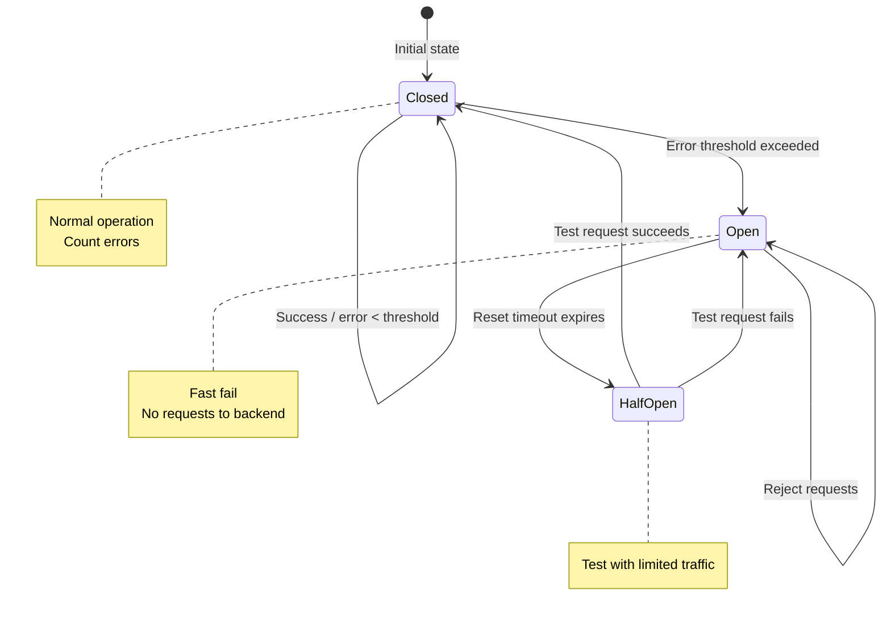
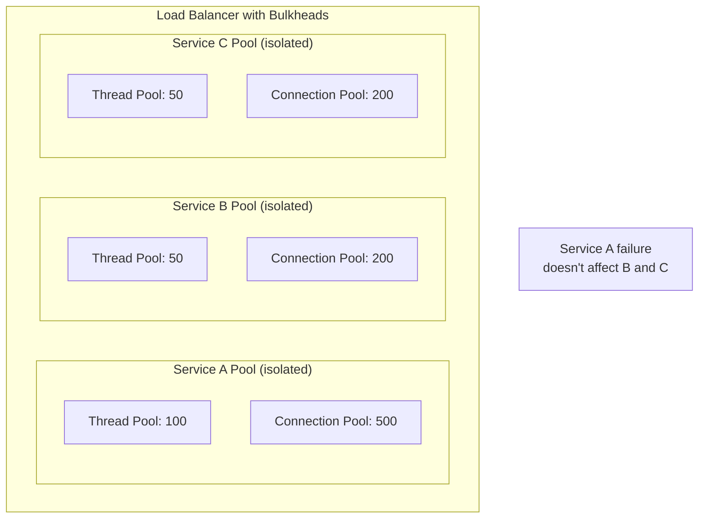
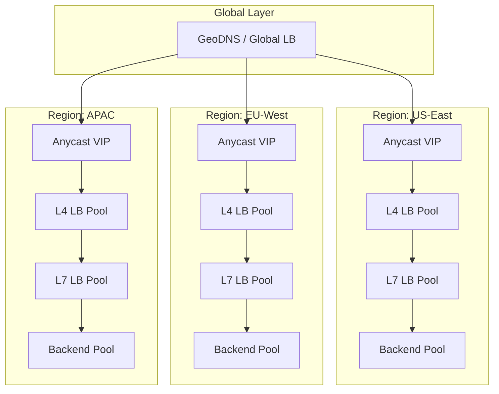
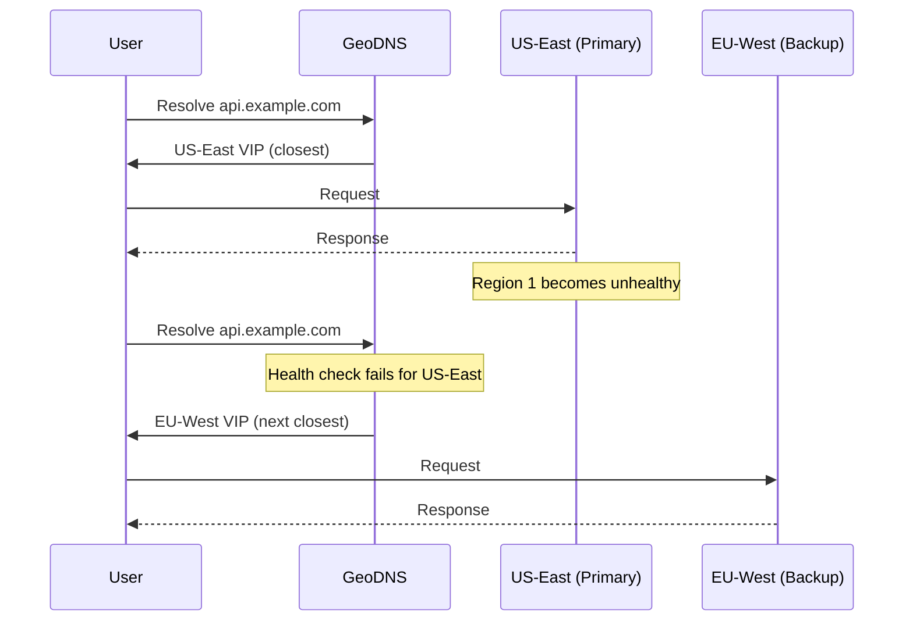

# Scalability & Reliability

[← Back to Index](./00-index.md)

---

## Scalability

### Horizontal Scaling Strategy



### Scaling Dimensions

| Dimension | Approach | Complexity |
|-----------|----------|------------|
| **Throughput (QPS)** | Add more LB nodes | Low |
| **Connections** | Add nodes + tune connection limits | Medium |
| **Bandwidth** | Add nodes + use DSR | Medium |
| **TLS Termination** | Add L7 nodes or TLS offload | Medium |
| **Backend Pools** | Shard by service, add capacity | Low |
| **Geographic** | Add PoPs with Anycast | High |

### Auto-Scaling Triggers

| Metric | Scale-Out Threshold | Scale-In Threshold | Cooldown |
|--------|---------------------|-------------------|----------|
| CPU Utilization | > 70% for 5 min | < 30% for 15 min | 10 min |
| Memory Utilization | > 80% for 5 min | < 40% for 15 min | 10 min |
| Connection Count | > 80% of max | < 30% of max | 10 min |
| Latency p99 | > 2x baseline | N/A | 5 min |

### Scaling L4 vs L7

```
L4 Load Balancers:
├── Stateless packet forwarding
├── Scale linearly with nodes
├── Single node: 10+ Gbps, millions of connections
├── Bottleneck: NIC capacity, connection table
└── Scaling: Add more nodes behind ECMP

L7 Load Balancers:
├── Stateful request processing
├── More CPU-bound (TLS, parsing)
├── Single node: 100K-500K QPS typical
├── Bottleneck: CPU for TLS/HTTP processing
└── Scaling: Add more nodes, L4 distributes to them
```

### Database Scaling (Configuration Store)

| Approach | Use Case | Trade-off |
|----------|----------|-----------|
| Single leader | Low write rate | Simple but SPOF |
| Leader-follower | Read scaling | Replication lag |
| Multi-leader (etcd) | High availability | Consistency complexity |

**Recommendation:** Use etcd or Consul cluster (3-5 nodes) for config store. Reads can go to any node, writes go to leader.

### Caching Strategy



### Hot Spot Mitigation

**Problem:** Single backend receives disproportionate traffic.

| Cause | Detection | Mitigation |
|-------|-----------|------------|
| Consistent hash collision | Monitor per-backend QPS | Virtual nodes, re-hash |
| Popular content | Monitor request patterns | Request-level LB (not connection) |
| Slow backend | Monitor latency distribution | Circuit breaker, weight reduction |

---

## Reliability & Fault Tolerance

### Single Points of Failure (SPOF) Analysis



### Redundancy Strategy

| Component | Redundancy Level | Strategy |
|-----------|------------------|----------|
| L4 LB Nodes | N+2 | Anycast + ECMP |
| L7 LB Nodes | N+1 per zone | Cross-zone distribution |
| Config Store | 3 or 5 nodes | Raft consensus |
| Health Checkers | 2 per zone | Independent checking |
| Network Paths | 2+ | Multi-homed, diverse paths |

### Failover Mechanisms

#### L4 Failover (Anycast + BGP)



**Convergence time:** 1-3 seconds with BFD (Bidirectional Forwarding Detection)

#### L7 Failover (Health Check Based)



**Detection time:** (check_interval × threshold) + timeout = ~17 seconds typical

### Circuit Breaker Pattern



**Configuration:**

```
circuit_breaker:
  error_threshold_percentage: 50    # Trip at 50% errors
  request_volume_threshold: 20      # Min requests before tripping
  sleep_window_ms: 30000            # Time in open state
  half_open_requests: 5             # Requests to test in half-open
```

### Retry Strategy

| Retry Type | When to Use | Configuration |
|------------|-------------|---------------|
| **Connection retry** | Connection refused | 2-3 retries, immediate |
| **Request retry** | 502/503/504 errors | 1-2 retries, idempotent only |
| **Timeout retry** | Request timeout | 1 retry, increase timeout |

**Exponential Backoff:**

```
FUNCTION retry_with_backoff(request, max_retries):
    base_delay = 100  // ms
    max_delay = 5000  // ms

    FOR attempt FROM 0 TO max_retries:
        TRY:
            RETURN send_request(request)
        CATCH retryable_error:
            IF attempt == max_retries THEN
                THROW error

            delay = MIN(base_delay * (2 ^ attempt), max_delay)
            jitter = random(0, delay * 0.1)
            SLEEP(delay + jitter)
```

### Graceful Degradation

| Scenario | Degraded Behavior | Recovery |
|----------|-------------------|----------|
| 50% backends down | Increased load on healthy backends | Auto-recover when backends return |
| All backends down | Return cached response or error page | Fail-open with monitoring |
| Config store down | Use cached config | Alert, manual intervention |
| Health checker down | Keep current state | Secondary checker takes over |

### Bulkhead Pattern



**Purpose:** Isolate failures to prevent cascade across services.

---

## Disaster Recovery

### RTO and RPO

| Metric | Target | Justification |
|--------|--------|---------------|
| **RTO** (Recovery Time Objective) | < 5 minutes | Auto-failover should handle most cases |
| **RPO** (Recovery Point Objective) | 0 (stateless) | LB has no persistent user data |

### Backup Strategy

| Component | Backup Frequency | Retention | Method |
|-----------|------------------|-----------|--------|
| Configuration | On every change | 30 days | etcd snapshots |
| Routing rules | On every change | 30 days | Git version control |
| TLS certificates | Weekly | 1 year | Encrypted backup |
| Audit logs | Continuous | 90 days | Log aggregation |

### Multi-Region Architecture



### Regional Failover



**Regional Failover Time:**
- DNS TTL: 30-60 seconds
- Health check detection: 15-30 seconds
- Total: 45-90 seconds

### Disaster Scenarios and Response

| Scenario | Detection | Response | Recovery |
|----------|-----------|----------|----------|
| Single LB node failure | BGP/health check | ECMP reconverge | Auto (seconds) |
| AZ failure | Multi-AZ health checks | Traffic to other AZs | Auto (minutes) |
| Region failure | Global health checks | DNS failover | Auto (minutes) |
| Config corruption | Validation failure | Rollback to last known good | Manual (minutes) |
| DDoS attack | Traffic spike detection | Scrubbing, rate limiting | Manual/Auto |

---

## Capacity Planning

### Growth Projections

```
Current State:
├── QPS: 100,000
├── Connections: 2 million
├── LB Nodes: 5
└── Bandwidth: 10 Gbps

Year 1 Projection (2x growth):
├── QPS: 200,000
├── Connections: 4 million
├── LB Nodes: 8 (add 3)
└── Bandwidth: 20 Gbps

Year 3 Projection (5x growth):
├── QPS: 500,000
├── Connections: 10 million
├── LB Nodes: 15 (add 7 more)
└── Bandwidth: 50 Gbps
```

### Capacity Headroom

| Resource | Normal Usage | Headroom Target | Rationale |
|----------|--------------|-----------------|-----------|
| CPU | 50% | 30% unused | Handle traffic spikes |
| Memory | 60% | 20% unused | Connection table growth |
| Network | 50% | 40% unused | Burst traffic |
| Connections | 60% | 30% unused | Flash crowd events |

### Load Testing Requirements

```
Pre-production Validation:
├── Baseline: Sustained load at expected QPS
├── Spike: 3x traffic for 5 minutes
├── Soak: 24-hour sustained load
├── Failover: Kill LB nodes during load
└── Recovery: Verify return to baseline
```
