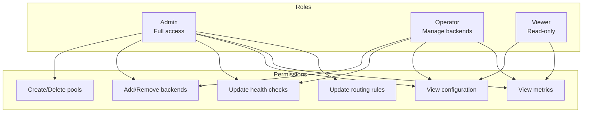
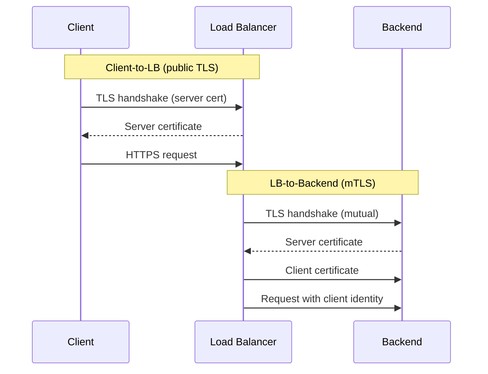
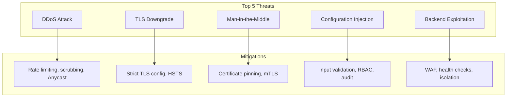
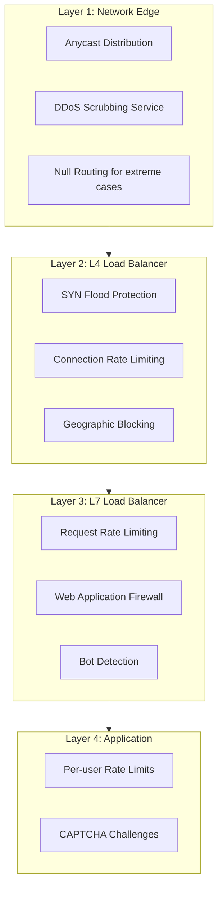
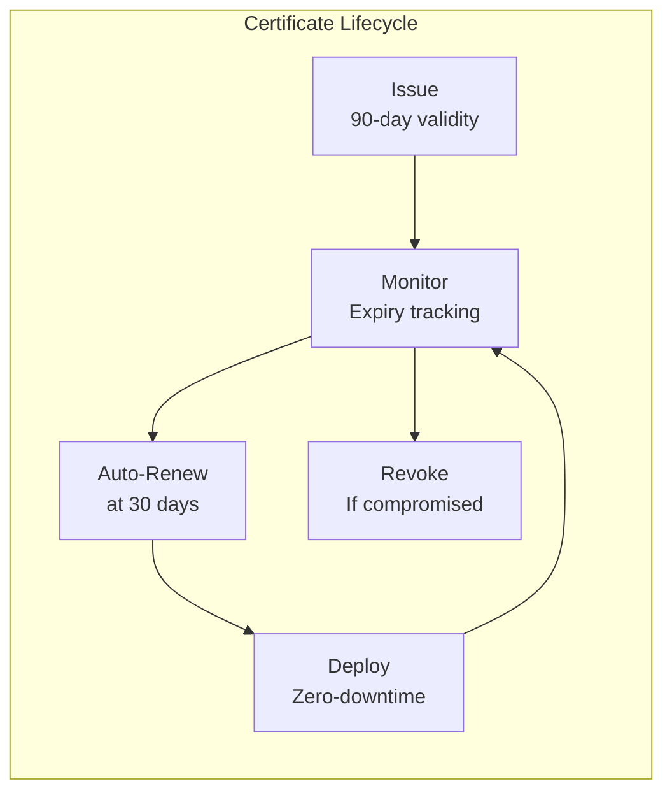

# Security & Compliance

[← Back to Index](./00-index.md)

---

## Authentication & Authorization

### Control Plane Access

| Access Type | Authentication | Authorization |
|-------------|----------------|---------------|
| Admin API | mTLS + API Key | RBAC (admin, operator, viewer) |
| Config Updates | mTLS + JWT | RBAC + change approval |
| Metrics/Logs | API Key | Read-only role |
| Emergency Access | Break-glass procedure | Audit logged |

### RBAC Model for LB Management



### Service-to-Service Authentication (mTLS)



### Token/Certificate Management

| Asset | Rotation Frequency | Storage | Alerts |
|-------|-------------------|---------|--------|
| TLS certificates | 90 days (auto-renew at 30) | Secrets manager | 14 days before expiry |
| API keys | 365 days | Vault/HSM | 30 days before expiry |
| mTLS client certs | 90 days | Secrets manager | 14 days before expiry |
| Session tickets | 24 hours | In-memory | N/A (auto-rotate) |

---

## Data Security

### Encryption at Rest

| Data | Encryption | Key Management |
|------|------------|----------------|
| Configuration | AES-256-GCM | KMS/Vault |
| TLS private keys | RSA/ECDSA wrapped | HSM recommended |
| Audit logs | AES-256-GCM | KMS/Vault |
| Metrics data | Depends on backend | Backend-specific |

### Encryption in Transit

```
Client → LB:
├── TLS 1.3 preferred, 1.2 minimum
├── Cipher suites: ECDHE+AESGCM, CHACHA20
├── Certificate: ECC P-256 or RSA 2048+
└── HSTS: max-age=31536000; includeSubDomains

LB → Backend:
├── mTLS recommended for sensitive services
├── TLS 1.2+ required
├── Internal CA for service certificates
└── Certificate pinning optional
```

### TLS Configuration Best Practices

```
Recommended TLS Settings:

# Protocol versions
ssl_protocols TLSv1.2 TLSv1.3;

# Modern cipher suites (TLS 1.3)
# - TLS_AES_256_GCM_SHA384
# - TLS_CHACHA20_POLY1305_SHA256
# - TLS_AES_128_GCM_SHA256

# TLS 1.2 cipher suites (forward secrecy only)
# - ECDHE-ECDSA-AES256-GCM-SHA384
# - ECDHE-RSA-AES256-GCM-SHA384
# - ECDHE-ECDSA-CHACHA20-POLY1305
# - ECDHE-RSA-CHACHA20-POLY1305

# Session settings
ssl_session_timeout 1d;
ssl_session_cache shared:SSL:50m;
ssl_session_tickets on;

# OCSP stapling
ssl_stapling on;
ssl_stapling_verify on;
```

### PII Handling

| Data Type | Handling | Logging Policy |
|-----------|----------|----------------|
| Client IP | Preserve for routing | Log, hash after 30 days |
| Request headers | May contain auth tokens | Redact sensitive headers |
| Request body | May contain PII | Never log by default |
| TLS session info | Contains client metadata | Log session ID only |

### Data Masking in Logs

```
Before masking:
GET /api/users?api_key=sk_live_abc123&email=user@example.com

After masking:
GET /api/users?api_key=sk_***[REDACTED]&email=***@***.com
```

---

## Threat Model

### Top Attack Vectors



### Threat Analysis Table

| Threat | Likelihood | Impact | Mitigation | Residual Risk |
|--------|------------|--------|------------|---------------|
| **Volumetric DDoS** | High | High | Anycast, scrubbing, rate limits | Low |
| **Protocol DDoS (SYN flood)** | High | Medium | SYN cookies, connection limits | Low |
| **Application DDoS (Slowloris)** | Medium | Medium | Timeouts, connection limits | Low |
| **TLS certificate theft** | Low | Critical | HSM, short-lived certs | Low |
| **Config tampering** | Low | Critical | mTLS, RBAC, audit logging | Very Low |
| **Insider threat** | Low | High | RBAC, audit, break-glass | Low |

### DDoS Protection Layers



### Rate Limiting at LB Layer

| Limit Type | Scope | Default | Purpose |
|------------|-------|---------|---------|
| Connection rate | Per IP | 100/sec | Prevent SYN floods |
| Request rate | Per IP | 1000/sec | Prevent HTTP floods |
| Bandwidth | Per IP | 100 Mbps | Prevent bandwidth exhaustion |
| Connection count | Per IP | 10,000 | Prevent resource exhaustion |
| Request rate | Global | 1M/sec | Protect backends |

### Security Headers

```
Response headers added by LB:

# Prevent clickjacking
X-Frame-Options: DENY

# Prevent MIME sniffing
X-Content-Type-Options: nosniff

# XSS protection
X-XSS-Protection: 1; mode=block

# HTTPS enforcement
Strict-Transport-Security: max-age=31536000; includeSubDomains; preload

# Request tracking
X-Request-ID: uuid-v4

# Remove server fingerprinting
Server: (removed or generic)
```

---

## Compliance Considerations

### Regulatory Requirements

| Regulation | Requirement | LB Impact |
|------------|-------------|-----------|
| **PCI-DSS** | Encrypt cardholder data in transit | TLS 1.2+, strong ciphers |
| **HIPAA** | Protect PHI in transit | TLS, access logging, audit |
| **GDPR** | Data processing records | Access logs, data retention |
| **SOC 2** | Security controls | Audit logging, access control |

### PCI-DSS Specific Requirements

```
PCI-DSS Requirements for Load Balancers:

Requirement 2.2.1: Change vendor defaults
├── Change default admin passwords
├── Disable unnecessary services
└── Document all configurations

Requirement 4.1: Strong cryptography
├── TLS 1.2 minimum (TLS 1.3 preferred)
├── Disable weak ciphers (RC4, DES, 3DES)
└── 2048-bit RSA or 256-bit ECC minimum

Requirement 10.2: Audit logging
├── Log all access to cardholder data
├── Log all admin actions
├── Retain logs for 1 year (90 days online)
└── Protect log integrity
```

### Audit Logging Requirements

| Event | Data Logged | Retention |
|-------|-------------|-----------|
| Configuration changes | Who, what, when, old/new values | 1 year |
| Admin access | User, IP, action, timestamp | 1 year |
| Authentication failures | IP, attempted user, timestamp | 90 days |
| TLS handshake failures | Client IP, error reason | 30 days |
| Backend health changes | Backend ID, old/new status, reason | 90 days |

### Audit Log Format

```
{
  "timestamp": "2024-01-15T10:30:00Z",
  "event_type": "config_change",
  "actor": {
    "user_id": "admin@example.com",
    "ip_address": "10.0.1.50",
    "auth_method": "mTLS+OIDC"
  },
  "resource": {
    "type": "backend_pool",
    "id": "pool-api-v1",
    "action": "add_backend"
  },
  "details": {
    "backend_address": "10.0.2.100:8080",
    "weight": 100
  },
  "result": "success"
}
```

---

## Security Operations

### Certificate Lifecycle Management



### Incident Response for Security Events

| Event | Severity | Response Time | Actions |
|-------|----------|---------------|---------|
| DDoS detected | P2 | 15 min | Enable scrubbing, increase capacity |
| Certificate compromise | P1 | Immediate | Revoke, reissue, rotate |
| Unauthorized access | P1 | Immediate | Block access, investigate, remediate |
| Configuration tampering | P1 | Immediate | Rollback, investigate, rotate credentials |

### Security Checklist

```
Pre-deployment Security Checklist:

[ ] TLS configuration hardened (1.2+, strong ciphers)
[ ] HSTS enabled with preload
[ ] Admin API requires mTLS
[ ] RBAC configured and tested
[ ] Audit logging enabled
[ ] Rate limiting configured
[ ] DDoS mitigation in place
[ ] Security headers added
[ ] Certificates from trusted CA
[ ] Certificate monitoring configured
[ ] Secrets stored in vault/HSM
[ ] Network segmentation implemented
[ ] Penetration test completed
```

### Vulnerability Management

| Component | Scan Frequency | Remediation SLA |
|-----------|----------------|-----------------|
| LB software | Weekly | Critical: 24h, High: 7d |
| TLS configuration | Monthly | Critical: 24h |
| Configuration | On change | Before deployment |
| Dependencies | Weekly | Critical: 48h, High: 14d |
