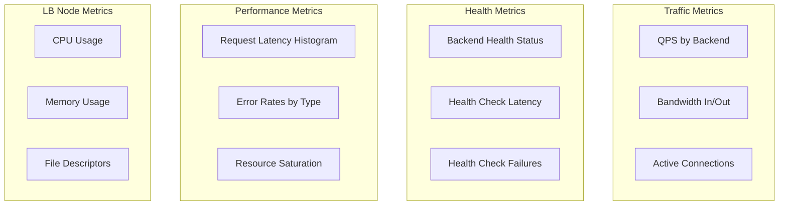
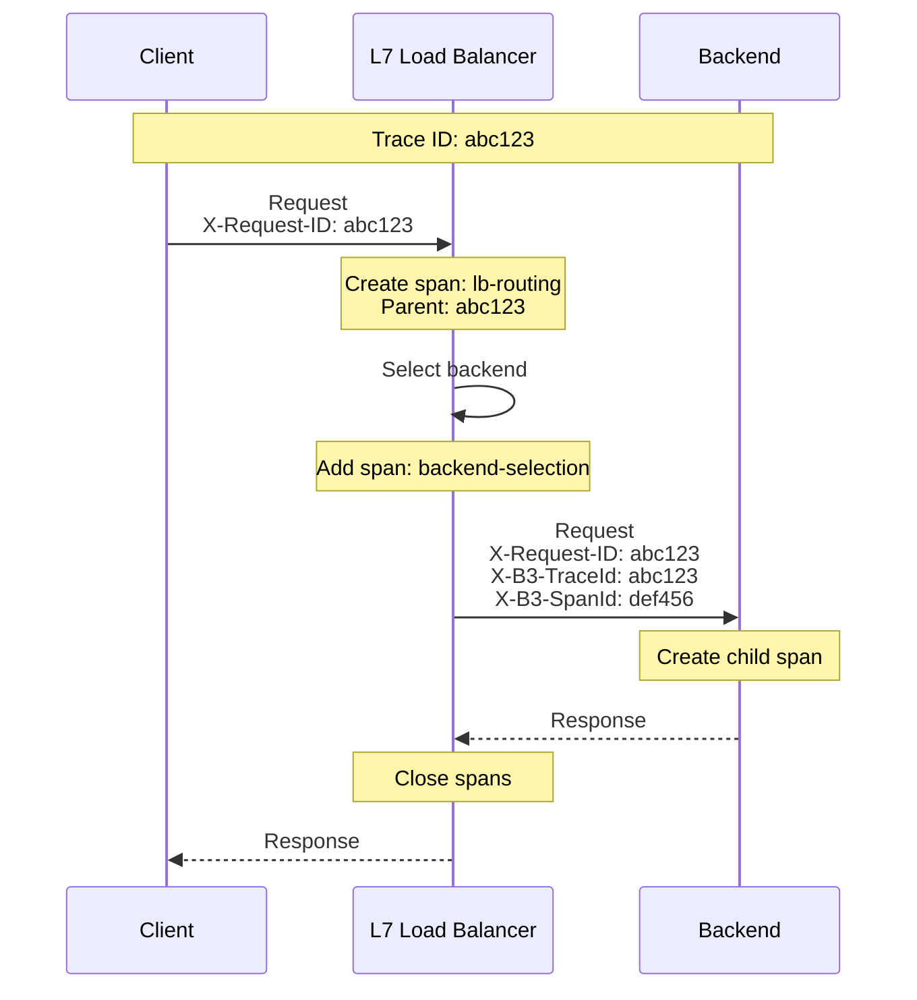

# Observability

[← Back to Index](./00-index.md)

---

## Metrics (USE/RED Method)

### USE Metrics (Resources)

| Resource | Utilization | Saturation | Errors |
|----------|-------------|------------|--------|
| **CPU** | cpu_usage_percent | cpu_throttle_time | N/A |
| **Memory** | memory_used_bytes | memory_pressure | oom_kills |
| **Network** | bytes_in/out_rate | packet_queue_drops | network_errors |
| **Connections** | active_connections / max | pending_connections | connection_errors |
| **File Descriptors** | fd_used / fd_max | fd_exhaustion_events | N/A |

### RED Metrics (Requests)

| Metric | Description | Labels |
|--------|-------------|--------|
| **Rate** | Requests per second | backend, status_code, method |
| **Errors** | Error rate (4xx, 5xx) | backend, error_type |
| **Duration** | Request latency | backend, quantile (p50, p95, p99) |

### Key Metrics Dashboard



### Metric Definitions

#### Traffic Metrics

```
# Requests per second (rate counter)
lb_requests_total{backend="api-v1", method="GET", status="200"}

# Active connections (gauge)
lb_active_connections{backend="api-v1"}

# Bytes transferred (counter)
lb_bytes_received_total{backend="api-v1"}
lb_bytes_sent_total{backend="api-v1"}

# Connection rate (counter)
lb_connections_total{backend="api-v1", result="success|refused|timeout"}
```

#### Latency Metrics

```
# Request duration histogram
lb_request_duration_seconds{backend="api-v1", quantile="0.5|0.95|0.99"}

# Connection setup time
lb_connection_setup_seconds{backend="api-v1", quantile="0.5|0.95|0.99"}

# TLS handshake time
lb_tls_handshake_seconds{quantile="0.5|0.95|0.99", tls_version="1.3"}

# Time to first byte
lb_time_to_first_byte_seconds{backend="api-v1", quantile="0.5|0.95|0.99"}
```

#### Health Metrics

```
# Backend health status (gauge: 1=healthy, 0=unhealthy)
lb_backend_health{backend="api-v1-host1:8080", pool="api-v1"}

# Health check latency
lb_health_check_duration_seconds{backend="api-v1-host1:8080", quantile="0.99"}

# Consecutive failures
lb_backend_consecutive_failures{backend="api-v1-host1:8080"}

# Health check results
lb_health_checks_total{backend="api-v1-host1:8080", result="success|failure|timeout"}
```

#### Resource Metrics

```
# LB node resources
lb_cpu_usage_percent{node="lb-1"}
lb_memory_used_bytes{node="lb-1"}
lb_file_descriptors_used{node="lb-1"}

# Connection table
lb_connection_table_size{node="lb-1"}
lb_connection_table_max{node="lb-1"}

# TLS session cache
lb_tls_session_cache_hits_total
lb_tls_session_cache_misses_total
```

---

## Dashboard Design

### Executive Dashboard

```
┌─────────────────────────────────────────────────────────────┐
│  Load Balancer Overview                          [Last 1h]  │
├─────────────────┬─────────────────┬─────────────────────────┤
│   Total QPS     │  Error Rate     │     P99 Latency         │
│   ████ 150,000  │  ░░░░ 0.02%     │     ████ 12ms           │
├─────────────────┴─────────────────┴─────────────────────────┤
│  Backend Health Summary                                     │
│  [██████████████████████░░░░░] 85/100 Healthy               │
├─────────────────────────────────────────────────────────────┤
│  Traffic by Backend Pool          │  Top Errors             │
│  api-v1: ███████████ 60%          │  502 Bad Gateway: 150   │
│  api-v2: █████ 25%                │  504 Timeout: 45        │
│  static: ███ 15%                  │  503 Service Unavail: 12│
└─────────────────────────────────────────────────────────────┘
```

### Operational Dashboard

```
┌─────────────────────────────────────────────────────────────┐
│  LB Node Status                                             │
├───────┬─────────┬─────────┬──────────┬─────────┬───────────┤
│ Node  │ CPU %   │ Mem %   │ Conn     │ QPS     │ Status    │
├───────┼─────────┼─────────┼──────────┼─────────┼───────────┤
│ lb-1  │ 45%     │ 62%     │ 250,000  │ 30,000  │ ✓ Healthy │
│ lb-2  │ 48%     │ 58%     │ 245,000  │ 31,000  │ ✓ Healthy │
│ lb-3  │ 52%     │ 65%     │ 260,000  │ 32,000  │ ✓ Healthy │
│ lb-4  │ 43%     │ 55%     │ 240,000  │ 29,000  │ ✓ Healthy │
│ lb-5  │ 47%     │ 60%     │ 248,000  │ 30,000  │ ✓ Healthy │
└───────┴─────────┴─────────┴──────────┴─────────┴───────────┘

┌─────────────────────────────────────────────────────────────┐
│  Backend Pool: api-v1                    [15 backends]      │
├────────────────┬────────┬────────┬──────────┬───────────────┤
│ Backend        │ Conns  │ QPS    │ P99 (ms) │ Status        │
├────────────────┼────────┼────────┼──────────┼───────────────┤
│ 10.0.1.10:8080 │ 1,200  │ 2,100  │ 8        │ ✓ Healthy     │
│ 10.0.1.11:8080 │ 1,180  │ 2,050  │ 9        │ ✓ Healthy     │
│ 10.0.1.12:8080 │ 1,250  │ 2,200  │ 12       │ ⚠ Degraded    │
│ 10.0.1.13:8080 │ 0      │ 0      │ -        │ ✗ Unhealthy   │
└────────────────┴────────┴────────┴──────────┴───────────────┘
```

### Latency Analysis Dashboard

```
┌─────────────────────────────────────────────────────────────┐
│  Latency Distribution (Last 5 min)                          │
├─────────────────────────────────────────────────────────────┤
│                                                             │
│   0-5ms   ████████████████████████████████████████ 75%     │
│   5-10ms  ███████████████ 18%                               │
│   10-20ms █████ 5%                                          │
│   20-50ms █ 1.5%                                            │
│   >50ms   ░ 0.5%                                            │
│                                                             │
├─────────────────────────────────────────────────────────────┤
│  Latency Breakdown                                          │
│  ┌──────────────────────────────────────────────┐           │
│  │ TLS handshake:  ████ 2ms                     │           │
│  │ Backend select: █ 0.1ms                      │           │
│  │ Connection:     ██ 0.5ms                     │           │
│  │ Request proxy:  █████████ 5ms                │           │
│  │ Response proxy: ██████ 3ms                   │           │
│  └──────────────────────────────────────────────┘           │
└─────────────────────────────────────────────────────────────┘
```

---

## Logging

### Log Levels Strategy

| Level | When to Use | Example |
|-------|-------------|---------|
| **ERROR** | Failures requiring attention | Backend connection refused |
| **WARN** | Degraded but functional | High latency, retries |
| **INFO** | Normal operations | Config reload, backend add/remove |
| **DEBUG** | Troubleshooting | Per-request details (off by default) |

### Structured Log Format

```
{
  "timestamp": "2024-01-15T10:30:00.123Z",
  "level": "INFO",
  "message": "Request completed",
  "trace_id": "abc123def456",
  "span_id": "span789",
  "lb_node": "lb-1",
  "client": {
    "ip": "203.0.113.50",
    "port": 54321
  },
  "request": {
    "method": "GET",
    "path": "/api/v1/users",
    "host": "api.example.com",
    "user_agent": "Mozilla/5.0..."
  },
  "backend": {
    "pool": "api-v1",
    "address": "10.0.1.10:8080",
    "selection_algorithm": "least_connections"
  },
  "response": {
    "status_code": 200,
    "bytes": 1234
  },
  "timing": {
    "total_ms": 12.5,
    "tls_ms": 2.1,
    "backend_connect_ms": 0.5,
    "backend_response_ms": 9.2
  },
  "tls": {
    "version": "TLSv1.3",
    "cipher": "TLS_AES_256_GCM_SHA384",
    "session_reused": true
  }
}
```

### What to Log

| Event | Log Level | Key Fields |
|-------|-----------|------------|
| Request completed | INFO (sampled) | trace_id, backend, status, timing |
| Request error | ERROR | trace_id, error_type, backend, request |
| Backend health change | INFO | backend_id, old_status, new_status, reason |
| Configuration change | INFO | change_type, actor, old_value, new_value |
| TLS handshake failure | WARN | client_ip, error_reason, tls_version |
| Rate limit exceeded | WARN | client_ip, limit_type, current_rate |
| Connection limit reached | WARN | client_ip, current_connections, max |

### Log Sampling Strategy

```
High-volume logs (requests):
├── Success (2xx): Sample 1% in production
├── Client errors (4xx): Sample 10%
├── Server errors (5xx): Log 100%
├── Slow requests (>p99): Log 100%
└── Debug mode: Log 100% (temporary)

Low-volume logs (always 100%):
├── Health check status changes
├── Configuration changes
├── Admin actions
└── Errors and warnings
```

---

## Distributed Tracing

### Trace Propagation



### Key Spans to Instrument

| Span Name | Description | Key Attributes |
|-----------|-------------|----------------|
| `lb.request` | Full request lifecycle | method, path, status, duration |
| `lb.tls_handshake` | TLS negotiation | tls_version, cipher, reused |
| `lb.backend_selection` | Algorithm execution | algorithm, selected_backend |
| `lb.backend_connect` | Connection to backend | backend_addr, connect_time |
| `lb.backend_request` | Request to backend | backend_addr, response_time |
| `lb.health_check` | Health probe | backend_addr, result, latency |

### Trace Headers

```
Propagation headers (B3 format):

Incoming:
  X-Request-ID: client-generated-id (optional)

Added/Propagated:
  X-B3-TraceId: abc123def456789
  X-B3-SpanId: span123
  X-B3-ParentSpanId: parentspan456
  X-B3-Sampled: 1

Alternative (W3C Trace Context):
  traceparent: 00-abc123def456789-span123-01
  tracestate: vendor=value
```

---

## Alerting

### Critical Alerts (Page-Worthy)

| Alert | Condition | Threshold | Response |
|-------|-----------|-----------|----------|
| **High Error Rate** | 5xx rate > baseline | > 1% for 2 min | Investigate, possible backend issue |
| **All Backends Down** | Pool has 0 healthy backends | Any pool | Immediate escalation |
| **LB Node Down** | Node health check fails | Any node | Auto-failover, investigate |
| **Latency Spike** | P99 > baseline | > 5x for 5 min | Investigate bottleneck |
| **Certificate Expiring** | Cert expires soon | < 7 days | Renew immediately |

### Warning Alerts

| Alert | Condition | Threshold | Response |
|-------|-----------|-----------|----------|
| **Backend Unhealthy** | Backend removed from pool | Any single backend | Investigate during business hours |
| **High CPU** | LB node CPU elevated | > 70% for 10 min | Consider scaling |
| **High Memory** | LB node memory elevated | > 80% for 10 min | Consider scaling |
| **High Connections** | Approaching connection limit | > 80% of max | Plan capacity increase |
| **Elevated Latency** | P99 above target | > 2x baseline for 10 min | Monitor, investigate |

### Alert Routing

```
Alert Severity Routing:

Critical (P1):
├── Notify: On-call engineer via PagerDuty
├── Escalation: 15 min → Team lead, 30 min → Engineering manager
└── Auto-remediation: Attempt if available

Warning (P2):
├── Notify: Team Slack channel
├── Escalation: Next business day review
└── Auto-remediation: None (human review)

Info (P3):
├── Notify: Log only
├── Escalation: Weekly review
└── Auto-remediation: N/A
```

### Runbook References

| Alert | Runbook Link | Key Steps |
|-------|--------------|-----------|
| High Error Rate | /runbooks/lb-high-errors | 1. Check backend health, 2. Review recent changes, 3. Check backend logs |
| Backend Pool Empty | /runbooks/lb-no-backends | 1. Check health check config, 2. Verify backend status, 3. Manual backend add |
| Certificate Expiring | /runbooks/lb-cert-renewal | 1. Trigger auto-renewal, 2. Verify new cert, 3. Deploy |
| Connection Limit | /runbooks/lb-conn-limit | 1. Identify source IPs, 2. Check for attack, 3. Scale if legitimate |

---

## Observability Best Practices

### Cardinality Management

```
High cardinality (avoid):
  lb_requests_total{client_ip="..."}  // Millions of values!

Low cardinality (good):
  lb_requests_total{backend="api-v1", status_class="2xx"}

Mitigation strategies:
├── Use log sampling for per-request details
├── Aggregate metrics by meaningful dimensions
├── Set cardinality limits on metric backends
└── Use histograms for distributions, not individual values
```

### Retention Policies

| Data Type | Hot Storage | Cold Storage | Total Retention |
|-----------|-------------|--------------|-----------------|
| High-res metrics (1s) | 24 hours | N/A | 24 hours |
| Standard metrics (15s) | 7 days | N/A | 7 days |
| Aggregated metrics (1m) | 30 days | 1 year | 1 year |
| Access logs | 7 days | 90 days | 90 days |
| Audit logs | 30 days | 1 year | 1 year |
| Traces | 7 days | 30 days | 30 days |

### SLI/SLO Monitoring

```
Service Level Indicators:

Availability SLI:
  (successful_requests / total_requests) × 100
  Target: 99.99%

Latency SLI:
  (requests_under_threshold / total_requests) × 100
  Target: 99% of requests < 100ms

Error Budget:
  100% - SLO = Error Budget
  99.99% SLO → 0.01% error budget → 4.38 min/month
```
