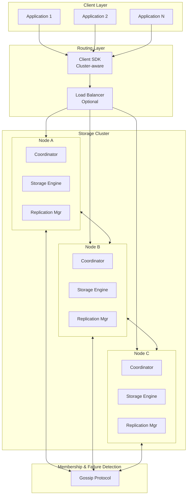
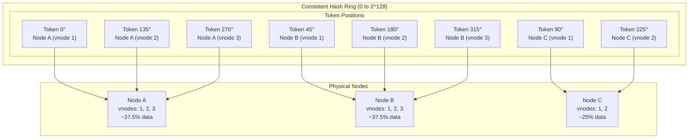
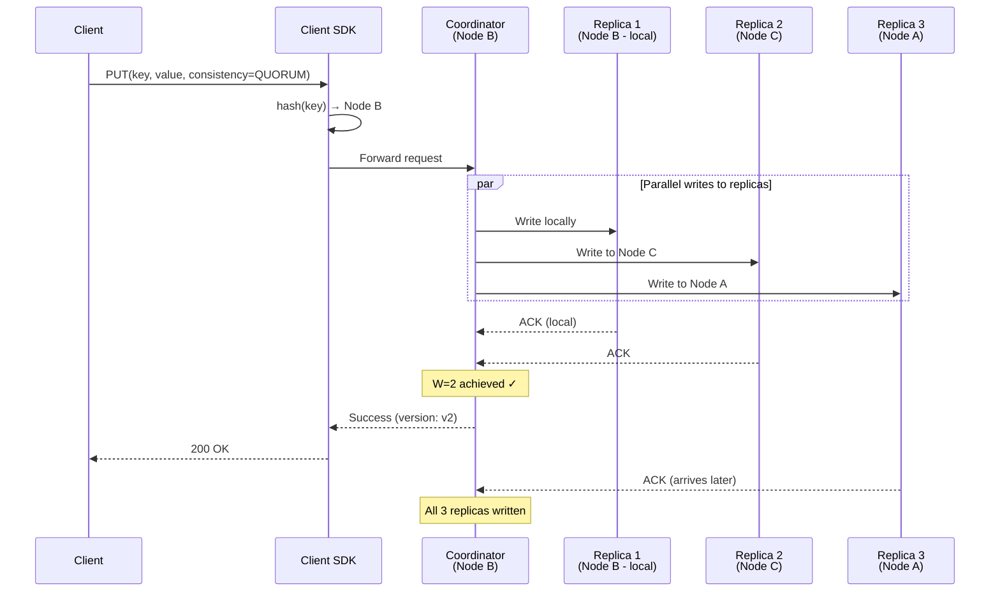
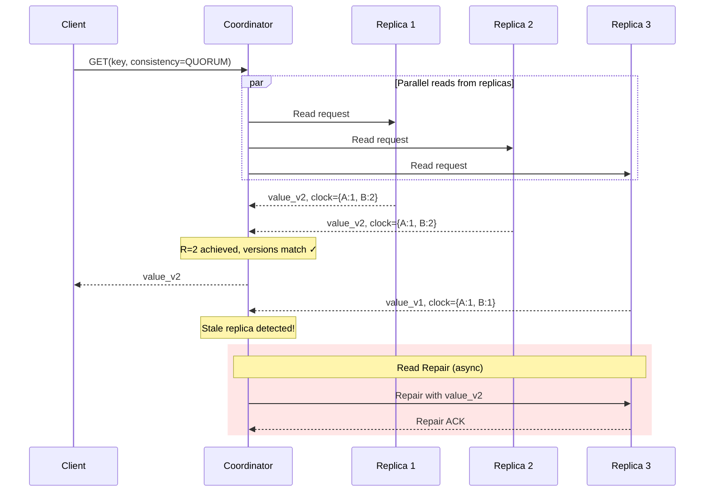
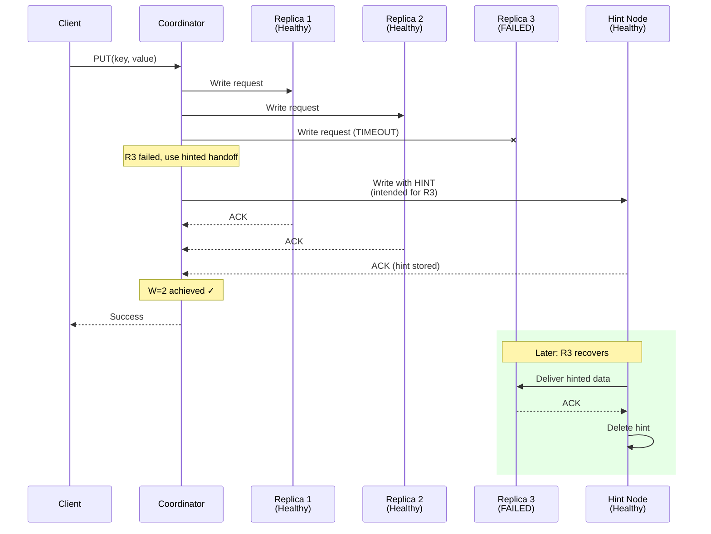
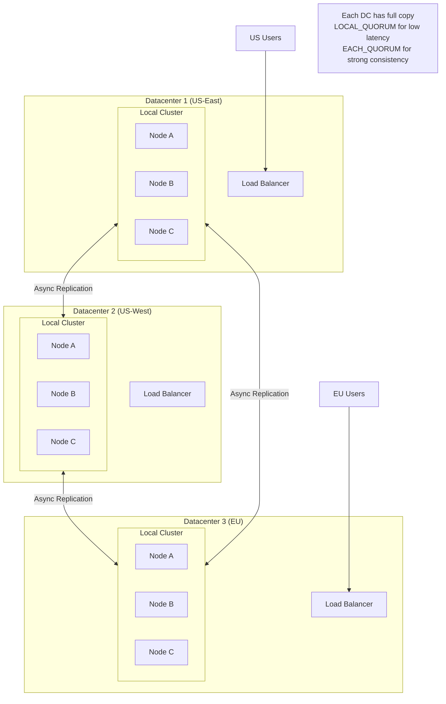
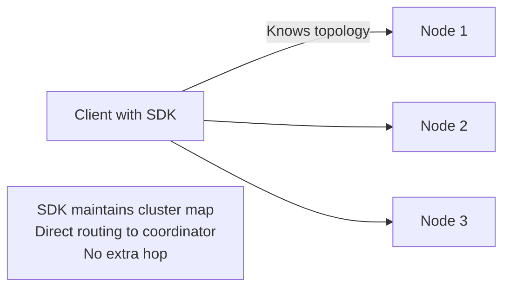
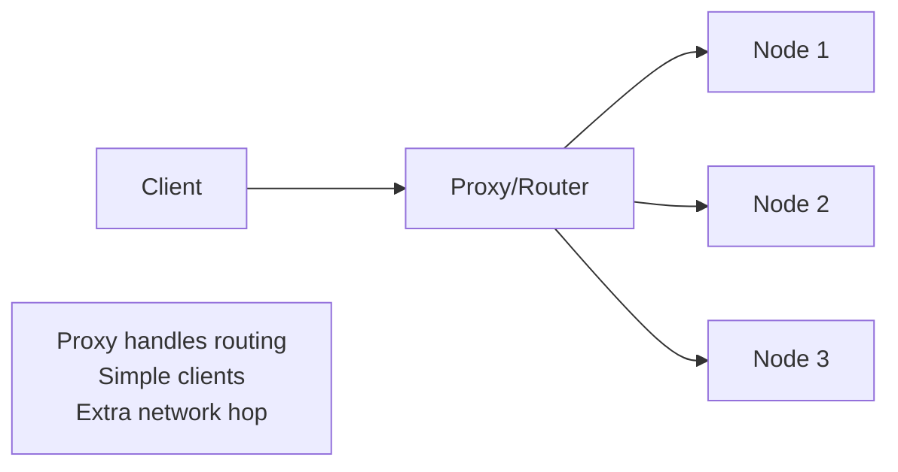
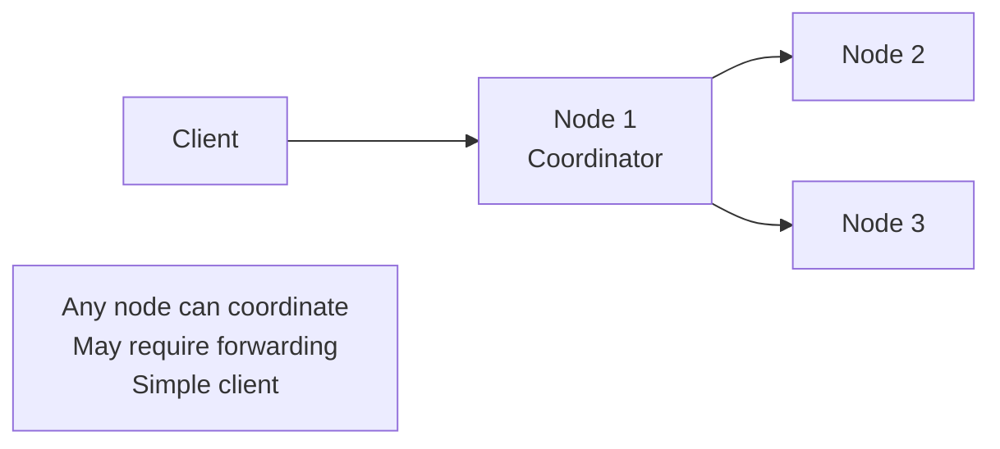
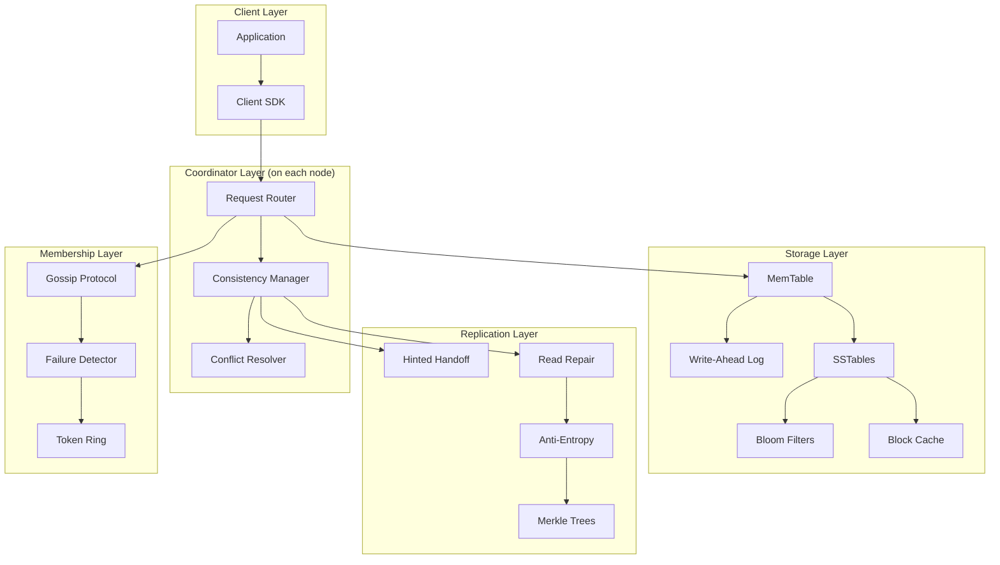

# High-Level Design

[← Back to Index](./00-index.md)

---

## System Architecture Overview

The distributed key-value store follows a **decentralized, peer-to-peer architecture** (Dynamo-style) where any node can serve any request. This eliminates single points of failure and enables horizontal scaling.

### Core Components



### Component Responsibilities

| Component | Responsibility | Key Features |
|-----------|---------------|--------------|
| **Client SDK** | Request routing, connection pooling | Cluster topology awareness, retries |
| **Coordinator** | Handle client requests, coordinate replicas | Any node can coordinate any key |
| **Storage Engine** | Persist data, manage LSM tree | MemTable, SSTables, compaction |
| **Replication Manager** | Sync data across replicas | Hinted handoff, anti-entropy |
| **Gossip Protocol** | Cluster membership, failure detection | Decentralized, eventually consistent |

---

## Consistent Hash Ring Architecture

### Virtual Nodes Distribution



### Key-to-Node Mapping

```
Key: "user:12345:preferences"

Step 1: Hash the key
  hash = MD5("user:12345:preferences")
       = 0x7A3B2C1D... (128-bit value)

Step 2: Find position on ring
  position = hash mod 2^128

Step 3: Walk clockwise to find coordinator
  coordinator = first_node_at_or_after(position)
              = Node B (vnode 1 at 45°)

Step 4: Build preference list (N=3 replicas)
  preference_list = [Node B, Node C, Node A]
  (Skip duplicate physical nodes)
```

---

## Data Flow Diagrams

### Write Path (Quorum: N=3, W=2)



### Read Path with Read Repair (R=2)



### Write Path with Hinted Handoff (Node Failure)



---

## Key Architectural Decisions

### Decision 1: Partitioning Strategy

| Option | Description | Pros | Cons |
|--------|-------------|------|------|
| **Consistent Hashing** | Hash key to position on ring | Even distribution, minimal rebalancing | No range queries |
| Range Partitioning | Split by key ranges | Range queries, locality | Hot spots, complex splits |
| Hash Slots (Redis) | Fixed 16384 slots | Predictable, easy migration | Manual slot management |

**Decision: Consistent Hashing with Virtual Nodes**

*Rationale:*
- Uniform distribution of data across nodes
- Adding/removing nodes affects minimal data (~1/N)
- Virtual nodes (100-256 per physical) smooth out variance
- No single coordinator for partition assignment

### Decision 2: Replication Strategy

| Option | Description | Consistency | Latency | Availability |
|--------|-------------|-------------|---------|--------------|
| Synchronous | Wait for all replicas | Strong | High | Lower |
| Asynchronous | Fire-and-forget | Eventual | Low | High |
| **Quorum (N,R,W)** | Wait for majority | Tunable | Medium | High |
| Chain Replication | Sequential through chain | Strong | Medium | Medium |

**Decision: Quorum-based with Sloppy Quorum**

```
Default configuration: N=3, R=2, W=2

Consistency guarantee: R + W > N → 2 + 2 > 3 ✓
  - At least one node in read set has latest write

Sloppy quorum:
  - During failures, write to any N healthy nodes
  - Use hinted handoff to recover original replicas
```

### Decision 3: Consistency Model

| Model | Implementation | Trade-off |
|-------|----------------|-----------|
| **Strong (CP)** | Raft/Paxos, single leader | High latency, may reject during partition |
| **Eventual (AP)** | Async replication | Low latency, may return stale |
| **Tunable** | Configurable R, W per request | Flexibility, complexity |

**Decision: Tunable Consistency (Dynamo-style)**

```yaml
Consistency levels:
  ONE:
    reads: Return from any replica
    writes: Ack from any replica
    use_case: Maximum speed, eventual consistency

  QUORUM:
    reads: Return from R replicas (majority)
    writes: Ack from W replicas (majority)
    use_case: Balanced consistency/availability

  ALL:
    reads: Return from all N replicas
    writes: Ack from all N replicas
    use_case: Strong consistency, lower availability

  LOCAL_QUORUM:
    reads: Quorum within local datacenter
    writes: Quorum within local datacenter
    use_case: Cross-DC deployments
```

### Decision 4: Conflict Resolution

| Option | Description | Data Loss Risk | Complexity |
|--------|-------------|----------------|------------|
| Last-Write-Wins (LWW) | Highest timestamp wins | Yes (silent) | Low |
| **Vector Clocks** | Track causality, detect conflicts | No (explicit) | Medium |
| CRDTs | Mathematically mergeable types | No | High |
| Application Resolution | Return all versions to client | No | Client complexity |

**Decision: Vector Clocks with LWW Fallback**

*Rationale:*
- Detect truly concurrent writes
- Return siblings to application when conflict detected
- Fall back to LWW for simple cases (client preference)

### Decision 5: Storage Engine

| Option | Description | Write Optimized | Read Optimized |
|--------|-------------|-----------------|----------------|
| **LSM Tree** | Append-only, periodic compaction | Yes | Medium (with bloom filters) |
| B-Tree | In-place updates | Medium | Yes |
| Hash Index | In-memory hash map | Yes | Yes (point queries only) |

**Decision: LSM Tree (RocksDB/LevelDB style)**

*Rationale:*
- Write-optimized for high write throughput
- Bloom filters accelerate reads
- Good compression ratios
- Industry proven (Cassandra, RocksDB)

---

## Multi-Datacenter Architecture



### Cross-DC Consistency Options

| Level | Behavior | Latency | Use Case |
|-------|----------|---------|----------|
| LOCAL_ONE | Ack from 1 local node | Lowest | Reads only |
| LOCAL_QUORUM | Ack from local majority | Low | Most operations |
| EACH_QUORUM | Ack from majority in each DC | High | Critical writes |
| ALL | Ack from all nodes everywhere | Highest | Rarely used |

---

## Architecture Pattern Checklist

| Pattern | Decision | Rationale |
|---------|----------|-----------|
| ✅ Sync vs Async | Async with quorum | Balance consistency and latency |
| ✅ Event-driven vs Request-response | Request-response | Simpler for KV operations |
| ✅ Push vs Pull | Pull (client requests) | Standard KV access pattern |
| ✅ Stateless vs Stateful | Stateful (data storage) | By definition |
| ✅ Read-heavy vs Write-heavy | Configurable (default read-heavy) | LSM + caching |
| ✅ Real-time vs Batch | Real-time | Low latency requirement |
| ✅ Centralized vs Decentralized | Decentralized | No SPOF, any node can serve |
| ✅ Leader vs Leaderless | Leaderless (Dynamo) | Higher availability |

---

## Request Routing Options

### Option 1: Client-Side Routing (Recommended)



**Pros:** Lowest latency, no single point of failure
**Cons:** SDK complexity, topology updates needed

### Option 2: Proxy-Based Routing



**Pros:** Simple clients, centralized routing logic
**Cons:** Extra hop, proxy can be bottleneck

### Option 3: Any-Node Routing (Cassandra-style)



**Pros:** Simple client, any node as entry point
**Cons:** May forward requests (extra hop for some keys)

---

## Component Interaction Diagram



---

## Summary: High-Level Architecture

| Aspect | Choice | Alternative Considered |
|--------|--------|----------------------|
| **Topology** | Decentralized P2P | Master-slave |
| **Partitioning** | Consistent hashing + vnodes | Range partitioning |
| **Replication** | Quorum (N=3, R=2, W=2) | Synchronous, chain |
| **Consistency** | Tunable per-request | Fixed strong/eventual |
| **Conflict Resolution** | Vector clocks | LWW only |
| **Storage** | LSM Tree | B-Tree |
| **Routing** | Client-side aware | Proxy-based |
| **Failure Handling** | Sloppy quorum + hinted handoff | Strict quorum |
