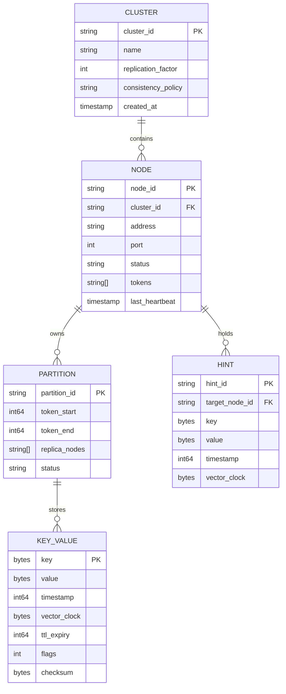
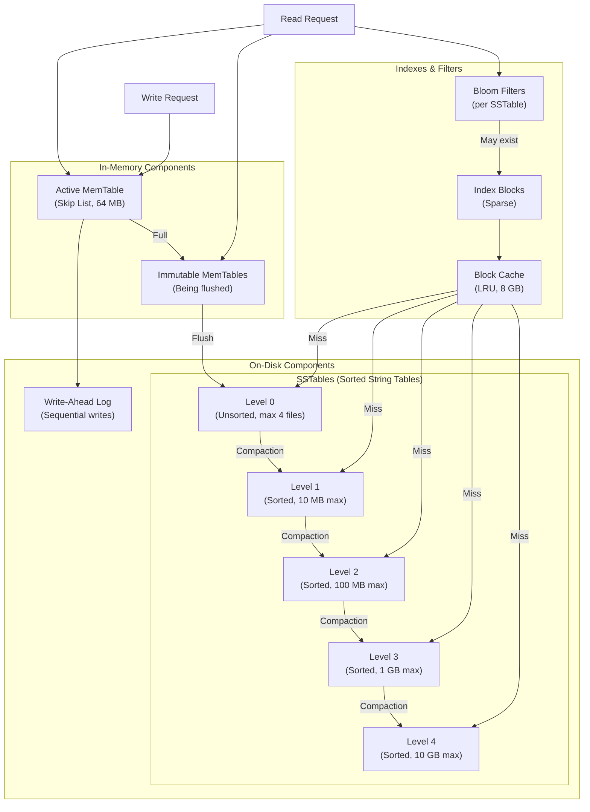
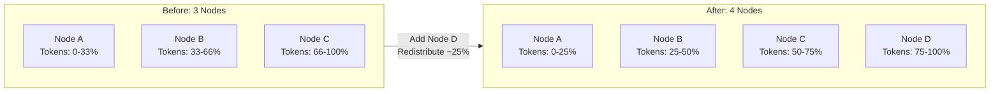

# Low-Level Design

[← Back to Index](./00-index.md)

---

## Data Model

### Key-Value Structure

```
┌─────────────────────────────────────────────────────────────────────────┐
│                           KEY-VALUE RECORD                              │
├─────────────────────────────────────────────────────────────────────────┤
│ KEY (max 256 bytes)                                                     │
│ ┌─────────────────────────────────────────────────────────────────────┐ │
│ │ Format: namespace:entity_type:entity_id:attribute                   │ │
│ │ Example: "prod:user:12345:preferences"                              │ │
│ └─────────────────────────────────────────────────────────────────────┘ │
├─────────────────────────────────────────────────────────────────────────┤
│ METADATA (fixed ~64 bytes)                                              │
│ ┌───────────────┬───────────────┬───────────────┬───────────────────┐  │
│ │ Timestamp     │ Vector Clock  │ TTL           │ Flags             │  │
│ │ (8 bytes)     │ (32 bytes)    │ (8 bytes)     │ (4 bytes)         │  │
│ │ Unix epoch ns │ {nodeId:cnt}  │ Expiry time   │ Tombstone, etc.   │  │
│ └───────────────┴───────────────┴───────────────┴───────────────────┘  │
├─────────────────────────────────────────────────────────────────────────┤
│ VALUE (max 1 MB)                                                        │
│ ┌─────────────────────────────────────────────────────────────────────┐ │
│ │ Opaque bytes (application-defined)                                  │ │
│ │ Commonly: JSON, Protobuf, MessagePack                               │ │
│ └─────────────────────────────────────────────────────────────────────┘ │
├─────────────────────────────────────────────────────────────────────────┤
│ CHECKSUM (4 bytes) - CRC32 of key + metadata + value                    │
└─────────────────────────────────────────────────────────────────────────┘
```

### Entity-Relationship Diagram



### Vector Clock Structure

```
VectorClock = Map<NodeId, LogicalCounter>

Example evolution:
  Initial:        {}
  After Node A write: {A: 1}
  After Node B write: {A: 1, B: 1}
  After Node A second write: {A: 2, B: 1}

Comparison rules:
  VC1 < VC2  if ∀i: VC1[i] ≤ VC2[i] AND ∃j: VC1[j] < VC2[j]
  VC1 > VC2  if VC2 < VC1
  VC1 ∥ VC2  (concurrent) if ¬(VC1 < VC2) AND ¬(VC1 > VC2)
  VC1 = VC2  if ∀i: VC1[i] = VC2[i]
```

---

## API Design

### Service Interface (gRPC-style)

```protobuf
service KeyValueStore {
  // Core operations
  rpc Get(GetRequest) returns (GetResponse);
  rpc Put(PutRequest) returns (PutResponse);
  rpc Delete(DeleteRequest) returns (DeleteResponse);

  // Batch operations
  rpc BatchGet(BatchGetRequest) returns (BatchGetResponse);
  rpc BatchPut(BatchPutRequest) returns (BatchPutResponse);

  // Conditional operations
  rpc CompareAndSwap(CASRequest) returns (CASResponse);

  // Scan (for range-partitioned deployments)
  rpc Scan(ScanRequest) returns (stream ScanResponse);

  // Watch for changes (etcd-style)
  rpc Watch(WatchRequest) returns (stream WatchEvent);
}
```

### Request/Response Definitions

```yaml
# GET Request
GetRequest:
  key: bytes              # Required: the key to retrieve
  consistency: enum       # ONE | QUORUM | ALL | LOCAL_QUORUM
  allow_stale: bool       # Accept potentially stale data for lower latency
  timeout_ms: int32       # Request timeout (default: 5000)

GetResponse:
  found: bool             # Whether key exists
  value: bytes            # The value (if found)
  version: int64          # Logical version for CAS
  vector_clock: bytes     # For conflict detection
  timestamp: int64        # Last modification time
  ttl_remaining: int32    # Seconds until expiry (0 = no TTL)

# PUT Request
PutRequest:
  key: bytes              # Required: the key
  value: bytes            # Required: the value
  consistency: enum       # ONE | QUORUM | ALL | LOCAL_QUORUM
  ttl_seconds: int32      # Time-to-live (0 = never expire)
  expected_version: int64 # For optimistic locking (0 = ignore)
  if_not_exists: bool     # Only write if key doesn't exist

PutResponse:
  success: bool
  version: int64          # New version after write
  vector_clock: bytes     # Updated vector clock

# DELETE Request
DeleteRequest:
  key: bytes
  consistency: enum
  expected_version: int64 # For conditional delete

DeleteResponse:
  success: bool
  was_present: bool       # Whether key existed before delete

# Batch GET
BatchGetRequest:
  keys: list<bytes>       # Max 100 keys
  consistency: enum

BatchGetResponse:
  results: map<bytes, GetResponse>
  failed_keys: list<bytes>

# Compare-and-Swap
CASRequest:
  key: bytes
  expected_value: bytes   # Current expected value (or null for create)
  new_value: bytes        # Value to set if expectation matches
  expected_version: int64 # Alternative: version-based CAS

CASResponse:
  success: bool
  current_value: bytes    # Actual current value (if CAS failed)
  current_version: int64
```

### REST API Mapping

| Operation | HTTP Method | Endpoint | Notes |
|-----------|-------------|----------|-------|
| Get | GET | `/v1/kv/{key}` | Consistency via query param |
| Put | PUT | `/v1/kv/{key}` | Value in body, TTL in header |
| Delete | DELETE | `/v1/kv/{key}` | |
| Batch Get | POST | `/v1/kv/batch/get` | Keys in body |
| Batch Put | POST | `/v1/kv/batch/put` | Key-value pairs in body |
| CAS | PUT | `/v1/kv/{key}` | `If-Match` header for version |
| Scan | GET | `/v1/kv/scan` | `start`, `end`, `limit` params |

### Idempotency

```
Idempotent operations:
  - GET (inherently idempotent)
  - PUT with same value (results in same state)
  - DELETE (deleting twice = same result)

Non-idempotent without care:
  - Counters (increment/decrement)
  - Append operations

Idempotency key pattern:
  PUT /v1/kv/mykey
  Headers:
    X-Idempotency-Key: uuid-12345
    X-Client-Timestamp: 1705000000

  Server maintains:
    idempotency_cache[uuid-12345] = response (TTL: 24h)

  If duplicate request arrives:
    Return cached response without re-executing
```

---

## Storage Engine: LSM Tree Architecture

### Overview



### SSTable File Format

```
┌─────────────────────────────────────────────────────────────────────┐
│                         SSTable File Format                          │
├─────────────────────────────────────────────────────────────────────┤
│ DATA BLOCKS (sorted key-value pairs, 4KB each, compressed)          │
│ ┌─────────────┬─────────────┬─────────────┬─────────────┐          │
│ │ Block 0     │ Block 1     │ Block 2     │ ... Block N │          │
│ │ key1:val1   │ key50:val50 │ key100:val  │             │          │
│ │ key2:val2   │ key51:val51 │ key101:val  │             │          │
│ │ ...         │ ...         │ ...         │             │          │
│ └─────────────┴─────────────┴─────────────┴─────────────┘          │
├─────────────────────────────────────────────────────────────────────┤
│ FILTER BLOCK (Bloom filter for all keys in this SSTable)            │
│ ┌───────────────────────────────────────────────────────┐          │
│ │ Bloom filter bits (10 bits/key, ~1% false positive)   │          │
│ └───────────────────────────────────────────────────────┘          │
├─────────────────────────────────────────────────────────────────────┤
│ INDEX BLOCK (sparse index: first key of each data block)            │
│ ┌───────────────────────────────────────────────────────┐          │
│ │ block_0_key -> offset_0                               │          │
│ │ block_1_key -> offset_1                               │          │
│ │ ...                                                   │          │
│ └───────────────────────────────────────────────────────┘          │
├─────────────────────────────────────────────────────────────────────┤
│ FOOTER (fixed size, contains offsets)                               │
│ ┌───────────────────────────────────────────────────────┐          │
│ │ filter_offset │ index_offset │ checksum │ magic_num   │          │
│ └───────────────────────────────────────────────────────┘          │
└─────────────────────────────────────────────────────────────────────┘
```

### Write Path Algorithm

```
FUNCTION write(key, value, metadata):
    // Step 1: Append to Write-Ahead Log (durability)
    wal_entry = serialize(key, value, metadata)
    wal.append(wal_entry)
    wal.sync()  // fsync for durability

    // Step 2: Insert into MemTable
    memtable.insert(key, value, metadata)

    // Step 3: Check if MemTable is full
    IF memtable.size() >= MEMTABLE_SIZE_LIMIT:  // e.g., 64 MB
        // Freeze current MemTable
        immutable_memtables.add(memtable)
        memtable = new MemTable()

        // Trigger background flush
        background_flush_queue.enqueue(immutable_memtables.oldest())

    RETURN success

FUNCTION background_flush():
    WHILE true:
        imm = background_flush_queue.dequeue()  // blocking

        // Create new SSTable from MemTable
        sstable = SSTable.create()
        FOR (key, value, metadata) IN imm.sorted_iterator():
            sstable.add(key, value, metadata)
        sstable.finalize()  // write bloom filter, index, footer

        // Add to Level 0
        level0.add(sstable)

        // Remove flushed MemTable
        immutable_memtables.remove(imm)

        // Check if compaction needed
        IF level0.file_count() > MAX_L0_FILES:  // e.g., 4 files
            trigger_compaction(level=0)
```

### Read Path Algorithm

```
FUNCTION read(key):
    // Step 1: Check active MemTable (most recent)
    result = memtable.get(key)
    IF result != NOT_FOUND:
        IF result.is_tombstone():
            RETURN NOT_FOUND
        RETURN result

    // Step 2: Check immutable MemTables (next most recent)
    FOR imm IN immutable_memtables.reverse_order():
        result = imm.get(key)
        IF result != NOT_FOUND:
            IF result.is_tombstone():
                RETURN NOT_FOUND
            RETURN result

    // Step 3: Check SSTables level by level
    FOR level IN [0, 1, 2, ..., MAX_LEVEL]:

        // Level 0: may have overlapping key ranges, check all
        IF level == 0:
            FOR sstable IN level0.reverse_chronological():
                result = sstable_lookup(sstable, key)
                IF result != NOT_FOUND:
                    IF result.is_tombstone():
                        RETURN NOT_FOUND
                    RETURN result

        // Level 1+: non-overlapping, binary search to find file
        ELSE:
            sstable = level.find_sstable_for_key(key)  // binary search
            IF sstable != NULL:
                result = sstable_lookup(sstable, key)
                IF result != NOT_FOUND:
                    IF result.is_tombstone():
                        RETURN NOT_FOUND
                    RETURN result

    RETURN NOT_FOUND

FUNCTION sstable_lookup(sstable, key):
    // Step 1: Check Bloom filter
    IF NOT sstable.bloom_filter.may_contain(key):
        RETURN NOT_FOUND  // Definitely not in this SSTable

    // Step 2: Check block cache
    cached_block = block_cache.get(sstable.id, key)
    IF cached_block != NULL:
        RETURN cached_block.find(key)

    // Step 3: Use index to find data block
    block_offset = sstable.index.find_block_for_key(key)

    // Step 4: Read and decompress data block
    block = sstable.read_block(block_offset)
    block_cache.put(sstable.id, block)

    // Step 5: Binary search within block
    RETURN block.find(key)
```

### Compaction Strategies

```mermaid
flowchart TB
    subgraph SizeTiered["Size-Tiered Compaction (Write-Optimized)"]
        ST1["Small SSTables<br/>10 MB each"]
        ST2["Medium SSTables<br/>100 MB each"]
        ST3["Large SSTables<br/>1 GB each"]
        ST1 -->|"Merge similar sizes"| ST2
        ST2 -->|"Merge similar sizes"| ST3
    end

    subgraph Leveled["Leveled Compaction (Read-Optimized)"]
        L0L["L0: Overlapping<br/>Max 4 files"]
        L1L["L1: 10 MB total<br/>Non-overlapping"]
        L2L["L2: 100 MB total<br/>Non-overlapping"]
        L3L["L3: 1 GB total<br/>Non-overlapping"]
        L0L -->|"Pick + merge with L1"| L1L
        L1L -->|"Pick + merge with L2"| L2L
        L2L -->|"Pick + merge with L3"| L3L
    end
```



**Leveled Compaction Algorithm:**

```
FUNCTION leveled_compaction():
    FOR level IN [0, 1, ..., MAX_LEVEL - 1]:
        IF level_needs_compaction(level):
            compact_level(level)

FUNCTION level_needs_compaction(level):
    IF level == 0:
        RETURN level0.file_count() > MAX_L0_FILES  // e.g., 4
    ELSE:
        RETURN level_size(level) > max_level_size(level)

FUNCTION max_level_size(level):
    // Each level is 10x larger than previous
    RETURN BASE_LEVEL_SIZE * (10 ^ level)  // e.g., 10MB, 100MB, 1GB, 10GB

FUNCTION compact_level(level):
    // Pick file to compact
    IF level == 0:
        // L0 -> L1: pick oldest L0 file
        source_files = [level0.oldest_file()]
    ELSE:
        // Round-robin or least-recently-compacted
        source_files = [level.pick_compaction_candidate()]

    // Find overlapping files in next level
    key_range = get_key_range(source_files)
    overlapping = level[level + 1].find_overlapping(key_range)

    // Merge sort all files
    merged = merge_sort_iterator(source_files + overlapping)

    // Write new SSTables at next level
    new_sstables = []
    current_sstable = SSTable.create()
    FOR (key, value, metadata) IN merged:
        // Skip older versions of same key
        IF key == current_sstable.last_key:
            CONTINUE

        // Skip tombstones older than GC grace period
        IF metadata.is_tombstone() AND
           now() - metadata.timestamp > GC_GRACE_SECONDS:
            CONTINUE

        current_sstable.add(key, value, metadata)

        IF current_sstable.size() >= TARGET_FILE_SIZE:
            current_sstable.finalize()
            new_sstables.add(current_sstable)
            current_sstable = SSTable.create()

    // Atomic swap: add new, remove old
    level[level + 1].add_all(new_sstables)
    level[level].remove_all(source_files)
    level[level + 1].remove_all(overlapping)
```

**Compaction Strategy Comparison:**

| Aspect | Size-Tiered | Leveled |
|--------|-------------|---------|
| Write Amplification | Lower (10-30x) | Higher (10-30x) |
| Read Amplification | Higher (many files per level) | Lower (1 file per level for L1+) |
| Space Amplification | Higher (up to 2x) | Lower (~1.1x) |
| Temporary Space | High (need 2x during compaction) | Medium |
| Best For | Write-heavy | Read-heavy |

---

## Bloom Filter Implementation

```
STRUCT BloomFilter:
    bits: BitArray[m]           // m bits
    num_hash_functions: int     // k hash functions

CONSTANTS:
    // For 1% false positive rate:
    //   m = -n * ln(p) / (ln(2)^2) ≈ 10 bits per key
    //   k = (m/n) * ln(2) ≈ 7 hash functions
    BITS_PER_KEY = 10
    NUM_HASH_FUNCTIONS = 7

FUNCTION create_bloom_filter(keys):
    m = len(keys) * BITS_PER_KEY
    filter = BloomFilter(bits=BitArray[m], k=NUM_HASH_FUNCTIONS)

    FOR key IN keys:
        filter.add(key)

    RETURN filter

FUNCTION add(filter, key):
    FOR i IN 0..filter.k:
        hash_value = hash_i(key)  // Different hash for each i
        index = hash_value % len(filter.bits)
        filter.bits[index] = 1

FUNCTION may_contain(filter, key):
    FOR i IN 0..filter.k:
        hash_value = hash_i(key)
        index = hash_value % len(filter.bits)
        IF filter.bits[index] == 0:
            RETURN false  // Definitely not present
    RETURN true  // Possibly present (may be false positive)

// Hash function generation (using double hashing)
FUNCTION hash_i(key, i):
    h1 = murmur_hash(key)
    h2 = xxhash(key)
    RETURN h1 + i * h2
```

---

## Consistent Hashing Algorithm

```
CONSTANTS:
    RING_SIZE = 2^64  // or 2^128
    VNODES_PER_NODE = 128  // Virtual nodes per physical node

STRUCT HashRing:
    ring: SortedMap<token, NodeInfo>  // Token -> (nodeId, isVirtual)
    nodes: Map<nodeId, NodeMetadata>

FUNCTION add_node(ring, node):
    FOR i IN 0..VNODES_PER_NODE:
        token = hash(node.id + ":" + i) % RING_SIZE
        ring.ring[token] = NodeInfo(node.id, virtual_index=i)
    ring.nodes[node.id] = node

FUNCTION remove_node(ring, node_id):
    tokens_to_remove = []
    FOR (token, info) IN ring.ring:
        IF info.node_id == node_id:
            tokens_to_remove.add(token)

    FOR token IN tokens_to_remove:
        ring.ring.remove(token)
    ring.nodes.remove(node_id)

FUNCTION find_coordinator(ring, key):
    token = hash(key) % RING_SIZE
    // Find first node at or after this token (wrap around)
    RETURN ring.ring.ceiling(token) OR ring.ring.first()

FUNCTION get_preference_list(ring, key, n):
    token = hash(key) % RING_SIZE
    preference_list = []
    seen_physical_nodes = Set()

    // Walk clockwise from key's position
    iterator = ring.ring.tailMap(token).iterator()

    WHILE len(preference_list) < n:
        IF NOT iterator.hasNext():
            // Wrap around to beginning
            iterator = ring.ring.iterator()

        (_, node_info) = iterator.next()
        physical_node = node_info.node_id

        // Skip if we've already added this physical node
        IF physical_node NOT IN seen_physical_nodes:
            preference_list.add(physical_node)
            seen_physical_nodes.add(physical_node)

    RETURN preference_list
```

---

## Vector Clock Operations

```
STRUCT VectorClock:
    entries: Map<NodeId, Counter>

FUNCTION create():
    RETURN VectorClock(entries={})

FUNCTION increment(clock, node_id):
    clock.entries[node_id] = clock.entries.get(node_id, 0) + 1
    RETURN clock

FUNCTION merge(clock1, clock2):
    result = VectorClock(entries={})
    all_nodes = clock1.entries.keys() UNION clock2.entries.keys()

    FOR node_id IN all_nodes:
        v1 = clock1.entries.get(node_id, 0)
        v2 = clock2.entries.get(node_id, 0)
        result.entries[node_id] = max(v1, v2)

    RETURN result

FUNCTION compare(clock1, clock2):
    // Returns: BEFORE, AFTER, CONCURRENT, EQUAL

    c1_greater = false
    c2_greater = false

    all_nodes = clock1.entries.keys() UNION clock2.entries.keys()

    FOR node_id IN all_nodes:
        v1 = clock1.entries.get(node_id, 0)
        v2 = clock2.entries.get(node_id, 0)

        IF v1 > v2:
            c1_greater = true
        IF v2 > v1:
            c2_greater = true

    IF c1_greater AND NOT c2_greater:
        RETURN AFTER      // clock1 happened after clock2
    ELSE IF c2_greater AND NOT c1_greater:
        RETURN BEFORE     // clock1 happened before clock2
    ELSE IF NOT c1_greater AND NOT c2_greater:
        RETURN EQUAL      // Identical clocks
    ELSE:
        RETURN CONCURRENT // Conflict! Both have unique updates

FUNCTION resolve_conflict(values_with_clocks):
    // Strategy 1: Return all siblings to client
    RETURN siblings

    // Strategy 2: Last-Write-Wins (use timestamp as tiebreaker)
    latest = max(values_with_clocks, key=lambda x: x.timestamp)
    RETURN latest.value

    // Strategy 3: Application-specific merge (e.g., shopping cart union)
    RETURN application_merge(values_with_clocks)
```

---

## Indexing Strategy

### Primary Index (Key-based)

```
Primary indexing via consistent hashing:
  - Key → Hash → Token → Node

No secondary indexes by default:
  - Client must know the key
  - Scan operations are expensive (full table scan)
```

### Local Secondary Indexes (Optional)

```
If enabled per partition:

  Partition: user:12345:*
  ┌────────────────────────────────┐
  │ Primary: user:12345:email      │
  │ Primary: user:12345:name       │
  │ Primary: user:12345:settings   │
  │                                │
  │ Index: (country=US) → [keys]   │
  │ Index: (age>=18) → [keys]      │
  └────────────────────────────────┘

Trade-offs:
  - Pro: Fast queries within partition
  - Con: Write overhead, storage cost
  - Con: Cannot query across partitions
```

---

## Sharding and Partitioning

### Token-Based Partitioning

```
Partition assignment:
  Token 0 to Token 999: Node A
  Token 1000 to Token 1999: Node B
  Token 2000 to Token 2999: Node C
  ...

Key distribution:
  key "user:123" → hash("user:123") % 2^64 → Token 5432 → Node C
  key "user:456" → hash("user:456") % 2^64 → Token 1234 → Node B
```

### Rebalancing on Node Addition



---

## Data Retention and TTL

```
TTL Implementation:

  Option 1: Lazy expiration (read-time check)
    - On read, check if TTL expired
    - If expired, return NOT_FOUND, queue for deletion
    - Pro: No background overhead
    - Con: Storage not reclaimed until read

  Option 2: Active expiration (background scan)
    - Background thread scans for expired keys
    - Deletes expired keys periodically
    - Pro: Proactive cleanup
    - Con: CPU/IO overhead

  Option 3: Compaction-time expiration (recommended)
    - During compaction, skip keys past TTL
    - Combined with lazy read-time checks
    - Pro: Efficient, integrated with compaction
    - Con: Delay until compaction runs

FUNCTION check_ttl(key_value):
    IF key_value.ttl_expiry > 0 AND now() > key_value.ttl_expiry:
        // Key has expired
        // Optionally: create tombstone or just filter out
        RETURN EXPIRED
    RETURN VALID
```

---

## Summary: Low-Level Design Decisions

| Component | Choice | Rationale |
|-----------|--------|-----------|
| **Key Format** | Namespace:type:id:attr | Logical grouping, efficient prefix scans |
| **Value Format** | Opaque bytes | Application flexibility |
| **MemTable** | Skip List | O(log n) insert/lookup, ordered iteration |
| **SSTable** | Sorted, immutable | Efficient compaction, compression |
| **Bloom Filter** | 10 bits/key | 1% false positive, saves disk I/O |
| **Compaction** | Leveled (default) | Read-optimized, predictable space |
| **Index** | Sparse block index | Balance memory vs lookup speed |
| **Hash Function** | MurmurHash3 | Fast, good distribution |
| **Conflict Resolution** | Vector clocks | Accurate causality tracking |
