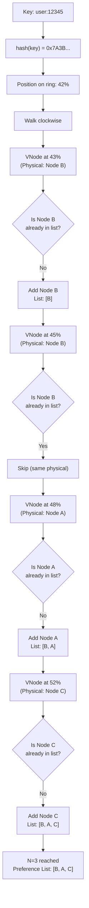
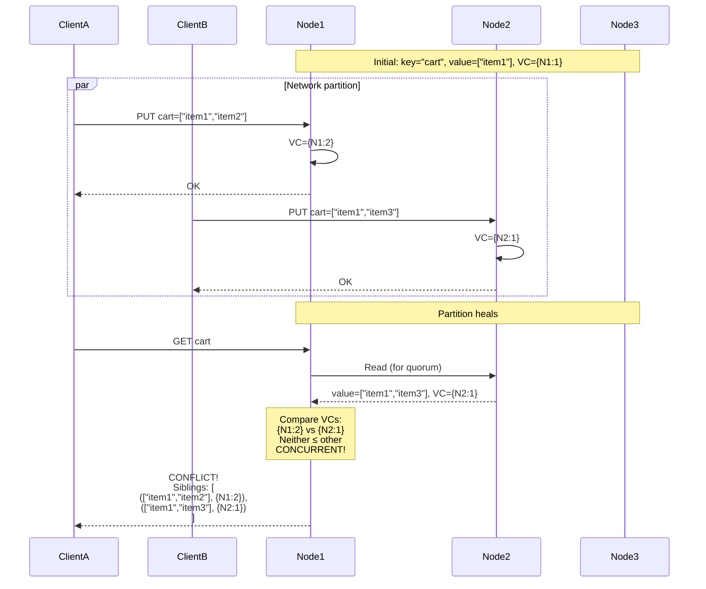
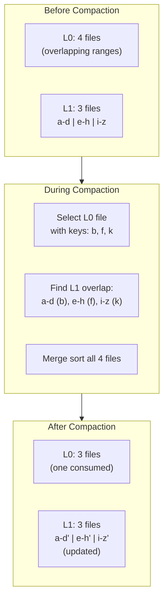
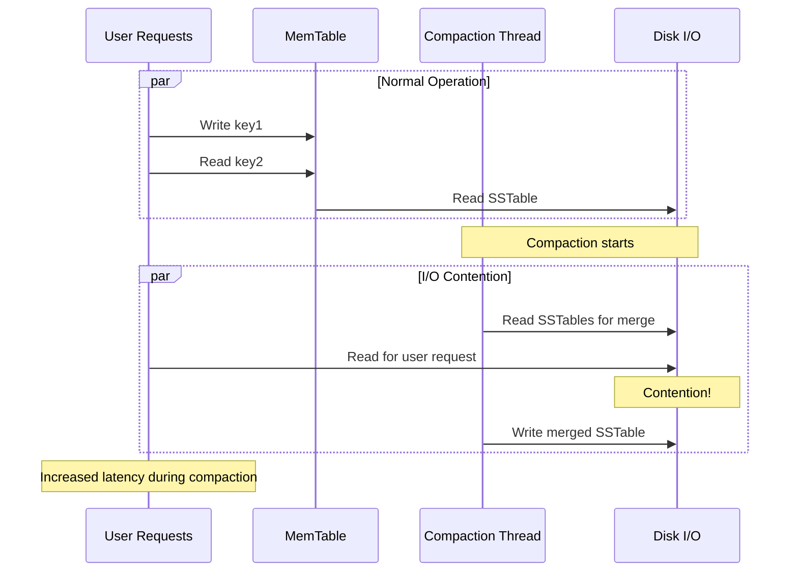
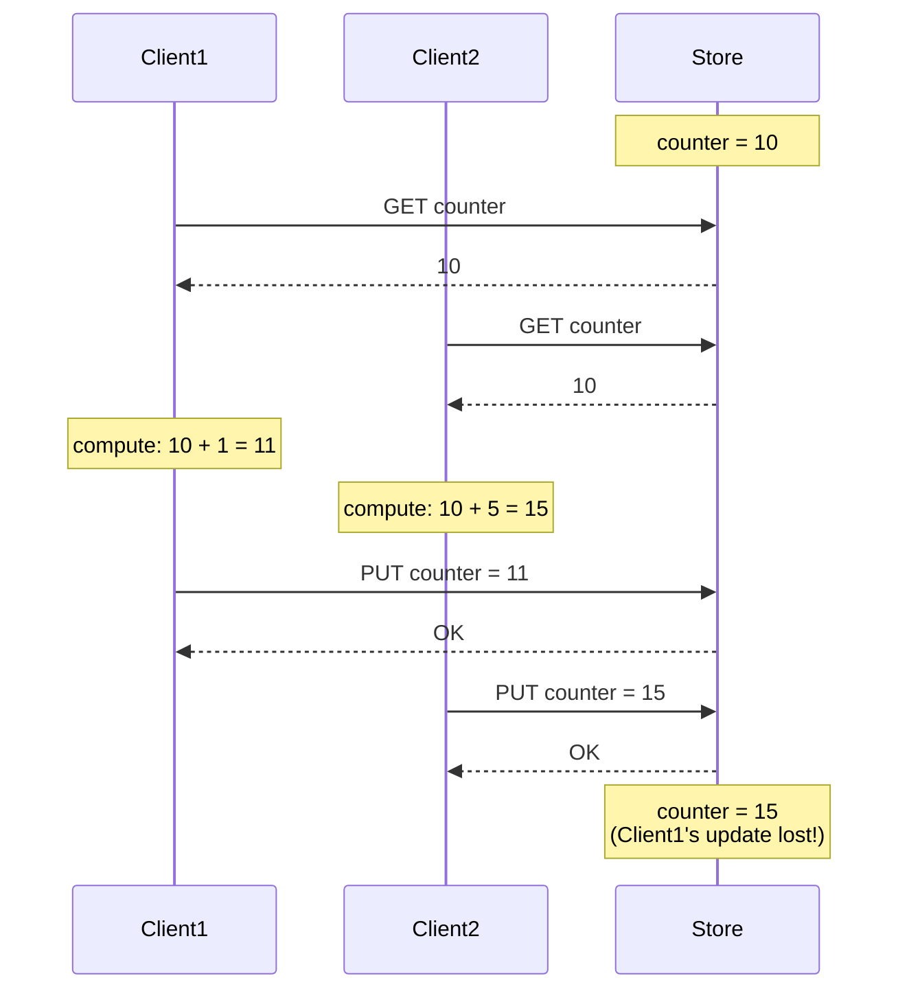

# Deep Dive & Bottlenecks

[← Back to Index](./00-index.md)

---

## Critical Component 1: Consistent Hashing with Virtual Nodes

### Why This Is Critical

Consistent hashing determines data placement across the cluster. Poor implementation leads to:
- Uneven data distribution (some nodes overloaded)
- Hot spots on certain partitions
- Excessive data movement during scaling

### Deep Dive: The Virtual Node Solution

**Problem with naive consistent hashing:**

```
3 physical nodes on a ring:
  Node A at position 0.25
  Node B at position 0.50
  Node C at position 0.85

Key ranges:
  Node A: 0.85 → 0.25 (40% of ring)
  Node B: 0.25 → 0.50 (25% of ring)
  Node C: 0.50 → 0.85 (35% of ring)

Result: Node A has 60% more data than Node B!
```

**Virtual nodes solution:**

```
Each physical node gets 128 virtual nodes (tokens):
  Node A: 128 random positions on ring
  Node B: 128 random positions on ring
  Node C: 128 random positions on ring

Statistical result with 384 total vnodes:
  Node A: ~33.3% ± 2% of data
  Node B: ~33.3% ± 2% of data
  Node C: ~33.3% ± 2% of data
```

### Preference List Construction



### Handling Node Addition/Removal

```
Before: Nodes [A, B, C] with 128 vnodes each (384 total)

Add Node D:
  1. D joins with 128 new vnodes
  2. Total vnodes: 512
  3. Each existing node gives up ~25% of keys
  4. Only keys in D's new ranges move

  Data movement:
    A loses ~32 vnodes worth → D
    B loses ~32 vnodes worth → D
    C loses ~32 vnodes worth → D

  Total data moved: ~25% (optimal for 3→4 node expansion)

Remove Node B:
  1. Remove B's 128 vnodes
  2. B's data redistributed to A and C
  3. A gains ~64 vnodes worth of B's data
  4. C gains ~64 vnodes worth of B's data

  Total data moved: ~33% (B's share)
```

### Failure Mode: Token Collision

```
Risk: Two vnodes hash to same token position

Mitigation:
  - Use large token space (2^64 or 2^128)
  - Collision probability: negligible (birthday paradox)
  - If collision: deterministic tiebreaker (node ID comparison)
```

---

## Critical Component 2: Vector Clocks and Conflict Resolution

### Why This Is Critical

In an AP system with multiple writers, conflicts are inevitable. Without proper conflict detection:
- Data silently lost (last-write-wins without detection)
- Inconsistent state across replicas
- User data corruption

### Conflict Scenario: Concurrent Writes



### Resolution Strategies

```
Strategy 1: Last-Write-Wins (LWW)
  Rule: Highest timestamp wins

  Concurrent writes:
    Write A: timestamp=1000, value="A"
    Write B: timestamp=1001, value="B"

  Result: value="B" (B wins, A is lost)

  Pros: Simple, no client involvement
  Cons: Data loss possible, clock skew issues

Strategy 2: Return Siblings to Client
  Rule: Return all concurrent versions

  Client receives:
    [
      {value: ["item1","item2"], clock: {N1:2}},
      {value: ["item1","item3"], clock: {N2:1}}
    ]

  Client merges:
    merged_cart = ["item1", "item2", "item3"]
    client.PUT(cart, merged_cart, merged_clock)

  Pros: No data loss, application-specific merge
  Cons: Client complexity, may get many siblings

Strategy 3: CRDTs (Conflict-free Replicated Data Types)
  Rule: Use mathematically mergeable data structures

  G-Set (Grow-only Set):
    Node1: {item1, item2}
    Node2: {item1, item3}
    Merge: {item1, item2, item3} (union)

  Pros: Automatic merge, no conflicts
  Cons: Limited data types, storage overhead
```

### Vector Clock Optimization: Dotted Version Vectors

```
Problem with basic vector clocks:
  - Clocks grow unbounded as more nodes participate
  - Old node entries never removed

Dotted Version Vectors solution:
  - Track only "dots" (individual update events)
  - Prune old entries safely

  DVV = {
    dots: [(N1, 5), (N2, 3)],  // Most recent dot per node
    clock: {N1: 5, N2: 3}      // Traditional vector clock
  }

  Pruning rule: Can remove entries for nodes no longer in cluster
```

---

## Critical Component 3: LSM Tree Compaction

### Why This Is Critical

Without compaction:
- Read performance degrades (must check many SSTables)
- Storage bloats with obsolete versions and tombstones
- Eventually: system becomes unusable

### Compaction Deep Dive



### Write Amplification Analysis

```
Write amplification = Total bytes written to disk / Bytes written by user

Leveled compaction WA:
  - L0 → L1: Data written once
  - L1 → L2: Each L1 byte rewritten up to 10x (due to L2 overlap)
  - L2 → L3: Each L2 byte rewritten up to 10x
  - ...

  Total WA ≈ 10 * number_of_levels ≈ 10-30x

  Example: User writes 1 GB
    Actual disk writes: 10-30 GB
    Impact: SSD wear, I/O bandwidth

Size-tiered compaction WA:
  - Similar-sized files merged
  - Each file rewritten log(total_size/file_size) times

  Total WA ≈ 10-20x (typically lower than leveled)
```

### Compaction Bottleneck: I/O Contention



**Mitigations:**
- Rate limit compaction I/O
- Use separate I/O queues (priority for user requests)
- Schedule compaction during off-peak hours
- Use faster storage (NVMe vs SATA SSD)

---

## Bottleneck Analysis

### Bottleneck 1: Hot Partitions

**Problem:**
```
Popular key (e.g., celebrity profile) overwhelms single partition

Traffic pattern:
  Normal key: 100 requests/sec
  Hot key: 100,000 requests/sec

Result:
  - Single node overloaded
  - Increased latency
  - Potential node failure
```

**Mitigations:**

| Strategy | Description | Trade-off |
|----------|-------------|-----------|
| Read replicas | Spread reads across all N replicas | Stale reads possible |
| Local caching | Cache hot keys at application layer | Cache invalidation complexity |
| Key splitting | Split hot key into subkeys | Application logic changes |
| Request coalescing | Batch identical concurrent requests | Implementation complexity |

```
Key splitting example:
  Original: GET celebrity:123:profile

  Split approach:
    GET celebrity:123:profile:shard_{random(0,9)}

  10 subkeys distributed across 10 partitions
  Coordinator merges results (or values are identical)
```

### Bottleneck 2: Replication Lag

**Problem:**
```
Async replication causes temporary inconsistency

Timeline:
  T0: Client writes to Node A
  T1: Node A acks to client
  T2: Client reads from Node B (hasn't received T0 write yet)
  T3: Node B returns stale data
  T4: Replication reaches Node B

  Client sees stale data between T1 and T4
```

**Mitigations:**

| Strategy | Description | Trade-off |
|----------|-------------|-----------|
| QUORUM consistency | Require R+W > N | Higher latency |
| Sticky sessions | Route user to same replica | Less load balancing |
| Read-your-writes | Track client's write version | Client complexity |
| Synchronous replication | Wait for all replicas | Much higher latency |

```
Read-your-writes implementation:

  Client writes:
    response = PUT(key, value)
    client.last_write_version[key] = response.version

  Client reads:
    request = GET(key, min_version=client.last_write_version[key])
    // Server blocks until replica has this version
```

### Bottleneck 3: Tombstone Accumulation

**Problem:**
```
Deletes create tombstones, not immediate removal

Why tombstones needed:
  - Without tombstone, deleted key might "resurrect"
  - Old replica doesn't know key was deleted
  - Anti-entropy could restore deleted data

Tombstone accumulation:
  - Heavy delete workload
  - Tombstones pile up
  - Read performance degrades (must scan tombstones)
  - Storage wasted
```

**Mitigations:**

| Strategy | Description | Trade-off |
|----------|-------------|-----------|
| Tombstone TTL | Remove tombstones after gc_grace_seconds | Risk of resurrection if too short |
| Compaction priority | Prioritize compaction of tombstone-heavy ranges | I/O overhead |
| Soft deletes | Mark deleted vs. hard delete | Application complexity |
| TTL-based data | Use TTL instead of explicit deletes | Not always applicable |

```
Tombstone resurrection scenario:

  gc_grace_seconds = 10 days

  Day 0: Key K created, replicated to A, B, C
  Day 1: Key K deleted on A, B (C offline)
  Day 5: Compaction removes tombstone (< gc_grace)  // TOO EARLY!
  Day 6: Node C comes back online
  Day 7: Anti-entropy: C thinks K exists, "repairs" to A, B

  Result: Deleted key K resurrected!

  Prevention: gc_grace_seconds > max_node_downtime
```

### Bottleneck 4: Network Partitions

**Problem:**
```
Network split creates isolated groups

Partition scenario:
  DC1: Nodes A, B (can communicate)
  DC2: Node C (isolated)

  AP behavior (Dynamo):
    - Both partitions continue serving
    - Writes accepted on both sides
    - Conflicts accumulate

  CP behavior (Raft):
    - DC1 has majority (2/3), continues serving
    - DC2 has minority (1/3), stops accepting writes
    - Availability reduced but consistency maintained
```

**Mitigations:**

| Strategy | Description | Trade-off |
|----------|-------------|-----------|
| Sloppy quorum | Write to any available nodes | More conflicts to resolve |
| Hinted handoff | Store writes for unavailable nodes | Storage overhead |
| Read repair | Fix inconsistencies on read | Read latency |
| Anti-entropy | Background consistency checks | Network/CPU overhead |

---

## Concurrency Issues

### Issue 1: Read-Modify-Write Race



**Solutions:**

```
Solution 1: Compare-and-Swap (CAS)
  Client1: CAS(counter, expected=10, new=11)  // Succeeds
  Client2: CAS(counter, expected=10, new=15)  // FAILS (current is 11)
  Client2: Retry with current value

Solution 2: Optimistic Locking with Version
  Client1: PUT(counter, 11, expected_version=1)  // Succeeds, version=2
  Client2: PUT(counter, 15, expected_version=1)  // FAILS
  Client2: Re-read, retry

Solution 3: CRDT Counter
  Use G-Counter or PN-Counter
  Each node maintains local counter
  Merge = sum of all nodes
  No conflicts possible
```

### Issue 2: Stale Coordinator

```
Scenario:
  - Client's cached topology is outdated
  - Key K moved from Node A to Node B
  - Client sends request to Node A

Handling:
  Node A detects it's not coordinator for K
  Node A forwards request to correct node (Node B)
  Node A returns response with "topology updated" hint
  Client updates its cached topology
```

---

## Performance Characteristics

### Operation Latencies

| Operation | Best Case | Typical | Worst Case |
|-----------|-----------|---------|------------|
| GET (cache hit) | < 1ms | 1-2ms | 5ms |
| GET (cache miss, bloom hit) | 2-5ms | 5-10ms | 20ms |
| GET (bloom miss, must check) | 5-10ms | 10-20ms | 50ms |
| PUT (async) | 1-2ms | 2-5ms | 10ms |
| PUT (quorum) | 5-10ms | 10-20ms | 50ms |
| PUT (all) | 20-50ms | 50-100ms | 200ms |
| DELETE | Same as PUT | Same as PUT | Same as PUT |

### Read Amplification by Level

```
Level 0: Up to 4 files (overlapping)
  Worst case: Check all 4 bloom filters, possibly 4 disk reads

Level 1+: 1 file per level (non-overlapping)
  Binary search to find correct file, 1 bloom filter, 1 disk read

Total read amplification (worst case):
  4 (L0) + 1 (L1) + 1 (L2) + 1 (L3) + 1 (L4) = 8 disk reads
  With bloom filters (99% accuracy): ~1.04 disk reads on average
```

---

## Summary: Critical Components and Bottlenecks

| Component | Critical Because | Main Bottleneck | Mitigation |
|-----------|-----------------|-----------------|------------|
| Consistent Hashing | Data distribution | Hot partitions | Virtual nodes, splitting |
| Vector Clocks | Conflict detection | Clock size growth | Pruning, dotted version vectors |
| LSM Compaction | Read performance | I/O contention | Rate limiting, scheduling |
| Replication | Durability | Lag | Quorum, read-your-writes |
| Tombstones | Correctness | Accumulation | TTL, compaction priority |
