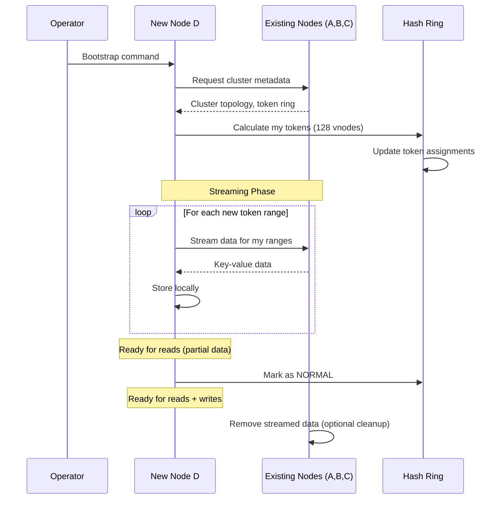
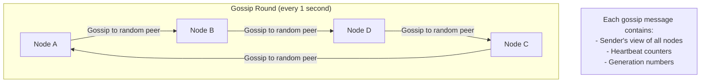
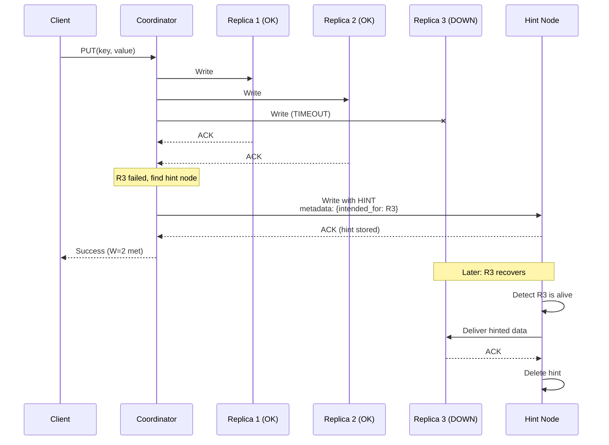
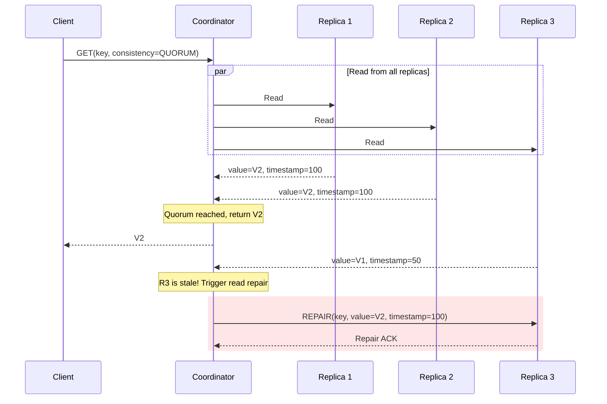
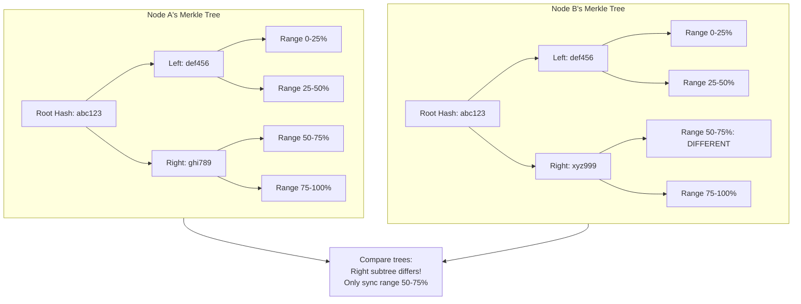
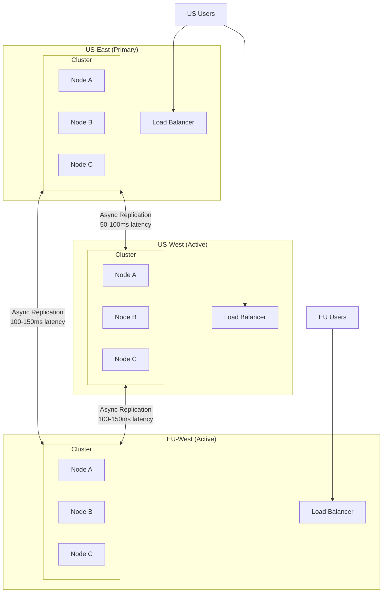

# Scalability & Reliability

[← Back to Index](./00-index.md)

---

## Horizontal Scaling

### Adding Nodes to the Cluster



### Data Movement During Scaling

```
Before: 3 nodes, each owns ~33% of data

After adding Node D:
  - Node D gets 128 virtual nodes
  - Each existing node gives up ~8% of their data
  - Total data moved: ~25% of cluster

Calculation:
  Original nodes: A, B, C (33% each)
  New distribution: A, B, C, D (25% each)
  Each of A, B, C loses: 33% - 25% = 8%
  Total moved: 3 * 8% = 24%

Streaming rate consideration:
  - Cluster data: 100 TB
  - Data to move: 25 TB
  - Network: 10 Gbps per node
  - Estimated time: 25 TB / (10 Gbps * 3 nodes) ≈ 2 hours
```

### Removing Nodes from the Cluster

```
Graceful removal (decommission):
  1. Mark node as LEAVING
  2. Node streams its data to remaining nodes
  3. Data redistributed based on new token ownership
  4. Node removed from ring
  5. Total data moved: ~33% (departing node's share)

Forced removal (node failure):
  1. Failure detected via gossip
  2. Node marked as DOWN
  3. Remaining replicas serve requests
  4. Hinted handoffs delivered when replacement added
  5. Anti-entropy repairs any missing data
```

### Auto-Scaling Policies

```yaml
Auto-scaling configuration:

  scale_up:
    triggers:
      - metric: cpu_utilization
        threshold: 70%
        duration: 5m
      - metric: disk_utilization
        threshold: 80%
        duration: 10m
      - metric: request_latency_p99
        threshold: 50ms
        duration: 5m

    action:
      add_nodes: 2
      cooldown: 30m

  scale_down:
    triggers:
      - metric: cpu_utilization
        threshold: 20%
        duration: 30m
      - metric: disk_utilization
        threshold: 30%
        duration: 1h

    action:
      remove_nodes: 1
      cooldown: 1h
      min_nodes: 3  # Never go below RF
```

---

## Vertical Scaling

### When to Scale Vertically

| Scenario | Vertical | Horizontal | Recommendation |
|----------|----------|------------|----------------|
| Memory pressure (MemTable, bloom filters) | Yes | Costly | Vertical first |
| CPU-bound (compaction, encryption) | Maybe | Yes | Horizontal preferred |
| Disk I/O bound | Faster disks | Yes | Depends on workload |
| Network bound | Limited | Yes | Horizontal |

### Vertical Scaling Limits

```
Memory:
  - MemTable: Larger MemTable = less frequent flushes
  - Bloom filters: More memory = lower false positive rate
  - Block cache: More cache = faster reads
  - Practical limit: 512 GB - 1 TB per node

CPU:
  - Compaction threads: More cores = faster compaction
  - Request handling: More cores = higher throughput
  - Practical limit: 64-128 cores per node

Storage:
  - Capacity: More disks = more data per node
  - IOPS: NVMe > SATA SSD > HDD
  - Practical limit: 10-20 TB per node (operational complexity)
```

---

## Reliability & Fault Tolerance

### Failure Detection

**Gossip Protocol (Dynamo-style):**



**Failure Detection Algorithm:**

```
STRUCT NodeState:
    heartbeat: int           // Incrementing counter
    generation: int          // Incremented on restart
    last_updated: timestamp  // When we last heard

PHI_THRESHOLD = 8  // Accrual failure detector threshold

FUNCTION is_node_alive(node):
    state = node_states[node]
    time_since_update = now() - state.last_updated

    // Accrual failure detector
    phi = -log10(probability_alive(time_since_update))

    IF phi > PHI_THRESHOLD:
        RETURN false  // Considered dead
    ELSE:
        RETURN true   // Still alive

FUNCTION on_gossip_received(from_node, their_view):
    FOR (node, their_state) IN their_view:
        our_state = node_states[node]

        IF their_state.generation > our_state.generation:
            // Node restarted, accept their view
            node_states[node] = their_state
        ELSE IF their_state.generation == our_state.generation:
            IF their_state.heartbeat > our_state.heartbeat:
                // More recent heartbeat
                our_state.heartbeat = their_state.heartbeat
                our_state.last_updated = now()
```

### Hinted Handoff



**Hint Storage:**

```
STRUCT Hint:
    target_node: NodeId
    key: bytes
    value: bytes
    timestamp: int64
    vector_clock: bytes
    ttl: int32  // How long to keep hint (e.g., 3 hours)

Hint storage on hint node:
    hints/
      {target_node_id}/
        {timestamp}_{key_hash}.hint

On target recovery:
    1. Detect via gossip that target is alive
    2. Stream all hints for that target
    3. Delete successfully delivered hints
```

### Read Repair



### Anti-Entropy with Merkle Trees



**Anti-Entropy Process:**

```
FUNCTION anti_entropy_repair(node_a, node_b, key_range):
    // Build Merkle trees for the key range
    tree_a = build_merkle_tree(node_a, key_range)
    tree_b = build_merkle_tree(node_b, key_range)

    // Find differing ranges
    diff_ranges = compare_merkle_trees(tree_a, tree_b)

    // For each differing range, exchange keys
    FOR range IN diff_ranges:
        keys_a = node_a.get_keys_in_range(range)
        keys_b = node_b.get_keys_in_range(range)

        // Send missing/newer keys to other node
        FOR key IN keys_a:
            IF key NOT IN keys_b OR keys_a[key].timestamp > keys_b[key].timestamp:
                node_b.repair(key, keys_a[key])

        FOR key IN keys_b:
            IF key NOT IN keys_a OR keys_b[key].timestamp > keys_a[key].timestamp:
                node_a.repair(key, keys_b[key])
```

---

## Multi-Region Deployment

### Active-Active Configuration



### Consistency Levels for Multi-DC

| Level | Behavior | Latency | Consistency |
|-------|----------|---------|-------------|
| LOCAL_ONE | 1 node in local DC | Lowest | Eventual |
| LOCAL_QUORUM | Majority in local DC | Low | Strong within DC |
| QUORUM | Majority across all DCs | High | Strong globally |
| EACH_QUORUM | Majority in each DC | Highest | Strong everywhere |
| ALL | Every node everywhere | Extreme | Perfect |

### Conflict Resolution in Multi-DC

```
Scenario: User updates profile in US-East and EU simultaneously

US-East write:
  key: user:123:profile
  value: {name: "John", location: "NYC"}
  vector_clock: {US-E: 1}

EU write (concurrent):
  key: user:123:profile
  value: {name: "John", location: "London"}
  vector_clock: {EU: 1}

After replication converges:
  Both DCs see:
    - {name: "John", location: "NYC"}, VC: {US-E: 1}
    - {name: "John", location: "London"}, VC: {EU: 1}

  These are CONCURRENT (neither VC dominates)

Resolution options:
  1. LWW: Use timestamps, one wins
  2. Siblings: Return both to application
  3. CRDT: If using LWW-Register, latest timestamp wins
```

---

## Disaster Recovery

### RTO and RPO Targets

| Scenario | RPO | RTO | Strategy |
|----------|-----|-----|----------|
| Single node failure | 0 | 0 | Replication handles automatically |
| Rack failure | 0 | < 1 min | Rack-aware replica placement |
| Datacenter failure | < 1 min | < 5 min | Multi-DC replication |
| Region failure | < 5 min | < 30 min | Cross-region replication |
| Data corruption | Varies | Varies | Point-in-time backup restore |

### Backup Strategies

```
Strategy 1: SSTable Snapshots
  - Hard-link SSTables at point-in-time
  - Zero-copy, instant snapshot
  - Restore: Copy snapshots back

Strategy 2: Incremental Backup
  - Back up new SSTables since last backup
  - Reduces backup size and time
  - Restore: Apply base + incrementals

Strategy 3: Streaming to Object Storage
  - Stream SSTables to blob storage
  - Cross-region for disaster recovery
  - Restore: Download and rebuild

Backup frequency:
  - Full backup: Weekly
  - Incremental: Daily or hourly
  - WAL archiving: Continuous (for PITR)
```

### Recovery Procedures

```
Node Recovery (Single Node Failure):
  1. Replace failed hardware (or spin up new instance)
  2. Join cluster with same node ID
  3. Stream data from replicas
  4. Receive hinted handoffs
  5. Anti-entropy repair for any gaps

Cluster Recovery (Datacenter Failure):
  1. Redirect traffic to surviving DCs
  2. Provision new DC infrastructure
  3. Bootstrap new cluster
  4. Stream data from surviving DCs
  5. Verify data consistency
  6. Re-enable traffic to recovered DC

Data Corruption Recovery:
  1. Identify corrupted data range
  2. Stop writes to affected partitions
  3. Restore from backup (point-in-time if needed)
  4. Repair any gap between backup and corruption
  5. Resume normal operations
```

---

## Capacity Planning

### Growth Projections

```
Year 1 baseline:
  Users: 250M
  Keys: 12.5B
  Storage: 38 TB
  Peak QPS: 280K

Growth model (20% annual user growth):
  Year 2: 300M users, 15B keys, 46 TB, 336K QPS
  Year 3: 360M users, 18B keys, 55 TB, 403K QPS
  Year 5: 518M users, 26B keys, 80 TB, 580K QPS

Infrastructure scaling:
  Year 1: 24 nodes
  Year 2: 29 nodes (+5)
  Year 3: 35 nodes (+6)
  Year 5: 50 nodes (+15)
```

### Scaling Triggers

| Metric | Warning | Critical | Action |
|--------|---------|----------|--------|
| CPU utilization | > 60% | > 80% | Add nodes |
| Disk utilization | > 70% | > 85% | Add nodes or storage |
| Memory pressure | > 70% | > 85% | Add memory or nodes |
| Compaction pending | > 50 GB | > 100 GB | Add nodes, tune compaction |
| Read latency p99 | > 20ms | > 50ms | Add read replicas, cache |
| Write latency p99 | > 30ms | > 100ms | Add nodes |

---

## Summary: Reliability Mechanisms

| Mechanism | Purpose | Trigger | Impact |
|-----------|---------|---------|--------|
| **Replication** | Durability | Every write | Storage overhead (RF x) |
| **Quorum** | Consistency | Every read/write | Latency overhead |
| **Hinted Handoff** | Availability | Node failure | Temporary storage |
| **Read Repair** | Consistency | Inconsistent read | Background I/O |
| **Anti-Entropy** | Consistency | Scheduled | Background I/O |
| **Gossip** | Failure detection | Continuous | Network overhead |
| **Snapshots** | Disaster recovery | Scheduled | Storage overhead |
