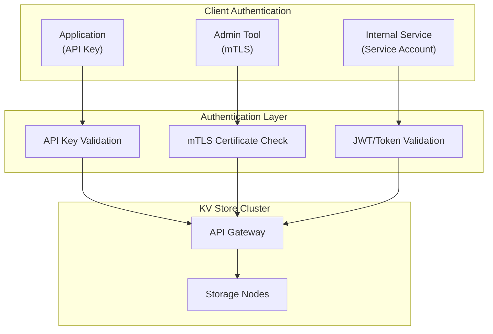
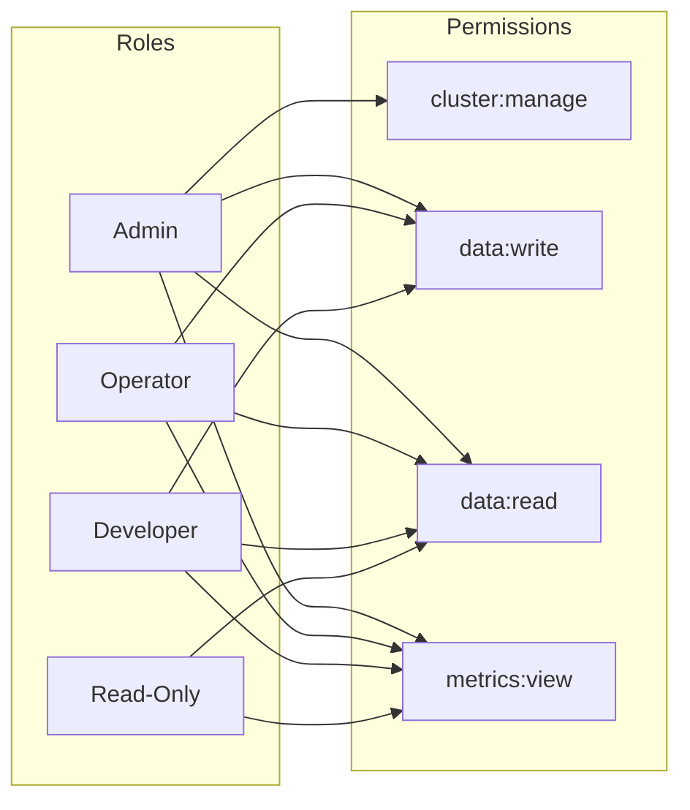
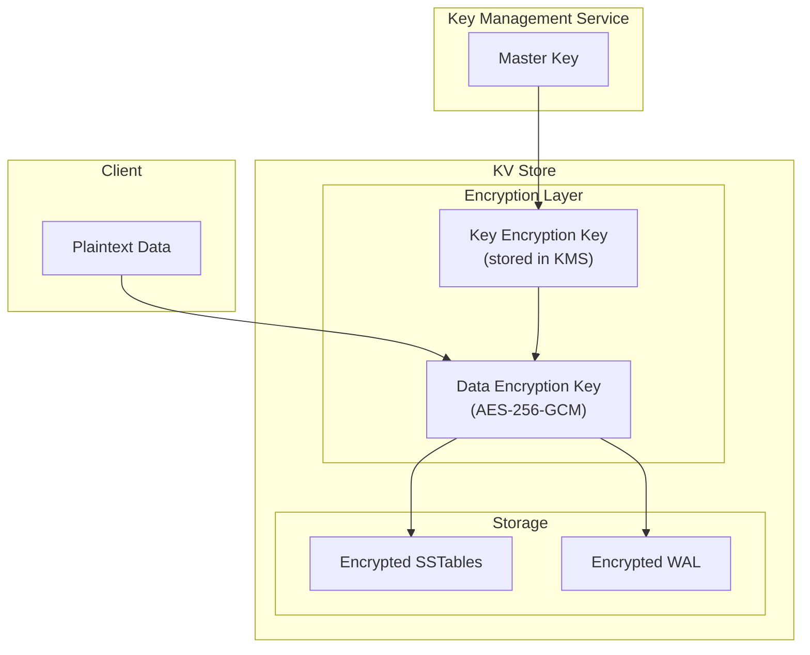
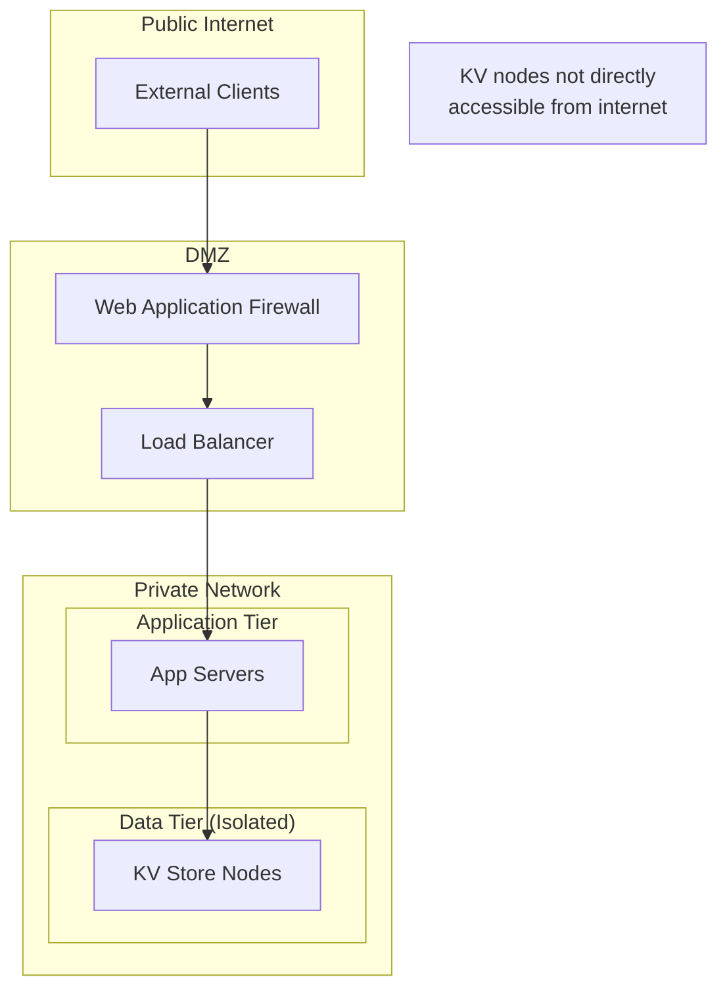

# Security & Compliance

[← Back to Index](./00-index.md)

---

## Authentication & Authorization

### Authentication Mechanisms



### Authentication Options

| Method | Use Case | Security Level | Complexity |
|--------|----------|----------------|------------|
| **API Keys** | External applications | Medium | Low |
| **mTLS** | Service-to-service | High | Medium |
| **JWT/OAuth2** | User-facing apps | Medium-High | Medium |
| **SAML** | Enterprise SSO | High | High |
| **IAM Roles** | Cloud-native apps | High | Medium |

### API Key Structure

```
Format: kv_{environment}_{key_type}_{random}

Examples:
  kv_prod_rw_a1b2c3d4e5f6g7h8    # Production, read-write
  kv_prod_ro_i9j0k1l2m3n4o5p6    # Production, read-only
  kv_dev_rw_q7r8s9t0u1v2w3x4     # Development, read-write

Metadata stored:
  {
    "key_id": "kv_prod_rw_a1b2c3d4e5f6g7h8",
    "key_hash": "sha256(key)",
    "owner": "user@company.com",
    "permissions": ["read", "write"],
    "namespaces": ["users", "sessions"],
    "rate_limit": 10000,
    "created_at": "2025-01-01T00:00:00Z",
    "expires_at": "2026-01-01T00:00:00Z"
  }
```

### Authorization Model

**Role-Based Access Control (RBAC):**



**Namespace-Level ACLs:**

```yaml
# Example ACL configuration
acls:
  - principal: "service:user-service"
    namespaces: ["users/*"]
    permissions: ["read", "write"]

  - principal: "service:analytics"
    namespaces: ["users/*", "events/*"]
    permissions: ["read"]

  - principal: "role:admin"
    namespaces: ["*"]
    permissions: ["read", "write", "delete", "admin"]

  - principal: "user:alice@company.com"
    namespaces: ["dev/*"]
    permissions: ["read", "write"]
```

### Fine-Grained Authorization

```
Authorization check flow:

1. Extract principal from request (API key, token, certificate)
2. Look up principal's roles and permissions
3. Check namespace access:
   - Exact match: "users:123" matches "users:123"
   - Wildcard: "users:*" matches "users:123", "users:456"
   - Hierarchical: "users:123:*" matches "users:123:profile"
4. Check operation permission (read, write, delete)
5. Allow or deny

Pseudocode:
  FUNCTION authorize(principal, namespace, operation):
      roles = get_roles(principal)
      FOR role IN roles:
          FOR acl IN role.acls:
              IF matches(acl.namespace_pattern, namespace):
                  IF operation IN acl.permissions:
                      RETURN ALLOW
      RETURN DENY
```

---

## Data Encryption

### Encryption at Rest



**Encryption Scheme:**

```
Encryption hierarchy:
  Master Key (KMS)
    └── Key Encryption Key (KEK) per cluster
        └── Data Encryption Key (DEK) per SSTable/WAL

Algorithm: AES-256-GCM (authenticated encryption)

SSTable encryption:
  - Each SSTable has unique DEK
  - DEK encrypted with KEK, stored in SSTable footer
  - Block-level encryption (4KB blocks)

Key rotation:
  - KEK rotation: Quarterly
  - DEK rotation: On each new SSTable
  - Old keys retained for decryption of existing data
```

### Encryption in Transit

```yaml
TLS Configuration:
  protocol: TLS 1.3
  cipher_suites:
    - TLS_AES_256_GCM_SHA384
    - TLS_CHACHA20_POLY1305_SHA256
  certificate:
    type: X.509
    validity: 90 days
    auto_renewal: true

Client-to-server:
  - TLS required for all connections
  - Certificate validation enabled
  - SNI (Server Name Indication) supported

Node-to-node (gossip, replication):
  - mTLS required
  - Certificates issued by internal CA
  - Certificate rotation automated
```

### Field-Level Encryption (Optional)

```
For highly sensitive data:

Client-side encryption:
  1. Client encrypts value before PUT
  2. KV store sees only ciphertext
  3. Client decrypts after GET

  Pros: True zero-knowledge, server never sees plaintext
  Cons: No server-side operations on encrypted fields

Server-side field encryption:
  1. Specify fields to encrypt in schema
  2. Server encrypts before storage
  3. Server decrypts on retrieval

  Pros: Easier client implementation
  Cons: Server has access to keys
```

---

## Threat Model

### Top Security Threats

| Threat | Attack Vector | Impact | Likelihood | Mitigation |
|--------|---------------|--------|------------|------------|
| **Unauthorized Access** | Stolen credentials | Data breach | High | MFA, key rotation, IP allowlisting |
| **Data Exfiltration** | Compromised insider | Data breach | Medium | Audit logging, least privilege, encryption |
| **Injection Attacks** | Malformed keys/values | System compromise | Low | Input validation, sandboxing |
| **DoS/DDoS** | Request flooding | Service outage | High | Rate limiting, auto-scaling |
| **Man-in-the-Middle** | Network interception | Data interception | Medium | TLS, mTLS, certificate pinning |
| **Data Tampering** | Compromised node | Data corruption | Low | Checksums, replication verification |

### Threat Mitigation Details

**Credential Theft:**

```
Mitigations:
  1. Short-lived tokens (< 1 hour)
  2. Regular key rotation (90 days max)
  3. IP allowlisting for API keys
  4. Anomaly detection on access patterns
  5. Separate keys per environment

Incident response:
  1. Detect: Anomalous access patterns
  2. Contain: Revoke compromised credentials immediately
  3. Investigate: Audit logs, access patterns
  4. Remediate: Rotate all potentially affected keys
```

**Insider Threat:**

```
Mitigations:
  1. Principle of least privilege
  2. Segregation of duties (no single admin can access all data)
  3. Comprehensive audit logging
  4. Background checks for privileged roles
  5. Just-in-time access for sensitive operations

Detection:
  - Monitor bulk data exports
  - Alert on unusual access times
  - Track access to sensitive namespaces
```

**DDoS Protection:**

```
Layers of protection:

Layer 1: Network (Infrastructure)
  - Cloud provider DDoS protection
  - BGP blackholing for volumetric attacks
  - Anycast distribution

Layer 2: Application (API Gateway)
  - Rate limiting per API key
  - Request validation
  - Slowloris protection (connection limits)

Layer 3: Data (Per-key)
  - Per-key rate limits
  - Hot key detection and throttling
  - Request coalescing

Configuration example:
  rate_limits:
    global: 1000000 req/sec
    per_api_key: 10000 req/sec
    per_ip: 1000 req/sec
    per_key: 100 req/sec
```

---

## Audit Logging

### What to Log

```yaml
Audit events:

  authentication:
    - successful_login
    - failed_login
    - token_issued
    - token_revoked

  authorization:
    - access_granted
    - access_denied
    - permission_changed

  data_access:
    - key_read
    - key_written
    - key_deleted
    - batch_operation

  admin_operations:
    - cluster_config_changed
    - node_added
    - node_removed
    - user_created
    - role_assigned
    - acl_modified
```

### Audit Log Format

```json
{
  "timestamp": "2025-01-20T12:00:00.000Z",
  "event_id": "evt_a1b2c3d4",
  "event_type": "data_access.key_written",
  "principal": {
    "type": "api_key",
    "id": "kv_prod_rw_a1b2c3d4",
    "owner": "user-service"
  },
  "resource": {
    "type": "key",
    "namespace": "users",
    "key": "user:12345:profile"
  },
  "action": "write",
  "outcome": "success",
  "metadata": {
    "source_ip": "10.0.1.50",
    "user_agent": "kv-client/1.0",
    "consistency_level": "quorum",
    "latency_ms": 5
  }
}
```

### Log Retention

| Log Type | Retention | Storage | Access |
|----------|-----------|---------|--------|
| Authentication | 2 years | Cold storage | Security team |
| Authorization | 1 year | Warm storage | Security team |
| Data access | 90 days | Hot storage | Compliance team |
| Admin operations | 7 years | Archive | Legal, Compliance |

---

## Compliance

### GDPR Compliance

| Requirement | Implementation |
|-------------|----------------|
| **Right to Access** | Export API for user's data |
| **Right to Deletion** | Hard delete with cryptographic erasure |
| **Data Minimization** | TTL policies, no unnecessary data |
| **Consent** | Application-level (not KV store concern) |
| **Data Portability** | Standard export formats (JSON) |
| **Breach Notification** | Audit logs + alerting pipeline |

**Cryptographic Erasure:**

```
For GDPR deletion:
  1. Delete user's data keys
  2. Delete user's DEK
  3. Without DEK, any remaining encrypted fragments are unreadable
  4. Compaction will physically remove data over time
```

### SOC 2 Type II

| Control | Implementation |
|---------|----------------|
| **Access Control** | RBAC, MFA, least privilege |
| **Audit Logging** | Comprehensive audit trail |
| **Encryption** | At rest and in transit |
| **Availability** | Multi-DC, replication, DR |
| **Change Management** | CI/CD with approvals |
| **Incident Response** | Documented procedures, runbooks |

### HIPAA (for healthcare data)

| Safeguard | Implementation |
|-----------|----------------|
| **Access Controls** | Role-based, user authentication |
| **Audit Controls** | Detailed access logging |
| **Integrity** | Checksums, replication |
| **Transmission Security** | TLS 1.3 |
| **Encryption** | AES-256 at rest |
| **BAA** | Business Associate Agreement with provider |

---

## Network Security

### Network Architecture



### Firewall Rules

```yaml
Ingress rules (KV Store nodes):
  - source: app-tier-security-group
    port: 9042  # Client port
    protocol: TCP

  - source: kv-cluster-security-group
    port: 7000  # Inter-node
    port: 7001  # TLS inter-node
    protocol: TCP

  - source: monitoring-security-group
    port: 9090  # Metrics
    protocol: TCP

Egress rules:
  - destination: kv-cluster-security-group
    port: 7000, 7001
    protocol: TCP

  - destination: kms-endpoint
    port: 443
    protocol: TCP
```

---

## Security Best Practices

### Secure Defaults

```yaml
Default security configuration:
  authentication:
    required: true
    default_method: api_key

  authorization:
    default_policy: deny_all
    require_explicit_grant: true

  encryption:
    at_rest: enabled
    in_transit: required
    min_tls_version: 1.3

  network:
    public_access: disabled
    ip_allowlist: []  # Must be explicitly configured

  audit:
    logging: enabled
    retention_days: 90
```

### Security Checklist

| Category | Check | Status |
|----------|-------|--------|
| **Authentication** | API keys have expiration | Required |
| | MFA for admin access | Required |
| | Service accounts use short-lived tokens | Recommended |
| **Authorization** | Least privilege enforced | Required |
| | Regular access reviews | Required |
| | Namespace isolation | Recommended |
| **Encryption** | TLS 1.3 for all connections | Required |
| | Encryption at rest enabled | Required |
| | Key rotation automated | Required |
| **Audit** | All access logged | Required |
| | Logs sent to SIEM | Recommended |
| | Anomaly detection enabled | Recommended |
| **Network** | No public internet access | Required |
| | Inter-node traffic encrypted | Required |
| | Firewall rules minimized | Required |

---

## Summary

| Security Layer | Mechanism | Protection Against |
|----------------|-----------|-------------------|
| **Perimeter** | Firewall, WAF | Network attacks, DDoS |
| **Authentication** | API keys, mTLS, JWT | Unauthorized access |
| **Authorization** | RBAC, ACLs | Privilege escalation |
| **Transport** | TLS 1.3 | Eavesdropping, MITM |
| **Storage** | AES-256 encryption | Data theft at rest |
| **Audit** | Comprehensive logging | Forensics, compliance |
| **Operational** | Key rotation, patching | Long-term exposure |
