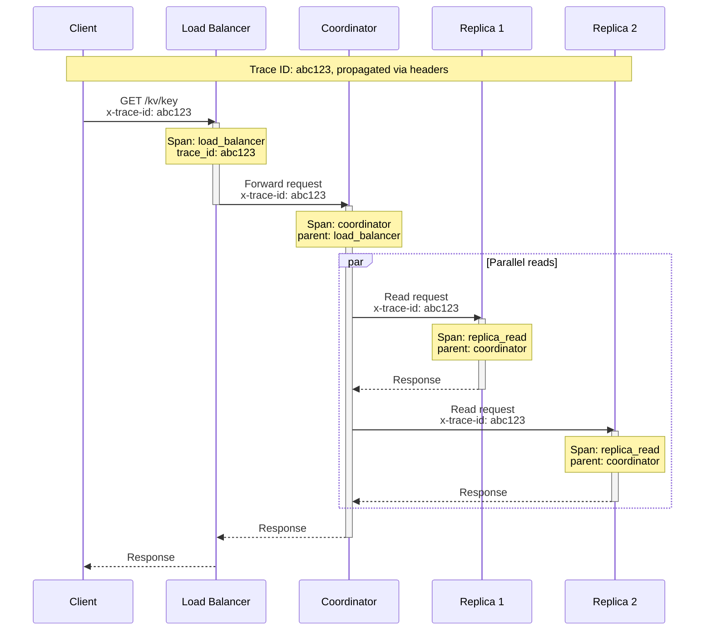

# Observability

[← Back to Index](./00-index.md)

---

## Metrics Framework

### USE Method (Resources)

**Utilization, Saturation, Errors for system resources:**

| Resource | Utilization | Saturation | Errors |
|----------|-------------|------------|--------|
| **CPU** | `cpu_utilization_percent` | `cpu_runqueue_length` | `cpu_errors_total` |
| **Memory** | `memory_used_bytes` | `memory_oom_events` | `memory_allocation_failures` |
| **Disk** | `disk_used_percent` | `disk_io_queue_depth` | `disk_io_errors_total` |
| **Network** | `network_bandwidth_used` | `network_socket_overflow` | `network_errors_total` |

### RED Method (Services)

**Rate, Errors, Duration for service requests:**

| Service | Rate | Errors | Duration |
|---------|------|--------|----------|
| **Read Operations** | `kv_read_requests_total` | `kv_read_errors_total` | `kv_read_latency_seconds` |
| **Write Operations** | `kv_write_requests_total` | `kv_write_errors_total` | `kv_write_latency_seconds` |
| **Delete Operations** | `kv_delete_requests_total` | `kv_delete_errors_total` | `kv_delete_latency_seconds` |
| **Replication** | `replication_events_total` | `replication_errors_total` | `replication_lag_seconds` |

---

## Key Metrics

### Client-Facing Metrics

```yaml
# Request metrics
kv_requests_total:
  type: counter
  labels: [operation, consistency_level, status]
  description: Total number of requests
  example: kv_requests_total{operation="read", consistency_level="quorum", status="success"}

kv_request_duration_seconds:
  type: histogram
  labels: [operation, consistency_level]
  buckets: [0.001, 0.005, 0.01, 0.025, 0.05, 0.1, 0.25, 0.5, 1.0]
  description: Request latency distribution
  example: kv_request_duration_seconds_bucket{operation="read", le="0.01"}

kv_request_size_bytes:
  type: histogram
  labels: [operation]
  buckets: [100, 500, 1000, 5000, 10000, 50000, 100000]
  description: Request/response size distribution

kv_concurrent_requests:
  type: gauge
  labels: [operation]
  description: Current number of in-flight requests
```

### Storage Metrics

```yaml
# MemTable metrics
memtable_size_bytes:
  type: gauge
  description: Current MemTable size

memtable_count:
  type: gauge
  labels: [state]  # active, immutable
  description: Number of MemTables

# SSTable metrics
sstable_count:
  type: gauge
  labels: [level]
  description: Number of SSTables per level

sstable_size_bytes:
  type: gauge
  labels: [level]
  description: Total size of SSTables per level

# Compaction metrics
compaction_pending_bytes:
  type: gauge
  description: Bytes pending compaction

compaction_completed_total:
  type: counter
  labels: [level]
  description: Completed compactions

compaction_duration_seconds:
  type: histogram
  labels: [level]
  description: Compaction duration

compaction_write_amplification:
  type: gauge
  description: Current write amplification ratio
```

### Bloom Filter Metrics

```yaml
bloom_filter_queries_total:
  type: counter
  labels: [result]  # positive, negative
  description: Bloom filter query results

bloom_filter_false_positives_total:
  type: counter
  description: False positives (bloom said yes, but key not found)

bloom_filter_effectiveness:
  type: gauge
  description: 1 - (false_positives / positive_queries)
```

### Replication Metrics

```yaml
replication_lag_seconds:
  type: gauge
  labels: [source_dc, target_dc]
  description: Replication lag between datacenters

hinted_handoff_pending:
  type: gauge
  labels: [target_node]
  description: Pending hints for each node

hinted_handoff_delivered_total:
  type: counter
  description: Successfully delivered hints

read_repair_total:
  type: counter
  labels: [result]  # repaired, already_consistent
  description: Read repair operations

anti_entropy_repairs_total:
  type: counter
  description: Keys repaired by anti-entropy
```

### Cluster Health Metrics

```yaml
cluster_node_count:
  type: gauge
  labels: [status]  # up, down, leaving, joining
  description: Number of nodes by status

gossip_messages_total:
  type: counter
  labels: [type]  # syn, ack, ack2
  description: Gossip protocol messages

node_availability:
  type: gauge
  labels: [node_id]
  description: Node availability (1 = up, 0 = down)

partition_balance:
  type: gauge
  description: Coefficient of variation of partition sizes (lower = better balance)
```

---

## Logging Strategy

### Log Levels

| Level | Use Case | Example |
|-------|----------|---------|
| **ERROR** | Failures requiring attention | Replication failure, disk error |
| **WARN** | Potential issues | High latency, compaction backlog |
| **INFO** | Normal operations | Node join/leave, compaction complete |
| **DEBUG** | Troubleshooting | Request routing, cache hits |
| **TRACE** | Deep debugging | Per-key operations, gossip details |

### Structured Log Format

```json
{
  "timestamp": "2025-01-20T12:00:00.000Z",
  "level": "INFO",
  "service": "kv-store",
  "node_id": "node-a-1",
  "component": "compaction",
  "message": "Compaction completed",
  "attributes": {
    "level": 1,
    "input_files": 4,
    "output_files": 2,
    "bytes_read": 104857600,
    "bytes_written": 52428800,
    "duration_ms": 5432,
    "keys_processed": 1000000,
    "tombstones_removed": 5000
  },
  "trace_id": "abc123def456"
}
```

### What to Log

```yaml
Always log (INFO):
  - Node lifecycle: start, stop, join, leave
  - Configuration changes
  - Compaction: start, complete, errors
  - Major events: snapshot created, backup completed

Log on occurrence (WARN):
  - Slow requests (> p99 threshold)
  - Compaction backlog building
  - Replication lag increasing
  - Node marked as suspect

Log on failure (ERROR):
  - Request failures
  - Replication failures
  - Disk errors
  - Out of memory

Sampling (DEBUG):
  - Individual request traces (1% sample)
  - Gossip round details (on-demand)
  - Cache operations (on-demand)
```

---

## Distributed Tracing

### Trace Propagation



### Key Spans to Instrument

```yaml
Client request:
  span: client_request
  attributes:
    - operation (read/write/delete)
    - key (hashed for privacy)
    - consistency_level
    - value_size_bytes

Coordinator:
  span: coordinator
  attributes:
    - partition_id
    - preference_list
    - quorum_reached

Replica operation:
  span: replica_operation
  attributes:
    - node_id
    - operation_type
    - from_cache (bool)
    - bloom_filter_checked (bool)

Storage engine:
  span: storage_read (or storage_write)
  attributes:
    - memtable_hit (bool)
    - sstable_level (if disk read)
    - bloom_filter_result
    - bytes_read

Compaction:
  span: compaction
  attributes:
    - level
    - input_size_bytes
    - output_size_bytes
```

---

## Alerting

### Critical Alerts (Page Immediately)

```yaml
alerts:
  - name: NodeDown
    condition: cluster_node_count{status="up"} < expected_nodes
    for: 1m
    severity: critical
    action: Page on-call

  - name: QuorumLost
    condition: cluster_node_count{status="up"} < (replication_factor / 2) + 1
    for: 30s
    severity: critical
    action: Page on-call + escalate

  - name: HighErrorRate
    condition: rate(kv_requests_total{status="error"}[5m]) / rate(kv_requests_total[5m]) > 0.01
    for: 2m
    severity: critical
    action: Page on-call

  - name: DiskFull
    condition: disk_used_percent > 90
    for: 5m
    severity: critical
    action: Page on-call
```

### Warning Alerts (Investigate Soon)

```yaml
alerts:
  - name: HighLatency
    condition: histogram_quantile(0.99, kv_request_duration_seconds_bucket{operation="read"}) > 0.05
    for: 5m
    severity: warning
    action: Create ticket

  - name: ReplicationLag
    condition: replication_lag_seconds > 10
    for: 5m
    severity: warning
    action: Create ticket

  - name: CompactionBacklog
    condition: compaction_pending_bytes > 10737418240  # 10 GB
    for: 15m
    severity: warning
    action: Create ticket

  - name: BloomFilterDegraded
    condition: bloom_filter_effectiveness < 0.95
    for: 30m
    severity: warning
    action: Create ticket

  - name: HintedHandoffGrowing
    condition: increase(hinted_handoff_pending[1h]) > 10000
    for: 30m
    severity: warning
    action: Create ticket

  - name: DiskNearFull
    condition: disk_used_percent > 75
    for: 30m
    severity: warning
    action: Create ticket
```

### Informational Alerts

```yaml
alerts:
  - name: NodeJoined
    condition: changes(cluster_node_count{status="up"}[5m]) > 0
    severity: info
    action: Log to Slack

  - name: CompactionCompleted
    condition: increase(compaction_completed_total[1h]) > 0
    severity: info
    action: Log only

  - name: SnapshotCreated
    condition: increase(snapshots_created_total[1h]) > 0
    severity: info
    action: Log only
```

---

## Dashboard Design

### Overview Dashboard

```
┌─────────────────────────────────────────────────────────────────────┐
│                    KV Store Cluster Overview                        │
├─────────────────────────────────────────────────────────────────────┤
│  Cluster Health     │  Request Rate        │  Error Rate            │
│  ┌─────────────┐    │  ┌─────────────┐     │  ┌─────────────┐       │
│  │   🟢 OK     │    │  │ 250K req/s  │     │  │  0.002%     │       │
│  │  24/24     │    │  │ ▃▅▇▆▄▃▅▆▇▅ │     │  │  ▁▁▁▂▁▁▁▁▁▁ │       │
│  │  nodes     │    │  └─────────────┘     │  └─────────────┘       │
│  └─────────────┘    │                      │                        │
├─────────────────────────────────────────────────────────────────────┤
│  Read Latency (p99)                  │  Write Latency (p99)         │
│  ┌───────────────────────────────┐   │  ┌───────────────────────┐   │
│  │  8.5 ms                       │   │  │  15.2 ms              │   │
│  │  ▃▄▃▃▄▅▄▃▄▃▅▄▃▄▃▄▃▄▃▄▃▄▃    │   │  │  ▄▅▄▄▅▆▅▄▅▄▆▅▄▅▄▅▄   │   │
│  │  Target: < 10ms               │   │  │  Target: < 25ms       │   │
│  └───────────────────────────────┘   │  └───────────────────────┘   │
├─────────────────────────────────────────────────────────────────────┤
│  Storage Utilization                 │  Compaction Status           │
│  ┌───────────────────────────────┐   │  ┌───────────────────────┐   │
│  │  Total: 38 TB / 50 TB (76%)   │   │  │  Pending: 2.5 GB      │   │
│  │  ████████████████░░░░░        │   │  │  Rate: 100 MB/s       │   │
│  │                               │   │  │  Active: 3 threads    │   │
│  └───────────────────────────────┘   │  └───────────────────────┘   │
└─────────────────────────────────────────────────────────────────────┘
```

### Node Detail Dashboard

```
┌─────────────────────────────────────────────────────────────────────┐
│                    Node: node-a-1                                   │
├─────────────────────────────────────────────────────────────────────┤
│  Status: 🟢 UP    │  Uptime: 45 days     │  Version: 3.11.4        │
├─────────────────────────────────────────────────────────────────────┤
│  Resource Utilization                                               │
│  ┌────────────────┐  ┌────────────────┐  ┌────────────────┐        │
│  │ CPU: 45%       │  │ Memory: 72 GB  │  │ Disk: 2.1 TB   │        │
│  │ ████████░░░░░░ │  │ ██████████░░░░ │  │ ████████░░░░░░ │        │
│  └────────────────┘  └────────────────┘  └────────────────┘        │
├─────────────────────────────────────────────────────────────────────┤
│  SSTable Distribution                                               │
│  L0: ████ (4 files, 256 MB)                                        │
│  L1: ██████████ (10 files, 500 MB)                                 │
│  L2: ████████████████████ (25 files, 5 GB)                         │
│  L3: ████████████████████████████████ (50 files, 50 GB)            │
├─────────────────────────────────────────────────────────────────────┤
│  Recent Operations                                                  │
│  • Compaction L1→L2 completed (2 min ago)                          │
│  • MemTable flushed (5 min ago)                                     │
│  • Read repair triggered (10 min ago)                               │
└─────────────────────────────────────────────────────────────────────┘
```

### Capacity Planning Dashboard

```
┌─────────────────────────────────────────────────────────────────────┐
│                    Capacity Planning                                │
├─────────────────────────────────────────────────────────────────────┤
│  Storage Growth (30 days)           │  QPS Trend (30 days)          │
│  ┌───────────────────────────────┐  │  ┌───────────────────────┐    │
│  │     Current: 38 TB            │  │  │    Peak: 280K         │    │
│  │     Projected: 42 TB          │  │  │    ▃▄▅▆▇▆▅▆▇█        │    │
│  │         ▁▂▃▄▅▆▇              │  │  │                       │    │
│  │  Days until 80%: 45           │  │  │  Growth: +5%/week     │    │
│  └───────────────────────────────┘  │  └───────────────────────┘    │
├─────────────────────────────────────────────────────────────────────┤
│  Recommendations:                                                   │
│  • Add 2 nodes within 30 days (storage-driven)                     │
│  • Consider upgrading to NVMe (compaction bottleneck detected)     │
│  • Review TTL policies (15% tombstones detected)                   │
└─────────────────────────────────────────────────────────────────────┘
```

---

## Runbooks

### Runbook: High Read Latency

```markdown
## Symptom
Read latency p99 > 50ms for more than 5 minutes

## Diagnosis Steps
1. Check bloom filter effectiveness
   - If < 90%: Bloom filters may need rebuilding or more memory
2. Check compaction status
   - If backlog > 10 GB: Compaction falling behind
3. Check L0 SSTable count
   - If > 8 files: L0 compaction needed urgently
4. Check hot keys
   - Look for keys with > 1000 req/s
5. Check disk I/O
   - If queue depth > 10: Disk saturated

## Resolution
- If bloom filter issue: Increase bloom_filter_fp_chance or rebuild
- If compaction backlog: Increase compaction throughput or add nodes
- If L0 pileup: Force L0 compaction, then investigate write rate
- If hot key: Add caching layer or split key
- If disk I/O: Move to faster storage or add nodes
```

### Runbook: Node Failure

```markdown
## Symptom
Node marked as DOWN in gossip

## Immediate Actions
1. Verify node is actually unreachable (not network partition)
2. Check if quorum is maintained
   - If < quorum: Escalate immediately
3. Verify hinted handoff is working
4. Monitor remaining nodes for increased load

## Recovery Steps
1. If hardware failure:
   - Replace hardware
   - Bootstrap new node with same token
   - Streaming will recover data
2. If software issue:
   - Check logs for crash reason
   - Restart if safe
   - If data corruption suspected, rebuild from replicas

## Post-Incident
- Review why failure detection took X minutes
- Verify data consistency after recovery
- Update capacity if near threshold
```

---

## Summary: Observability Layers

| Layer | Focus | Key Metrics | Alert Threshold |
|-------|-------|-------------|-----------------|
| **User Experience** | Latency, errors | p99 latency, error rate | > 50ms, > 1% |
| **Service Health** | Throughput, availability | QPS, node count | Trending down, < RF |
| **Resource Usage** | CPU, memory, disk | Utilization % | > 80% sustained |
| **Storage Engine** | Compaction, LSM | Pending bytes, L0 count | > 10GB, > 8 files |
| **Replication** | Lag, consistency | Lag seconds, repairs | > 10s, spike |
| **Cluster** | Membership, gossip | Node status, messages | Any node down |
