# High-Level Design

[← Back to Index](./00-index.md)

---

## System Architecture

### Overview Diagram

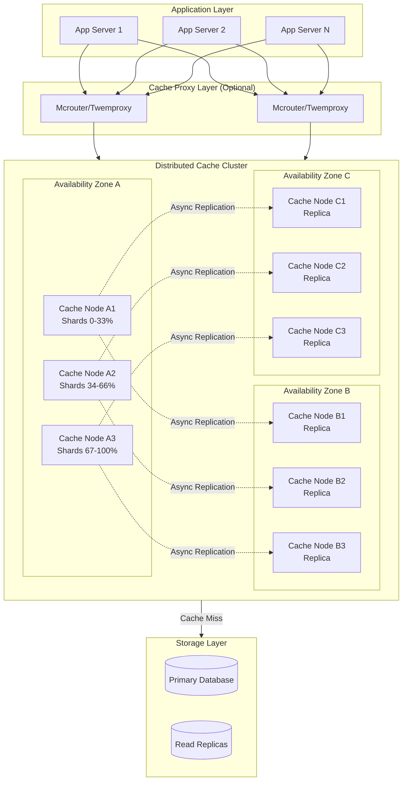

### Component Responsibilities

| Component | Responsibility | Scaling Strategy |
|-----------|---------------|------------------|
| **Application Servers** | Business logic, cache-aside implementation | Horizontal, stateless |
| **Cache Proxy (Optional)** | Connection pooling, routing, failover | Horizontal, stateless |
| **Cache Nodes** | Store cached data, handle get/set/delete | Horizontal, add nodes |
| **Database** | Source of truth, handle cache misses | Vertical + read replicas |

---

## Consistent Hashing with Virtual Nodes

### Hash Ring Concept

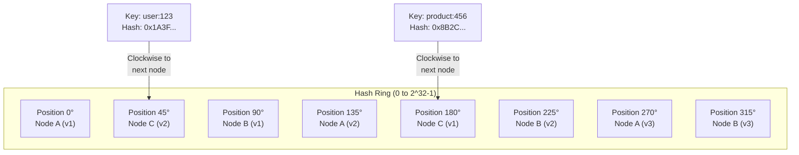

### Virtual Node Distribution

```
┌─────────────────────────────────────────────────────────────┐
│              VIRTUAL NODES ON HASH RING                      │
├─────────────────────────────────────────────────────────────┤
│                                                              │
│  Physical Node A (128 virtual nodes):                        │
│  ├── A-v0   at position 0x0000...                           │
│  ├── A-v1   at position 0x00FF...                           │
│  ├── A-v2   at position 0x01FE...                           │
│  └── ...    (128 positions spread across ring)              │
│                                                              │
│  Physical Node B (128 virtual nodes):                        │
│  ├── B-v0   at position 0x0080...                           │
│  ├── B-v1   at position 0x017F...                           │
│  └── ...                                                     │
│                                                              │
│  Benefits:                                                   │
│  ✓ Even distribution of keys                                 │
│  ✓ Smooth rebalancing on node add/remove                     │
│  ✓ Heterogeneous nodes (more vnodes for larger nodes)        │
│  ✓ Better failure distribution                               │
│                                                              │
└─────────────────────────────────────────────────────────────┘
```

### Key Lookup Algorithm

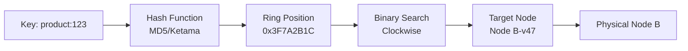

---

## Data Flow Patterns

### Cache-Aside Pattern (Read Path)

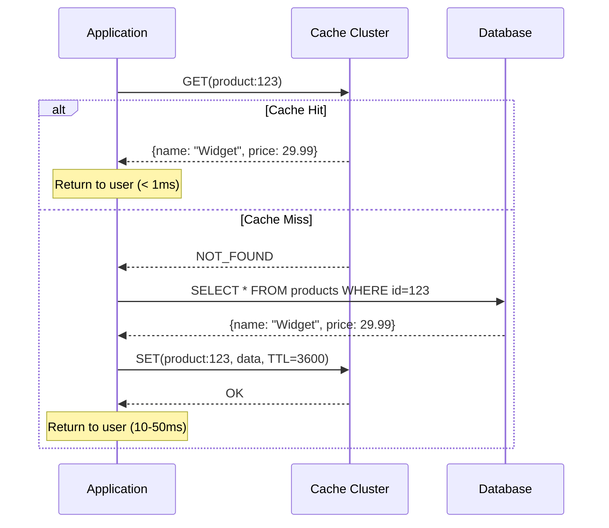

### Cache-Aside Pattern (Write Path)

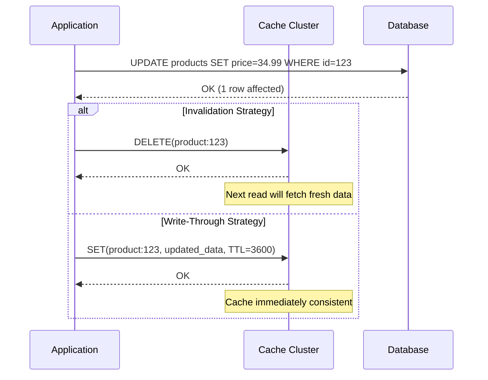

### Write-Through vs Write-Behind Comparison

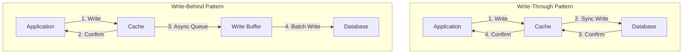

| Pattern | Latency | Consistency | Data Loss Risk | Use Case |
|---------|---------|-------------|----------------|----------|
| **Write-Through** | Higher (sync DB write) | Strong | None | Critical data |
| **Write-Behind** | Lower (async) | Eventual | Yes (buffer loss) | High write throughput |
| **Invalidation** | Lowest | Eventual | None | General purpose |

---

## Replication Architecture

### Leader-Follower Model (Per Shard)

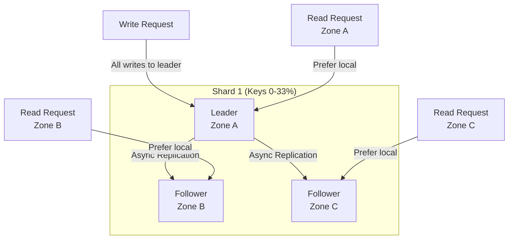

### Replication Flow

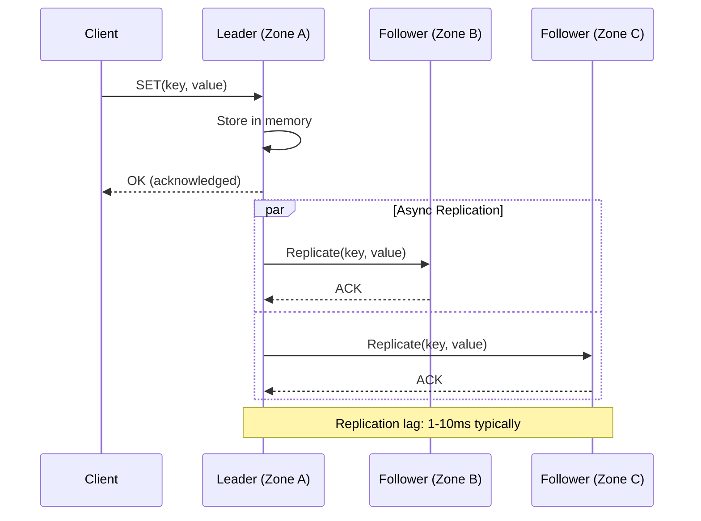

### Zone-Aware Routing

```
┌─────────────────────────────────────────────────────────────┐
│                  ZONE-AWARE ROUTING                          │
├─────────────────────────────────────────────────────────────┤
│                                                              │
│  Read Preference Order:                                      │
│  1. Local zone replica (lowest latency)                      │
│  2. Same region, different zone                              │
│  3. Leader (if local unavailable)                            │
│  4. Any available replica                                    │
│                                                              │
│  Write Routing:                                              │
│  1. Always to shard leader                                   │
│  2. Leader determined by consistent hash                     │
│  3. Failover to new leader on failure                        │
│                                                              │
│  Example (User in Zone B):                                   │
│  ┌──────────────────────────────────────────────────────┐   │
│  │  GET(key) → hash(key) → Shard 2                      │   │
│  │  Shard 2 replicas: Zone A (leader), Zone B, Zone C   │   │
│  │  Preference: Zone B (local) → Zone A → Zone C        │   │
│  └──────────────────────────────────────────────────────┘   │
│                                                              │
└─────────────────────────────────────────────────────────────┘
```

---

## Key Architectural Decisions

### Decision 1: Partitioning Strategy

| Option | Description | Pros | Cons |
|--------|-------------|------|------|
| **Consistent Hashing + Virtual Nodes** | Hash to ring position, walk clockwise | Even distribution, smooth scaling | Implementation complexity |
| Hash Slots (Redis-style) | Fixed 16384 slots, CRC16 mod | Predictable, explicit management | Manual slot migration |
| Client-side Sharding | Client computes target node | Simple servers | Client complexity, no auto-rebalance |
| Range Partitioning | Key ranges to nodes | Range queries possible | Uneven distribution |

**Recommendation:** Consistent hashing with 128-256 virtual nodes per physical node.

**Rationale:**
- Automatic rebalancing when nodes added/removed
- Only K/N keys move on topology change (K=keys, N=nodes)
- Virtual nodes ensure even distribution
- Industry proven (EVCache, Dynamo)

### Decision 2: Replication Strategy

| Option | Consistency | Availability | Complexity |
|--------|-------------|--------------|------------|
| **No Replication** | N/A | Low (node failure = data loss) | Lowest |
| **Leader-Follower (Async)** | Eventual | High | Medium |
| Leader-Follower (Sync) | Strong | Medium | High |
| Multi-Master | Eventual (conflicts) | Highest | Highest |

**Recommendation:** Leader-follower with asynchronous replication.

**Rationale:**
- Async replication doesn't block writes
- Followers provide read scaling and failover
- Acceptable for cache (stale data OK)
- Netflix EVCache uses this model

### Decision 3: Cache Invalidation Strategy

| Strategy | Implementation | Consistency | Latency Impact |
|----------|----------------|-------------|----------------|
| **TTL Only** | Set expiration on write | Eventual (TTL window) | None |
| **Explicit Invalidation** | DELETE on data change | Near-immediate | Extra round trip |
| **Event-Driven** | Subscribe to DB changes | Near-immediate | Background process |
| **Write-Through** | Update cache on write | Immediate | Write latency |

**Recommendation:** TTL-based with event-driven invalidation for critical data.

**Rationale:**
- TTL provides baseline consistency
- Event-driven catches critical updates faster
- No write latency impact
- Handles missed events gracefully (TTL fallback)

### Decision 4: Client Connection Model

| Option | Description | Pros | Cons |
|--------|-------------|------|------|
| **Direct Connection** | Client connects to each cache node | Lowest latency | Connection explosion |
| **Proxy Layer** | Mcrouter/Twemproxy in front | Connection pooling, failover | Extra hop |
| **Sidecar Proxy** | Per-app proxy (service mesh) | Isolation, observability | Resource overhead |

**Recommendation:** Proxy layer (Mcrouter) for large deployments, direct for smaller.

**Rationale:**
- Proxy handles connection pooling (10K clients × 30 nodes = 300K connections vs 10K)
- Automatic failover and retries
- Request routing and load balancing
- Single point for observability

---

## Architecture Pattern Checklist

| Pattern | Decision | Rationale |
|---------|----------|-----------|
| ✅ Sync vs Async | Sync for client requests, async for replication | Latency for reads, throughput for replication |
| ✅ Event-driven vs Request-response | Request-response for cache ops | Cache operations are synchronous by nature |
| ✅ Push vs Pull | Pull (cache-aside) | Application controls caching logic |
| ✅ Stateful vs Stateless | Stateful (cache nodes hold data) | By definition - cache stores data |
| ✅ Read-heavy optimization | Read from any replica | 99:1 read-write ratio |
| ✅ Real-time vs Batch | Real-time | Sub-millisecond latency required |
| ✅ Edge vs Origin | Origin (centralized cache cluster) | Shared cache for all app servers |

---

## Integration Points

### Upstream Dependencies (Cache Clients)

| Consumer | Protocol | Usage Pattern |
|----------|----------|---------------|
| Web Application | TCP (Memcached/Redis protocol) | Cache-aside reads |
| API Gateway | TCP | Response caching |
| Background Workers | TCP | Pre-warming, invalidation |
| Admin Console | HTTP/gRPC | Stats, flush operations |

### Downstream Dependencies

| Dependency | Protocol | Failure Impact |
|------------|----------|----------------|
| Database | SQL/NoSQL | Cache misses go to DB |
| Service Discovery | DNS/Consul | Node discovery |
| Monitoring | Prometheus/StatsD | No functional impact |
| Config Service | HTTP | Topology updates |

---

## Failure Modes and Mitigation

### Node Failure

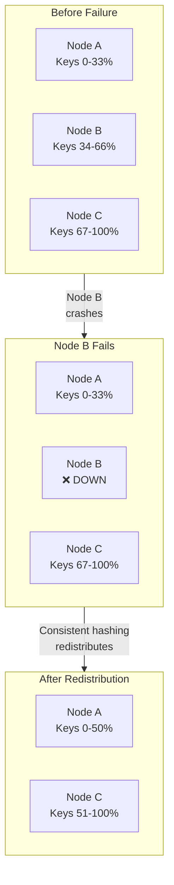

| Failure | Detection | Mitigation | Impact |
|---------|-----------|------------|--------|
| Single node | Health check (5s) | Failover to replica | Temporary misses for node's keys |
| Availability zone | Multiple node failures | Route to other zones | Higher latency, full availability |
| Network partition | Timeout, gossip | Serve stale from local | Eventual consistency |
| Full cluster | All nodes down | Fall back to database | High DB load, degraded latency |

### Mitigation Strategies

```
┌─────────────────────────────────────────────────────────────┐
│                  FAILURE MITIGATION LAYERS                   │
├─────────────────────────────────────────────────────────────┤
│                                                              │
│  Layer 1: Connection Retry                                   │
│  ├── Retry with exponential backoff                         │
│  ├── Max 3 retries, 100ms base delay                        │
│  └── Circuit breaker after 5 failures                       │
│                                                              │
│  Layer 2: Replica Failover                                   │
│  ├── Automatic failover to zone replica                     │
│  ├── Leader election via gossip/consensus                   │
│  └── Typical failover time: 1-5 seconds                     │
│                                                              │
│  Layer 3: Graceful Degradation                              │
│  ├── Return stale data if available                         │
│  ├── Serve from remaining nodes (partial cache)             │
│  └── Fall through to database                               │
│                                                              │
│  Layer 4: Database Protection                               │
│  ├── Rate limiting on cache miss path                       │
│  ├── Request coalescing (single-flight)                     │
│  └── Circuit breaker to database                            │
│                                                              │
└─────────────────────────────────────────────────────────────┘
```

---

## Deployment Topology Options

### Option 1: Single Region, Multi-AZ (Recommended Start)

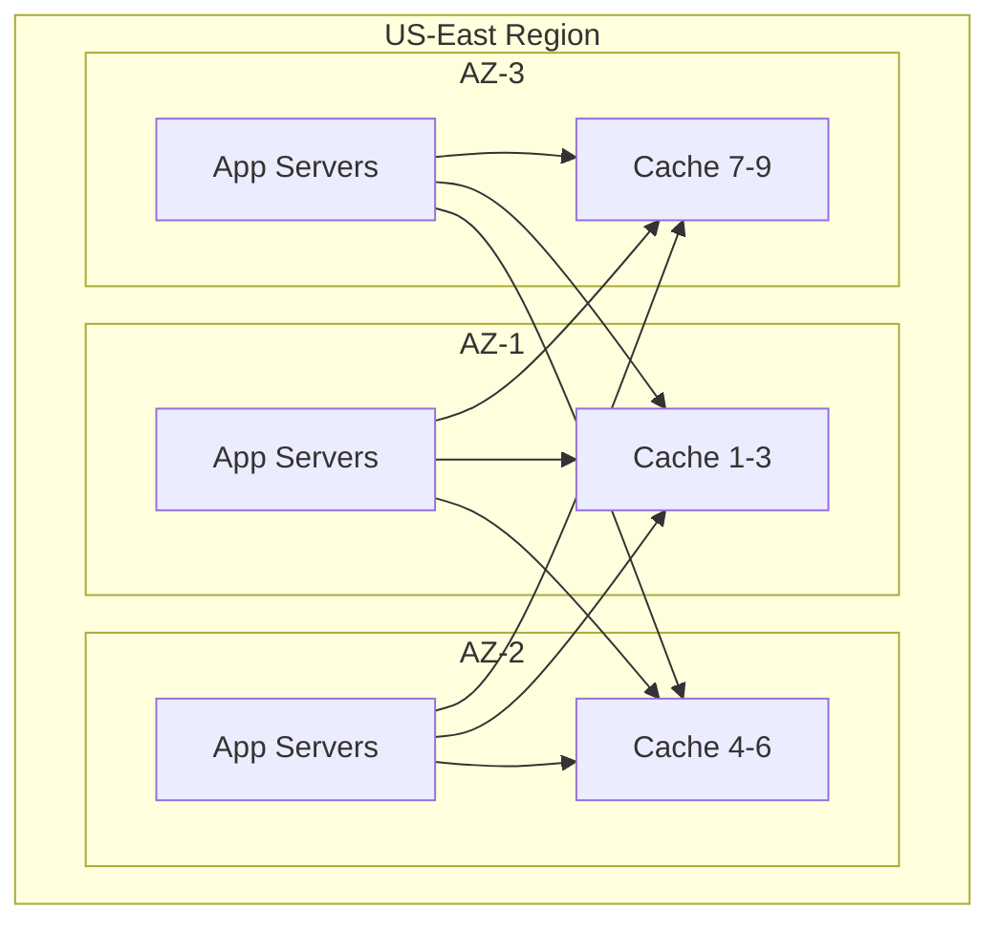

**Pros:** Low latency, simpler operations, cost-effective
**Cons:** Single region failure affects all users

### Option 2: Multi-Region with Regional Caches

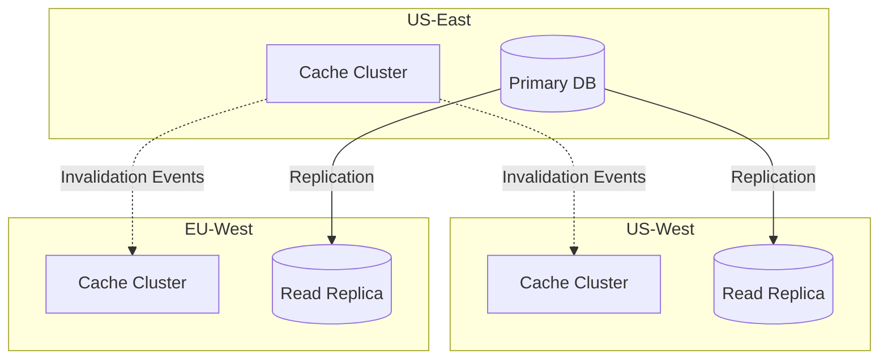

**Pros:** Global availability, local latency
**Cons:** Cross-region consistency complexity, higher cost

### Deployment Comparison

| Aspect | Single Region Multi-AZ | Multi-Region |
|--------|----------------------|--------------|
| Latency | 1-2ms same region | 1-2ms local, 50-200ms cross-region |
| Availability | 99.99% | 99.999% |
| Consistency | Strong within region | Eventual across regions |
| Cost | $$ | $$$$ |
| Complexity | Medium | High |
| Use case | Most applications | Global, zero-downtime required |
