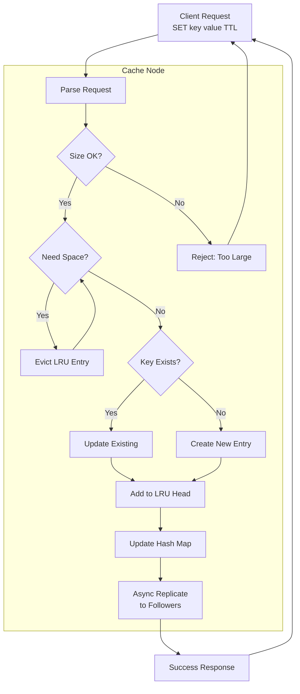

# Low-Level Design

[← Back to Index](./00-index.md)

---

## Data Structures

### LRU Cache Internal Structure

The LRU cache uses two complementary data structures to achieve O(1) time complexity for all operations:

1. **Hash Map**: O(1) key lookup
2. **Doubly Linked List**: O(1) eviction and access order maintenance

```
┌─────────────────────────────────────────────────────────────────────────┐
│                      LRU CACHE DATA STRUCTURE                            │
├─────────────────────────────────────────────────────────────────────────┤
│                                                                          │
│  HASH MAP (Key → Node Pointer)                                           │
│  ┌──────────────┬──────────────┬──────────────┬──────────────┐          │
│  │  "user:1"    │  "prod:42"   │  "sess:99"   │  "item:7"    │          │
│  │  → Node A    │  → Node B    │  → Node C    │  → Node D    │          │
│  └──────────────┴──────────────┴──────────────┴──────────────┘          │
│         │              │              │              │                   │
│         ▼              ▼              ▼              ▼                   │
│  DOUBLY LINKED LIST (Most Recent → Least Recent)                        │
│  ┌─────────────────────────────────────────────────────────────┐        │
│  │                                                              │        │
│  │  HEAD ←→ [Node D] ←→ [Node A] ←→ [Node B] ←→ [Node C] ←→ TAIL       │
│  │  (MRU)    item:7     user:1      prod:42     sess:99    (LRU)       │
│  │                                                              │        │
│  └─────────────────────────────────────────────────────────────┘        │
│                                                                          │
│  OPERATIONS:                                                             │
│  ├── GET(key):  HashMap lookup O(1), move to head O(1)                  │
│  ├── SET(key):  HashMap insert O(1), add to head O(1)                   │
│  ├── DELETE:    HashMap remove O(1), unlink node O(1)                   │
│  └── EVICT:     Remove from tail O(1), HashMap remove O(1)              │
│                                                                          │
└─────────────────────────────────────────────────────────────────────────┘
```

### Node Structure

```
┌─────────────────────────────────────────────────────────────┐
│                    CACHE NODE STRUCTURE                      │
├─────────────────────────────────────────────────────────────┤
│                                                              │
│  STRUCT CacheNode:                                           │
│  ┌─────────────────────────────────────────────────────┐    │
│  │  prev: Pointer to previous node (8 bytes)           │    │
│  │  next: Pointer to next node (8 bytes)               │    │
│  │  key_hash: uint64 (8 bytes) - for faster comparison │    │
│  │  key_length: uint16 (2 bytes)                       │    │
│  │  key_data: bytes[250] (max key size)                │    │
│  │  value_length: uint32 (4 bytes)                     │    │
│  │  value_data: bytes[1MB] (max value size)            │    │
│  │  expiry_time: int64 (8 bytes) - Unix timestamp      │    │
│  │  created_at: int64 (8 bytes)                        │    │
│  │  last_accessed: int64 (8 bytes)                     │    │
│  │  access_count: uint32 (4 bytes) - for LFU/stats     │    │
│  │  flags: uint32 (4 bytes) - compression, type hints  │    │
│  │  cas_token: uint64 (8 bytes) - compare-and-swap     │    │
│  └─────────────────────────────────────────────────────┘    │
│                                                              │
│  Metadata overhead per entry: ~72 bytes (excluding key/val) │
│                                                              │
└─────────────────────────────────────────────────────────────┘
```

### Cache Entry Definition

```
STRUCT CacheEntry:
    // Linked list pointers
    prev: Pointer<CacheEntry>      // Previous node in LRU list
    next: Pointer<CacheEntry>      // Next node in LRU list

    // Key data
    key_hash: uint64               // Pre-computed hash for fast comparison
    key: bytes[MAX_KEY_SIZE]       // Key data (max 250 bytes)
    key_length: uint16             // Actual key length

    // Value data
    value: bytes[MAX_VALUE_SIZE]   // Value data (max 1MB)
    value_length: uint32           // Actual value length

    // Timing
    expiry_time: int64             // Absolute expiration (0 = never)
    created_at: int64              // Creation timestamp
    last_accessed: int64           // Last access timestamp

    // Metadata
    access_count: uint32           // Access frequency (for LFU)
    flags: uint32                  // Bit flags for compression, type
    cas_token: uint64              // Monotonic token for CAS operations
```

### Flags Bit Layout

```
┌─────────────────────────────────────────────────────────────┐
│                      FLAGS (32 bits)                         │
├─────────────────────────────────────────────────────────────┤
│                                                              │
│  Bit 0:     Compressed (0=no, 1=yes)                        │
│  Bit 1-2:   Compression type (00=none, 01=lz4, 10=zstd)     │
│  Bit 3-4:   Serialization (00=raw, 01=json, 10=protobuf)    │
│  Bit 5:     Locked (for atomic operations)                   │
│  Bit 6:     Dirty (pending replication)                      │
│  Bit 7:     Hot key marker                                   │
│  Bit 8-31:  Reserved for future use                          │
│                                                              │
│  Example: 0x00000005 = Compressed with LZ4                   │
│                                                              │
└─────────────────────────────────────────────────────────────┘
```

---

## Memory Management

### Slab Allocator (Memcached-style)

To prevent memory fragmentation, cache systems use a slab allocator that pre-allocates memory in fixed-size chunks.

```
┌─────────────────────────────────────────────────────────────┐
│                    SLAB ALLOCATOR                            │
├─────────────────────────────────────────────────────────────┤
│                                                              │
│  Memory divided into Slab Classes by item size:              │
│                                                              │
│  ┌─────────────────────────────────────────────────────┐    │
│  │  Class 1:  96 bytes   (small items)                 │    │
│  │  Class 2:  120 bytes  (96 × 1.25)                   │    │
│  │  Class 3:  152 bytes  (120 × 1.25)                  │    │
│  │  Class 4:  192 bytes                                │    │
│  │  ...                                                │    │
│  │  Class 20: 51,200 bytes (~50 KB)                    │    │
│  │  ...                                                │    │
│  │  Class 42: 1,048,576 bytes (1 MB max)               │    │
│  └─────────────────────────────────────────────────────┘    │
│                                                              │
│  Each Slab Class contains multiple Pages (1 MB each):        │
│                                                              │
│  Class 3 (152 bytes):                                        │
│  ┌─────────────────────────────────────────────────────┐    │
│  │  Page 1: [item][item][item]...[item] (6,710 items)  │    │
│  │  Page 2: [item][item][item]...[item]                │    │
│  │  Page 3: [____][____][item]...[item] (free slots)   │    │
│  └─────────────────────────────────────────────────────┘    │
│                                                              │
│  Benefits:                                                   │
│  ✓ No external fragmentation                                 │
│  ✓ O(1) allocation and deallocation                         │
│  ✓ Predictable memory usage                                  │
│  ✓ Per-class LRU eviction possible                          │
│                                                              │
│  Drawbacks:                                                  │
│  ✗ Internal fragmentation (149-byte item uses 152)          │
│  ✗ Fixed growth factor limits flexibility                    │
│                                                              │
└─────────────────────────────────────────────────────────────┘
```

### Memory Layout

```
┌─────────────────────────────────────────────────────────────┐
│                  CACHE SERVER MEMORY LAYOUT                  │
├─────────────────────────────────────────────────────────────┤
│                                                              │
│  Total RAM: 32 GB                                            │
│                                                              │
│  ┌─────────────────────────────────────────────────────┐    │
│  │  OS + System:           2 GB (6%)                   │    │
│  │  ├── Kernel buffers                                 │    │
│  │  └── System processes                               │    │
│  ├─────────────────────────────────────────────────────┤    │
│  │  Cache Process:         28 GB (88%)                 │    │
│  │  ├── Hash table:        1 GB (pointer array)        │    │
│  │  ├── Slab pages:        24 GB (actual data)         │    │
│  │  ├── Connection buffers: 1 GB (10K connections)     │    │
│  │  └── Working memory:    2 GB (temp operations)      │    │
│  ├─────────────────────────────────────────────────────┤    │
│  │  Monitoring/Logging:    2 GB (6%)                   │    │
│  │  ├── Metrics buffer                                 │    │
│  │  └── Log buffers                                    │    │
│  └─────────────────────────────────────────────────────┘    │
│                                                              │
│  Effective cache capacity: 24 GB                             │
│                                                              │
└─────────────────────────────────────────────────────────────┘
```

---

## API Design

### Protocol Options

| Protocol | Latency | Throughput | Features | Use Case |
|----------|---------|------------|----------|----------|
| **Memcached (ASCII)** | Low | High | Simple, text-based | Compatibility |
| **Memcached (Binary)** | Lower | Higher | Efficient, typed | Performance |
| **Redis Protocol (RESP)** | Low | High | Rich commands | Feature-rich |
| **gRPC** | Medium | High | Streaming, typed | Modern services |

### gRPC Service Definition

```protobuf
syntax = "proto3";

package cache.v1;

service CacheService {
    // Basic operations
    rpc Get(GetRequest) returns (GetResponse);
    rpc Set(SetRequest) returns (SetResponse);
    rpc Delete(DeleteRequest) returns (DeleteResponse);

    // Batch operations
    rpc MultiGet(MultiGetRequest) returns (MultiGetResponse);
    rpc MultiSet(MultiSetRequest) returns (MultiSetResponse);

    // Atomic operations
    rpc CompareAndSwap(CASRequest) returns (CASResponse);
    rpc Increment(IncrementRequest) returns (IncrementResponse);
    rpc Decrement(DecrementRequest) returns (DecrementResponse);

    // TTL operations
    rpc Touch(TouchRequest) returns (TouchResponse);
    rpc GetWithTTL(GetRequest) returns (GetWithTTLResponse);

    // Admin operations
    rpc Stats(StatsRequest) returns (StatsResponse);
    rpc Flush(FlushRequest) returns (FlushResponse);
}
```

### Request/Response Formats

```yaml
# GET Operation
GetRequest:
    key: bytes              # Key to retrieve (max 250 bytes)
    namespace: string       # Optional namespace prefix

GetResponse:
    status: Status          # FOUND, NOT_FOUND, ERROR
    value: bytes            # Cached value (if found)
    cas_token: uint64       # Token for CAS operations
    flags: uint32           # Stored flags
    ttl_remaining: int32    # Seconds until expiry (-1 = no TTL)

# SET Operation
SetRequest:
    key: bytes              # Key to store
    value: bytes            # Value to cache
    ttl_seconds: int32      # Time-to-live (0 = use default)
    flags: uint32           # Application-defined flags
    namespace: string       # Optional namespace
    mode: SetMode           # SET, ADD (only if not exists), REPLACE

SetResponse:
    status: Status          # OK, ERROR, NOT_STORED (ADD failed)
    cas_token: uint64       # New CAS token

# DELETE Operation
DeleteRequest:
    key: bytes
    namespace: string

DeleteResponse:
    status: Status          # DELETED, NOT_FOUND, ERROR

# MULTI-GET Operation
MultiGetRequest:
    keys: repeated bytes    # Up to 100 keys
    namespace: string

MultiGetResponse:
    items: repeated CacheItem

CacheItem:
    key: bytes
    value: bytes
    cas_token: uint64
    flags: uint32
    found: bool

# COMPARE-AND-SWAP Operation
CASRequest:
    key: bytes
    value: bytes
    cas_token: uint64       # Must match current token
    ttl_seconds: int32

CASResponse:
    status: Status          # OK, CAS_MISMATCH, NOT_FOUND
    new_cas_token: uint64

# STATS Operation
StatsResponse:
    items_count: uint64
    bytes_used: uint64
    bytes_limit: uint64
    get_hits: uint64
    get_misses: uint64
    set_count: uint64
    delete_count: uint64
    eviction_count: uint64
    uptime_seconds: uint64
    connections_current: uint32

# Status Enum
enum Status:
    OK = 0
    NOT_FOUND = 1
    ERROR = 2
    CAS_MISMATCH = 3
    NOT_STORED = 4
    DELETED = 5
```

### REST API Alternative

```yaml
# GET
GET /cache/v1/items/{key}
Headers:
    X-Namespace: products
Response 200:
    {
        "key": "product:123",
        "value": "base64_encoded_data",
        "cas_token": "1234567890",
        "ttl_remaining": 3540,
        "flags": 0
    }
Response 404:
    { "error": "NOT_FOUND" }

# SET
PUT /cache/v1/items/{key}
Headers:
    X-TTL: 3600
    X-Namespace: products
Body:
    { "value": "base64_encoded_data", "flags": 0 }
Response 200:
    { "cas_token": "1234567891" }

# DELETE
DELETE /cache/v1/items/{key}
Response 200:
    { "status": "DELETED" }

# MULTI-GET
POST /cache/v1/items/_mget
Body:
    { "keys": ["key1", "key2", "key3"] }
Response 200:
    {
        "items": [
            { "key": "key1", "value": "...", "found": true },
            { "key": "key2", "found": false },
            { "key": "key3", "value": "...", "found": true }
        ]
    }
```

### Idempotency Handling

| Operation | Idempotent? | Strategy |
|-----------|-------------|----------|
| GET | Yes | Safe to retry |
| SET | Yes | Same key+value = same result |
| DELETE | Yes | Deleting non-existent = success |
| ADD | No | Use CAS for safety |
| INCREMENT | No | Use CAS or idempotency key |

```
FUNCTION idempotent_increment(key, delta, idempotency_key):
    // Check if operation already processed
    IF cache.get(idempotency_key) EXISTS:
        RETURN "already_processed"

    // Perform increment with CAS
    LOOP:
        current = cache.get_with_cas(key)
        new_value = current.value + delta
        result = cache.cas(key, new_value, current.cas_token)
        IF result == OK:
            // Record idempotency key with short TTL
            cache.set(idempotency_key, "done", TTL=300)
            RETURN new_value
        ELSE IF result == CAS_MISMATCH:
            CONTINUE  // Retry
        ELSE:
            RETURN error
```

---

## Core Algorithms

### LRU Cache Operations (Pseudocode)

```
CLASS LRUCache:
    hash_map: HashMap<Key, Node>
    head: Node          // Most recently used (dummy node)
    tail: Node          // Least recently used (dummy node)
    current_size: int64
    max_size: int64
    cas_counter: uint64  // Monotonically increasing

    CONSTRUCTOR(max_size):
        this.max_size = max_size
        this.current_size = 0
        this.cas_counter = 0

        // Initialize dummy head and tail
        this.head = new Node()
        this.tail = new Node()
        this.head.next = this.tail
        this.tail.prev = this.head

    FUNCTION get(key):
        IF key NOT IN hash_map:
            RETURN NOT_FOUND

        node = hash_map[key]

        // Check expiration
        IF node.expiry_time > 0 AND now() > node.expiry_time:
            remove_node(node)
            hash_map.remove(key)
            RETURN NOT_FOUND

        // Move to head (most recently used)
        move_to_head(node)

        // Update access metadata
        node.last_accessed = now()
        node.access_count += 1

        RETURN {
            value: node.value,
            cas_token: node.cas_token,
            flags: node.flags,
            ttl_remaining: node.expiry_time - now()
        }

    FUNCTION set(key, value, ttl, flags):
        new_size = sizeof(key) + sizeof(value) + METADATA_OVERHEAD

        IF new_size > max_size:
            RETURN ERROR_VALUE_TOO_LARGE

        // Evict until we have space
        WHILE current_size + new_size > max_size:
            evict_lru()

        IF key IN hash_map:
            // Update existing entry
            node = hash_map[key]
            current_size -= sizeof(node.value)
            node.value = value
            node.expiry_time = IF ttl > 0 THEN now() + ttl ELSE 0
            node.flags = flags
            node.cas_token = ++cas_counter
            move_to_head(node)
        ELSE:
            // Create new entry
            node = new Node()
            node.key = key
            node.value = value
            node.expiry_time = IF ttl > 0 THEN now() + ttl ELSE 0
            node.created_at = now()
            node.flags = flags
            node.cas_token = ++cas_counter

            add_to_head(node)
            hash_map[key] = node

        current_size += new_size
        RETURN {status: OK, cas_token: node.cas_token}

    FUNCTION delete(key):
        IF key NOT IN hash_map:
            RETURN NOT_FOUND

        node = hash_map[key]
        remove_node(node)
        hash_map.remove(key)
        current_size -= sizeof(node)

        RETURN DELETED

    FUNCTION compare_and_swap(key, new_value, expected_cas, ttl):
        IF key NOT IN hash_map:
            RETURN NOT_FOUND

        node = hash_map[key]

        IF node.cas_token != expected_cas:
            RETURN CAS_MISMATCH

        // CAS matched, update value
        current_size -= sizeof(node.value)
        node.value = new_value
        node.expiry_time = IF ttl > 0 THEN now() + ttl ELSE 0
        node.cas_token = ++cas_counter
        current_size += sizeof(new_value)

        move_to_head(node)
        RETURN {status: OK, new_cas_token: node.cas_token}

    // Private helper functions

    FUNCTION add_to_head(node):
        node.prev = head
        node.next = head.next
        head.next.prev = node
        head.next = node

    FUNCTION remove_node(node):
        node.prev.next = node.next
        node.next.prev = node.prev

    FUNCTION move_to_head(node):
        remove_node(node)
        add_to_head(node)

    FUNCTION evict_lru():
        IF tail.prev == head:
            RETURN  // Empty cache

        lru_node = tail.prev
        remove_node(lru_node)
        hash_map.remove(lru_node.key)
        current_size -= sizeof(lru_node)

        // Emit eviction metric
        metrics.increment("cache.evictions")
```

**Time Complexity:**
| Operation | Time | Space |
|-----------|------|-------|
| GET | O(1) | O(1) |
| SET | O(1) amortized | O(1) |
| DELETE | O(1) | O(1) |
| Eviction | O(1) | O(1) |

### Consistent Hashing (Ketama Algorithm)

```
CLASS ConsistentHashRing:
    ring: SortedMap<uint32, VirtualNode>
    physical_nodes: List<PhysicalNode>
    virtual_nodes_per_physical: int = 128

    FUNCTION add_node(physical_node):
        FOR i FROM 0 TO virtual_nodes_per_physical:
            // Create unique identifier for virtual node
            vnode_key = physical_node.id + "-" + i
            hash = ketama_hash(vnode_key)

            ring[hash] = VirtualNode{
                physical: physical_node,
                index: i,
                hash: hash
            }

        physical_nodes.add(physical_node)

    FUNCTION remove_node(physical_node):
        FOR i FROM 0 TO virtual_nodes_per_physical:
            vnode_key = physical_node.id + "-" + i
            hash = ketama_hash(vnode_key)
            ring.remove(hash)

        physical_nodes.remove(physical_node)

    FUNCTION get_node(key):
        IF ring.is_empty():
            RETURN null

        hash = ketama_hash(key)

        // Find first node with hash >= key hash
        entry = ring.ceiling_entry(hash)

        // Wrap around if past the end
        IF entry IS null:
            entry = ring.first_entry()

        RETURN entry.value.physical

    FUNCTION get_nodes(key, count):
        // Get multiple nodes for replication
        IF ring.is_empty() OR count > physical_nodes.size():
            RETURN physical_nodes  // Return all available

        nodes = []
        hash = ketama_hash(key)

        iterator = ring.tail_map(hash).iterator()

        WHILE nodes.size() < count:
            IF NOT iterator.has_next():
                iterator = ring.iterator()  // Wrap around

            vnode = iterator.next()
            physical = vnode.physical

            IF physical NOT IN nodes:
                nodes.add(physical)

        RETURN nodes

    FUNCTION ketama_hash(key):
        // MD5-based hash for compatibility with libketama
        md5 = MD5(key)

        // Take first 4 bytes as unsigned 32-bit integer
        hash = (md5[3] & 0xFF) << 24
             | (md5[2] & 0xFF) << 16
             | (md5[1] & 0xFF) << 8
             | (md5[0] & 0xFF)

        RETURN hash
```

**Time Complexity:**
| Operation | Time |
|-----------|------|
| get_node | O(log V) where V = total virtual nodes |
| add_node | O(V × log V) |
| remove_node | O(V × log V) |

### TTL Expiration Handling

```
CLASS TTLManager:
    // Lazy expiration: check on access
    // Active expiration: background cleanup

    expiry_wheel: TimeWheel  // Hierarchical timing wheel

    FUNCTION schedule_expiry(key, expiry_time):
        expiry_wheel.schedule(expiry_time, ExpiryTask{key: key})

    FUNCTION cancel_expiry(key):
        expiry_wheel.cancel(key)

    // Background expiration thread
    FUNCTION run_expiry_cycle():
        LOOP FOREVER:
            current_time = now()
            expired_tasks = expiry_wheel.advance(current_time)

            FOR task IN expired_tasks:
                // Check if key still exists and is actually expired
                node = cache.hash_map.get(task.key)
                IF node IS NOT null AND node.expiry_time <= current_time:
                    cache.delete(task.key)
                    metrics.increment("cache.expired")

            sleep(100ms)  // Check every 100ms

    // Lazy expiration on access
    FUNCTION is_expired(node):
        IF node.expiry_time == 0:
            RETURN false  // No TTL set
        RETURN now() > node.expiry_time
```

### Multi-GET Optimization

```
FUNCTION multi_get(keys):
    results = []

    // Group keys by target node (for distributed cache)
    node_to_keys = group_by_node(keys)

    // Parallel fetch from each node
    futures = []
    FOR node, node_keys IN node_to_keys:
        future = async_fetch(node, node_keys)
        futures.add(future)

    // Collect results
    FOR future IN futures:
        node_results = future.await()
        results.extend(node_results)

    RETURN results

FUNCTION group_by_node(keys):
    groups = DefaultDict(List)
    FOR key IN keys:
        node = consistent_hash_ring.get_node(key)
        groups[node].add(key)
    RETURN groups
```

---

## Data Flow Diagrams

### GET Request Flow

```mermaid
flowchart TB
    Client[Client Request<br/>GET key]

    subgraph CacheNode["Cache Node"]
        Parse[Parse Request]
        HashLookup[Hash Table Lookup<br/>O(1)]
        TTLCheck{TTL Expired?}
        MoveToHead[Move to LRU Head<br/>O(1)]
        PrepareResponse[Prepare Response]

        Parse --> HashLookup
        HashLookup -->|Found| TTLCheck
        HashLookup -->|Not Found| Miss
        TTLCheck -->|No| MoveToHead
        TTLCheck -->|Yes| Evict[Evict Entry]
        Evict --> Miss
        MoveToHead --> PrepareResponse
    end

    Miss[Cache Miss Response]
    Hit[Cache Hit Response]

    Client --> Parse
    PrepareResponse --> Hit
    Miss --> Client
    Hit --> Client
```

### SET Request Flow



---

## Indexing and Partitioning

### Hash Table Configuration

```
┌─────────────────────────────────────────────────────────────┐
│                  HASH TABLE CONFIGURATION                    │
├─────────────────────────────────────────────────────────────┤
│                                                              │
│  Initial buckets: 65,536 (2^16)                             │
│  Load factor threshold: 0.75                                 │
│  Growth factor: 2x                                           │
│  Hash function: MurmurHash3 (fast, good distribution)        │
│                                                              │
│  Bucket structure:                                           │
│  ┌──────────────────────────────────────────────────────┐   │
│  │  Bucket[i]: head pointer → Node → Node → null        │   │
│  │  (Chaining for collision resolution)                 │   │
│  └──────────────────────────────────────────────────────┘   │
│                                                              │
│  Memory for 2M entries:                                      │
│  ├── Buckets: 65,536 × 8 bytes = 512 KB                     │
│  ├── At 0.75 load: ~50K entries per resize                  │
│  └── Final size for 2M: ~4M buckets = 32 MB                 │
│                                                              │
└─────────────────────────────────────────────────────────────┘
```

### Sharding Key Selection

| Pattern | Key Format | Shard Distribution |
|---------|------------|-------------------|
| User data | `user:{user_id}:profile` | Even (user IDs random) |
| Product data | `product:{product_id}:details` | Even |
| Session data | `session:{session_id}` | Even (UUID-based) |
| Counter | `counter:{name}` | Potential hot key |
| Config | `config:{app}:{key}` | Few keys, consider dedicated |

### Hot Key Detection

```
FUNCTION track_access(key):
    // Sliding window counter for hot key detection
    window_key = "access:" + key + ":" + current_minute()

    count = atomic_increment(window_key)

    IF count > HOT_KEY_THRESHOLD:
        mark_as_hot_key(key)
        alert("Hot key detected: " + key)

CONSTANT HOT_KEY_THRESHOLD = 10000  // Accesses per minute
```

---

## Versioning Strategy

### API Versioning

```
/cache/v1/items/{key}    # Current stable
/cache/v2/items/{key}    # New features (beta)

Header-based:
X-API-Version: 2
```

### Data Versioning for Compatibility

```
STRUCT VersionedValue:
    version: uint8           # Schema version
    format: uint8            # Serialization format
    data: bytes              # Actual payload

// On read:
FUNCTION deserialize(raw_value):
    version = raw_value[0]
    format = raw_value[1]
    data = raw_value[2:]

    IF version == 1:
        RETURN deserialize_v1(data, format)
    ELSE IF version == 2:
        RETURN deserialize_v2(data, format)
    ELSE:
        RETURN error("Unknown version")
```
