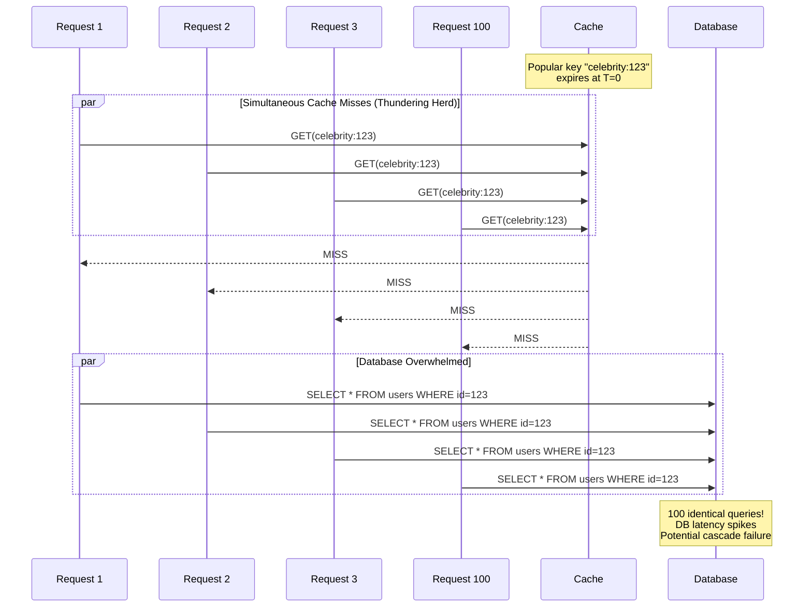
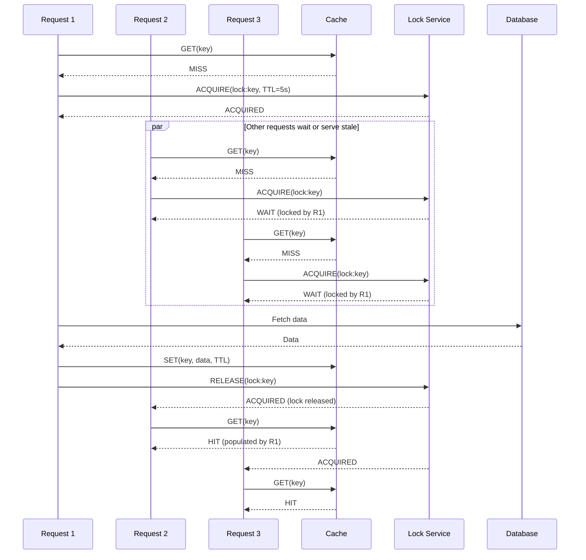
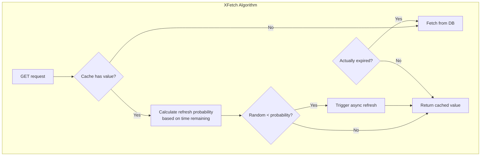
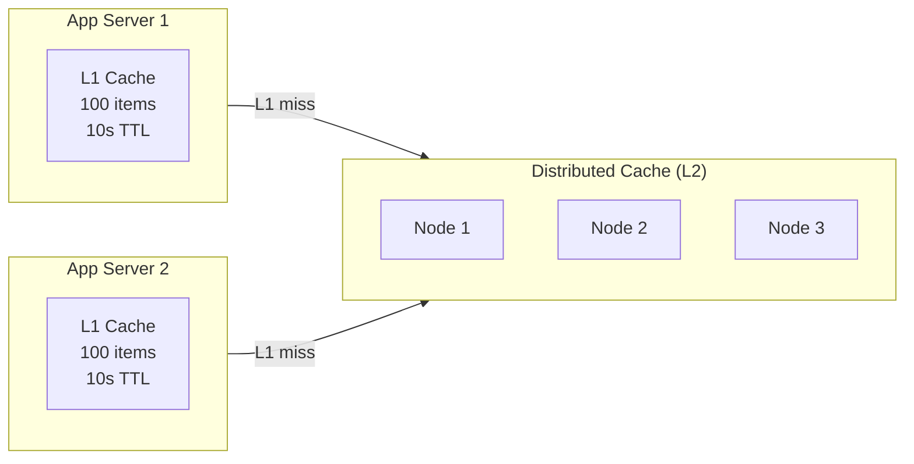
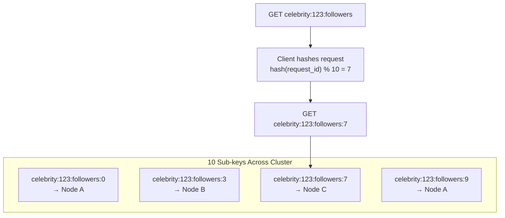
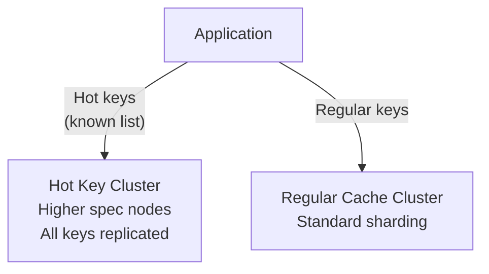
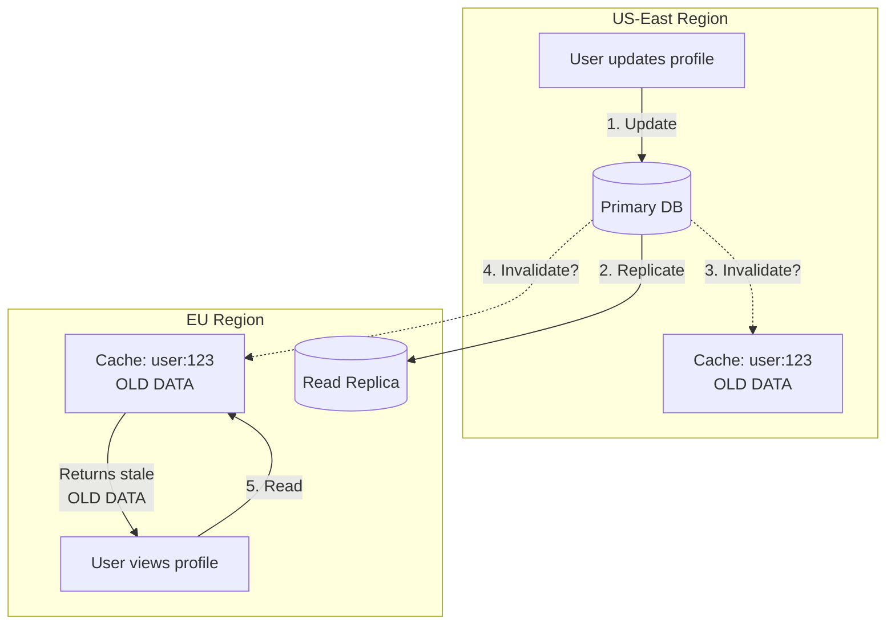
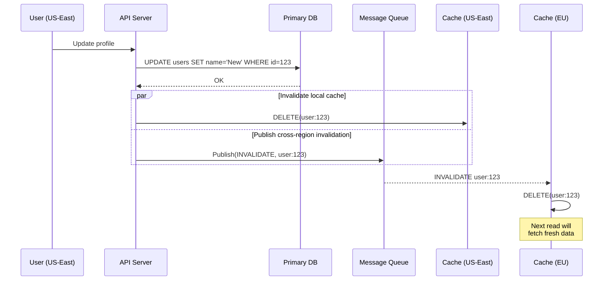
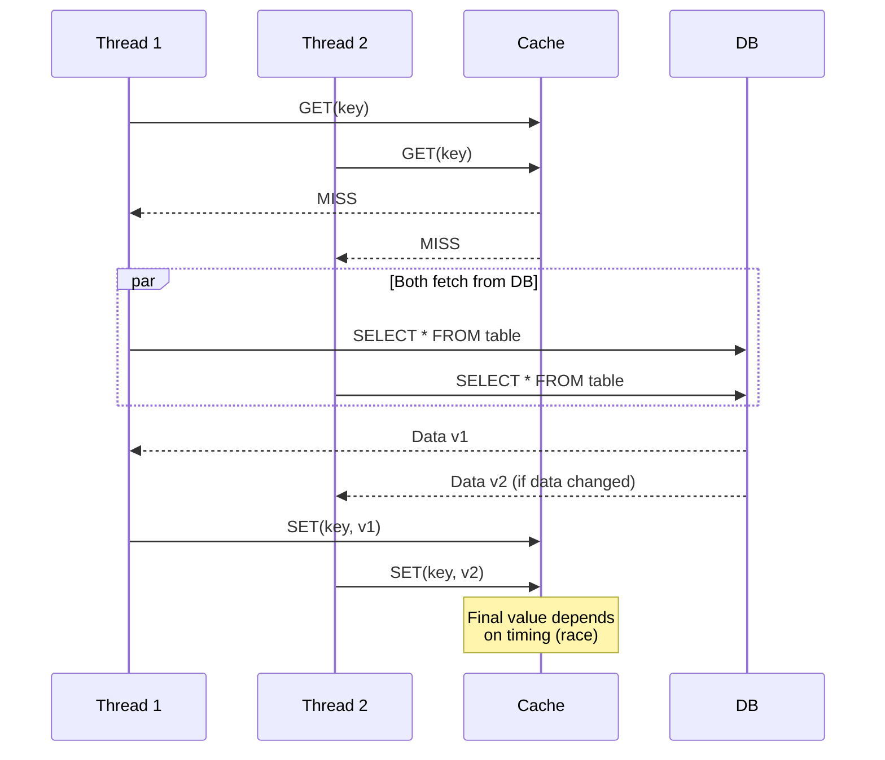

# Deep Dive and Bottlenecks

[← Back to Index](./00-index.md)

---

## Critical Component 1: Cache Stampede Prevention

### The Problem: Thundering Herd

When a popular cached item expires, multiple concurrent requests may simultaneously:
1. Find the cache empty (miss)
2. All query the backend database
3. All attempt to repopulate the cache
4. Backend becomes overwhelmed

This is known as **cache stampede** or **thundering herd**.



### Impact Assessment

| Scenario | Without Prevention | With Prevention |
|----------|-------------------|-----------------|
| Popular key expiry | 1000 DB queries | 1 DB query |
| DB latency | 500ms+ (overloaded) | 10ms (normal) |
| User experience | Timeouts, errors | Normal |
| Cascade risk | High | Low |

### Solution Strategies Comparison

| Strategy | Description | Pros | Cons | Complexity |
|----------|-------------|------|------|------------|
| **Locking (Mutex)** | One request holds lock, others wait | Guaranteed single fetch | Lock contention, waiters blocked | Medium |
| **XFetch (Probabilistic)** | Early refresh before expiry | No locks, smooth load | Probabilistic (not guaranteed) | Medium |
| **Stale-While-Revalidate** | Return stale, refresh async | No waiting | Serves stale data | Low |
| **Request Coalescing** | Queue duplicate requests | Efficient | Implementation complexity | High |
| **External Refresh** | Background job refreshes | Decoupled | Requires job system | Medium |

---

### Solution 1: Locking (Distributed Mutex)

Only one request fetches from the database while others wait or return stale data.



**Implementation (Pseudocode):**

```
FUNCTION get_with_lock(key, fetch_function, ttl):
    // Try cache first
    value = cache.get(key)
    IF value IS NOT null:
        RETURN value

    // Cache miss - try to acquire lock
    lock_key = "lock:" + key
    lock_acquired = cache.set_nx(lock_key, "1", TTL=5)  // SET if Not eXists

    IF lock_acquired:
        TRY:
            // This request will fetch
            value = fetch_function()
            cache.set(key, value, ttl)
            RETURN value
        FINALLY:
            cache.delete(lock_key)
    ELSE:
        // Another request is fetching - wait or return stale
        FOR i FROM 1 TO MAX_WAIT_ATTEMPTS:
            sleep(50ms)
            value = cache.get(key)
            IF value IS NOT null:
                RETURN value

        // Timeout - fetch ourselves as fallback
        RETURN fetch_function()
```

**Pros:**
- Guaranteed single database fetch
- Simple to understand

**Cons:**
- Lock contention under high load
- Waiters consume connections
- Requires distributed lock (Redis, etc.)

---

### Solution 2: Probabilistic Early Refresh (XFetch)

Refresh the cache probabilistically before expiration. As expiry approaches, the probability of refresh increases.



**The XFetch Formula:**

```
time_remaining = expiry_time - current_time
random_threshold = time_remaining - (beta * ln(random()) * recompute_time)

IF random_threshold <= 0:
    trigger_refresh()  // Probabilistically chosen to refresh

Where:
- beta: Controls aggressiveness (1.0 = moderate)
- recompute_time: Estimated time to fetch from DB
- random(): Uniform random in (0, 1]
```

**Implementation (Pseudocode):**

```
FUNCTION get_with_xfetch(key, fetch_function, ttl, beta=1.0, recompute_time=0.1):
    entry = cache.get_with_metadata(key)

    IF entry IS null:
        // Hard miss - must fetch
        value = fetch_function()
        cache.set(key, value, ttl)
        RETURN value

    IF entry.is_expired():
        // Actually expired - must fetch
        value = fetch_function()
        cache.set(key, value, ttl)
        RETURN value

    // Entry exists and not expired - check for early refresh
    time_remaining = entry.expiry_time - now()
    random_value = random()  // (0, 1]

    // XFetch formula
    threshold = time_remaining - (beta * ln(random_value) * recompute_time)

    IF threshold <= 0:
        // This request triggers early refresh (async)
        async_do:
            new_value = fetch_function()
            cache.set(key, new_value, ttl)

    // Always return current cached value
    RETURN entry.value

// Probability visualization
//
// Time remaining   Refresh probability (approx)
// ─────────────────────────────────────────────
// 100% of TTL      ~0.1%
// 50% of TTL       ~1%
// 20% of TTL       ~5%
// 10% of TTL       ~15%
// 5% of TTL        ~30%
// 1% of TTL        ~60%
```

**Pros:**
- No locks or coordination needed
- Smooth, gradual refresh
- No request blocked waiting
- Self-tuning based on load

**Cons:**
- Probabilistic (rare double-fetches possible)
- Requires tracking expiry metadata
- More complex than simple TTL

---

### Solution 3: Stale-While-Revalidate

Use two TTLs: a soft TTL (when to refresh) and a hard TTL (when truly expired).

```
┌─────────────────────────────────────────────────────────────┐
│              STALE-WHILE-REVALIDATE TIMELINE                 │
├─────────────────────────────────────────────────────────────┤
│                                                              │
│  T=0        T=soft_ttl              T=hard_ttl               │
│  │          │                       │                        │
│  ▼          ▼                       ▼                        │
│  ├──────────┼───────────────────────┤                        │
│  │  FRESH   │     STALE (serve +    │    EXPIRED            │
│  │ (serve)  │     async refresh)    │   (must fetch)        │
│  ├──────────┼───────────────────────┤                        │
│                                                              │
│  Example: soft_ttl=300s, hard_ttl=3600s                      │
│  ├── First 5 min: Serve as fresh                            │
│  ├── 5-60 min: Serve stale, trigger background refresh      │
│  └── After 60 min: Must fetch (hard expired)                │
│                                                              │
└─────────────────────────────────────────────────────────────┘
```

**Implementation (Pseudocode):**

```
STRUCT CacheEntryWithStaleness:
    value: bytes
    soft_expiry: int64    // When to start revalidating
    hard_expiry: int64    // When truly expired

FUNCTION get_with_stale_while_revalidate(key, fetch_function, soft_ttl, hard_ttl):
    entry = cache.get(key)
    current_time = now()

    IF entry IS null OR current_time > entry.hard_expiry:
        // Hard miss or hard expired - must fetch synchronously
        value = fetch_function()
        cache.set(key, CacheEntryWithStaleness{
            value: value,
            soft_expiry: current_time + soft_ttl,
            hard_expiry: current_time + hard_ttl
        })
        RETURN value

    IF current_time > entry.soft_expiry:
        // Stale but usable - refresh in background
        IF try_acquire_refresh_lock(key):
            async_do:
                TRY:
                    new_value = fetch_function()
                    cache.set(key, CacheEntryWithStaleness{
                        value: new_value,
                        soft_expiry: now() + soft_ttl,
                        hard_expiry: now() + hard_ttl
                    })
                FINALLY:
                    release_refresh_lock(key)

    // Return current value (fresh or stale)
    RETURN entry.value
```

**Pros:**
- User never waits (unless hard expired)
- Simple mental model
- Graceful degradation

**Cons:**
- Serves stale data during revalidation
- Requires extra metadata (two TTLs)
- Background refresh infrastructure needed

---

### Recommendation

| Use Case | Recommended Strategy |
|----------|---------------------|
| General purpose | **XFetch** - best balance |
| Strict freshness | **Locking** - guaranteed single fetch |
| High availability priority | **Stale-While-Revalidate** |
| Simple implementation | **Stale-While-Revalidate** |

---

## Critical Component 2: Hot Key Handling

### The Problem

A "hot key" receives disproportionate traffic, overwhelming a single cache node:
- Celebrity tweet
- Viral product
- Breaking news
- Flash sale item

```
┌─────────────────────────────────────────────────────────────┐
│                    HOT KEY PROBLEM                           │
├─────────────────────────────────────────────────────────────┤
│                                                              │
│  Normal distribution:                                        │
│  ┌────────────────────────────────────────────────────┐     │
│  │ Node A: 33% │ Node B: 33% │ Node C: 34%            │     │
│  │   ~33K QPS  │   ~33K QPS  │   ~34K QPS             │     │
│  └────────────────────────────────────────────────────┘     │
│                                                              │
│  With hot key on Node B:                                     │
│  ┌────────────────────────────────────────────────────┐     │
│  │ Node A: 10% │ Node B: 80% │ Node C: 10%            │     │
│  │   ~10K QPS  │  ~800K QPS! │   ~10K QPS             │     │
│  └────────────────────────────────────────────────────┘     │
│                                       ↑                      │
│                              Node B overloaded!              │
│                                                              │
└─────────────────────────────────────────────────────────────┘
```

### Solution Strategies

#### Strategy 1: Local L1 Cache (App Server)

Add a small in-process cache on each application server.



**Implementation:**

```
CLASS TwoTierCache:
    l1_cache: LocalLRUCache(max_size=100, ttl=10s)
    l2_cache: DistributedCache

    FUNCTION get(key):
        // Check L1 first
        value = l1_cache.get(key)
        IF value IS NOT null:
            metrics.increment("cache.l1.hit")
            RETURN value

        // L1 miss, check L2
        value = l2_cache.get(key)
        IF value IS NOT null:
            metrics.increment("cache.l2.hit")
            // Promote to L1 (if hot)
            IF is_potentially_hot(key):
                l1_cache.set(key, value)
            RETURN value

        metrics.increment("cache.miss")
        RETURN null

    FUNCTION is_potentially_hot(key):
        // Track access frequency, promote if exceeds threshold
        access_count = increment_counter(key)
        RETURN access_count > HOT_THRESHOLD
```

**Pros:**
- Zero network latency for L1 hits
- Absorbs hot key traffic across all app servers
- No distributed cache changes needed

**Cons:**
- Memory overhead per app server
- Stale data across servers (eventual consistency)
- Harder to invalidate

---

#### Strategy 2: Key Splitting (Sharding Hot Key)

Split a single hot key into multiple sub-keys distributed across nodes.



**Implementation:**

```
FUNCTION get_hot_key(base_key, num_shards=10):
    // Randomly select a shard
    shard = random.randint(0, num_shards - 1)
    sharded_key = base_key + ":" + shard
    RETURN cache.get(sharded_key)

FUNCTION set_hot_key(base_key, value, num_shards=10):
    // Write to ALL shards (fan-out)
    FOR shard FROM 0 TO num_shards - 1:
        sharded_key = base_key + ":" + shard
        cache.set(sharded_key, value)

FUNCTION delete_hot_key(base_key, num_shards=10):
    // Delete from ALL shards
    FOR shard FROM 0 TO num_shards - 1:
        sharded_key = base_key + ":" + shard
        cache.delete(sharded_key)
```

**Pros:**
- Distributes load across multiple nodes
- Transparent to downstream consumers
- Works with existing cache infrastructure

**Cons:**
- Write amplification (write to N shards)
- Must know which keys are hot in advance
- Adds application complexity

---

#### Strategy 3: Read Replicas for Hot Keys

Replicate hot keys to all nodes, read from any.

```
FUNCTION get_with_replica_read(key):
    IF is_hot_key(key):
        // Read from random replica (all nodes have copy)
        node = random_node()
        RETURN node.get(key)
    ELSE:
        // Normal consistent hash routing
        node = consistent_hash(key)
        RETURN node.get(key)

FUNCTION set_hot_key_replicated(key, value):
    // Write to all nodes
    FOR node IN all_nodes:
        node.set(key, value)
```

---

#### Strategy 4: Dedicated Hot Key Tier

Separate cluster optimized for hot keys.



---

### Hot Key Detection

```
FUNCTION detect_hot_keys():
    // Use probabilistic counting (Count-Min Sketch)
    // or sampling to identify hot keys

    FOR each request:
        key = request.key
        count = sketch.increment(key)

        IF count > HOT_THRESHOLD AND key NOT IN hot_keys:
            hot_keys.add(key)
            alert("New hot key detected: " + key)
            trigger_mitigation(key)

    // Periodic decay to handle keys cooling down
    EVERY 1 minute:
        sketch.decay(factor=0.9)

        FOR key IN hot_keys:
            IF sketch.estimate(key) < COOL_THRESHOLD:
                hot_keys.remove(key)
```

---

## Critical Component 3: Cache Coherence (Multi-Region)

### The Problem

In multi-region deployments, a user updating data in one region needs that change visible in other regions.



### Solution: TTL + Cross-Region Invalidation



**Implementation:**

```
FUNCTION update_with_invalidation(key, data):
    // 1. Update database
    db.update(data)

    // 2. Invalidate local cache
    local_cache.delete(key)

    // 3. Publish invalidation event for other regions
    invalidation_event = {
        key: key,
        timestamp: now(),
        source_region: current_region
    }
    message_queue.publish("cache-invalidation", invalidation_event)

// Invalidation consumer (runs in each region)
FUNCTION consume_invalidation_events():
    FOR event IN message_queue.subscribe("cache-invalidation"):
        IF event.source_region != current_region:
            cache.delete(event.key)
            metrics.increment("cache.cross_region_invalidation")
```

### Consistency Levels by Strategy

| Strategy | Staleness Window | Complexity | Network Cost |
|----------|-----------------|------------|--------------|
| TTL only | Up to TTL (e.g., 5 min) | Low | None |
| TTL + invalidation | Seconds (MQ latency) | Medium | Low |
| Write-through | Milliseconds | High | High |
| Strong consistency | Zero | Very High | Very High |

---

## Bottleneck Analysis

### Bottleneck 1: Memory Pressure

**Symptoms:**
- High eviction rate
- Low hit rate despite reasonable working set
- Frequent OOM events

**Causes:**
- Insufficient cache size
- Large values
- Too many unique keys (low reuse)

**Mitigation:**

```
┌─────────────────────────────────────────────────────────────┐
│                MEMORY PRESSURE MITIGATION                    │
├─────────────────────────────────────────────────────────────┤
│                                                              │
│  1. Monitor and Alert                                        │
│     ├── Memory usage > 80%: Warning                         │
│     └── Memory usage > 90%: Critical                        │
│                                                              │
│  2. Value Size Optimization                                  │
│     ├── Compress large values (LZ4, Zstd)                   │
│     ├── Store only necessary fields                         │
│     └── Use binary serialization (Protobuf vs JSON)         │
│                                                              │
│  3. TTL Tuning                                              │
│     ├── Shorter TTLs for less valuable data                 │
│     └── Differentiate TTLs by data importance               │
│                                                              │
│  4. Scale Horizontally                                       │
│     └── Add more cache nodes                                │
│                                                              │
└─────────────────────────────────────────────────────────────┘
```

### Bottleneck 2: Network Saturation

**Symptoms:**
- High latency percentiles
- Dropped connections
- TCP retransmits

**Causes:**
- Large values
- High request rate
- Insufficient network bandwidth

**Mitigation:**

| Approach | Implementation | Impact |
|----------|----------------|--------|
| Compression | Compress values > 1KB | 50-80% bandwidth reduction |
| Connection pooling | Reuse connections | Reduce connection overhead |
| Batch operations | Multi-GET instead of individual GETs | Fewer round trips |
| Value trimming | Store only needed fields | Smaller payloads |

### Bottleneck 3: Serialization Overhead

**Symptoms:**
- High CPU on cache clients
- Latency not matching network RTT

**Causes:**
- Inefficient serialization (JSON)
- Large objects
- No schema caching

**Mitigation:**

| Format | Serialization Speed | Size | Schema Required |
|--------|--------------------| -----|-----------------|
| JSON | Slow | Large | No |
| MessagePack | Medium | Medium | No |
| Protobuf | Fast | Small | Yes |
| FlatBuffers | Fastest | Small | Yes |

---

## Concurrency Issues

### Race Condition: Double Population

**Problem:**
Two requests simultaneously find cache miss and both fetch from database.



**Solution: SET-if-Not-Exists (ADD)**

```
FUNCTION get_or_populate(key, fetch_function):
    value = cache.get(key)
    IF value IS NOT null:
        RETURN value

    // Fetch from database
    value = fetch_function()

    // Use ADD (SET if not exists) instead of SET
    result = cache.add(key, value, TTL)

    IF result == ALREADY_EXISTS:
        // Another thread populated it first - use their value
        value = cache.get(key)

    RETURN value
```

### Race Condition: Lost Update

**Problem:**
Read-modify-write without atomicity.

```
T1: value = GET(counter)     // value = 10
T2: value = GET(counter)     // value = 10
T1: SET(counter, value + 1)  // counter = 11
T2: SET(counter, value + 1)  // counter = 11 (should be 12!)
```

**Solution: Compare-and-Swap (CAS)**

```
FUNCTION safe_increment(key, delta):
    LOOP:
        entry = cache.get_with_cas(key)
        new_value = entry.value + delta

        result = cache.cas(key, new_value, entry.cas_token)

        IF result == OK:
            RETURN new_value
        ELSE IF result == CAS_MISMATCH:
            CONTINUE  // Retry with fresh value
        ELSE:
            RETURN error
```

### Race Condition: Delete-Set Race

**Problem:**
Cache invalidation races with cache population.

```
T1: Update DB (version 2)
T2: Read from DB (version 1, stale)
T1: DELETE(key) from cache
T2: SET(key, stale_version_1)  // Cache now has stale data!
```

**Solution: Versioned Cache Entries**

```
FUNCTION set_with_version(key, value, version):
    current = cache.get_with_metadata(key)

    IF current IS null OR version > current.version:
        cache.set(key, {value: value, version: version})
    // Else: ignore older version
```
