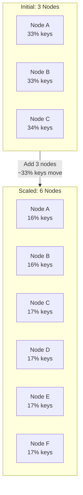
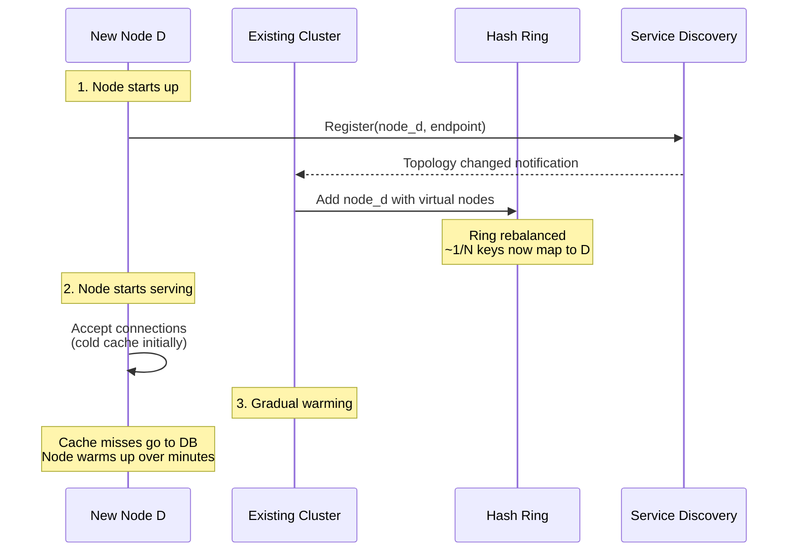
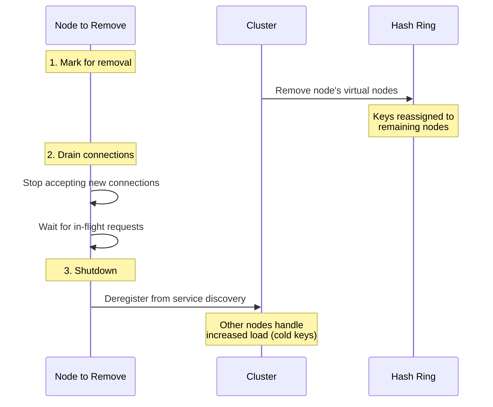
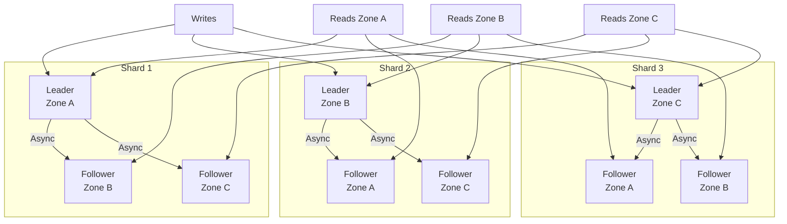
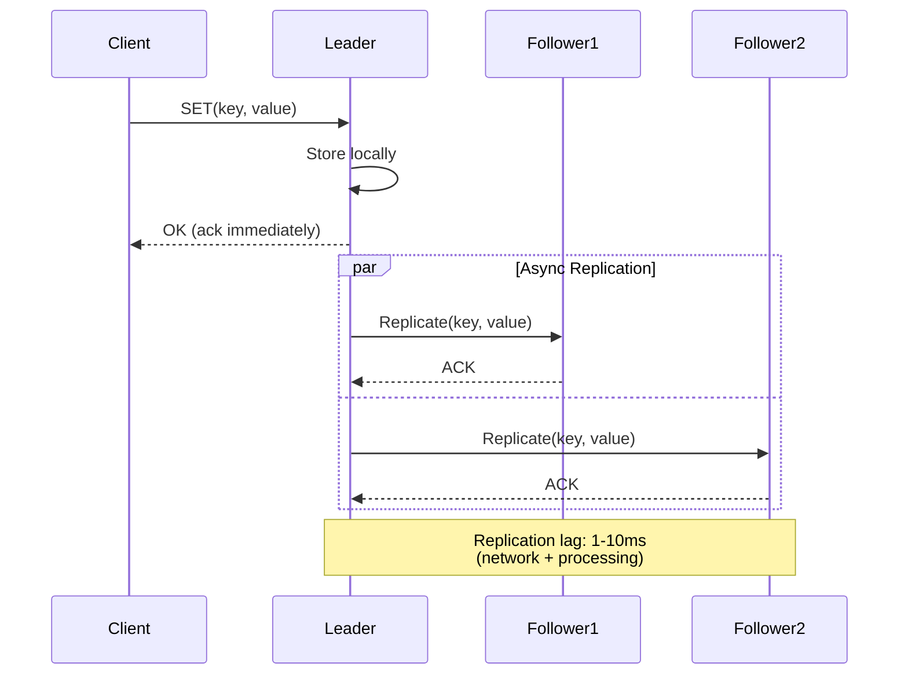
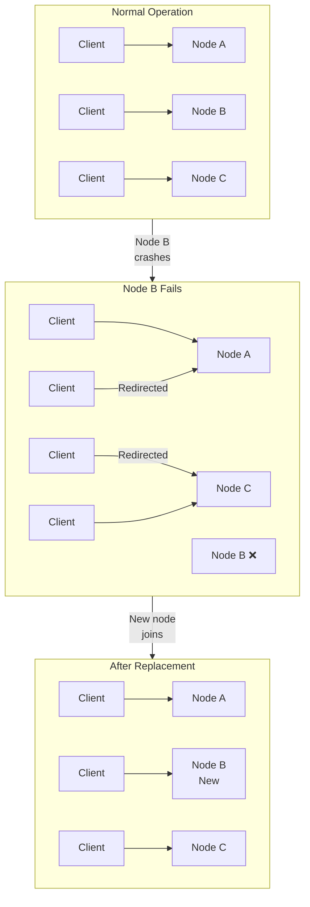
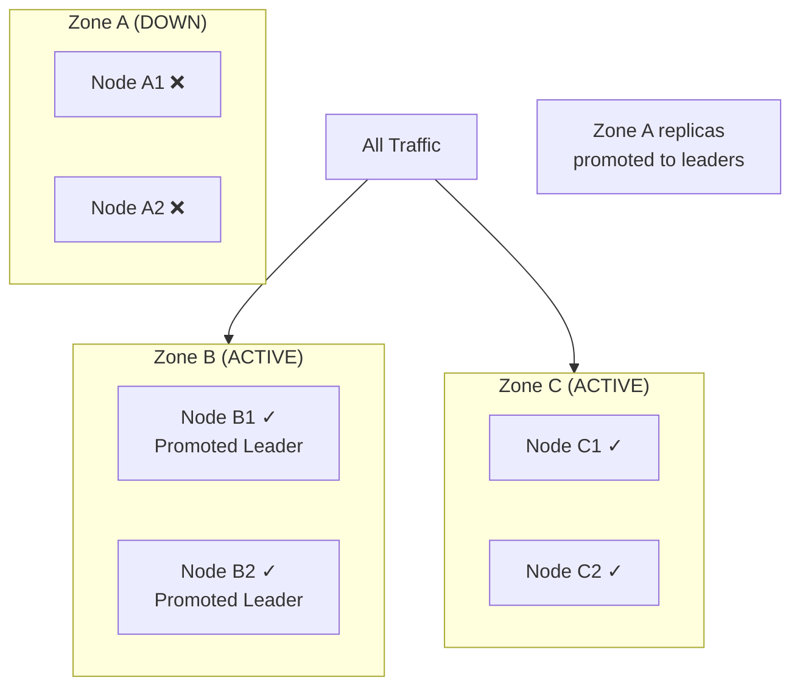
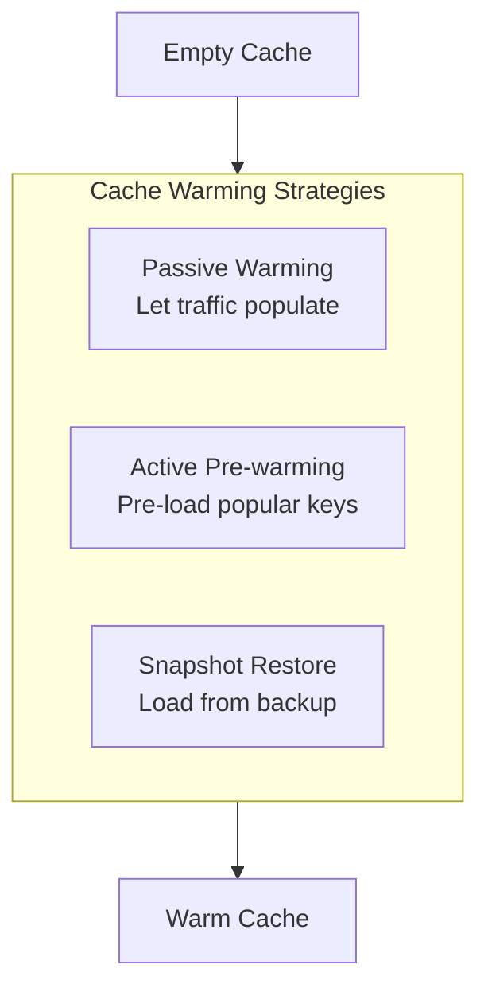
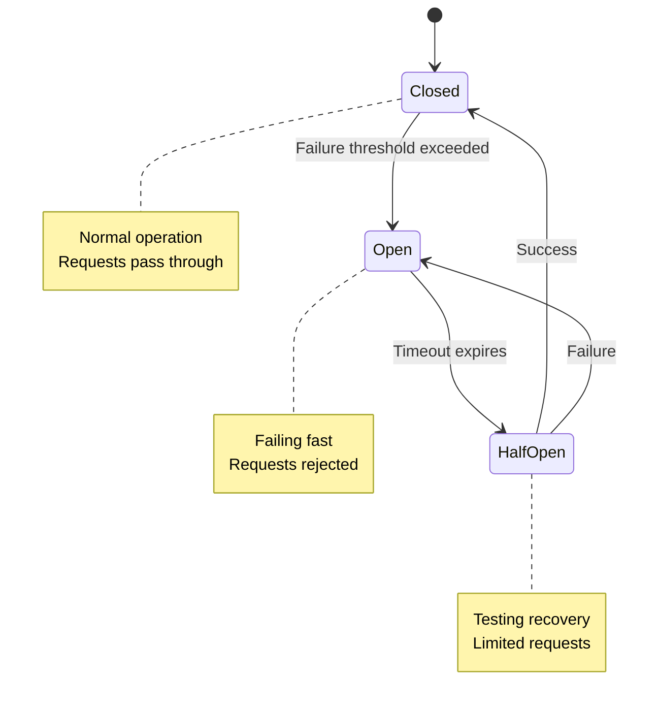

# Scalability and Reliability

[← Back to Index](./00-index.md)

---

## Scalability

### Horizontal vs Vertical Scaling

| Aspect | Horizontal (Scale Out) | Vertical (Scale Up) |
|--------|----------------------|---------------------|
| Approach | Add more nodes | Bigger machines |
| Capacity | Unlimited (in theory) | Hardware limits |
| Cost | Linear | Exponential at high end |
| Complexity | Higher (distributed) | Lower |
| Failure impact | Partial | Total node loss |
| **Recommendation** | **Primary strategy** | Optimization only |

### Horizontal Scaling Strategy



**Key difference from KV stores:** Cache data doesn't need to be migrated. Old data simply expires or gets evicted; new data is cached on the correct node.

### Adding Nodes (Scale Out)



**Scaling Impact:**

| Metric | Before (N nodes) | After (N+1 nodes) |
|--------|-----------------|-------------------|
| Keys per node | K/N | K/(N+1) |
| Keys moved | 0 | K/(N+1) ≈ ~3-10% typically |
| QPS per node | Q/N | Q/(N+1) |
| Temporary miss rate | Baseline | +1/(N+1) during warm-up |

### Removing Nodes (Scale Down)



### Auto-Scaling Configuration

```yaml
# Auto-scaling policy
auto_scaling:
  enabled: true

  scale_out:
    triggers:
      - metric: memory_usage_percent
        threshold: 75
        duration: 5m
      - metric: qps_per_node
        threshold: 45000
        duration: 5m
      - metric: latency_p99_ms
        threshold: 5
        duration: 3m

    action:
      increment: 2  # Add 2 nodes at a time
      cooldown: 10m

  scale_in:
    triggers:
      - metric: memory_usage_percent
        threshold: 30
        duration: 30m
      - metric: qps_per_node
        threshold: 15000
        duration: 30m

    action:
      decrement: 1  # Remove 1 node at a time
      cooldown: 30m

  limits:
    min_nodes: 6   # Minimum for redundancy
    max_nodes: 100
```

---

## Replication Strategy

### Leader-Follower Topology



### Replication Flow



### Replication Modes Comparison

| Mode | Write Ack | Durability | Latency | Use Case |
|------|-----------|------------|---------|----------|
| **Async (default)** | After local write | Best effort | Lowest | General caching |
| Semi-sync | After 1 replica | Higher | Medium | Important data |
| Sync | After all replicas | Highest | Highest | Critical data |

**Recommendation:** Asynchronous replication for distributed cache (cache is ephemeral anyway).

### Replication Lag Handling

```
┌─────────────────────────────────────────────────────────────┐
│                  REPLICATION LAG SCENARIOS                   │
├─────────────────────────────────────────────────────────────┤
│                                                              │
│  Scenario 1: Read-Your-Writes                               │
│  ─────────────────────────────                              │
│  User writes in Zone A, immediately reads in Zone B         │
│  → May see stale data (replication not yet complete)        │
│                                                              │
│  Mitigations:                                               │
│  • Sticky sessions (route to same zone)                     │
│  • Write-through to all replicas (higher latency)           │
│  • Accept eventual consistency (most common)                │
│                                                              │
│  Scenario 2: Failover During Lag                            │
│  ────────────────────────────────                           │
│  Leader fails before replicating recent writes              │
│  → Data loss of un-replicated writes                        │
│                                                              │
│  Mitigation:                                                │
│  • Accept for cache (can re-fetch from database)            │
│  • Use semi-sync for critical data                          │
│                                                              │
│  Monitoring:                                                 │
│  • Track replication_lag_ms metric                          │
│  • Alert if lag > 100ms consistently                        │
│                                                              │
└─────────────────────────────────────────────────────────────┘
```

---

## Fault Tolerance

### Single Point of Failure Analysis

| Component | SPOF? | Mitigation |
|-----------|-------|------------|
| Individual cache node | No | Consistent hashing redistributes |
| Single availability zone | No | Multi-AZ deployment |
| Cache proxy layer | No | Multiple proxies, health checks |
| Service discovery | Potential | Redundant discovery, local cache |
| Configuration service | Potential | Local config cache |
| **Entire cache cluster** | **Yes** | Fall back to database |

### Node Failure Handling



**Failure Detection:**

```
// Health check configuration
health_check:
  interval: 5s
  timeout: 2s
  unhealthy_threshold: 3  # 3 consecutive failures
  healthy_threshold: 2    # 2 consecutive successes

// Detection time: 5s × 3 = 15s worst case
```

**Impact and Recovery:**

| Event | Detection Time | Impact | Recovery |
|-------|---------------|--------|----------|
| Node crash | 15s | Misses for node's keys | Auto-redistribute |
| Network partition | 15s | Node unreachable | Failover to replica |
| Memory exhaustion | Immediate | High eviction | Scale up/out |
| Process hang | 15s (health check) | Timeouts | Restart |

### Zone Failure Handling



**Zone Failover Process:**

```
FUNCTION handle_zone_failure(failed_zone):
    // 1. Detect zone failure (multiple nodes down)
    failed_nodes = get_nodes_in_zone(failed_zone)
    IF all_unhealthy(failed_nodes):
        declare_zone_failure(failed_zone)

    // 2. Promote followers to leaders
    FOR shard IN shards_led_by_zone(failed_zone):
        new_leader = select_best_follower(shard)
        promote_to_leader(new_leader)

    // 3. Update routing
    update_routing_table()
    notify_clients()

    // 4. Monitor capacity
    IF remaining_capacity < threshold:
        alert("Capacity warning: single zone failure")
        trigger_scale_out()
```

---

## Disaster Recovery

### RTO/RPO for Cache

| Scenario | RPO | RTO | Rationale |
|----------|-----|-----|-----------|
| Node failure | N/A | Instant | No data loss concern for cache |
| Zone failure | N/A | < 1 min | Failover to replicas |
| Region failure | N/A | < 5 min | Failover to backup region |
| Full cache loss | N/A | Minutes | Reconstruct from source |

**Why RPO is N/A:** Cache is ephemeral. Data can always be re-fetched from the source of truth (database).

### Cold Start / Cache Warming

When cache is empty (new deployment, full failure recovery):



**Warming Strategies:**

| Strategy | Speed | Complexity | Use Case |
|----------|-------|------------|----------|
| **Passive** | Slow (minutes-hours) | None | Small caches, non-critical |
| **Active pre-warm** | Medium (minutes) | Medium | Known hot keys |
| **Snapshot restore** | Fast (seconds) | High | Large caches, fast recovery |

**Active Pre-warming Implementation:**

```
FUNCTION prewarm_cache(popular_keys_list):
    // Load popular keys in parallel batches
    batch_size = 100
    parallel_batches = 10

    FOR batch IN chunks(popular_keys_list, batch_size):
        parallel_do(parallel_batches):
            FOR key IN batch:
                value = database.get(key)
                cache.set(key, value, TTL)

        // Rate limit to avoid overwhelming database
        sleep(100ms)

    metrics.gauge("cache.prewarm.complete", 1)

// Popular keys can be identified from:
// - Access logs analysis
// - Previous period's hot keys
// - Business-critical entities
```

**Netflix EVCache Warming (Reference):**

Netflix uses EBS snapshots to warm petabytes of cache data:
1. Periodically snapshot cache to EBS
2. On new node, restore from snapshot
3. Node starts warm instead of cold

---

## Circuit Breaker Pattern

Protect backend from cascade failures when cache is degraded.



**Implementation:**

```
CLASS CircuitBreaker:
    state: CLOSED | OPEN | HALF_OPEN
    failure_count: int
    last_failure_time: timestamp
    success_count: int  // in HALF_OPEN state

    CONSTANTS:
        FAILURE_THRESHOLD = 5
        TIMEOUT = 30s
        HALF_OPEN_MAX_REQUESTS = 3

    FUNCTION execute(operation):
        IF state == OPEN:
            IF now() - last_failure_time > TIMEOUT:
                state = HALF_OPEN
                success_count = 0
            ELSE:
                RAISE CircuitOpenException

        TRY:
            result = operation()

            IF state == HALF_OPEN:
                success_count += 1
                IF success_count >= HALF_OPEN_MAX_REQUESTS:
                    state = CLOSED
                    failure_count = 0

            RETURN result

        CATCH Exception:
            failure_count += 1
            last_failure_time = now()

            IF failure_count >= FAILURE_THRESHOLD:
                state = OPEN

            RAISE
```

---

## Graceful Degradation

### Degradation Levels

```
┌─────────────────────────────────────────────────────────────┐
│                  GRACEFUL DEGRADATION LEVELS                 │
├─────────────────────────────────────────────────────────────┤
│                                                              │
│  Level 0: Normal Operation                                   │
│  ├── Full cache functionality                               │
│  └── All features enabled                                   │
│                                                              │
│  Level 1: Reduced Freshness                                  │
│  ├── Extend TTLs to reduce DB load                          │
│  ├── Serve stale data longer                                │
│  └── Disable non-critical invalidations                     │
│                                                              │
│  Level 2: Reduced Features                                   │
│  ├── Disable Multi-GET (individual only)                    │
│  ├── Disable cache statistics collection                    │
│  └── Increase client timeouts                               │
│                                                              │
│  Level 3: Emergency Mode                                     │
│  ├── Cache bypass for non-critical paths                    │
│  ├── Serve only from healthy nodes                          │
│  └── Rate limit cache operations                            │
│                                                              │
│  Level 4: Complete Bypass                                    │
│  ├── All requests go to database                            │
│  ├── Cache completely bypassed                              │
│  └── Database must handle full load                         │
│                                                              │
└─────────────────────────────────────────────────────────────┘
```

### Implementing Degradation

```
FUNCTION get_with_degradation(key):
    degradation_level = get_current_degradation_level()

    IF degradation_level >= 4:
        // Complete bypass
        RETURN fetch_from_database(key)

    TRY:
        IF degradation_level >= 3:
            // Use shorter timeout, limited retries
            result = cache.get(key, timeout=100ms, retries=0)
        ELSE:
            result = cache.get(key)

        IF result IS NOT null:
            RETURN result

    CATCH CacheException:
        IF degradation_level >= 2:
            // Don't retry on cache failure
            RETURN fetch_from_database(key)
        RAISE

    // Cache miss
    RETURN fetch_from_database(key)
```

---

## Load Shedding

Protect system by rejecting excess load during overload.

```
FUNCTION handle_request_with_shedding(request):
    current_load = get_current_qps()
    capacity = get_node_capacity()

    IF current_load > capacity * 0.9:
        // Over 90% capacity - start shedding
        shed_probability = (current_load - capacity * 0.9) / (capacity * 0.1)

        IF random() < shed_probability:
            metrics.increment("cache.shed")
            RAISE LoadShedError("Service overloaded")

    RETURN process_request(request)

// Client should handle LoadShedError:
// - Retry with exponential backoff
// - Fall back to database
// - Return cached/stale response if available
```

---

## Cost Optimization

### Right-Sizing

```
┌─────────────────────────────────────────────────────────────┐
│                    COST OPTIMIZATION                         │
├─────────────────────────────────────────────────────────────┤
│                                                              │
│  Memory Efficiency:                                          │
│  ├── Target memory utilization: 70-80%                      │
│  ├── Below 50%: Over-provisioned, scale down                │
│  └── Above 90%: Under-provisioned, high eviction            │
│                                                              │
│  Instance Selection:                                         │
│  ├── Memory-optimized instances (r6g, r5)                   │
│  ├── Avoid compute-heavy instances                          │
│  └── Consider spot/preemptible for non-critical             │
│                                                              │
│  Value Optimization:                                         │
│  ├── Compress values > 1KB                                  │
│  ├── Don't cache what won't be re-accessed                  │
│  └── Shorter TTLs for low-value data                        │
│                                                              │
│  Example Savings:                                            │
│  ├── 30 nodes × $0.50/hr = $10,800/month                    │
│  ├── Right-sized to 20 nodes: $7,200/month                  │
│  └── Savings: $3,600/month (33%)                            │
│                                                              │
└─────────────────────────────────────────────────────────────┘
```

### Cost vs Performance Trade-offs

| Decision | Lower Cost | Higher Performance |
|----------|------------|-------------------|
| Replication factor | RF=1 | RF=3 |
| Instance size | Smaller, more nodes | Larger, fewer nodes |
| Eviction policy | Aggressive TTL | Keep longer |
| Compression | CPU overhead | Network savings |
