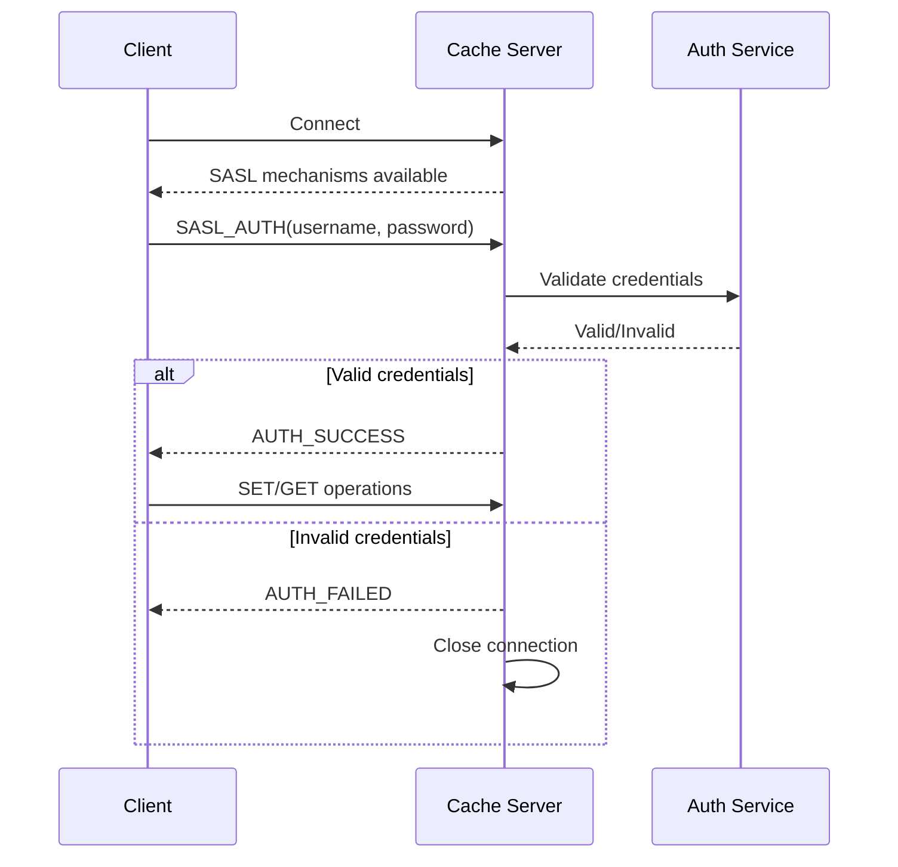
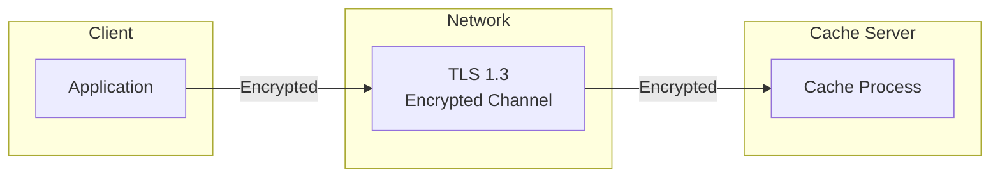
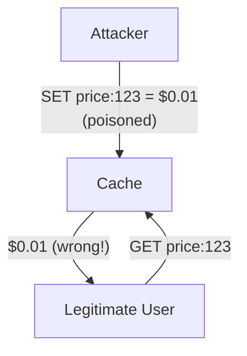
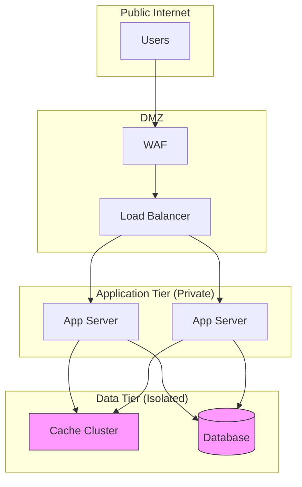

# Security and Compliance

[← Back to Index](./00-index.md)

---

## Authentication

### Authentication Mechanisms

| Method | Description | Strength | Use Case |
|--------|-------------|----------|----------|
| **None** | No authentication | None | Internal trusted network only |
| **Password (SASL)** | Username/password | Medium | Basic security |
| **TLS Client Certs** | Mutual TLS | High | Zero-trust environments |
| **IAM-based** | Cloud IAM integration | High | Cloud deployments |
| **Token-based** | Short-lived tokens | High | Service-to-service |

### SASL Authentication Flow



### TLS Configuration

```yaml
# Server TLS configuration
tls:
  enabled: true
  cert_file: /etc/cache/server.crt
  key_file: /etc/cache/server.key
  ca_file: /etc/cache/ca.crt

  # Mutual TLS (client certificate required)
  client_auth: require

  # Minimum TLS version
  min_version: TLS1.3

  # Cipher suites (TLS 1.3)
  cipher_suites:
    - TLS_AES_256_GCM_SHA384
    - TLS_CHACHA20_POLY1305_SHA256
    - TLS_AES_128_GCM_SHA256
```

### Multi-Layer Authentication

```
┌─────────────────────────────────────────────────────────────┐
│                  AUTHENTICATION LAYERS                       │
├─────────────────────────────────────────────────────────────┤
│                                                              │
│  Layer 1: Network Level                                      │
│  ├── VPC/Network isolation                                  │
│  ├── Security groups/firewall rules                         │
│  └── Private endpoints (no public access)                   │
│                                                              │
│  Layer 2: Transport Level                                    │
│  ├── TLS 1.3 encryption                                     │
│  ├── Certificate validation                                 │
│  └── Mutual TLS (optional)                                  │
│                                                              │
│  Layer 3: Application Level                                  │
│  ├── SASL authentication                                    │
│  ├── Token validation                                       │
│  └── API key verification                                   │
│                                                              │
│  Layer 4: Request Level                                      │
│  ├── Namespace/keyspace isolation                           │
│  ├── Operation permissions                                  │
│  └── Rate limiting per client                               │
│                                                              │
└─────────────────────────────────────────────────────────────┘
```

---

## Authorization

### Authorization Models

| Model | Description | Granularity | Complexity |
|-------|-------------|-------------|------------|
| **All or Nothing** | Authenticated = full access | None | Lowest |
| **Namespace-based** | Access to specific namespaces | Medium | Low |
| **RBAC** | Role-based permissions | High | Medium |
| **ABAC** | Attribute-based policies | Highest | High |

### Role-Based Access Control (RBAC)

```yaml
# Role definitions
roles:
  admin:
    permissions:
      - read
      - write
      - delete
      - flush
      - stats
      - config
    namespaces: ["*"]

  service_writer:
    permissions:
      - read
      - write
      - delete
    namespaces: ["products", "sessions"]

  service_reader:
    permissions:
      - read
    namespaces: ["products"]

  monitoring:
    permissions:
      - stats
    namespaces: ["*"]

# User/service assignments
users:
  product_service:
    role: service_writer
    namespaces: ["products"]

  analytics_service:
    role: service_reader
    namespaces: ["products"]

  ops_team:
    role: admin
```

### Permission Enforcement

```
FUNCTION authorize_operation(client, operation, key):
    // Extract namespace from key
    namespace = extract_namespace(key)  // e.g., "products:123" -> "products"

    // Get client's role
    role = get_client_role(client)

    // Check namespace access
    IF namespace NOT IN role.allowed_namespaces AND "*" NOT IN role.allowed_namespaces:
        RETURN DENIED("Namespace access denied")

    // Check operation permission
    IF operation NOT IN role.permissions:
        RETURN DENIED("Operation not permitted")

    RETURN ALLOWED
```

---

## Data Security

### Encryption Strategy

| Layer | Encryption | Implementation |
|-------|------------|----------------|
| **In Transit** | Required | TLS 1.3 |
| **At Rest** | Optional | Not typical for in-memory cache |
| **In Memory** | Not practical | Performance impact |

### Encryption in Transit



### Sensitive Data Handling

```
┌─────────────────────────────────────────────────────────────┐
│              SENSITIVE DATA HANDLING                         │
├─────────────────────────────────────────────────────────────┤
│                                                              │
│  DO NOT CACHE:                                              │
│  ├── Raw passwords or credentials                           │
│  ├── Full credit card numbers                               │
│  ├── Social Security Numbers                                │
│  ├── Private encryption keys                                │
│  └── Healthcare records (PHI)                               │
│                                                              │
│  CACHE WITH CAUTION (with TTL):                             │
│  ├── Session tokens (short TTL, <15 min)                    │
│  ├── User profile data (medium TTL)                         │
│  ├── API response data (check for PII)                      │
│  └── Tokenized/masked values only                           │
│                                                              │
│  SAFE TO CACHE:                                              │
│  ├── Product catalog data                                   │
│  ├── Configuration data                                     │
│  ├── Aggregated statistics                                  │
│  └── Public content                                         │
│                                                              │
└─────────────────────────────────────────────────────────────┘
```

### PII Tokenization

```
// Instead of caching raw PII:
WRONG:  cache.set("user:123", {email: "john@example.com", ssn: "123-45-6789"})

// Cache tokenized version:
CORRECT: cache.set("user:123", {email_token: "tok_abc123", ssn_token: "tok_def456"})

// Or cache only non-sensitive fields:
CORRECT: cache.set("user:123:public", {name: "John", member_since: 2020})
```

---

## Threat Model

### Threat Analysis

| Threat | Impact | Likelihood | Mitigation |
|--------|--------|------------|------------|
| **Cache Poisoning** | High | Medium | Input validation, signed values |
| **Key Enumeration** | Medium | Medium | Disable KEYS command, random prefixes |
| **Data Exfiltration** | High | Low | Encryption, access logging |
| **DoS via Large Values** | Medium | Medium | Max value size limits |
| **Connection Exhaustion** | Medium | Medium | Connection limits, rate limiting |
| **Memory Exhaustion** | Medium | Medium | Memory limits, eviction policies |

### Threat 1: Cache Poisoning

**Attack:** Malicious actor injects false data into cache.



**Mitigations:**

| Mitigation | Implementation |
|------------|----------------|
| Authentication | Require auth for all writes |
| Write permission | Only trusted services can write |
| Value signing | Cryptographically sign values |
| Input validation | Validate before caching |
| Audit logging | Log all write operations |

**Value Signing:**

```
FUNCTION set_signed(key, value, secret_key):
    serialized = serialize(value)
    signature = hmac_sha256(serialized, secret_key)
    signed_value = {data: serialized, sig: signature}
    cache.set(key, signed_value)

FUNCTION get_verified(key, secret_key):
    signed_value = cache.get(key)
    IF signed_value IS null:
        RETURN null

    expected_sig = hmac_sha256(signed_value.data, secret_key)
    IF signed_value.sig != expected_sig:
        metrics.increment("cache.signature_mismatch")
        cache.delete(key)  // Remove poisoned entry
        RETURN null

    RETURN deserialize(signed_value.data)
```

### Threat 2: Key Enumeration

**Attack:** Attacker discovers cached keys to learn about data.

**Mitigations:**

| Mitigation | Implementation |
|------------|----------------|
| Disable KEYS command | Block `KEYS *` and `SCAN` |
| Random key prefixes | `cache:{random}:user:123` |
| Namespace isolation | Clients only see their namespace |
| No error messages | Don't reveal key existence in errors |

### Threat 3: Denial of Service

```
┌─────────────────────────────────────────────────────────────┐
│                    DoS PROTECTION                            │
├─────────────────────────────────────────────────────────────┤
│                                                              │
│  1. Connection Limits                                        │
│     max_connections_per_client: 100                          │
│     max_total_connections: 10000                             │
│                                                              │
│  2. Rate Limiting                                            │
│     requests_per_second_per_client: 10000                    │
│     requests_per_second_total: 500000                        │
│                                                              │
│  3. Size Limits                                              │
│     max_key_size: 250 bytes                                  │
│     max_value_size: 1 MB                                     │
│     max_batch_size: 100 keys                                 │
│                                                              │
│  4. Timeout Protection                                       │
│     connection_timeout: 10s                                  │
│     idle_connection_timeout: 300s                            │
│     request_timeout: 5s                                      │
│                                                              │
└─────────────────────────────────────────────────────────────┘
```

---

## Network Security

### Network Isolation



### Security Group Rules

```yaml
# Cache cluster security group
cache_security_group:
  inbound:
    - protocol: TCP
      port: 11211  # Memcached
      source: app_security_group

    - protocol: TCP
      port: 6379  # Redis
      source: app_security_group

    - protocol: TCP
      port: 9100  # Metrics
      source: monitoring_security_group

  outbound:
    - protocol: TCP
      port: 443
      destination: 0.0.0.0/0  # For cloud metadata, service discovery
```

---

## Audit and Compliance

### Audit Logging

```yaml
# Audit log configuration
audit:
  enabled: true

  events:
    - authentication_success
    - authentication_failure
    - authorization_denied
    - config_change
    - flush_operation
    - admin_operation

  # Sampling for high-volume operations (optional)
  sample_data_operations: 0.01  # 1% of GET/SET

  format: json
  destination: /var/log/cache/audit.log

  fields:
    - timestamp
    - client_ip
    - client_id
    - operation
    - key_pattern  # Masked key, not full key
    - result
    - latency_ms
```

**Audit Log Entry Example:**

```json
{
  "timestamp": "2025-01-15T10:30:00Z",
  "client_ip": "10.0.1.50",
  "client_id": "product_service",
  "operation": "SET",
  "key_pattern": "products:*",
  "result": "success",
  "latency_ms": 0.5,
  "namespace": "products"
}
```

### Compliance Considerations

| Framework | Cache Relevance | Requirements |
|-----------|----------------|--------------|
| **SOC 2** | Medium | Access controls, audit logging, encryption |
| **PCI-DSS** | High (if card data) | Don't cache card data, encryption, access logs |
| **HIPAA** | High (if PHI) | Don't cache PHI, or strong encryption + audit |
| **GDPR** | Medium | Right to deletion, data minimization |

### GDPR Right to Deletion

```
FUNCTION handle_gdpr_deletion(user_id):
    // Delete all cached data for user
    patterns = [
        "user:" + user_id + ":*",
        "session:*:" + user_id,
        "*:user:" + user_id
    ]

    FOR pattern IN patterns:
        keys = find_keys_matching(pattern)  // Admin operation
        FOR key IN keys:
            cache.delete(key)

    // Log deletion for compliance
    audit_log({
        event: "gdpr_deletion",
        user_id: user_id,
        timestamp: now()
    })
```

---

## Key Management

### API Key / Token Management

```
┌─────────────────────────────────────────────────────────────┐
│                  API KEY LIFECYCLE                           │
├─────────────────────────────────────────────────────────────┤
│                                                              │
│  1. Generation                                              │
│     ├── Cryptographically secure random                     │
│     ├── Minimum 32 bytes entropy                            │
│     └── Prefix for identification (e.g., "cc_live_")        │
│                                                              │
│  2. Storage                                                  │
│     ├── Hash stored, not plaintext                          │
│     ├── Salt per key                                        │
│     └── Secure key management system                        │
│                                                              │
│  3. Rotation                                                 │
│     ├── Maximum lifetime: 90 days                           │
│     ├── Grace period for old keys: 7 days                   │
│     └── Automated rotation where possible                   │
│                                                              │
│  4. Revocation                                               │
│     ├── Immediate effect                                    │
│     ├── Audit log entry                                     │
│     └── Notify affected services                            │
│                                                              │
└─────────────────────────────────────────────────────────────┘
```

### Secret Rotation

```
FUNCTION rotate_cache_credentials():
    // 1. Generate new credentials
    new_password = generate_secure_password()

    // 2. Configure cache to accept both old and new
    cache_config.set("auth.password.new", hash(new_password))
    cache_config.set("auth.accept_old", true)

    // 3. Update clients (gradual rollout)
    FOR service IN services:
        update_service_credentials(service, new_password)

    // 4. Wait for propagation
    wait(propagation_period)

    // 5. Disable old credentials
    cache_config.set("auth.accept_old", false)
    cache_config.remove("auth.password.old")

    audit_log({event: "credential_rotation", timestamp: now()})
```
