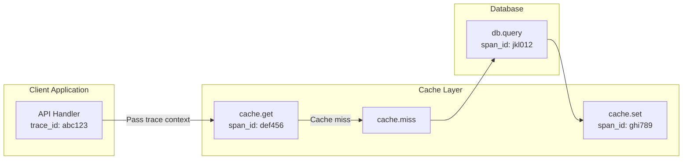

# Observability

[← Back to Index](./00-index.md)

---

## Overview

Observability for a distributed cache focuses on three pillars:
1. **Metrics** - Quantitative measurements (hit rate, latency, memory)
2. **Logs** - Discrete events (errors, config changes)
3. **Traces** - Request flow across services

---

## Metrics

### Cache-Specific Metrics (Most Important)

| Metric | Description | Alert Threshold | Why It Matters |
|--------|-------------|-----------------|----------------|
| **Hit Rate** | cache_hits / (cache_hits + cache_misses) | < 90% warning, < 80% critical | Core cache effectiveness |
| **Eviction Rate** | Evictions per second | Sudden spike | Memory pressure indicator |
| **Memory Usage** | Used / Allocated | > 85% warning, > 95% critical | Capacity planning |
| **Latency (p99)** | 99th percentile response time | > 2ms warning, > 5ms critical | User experience |

### RED Metrics (Request-focused)

```
┌─────────────────────────────────────────────────────────────┐
│                      RED METRICS                             │
├─────────────────────────────────────────────────────────────┤
│                                                              │
│  R - Rate (Request throughput)                              │
│  ├── cache_requests_total{operation="get"}                  │
│  ├── cache_requests_total{operation="set"}                  │
│  ├── cache_requests_total{operation="delete"}               │
│  └── cache_requests_per_second (derived)                    │
│                                                              │
│  E - Errors (Failure rate)                                  │
│  ├── cache_errors_total{type="timeout"}                     │
│  ├── cache_errors_total{type="connection"}                  │
│  ├── cache_errors_total{type="oom"}                         │
│  └── cache_error_rate = errors / requests                   │
│                                                              │
│  D - Duration (Latency)                                     │
│  ├── cache_request_duration_seconds{quantile="0.5"}         │
│  ├── cache_request_duration_seconds{quantile="0.95"}        │
│  ├── cache_request_duration_seconds{quantile="0.99"}        │
│  └── cache_request_duration_seconds{quantile="0.999"}       │
│                                                              │
└─────────────────────────────────────────────────────────────┘
```

### USE Metrics (Resource-focused)

```
┌─────────────────────────────────────────────────────────────┐
│                      USE METRICS                             │
├─────────────────────────────────────────────────────────────┤
│                                                              │
│  U - Utilization (% of capacity used)                       │
│  ├── cache_memory_used_bytes / cache_memory_max_bytes       │
│  ├── cache_connections_current / cache_connections_max      │
│  └── cache_cpu_usage_percent                                │
│                                                              │
│  S - Saturation (Work being queued)                         │
│  ├── cache_connection_queue_length                          │
│  ├── cache_replication_lag_seconds                          │
│  └── cache_pending_operations                               │
│                                                              │
│  E - Errors (Error counts)                                  │
│  ├── cache_connection_errors_total                          │
│  ├── cache_replication_errors_total                         │
│  └── cache_internal_errors_total                            │
│                                                              │
└─────────────────────────────────────────────────────────────┘
```

### Business Metrics

| Metric | Description | Purpose |
|--------|-------------|---------|
| `cache_savings_requests` | Requests served from cache | Cost justification |
| `cache_backend_load_reduction` | % reduction in DB queries | Impact measurement |
| `cache_cost_per_million_requests` | Infrastructure cost metric | Efficiency tracking |

### Prometheus Metrics Example

```yaml
# HELP cache_hits_total Total number of cache hits
# TYPE cache_hits_total counter
cache_hits_total{node="cache-1",namespace="products"} 1234567

# HELP cache_misses_total Total number of cache misses
# TYPE cache_misses_total counter
cache_misses_total{node="cache-1",namespace="products"} 65432

# HELP cache_evictions_total Total number of evictions
# TYPE cache_evictions_total counter
cache_evictions_total{node="cache-1",reason="lru"} 12345
cache_evictions_total{node="cache-1",reason="ttl"} 5678

# HELP cache_memory_bytes Current memory usage
# TYPE cache_memory_bytes gauge
cache_memory_bytes{node="cache-1"} 21474836480

# HELP cache_memory_max_bytes Maximum memory allocation
# TYPE cache_memory_max_bytes gauge
cache_memory_max_bytes{node="cache-1"} 25769803776

# HELP cache_items_total Current number of cached items
# TYPE cache_items_total gauge
cache_items_total{node="cache-1"} 2345678

# HELP cache_request_duration_seconds Request latency histogram
# TYPE cache_request_duration_seconds histogram
cache_request_duration_seconds_bucket{operation="get",le="0.0001"} 500000
cache_request_duration_seconds_bucket{operation="get",le="0.0005"} 900000
cache_request_duration_seconds_bucket{operation="get",le="0.001"} 980000
cache_request_duration_seconds_bucket{operation="get",le="0.005"} 995000
cache_request_duration_seconds_bucket{operation="get",le="+Inf"} 1000000

# HELP cache_connections_current Current active connections
# TYPE cache_connections_current gauge
cache_connections_current{node="cache-1"} 450

# HELP cache_replication_lag_seconds Replication lag to followers
# TYPE cache_replication_lag_seconds gauge
cache_replication_lag_seconds{leader="cache-1",follower="cache-2"} 0.003
```

---

## Dashboards

### Overview Dashboard

```
┌─────────────────────────────────────────────────────────────────────────┐
│                    CACHE CLUSTER OVERVIEW                                │
├─────────────────────────────────────────────────────────────────────────┤
│                                                                          │
│  ┌──────────────┐  ┌──────────────┐  ┌──────────────┐  ┌──────────────┐ │
│  │   HIT RATE   │  │     QPS      │  │   LATENCY    │  │    MEMORY    │ │
│  │    97.2%     │  │    450K      │  │   0.8ms p99  │  │     72%      │ │
│  │   ✓ Good     │  │   ✓ Normal   │  │   ✓ Good     │  │   ✓ Normal   │ │
│  └──────────────┘  └──────────────┘  └──────────────┘  └──────────────┘ │
│                                                                          │
│  ┌─────────────────────────────────────────────────────────────────────┐│
│  │  Hit Rate Over Time (24h)                                           ││
│  │  100% ─────────────────────────────────────────────────────────     ││
│  │   95% ─ ─ ─ ─ ─ ─ ─ ─ ─ ─ ─ ─ ─ ─ ─ ─ ─ ─ ─ ─ ─ ─ ─ ─ ─ ─ ─ ─     ││
│  │   90% ═════════════════════════════════════════════════════════     ││
│  │        00:00    04:00    08:00    12:00    16:00    20:00           ││
│  └─────────────────────────────────────────────────────────────────────┘│
│                                                                          │
│  ┌─────────────────────────────────────────────────────────────────────┐│
│  │  Latency Distribution (p50, p95, p99)                               ││
│  │  5ms  ┤                                                              ││
│  │  2ms  ┤                           ▄▄▄                                ││
│  │  1ms  ┤       ████████████████████████████████████  ← p99           ││
│  │  0.5ms┤  █████████████████████████████████████████  ← p95           ││
│  │  0ms  ┼───────────────────────────────────────────  ← p50           ││
│  └─────────────────────────────────────────────────────────────────────┘│
│                                                                          │
│  ┌──────────────────────────────┐  ┌──────────────────────────────────┐ │
│  │  Node Health                 │  │  Top Namespaces by Traffic       │ │
│  │  cache-1  ✓ healthy  15% CPU │  │  products     45%  ████████████  │ │
│  │  cache-2  ✓ healthy  18% CPU │  │  sessions     30%  ████████      │ │
│  │  cache-3  ✓ healthy  12% CPU │  │  users        15%  ████          │ │
│  │  cache-4  ✓ healthy  16% CPU │  │  config        5%  █             │ │
│  │  cache-5  ⚠ high mem 14% CPU │  │  other         5%  █             │ │
│  └──────────────────────────────┘  └──────────────────────────────────┘ │
│                                                                          │
└─────────────────────────────────────────────────────────────────────────┘
```

### Performance Dashboard

```
┌─────────────────────────────────────────────────────────────────────────┐
│                    CACHE PERFORMANCE                                     │
├─────────────────────────────────────────────────────────────────────────┤
│                                                                          │
│  Operations per Second by Type                                           │
│  ┌─────────────────────────────────────────────────────────────────────┐│
│  │  GET:     420,000/s  ██████████████████████████████████████████     ││
│  │  SET:      25,000/s  ███                                            ││
│  │  DELETE:    5,000/s  █                                              ││
│  └─────────────────────────────────────────────────────────────────────┘│
│                                                                          │
│  Latency Heatmap by Node                                                │
│  ┌─────────────────────────────────────────────────────────────────────┐│
│  │         0.1ms   0.5ms   1ms    2ms    5ms    10ms                   ││
│  │  cache-1  ████████░░░░░░░░░░░░░░░░░░░░░░░░░░░░░                     ││
│  │  cache-2  █████████░░░░░░░░░░░░░░░░░░░░░░░░░░░░                     ││
│  │  cache-3  ████████░░░░░░░░░░░░░░░░░░░░░░░░░░░░░                     ││
│  │  cache-4  ██████████░░░░░░░░░░░░░░░░░░░░░░░░░░░                     ││
│  │  cache-5  ████████████░░░░░░░░░░░░░░░░░░░░░░░░░   ← slower         ││
│  └─────────────────────────────────────────────────────────────────────┘│
│                                                                          │
│  Cache Efficiency                                                        │
│  ┌────────────────────────┐  ┌────────────────────────────────────────┐ │
│  │  Hit/Miss Ratio        │  │  Evictions                             │ │
│  │                        │  │                                        │ │
│  │    Hits: 97.2%         │  │   LRU:      120/s  ██████              │ │
│  │    ████████████████████│  │   TTL:       45/s  ██                  │ │
│  │    Misses: 2.8%        │  │   Explicit:  10/s  █                   │ │
│  │    ░░                  │  │                                        │ │
│  └────────────────────────┘  └────────────────────────────────────────┘ │
│                                                                          │
└─────────────────────────────────────────────────────────────────────────┘
```

### Capacity Dashboard

```
┌─────────────────────────────────────────────────────────────────────────┐
│                    CAPACITY PLANNING                                     │
├─────────────────────────────────────────────────────────────────────────┤
│                                                                          │
│  Memory Usage by Node                                                    │
│  ┌─────────────────────────────────────────────────────────────────────┐│
│  │  cache-1  [██████████████████████████████░░░░░░░░░]  75%  18GB/24GB ││
│  │  cache-2  [████████████████████████████░░░░░░░░░░░]  70%  17GB/24GB ││
│  │  cache-3  [██████████████████████████████████░░░░░]  85%  20GB/24GB ││
│  │  cache-4  [██████████████████████████░░░░░░░░░░░░░]  65%  16GB/24GB ││
│  │  cache-5  [████████████████████████████████████░░░]  90%  22GB/24GB ││
│  └─────────────────────────────────────────────────────────────────────┘│
│                                                                          │
│  Growth Projection (30 days)                                             │
│  ┌─────────────────────────────────────────────────────────────────────┐│
│  │  100% ┤                                          ░░░░░ projected    ││
│  │   80% ┤                               ▄▄▄▄▄▄▄▄▄▄░░░░░░              ││
│  │   60% ┤          ▄▄▄▄▄▄▄▄▄▄▄▄▄▄▄▄▄▄▄██████████████                  ││
│  │   40% ┤  ▄▄▄▄▄▄▄██████████████████████████████████                  ││
│  │   20% ┼────────────────────────────────────────────                 ││
│  │        Day 1    Day 10    Day 20    Day 30                          ││
│  └─────────────────────────────────────────────────────────────────────┘│
│                                                                          │
│  Recommendation: Add 2 nodes within 14 days to maintain 80% threshold   │
│                                                                          │
└─────────────────────────────────────────────────────────────────────────┘
```

---

## Logging

### Log Levels Strategy

| Level | Events | Sampling |
|-------|--------|----------|
| **ERROR** | Connection failures, OOM, data corruption | 100% |
| **WARN** | High eviction rate, slow queries, approaching limits | 100% |
| **INFO** | Config changes, node joins/leaves, rebalancing | 100% |
| **DEBUG** | Individual requests, replication details | 1% sample |

### Structured Log Format

```json
{
  "timestamp": "2025-01-15T10:30:00.123Z",
  "level": "WARN",
  "service": "cache",
  "node": "cache-3",
  "event": "high_eviction_rate",
  "details": {
    "evictions_per_second": 500,
    "threshold": 100,
    "memory_used_percent": 92,
    "top_evicted_namespace": "sessions"
  },
  "trace_id": "abc123def456"
}
```

### Log Events to Capture

```
┌─────────────────────────────────────────────────────────────┐
│                    LOG EVENTS                                │
├─────────────────────────────────────────────────────────────┤
│                                                              │
│  Operational Events (INFO):                                  │
│  ├── cache.started                                          │
│  ├── cache.stopped                                          │
│  ├── node.joined{node_id, address}                          │
│  ├── node.left{node_id, reason}                             │
│  ├── rebalance.started                                      │
│  ├── rebalance.completed{duration, keys_moved}              │
│  └── config.changed{setting, old_value, new_value}          │
│                                                              │
│  Warning Events (WARN):                                      │
│  ├── memory.high{used_percent, threshold}                   │
│  ├── eviction.rate_high{rate, threshold}                    │
│  ├── latency.high{p99, threshold}                           │
│  ├── connection.pool_exhausted                              │
│  └── replication.lag_high{lag_ms, threshold}                │
│                                                              │
│  Error Events (ERROR):                                       │
│  ├── connection.failed{client, reason}                      │
│  ├── replication.failed{target, error}                      │
│  ├── oom.occurred{requested_bytes}                          │
│  └── internal.error{component, error}                       │
│                                                              │
└─────────────────────────────────────────────────────────────┘
```

---

## Distributed Tracing

### Trace Propagation



### Key Spans to Instrument

| Span Name | Attributes | Purpose |
|-----------|------------|---------|
| `cache.get` | key, namespace, hit/miss | Read latency |
| `cache.set` | key, namespace, value_size | Write latency |
| `cache.delete` | key, namespace | Delete latency |
| `cache.multi_get` | key_count, hit_count | Batch performance |
| `cache.miss.fetch` | key, backend | Miss handling time |
| `cache.replicate` | target_node, batch_size | Replication overhead |

### Trace Attributes

```yaml
# OpenTelemetry span attributes for cache operations
span_attributes:
  # Common
  cache.system: "distributed_lru_cache"
  cache.node: "cache-3"
  cache.namespace: "products"

  # Operation-specific
  cache.operation: "get"
  cache.key: "product:12345"  # Consider hashing for privacy
  cache.hit: true
  cache.value_size_bytes: 2048

  # Timing
  cache.queue_time_ms: 0.1
  cache.process_time_ms: 0.3

  # Error (if applicable)
  cache.error: true
  cache.error_type: "timeout"
```

---

## Alerting

### Alert Hierarchy

```
┌─────────────────────────────────────────────────────────────┐
│                    ALERT SEVERITY LEVELS                     │
├─────────────────────────────────────────────────────────────┤
│                                                              │
│  P1 - CRITICAL (Page immediately)                           │
│  ├── Cache cluster unavailable                              │
│  ├── Memory > 95% on majority of nodes                      │
│  ├── Hit rate < 50% (severe degradation)                    │
│  └── All replicas for a shard down                          │
│                                                              │
│  P2 - HIGH (Page during business hours)                     │
│  ├── Memory > 90% on any node                               │
│  ├── Hit rate < 80%                                         │
│  ├── Latency p99 > 10ms sustained                           │
│  └── Node down without automatic failover                   │
│                                                              │
│  P3 - MEDIUM (Ticket, next business day)                    │
│  ├── Memory > 85% on any node                               │
│  ├── Hit rate < 90%                                         │
│  ├── Eviction rate spike                                    │
│  └── Replication lag > 1 second                             │
│                                                              │
│  P4 - LOW (Weekly review)                                   │
│  ├── Capacity trending toward limits                        │
│  ├── Configuration drift                                    │
│  └── Performance baseline changes                           │
│                                                              │
└─────────────────────────────────────────────────────────────┘
```

### Alert Definitions

```yaml
alerts:
  # Critical
  - name: CacheClusterDown
    severity: critical
    condition: up{job="cache"} == 0 for 2m
    runbook: /runbooks/cache-cluster-down.md

  - name: CacheMemoryCritical
    severity: critical
    condition: cache_memory_used_bytes / cache_memory_max_bytes > 0.95 for 5m
    runbook: /runbooks/cache-memory-critical.md

  # High
  - name: CacheHitRateLow
    severity: high
    condition: |
      sum(rate(cache_hits_total[5m])) /
      (sum(rate(cache_hits_total[5m])) + sum(rate(cache_misses_total[5m]))) < 0.80
    for: 10m
    runbook: /runbooks/cache-hit-rate-low.md

  - name: CacheLatencyHigh
    severity: high
    condition: histogram_quantile(0.99, rate(cache_request_duration_seconds_bucket[5m])) > 0.010
    for: 5m
    runbook: /runbooks/cache-latency-high.md

  # Medium
  - name: CacheEvictionSpike
    severity: medium
    condition: rate(cache_evictions_total[5m]) > 1000
    for: 10m
    runbook: /runbooks/cache-eviction-spike.md

  - name: CacheReplicationLag
    severity: medium
    condition: cache_replication_lag_seconds > 1
    for: 5m
    runbook: /runbooks/cache-replication-lag.md
```

### Runbook Template

```markdown
# Cache Hit Rate Low

## Summary
Cache hit rate has dropped below 80%, indicating cache ineffectiveness.

## Impact
- Increased database load
- Higher latency for users
- Potential cascade failure risk

## Investigation Steps
1. Check memory usage: `cache_memory_used_bytes / cache_memory_max_bytes`
2. Check eviction rate: `rate(cache_evictions_total[5m])`
3. Check for traffic pattern changes
4. Review recent deployments

## Remediation
1. If memory high → Scale out (add nodes)
2. If traffic spike → Verify auto-scaling triggered
3. If eviction high → Consider longer TTLs or more memory
4. If pattern change → Verify cache key strategy

## Escalation
If unresolved after 30 minutes, escalate to Cache Platform team.
```

---

## Health Checks

### Health Check Endpoints

```yaml
# Liveness check (is the process running?)
GET /health/live
Response: 200 OK {"status": "alive"}

# Readiness check (can it serve traffic?)
GET /health/ready
Response: 200 OK {"status": "ready", "checks": {...}}
Response: 503 Service Unavailable {"status": "not_ready", "reason": "..."}

# Detailed health check
GET /health/detailed
Response:
{
  "status": "healthy",
  "checks": {
    "memory": {"status": "ok", "used_percent": 72},
    "connections": {"status": "ok", "current": 450, "max": 10000},
    "replication": {"status": "ok", "lag_ms": 3},
    "peers": {"status": "ok", "connected": 5, "expected": 5}
  },
  "version": "2.1.0",
  "uptime_seconds": 864000
}
```

### Health Check Implementation

```
FUNCTION health_check_detailed():
    checks = {}
    overall_status = "healthy"

    // Memory check
    memory_percent = used_memory / max_memory * 100
    IF memory_percent > 95:
        checks["memory"] = {status: "critical", used_percent: memory_percent}
        overall_status = "unhealthy"
    ELSE IF memory_percent > 85:
        checks["memory"] = {status: "warning", used_percent: memory_percent}
        overall_status = "degraded"
    ELSE:
        checks["memory"] = {status: "ok", used_percent: memory_percent}

    // Connection check
    IF current_connections > max_connections * 0.9:
        checks["connections"] = {status: "warning", ...}
        overall_status = min(overall_status, "degraded")

    // Replication check
    IF replication_lag > 1000ms:
        checks["replication"] = {status: "warning", lag_ms: replication_lag}

    // Peer connectivity
    IF connected_peers < expected_peers:
        checks["peers"] = {status: "warning", ...}

    RETURN {status: overall_status, checks: checks}
```
