# High-Level Design

[← Back to Index](./00-index.md)

---

## System Architecture

### Overview Diagram (KRaft Mode)

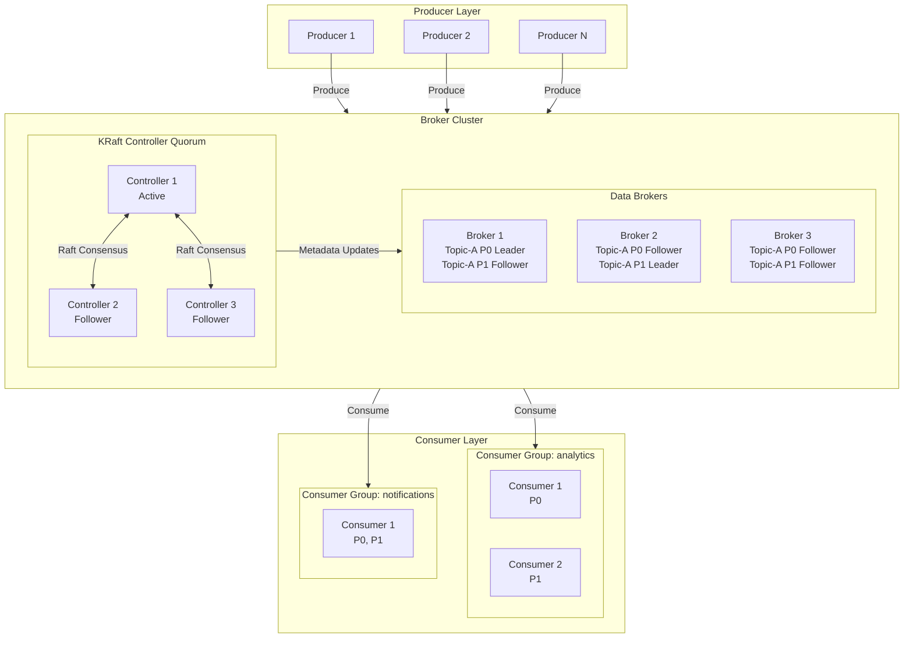

### Component Responsibilities

| Component | Responsibility | Scaling Strategy |
|-----------|---------------|------------------|
| **Producers** | Serialize messages, batch, send to partition leaders | Horizontal, stateless |
| **KRaft Controllers** | Cluster metadata, leader election, topic management | 3-5 nodes (odd number for quorum) |
| **Brokers** | Store log segments, serve produce/fetch requests | Horizontal, add brokers + rebalance |
| **Consumers** | Poll messages, process, commit offsets | Horizontal, max = partition count |
| **Schema Registry** | Schema validation, evolution, compatibility | Horizontal, stateless (with shared storage) |

---

## KRaft Architecture (ZooKeeper-less)

### KRaft vs ZooKeeper

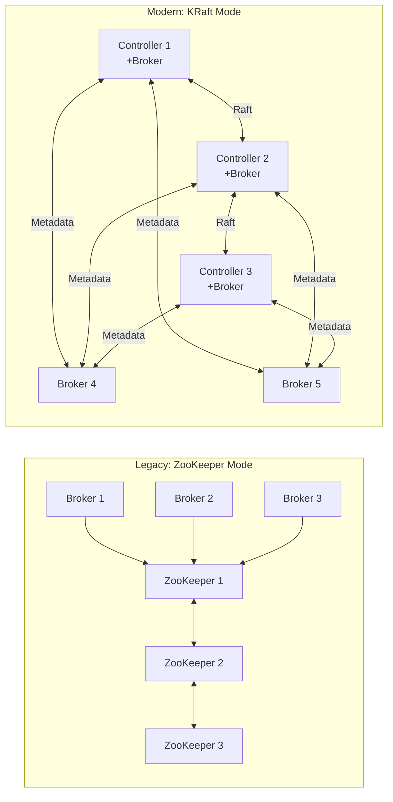

### KRaft Metadata Flow

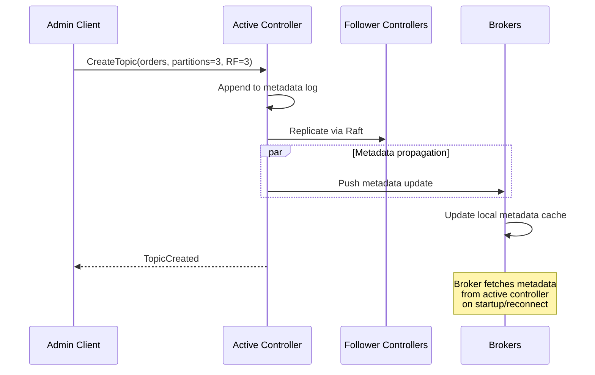

### Controller Quorum Roles

| Role | Count | Responsibility |
|------|-------|----------------|
| **Active Controller** | 1 | Handles all write requests, leads Raft quorum |
| **Follower Controllers** | 2+ | Replicate metadata log, ready for failover |
| **Observer (optional)** | Any | Read-only, for metadata queries |

---

## Partition Distribution

### Partition Layout Across Brokers

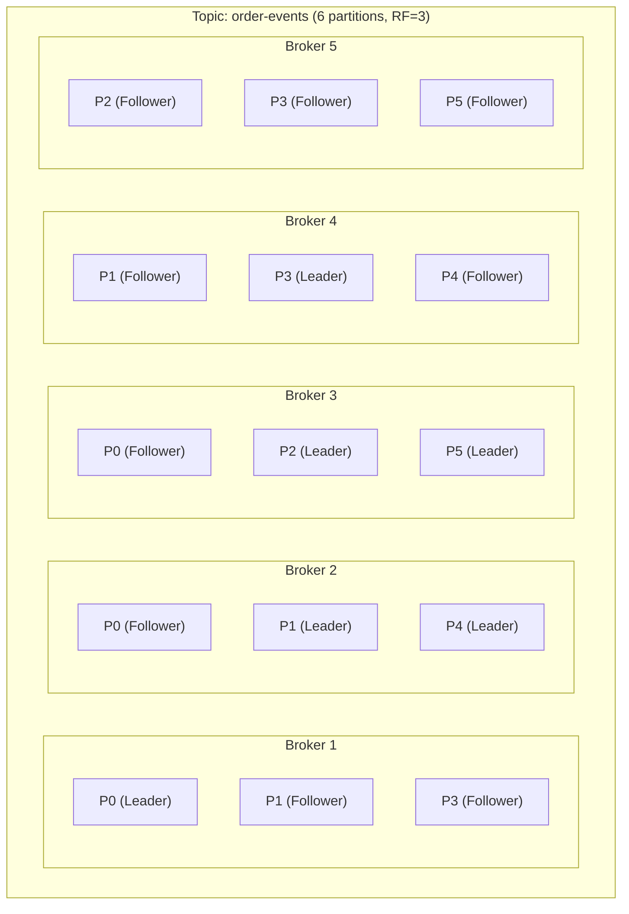

### Partition Assignment Strategy

```
┌─────────────────────────────────────────────────────────────────┐
│                 PARTITION ASSIGNMENT GOALS                       │
├─────────────────────────────────────────────────────────────────┤
│                                                                  │
│  1. LEADER BALANCE                                              │
│     • Distribute leader partitions evenly across brokers        │
│     • Each broker should lead roughly equal partitions          │
│                                                                  │
│  2. REPLICA DISTRIBUTION                                        │
│     • Replicas of same partition on different brokers           │
│     • Ideally in different racks/availability zones             │
│                                                                  │
│  3. RACK AWARENESS                                              │
│     • Replicas spread across failure domains                    │
│     • Survive rack/AZ failure without data loss                 │
│                                                                  │
│  Example: 3 partitions, RF=3, 3 brokers, 3 racks               │
│  ┌────────────────────────────────────────────────────────┐    │
│  │  Rack A      │  Rack B      │  Rack C                  │    │
│  │  Broker 1    │  Broker 2    │  Broker 3                │    │
│  │  ──────────  │  ──────────  │  ──────────              │    │
│  │  P0 (L)      │  P0 (F)      │  P0 (F)                  │    │
│  │  P1 (F)      │  P1 (L)      │  P1 (F)                  │    │
│  │  P2 (F)      │  P2 (F)      │  P2 (L)                  │    │
│  └────────────────────────────────────────────────────────┘    │
│                                                                  │
│  Result: Any single rack failure → no data loss, no downtime   │
│                                                                  │
└─────────────────────────────────────────────────────────────────┘
```

---

## Data Flow Patterns

### Write Path (Producer → Broker)

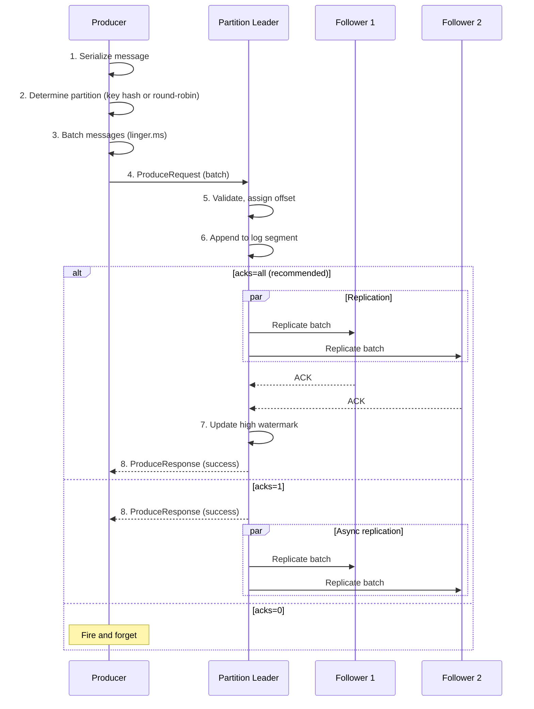

### Read Path (Broker → Consumer)

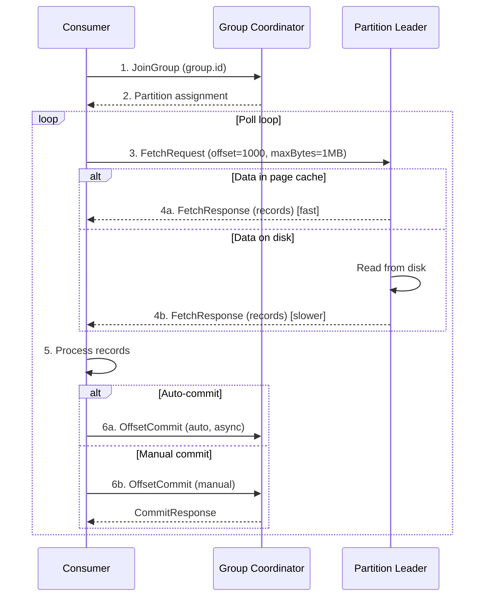

### Replication Flow

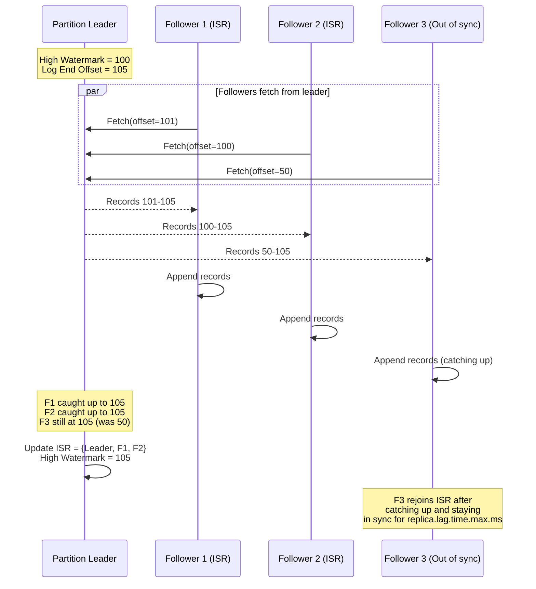

---

## Key Architectural Decisions

### Decision 1: Metadata Management

| Option | Description | Pros | Cons |
|--------|-------------|------|------|
| ZooKeeper | External coordination service | Mature, battle-tested | Operational complexity, separate system |
| **KRaft (Recommended)** | Internal Raft-based quorum | Single system, faster failover, simpler ops | Newer (GA in Kafka 3.3+) |

**Recommendation:** KRaft for all new deployments (Kafka 3.3+).

**Rationale:**
- Single system to operate
- Faster controller failover (seconds vs minutes)
- Better scalability (millions of partitions)
- No ZooKeeper znodes limits

### Decision 2: Replication Strategy

| Option | Description | Durability | Performance |
|--------|-------------|------------|-------------|
| Synchronous (all) | Wait for all replicas | Highest | Slower |
| **ISR-based (Recommended)** | Wait for in-sync replicas | High | Good |
| Asynchronous | Leader only | Lower | Fastest |

**Recommendation:** ISR-based with `acks=all` and `min.insync.replicas=2`.

**Rationale:**
- Balances durability and performance
- Tolerates slow/failed replicas
- Industry standard configuration

### Decision 3: Message Routing

| Option | Description | Ordering | Distribution |
|--------|-------------|----------|--------------|
| **Key-based hashing** | hash(key) % partitions | Per-key ordering | Uneven if skewed keys |
| Round-robin | Rotate across partitions | No ordering | Even distribution |
| Custom partitioner | Application logic | Application-defined | Application-controlled |

**Recommendation:** Key-based hashing for ordered streams, round-robin for logs/metrics.

**Rationale:**
- Most applications need per-entity ordering (orders by customer, events by user)
- Key-based ensures same key → same partition → ordering

### Decision 4: Consumer Offset Storage

| Option | Description | Pros | Cons |
|--------|-------------|------|------|
| **Internal topic (__consumer_offsets)** | Store in Kafka | Self-contained, replicated | Coupled to Kafka |
| External (database) | Store in external DB | Decoupled | Additional dependency |

**Recommendation:** Internal `__consumer_offsets` topic (default).

**Rationale:**
- No external dependencies
- Same durability guarantees as data
- Automatic compaction

### Decision 5: Log Retention Strategy

| Strategy | Description | Use Case |
|----------|-------------|----------|
| **Time-based** | Delete after N days | Event streams, logs |
| Size-based | Delete when log exceeds N GB | Storage-constrained |
| **Compaction** | Keep latest per key | State snapshots, changelog |

**Recommendation:** Time-based for events (7 days), compaction for state topics.

---

## Architecture Pattern Checklist

| Pattern | Decision | Rationale |
|---------|----------|-----------|
| ✅ Sync vs Async | Sync for produce (acks=all), async for replication (ISR) | Durability for writes, performance for replication |
| ✅ Push vs Pull | Pull (consumer polls) | Consumer controls rate, handles backpressure |
| ✅ Stateful vs Stateless | Stateful (brokers hold logs) | Log storage is core responsibility |
| ✅ Leader-Follower | Per-partition leader | Single writer, consistent ordering |
| ✅ Partitioning | Key-based hash | Per-key ordering, parallelism |
| ✅ Batch vs Individual | Batching (producer and consumer) | Throughput optimization |

---

## Integration Points

### Upstream (Producers)

| Producer Type | Protocol | Usage Pattern |
|---------------|----------|---------------|
| Application services | TCP (Kafka protocol) | Direct produce |
| CDC connectors | Kafka Connect | Database change events |
| HTTP gateways | REST Proxy | Legacy/simple integrations |
| Stream processors | Kafka Streams / Flink | Processed output |

### Downstream (Consumers)

| Consumer Type | Protocol | Usage Pattern |
|---------------|----------|---------------|
| Application services | TCP (Kafka protocol) | Direct consume |
| Data pipelines | Kafka Connect | Sink to storage |
| Stream processors | Kafka Streams / Flink | Real-time processing |
| Analytics | Batch consumers | Periodic batch processing |

### Supporting Services

| Service | Purpose | Failure Impact |
|---------|---------|----------------|
| Schema Registry | Schema validation | Produce/consume failures |
| Monitoring | Metrics collection | No functional impact |
| Alerting | Incident detection | Delayed incident response |

---

## Failure Modes and Mitigation

### Broker Failure

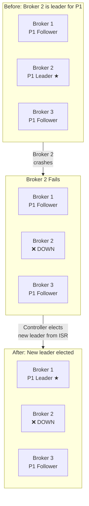

| Failure | Detection | Mitigation | Impact |
|---------|-----------|------------|--------|
| Single broker | Heartbeat timeout (10s) | Controller elects new leader | Brief unavailability for affected partitions |
| Multiple brokers | Same | Elect from remaining ISR | May reduce ISR below minimum |
| Controller | Raft leader election | Follower becomes active | Metadata operations paused |
| Network partition | Heartbeat failure | ISR shrinks, continue with available | Split-brain prevented by ISR |

### Mitigation Strategies

```
┌─────────────────────────────────────────────────────────────────┐
│                  FAILURE MITIGATION LAYERS                       │
├─────────────────────────────────────────────────────────────────┤
│                                                                  │
│  Layer 1: Producer Retries                                      │
│  ├── Retry on transient failures (NOT_LEADER, TIMEOUT)         │
│  ├── Idempotent producer prevents duplicates on retry           │
│  └── Configurable retry count and backoff                       │
│                                                                  │
│  Layer 2: ISR-based Replication                                 │
│  ├── Data on multiple brokers before acknowledgment            │
│  ├── min.insync.replicas ensures durability threshold          │
│  └── Automatic ISR shrink/expand                                │
│                                                                  │
│  Layer 3: Automatic Leader Election                             │
│  ├── Controller detects broker failure                          │
│  ├── Elects new leader from ISR                                 │
│  └── Typical failover: 1-5 seconds                              │
│                                                                  │
│  Layer 4: Consumer Group Rebalancing                            │
│  ├── Consumers detect partition reassignment                    │
│  ├── Rebalance protocol reassigns partitions                    │
│  └── Processing continues after rebalance                       │
│                                                                  │
│  Layer 5: Multi-region Replication                              │
│  ├── MirrorMaker 2 for cross-region                            │
│  ├── Active-passive or active-active                            │
│  └── Disaster recovery capability                               │
│                                                                  │
└─────────────────────────────────────────────────────────────────┘
```

---

## Deployment Topology Options

### Option 1: Single Region, Multi-AZ (Recommended Start)

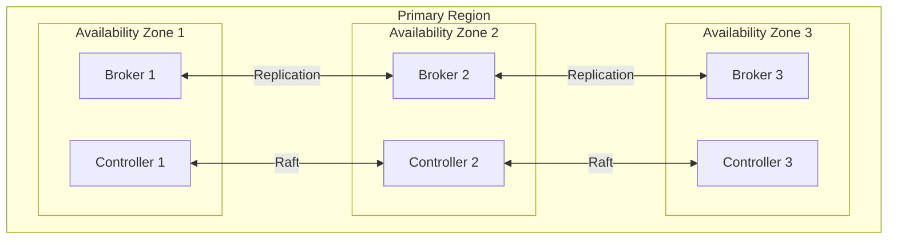

**Configuration:**
- 3 AZs, rack awareness enabled
- RF=3 ensures replicas in each AZ
- Survives single AZ failure

### Option 2: Multi-Region Active-Passive

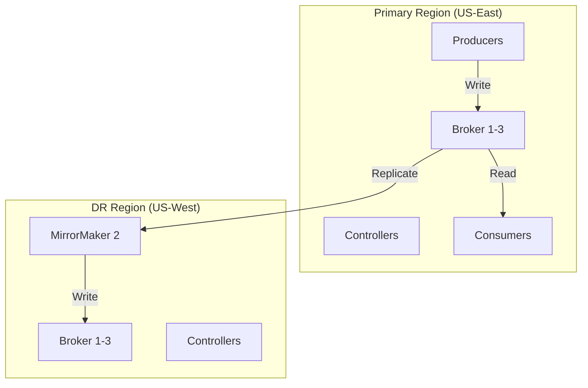

**Use Case:** Disaster recovery, compliance (data locality)

### Option 3: Multi-Region Active-Active

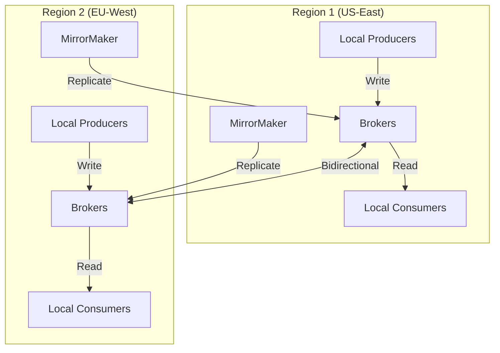

**Use Case:** Global applications, low latency for all regions

**Challenges:**
- Topic naming (prefix by region to avoid conflicts)
- Consumer offset synchronization
- Duplicate handling for bi-directional replication

### Deployment Comparison

| Aspect | Single Region Multi-AZ | Multi-Region Active-Passive | Multi-Region Active-Active |
|--------|----------------------|----------------------------|---------------------------|
| Latency | 1-5ms | Local: 1-5ms, cross-region: 50-200ms | Local: 1-5ms |
| Availability | 99.99% (AZ resilient) | 99.99% + DR capability | 99.999% |
| Complexity | Low | Medium | High |
| Cost | $$ | $$$ | $$$$ |
| RTO | Minutes | Hours (failover) | Near-zero |
| RPO | 0 (ISR) | Replication lag | Replication lag |
| Use Case | Most applications | Compliance, DR | Global, zero-downtime |
