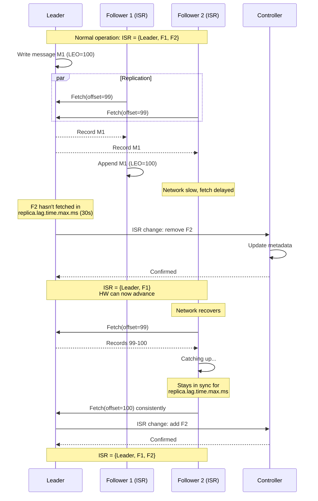
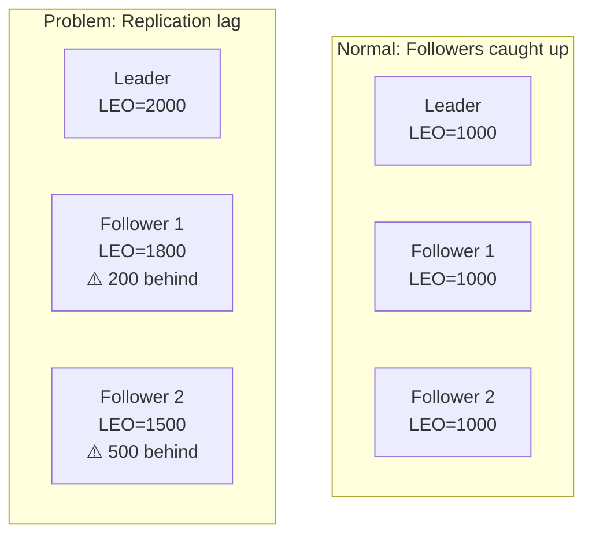
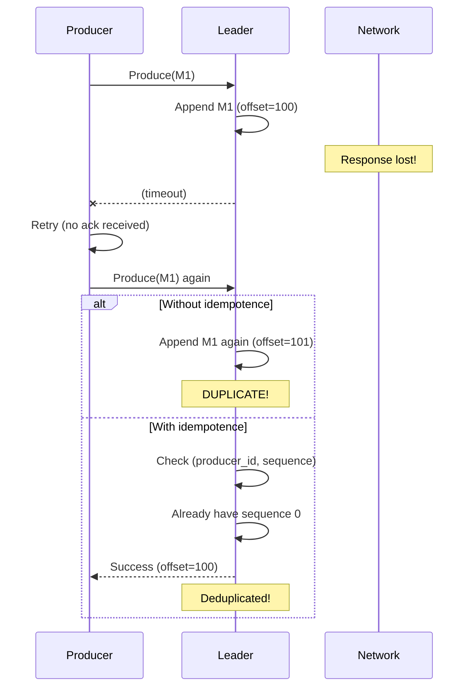
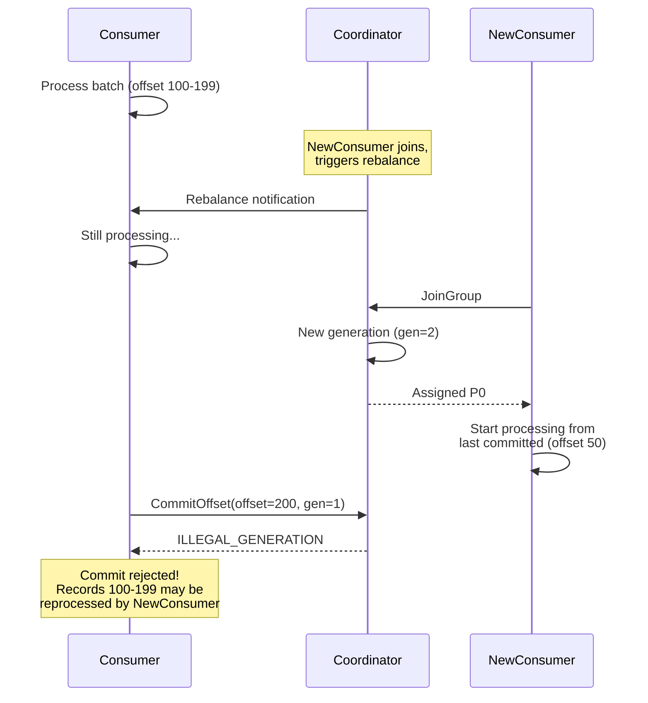
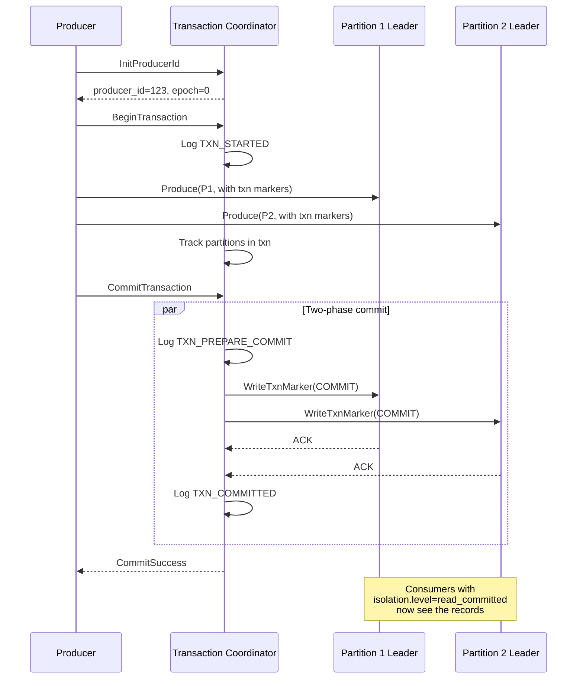

# Deep Dive and Bottlenecks

[← Back to Index](./00-index.md)

---

## Deep Dive 1: ISR and Replication Protocol

### The In-Sync Replica (ISR) Mechanism

The ISR is the core of Kafka's durability and availability guarantees. It's the set of replicas that are "caught up" to the leader.

```
┌─────────────────────────────────────────────────────────────────┐
│                    ISR CONCEPT                                   │
├─────────────────────────────────────────────────────────────────┤
│                                                                  │
│  Partition P0 (RF=3)                                            │
│                                                                  │
│  Leader (Broker 1):                                             │
│  ┌─────────────────────────────────────────────────────┐       │
│  │ Offset: 0   1   2   3   4   5   6   7   8   9  10  │       │
│  │         [A] [B] [C] [D] [E] [F] [G] [H] [I] [J] [K] │       │
│  │                                             LEO=11  │       │
│  └─────────────────────────────────────────────────────┘       │
│                                                                  │
│  Follower 1 (Broker 2) - IN SYNC:                               │
│  ┌─────────────────────────────────────────────────────┐       │
│  │ Offset: 0   1   2   3   4   5   6   7   8   9  10  │       │
│  │         [A] [B] [C] [D] [E] [F] [G] [H] [I] [J] [K] │       │
│  │                                             LEO=11  │       │
│  └─────────────────────────────────────────────────────┘       │
│                                                                  │
│  Follower 2 (Broker 3) - OUT OF SYNC:                           │
│  ┌─────────────────────────────────────────────────────┐       │
│  │ Offset: 0   1   2   3   4   5   6                   │       │
│  │         [A] [B] [C] [D] [E] [F] [G]                  │       │
│  │                                 LEO=7               │       │
│  └─────────────────────────────────────────────────────┘       │
│                                                                  │
│  ISR = {Broker 1, Broker 2}                                     │
│  High Watermark (HW) = 11 (min LEO of ISR)                      │
│                                                                  │
│  Consumers can only read up to HW (offset 10)                   │
│  Offset 11 (K) is not yet "committed"                           │
│                                                                  │
└─────────────────────────────────────────────────────────────────┘
```

### ISR Shrink and Expand



### High Watermark Advancement

```
ALGORITHM update_high_watermark():
    // Called when follower fetch completes or ISR changes

    // Collect LEO from all ISR members
    isr_leos = []
    FOR replica IN partition.isr:
        isr_leos.append(replica.log_end_offset)

    // HW is minimum LEO across ISR
    new_hw = min(isr_leos)

    IF new_hw > partition.high_watermark:
        partition.high_watermark = new_hw

        // Messages up to new HW are now "committed"
        // Consumers can now read these messages
        // Producer with acks=all can now be acknowledged

NOTES:
    - HW only advances when ALL ISR members have the data
    - If ISR shrinks, HW can advance faster (fewer replicas to wait for)
    - If ISR expands, HW advancement slows until new member catches up
```

### ISR Configuration Trade-offs

| Config | Effect on Durability | Effect on Availability |
|--------|---------------------|----------------------|
| `min.insync.replicas=1` | Low (leader only needed) | High (single broker sufficient) |
| `min.insync.replicas=2` | High (2 copies guaranteed) | Medium (need 2 brokers) |
| `replica.lag.time.max.ms=10000` | Higher (strict catch-up) | Lower (quick ISR shrink) |
| `replica.lag.time.max.ms=60000` | Lower (lenient catch-up) | Higher (slower ISR shrink) |

**Recommended Production Config:**
```
min.insync.replicas=2
acks=all
replica.lag.time.max.ms=30000
```

---

## Deep Dive 2: Consumer Group Rebalancing

### The Rebalance Problem

When consumers join, leave, or crash, partitions must be reassigned. This is the rebalance protocol.

```
┌─────────────────────────────────────────────────────────────────┐
│                    REBALANCE TRIGGERS                            │
├─────────────────────────────────────────────────────────────────┤
│                                                                  │
│  1. Consumer joins group                                        │
│     • New consumer instance starts                              │
│     • Scaling up consumer count                                 │
│                                                                  │
│  2. Consumer leaves group                                       │
│     • Graceful shutdown (LeaveGroup request)                    │
│     • Scaling down                                              │
│                                                                  │
│  3. Consumer crashes/times out                                  │
│     • No heartbeat for session.timeout.ms                       │
│     • No poll() for max.poll.interval.ms                        │
│                                                                  │
│  4. Topic/partition changes                                     │
│     • New partitions added to subscribed topic                  │
│     • Topic deleted                                             │
│                                                                  │
│  5. Subscription changes                                        │
│     • Consumer changes subscribed topics                        │
│                                                                  │
└─────────────────────────────────────────────────────────────────┘
```

### Classic vs Cooperative Rebalance

```mermaid
flowchart TB
    subgraph Classic["Classic (Eager) Rebalance"]
        C1[All consumers<br/>STOP processing]
        C2[Revoke ALL partitions]
        C3[JoinGroup]
        C4[Recompute assignment]
        C5[Assign new partitions]
        C6[Resume processing]

        C1 --> C2 --> C3 --> C4 --> C5 --> C6
    end

    subgraph Cooperative["Cooperative (Incremental) Rebalance"]
        CO1[Identify partitions<br/>to move]
        CO2[Revoke ONLY<br/>moved partitions]
        CO3[Keep processing<br/>retained partitions]
        CO4[Assign new partitions]
        CO5[Minimal disruption]

        CO1 --> CO2 --> CO3 --> CO4 --> CO5
    end
```



### Cooperative Rebalance Deep Dive

```
ALGORITHM cooperative_rebalance():
    // Phase 1: Compute desired assignment
    current_assignment = get_current_assignment()
    desired_assignment = compute_optimal_assignment(members, partitions)

    // Phase 2: Identify changes
    FOR each member:
        revoked = current_assignment[member] - desired_assignment[member]
        assigned = desired_assignment[member] - current_assignment[member]

        // Only revoke partitions that are moving
        // Keep processing partitions that stay

    // Phase 3: Two-phase rebalance
    // First rebalance: Revoke partitions
    notify_members_to_revoke(revoked_partitions)
    wait_for_revocation_complete()

    // Second rebalance: Assign partitions
    assign_revoked_partitions_to_new_owners()

BENEFITS:
    - No stop-the-world pause
    - Only affected partitions experience disruption
    - Better for large consumer groups

TIMELINE COMPARISON:
    Classic:    [====STOP ALL====][rebalance][====RESUME====]
    Cooperative: [keep processing][revoke some][assign some][continue]
```

### KIP-848: Next-Generation Consumer Protocol

```
┌─────────────────────────────────────────────────────────────────┐
│                    KIP-848 IMPROVEMENTS                          │
├─────────────────────────────────────────────────────────────────┤
│                                                                  │
│  Classic Protocol Problems:                                      │
│  • Client-side assignment computation                           │
│  • All members must agree → slow convergence                    │
│  • JoinGroup/SyncGroup round trips                              │
│  • Full rebalance on any membership change                      │
│                                                                  │
│  KIP-848 Solutions:                                             │
│  • Server-side assignment (coordinator computes)                │
│  • Incremental heartbeat-based protocol                         │
│  • 60-70% reduction in rebalance traffic                        │
│  • Faster rebalance completion                                  │
│                                                                  │
│  Old Protocol:                                                   │
│  Consumer ──JoinGroup──▶ Coordinator                            │
│  Consumer ◀──JoinResp─── Coordinator                            │
│  Consumer ──SyncGroup──▶ Coordinator                            │
│  Consumer ◀──SyncResp─── Coordinator                            │
│                                                                  │
│  KIP-848 Protocol:                                              │
│  Consumer ──Heartbeat──▶ Coordinator                            │
│  Consumer ◀──Assignment── Coordinator (if changed)              │
│                                                                  │
│  Availability: Kafka 4.0+                                        │
│                                                                  │
└─────────────────────────────────────────────────────────────────┘
```

---

## Deep Dive 3: Log Compaction

### The Compaction Process

Log compaction retains only the latest value for each key, treating the log as a key-value changelog.

```
┌─────────────────────────────────────────────────────────────────┐
│                    LOG COMPACTION EXAMPLE                        │
├─────────────────────────────────────────────────────────────────┤
│                                                                  │
│  BEFORE COMPACTION (user-profiles topic):                       │
│  ┌─────────────────────────────────────────────────────────┐   │
│  │ Offset │ Key    │ Value                                 │   │
│  │────────│────────│─────────────────────────────────────│   │
│  │ 0      │ user:1 │ {name: "Alice", age: 25}            │   │
│  │ 1      │ user:2 │ {name: "Bob", age: 30}              │   │
│  │ 2      │ user:1 │ {name: "Alice", age: 26}  ← update  │   │
│  │ 3      │ user:3 │ {name: "Carol", age: 28}            │   │
│  │ 4      │ user:2 │ {name: "Bob", age: 31}    ← update  │   │
│  │ 5      │ user:1 │ null                      ← delete  │   │
│  │ 6      │ user:4 │ {name: "Dave", age: 35}             │   │
│  └─────────────────────────────────────────────────────────┘   │
│                                                                  │
│  AFTER COMPACTION:                                              │
│  ┌─────────────────────────────────────────────────────────┐   │
│  │ Offset │ Key    │ Value                                 │   │
│  │────────│────────│─────────────────────────────────────│   │
│  │ 3      │ user:3 │ {name: "Carol", age: 28}            │   │
│  │ 4      │ user:2 │ {name: "Bob", age: 31}              │   │
│  │ 5      │ user:1 │ null (tombstone, kept temporarily)   │   │
│  │ 6      │ user:4 │ {name: "Dave", age: 35}             │   │
│  └─────────────────────────────────────────────────────────┘   │
│                                                                  │
│  Notes:                                                          │
│  • Offsets preserved (no renumbering)                           │
│  • Only latest value per key retained                           │
│  • Tombstones (null) kept for delete.retention.ms              │
│  • Offsets 0, 1, 2 are now "holes" (skipped on read)           │
│                                                                  │
└─────────────────────────────────────────────────────────────────┘
```

### Compaction Algorithm

```
ALGORITHM compact_log_segment(segment):
    // Build offset map: key → latest offset
    offset_map = {}

    FOR record IN segment.records:
        offset_map[record.key] = record.offset

    // Second pass: copy only latest records
    compacted_segment = new Segment()

    FOR record IN segment.records:
        IF record.offset == offset_map[record.key]:
            // This is the latest record for this key
            IF record.value IS NOT null:
                compacted_segment.append(record)
            ELSE:
                // Tombstone: keep if within delete.retention.ms
                IF now() - record.timestamp < delete_retention_ms:
                    compacted_segment.append(record)

    RETURN compacted_segment

CONFIGURATION:
    log.cleanup.policy=compact           # Enable compaction
    min.cleanable.dirty.ratio=0.5        # Trigger when 50% dirty
    log.cleaner.min.compaction.lag.ms=0  # Compact immediately
    delete.retention.ms=86400000         # Keep tombstones 24h
```

### Compaction Use Cases

| Use Case | Example | Why Compaction |
|----------|---------|----------------|
| User profiles | Latest user state | Don't need profile history |
| Configuration | Latest config values | Only current config matters |
| Aggregations | Running totals | Only latest count needed |
| CDC snapshots | Database state | Replay builds current state |

---

## Bottleneck Analysis

### Bottleneck 1: Partition Hot Spots

**Problem:** Uneven key distribution causes some partitions to receive much more traffic.

```
┌─────────────────────────────────────────────────────────────────┐
│                    PARTITION HOT SPOT                            │
├─────────────────────────────────────────────────────────────────┤
│                                                                  │
│  Topic: order-events (6 partitions)                             │
│  Key: customer_id                                               │
│                                                                  │
│  Problem: Large enterprise customer sends 80% of orders         │
│                                                                  │
│  Partition Distribution:                                         │
│  ┌─────────────────────────────────────────────────────────┐   │
│  │ P0: ████████████████████████████████████████  (80%)     │   │
│  │ P1: ██  (4%)                                            │   │
│  │ P2: ██  (4%)                                            │   │
│  │ P3: ██  (4%)                                            │   │
│  │ P4: ██  (4%)                                            │   │
│  │ P5: ██  (4%)                                            │   │
│  └─────────────────────────────────────────────────────────┘   │
│                                                                  │
│  Impact:                                                         │
│  • Broker hosting P0 leader is overloaded                       │
│  • Consumer assigned P0 falls behind                            │
│  • Other consumers are idle                                     │
│                                                                  │
└─────────────────────────────────────────────────────────────────┘
```

**Solutions:**

1. **Composite Keys:** `customer_id:order_id % N` to spread single customer
2. **Custom Partitioner:** Route hot keys to multiple partitions
3. **Separate Topics:** Dedicated topic for high-volume customers
4. **Pre-aggregation:** Batch events before producing

### Bottleneck 2: Consumer Lag

**Problem:** Consumers can't keep up with producer rate.

```
DIAGNOSIS:
    consumer_lag = producer_offset - consumer_offset

    IF consumer_lag > threshold:
        // Consumer is falling behind

CAUSES:
    1. Slow processing logic
    2. Insufficient consumer parallelism
    3. Network bandwidth limitations
    4. External dependency bottleneck (database, API)

SOLUTIONS:
    ┌────────────────────────────────────────────────────────┐
    │ Cause                  │ Solution                      │
    │────────────────────────│───────────────────────────────│
    │ Slow processing        │ Optimize code, async I/O     │
    │ Not enough consumers   │ Add consumers (up to #parts) │
    │ Too few partitions     │ Add partitions (disruptive)  │
    │ DB bottleneck          │ Batch writes, connection pool│
    │ Network                │ Increase fetch.max.bytes     │
    └────────────────────────────────────────────────────────┘
```

### Bottleneck 3: Replication Lag

**Problem:** Followers can't keep up with leader writes.



**Causes and Solutions:**

| Cause | Detection | Solution |
|-------|-----------|----------|
| Network saturation | High NIC utilization | Upgrade network, compression |
| Slow disk on follower | High I/O wait | Faster disks (NVMe) |
| GC pauses | JVM GC logs | Tune GC, more heap |
| Too many partitions | High CPU, many threads | Reduce partition count |

### Bottleneck 4: Controller Overload

**Problem:** Single active controller handles all metadata operations.

```
SYMPTOMS:
    - Slow topic creation/deletion
    - Delayed leader elections
    - High controller CPU
    - Long ISR update times

CAUSES:
    - Too many partitions (> 200K per cluster)
    - Frequent ISR changes
    - Many topic creations
    - Large consumer groups

SOLUTIONS:
    1. Reduce partition count (10K per broker recommended)
    2. Increase replica.lag.time.max.ms to reduce ISR churn
    3. Batch topic operations
    4. Use KRaft (better scalability than ZooKeeper)
```

---

## Concurrency Issues

### Race Condition: Duplicate Messages on Producer Retry

**Problem:** Producer timeout + successful write = duplicate on retry.



**Solution:** Enable idempotent producer (default in Kafka 3.0+)

```
IDEMPOTENT PRODUCER:
    enable.idempotence=true

    Producer state:
    - producer_id: Unique ID assigned by broker
    - epoch: Incremented on producer restart
    - sequence: Per-partition sequence number

    Broker maintains:
    - (producer_id, epoch) → last 5 sequence numbers per partition

    On produce:
    - If sequence == expected: Accept, increment expected
    - If sequence < expected: Already have it, return success (dedup)
    - If sequence > expected: Out of order, return error
```

### Race Condition: Consumer Offset Commit During Rebalance

**Problem:** Offset commit during rebalance can commit to wrong generation.



**Solution:** Handle rebalance listener properly

```
FUNCTION setup_consumer(consumer):
    consumer.subscribe(topics, ConsumerRebalanceListener{

        on_partitions_revoked(partitions):
            // Commit processed offsets BEFORE losing partitions
            consumer.commit_sync()

            // Flush any pending work
            flush_pending_writes()

        on_partitions_assigned(partitions):
            // Optionally seek to specific offset
            FOR partition IN partitions:
                offset = get_checkpoint(partition)
                IF offset IS NOT null:
                    consumer.seek(partition, offset)
    })
```

### Race Condition: Compaction vs Active Segment

**Problem:** Compaction must not compact the active (being written) segment.

```
┌─────────────────────────────────────────────────────────────────┐
│                    COMPACTION SAFETY                             │
├─────────────────────────────────────────────────────────────────┤
│                                                                  │
│  Partition log:                                                  │
│  ┌─────────────────────────────────────────────────────────┐   │
│  │ Segment 0    │ Segment 1    │ Segment 2 (ACTIVE)        │   │
│  │ (closed)     │ (closed)     │ (being written)           │   │
│  │ COMPACTABLE  │ COMPACTABLE  │ DO NOT COMPACT            │   │
│  └─────────────────────────────────────────────────────────┘   │
│                                                                  │
│  Rules:                                                          │
│  1. Never compact active segment                                │
│  2. Respect min.compaction.lag.ms (time since last write)      │
│  3. Maintain order within partition                             │
│  4. Keep tombstones for delete.retention.ms                     │
│                                                                  │
│  Cleaner thread:                                                 │
│  - Operates on closed segments only                             │
│  - Creates new compacted segments atomically                    │
│  - Swaps in compacted segments atomically                       │
│                                                                  │
└─────────────────────────────────────────────────────────────────┘
```

---

## Exactly-Once Semantics (EOS)

### Transaction Protocol



### EOS Configuration

```
PRODUCER (transactional):
    enable.idempotence=true
    transactional.id=my-txn-id    # Unique per producer instance
    acks=all

CONSUMER (read committed):
    isolation.level=read_committed # Only see committed records

FLOW:
    producer.init_transactions()

    WHILE true:
        records = consumer.poll()

        producer.begin_transaction()

        FOR record IN records:
            result = process(record)
            producer.produce(output_topic, result)

        # Commit offsets as part of transaction
        producer.send_offsets_to_transaction(consumer.offsets, consumer.group_id)

        producer.commit_transaction()
```

### Last Stable Offset (LSO)

```
┌─────────────────────────────────────────────────────────────────┐
│                    LSO AND READ_COMMITTED                        │
├─────────────────────────────────────────────────────────────────┤
│                                                                  │
│  Partition log:                                                  │
│  ┌─────────────────────────────────────────────────────────┐   │
│  │ 0  1  2  3  4  5  6  7  8  9  10  11  12  13  14       │   │
│  │ [A][B][T1][C][D][T1][E][F][T2][G][H] [T1] [I] [J]      │   │
│  │                              ↑COMMIT      ↑ open txn    │   │
│  └─────────────────────────────────────────────────────────┘   │
│                                                                  │
│  T1 = Transaction 1 (committed at offset 11)                    │
│  T2 = Transaction 2 (still open, started at offset 8)           │
│                                                                  │
│  High Watermark (HW) = 14 (all replicated)                      │
│  Last Stable Offset (LSO) = 8 (first open transaction)          │
│                                                                  │
│  Consumer with isolation.level=read_uncommitted:                │
│  - Can read up to HW (offset 14)                                │
│  - Sees uncommitted T2 records                                  │
│                                                                  │
│  Consumer with isolation.level=read_committed:                  │
│  - Can read up to LSO (offset 8)                                │
│  - Only sees committed records                                   │
│  - T1 records visible (committed)                               │
│  - T2 records not visible (not yet committed)                   │
│                                                                  │
└─────────────────────────────────────────────────────────────────┘
```
