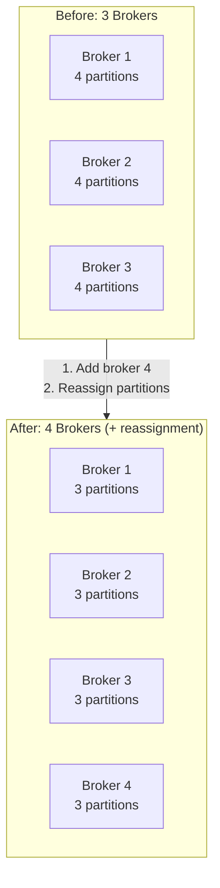
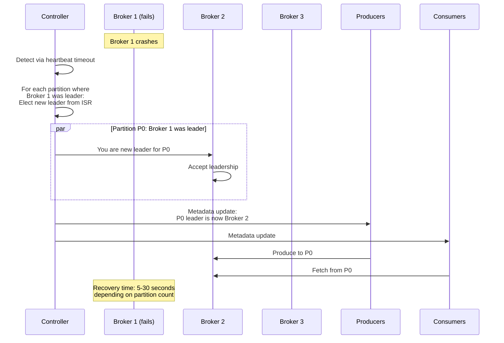
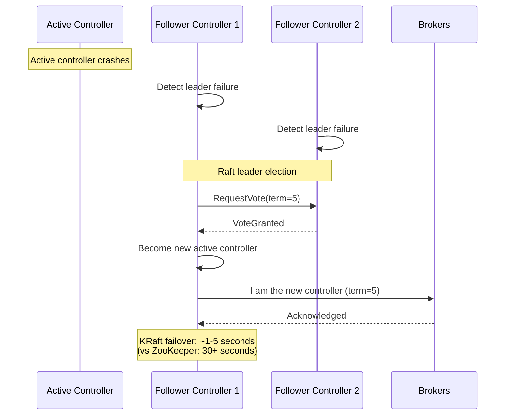
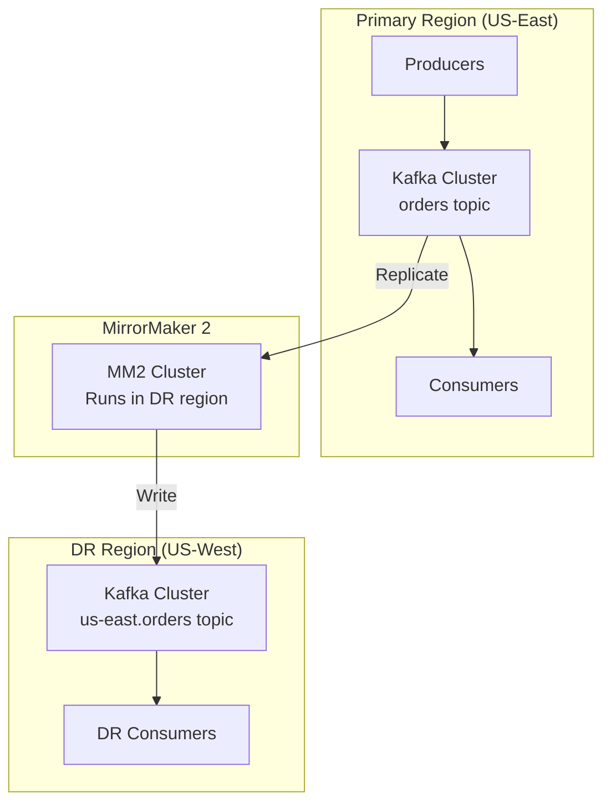

# Scalability and Reliability

[← Back to Index](./00-index.md)

---

## Horizontal Scaling

### Scaling Dimensions

| Dimension | How to Scale | Considerations |
|-----------|-------------|----------------|
| **Throughput** | Add brokers + rebalance partitions | Network and disk bound |
| **Storage** | Add brokers or expand disk | Retention policy affects need |
| **Consumers** | Add consumers (up to partition count) | Max parallelism = partitions |
| **Topics** | Just create (metadata overhead) | 10K+ topics is fine |
| **Partitions** | Add partitions (cannot remove) | More = slower leader election |

### Adding Brokers



**Procedure:**

```
PROCEDURE add_broker():
    1. Provision new broker
       - Same configuration as existing
       - Unique broker.id
       - Same cluster.id

    2. Start broker
       - Joins cluster automatically
       - Initially has 0 partitions

    3. Generate reassignment plan
       - Use kafka-reassign-partitions tool
       - Or automatic rebalancing (Cruise Control)

    4. Execute reassignment
       - Partitions replicate to new broker
       - Leader election when ready
       - Throttle to avoid impact

    5. Verify balance
       - Check partition distribution
       - Monitor replication lag

THROTTLING:
    # Limit reassignment bandwidth to 50 MB/s
    replica.fetch.max.bytes=52428800

    # Or use dynamic config
    kafka-configs --alter --add-config \
        leader.replication.throttled.rate=50000000
```

### Adding Partitions

```
┌─────────────────────────────────────────────────────────────────┐
│                    ADDING PARTITIONS                             │
├─────────────────────────────────────────────────────────────────┤
│                                                                  │
│  BEFORE: Topic orders with 6 partitions                         │
│  ┌─────────────────────────────────────────────────────────┐   │
│  │  P0  │  P1  │  P2  │  P3  │  P4  │  P5  │              │   │
│  └─────────────────────────────────────────────────────────┘   │
│                                                                  │
│  Command: kafka-topics --alter --partitions 12                  │
│                                                                  │
│  AFTER: Topic orders with 12 partitions                         │
│  ┌─────────────────────────────────────────────────────────┐   │
│  │  P0  │  P1  │  P2  │  P3  │  P4  │  P5  │              │   │
│  │  existing data                                          │   │
│  └─────────────────────────────────────────────────────────┘   │
│  ┌─────────────────────────────────────────────────────────┐   │
│  │  P6  │  P7  │  P8  │  P9  │  P10 │  P11 │              │   │
│  │  NEW - empty                                            │   │
│  └─────────────────────────────────────────────────────────┘   │
│                                                                  │
│  ⚠️  IMPORTANT:                                                  │
│  • Cannot reduce partition count                                │
│  • New partitions start EMPTY                                   │
│  • Existing data NOT redistributed                              │
│  • Key-based ordering may be affected                           │
│    (same key may now hash to different partition)               │
│                                                                  │
└─────────────────────────────────────────────────────────────────┘
```

**When to Add Partitions:**

| Trigger | Threshold | Action |
|---------|-----------|--------|
| Need more consumer parallelism | consumers = partitions | Add partitions |
| Per-partition throughput limit | > 10 MB/s per partition | Add partitions |
| Consumer lag not improving | Lag stable despite optimization | Add partitions + consumers |

**Risks:**

| Risk | Description | Mitigation |
|------|-------------|------------|
| Key redistribution | Same key may go to new partition | Use time-bounded keys if ordering critical |
| Empty partitions | New partitions have no history | Acceptable for most use cases |
| Consumer rebalance | All consumers get new assignment | Use cooperative rebalancing |

---

## Consumer Scaling

### Maximum Parallelism

```
┌─────────────────────────────────────────────────────────────────┐
│                    CONSUMER SCALING LIMITS                       │
├─────────────────────────────────────────────────────────────────┤
│                                                                  │
│  Topic: events (12 partitions)                                  │
│                                                                  │
│  3 Consumers:                                                    │
│  ┌──────────────────────────────────────────────────────────┐  │
│  │ Consumer 1: P0, P1, P2, P3      (4 partitions)           │  │
│  │ Consumer 2: P4, P5, P6, P7      (4 partitions)           │  │
│  │ Consumer 3: P8, P9, P10, P11    (4 partitions)           │  │
│  └──────────────────────────────────────────────────────────┘  │
│                                                                  │
│  6 Consumers:                                                    │
│  ┌──────────────────────────────────────────────────────────┐  │
│  │ Consumer 1: P0, P1              (2 partitions)           │  │
│  │ Consumer 2: P2, P3              (2 partitions)           │  │
│  │ Consumer 3: P4, P5              (2 partitions)           │  │
│  │ Consumer 4: P6, P7              (2 partitions)           │  │
│  │ Consumer 5: P8, P9              (2 partitions)           │  │
│  │ Consumer 6: P10, P11            (2 partitions)           │  │
│  └──────────────────────────────────────────────────────────┘  │
│                                                                  │
│  12 Consumers:                                                   │
│  ┌──────────────────────────────────────────────────────────┐  │
│  │ Consumer 1-12: P0-P11           (1 partition each)       │  │
│  │ MAXIMUM PARALLELISM REACHED                              │  │
│  └──────────────────────────────────────────────────────────┘  │
│                                                                  │
│  15 Consumers:                                                   │
│  ┌──────────────────────────────────────────────────────────┐  │
│  │ Consumer 1-12: P0-P11           (1 partition each)       │  │
│  │ Consumer 13-15: IDLE            (no partitions!)         │  │
│  └──────────────────────────────────────────────────────────┘  │
│                                                                  │
│  Rule: Max useful consumers = number of partitions              │
│                                                                  │
└─────────────────────────────────────────────────────────────────┘
```

### Consumer Scaling Strategy

```
FUNCTION scale_consumers(current_lag, target_lag, current_consumers, partition_count):
    IF current_lag > target_lag:
        // Need more consumers
        IF current_consumers < partition_count:
            new_count = min(
                current_consumers * 2,  // Double
                partition_count         // But not more than partitions
            )
            RETURN SCALE_UP(new_count)
        ELSE:
            // Already at max parallelism
            // Need to add partitions or optimize processing
            RETURN ALERT("Max parallelism reached, consider adding partitions")

    IF current_lag < target_lag / 10:
        // Over-provisioned, can scale down
        IF current_consumers > 1:
            new_count = max(current_consumers / 2, 1)
            RETURN SCALE_DOWN(new_count)

    RETURN NO_CHANGE
```

---

## Broker Failure Handling

### Single Broker Failure



### Controller Failover (KRaft)



### Failure Modes and Impact

| Failure | Detection Time | Recovery Time | Data Impact |
|---------|---------------|---------------|-------------|
| Single broker | 10s (heartbeat) | 5-30s (leader election) | None (if RF >= 2) |
| Controller | 1-5s (Raft timeout) | 1-5s (Raft election) | Metadata ops paused |
| Network partition | 10-30s | Depends on partition | ISR may shrink |
| Disk failure | Immediate | Manual (replace disk) | Data on that disk lost |
| Full rack | 10s per broker | 30s-2min | None (if rack-aware) |

---

## Multi-Region Deployment

### MirrorMaker 2 Architecture



### MirrorMaker 2 Configuration

```
MIRRORMAKER 2 SETUP:

# Cluster aliases
clusters = primary, dr

# Primary cluster connection
primary.bootstrap.servers = primary-broker1:9092,primary-broker2:9092

# DR cluster connection
dr.bootstrap.servers = dr-broker1:9092,dr-broker2:9092

# Replication flow: primary → dr
primary->dr.enabled = true
primary->dr.topics = orders, inventory, users

# Topic renaming (avoid conflicts)
replication.policy.class = org.apache.kafka.connect.mirror.DefaultReplicationPolicy
# Results in: primary.orders, primary.inventory, etc.

# Consumer group sync
sync.group.offsets.enabled = true
sync.group.offsets.interval.seconds = 60

# Heartbeat topics for monitoring
emit.heartbeats.enabled = true
emit.heartbeats.interval.seconds = 5
```

### Active-Active Replication

```
┌─────────────────────────────────────────────────────────────────┐
│                    ACTIVE-ACTIVE SETUP                           │
├─────────────────────────────────────────────────────────────────┤
│                                                                  │
│  Region A (US-East)              Region B (EU-West)             │
│  ┌──────────────────────┐       ┌──────────────────────┐       │
│  │ Topic: orders        │       │ Topic: orders        │       │
│  │ (local writes)       │       │ (local writes)       │       │
│  │                      │       │                      │       │
│  │ Topic: eu-west.orders│       │ Topic: us-east.orders│       │
│  │ (replicated from B)  │       │ (replicated from A)  │       │
│  └──────────────────────┘       └──────────────────────┘       │
│           │      ▲                     │      ▲                 │
│           │      │                     │      │                 │
│           │      │    ┌─────────────┐  │      │                 │
│           │      └────│ MirrorMaker │──┘      │                 │
│           │           │     2       │         │                 │
│           └───────────│             │─────────┘                 │
│                       └─────────────┘                           │
│                                                                  │
│  CHALLENGES:                                                     │
│  • Avoid replication loops (topic prefixes prevent this)        │
│  • Consumer offset sync across regions                          │
│  • Conflict resolution (same key written in both regions)       │
│  • Latency for cross-region reads                               │
│                                                                  │
└─────────────────────────────────────────────────────────────────┘
```

### Disaster Recovery

| Metric | Definition | Target |
|--------|------------|--------|
| **RPO** (Recovery Point Objective) | Max data loss on failover | MM2 replication lag (seconds) |
| **RTO** (Recovery Time Objective) | Time to restore service | DNS failover + consumer restart |

**Failover Procedure:**

```
PROCEDURE dr_failover():
    1. Detect primary region failure
       - Monitoring alerts
       - Health checks fail

    2. Stop MirrorMaker 2
       - Prevent partial replication during failover

    3. Verify DR data
       - Check replication lag before failure
       - Accept RPO data loss

    4. Promote DR consumers
       - Point consumers to DR cluster
       - May need offset translation:
         primary offset → dr.primary offset

    5. Update DNS/routing
       - Route producers to DR cluster
       - Use dr.orders topic or rename

    6. Monitor recovery
       - Watch for consumer lag
       - Verify no data corruption

FAILBACK (return to primary):
    1. Repair primary region
    2. Start reverse MirrorMaker (dr → primary)
    3. Wait for sync
    4. Stop all writes
    5. Final sync
    6. Switch back to primary
```

---

## Performance Optimization

### Producer Optimization

| Config | Impact | Recommendation |
|--------|--------|----------------|
| `batch.size` | Larger = better throughput | 32KB-128KB |
| `linger.ms` | Higher = more batching | 5-100ms |
| `compression.type` | CPU vs bandwidth | lz4 or zstd |
| `buffer.memory` | Backpressure handling | 64-128MB |
| `acks` | Durability vs latency | `all` for safety |

### Consumer Optimization

| Config | Impact | Recommendation |
|--------|--------|----------------|
| `fetch.min.bytes` | Batching efficiency | 1KB-1MB |
| `fetch.max.wait.ms` | Latency vs efficiency | 100-500ms |
| `max.poll.records` | Processing batch size | 500-5000 |
| `max.partition.fetch.bytes` | Memory per partition | 1-10MB |

### Broker Optimization

```
┌─────────────────────────────────────────────────────────────────┐
│                    BROKER TUNING                                 │
├─────────────────────────────────────────────────────────────────┤
│                                                                  │
│  JVM SETTINGS:                                                   │
│  • Heap: 6-8 GB (not more - GC issues)                          │
│  • G1GC recommended                                              │
│  • -XX:MaxGCPauseMillis=20                                      │
│                                                                  │
│  OS SETTINGS:                                                    │
│  • vm.swappiness=1 (avoid swapping)                             │
│  • vm.dirty_ratio=80 (allow large page cache)                   │
│  • vm.dirty_background_ratio=5                                  │
│  • net.core.wmem_max=2097152                                    │
│  • net.core.rmem_max=2097152                                    │
│                                                                  │
│  DISK SETTINGS:                                                  │
│  • Use XFS filesystem                                           │
│  • noatime mount option                                         │
│  • Separate disks for logs vs data                              │
│  • RAID-10 or JBOD (not RAID-5)                                 │
│                                                                  │
│  NETWORK SETTINGS:                                               │
│  • 10Gbps NIC minimum for high throughput                       │
│  • num.network.threads=8                                        │
│  • num.io.threads=16                                            │
│  • socket.send.buffer.bytes=102400                              │
│  • socket.receive.buffer.bytes=102400                           │
│                                                                  │
└─────────────────────────────────────────────────────────────────┘
```

---

## Capacity Planning

### Sizing Formula

```
BROKER COUNT CALCULATION:

1. Throughput-based:
   brokers_throughput = (peak_write_MB/s × replication_factor) / broker_write_capacity_MB/s

2. Storage-based:
   brokers_storage = (daily_data_GB × retention_days × replication_factor) / disk_per_broker_GB

3. Partition-based:
   brokers_partitions = total_partitions / max_partitions_per_broker

4. Final:
   brokers = max(
       brokers_throughput,
       brokers_storage,
       brokers_partitions,
       3  # Minimum for HA
   ) × 1.5  # 50% headroom


PARTITION COUNT CALCULATION:

1. Throughput-based:
   partitions_throughput = peak_write_MB/s / partition_write_capacity_MB/s

2. Parallelism-based:
   partitions_parallelism = max_consumers_needed

3. Final:
   partitions = max(
       partitions_throughput,
       partitions_parallelism
   ) × 2  # Growth headroom


EXAMPLE:
   Peak: 100 MB/s writes
   Retention: 7 days (100 MB/s × 86400 × 7 = 60 TB raw)
   RF: 3
   Max consumers: 20

   Brokers (throughput): (100 × 3) / 100 = 3 brokers
   Brokers (storage): (60 TB × 3) / 10 TB = 18 brokers

   Result: Need 18+ brokers (storage bound)

   Partitions: max(100/10, 20) × 2 = 40 partitions
```

### Growth Planning

| Metric | Monitor | Action Threshold |
|--------|---------|-----------------|
| Disk usage | Per broker | > 70% → add storage |
| CPU usage | Per broker | > 70% sustained → add brokers |
| Network | Per broker | > 70% NIC → add brokers |
| Consumer lag | Per partition | Growing → add consumers/partitions |
| Partition count | Cluster | > 4000 per broker → add brokers |
