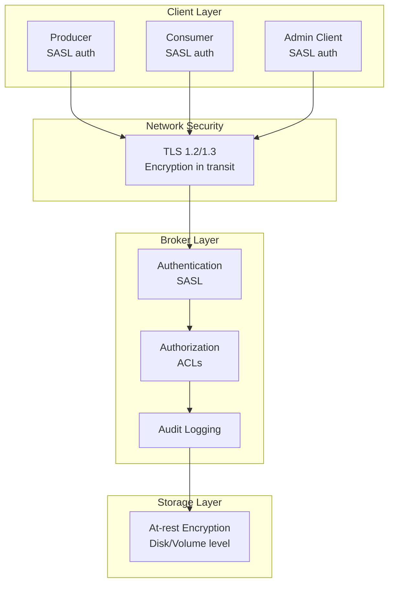
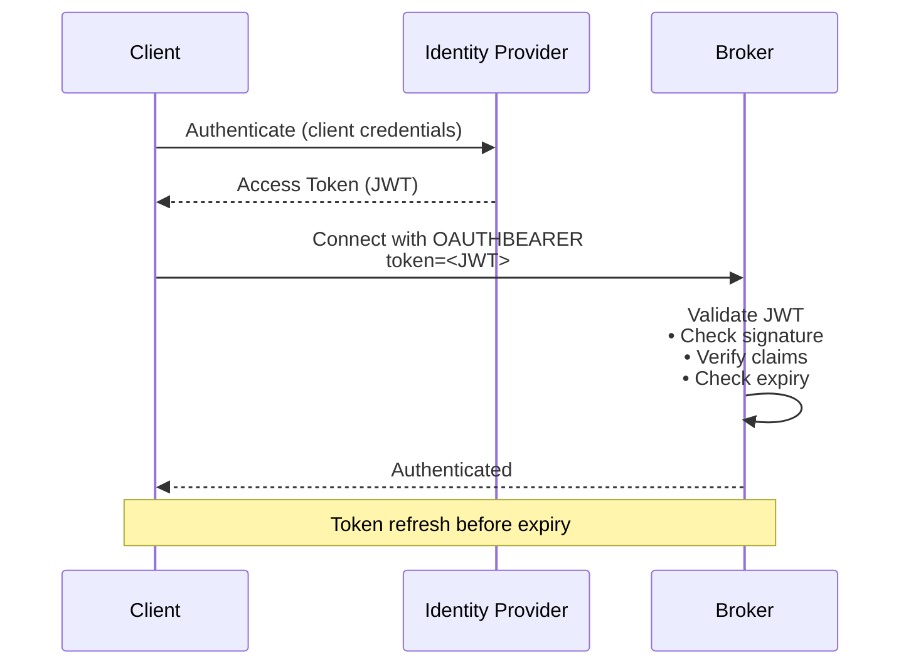
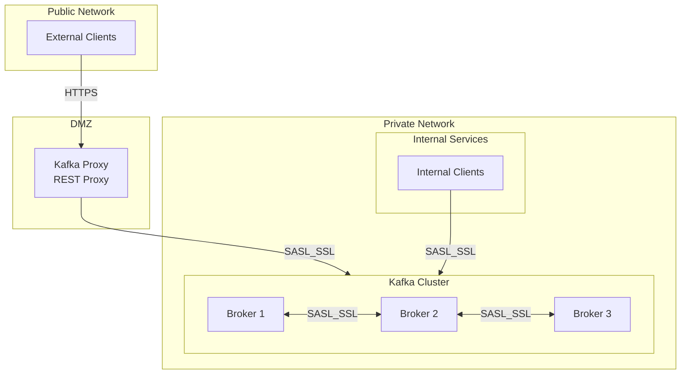

# Security and Compliance

[← Back to Index](./00-index.md)

---

## Security Architecture Overview



---

## Authentication

### SASL Mechanisms

| Mechanism | Description | Use Case | Security Level |
|-----------|-------------|----------|----------------|
| **PLAIN** | Username/password (cleartext) | Development, with TLS | Low (requires TLS) |
| **SCRAM-SHA-256/512** | Salted challenge-response | Production | High |
| **GSSAPI (Kerberos)** | Enterprise SSO integration | Enterprise with AD/LDAP | High |
| **OAUTHBEARER** | OAuth 2.0 tokens | Cloud, microservices | High |

### SASL Configuration

```
# Broker configuration (server.properties)

# Enable SASL
listeners=SASL_SSL://0.0.0.0:9093
advertised.listeners=SASL_SSL://broker1.example.com:9093
security.inter.broker.protocol=SASL_SSL

# SASL mechanism
sasl.mechanism.inter.broker.protocol=SCRAM-SHA-512
sasl.enabled.mechanisms=SCRAM-SHA-512

# JAAS configuration
listener.name.sasl_ssl.scram-sha-512.sasl.jaas.config=\
    org.apache.kafka.common.security.scram.ScramLoginModule required \
    username="admin" \
    password="admin-secret";
```

```
# Client configuration (producer/consumer)

security.protocol=SASL_SSL
sasl.mechanism=SCRAM-SHA-512
sasl.jaas.config=\
    org.apache.kafka.common.security.scram.ScramLoginModule required \
    username="producer-app" \
    password="producer-secret";
```

### User Management (SCRAM)

```
# Create user
kafka-configs --bootstrap-server broker:9093 \
    --alter --add-config 'SCRAM-SHA-512=[password=user-password]' \
    --entity-type users --entity-name myuser

# List users
kafka-configs --bootstrap-server broker:9093 \
    --describe --entity-type users

# Delete user
kafka-configs --bootstrap-server broker:9093 \
    --alter --delete-config 'SCRAM-SHA-512' \
    --entity-type users --entity-name myuser
```

### OAuth 2.0 / OIDC Integration



---

## Authorization (ACLs)

### ACL Model

```
┌─────────────────────────────────────────────────────────────────┐
│                    ACL STRUCTURE                                 │
├─────────────────────────────────────────────────────────────────┤
│                                                                  │
│  ACL Entry:                                                      │
│  ┌─────────────────────────────────────────────────────────┐   │
│  │ Principal:     User:alice                               │   │
│  │ Permission:    ALLOW                                    │   │
│  │ Operation:     READ                                     │   │
│  │ Resource Type: TOPIC                                    │   │
│  │ Resource Name: orders                                   │   │
│  │ Pattern Type:  LITERAL (or PREFIXED)                    │   │
│  │ Host:          * (or specific IP)                       │   │
│  └─────────────────────────────────────────────────────────┘   │
│                                                                  │
│  Resource Types:                                                 │
│  • TOPIC - Topic access                                         │
│  • GROUP - Consumer group access                                │
│  • CLUSTER - Cluster-level operations                           │
│  • TRANSACTIONAL_ID - Transaction access                        │
│  • DELEGATION_TOKEN - Token management                          │
│                                                                  │
│  Operations:                                                     │
│  • READ - Consume from topic, read group offsets               │
│  • WRITE - Produce to topic                                    │
│  • CREATE - Create topic, consumer group                       │
│  • DELETE - Delete topic, records                              │
│  • ALTER - Change topic config                                 │
│  • DESCRIBE - View topic metadata                              │
│  • CLUSTER_ACTION - Inter-broker operations                    │
│  • IDEMPOTENT_WRITE - Idempotent producer                      │
│  • ALL - All operations                                        │
│                                                                  │
└─────────────────────────────────────────────────────────────────┘
```

### ACL Management

```
# Enable ACL authorizer (server.properties)
authorizer.class.name=kafka.security.authorizer.AclAuthorizer
super.users=User:admin

# Grant produce access
kafka-acls --bootstrap-server broker:9093 \
    --add --allow-principal User:producer-app \
    --operation Write --operation Describe \
    --topic orders

# Grant consume access
kafka-acls --bootstrap-server broker:9093 \
    --add --allow-principal User:consumer-app \
    --operation Read --operation Describe \
    --topic orders \
    --group order-processors

# Grant access with prefix pattern (all topics starting with orders-)
kafka-acls --bootstrap-server broker:9093 \
    --add --allow-principal User:analytics-app \
    --operation Read \
    --topic orders --resource-pattern-type prefixed

# List ACLs
kafka-acls --bootstrap-server broker:9093 --list

# Remove ACL
kafka-acls --bootstrap-server broker:9093 \
    --remove --allow-principal User:old-app \
    --operation All --topic orders
```

### Service Account Patterns

```
┌─────────────────────────────────────────────────────────────────┐
│                    SERVICE ACCOUNT PATTERNS                      │
├─────────────────────────────────────────────────────────────────┤
│                                                                  │
│  Producer Application (order-service):                          │
│  ┌─────────────────────────────────────────────────────────┐   │
│  │ User: order-service                                      │   │
│  │ ACLs:                                                    │   │
│  │ • WRITE on TOPIC orders                                 │   │
│  │ • DESCRIBE on TOPIC orders                              │   │
│  │ • IDEMPOTENT_WRITE on CLUSTER                           │   │
│  │ • WRITE on TRANSACTIONAL_ID order-service-*            │   │
│  └─────────────────────────────────────────────────────────┘   │
│                                                                  │
│  Consumer Application (notification-service):                   │
│  ┌─────────────────────────────────────────────────────────┐   │
│  │ User: notification-service                               │   │
│  │ ACLs:                                                    │   │
│  │ • READ on TOPIC orders                                  │   │
│  │ • DESCRIBE on TOPIC orders                              │   │
│  │ • READ on GROUP notification-service-group             │   │
│  └─────────────────────────────────────────────────────────┘   │
│                                                                  │
│  Admin Application (kafka-admin):                               │
│  ┌─────────────────────────────────────────────────────────┐   │
│  │ User: kafka-admin                                        │   │
│  │ ACLs:                                                    │   │
│  │ • ALL on CLUSTER                                        │   │
│  │ • ALL on TOPIC * (or specific topics)                   │   │
│  │ • ALL on GROUP *                                        │   │
│  └─────────────────────────────────────────────────────────┘   │
│                                                                  │
└─────────────────────────────────────────────────────────────────┘
```

---

## Encryption

### In-Transit Encryption (TLS)

```
# Broker TLS configuration

# Keystore (broker's certificate)
ssl.keystore.location=/var/ssl/broker.keystore.jks
ssl.keystore.password=keystore-password
ssl.key.password=key-password

# Truststore (CA certificates)
ssl.truststore.location=/var/ssl/broker.truststore.jks
ssl.truststore.password=truststore-password

# TLS versions
ssl.enabled.protocols=TLSv1.3,TLSv1.2
ssl.protocol=TLSv1.3

# Cipher suites (TLS 1.3)
ssl.cipher.suites=TLS_AES_256_GCM_SHA384,TLS_CHACHA20_POLY1305_SHA256

# Client authentication (mTLS)
ssl.client.auth=required
```

### Certificate Setup

```
# Generate CA
openssl req -new -x509 -keyout ca-key -out ca-cert -days 365

# Generate broker keystore
keytool -keystore broker.keystore.jks -alias broker \
    -keyalg RSA -genkey -validity 365

# Create CSR
keytool -keystore broker.keystore.jks -alias broker \
    -certreq -file broker-csr

# Sign with CA
openssl x509 -req -CA ca-cert -CAkey ca-key \
    -in broker-csr -out broker-cert -days 365 -CAcreateserial

# Import CA and signed cert
keytool -keystore broker.keystore.jks -alias CARoot \
    -import -file ca-cert
keytool -keystore broker.keystore.jks -alias broker \
    -import -file broker-cert

# Create truststore with CA
keytool -keystore broker.truststore.jks -alias CARoot \
    -import -file ca-cert
```

### At-Rest Encryption

```
┌─────────────────────────────────────────────────────────────────┐
│                    AT-REST ENCRYPTION OPTIONS                    │
├─────────────────────────────────────────────────────────────────┤
│                                                                  │
│  Option 1: Volume/Disk Encryption                               │
│  ┌─────────────────────────────────────────────────────────┐   │
│  │ • LUKS (Linux Unified Key Setup)                         │   │
│  │ • Cloud provider disk encryption                         │   │
│  │ • Transparent to Kafka                                   │   │
│  │ • Recommended approach                                   │   │
│  └─────────────────────────────────────────────────────────┘   │
│                                                                  │
│  Option 2: Client-Side Encryption                               │
│  ┌─────────────────────────────────────────────────────────┐   │
│  │ • Encrypt before produce, decrypt after consume         │   │
│  │ • Key management in application                          │   │
│  │ • Broker cannot read data                               │   │
│  │ • Breaks compaction (can't see keys)                    │   │
│  └─────────────────────────────────────────────────────────┘   │
│                                                                  │
│  Note: Kafka does not have native at-rest encryption           │
│  Use volume encryption or client-side encryption               │
│                                                                  │
└─────────────────────────────────────────────────────────────────┘
```

---

## Threat Model

### Attack Vectors and Mitigations

| Threat | Attack Vector | Mitigation |
|--------|--------------|------------|
| **Unauthorized Access** | Direct broker connection | SASL authentication required |
| **Data Interception** | Network sniffing | TLS encryption in transit |
| **Privilege Escalation** | Weak ACLs | Principle of least privilege |
| **Data Exfiltration** | Unauthorized consume | ACLs on topics + audit logging |
| **DoS Attack** | Connection flood | Quotas, rate limiting |
| **Insider Threat** | Privileged user abuse | Audit logging, minimal super users |
| **Man-in-the-Middle** | DNS spoofing | mTLS, certificate pinning |
| **Data Tampering** | Message modification | Producer signing (application-level) |

### Quotas and Rate Limiting

```
# Broker quotas configuration

# Produce quota: 10 MB/s per user
quota.producer.default=10485760

# Consume quota: 20 MB/s per user
quota.consumer.default=20971520

# Per-client quota
kafka-configs --bootstrap-server broker:9093 \
    --alter --add-config 'producer_byte_rate=5242880,consumer_byte_rate=10485760' \
    --entity-type users --entity-name high-volume-app

# Request percentage quota (CPU throttling)
kafka-configs --bootstrap-server broker:9093 \
    --alter --add-config 'request_percentage=25' \
    --entity-type users --entity-name batch-processor
```

### Network Segmentation



---

## Audit Logging

### Audit Log Configuration

```
# Enable audit logging (Confluent Platform)
confluent.security.event.logger.enable=true
confluent.security.event.logger.destination.topics=_confluent-audit-log

# Log authentication events
confluent.security.event.logger.authentication.enable=true

# Log authorization events
confluent.security.event.logger.authorization.enable=true

# Audit log topics
confluent.security.event.logger.topic.create=true
confluent.security.event.logger.topic.replicas=3
confluent.security.event.logger.topic.partitions=12
```

### Audit Log Events

```
┌─────────────────────────────────────────────────────────────────┐
│                    AUDIT LOG EVENTS                              │
├─────────────────────────────────────────────────────────────────┤
│                                                                  │
│  Authentication Events:                                          │
│  {                                                               │
│    "type": "AUTHENTICATION",                                    │
│    "timestamp": "2024-01-15T10:30:00Z",                        │
│    "principal": "User:producer-app",                            │
│    "source_ip": "10.0.1.50",                                   │
│    "mechanism": "SCRAM-SHA-512",                                │
│    "result": "SUCCESS"                                          │
│  }                                                               │
│                                                                  │
│  Authorization Events:                                           │
│  {                                                               │
│    "type": "AUTHORIZATION",                                     │
│    "timestamp": "2024-01-15T10:30:01Z",                        │
│    "principal": "User:producer-app",                            │
│    "resource_type": "TOPIC",                                    │
│    "resource_name": "orders",                                   │
│    "operation": "WRITE",                                        │
│    "result": "ALLOWED",                                         │
│    "acl_applied": "User:producer-app ALLOW WRITE orders"       │
│  }                                                               │
│                                                                  │
│  Denied Access:                                                  │
│  {                                                               │
│    "type": "AUTHORIZATION",                                     │
│    "principal": "User:rogue-app",                               │
│    "resource_type": "TOPIC",                                    │
│    "resource_name": "sensitive-data",                           │
│    "operation": "READ",                                         │
│    "result": "DENIED",                                          │
│    "reason": "No matching ACL"                                  │
│  }                                                               │
│                                                                  │
└─────────────────────────────────────────────────────────────────┘
```

---

## Compliance Considerations

### GDPR Compliance

| Requirement | Implementation |
|------------|----------------|
| **Right to Erasure** | Log compaction with tombstones; delete user data by producing null |
| **Data Minimization** | Retention policies; don't store unnecessary data |
| **Data Portability** | Export user's data from topics |
| **Consent Tracking** | Separate consent events topic |
| **Audit Trail** | Audit logging for all data access |

**GDPR Data Deletion Pattern:**

```
// Deleting user data with compaction

// 1. Topic must have compaction enabled
// log.cleanup.policy=compact

// 2. Produce tombstone (null value) for user's key
producer.send(new ProducerRecord(
    topic: "user-data",
    key: "user:12345",
    value: null  // Tombstone
));

// 3. After delete.retention.ms, tombstone is removed
// User's data is now deleted from the log

// Note: Time-based retention topics require different approach
// Consider separate PII topics with shorter retention
```

### SOC 2 / ISO 27001

| Control Area | Kafka Implementation |
|-------------|---------------------|
| **Access Control** | SASL authentication, ACL authorization |
| **Encryption** | TLS in transit, volume encryption at rest |
| **Logging** | Audit logs, centralized log aggregation |
| **Change Management** | Config version control, deployment pipelines |
| **Monitoring** | Metrics, alerting, anomaly detection |
| **Incident Response** | Alert on auth failures, unauthorized access |

### PCI-DSS

```
┌─────────────────────────────────────────────────────────────────┐
│                    PCI-DSS CONSIDERATIONS                        │
├─────────────────────────────────────────────────────────────────┤
│                                                                  │
│  If processing cardholder data (CHD):                           │
│                                                                  │
│  1. Network Segmentation                                        │
│     • Kafka cluster in isolated network segment                 │
│     • Firewall rules restricting access                        │
│                                                                  │
│  2. Encryption                                                   │
│     • TLS 1.2+ required                                        │
│     • At-rest encryption for CHD topics                        │
│     • Consider client-side encryption for CHD                   │
│                                                                  │
│  3. Access Control                                              │
│     • Strict ACLs on CHD topics                                │
│     • Principle of least privilege                             │
│     • Regular access reviews                                    │
│                                                                  │
│  4. Monitoring                                                   │
│     • Log all access to CHD topics                             │
│     • Alert on unusual access patterns                         │
│     • Retain logs for 1 year                                   │
│                                                                  │
│  5. Data Retention                                              │
│     • Minimize CHD retention period                            │
│     • Tokenize where possible                                  │
│                                                                  │
│  Recommendation: Avoid storing raw CHD in Kafka                 │
│  Use tokenization or encryption before producing               │
│                                                                  │
└─────────────────────────────────────────────────────────────────┘
```

---

## Security Checklist

### Production Security Checklist

| Category | Item | Status |
|----------|------|--------|
| **Authentication** | SASL enabled | ☐ |
| | Strong mechanism (SCRAM-SHA-512+) | ☐ |
| | Service accounts per application | ☐ |
| | Password rotation policy | ☐ |
| **Authorization** | ACLs enabled | ☐ |
| | Least privilege ACLs | ☐ |
| | No anonymous access | ☐ |
| | Super users minimized | ☐ |
| **Encryption** | TLS 1.2+ for clients | ☐ |
| | TLS for inter-broker | ☐ |
| | At-rest encryption | ☐ |
| | mTLS for high security | ☐ |
| **Network** | Private network deployment | ☐ |
| | Firewall rules | ☐ |
| | No public exposure | ☐ |
| **Monitoring** | Audit logging enabled | ☐ |
| | Auth failure alerts | ☐ |
| | ACL change alerts | ☐ |
| **Operations** | Secrets in vault | ☐ |
| | Certificates managed | ☐ |
| | Security patches applied | ☐ |
