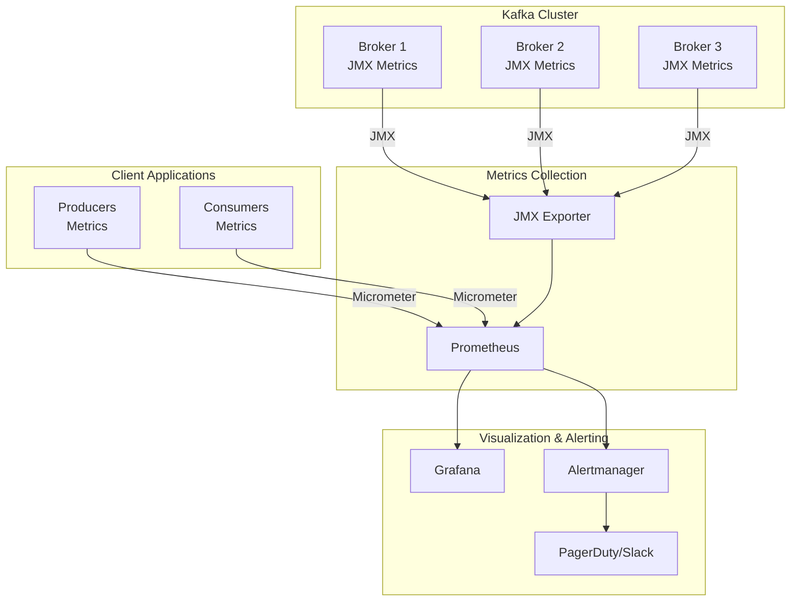
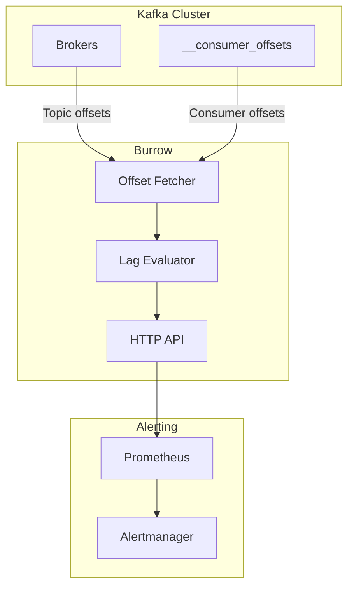
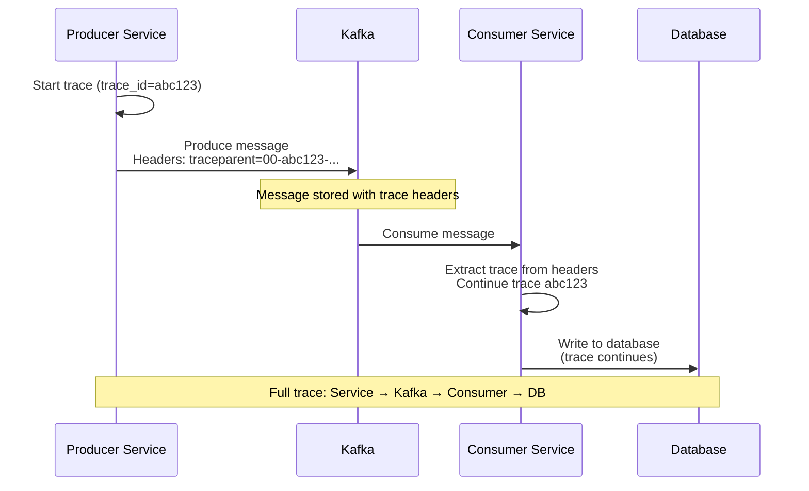

# Observability

[← Back to Index](./00-index.md)

---

## Observability Architecture



---

## Key Metrics

### Broker Metrics

| Metric | Description | Alert Threshold |
|--------|-------------|-----------------|
| `kafka.server:UnderReplicatedPartitions` | Partitions with ISR < replicas | > 0 for 5 min |
| `kafka.server:OfflinePartitionsCount` | Partitions with no leader | > 0 |
| `kafka.server:ActiveControllerCount` | Should be 1 cluster-wide | != 1 |
| `kafka.controller:ControllerState` | Controller state | != 3 (running) |
| `kafka.server:IsrShrinksPerSec` | ISR shrink rate | > 5/sec sustained |
| `kafka.server:IsrExpandsPerSec` | ISR expand rate | Informational |
| `kafka.server:LeaderElectionRateAndTimeMs` | Leader election rate | > 10/sec |

### Throughput Metrics

| Metric | Description | Normal Range |
|--------|-------------|--------------|
| `kafka.server:BytesInPerSec` | Bytes received per second | Varies by workload |
| `kafka.server:BytesOutPerSec` | Bytes sent per second | Varies by workload |
| `kafka.server:MessagesInPerSec` | Messages received per second | Varies by workload |
| `kafka.network:RequestsPerSec` | Requests per second by type | Varies |
| `kafka.server:TotalProduceRequestsPerSec` | Produce request rate | Varies |
| `kafka.server:TotalFetchRequestsPerSec` | Fetch request rate | Varies |

### Latency Metrics

| Metric | Description | Alert Threshold |
|--------|-------------|-----------------|
| `kafka.network:RequestMetrics:TotalTimeMs` | Total request time | p99 > 100ms |
| `kafka.network:RequestMetrics:LocalTimeMs` | Time in leader processing | p99 > 10ms |
| `kafka.network:RequestMetrics:RemoteTimeMs` | Time waiting for followers | p99 > 50ms |
| `kafka.network:RequestMetrics:RequestQueueTimeMs` | Time in request queue | p99 > 10ms |
| `kafka.network:RequestMetrics:ResponseQueueTimeMs` | Time in response queue | p99 > 10ms |
| `kafka.network:RequestMetrics:ResponseSendTimeMs` | Time sending response | p99 > 10ms |

### Resource Metrics

| Metric | Description | Alert Threshold |
|--------|-------------|-----------------|
| `kafka.server:LogFlushRateAndTimeMs` | Log flush latency | p99 > 100ms |
| `kafka.log:LogSize` | Size of log segments | Capacity planning |
| `kafka.server:ReplicaFetcherManager:MaxLag` | Max replication lag | > 10000 messages |
| `java.lang:HeapMemoryUsage` | JVM heap usage | > 80% |
| `java.lang:GarbageCollector:CollectionTime` | GC time | > 500ms |

---

## Consumer Lag Monitoring

### Consumer Lag Explained

```
┌─────────────────────────────────────────────────────────────────┐
│                    CONSUMER LAG                                  │
├─────────────────────────────────────────────────────────────────┤
│                                                                  │
│  Partition: orders-0                                            │
│                                                                  │
│  Log:                                                            │
│  ┌─────────────────────────────────────────────────────────┐   │
│  │ 0   1   2   3   4   5   6   7   8   9  10  11  12      │   │
│  │ [A] [B] [C] [D] [E] [F] [G] [H] [I] [J] [K] [L] [M]    │   │
│  │                     ↑               ↑           ↑       │   │
│  │                 Committed       Current     Log End     │   │
│  │                 Offset=3       Position=8  Offset=12   │   │
│  └─────────────────────────────────────────────────────────┘   │
│                                                                  │
│  Consumer Lag = Log End Offset - Committed Offset               │
│  Consumer Lag = 12 - 3 = 9 messages                             │
│                                                                  │
│  Current Position = messages fetched but not yet committed      │
│  (in-flight processing)                                         │
│                                                                  │
└─────────────────────────────────────────────────────────────────┘
```

### Lag Metrics

| Metric | Source | Description |
|--------|--------|-------------|
| `kafka.consumer:records-lag-max` | Consumer client | Max lag across partitions |
| `kafka.consumer:records-lag` | Consumer client | Lag per partition |
| `kafka_consumergroup_lag` | External (Burrow/Cruise Control) | Server-side lag calculation |

### Burrow for Lag Monitoring



**Burrow Status Levels:**

| Status | Meaning | Action |
|--------|---------|--------|
| `OK` | Lag is stable or decreasing | None |
| `WARN` | Lag is increasing | Investigate |
| `ERR` | Consumer stopped or stalled | Alert |
| `STOP` | Consumer has stopped consuming | Alert immediately |
| `STALL` | Committed offset unchanged | Alert |

---

## Prometheus Configuration

### JMX Exporter Configuration

```yaml
# jmx_exporter_config.yml
lowercaseOutputName: true
lowercaseOutputLabelNames: true

rules:
  # Broker metrics
  - pattern: kafka.server<type=(.+), name=(.+), clientId=(.+), topic=(.+), partition=(.*)><>Value
    name: kafka_server_$1_$2
    type: GAUGE
    labels:
      clientId: "$3"
      topic: "$4"
      partition: "$5"

  - pattern: kafka.server<type=(.+), name=(.+)><>Value
    name: kafka_server_$1_$2
    type: GAUGE

  # Under-replicated partitions
  - pattern: kafka.server<type=ReplicaManager, name=UnderReplicatedPartitions><>Value
    name: kafka_server_replica_manager_under_replicated_partitions
    type: GAUGE

  # Active controller count
  - pattern: kafka.controller<type=KafkaController, name=ActiveControllerCount><>Value
    name: kafka_controller_active_controller_count
    type: GAUGE

  # Request metrics
  - pattern: kafka.network<type=RequestMetrics, name=(.+), request=(.+)><>(.+)
    name: kafka_network_request_metrics_$1_$3
    type: GAUGE
    labels:
      request: "$2"

  # Consumer group lag (from __consumer_offsets)
  - pattern: kafka.server<type=FetcherLagMetrics, name=ConsumerLag, clientId=(.+), topic=(.+), partition=(.+)><>Value
    name: kafka_server_consumer_lag
    type: GAUGE
    labels:
      clientId: "$1"
      topic: "$2"
      partition: "$3"
```

### Prometheus Scrape Config

```yaml
# prometheus.yml
scrape_configs:
  - job_name: 'kafka-brokers'
    static_configs:
      - targets:
        - 'broker1:9404'
        - 'broker2:9404'
        - 'broker3:9404'
    relabel_configs:
      - source_labels: [__address__]
        target_label: instance
        regex: '(.+):9404'
        replacement: '${1}'

  - job_name: 'kafka-consumers'
    static_configs:
      - targets:
        - 'consumer-app1:8080'
        - 'consumer-app2:8080'
```

---

## Alerting Rules

### Critical Alerts

```yaml
# kafka_alerts.yml
groups:
  - name: kafka-critical
    rules:
      - alert: KafkaOfflinePartitions
        expr: kafka_server_replica_manager_offline_partitions_count > 0
        for: 1m
        labels:
          severity: critical
        annotations:
          summary: "Kafka has offline partitions"
          description: "{{ $value }} partitions are offline on {{ $labels.instance }}"

      - alert: KafkaNoActiveController
        expr: sum(kafka_controller_active_controller_count) != 1
        for: 1m
        labels:
          severity: critical
        annotations:
          summary: "Kafka has no active controller"
          description: "Active controller count is {{ $value }}, expected 1"

      - alert: KafkaUnderReplicatedPartitions
        expr: kafka_server_replica_manager_under_replicated_partitions > 0
        for: 5m
        labels:
          severity: warning
        annotations:
          summary: "Kafka has under-replicated partitions"
          description: "{{ $value }} partitions are under-replicated on {{ $labels.instance }}"

      - alert: KafkaISRShrink
        expr: rate(kafka_server_replica_manager_isr_shrinks_total[5m]) > 5
        for: 5m
        labels:
          severity: warning
        annotations:
          summary: "High ISR shrink rate"
          description: "ISR shrinking at {{ $value }}/sec on {{ $labels.instance }}"
```

### Consumer Alerts

```yaml
  - name: kafka-consumer
    rules:
      - alert: KafkaConsumerLagHigh
        expr: kafka_consumergroup_lag > 10000
        for: 10m
        labels:
          severity: warning
        annotations:
          summary: "High consumer lag"
          description: "Consumer group {{ $labels.group }} has lag of {{ $value }} on topic {{ $labels.topic }}"

      - alert: KafkaConsumerLagCritical
        expr: kafka_consumergroup_lag > 100000
        for: 5m
        labels:
          severity: critical
        annotations:
          summary: "Critical consumer lag"
          description: "Consumer group {{ $labels.group }} has lag of {{ $value }} on topic {{ $labels.topic }}"

      - alert: KafkaConsumerLagGrowing
        expr: rate(kafka_consumergroup_lag[10m]) > 100
        for: 15m
        labels:
          severity: warning
        annotations:
          summary: "Consumer lag is growing"
          description: "Lag growing at {{ $value }}/sec for group {{ $labels.group }}"
```

### Performance Alerts

```yaml
  - name: kafka-performance
    rules:
      - alert: KafkaProduceLatencyHigh
        expr: kafka_network_request_metrics_total_time_ms{request="Produce"} > 100
        for: 5m
        labels:
          severity: warning
        annotations:
          summary: "High produce latency"
          description: "Produce latency is {{ $value }}ms on {{ $labels.instance }}"

      - alert: KafkaDiskUsageHigh
        expr: (kafka_log_size / kafka_log_size_limit) > 0.8
        for: 30m
        labels:
          severity: warning
        annotations:
          summary: "High disk usage"
          description: "Disk usage is {{ $value | humanizePercentage }} on {{ $labels.instance }}"

      - alert: KafkaNetworkUsageHigh
        expr: rate(kafka_server_bytes_in_total[5m]) > 100000000  # 100 MB/s
        for: 10m
        labels:
          severity: warning
        annotations:
          summary: "High network ingress"
          description: "Network ingress is {{ $value | humanize }}B/s on {{ $labels.instance }}"
```

---

## Grafana Dashboards

### Broker Overview Dashboard

```
┌─────────────────────────────────────────────────────────────────┐
│                    KAFKA BROKER OVERVIEW                         │
├─────────────────────────────────────────────────────────────────┤
│                                                                  │
│  ┌─────────────┐ ┌─────────────┐ ┌─────────────┐ ┌───────────┐ │
│  │ Active      │ │ Under-      │ │ Offline     │ │ ISR       │ │
│  │ Controller  │ │ Replicated  │ │ Partitions  │ │ Shrinks   │ │
│  │     1       │ │     0       │ │     0       │ │   0/min   │ │
│  └─────────────┘ └─────────────┘ └─────────────┘ └───────────┘ │
│                                                                  │
│  ┌─────────────────────────────────────────────────────────────┐│
│  │ Messages In/Out Per Second                                   ││
│  │    ▲                                                         ││
│  │ 50K│    ╭────╮      ╭──────────────────╮                    ││
│  │    │   ╱      ╲    ╱                    ╲                   ││
│  │ 25K│  ╱        ╲──╱                      ╲──────            ││
│  │    │ ╱                                                       ││
│  │   0└──────────────────────────────────────────────────────▶ ││
│  │     00:00     06:00     12:00     18:00     24:00           ││
│  └─────────────────────────────────────────────────────────────┘│
│                                                                  │
│  ┌─────────────────────────────────────────────────────────────┐│
│  │ Request Latency (p99)                                        ││
│  │                                                              ││
│  │  Produce:  ████████████ 12ms                                ││
│  │  Fetch:    ████████ 8ms                                     ││
│  │  Metadata: ███ 3ms                                          ││
│  │                                                              ││
│  └─────────────────────────────────────────────────────────────┘│
│                                                                  │
│  ┌──────────────────────────┐ ┌────────────────────────────────┐│
│  │ Bytes In Per Broker      │ │ CPU Usage Per Broker           ││
│  │ broker-1: ████████ 80MB/s│ │ broker-1: ████████░░ 40%       ││
│  │ broker-2: ███████░ 70MB/s│ │ broker-2: ██████░░░░ 30%       ││
│  │ broker-3: ████████ 75MB/s│ │ broker-3: ███████░░░ 35%       ││
│  └──────────────────────────┘ └────────────────────────────────┘│
│                                                                  │
└─────────────────────────────────────────────────────────────────┘
```

### Consumer Lag Dashboard

```
┌─────────────────────────────────────────────────────────────────┐
│                    CONSUMER LAG DASHBOARD                        │
├─────────────────────────────────────────────────────────────────┤
│                                                                  │
│  Consumer Group: order-processor                                 │
│                                                                  │
│  ┌─────────────────────────────────────────────────────────────┐│
│  │ Total Lag Over Time                                          ││
│  │    ▲                                                         ││
│  │ 10K│         ╭─╮                                             ││
│  │    │        ╱   ╲                                            ││
│  │  5K│  ╭────╱     ╲────────────────────────────────          ││
│  │    │ ╱                                                       ││
│  │   0└──────────────────────────────────────────────────────▶ ││
│  └─────────────────────────────────────────────────────────────┘│
│                                                                  │
│  ┌─────────────────────────────────────────────────────────────┐│
│  │ Lag By Partition                                             ││
│  │                                                              ││
│  │  orders-0:  ████░░░░░░ 1,234                                ││
│  │  orders-1:  ██░░░░░░░░ 567                                  ││
│  │  orders-2:  █████████░ 2,890                                ││
│  │  orders-3:  ███░░░░░░░ 789                                  ││
│  │  orders-4:  ██░░░░░░░░ 456                                  ││
│  │  orders-5:  ████░░░░░░ 1,100                                ││
│  │                                                              ││
│  └─────────────────────────────────────────────────────────────┘│
│                                                                  │
│  ┌──────────────────────────┐ ┌────────────────────────────────┐│
│  │ Consumer Instances       │ │ Partition Assignment           ││
│  │                          │ │                                ││
│  │ consumer-1: ● Online     │ │ consumer-1: P0, P1             ││
│  │ consumer-2: ● Online     │ │ consumer-2: P2, P3             ││
│  │ consumer-3: ● Online     │ │ consumer-3: P4, P5             ││
│  └──────────────────────────┘ └────────────────────────────────┘│
│                                                                  │
└─────────────────────────────────────────────────────────────────┘
```

---

## Distributed Tracing

### Trace Propagation



### Trace Headers

```
MESSAGE HEADERS FOR TRACING:

Standard W3C Trace Context:
- traceparent: 00-<trace-id>-<span-id>-<flags>
- tracestate: vendor-specific data

Example:
{
  "traceparent": "00-4bf92f3577b34da6a3ce929d0e0e4736-00f067aa0ba902b7-01",
  "tracestate": "kafka=producer-service"
}

Implementation:
// Producer
message.headers().add("traceparent", currentTrace.toW3C());

// Consumer
String traceparent = message.headers().lastHeader("traceparent").value();
Span span = tracer.extract(traceparent);
```

---

## Logging

### Broker Logging Configuration

```properties
# log4j.properties

# Root logger
log4j.rootLogger=INFO, stdout, kafkaAppender

# Kafka request logging
log4j.logger.kafka.request.logger=WARN, requestAppender
log4j.additivity.kafka.request.logger=false

# Controller logging
log4j.logger.kafka.controller=INFO, controllerAppender
log4j.additivity.kafka.controller=false

# State change logging
log4j.logger.state.change.logger=INFO, stateChangeAppender
log4j.additivity.state.change.logger=false

# Log cleaner
log4j.logger.kafka.log.LogCleaner=INFO, cleanerAppender
log4j.additivity.kafka.log.LogCleaner=false
```

### Key Log Files

| Log File | Content | Use Case |
|----------|---------|----------|
| `server.log` | General broker logs | General troubleshooting |
| `controller.log` | Controller operations | Leader election issues |
| `state-change.log` | ISR changes, leader changes | Replication issues |
| `log-cleaner.log` | Compaction operations | Compaction debugging |
| `kafka-request.log` | Request timing (if enabled) | Performance analysis |

### Log Analysis Patterns

```
# Find leader elections
grep "LeaderAndIsr" server.log

# Find ISR changes
grep "Shrinking ISR\|Expanding ISR" state-change.log

# Find slow requests
grep "Request.*ms" kafka-request.log | awk '$NF > 100 {print}'

# Find authentication failures
grep "Authentication failed" server.log

# Find authorization failures
grep "Not authorized" server.log
```

---

## Health Checks

### Liveness and Readiness

```yaml
# Kubernetes health checks

livenessProbe:
  exec:
    command:
      - /bin/sh
      - -c
      - "kafka-broker-api-versions --bootstrap-server localhost:9092"
  initialDelaySeconds: 60
  periodSeconds: 30
  timeoutSeconds: 10

readinessProbe:
  exec:
    command:
      - /bin/sh
      - -c
      - |
        # Check if broker is in ISR for its partitions
        kafka-metadata --snapshot /var/kafka-logs/__cluster_metadata-0/00000000000000000000.log \
          --command "broker" | grep "RUNNING"
  initialDelaySeconds: 30
  periodSeconds: 10
  timeoutSeconds: 5
```

### Health Check Endpoints

```
┌─────────────────────────────────────────────────────────────────┐
│                    HEALTH CHECK STRATEGY                         │
├─────────────────────────────────────────────────────────────────┤
│                                                                  │
│  Level 1: Process Health                                        │
│  • Is the broker process running?                               │
│  • Check: Process exists, listening on port                     │
│                                                                  │
│  Level 2: API Health                                            │
│  • Can the broker respond to API requests?                      │
│  • Check: kafka-broker-api-versions succeeds                    │
│                                                                  │
│  Level 3: Cluster Health                                        │
│  • Is the broker participating in the cluster?                  │
│  • Check: Broker is registered, controller is reachable         │
│                                                                  │
│  Level 4: Replication Health                                    │
│  • Are the broker's partitions healthy?                         │
│  • Check: No offline partitions, ISR healthy                    │
│                                                                  │
│  Level 5: Performance Health                                    │
│  • Is the broker performing well?                               │
│  • Check: Latency within SLO, no resource exhaustion            │
│                                                                  │
└─────────────────────────────────────────────────────────────────┘
```
