# High-Level Design

[← Back to Index](./00-index.md)

---

## System Architecture

### Overview Diagram

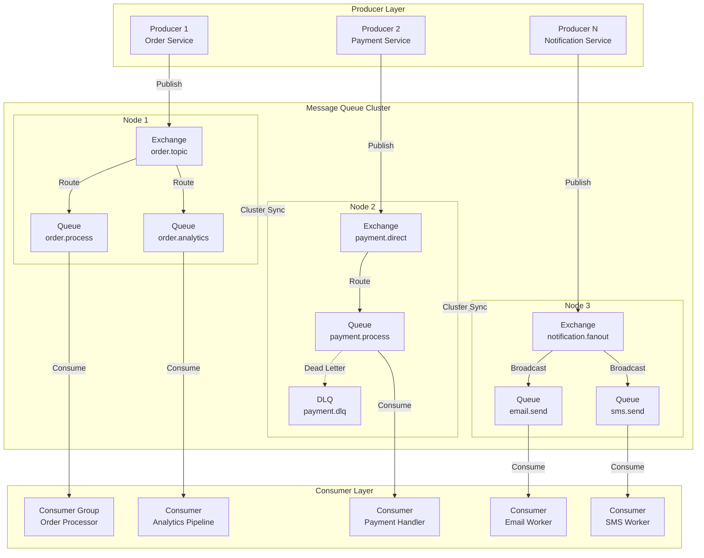

### Component Responsibilities

| Component | Responsibility | Scaling Strategy |
|-----------|---------------|------------------|
| **Producers** | Publish messages to exchanges with routing keys | Horizontal, stateless |
| **Exchanges** | Route messages to queues based on bindings | Replicated across cluster |
| **Queues** | Buffer messages until consumed | Distributed, quorum replication |
| **Consumers** | Process messages, send acknowledgments | Horizontal, competing consumers |
| **Cluster Nodes** | Host exchanges, queues, handle connections | Add nodes for capacity |

---

## Exchange Routing Architecture

### Direct Exchange Flow

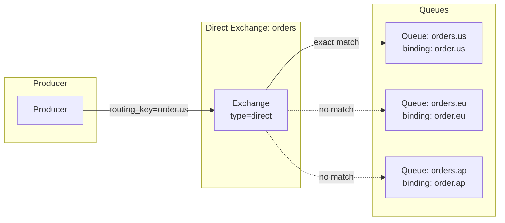

### Topic Exchange Flow

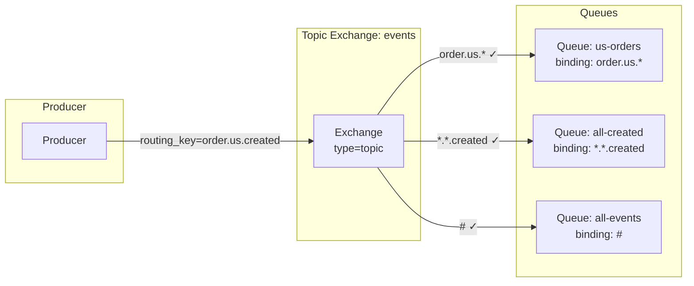

### Fanout Exchange Flow

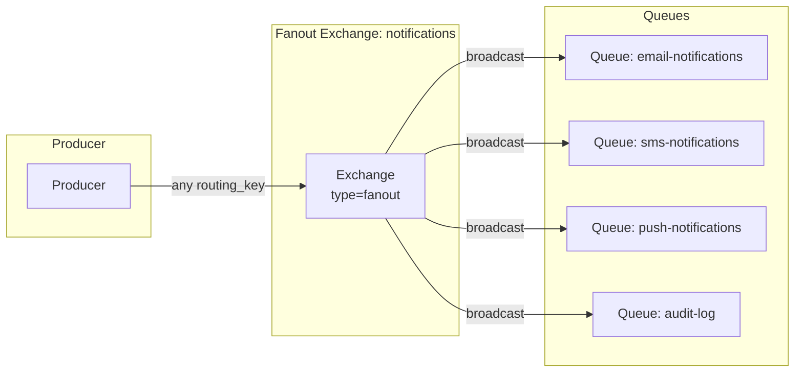

---

## Data Flow Patterns

### Publish with Confirms

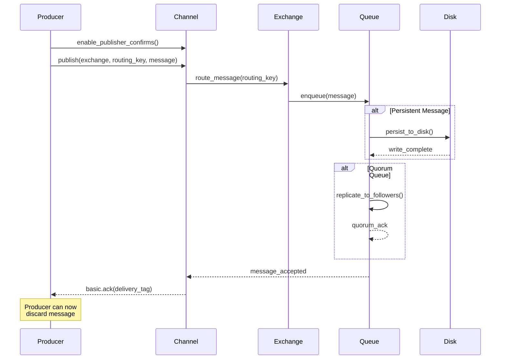

### Consume with Manual ACK

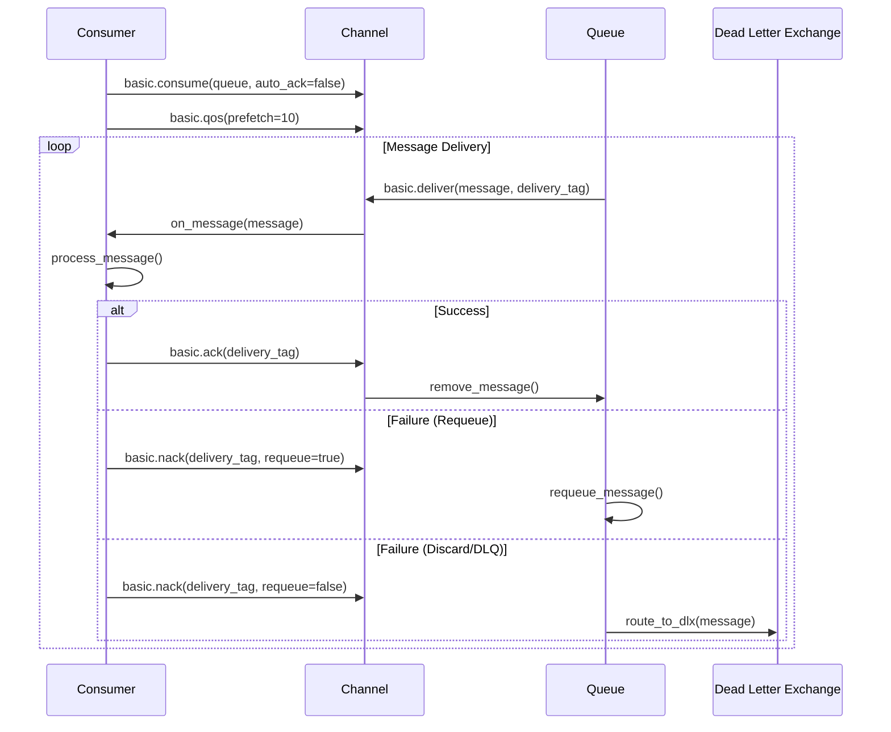

### Dead Letter Flow

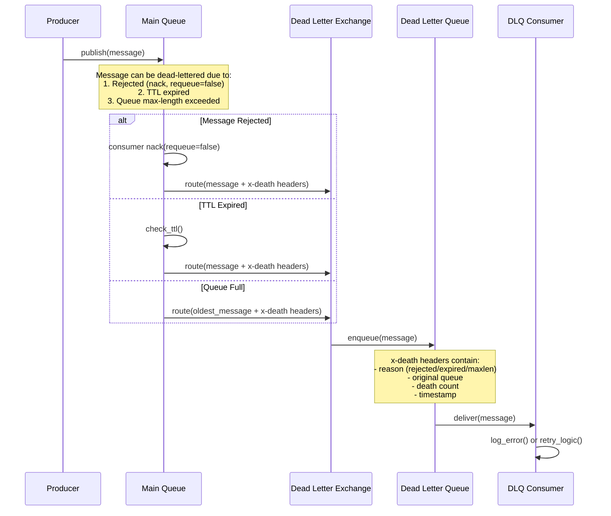

---

## Cluster Architecture

### Multi-Node Topology

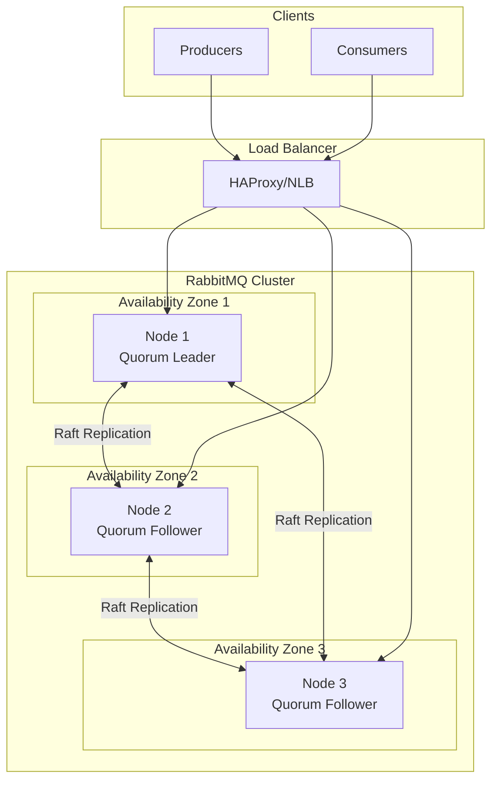

### Quorum Queue Replication

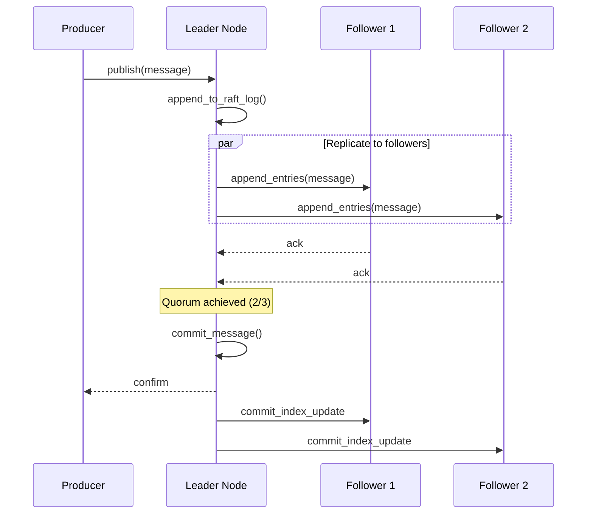

---

## Key Architectural Decisions

### Decision 1: Queue Type Selection

| Queue Type | Consistency | Performance | Use Case |
|------------|-------------|-------------|----------|
| **Classic Queue** | Eventual | Highest throughput | Non-critical, high volume |
| **Quorum Queue** | Strong (Raft) | Good | Critical data, HA required |
| **Stream** | Strong | Very High | Replay needed, high throughput |

**Recommendation:** Quorum queues for production workloads requiring durability.

**Rationale:**
- Raft consensus provides strong durability guarantees
- Automatic leader election on node failure
- No data loss with proper quorum
- Acceptable performance for most use cases

### Decision 2: Exchange Type Selection

| Exchange Type | Routing Logic | Performance | Use Case |
|---------------|---------------|-------------|----------|
| **Direct** | Exact key match | Highest | Point-to-point, work queues |
| **Fanout** | Broadcast all | High | Pub/sub, notifications |
| **Topic** | Pattern wildcards | Medium | Flexible routing, filtering |
| **Headers** | Header attributes | Lowest | Complex attribute routing |

**Recommendation:** Direct for work queues, Topic for flexible pub/sub.

### Decision 3: Acknowledgment Strategy

| Strategy | Guarantee | Throughput | Use Case |
|----------|-----------|------------|----------|
| **Auto ACK** | At-most-once | Highest | Metrics, non-critical |
| **Manual ACK** | At-least-once | Medium | Default for most apps |
| **Manual ACK + Dedup** | Exactly-once | Lower | Financial, orders |

**Recommendation:** Manual ACK with consumer-side idempotency.

### Decision 4: Message Persistence

| Option | Durability | Performance | Use Case |
|--------|------------|-------------|----------|
| **Transient** | None (in-memory) | Highest | Temporary data, cache invalidation |
| **Persistent** | Survives restart | Medium | Default for important data |
| **Lazy Queue** | Disk-first | Variable | Large backlogs, memory-constrained |

**Recommendation:** Persistent messages with quorum queues.

### Decision 5: Prefetch Strategy

```
┌─────────────────────────────────────────────────────────────────┐
│                    PREFETCH CONFIGURATION                        │
├─────────────────────────────────────────────────────────────────┤
│                                                                  │
│  Prefetch = 1 (Fair dispatch)                                   │
│  ┌─────────────────────────────────────────────────────────┐   │
│  │  Consumer 1: [M1] → process → ack → [M3] → ...          │   │
│  │  Consumer 2: [M2] → process → ack → [M4] → ...          │   │
│  │                                                          │   │
│  │  Pros: Even distribution, no overloaded consumers        │   │
│  │  Cons: Lower throughput, more round trips               │   │
│  │  Use: Long-running tasks, heterogeneous workers         │   │
│  └─────────────────────────────────────────────────────────┘   │
│                                                                  │
│  Prefetch = 10-100 (Batched dispatch)                           │
│  ┌─────────────────────────────────────────────────────────┐   │
│  │  Consumer 1: [M1,M2,M3...M10] → process batch → ack     │   │
│  │  Consumer 2: [M11,M12...M20] → process batch → ack      │   │
│  │                                                          │   │
│  │  Pros: Higher throughput, fewer round trips              │   │
│  │  Cons: Uneven if processing times vary                  │   │
│  │  Use: Fast processing, homogeneous workers              │   │
│  └─────────────────────────────────────────────────────────┘   │
│                                                                  │
│  Recommendation:                                                 │
│  • Start with prefetch=10                                       │
│  • Tune based on processing time and consumer count            │
│  • For long tasks: prefetch=1                                   │
│                                                                  │
└─────────────────────────────────────────────────────────────────┘
```

---

## Architecture Pattern Checklist

| Pattern | Decision | Rationale |
|---------|----------|-----------|
| ✅ Push vs Pull | Push (broker → consumer) | Low latency, immediate delivery |
| ✅ Sync vs Async | Async (non-blocking publish) | High throughput, decoupling |
| ✅ Stateful vs Stateless | Stateful (broker holds messages) | Buffering is core responsibility |
| ✅ Leader-Follower | Quorum (Raft-based) | Strong consistency, HA |
| ✅ Message Routing | Exchange-based | Flexible routing patterns |
| ✅ Acknowledgment | Manual ACK | Guaranteed processing |

---

## Integration Points

### Upstream (Producers)

| Producer Type | Protocol | Pattern |
|---------------|----------|---------|
| Application services | AMQP 0-9-1 | Direct publish |
| API gateways | AMQP | Request buffering |
| Event generators | AMQP | Event emission |
| Scheduled jobs | AMQP | Task scheduling |

### Downstream (Consumers)

| Consumer Type | Pattern | Concurrency |
|---------------|---------|-------------|
| Worker services | Competing consumers | Multiple workers per queue |
| Notification services | Fanout consumers | One per notification type |
| Analytics pipelines | Topic subscribers | Filtered consumption |
| Dead letter handlers | DLQ consumers | Retry/logging |

### Supporting Services

| Service | Purpose | Failure Impact |
|---------|---------|----------------|
| Load Balancer | Connection distribution | Failover to other nodes |
| DNS | Cluster discovery | Connection failures |
| Monitoring | Metrics collection | No functional impact |
| Secrets Manager | Credential rotation | Auth failures |

---

## Failure Modes and Mitigation

### Node Failure

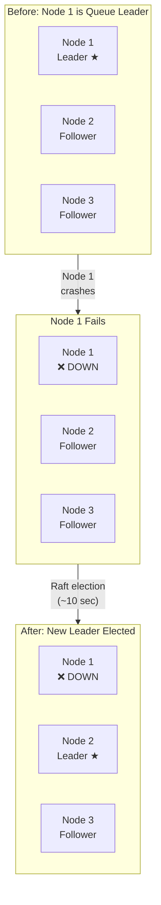

### Failure Mitigation Strategies

```
┌─────────────────────────────────────────────────────────────────┐
│                  FAILURE MITIGATION LAYERS                       │
├─────────────────────────────────────────────────────────────────┤
│                                                                  │
│  Layer 1: Publisher Confirms                                    │
│  ├── Wait for broker confirmation before discarding             │
│  ├── Retry on timeout or nack                                   │
│  └── Maintain outbox for recovery                               │
│                                                                  │
│  Layer 2: Quorum Queues                                         │
│  ├── Raft replication to multiple nodes                        │
│  ├── Automatic leader election on failure                       │
│  └── No data loss with quorum                                   │
│                                                                  │
│  Layer 3: Consumer ACK                                          │
│  ├── Message redelivered if consumer crashes                    │
│  ├── Prefetch limits unacked message exposure                  │
│  └── Idempotent processing handles redelivery                  │
│                                                                  │
│  Layer 4: Dead Letter Queues                                    │
│  ├── Capture failed messages for analysis                       │
│  ├── Implement retry strategies                                 │
│  └── Alert on DLQ growth                                        │
│                                                                  │
│  Layer 5: Cluster Redundancy                                    │
│  ├── Multi-AZ deployment                                        │
│  ├── Pause-minority partition handling                          │
│  └── Federation for DR                                          │
│                                                                  │
└─────────────────────────────────────────────────────────────────┘
```

| Failure | Detection | Mitigation | Impact |
|---------|-----------|------------|--------|
| Single node | Heartbeat (5s) | Raft leader election | ~10s unavailability for affected queues |
| Network partition | Cluster partition detector | Pause-minority mode | Minority side stops accepting writes |
| Disk failure | I/O errors | Node marked down, data on replicas | No data loss with quorum |
| Consumer crash | No heartbeat | Message redelivered to other consumer | Brief reprocessing delay |

---

## Deployment Topology Options

### Option 1: Single Region, Multi-AZ (Recommended)

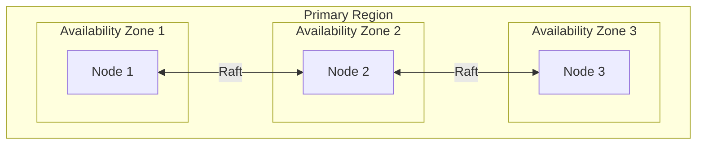

**Configuration:**
- 3 AZs, one node per AZ
- Quorum queues span all nodes
- Survives single AZ failure

### Option 2: Multi-Region with Federation

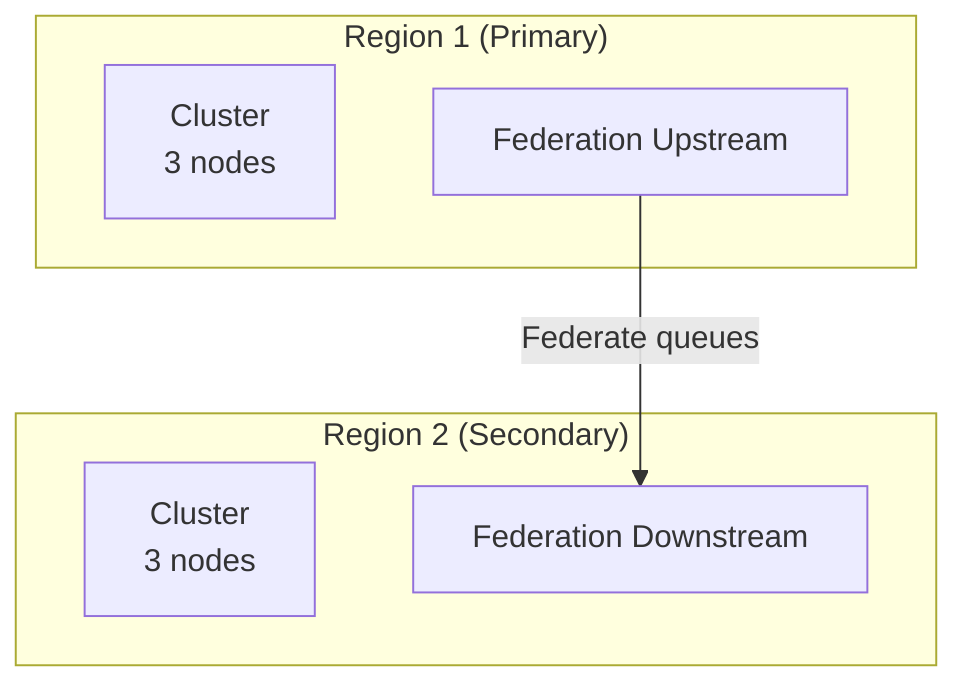

**Use Case:** Disaster recovery, geo-distributed consumers

### Option 3: Shovel for Cross-Cluster

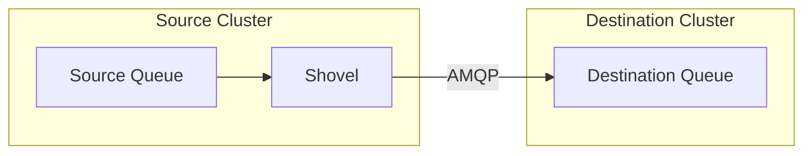

**Use Case:** One-way replication, data migration

### Deployment Comparison

| Aspect | Single Region Multi-AZ | Multi-Region Federation | Multi-Region Shovel |
|--------|------------------------|------------------------|---------------------|
| Latency | 1-5ms | Local: 1-5ms, cross-region: 50-200ms | Same as federation |
| Consistency | Strong (Raft) | Eventual | Eventual |
| Failover | Automatic | Manual | Manual |
| Complexity | Low | Medium | Low |
| Use Case | Most applications | Active-active | Data migration, DR |
