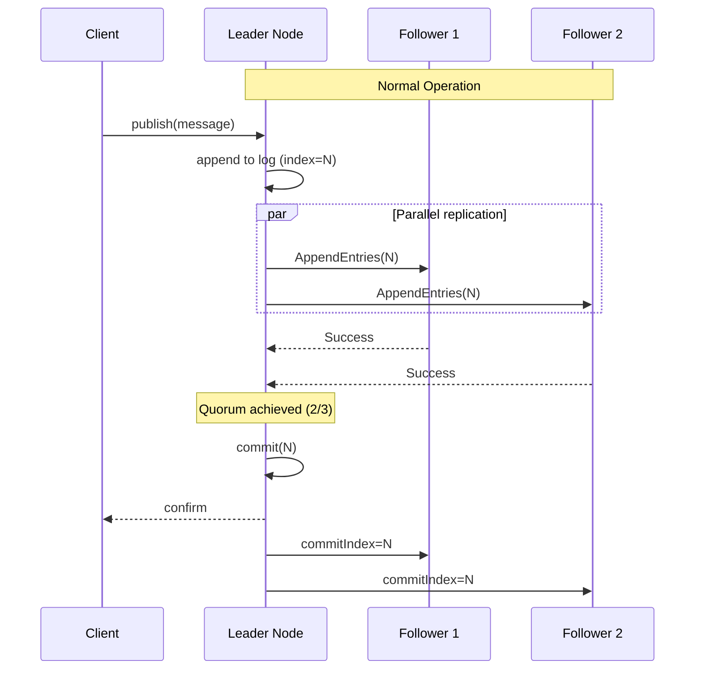
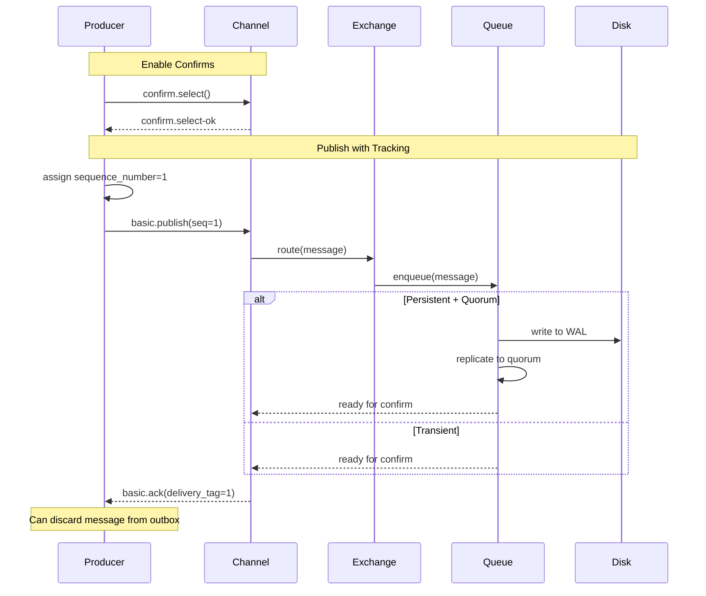

# Deep Dive and Bottlenecks

[← Back to Index](./00-index.md)

---

## Critical Component 1: Exchange Routing Engine

### How Exchange Routing Works

```
┌─────────────────────────────────────────────────────────────────┐
│                    EXCHANGE ROUTING ENGINE                       │
├─────────────────────────────────────────────────────────────────┤
│                                                                  │
│  Publisher ──► Channel ──► Exchange ──► Routing Engine          │
│                                              │                   │
│                                              ▼                   │
│                                   ┌──────────────────┐          │
│                                   │  Binding Lookup  │          │
│                                   └────────┬─────────┘          │
│                                            │                     │
│                          ┌─────────────────┼─────────────────┐  │
│                          ▼                 ▼                 ▼  │
│                    ┌──────────┐     ┌──────────┐     ┌──────────┐
│                    │  Direct  │     │  Topic   │     │ Headers  │
│                    │ (O(1))   │     │ (O(n))   │     │ (O(n×m)) │
│                    └────┬─────┘     └────┬─────┘     └────┬─────┘
│                         │                │                │     │
│                         ▼                ▼                ▼     │
│                   ┌─────────────────────────────────────────┐  │
│                   │          Target Queues Set              │  │
│                   └─────────────────────────────────────────┘  │
│                                         │                       │
│                                         ▼                       │
│                   ┌─────────────────────────────────────────┐  │
│                   │   Enqueue to each target queue          │  │
│                   │   (reference copy, not full copy)       │  │
│                   └─────────────────────────────────────────┘  │
│                                                                  │
└─────────────────────────────────────────────────────────────────┘
```

### Exchange Type Performance

| Exchange Type | Lookup Complexity | Memory | Use Case |
|---------------|-------------------|--------|----------|
| **Direct** | O(1) hash lookup | Low | Point-to-point, work queues |
| **Fanout** | O(1) iterate bindings | Low | Broadcast, pub/sub |
| **Topic** | O(B × W) pattern match | Medium | Flexible routing |
| **Headers** | O(B × H) header compare | High | Complex attribute routing |

*B = bindings, W = words in routing key, H = headers*

### Topic Exchange Trie Optimization

```
┌─────────────────────────────────────────────────────────────────┐
│                    TOPIC TRIE STRUCTURE                          │
├─────────────────────────────────────────────────────────────────┤
│                                                                  │
│  Bindings:                                                       │
│  • order.us.* → Queue A                                         │
│  • order.eu.* → Queue B                                         │
│  • order.# → Queue C                                            │
│  • *.*.created → Queue D                                        │
│                                                                  │
│  Trie Structure:                                                │
│                                                                  │
│                    (root)                                        │
│                      │                                           │
│          ┌──────────┼──────────┐                                │
│          ▼          ▼          ▼                                │
│       [order]     [*]        [#]                                │
│          │          │          │                                │
│    ┌─────┼─────┐    │          └──► Queue C (order.#)           │
│    ▼     ▼     ▼    │                                           │
│  [us]  [eu]  [#]    ▼                                           │
│    │     │     │   [*]                                          │
│    ▼     ▼     │    │                                           │
│  [*]   [*]    │    ▼                                           │
│    │     │    │  [created]                                      │
│    ▼     ▼    │    │                                           │
│  Q-A   Q-B   │    ▼                                           │
│              │  Queue D (*.*.created)                           │
│              │                                                   │
│              └──► Queue C                                        │
│                                                                  │
│  Matching "order.us.created":                                   │
│  1. Traverse: order → us → * (wildcard matches "created")       │
│  2. Also check: order → # (matches rest)                        │
│  3. Also check: * → * → created                                 │
│  Result: Queue A, Queue C, Queue D                              │
│                                                                  │
└─────────────────────────────────────────────────────────────────┘
```

### Failure Modes

| Failure | Cause | Impact | Mitigation |
|---------|-------|--------|------------|
| No matching queue | No binding for routing key | Message dropped (or returned if mandatory) | Monitor unroutable messages |
| Exchange not found | Deleted or never created | Channel error | Declare on startup, durable exchanges |
| Binding explosion | Too many bindings | Slow routing, memory pressure | Consolidate bindings, use topic exchange |

---

## Critical Component 2: Quorum Queue (Raft)

### Raft Consensus Overview



### Leader Election

```
┌─────────────────────────────────────────────────────────────────┐
│                    LEADER ELECTION                               │
├─────────────────────────────────────────────────────────────────┤
│                                                                  │
│  Election Timeout: 150-300ms (randomized)                       │
│                                                                  │
│  1. FOLLOWER STATE                                              │
│     • Receives heartbeats from leader                           │
│     • Resets election timer on heartbeat                        │
│     • If timer expires → become CANDIDATE                       │
│                                                                  │
│  2. CANDIDATE STATE                                             │
│     • Increment term                                            │
│     • Vote for self                                             │
│     • Send RequestVote to all peers                             │
│     • Win: Received majority votes → LEADER                     │
│     • Lose: Higher term seen → FOLLOWER                         │
│     • Timeout: No winner → New election                         │
│                                                                  │
│  3. LEADER STATE                                                │
│     • Send periodic heartbeats                                  │
│     • Handle all client requests                                │
│     • Replicate log entries                                     │
│     • Step down if higher term seen                             │
│                                                                  │
│  Election Timeline:                                              │
│  ┌────────────────────────────────────────────────────────────┐│
│  │ Leader fails │ Timeout (150-300ms) │ Election │ New Leader ││
│  │      ↓       │        ↓             │    ↓     │     ↓      ││
│  │  [────────────│──────────────────────│──────────│─────────] ││
│  │  0ms         │ 150ms               │ ~200ms   │ ~300ms    ││
│  └────────────────────────────────────────────────────────────┘│
│                                                                  │
│  Typical failover: 300ms - 1s                                   │
│                                                                  │
└─────────────────────────────────────────────────────────────────┘
```

### Poison Message Handling

```
┌─────────────────────────────────────────────────────────────────┐
│                    POISON MESSAGE HANDLING                       │
├─────────────────────────────────────────────────────────────────┤
│                                                                  │
│  Quorum queues support x-delivery-limit argument                │
│                                                                  │
│  Message Flow:                                                   │
│                                                                  │
│    ┌─────────┐     ┌─────────┐     ┌─────────┐                 │
│    │ Attempt │────►│ Attempt │────►│ Attempt │                 │
│    │    1    │     │    2    │     │    3    │                 │
│    └────┬────┘     └────┬────┘     └────┬────┘                 │
│         │               │               │                       │
│      NACK            NACK            NACK                       │
│    requeue          requeue          requeue                    │
│         │               │               │                       │
│         └───────────────┴───────────────┘                       │
│                         │                                        │
│                         ▼                                        │
│              delivery_count >= x-delivery-limit                  │
│                         │                                        │
│                         ▼                                        │
│              ┌──────────────────────┐                           │
│              │   Dead Letter Queue   │                           │
│              │   (x-death headers)   │                           │
│              └──────────────────────┘                           │
│                                                                  │
│  x-death headers include:                                        │
│  • reason: "delivery_limit"                                     │
│  • count: 3                                                      │
│  • queue: "original-queue"                                      │
│                                                                  │
│  Configuration:                                                  │
│  • x-delivery-limit: 3 (attempts before DLQ)                   │
│  • x-dead-letter-exchange: "dlx"                               │
│                                                                  │
└─────────────────────────────────────────────────────────────────┘
```

### Quorum Queue vs Classic Queue

| Aspect | Classic Queue | Quorum Queue |
|--------|---------------|--------------|
| **Replication** | Mirrored (deprecated) | Raft consensus |
| **Consistency** | Eventual | Strong |
| **Data Safety** | May lose data on failure | No data loss with quorum |
| **Performance** | Higher throughput | ~20% lower throughput |
| **Memory** | In-memory first | Write-ahead log |
| **Non-Durable** | Supported | Not supported |
| **Priority** | Supported | Not supported |
| **Lazy Mode** | Supported | Always lazy-ish |
| **Poison Messages** | Manual handling | x-delivery-limit |

---

## Critical Component 3: Acknowledgment Pipeline

### Publisher Confirms Flow



### Consumer ACK Flow

```
┌─────────────────────────────────────────────────────────────────┐
│                    CONSUMER ACK FLOW                             │
├─────────────────────────────────────────────────────────────────┤
│                                                                  │
│  Queue State:                                                    │
│  ┌─────────────────────────────────────────────────────────┐   │
│  │  Messages:  [M1] [M2] [M3] [M4] [M5]                     │   │
│  │             ready ready unack unack ready                 │   │
│  │                        ↑     ↑                           │   │
│  │                   delivered to consumer                   │   │
│  └─────────────────────────────────────────────────────────┘   │
│                                                                  │
│  Delivery Tags (per channel):                                   │
│  ┌─────────────────────────────────────────────────────────┐   │
│  │  M3: delivery_tag=1                                      │   │
│  │  M4: delivery_tag=2                                      │   │
│  └─────────────────────────────────────────────────────────┘   │
│                                                                  │
│  ACK Operations:                                                 │
│                                                                  │
│  1. basic.ack(delivery_tag=1, multiple=false)                  │
│     → Remove M3 from queue                                      │
│                                                                  │
│  2. basic.ack(delivery_tag=2, multiple=true)                   │
│     → Remove all up to M4 (M3 and M4)                          │
│                                                                  │
│  3. basic.nack(delivery_tag=1, requeue=true)                   │
│     → Move M3 back to ready state                              │
│                                                                  │
│  4. basic.nack(delivery_tag=1, requeue=false)                  │
│     → Route to DLX or discard                                  │
│                                                                  │
│  Consumer Crash Handling:                                        │
│  • Channel closed → All unacked messages requeued              │
│  • Prefetch limits exposure to reprocessing                    │
│                                                                  │
└─────────────────────────────────────────────────────────────────┘
```

### Redelivery and Idempotency

```
FUNCTION handle_message(message):
    // Check for redelivery
    IF message.redelivered:
        LOG.warn("Processing redelivered message", message.message_id)

    // Idempotency check (application-level)
    IF dedup_store.exists(message.message_id):
        LOG.info("Duplicate message, skipping", message.message_id)
        channel.basic_ack(message.delivery_tag)
        RETURN

    TRY:
        // Process message
        result = process_business_logic(message)

        // Record processing (idempotency key)
        dedup_store.set(message.message_id, result, TTL=24h)

        // Acknowledge
        channel.basic_ack(message.delivery_tag)

    CATCH TransientError:
        // Temporary failure - requeue for retry
        channel.basic_nack(message.delivery_tag, requeue=true)

    CATCH PermanentError:
        // Permanent failure - send to DLQ
        LOG.error("Permanent failure", message)
        channel.basic_nack(message.delivery_tag, requeue=false)
```

---

## Concurrency and Race Conditions

### Race Condition 1: Multiple Consumers Same Queue

```
┌─────────────────────────────────────────────────────────────────┐
│                    COMPETING CONSUMERS                           │
├─────────────────────────────────────────────────────────────────┤
│                                                                  │
│  Scenario: Two consumers, one queue, prefetch=1                 │
│                                                                  │
│  Time │ Queue State       │ Consumer 1      │ Consumer 2        │
│  ─────│───────────────────│─────────────────│───────────────────│
│  T1   │ [M1,M2,M3,M4]     │                 │                   │
│  T2   │ [M2,M3,M4]        │ receives M1     │                   │
│  T3   │ [M3,M4]           │ processing      │ receives M2       │
│  T4   │ [M4]              │ processing      │ processing        │
│  T5   │ [M4]              │ ACK M1          │ processing        │
│  T6   │ []                │ receives M3     │ ACK M2            │
│  T7   │ []                │ processing      │ receives M4       │
│                                                                  │
│  Guarantees:                                                     │
│  ✓ Each message delivered to exactly one consumer               │
│  ✓ No message lost (with ACK)                                   │
│  ✓ Fair distribution (round-robin with prefetch=1)              │
│                                                                  │
│  NOT Guaranteed:                                                 │
│  ✗ Processing order (M2 might finish before M1)                 │
│  ✗ Even distribution if processing times vary                   │
│                                                                  │
└─────────────────────────────────────────────────────────────────┘
```

### Race Condition 2: ACK After Consumer Crash

```
┌─────────────────────────────────────────────────────────────────┐
│                    CONSUMER CRASH SCENARIO                       │
├─────────────────────────────────────────────────────────────────┤
│                                                                  │
│  Timeline:                                                       │
│                                                                  │
│  T1: Consumer receives M1 (delivery_tag=1)                      │
│  T2: Consumer starts processing M1                              │
│  T3: Consumer CRASHES                                           │
│  T4: Broker detects closed connection (heartbeat timeout)       │
│  T5: Broker requeues M1 (redelivered=true)                      │
│  T6: Consumer 2 receives M1                                      │
│  T7: Consumer 2 processes M1 (duplicate processing!)            │
│                                                                  │
│  Problem: M1 may have been partially processed                   │
│                                                                  │
│  Mitigation Strategies:                                          │
│                                                                  │
│  1. Idempotent Processing:                                       │
│     • Use message_id as idempotency key                         │
│     • Check before processing                                    │
│                                                                  │
│  2. Transactional Outbox:                                        │
│     • Store processing result in same transaction               │
│     • Check on redelivery                                       │
│                                                                  │
│  3. Small Prefetch:                                              │
│     • Limit unacked messages (prefetch=1 for strict ordering)   │
│     • Reduces reprocessing on crash                             │
│                                                                  │
└─────────────────────────────────────────────────────────────────┘
```

### Race Condition 3: Publish During Network Partition

```
┌─────────────────────────────────────────────────────────────────┐
│                    NETWORK PARTITION SCENARIO                    │
├─────────────────────────────────────────────────────────────────┤
│                                                                  │
│  Cluster: 3 nodes (A, B, C)                                     │
│  Partition: [A] | [B, C]                                        │
│                                                                  │
│  With Quorum Queues (pause-minority mode):                      │
│                                                                  │
│  Node A (minority):                                              │
│  • Detects partition                                            │
│  • Pauses (stops accepting connections)                         │
│  • Publishes fail immediately                                   │
│                                                                  │
│  Nodes B, C (majority):                                         │
│  • Continue operating                                           │
│  • Elect new leader if needed                                   │
│  • Accept publishes normally                                    │
│                                                                  │
│  Producer Impact:                                                │
│  • Connected to A: Publish fails, reconnect to B or C          │
│  • Connected to B or C: Normal operation                        │
│                                                                  │
│  Consumer Impact:                                                │
│  • Connected to A: Disconnected, reconnect                      │
│  • Unacked messages on A: Requeued after partition heals        │
│                                                                  │
│  Partition Healing:                                              │
│  • A rejoins cluster                                            │
│  • Syncs state from B/C                                         │
│  • Resumes normal operation                                     │
│                                                                  │
└─────────────────────────────────────────────────────────────────┘
```

---

## Bottleneck Analysis

### Bottleneck 1: Single-Threaded Queue

```
┌─────────────────────────────────────────────────────────────────┐
│                    SINGLE QUEUE BOTTLENECK                       │
├─────────────────────────────────────────────────────────────────┤
│                                                                  │
│  Problem:                                                        │
│  • Each queue is single-threaded (Erlang process)               │
│  • Max throughput per queue: ~50K msg/sec                       │
│  • Multiple consumers don't help beyond this limit              │
│                                                                  │
│  Symptoms:                                                       │
│  • Queue process CPU at 100%                                    │
│  • Queue depth growing despite consumers                        │
│  • Publish latency increasing                                   │
│                                                                  │
│  Mitigation: Queue Sharding                                     │
│                                                                  │
│  Before (single queue):                                          │
│  ┌────────────────────────────────────────────────────────┐    │
│  │  Exchange ──► Queue (50K max) ──► Consumers            │    │
│  └────────────────────────────────────────────────────────┘    │
│                                                                  │
│  After (sharded queues):                                         │
│  ┌────────────────────────────────────────────────────────┐    │
│  │  Exchange ──┬──► Queue-1 ──► Consumer Group 1          │    │
│  │  (x-con-   ├──► Queue-2 ──► Consumer Group 2          │    │
│  │   sistent  ├──► Queue-3 ──► Consumer Group 3          │    │
│  │   hash)    └──► Queue-4 ──► Consumer Group 4          │    │
│  │                                                        │    │
│  │  Total: 4 × 50K = 200K msg/sec                        │    │
│  └────────────────────────────────────────────────────────┘    │
│                                                                  │
│  Implementation:                                                 │
│  • Use consistent-hash exchange plugin                          │
│  • Or application-level sharding (hash on message key)          │
│  • Shard count based on expected throughput                     │
│                                                                  │
└─────────────────────────────────────────────────────────────────┘
```

### Bottleneck 2: Memory Pressure

```
┌─────────────────────────────────────────────────────────────────┐
│                    MEMORY PRESSURE                               │
├─────────────────────────────────────────────────────────────────┤
│                                                                  │
│  Problem:                                                        │
│  • Messages held in memory by default                           │
│  • Large queue depth = high memory usage                        │
│  • Memory alarm triggers flow control                           │
│                                                                  │
│  Memory Flow Control:                                            │
│  ┌────────────────────────────────────────────────────────┐    │
│  │  Memory Usage                                          │    │
│  │  │                                                     │    │
│  │  │  ██████████████████████████  High Watermark (40%)  │    │
│  │  │  ████████████████            Flow Control Starts   │    │
│  │  │  ██████████                   Publishers Blocked   │    │
│  │  │                                                     │    │
│  │  └───────────────────────────────────────── Memory    │    │
│  └────────────────────────────────────────────────────────┘    │
│                                                                  │
│  Mitigation Strategies:                                          │
│                                                                  │
│  1. Lazy Queues (x-queue-mode: lazy):                          │
│     • Page messages to disk immediately                         │
│     • Only message metadata in memory                           │
│     • Higher latency, much lower memory                         │
│                                                                  │
│  2. Message TTL:                                                │
│     • Set x-message-ttl on queue                               │
│     • Expired messages removed automatically                    │
│                                                                  │
│  3. Queue Length Limits:                                        │
│     • x-max-length: Max message count                          │
│     • x-max-length-bytes: Max queue size                       │
│     • x-overflow: drop-head | reject-publish                   │
│                                                                  │
│  4. Consumer Scaling:                                           │
│     • Add consumers to reduce queue depth                       │
│     • Increase prefetch for throughput                          │
│                                                                  │
└─────────────────────────────────────────────────────────────────┘
```

### Bottleneck 3: Network Between Cluster Nodes

```
┌─────────────────────────────────────────────────────────────────┐
│                    CLUSTER NETWORK BOTTLENECK                    │
├─────────────────────────────────────────────────────────────────┤
│                                                                  │
│  Problem:                                                        │
│  • Quorum queues replicate to all nodes                         │
│  • High message rate = high inter-node traffic                  │
│  • Cross-AZ traffic adds latency                                │
│                                                                  │
│  Traffic Pattern (3-node cluster, 100K msg/sec):                │
│                                                                  │
│  ┌──────────┐     ┌──────────┐     ┌──────────┐                │
│  │  Node 1  │────►│  Node 2  │────►│  Node 3  │                │
│  │ (Leader) │◄────│(Follower)│◄────│(Follower)│                │
│  └──────────┘     └──────────┘     └──────────┘                │
│                                                                  │
│  Inter-node traffic (per node):                                 │
│  • Outbound: 100K × 1KB × 2 replicas = 200MB/sec               │
│  • Inbound: ~200MB/sec (acks, heartbeats)                       │
│  • Total: ~400MB/sec per node = 3.2Gbps                        │
│                                                                  │
│  Mitigation:                                                     │
│                                                                  │
│  1. Dedicated Cluster Network:                                  │
│     • Separate NIC for inter-node traffic                       │
│     • Higher bandwidth, lower latency                           │
│                                                                  │
│  2. Topology Optimization:                                      │
│     • Place queue leaders close to producers                    │
│     • Use rack awareness                                        │
│                                                                  │
│  3. Reduce Replication:                                         │
│     • Use classic queues for non-critical data                 │
│     • Smaller quorum size (3 vs 5 nodes)                       │
│                                                                  │
│  4. Batch More Aggressively:                                    │
│     • Fewer, larger messages                                    │
│     • Producer batching                                         │
│                                                                  │
└─────────────────────────────────────────────────────────────────┘
```

### Bottleneck 4: Disk I/O

```
┌─────────────────────────────────────────────────────────────────┐
│                    DISK I/O BOTTLENECK                           │
├─────────────────────────────────────────────────────────────────┤
│                                                                  │
│  Problem:                                                        │
│  • Persistent messages written to disk                          │
│  • Quorum queues use write-ahead log                           │
│  • Lazy queues page all messages to disk                       │
│                                                                  │
│  I/O Pattern:                                                    │
│  • Sequential writes (good for SSDs and HDDs)                   │
│  • fsync on each publish (for durability)                       │
│  • Random reads on consume (if not in page cache)               │
│                                                                  │
│  IOPS Calculation (100K msg/sec):                               │
│  • Write: 100K writes/sec (sequential)                          │
│  • Sync: 100K fsyncs/sec (can be batched)                      │
│  • Read: 100K reads/sec (if not cached)                        │
│                                                                  │
│  Mitigation:                                                     │
│                                                                  │
│  1. NVMe SSDs:                                                  │
│     • 100K+ IOPS                                                │
│     • Low latency (sub-ms)                                      │
│     • Essential for high throughput                             │
│                                                                  │
│  2. RAID Configuration:                                         │
│     • RAID 10 for balanced read/write                          │
│     • Separate data and WAL disks                               │
│                                                                  │
│  3. Filesystem Tuning:                                          │
│     • XFS or ext4 with appropriate options                      │
│     • Disable atime                                             │
│     • barrier=0 if using battery-backed cache                   │
│                                                                  │
│  4. Batch Publishes:                                            │
│     • Group messages into batches                               │
│     • Fewer fsyncs per message                                  │
│                                                                  │
└─────────────────────────────────────────────────────────────────┘
```

---

## Performance Optimization Checklist

### Producer Optimizations

| Optimization | Impact | Trade-off |
|--------------|--------|-----------|
| Enable confirms, batch wait | Medium | Slightly higher latency |
| Use persistent=false for non-critical | High | Risk of data loss |
| Batch messages client-side | High | Complexity, latency |
| Use direct exchange | Medium | Less routing flexibility |
| Connection pooling | High | Resource management |

### Consumer Optimizations

| Optimization | Impact | Trade-off |
|--------------|--------|-----------|
| Increase prefetch (10-100) | High | Uneven distribution |
| Use auto-ack for non-critical | High | Risk of message loss |
| Batch ACKs (multiple=true) | Medium | Larger reprocessing window |
| Async processing | High | Complexity |
| Scale consumers horizontally | High | Ordering not guaranteed |

### Broker Optimizations

| Optimization | Impact | Trade-off |
|--------------|--------|-----------|
| Use lazy queues for large backlogs | High | Higher latency |
| Set appropriate TTL | Medium | Messages may expire |
| Use quorum queues for critical data | High | Lower throughput |
| Shard high-throughput queues | High | Operational complexity |
| Tune vm_memory_high_watermark | Medium | Risk of flow control |
