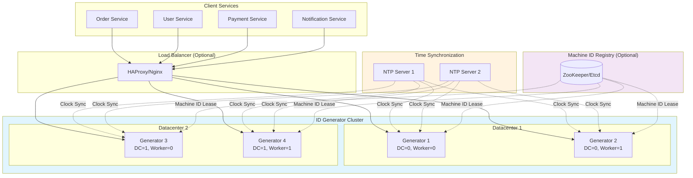
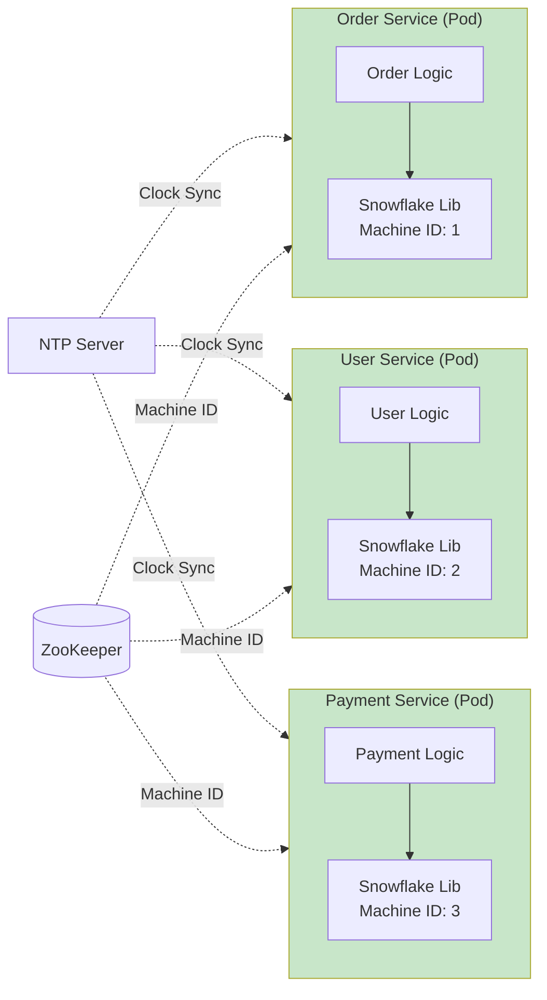
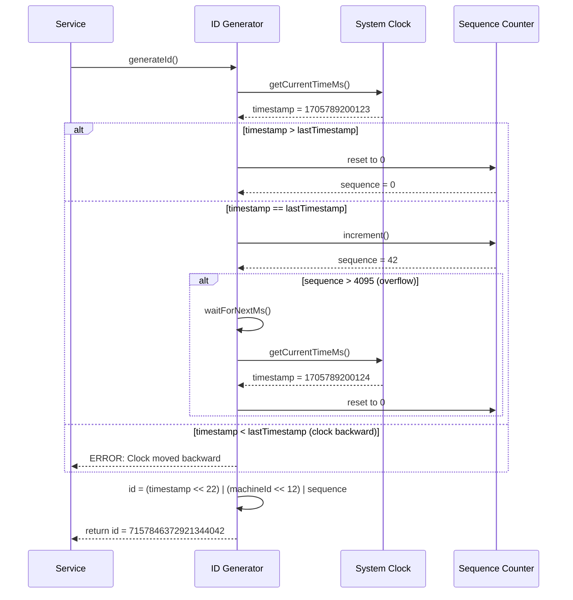
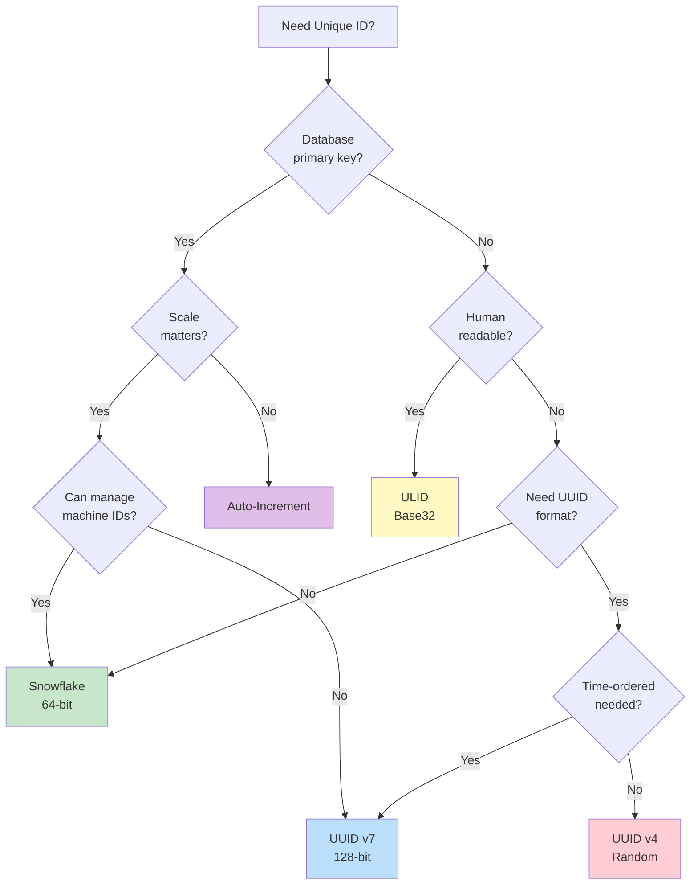

# High-Level Design

[← Back to Index](./00-index.md)

---

## Approach Comparison

Before diving into architecture, let's compare the major approaches to distributed ID generation:

### 1. Database Auto-Increment

```
┌─────────────────────────────────────────────────────────────────┐
│              APPROACH 1: DATABASE AUTO-INCREMENT                 │
├─────────────────────────────────────────────────────────────────┤
│                                                                  │
│  ┌─────────┐    ┌─────────┐    ┌─────────┐                     │
│  │Service A│    │Service B│    │Service C│                     │
│  └────┬────┘    └────┬────┘    └────┬────┘                     │
│       │              │              │                           │
│       └──────────────┴──────────────┘                           │
│                      │                                          │
│                      ▼                                          │
│               ┌────────────┐                                    │
│               │  Database  │                                    │
│               │ (auto_inc) │                                    │
│               └────────────┘                                    │
│                                                                  │
│  Pros:                          Cons:                           │
│  • Simplest to implement        • Single point of failure       │
│  • Perfect ordering             • Network round-trip per ID     │
│  • Native DB support            • Scalability ceiling           │
│                                 • Cross-region complexity       │
│                                                                  │
│  Use when: Small scale, single region, simplicity preferred     │
│                                                                  │
└─────────────────────────────────────────────────────────────────┘
```

### 2. UUID v4 (Random)

```
┌─────────────────────────────────────────────────────────────────┐
│              APPROACH 2: UUID v4 (RANDOM)                        │
├─────────────────────────────────────────────────────────────────┤
│                                                                  │
│  ┌─────────┐    ┌─────────┐    ┌─────────┐                     │
│  │Service A│    │Service B│    │Service C│                     │
│  │  UUID() │    │  UUID() │    │  UUID() │                     │
│  └─────────┘    └─────────┘    └─────────┘                     │
│       │              │              │                           │
│       ▼              ▼              ▼                           │
│  No coordination - each generates independently                 │
│                                                                  │
│  Structure: 128 bits of randomness (122 random + 6 version)     │
│  Example: 550e8400-e29b-41d4-a716-446655440000                  │
│                                                                  │
│  Pros:                          Cons:                           │
│  • Zero coordination            • Not sortable by time          │
│  • Universally unique           • 128 bits (2x Snowflake)       │
│  • Works offline                • Poor B-tree performance       │
│  • Standard format              • No embedded timestamp         │
│                                                                  │
│  Use when: Offline-first, security-sensitive, UUID required     │
│                                                                  │
└─────────────────────────────────────────────────────────────────┘
```

### 3. UUID v7 (Time-Ordered) - RFC 9562

```
┌─────────────────────────────────────────────────────────────────┐
│              APPROACH 3: UUID v7 (RFC 9562, 2024)                │
├─────────────────────────────────────────────────────────────────┤
│                                                                  │
│  Structure:                                                      │
│  ┌──────────────────┬─────────┬─────────┬─────────┬──────────┐ │
│  │    Timestamp     │ Version │ rand_a  │ Variant │  rand_b  │ │
│  │     48 bits      │ 4 bits  │ 12 bits │ 2 bits  │ 62 bits  │ │
│  └──────────────────┴─────────┴─────────┴─────────┴──────────┘ │
│                                                                  │
│  Example: 018f6b7c-d8a2-7def-8c3a-9b2f4e7a1b3c                  │
│                       ↑         ↑                               │
│                    version=7  variant=10                        │
│                                                                  │
│  Pros:                          Cons:                           │
│  • Time-ordered                 • Still 128 bits                │
│  • Zero coordination            • Relatively new (2024)         │
│  • UUID-compatible              • Slight ordering variance in   │
│  • Better B-tree perf             same millisecond              │
│  • Official standard                                            │
│                                                                  │
│  Use when: Need UUID format but want time-ordering              │
│                                                                  │
└─────────────────────────────────────────────────────────────────┘
```

### 4. Twitter Snowflake (64-bit)

```
┌─────────────────────────────────────────────────────────────────┐
│              APPROACH 4: TWITTER SNOWFLAKE                       │
├─────────────────────────────────────────────────────────────────┤
│                                                                  │
│  Structure (64 bits):                                            │
│  ┌──────┬───────────────────────┬───────────┬──────────────┐   │
│  │ Sign │      Timestamp        │ Machine   │   Sequence   │   │
│  │ 1 bit│      41 bits          │ 10 bits   │   12 bits    │   │
│  └──────┴───────────────────────┴───────────┴──────────────┘   │
│                                                                  │
│  Example: 1541815603606036480 (decimal)                         │
│           = 0x1563ABCD1234 (hex)                                │
│                                                                  │
│  Capacity:                                                       │
│  • 4,096 IDs per ms per machine                                 │
│  • 1,024 machines max (32 DCs × 32 workers)                     │
│  • 69.7 years lifetime                                          │
│                                                                  │
│  Pros:                          Cons:                           │
│  • 64 bits (half of UUID)       • Needs machine ID assignment   │
│  • Excellent B-tree perf        • Clock drift sensitivity       │
│  • Time-ordered                 • Custom format (not UUID)      │
│  • Very high throughput         • Limited to 1024 machines      │
│                                                                  │
│  Use when: High scale, DB performance critical, can manage IDs  │
│                                                                  │
└─────────────────────────────────────────────────────────────────┘
```

### 5. ULID (Universally Unique Lexicographically Sortable Identifier)

```
┌─────────────────────────────────────────────────────────────────┐
│              APPROACH 5: ULID                                    │
├─────────────────────────────────────────────────────────────────┤
│                                                                  │
│  Structure (128 bits):                                           │
│  ┌────────────────────────────┬─────────────────────────────┐  │
│  │        Timestamp           │         Randomness          │  │
│  │         48 bits            │          80 bits            │  │
│  └────────────────────────────┴─────────────────────────────┘  │
│                                                                  │
│  String format (26 chars, Crockford Base32):                    │
│  01ARZ3NDEKTSV4RRFFQ69G5FAV                                     │
│  └──────────┘└───────────────┘                                  │
│   Timestamp    Randomness                                       │
│                                                                  │
│  Pros:                          Cons:                           │
│  • Lexicographically sortable   • 128 bits                      │
│  • Human-readable               • Collision possible in same ms │
│  • URL-safe                     • Not a standard (community)    │
│  • Zero coordination            • String storage larger         │
│                                                                  │
│  Use when: Logs, URLs, human-visible IDs, sorting needed        │
│                                                                  │
└─────────────────────────────────────────────────────────────────┘
```

### 6. Database Ticket Servers (Flickr Approach)

```
┌─────────────────────────────────────────────────────────────────┐
│              APPROACH 6: TICKET SERVERS (FLICKR)                 │
├─────────────────────────────────────────────────────────────────┤
│                                                                  │
│  Two database servers, alternating odd/even:                     │
│                                                                  │
│  ┌─────────────┐              ┌─────────────┐                   │
│  │  Ticket DB  │              │  Ticket DB  │                   │
│  │   Server 1  │              │   Server 2  │                   │
│  │ (odd: 1,3,5)│              │(even: 2,4,6)│                   │
│  └──────┬──────┘              └──────┬──────┘                   │
│         │                            │                          │
│         └────────────┬───────────────┘                          │
│                      │                                          │
│               ┌──────┴──────┐                                   │
│               │ Load Balancer│                                  │
│               └─────────────┘                                   │
│                                                                  │
│  SQL: REPLACE INTO tickets (stub) VALUES ('a');                 │
│       SELECT LAST_INSERT_ID();                                  │
│                                                                  │
│  Server 1: auto_increment_increment=2, auto_increment_offset=1  │
│  Server 2: auto_increment_increment=2, auto_increment_offset=2  │
│                                                                  │
│  Pros:                          Cons:                           │
│  • Sequential-looking IDs       • Still DB dependency           │
│  • Simple to understand         • Network round-trip            │
│  • Redundancy built-in          • Limited throughput            │
│                                                                  │
│  Use when: Need sequential IDs, can tolerate DB dependency      │
│                                                                  │
└─────────────────────────────────────────────────────────────────┘
```

### 7. Segment Allocation (Meituan Leaf)

```
┌─────────────────────────────────────────────────────────────────┐
│              APPROACH 7: SEGMENT ALLOCATION (LEAF)               │
├─────────────────────────────────────────────────────────────────┤
│                                                                  │
│  ┌───────────────────────────────────────────────────────────┐ │
│  │  Database (Segment Store)                                  │ │
│  │  ┌────────────┬─────────┬──────┬────────────────────────┐ │ │
│  │  │  biz_tag   │ max_id  │ step │      description       │ │ │
│  │  ├────────────┼─────────┼──────┼────────────────────────┤ │ │
│  │  │  orders    │ 2000    │ 1000 │ Order IDs              │ │ │
│  │  │  users     │ 5000    │ 1000 │ User IDs               │ │ │
│  │  └────────────┴─────────┴──────┴────────────────────────┘ │ │
│  └───────────────────────────────────────────────────────────┘ │
│                         │                                       │
│         ┌───────────────┴───────────────┐                      │
│         ▼                               ▼                      │
│  ┌─────────────────┐           ┌─────────────────┐            │
│  │  Leaf Server 1  │           │  Leaf Server 2  │            │
│  │ Current: 1000   │           │ Current: 1500   │            │
│  │ Max: 2000       │           │ Max: 2500       │            │
│  │ Buffer: 2000-3000│          │ Buffer: 2500-3500│           │
│  └─────────────────┘           └─────────────────┘            │
│                                                                  │
│  Double Buffer: Pre-fetch next segment when 10% remaining       │
│                                                                  │
│  Pros:                          Cons:                           │
│  • Batch allocation (fewer DB)  • Still needs DB               │
│  • Sequential within segment    • More complex                 │
│  • Predictable IDs              • Segment boundaries visible   │
│                                                                  │
│  Use when: Enterprise, want sequential, batch allocation        │
│                                                                  │
└─────────────────────────────────────────────────────────────────┘
```

---

## Approach Comparison Matrix

| Approach | Size | Sortable | Coordination | Throughput | DB-Friendly | Complexity |
|----------|------|----------|--------------|------------|-------------|------------|
| Auto-increment | 64-bit | Yes | Every call | Low | Best | Lowest |
| UUID v4 | 128-bit | No | None | Medium | Poor | Low |
| UUID v7 | 128-bit | Yes | None | Medium | Good | Low |
| **Snowflake** | 64-bit | Yes | Machine ID only | **Very High** | **Excellent** | Medium |
| ULID | 128-bit | Yes | None | Medium | Good | Low |
| Ticket Servers | 64-bit | Yes | Every call | Low | Best | Medium |
| Segment Alloc | 64-bit | ~Yes | Periodic | High | Excellent | High |

**Recommendation for high-scale systems:** Twitter Snowflake or similar (Instagram, Sonyflake)

---

## System Architecture: Snowflake-Style Generator

### Architecture Diagram



### Alternative: Embedded Library Architecture



**Recommendation:** Embedded library is preferred for lower latency (no network hop).

---

## ID Generation Sequence



---

## Data Flow: End-to-End

```
┌─────────────────────────────────────────────────────────────────┐
│                     ID GENERATION DATA FLOW                      │
├─────────────────────────────────────────────────────────────────┤
│                                                                  │
│  1. Service Startup (One-time)                                   │
│  ┌─────────────────────────────────────────────────────────┐   │
│  │ Service → ZooKeeper: "Request machine ID lease"          │   │
│  │ ZooKeeper → Service: "Assigned machine_id = 42"          │   │
│  │ Service: Initialize Snowflake generator with machine_id  │   │
│  └─────────────────────────────────────────────────────────┘   │
│                                                                  │
│  2. ID Generation (Per Request)                                  │
│  ┌─────────────────────────────────────────────────────────┐   │
│  │ Application Code                                         │   │
│  │     │                                                    │   │
│  │     ▼                                                    │   │
│  │ generator.nextId()                                       │   │
│  │     │                                                    │   │
│  │     ├─── Get current timestamp (system call)            │   │
│  │     ├─── Compare with last timestamp                    │   │
│  │     ├─── Update sequence (atomic)                       │   │
│  │     ├─── Combine bits: timestamp | machine_id | seq     │   │
│  │     │                                                    │   │
│  │     ▼                                                    │   │
│  │ Return 64-bit ID                                         │   │
│  │     │                                                    │   │
│  │     ▼                                                    │   │
│  │ Use in database INSERT, message key, etc.               │   │
│  └─────────────────────────────────────────────────────────┘   │
│                                                                  │
│  3. ID Parsing (Optional, for debugging)                         │
│  ┌─────────────────────────────────────────────────────────┐   │
│  │ ID: 7157846372921344042                                  │   │
│  │     │                                                    │   │
│  │     ├─── Extract timestamp: (id >> 22) + EPOCH          │   │
│  │     │    → 1705789200123 ms → 2024-01-20 15:00:00.123   │   │
│  │     ├─── Extract machine_id: (id >> 12) & 0x3FF         │   │
│  │     │    → 42 (DC=1, Worker=10)                         │   │
│  │     └─── Extract sequence: id & 0xFFF                   │   │
│  │          → 42                                            │   │
│  └─────────────────────────────────────────────────────────┘   │
│                                                                  │
└─────────────────────────────────────────────────────────────────┘
```

---

## Key Architectural Decisions

### Decision 1: Centralized Service vs Embedded Library

| Factor | Centralized Service | Embedded Library |
|--------|---------------------|------------------|
| **Latency** | +0.5-2ms network hop | Near-zero (in-process) |
| **Deployment** | Separate service to manage | Library dependency |
| **Machine ID** | Service manages | Each instance needs ID |
| **Failure impact** | All services affected | Only that instance |
| **Consistency** | Single source of truth | Distributed state |

**Recommendation:** Embedded library for most use cases. Centralized service only if you need strict sequential IDs or centralized management.

### Decision 2: Machine ID Assignment Strategy

| Strategy | Pros | Cons | Use When |
|----------|------|------|----------|
| **Static Config** | Simple, no dependencies | Manual, error-prone | Small, stable clusters |
| **ZooKeeper/Etcd** | Automatic, lease-based | Adds dependency | Kubernetes, dynamic scaling |
| **IP/MAC-based** | No coordination | Collision risk | Legacy systems |
| **Database seq** | Guaranteed unique | DB needed at startup | Enterprise, strict control |

**Recommendation:** ZooKeeper/Etcd for dynamic environments, static config for small deployments.

### Decision 3: Clock Drift Handling

| Strategy | Behavior | Trade-off |
|----------|----------|-----------|
| **Refuse + Wait** | Throw error or wait until clock catches up | Safest, may cause brief unavailability |
| **Borrow from Future** | Use last_timestamp + 1 | Trades lifetime for availability |
| **Hybrid Logical Clocks** | Combine physical and logical time | More complex, handles drift better |

**Recommendation:** Refuse + Wait for most systems. It's safer and clock drift should be rare with proper NTP.

---

## Architecture Pattern Checklist

| Decision | Choice | Justification |
|----------|--------|---------------|
| Sync vs Async | **Synchronous** | ID needed immediately for insert |
| Push vs Pull | **Pull** | Services request IDs when needed |
| Stateless vs Stateful | **Mostly Stateless** | Only sequence counter as state |
| Library vs Service | **Library (preferred)** | Lower latency, no network hop |
| Single vs Multi-region | **Multi-region capable** | Assign DC ID in machine ID bits |
| Real-time vs Batch | **Real-time** | IDs generated on-demand |

---

## Comparison: When to Use What



---

## Summary

The Snowflake approach (or its variants like Sonyflake, Instagram's sharded IDs) is the **recommended choice for high-scale systems** because:

1. **64-bit size** - Excellent database index performance
2. **Time-ordered** - Natural sorting, good B-tree locality
3. **High throughput** - 4M+ IDs/sec per machine
4. **No runtime coordination** - Only one-time machine ID setup
5. **Proven at scale** - Twitter, Discord, Instagram, and thousands of others

For systems that need **UUID compatibility** or **truly zero coordination**, UUID v7 (RFC 9562) is the modern standard choice.
