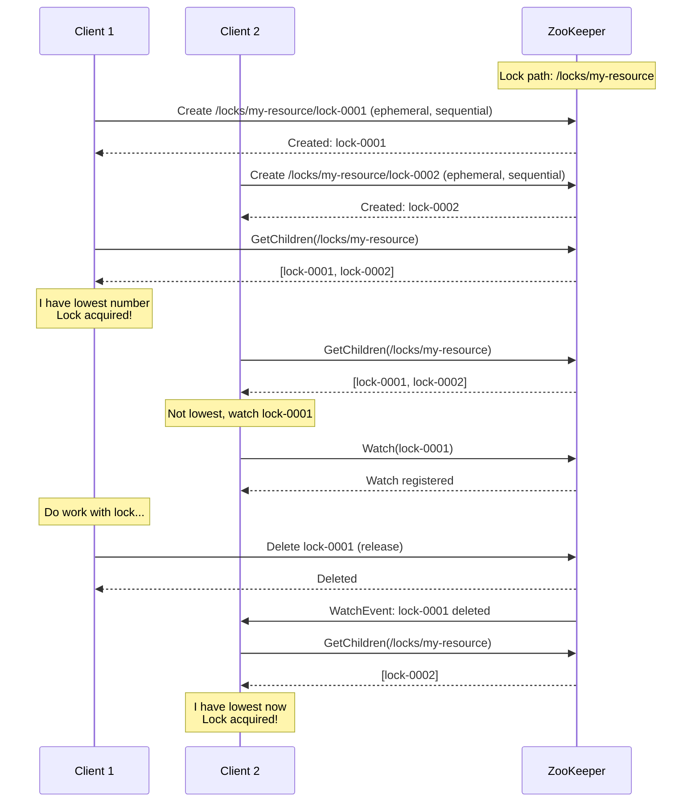
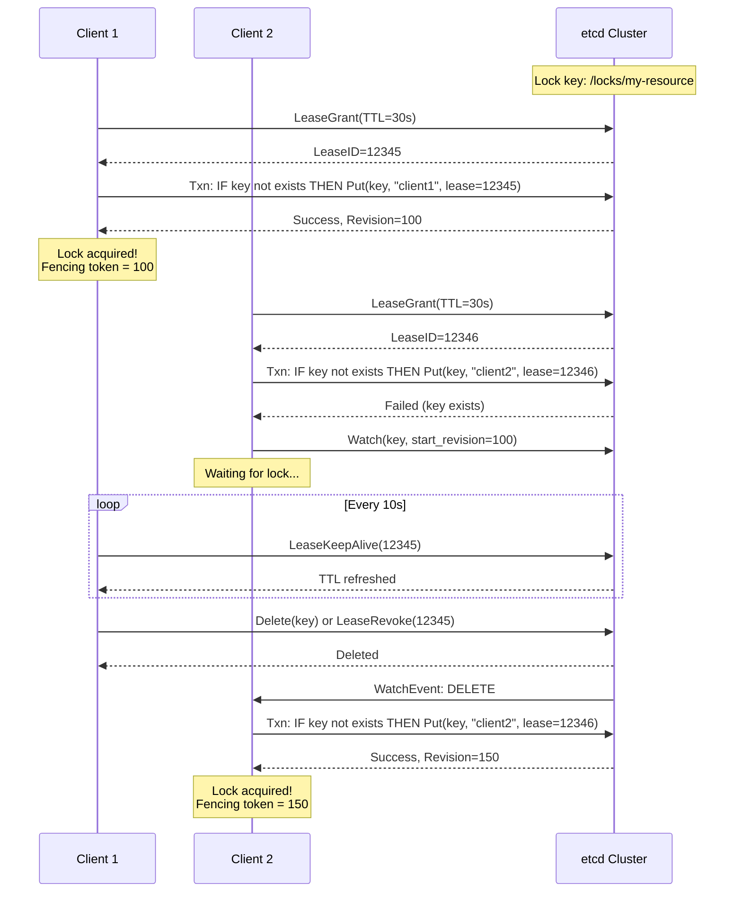
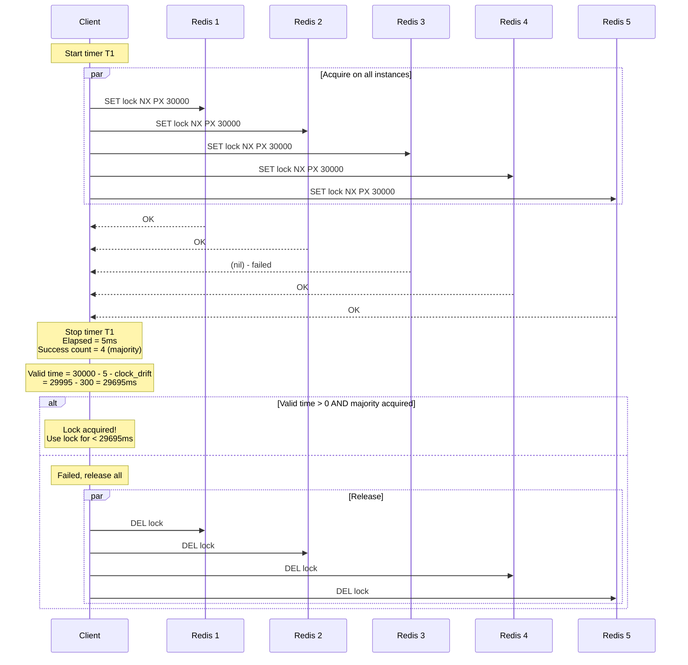
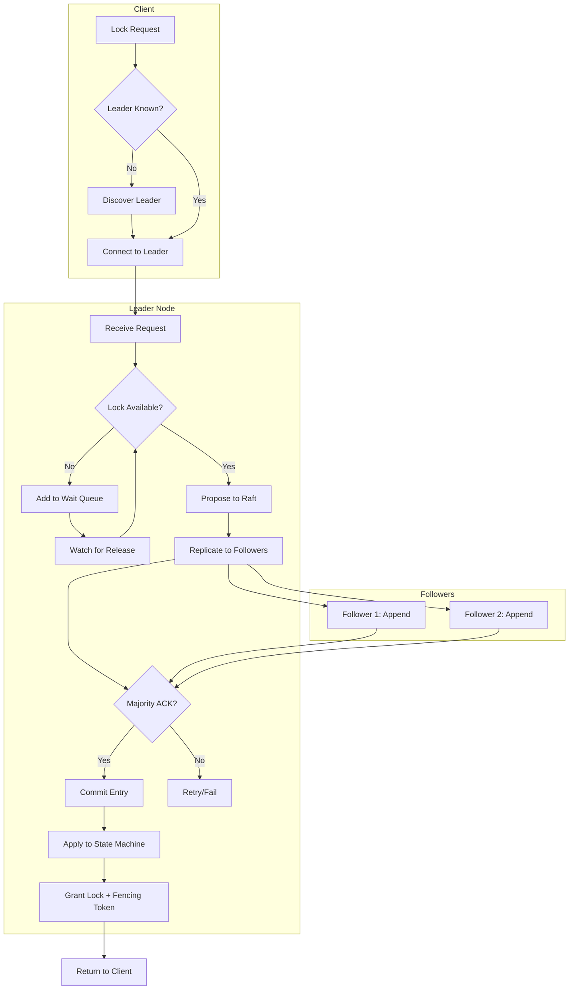
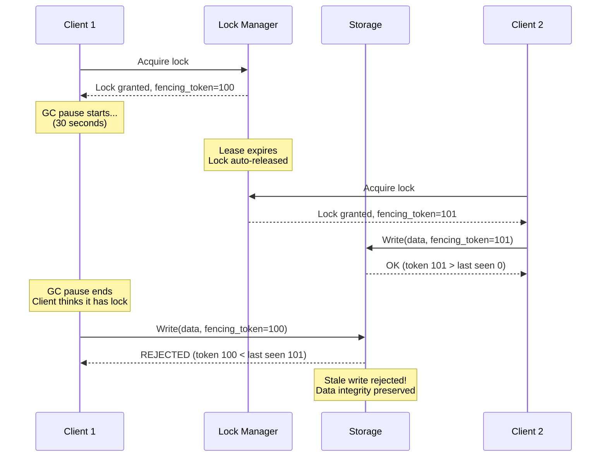
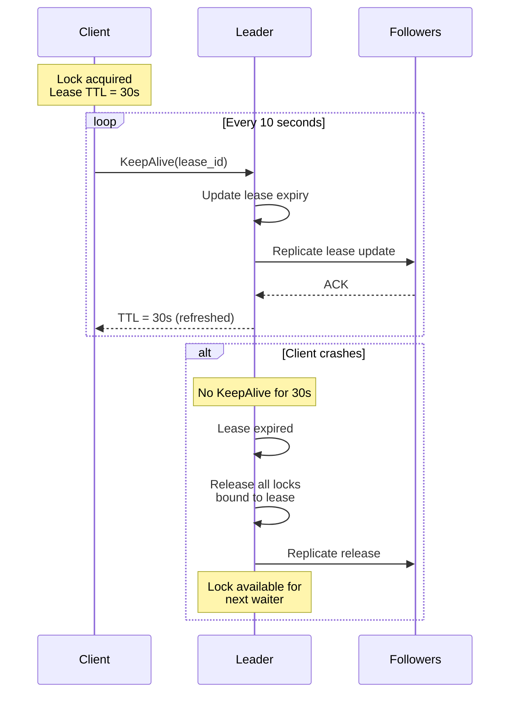

# High-Level Design

[← Back to Index](./00-index.md)

---

## Architecture Overview

A distributed lock manager consists of a cluster of nodes that maintain consensus on lock state. Clients communicate with the cluster to acquire, renew, and release locks.

```
┌─────────────────────────────────────────────────────────────────────┐
│                    DISTRIBUTED LOCK MANAGER                          │
├─────────────────────────────────────────────────────────────────────┤
│                                                                      │
│  ┌──────────────────────────────────────────────────────────────┐   │
│  │                      CLIENT TIER                              │   │
│  │  ┌─────────┐  ┌─────────┐  ┌─────────┐  ┌─────────┐         │   │
│  │  │Client 1 │  │Client 2 │  │Client 3 │  │Client N │         │   │
│  │  │(Pod)    │  │(Pod)    │  │(Pod)    │  │(Pod)    │         │   │
│  │  └────┬────┘  └────┬────┘  └────┬────┘  └────┬────┘         │   │
│  └───────┼────────────┼────────────┼────────────┼───────────────┘   │
│          │            │            │            │                    │
│          └────────────┴─────┬──────┴────────────┘                    │
│                             │ gRPC                                   │
│                             ▼                                        │
│  ┌──────────────────────────────────────────────────────────────┐   │
│  │                    LOCK MANAGER CLUSTER                       │   │
│  │                                                               │   │
│  │  ┌─────────────┐    ┌─────────────┐    ┌─────────────┐       │   │
│  │  │   Node 1    │    │   Node 2    │    │   Node 3    │       │   │
│  │  │  (Leader)   │◄──►│ (Follower)  │◄──►│ (Follower)  │       │   │
│  │  │             │    │             │    │             │       │   │
│  │  │ ┌─────────┐ │    │ ┌─────────┐ │    │ ┌─────────┐ │       │   │
│  │  │ │Lock Svc │ │    │ │Lock Svc │ │    │ │Lock Svc │ │       │   │
│  │  │ └─────────┘ │    │ └─────────┘ │    │ └─────────┘ │       │   │
│  │  │ ┌─────────┐ │    │ ┌─────────┐ │    │ ┌─────────┐ │       │   │
│  │  │ │Raft     │ │    │ │Raft     │ │    │ │Raft     │ │       │   │
│  │  │ │Consensus│ │    │ │Consensus│ │    │ │Consensus│ │       │   │
│  │  │ └─────────┘ │    │ └─────────┘ │    │ └─────────┘ │       │   │
│  │  │ ┌─────────┐ │    │ ┌─────────┐ │    │ ┌─────────┐ │       │   │
│  │  │ │Storage  │ │    │ │Storage  │ │    │ │Storage  │ │       │   │
│  │  │ │(Raft Log│ │    │ │(Raft Log│ │    │ │(Raft Log│ │       │   │
│  │  │ └─────────┘ │    │ └─────────┘ │    │ └─────────┘ │       │   │
│  │  └─────────────┘    └─────────────┘    └─────────────┘       │   │
│  │                                                               │   │
│  │  Raft: Leader replicates log to followers                    │   │
│  │  Writes: Leader only (forwarded from followers)              │   │
│  │  Reads: Leader (linearizable) or Follower (stale OK)         │   │
│  └──────────────────────────────────────────────────────────────┘   │
│                                                                      │
└─────────────────────────────────────────────────────────────────────┘
```

---

## Key Components

### 1. Client Library

```
┌─────────────────────────────────────────────────────────────────┐
│                    CLIENT LIBRARY                                │
├─────────────────────────────────────────────────────────────────┤
│                                                                  │
│  ┌─────────────────┐  ┌─────────────────┐  ┌─────────────────┐ │
│  │  Lock Manager   │  │  Connection     │  │  Lease Manager  │ │
│  │                 │  │  Pool           │  │                 │ │
│  │ • Acquire()     │  │ • Leader track  │  │ • Auto-renew    │ │
│  │ • TryLock()     │  │ • Failover      │  │ • Heartbeat     │ │
│  │ • Release()     │  │ • Load balance  │  │ • Expiry detect │ │
│  │ • Watch()       │  │ • Retry logic   │  │                 │ │
│  └─────────────────┘  └─────────────────┘  └─────────────────┘ │
│                                                                  │
│  Responsibilities:                                               │
│  • Discover and track cluster leader                            │
│  • Handle connection failures and retries                        │
│  • Automatically renew leases in background                     │
│  • Provide fencing token to application                         │
│                                                                  │
└─────────────────────────────────────────────────────────────────┘
```

### 2. Lock Service Layer

```
┌─────────────────────────────────────────────────────────────────┐
│                    LOCK SERVICE (per node)                       │
├─────────────────────────────────────────────────────────────────┤
│                                                                  │
│  ┌─────────────────────────────────────────────────────────┐   │
│  │                    Request Handler                        │   │
│  │  • Parse gRPC requests                                   │   │
│  │  • Route to appropriate handler                          │   │
│  │  • Forward writes to leader if follower                  │   │
│  └─────────────────────────────────────────────────────────┘   │
│                         │                                        │
│            ┌────────────┼────────────┐                          │
│            ▼            ▼            ▼                          │
│  ┌──────────────┐ ┌──────────────┐ ┌──────────────┐            │
│  │Lock Handler  │ │Lease Handler │ │Watch Handler │            │
│  │              │ │              │ │              │            │
│  │• Acquire     │ │• Grant       │ │• Register    │            │
│  │• Release     │ │• Renew       │ │• Notify      │            │
│  │• TryLock     │ │• Revoke      │ │• Unregister  │            │
│  │• Waitlist    │ │• TTL check   │ │• Broadcast   │            │
│  └──────────────┘ └──────────────┘ └──────────────┘            │
│                         │                                        │
│                         ▼                                        │
│  ┌─────────────────────────────────────────────────────────┐   │
│  │                    State Machine                          │   │
│  │  • Apply committed Raft log entries                      │   │
│  │  • Maintain lock state (holder, waiters, lease)          │   │
│  │  • Generate fencing tokens (Raft log index)              │   │
│  └─────────────────────────────────────────────────────────┘   │
│                                                                  │
└─────────────────────────────────────────────────────────────────┘
```

### 3. Consensus Layer (Raft)

```
┌─────────────────────────────────────────────────────────────────┐
│                    RAFT CONSENSUS ENGINE                         │
├─────────────────────────────────────────────────────────────────┤
│                                                                  │
│  ┌─────────────────────────────────────────────────────────┐   │
│  │                    Leader Election                        │   │
│  │  • Election timeout: 1000-2000ms                         │   │
│  │  • Heartbeat interval: 100-300ms                         │   │
│  │  • Pre-vote for partition tolerance                      │   │
│  └─────────────────────────────────────────────────────────┘   │
│                                                                  │
│  ┌─────────────────────────────────────────────────────────┐   │
│  │                    Log Replication                        │   │
│  │  • AppendEntries RPC to followers                        │   │
│  │  • Commit when majority acknowledges                     │   │
│  │  • Apply to state machine in order                       │   │
│  └─────────────────────────────────────────────────────────┘   │
│                                                                  │
│  ┌─────────────────────────────────────────────────────────┐   │
│  │                    State Machine                          │   │
│  │  • Deterministic application of log entries              │   │
│  │  • Snapshot for compaction                               │   │
│  │  • Recovery from snapshot + log replay                   │   │
│  └─────────────────────────────────────────────────────────┘   │
│                                                                  │
│  Key Raft Guarantees:                                           │
│  • Leader Completeness: Committed entries survive elections    │
│  • State Machine Safety: All nodes apply same entries          │
│  • Leader Append-Only: Leader never overwrites its log         │
│                                                                  │
└─────────────────────────────────────────────────────────────────┘
```

---

## Lock Implementation Approaches

### Approach 1: ZooKeeper-Style (Ephemeral Sequential Nodes)



**Key Features:**
- Ephemeral nodes: Auto-delete on session disconnect (failure detection)
- Sequential nodes: Natural ordering for fairness
- Watches: Efficient notification (no polling)
- **Fencing token**: Use zxid (ZooKeeper transaction ID)

**Avoiding Herd Effect:**
```
CORRECT: Each waiter watches only its predecessor
WRONG: All waiters watch the lock holder

If 100 clients wait and holder releases:
  - CORRECT: Only next waiter gets notified (1 notification)
  - WRONG: All 100 get notified, all try to acquire (thundering herd)
```

### Approach 2: etcd-Style (Lease + Key + Transaction)



**Key Features:**
- Leases: TTL-based failure detection
- Transactions: Atomic compare-and-set
- Revisions: Monotonic fencing tokens
- Watch: Efficient change notification

**etcd Lock Algorithm:**
```
FUNCTION acquire_lock(client, key, lease_id):
    // Create unique key for this client under the lock prefix
    my_key = key + "/" + lease_id

    // Write our key with the lease
    PUT(my_key, client_id, lease=lease_id)
    my_revision = response.revision

    // Get all keys under this prefix
    keys = GET_PREFIX(key)

    // Find the key with smallest revision
    min_revision = MIN(k.create_revision for k in keys)

    IF my_revision == min_revision:
        // We have the lock
        RETURN (true, my_revision)  // revision is fencing token
    ELSE:
        // Find key just before ours (predecessor)
        predecessor = MAX(k for k in keys WHERE k.create_revision < my_revision)

        // Watch predecessor, not the lock holder (avoid herd effect)
        WATCH(predecessor.key)
        WAIT for DELETE event

        // Predecessor deleted, check again
        RETURN acquire_lock(client, key, lease_id)
```

### Approach 3: Redlock (Probabilistic, Multi-Instance)



**Redlock Algorithm:**
```
FUNCTION redlock_acquire(resource, ttl):
    start_time = NOW()
    acquired_count = 0
    acquired_instances = []

    FOR instance IN redis_instances:
        IF SET(resource, random_value, NX, PX=ttl) succeeds:
            acquired_count += 1
            acquired_instances.append(instance)

    elapsed = NOW() - start_time
    validity_time = ttl - elapsed - CLOCK_DRIFT_FACTOR

    IF acquired_count >= majority AND validity_time > 0:
        RETURN (true, validity_time)
    ELSE:
        // Release all acquired locks
        FOR instance IN acquired_instances:
            DEL(resource)
        RETURN (false, 0)
```

**Critical Limitation: No Fencing Tokens**
- Redlock provides no monotonic token
- Stale lock holder can corrupt data after GC pause
- Safe for **efficiency** locks, unsafe for **correctness** locks

---

## Data Flow Diagrams

### Lock Acquisition Flow



### Fencing Token Usage



### Lease Renewal Flow



---

## Key Design Decisions

### Decision 1: Consensus Protocol

| Option | Pros | Cons | Choose When |
|--------|------|------|-------------|
| **Raft** | Understandable, widely implemented | Slightly slower than Paxos variants | Default choice |
| **Paxos** | Academically proven, flexible | Complex, hard to implement correctly | Research systems |
| **ZAB** | Optimized for primary-backup | ZooKeeper-specific | Using ZooKeeper |

**Recommendation:** Raft for new implementations

### Decision 2: Failure Detection

| Option | Detection Time | False Positives | Choose When |
|--------|---------------|-----------------|-------------|
| Heartbeat + Session | Fast (seconds) | Medium | Need fast detection |
| Lease TTL | Configurable | Low | Predictable timing |
| Hybrid | Fast with confirmation | Very Low | Production systems |

**Recommendation:** Lease TTL (10-30s) with client-side heartbeat every TTL/3

### Decision 3: Fencing Token Source

| Option | Monotonicity | Uniqueness | Choose When |
|--------|--------------|------------|-------------|
| **Raft Log Index** | Guaranteed | Global | etcd-style |
| **ZooKeeper zxid** | Guaranteed | Global | ZooKeeper |
| **Timestamp** | Clock-dependent | Not guaranteed | Never for correctness |
| **UUID** | N/A | Yes | Not useful for fencing |

**Recommendation:** Raft log index or equivalent consensus-derived value

### Decision 4: Read Consistency

| Option | Consistency | Performance | Choose When |
|--------|-------------|-------------|-------------|
| **Leader reads** | Linearizable | Lower (leader bottleneck) | Lock queries |
| **Follower reads** | Stale possible | Higher (distributed) | Non-critical reads |
| **Read index** | Linearizable | Medium | Balance |

**Recommendation:** Leader reads for lock state, follower reads for watches

---

## Architecture Comparison

```
┌─────────────────────────────────────────────────────────────────┐
│              ARCHITECTURE COMPARISON                             │
├─────────────────────────────────────────────────────────────────┤
│                                                                  │
│  ZooKeeper                   etcd                   Redlock      │
│  ──────────                  ────                   ───────      │
│  ┌───────┐                  ┌───────┐              ┌───────┐    │
│  │Leader │ ZAB              │Leader │ Raft         │Redis 1│    │
│  └───┬───┘                  └───┬───┘              └───────┘    │
│      │                          │                   ┌───────┐    │
│  ┌───┴───┐                  ┌───┴───┐              │Redis 2│    │
│  │Follow │                  │Follow │              └───────┘    │
│  └───┬───┘                  └───┬───┘              ┌───────┐    │
│      │                          │                   │Redis 3│    │
│  ┌───┴───┐                  ┌───┴───┐              └───────┘    │
│  │Follow │                  │Follow │              (independent) │
│  └───────┘                  └───────┘                            │
│                                                                  │
│  Ephemeral nodes            Lease + Txn             SET NX       │
│  Watches                    Watches                 No watches   │
│  zxid fencing               Revision fencing        No fencing   │
│                                                                  │
│  Correctness ✓              Correctness ✓           Efficiency ✓ │
│                                                                  │
└─────────────────────────────────────────────────────────────────┘
```

---

## Cluster Topology

### 3-Node Cluster (Minimum)

```
┌─────────────────────────────────────────────────────────────────┐
│                    3-NODE CLUSTER                                │
├─────────────────────────────────────────────────────────────────┤
│                                                                  │
│     ┌─────────┐      ┌─────────┐      ┌─────────┐              │
│     │ Node 1  │      │ Node 2  │      │ Node 3  │              │
│     │ Rack A  │◄────►│ Rack B  │◄────►│ Rack C  │              │
│     │ Leader  │      │Follower │      │Follower │              │
│     └─────────┘      └─────────┘      └─────────┘              │
│                                                                  │
│  Quorum: 2 (can lose 1 node)                                    │
│  Recommended for: Dev, small production                         │
│                                                                  │
└─────────────────────────────────────────────────────────────────┘
```

### 5-Node Cluster (Recommended)

```
┌─────────────────────────────────────────────────────────────────┐
│                    5-NODE CLUSTER                                │
├─────────────────────────────────────────────────────────────────┤
│                                                                  │
│  ┌─────────┐  ┌─────────┐  ┌─────────┐  ┌─────────┐  ┌────────┐│
│  │ Node 1  │  │ Node 2  │  │ Node 3  │  │ Node 4  │  │ Node 5 ││
│  │ Rack A  │  │ Rack B  │  │ Rack C  │  │ Rack A  │  │ Rack B ││
│  │ Leader  │  │Follower │  │Follower │  │Follower │  │Follower││
│  └────┬────┘  └────┬────┘  └────┬────┘  └────┬────┘  └────┬───┘│
│       └────────────┴────────────┴────────────┴────────────┘    │
│                           Raft mesh                             │
│                                                                  │
│  Quorum: 3 (can lose 2 nodes)                                   │
│  Recommended for: Production workloads                          │
│                                                                  │
└─────────────────────────────────────────────────────────────────┘
```

### Multi-Region (Advanced)

```
┌─────────────────────────────────────────────────────────────────┐
│                    MULTI-REGION DEPLOYMENT                       │
├─────────────────────────────────────────────────────────────────┤
│                                                                  │
│  Region A (Primary)          Region B              Region C      │
│  ┌─────────────────┐        ┌─────────┐          ┌─────────┐   │
│  │ Node 1 (Leader) │        │ Node 4  │          │ Node 5  │   │
│  │ Node 2          │◄──────►│ Witness │◄────────►│ Witness │   │
│  │ Node 3          │        │         │          │         │   │
│  └─────────────────┘        └─────────┘          └─────────┘   │
│                                                                  │
│  Configuration:                                                  │
│  • 3 full nodes in primary region (low latency)                │
│  • 2 witness nodes in other regions (vote only, no data)       │
│  • Quorum: 3 (survives primary region failure with witnesses)  │
│                                                                  │
│  Trade-off: Cross-region latency vs availability               │
│                                                                  │
└─────────────────────────────────────────────────────────────────┘
```

---

## Summary: High-Level Design

| Component | Technology/Approach |
|-----------|---------------------|
| Consensus | Raft (5-node cluster) |
| Lock Primitive | Lease + Key with revision |
| Fencing Token | Raft log index / revision |
| Failure Detection | Lease TTL (30s) + heartbeat (10s) |
| Client Connection | gRPC with leader tracking |
| Watch | Event-based notification |
| Storage | Raft log + snapshots |
