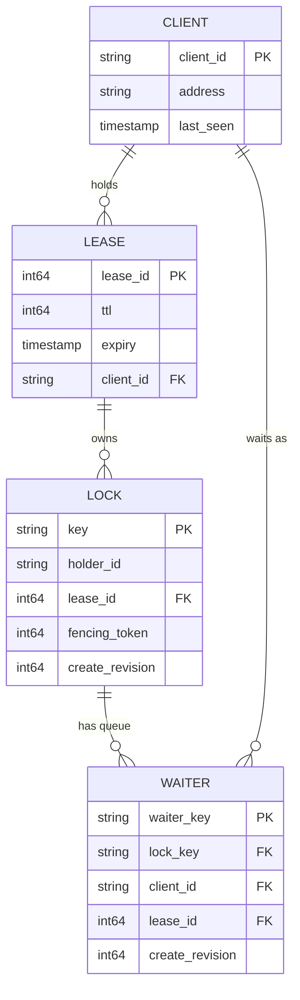
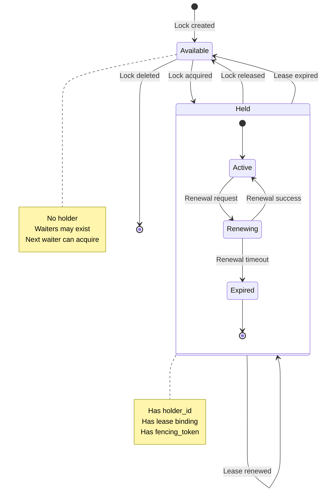
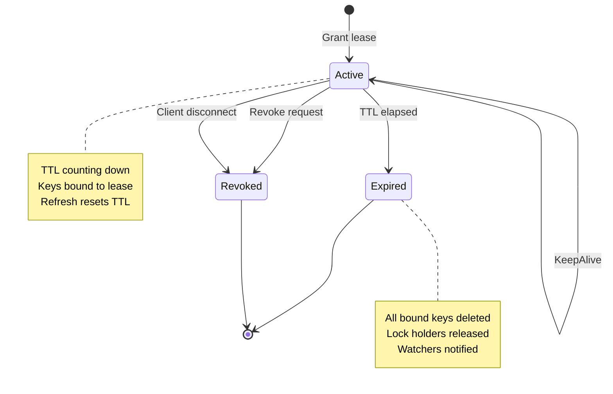

# Low-Level Design

[← Back to Index](./00-index.md)

---

## Data Model

### Lock Record Structure

```
┌─────────────────────────────────────────────────────────────────┐
│                    LOCK RECORD                                   │
├─────────────────────────────────────────────────────────────────┤
│                                                                  │
│  ┌──────────────────────────────────────────────────────────┐  │
│  │ Field            │ Type       │ Description               │  │
│  │──────────────────│────────────│───────────────────────────│  │
│  │ key              │ string     │ Lock resource identifier  │  │
│  │ holder_id        │ string     │ Client holding the lock   │  │
│  │ lease_id         │ int64      │ Associated lease          │  │
│  │ fencing_token    │ int64      │ Monotonic revision/index  │  │
│  │ create_revision  │ int64      │ Revision when created     │  │
│  │ mod_revision     │ int64      │ Revision when modified    │  │
│  │ version          │ int64      │ Update counter            │  │
│  │ metadata         │ bytes      │ Optional user data        │  │
│  └──────────────────────────────────────────────────────────┘  │
│                                                                  │
│  Example:                                                        │
│  {                                                               │
│    key: "/locks/database/users-table",                          │
│    holder_id: "service-a-pod-xyz-123",                          │
│    lease_id: 7587848390234,                                     │
│    fencing_token: 15892,                                        │
│    create_revision: 15890,                                      │
│    mod_revision: 15892,                                         │
│    version: 3,                                                  │
│    metadata: { "operation": "schema-migration" }                │
│  }                                                               │
│                                                                  │
└─────────────────────────────────────────────────────────────────┘
```

### Lease Record Structure

```
┌─────────────────────────────────────────────────────────────────┐
│                    LEASE RECORD                                  │
├─────────────────────────────────────────────────────────────────┤
│                                                                  │
│  ┌──────────────────────────────────────────────────────────┐  │
│  │ Field            │ Type       │ Description               │  │
│  │──────────────────│────────────│───────────────────────────│  │
│  │ lease_id         │ int64      │ Unique lease identifier   │  │
│  │ ttl              │ int64      │ Time-to-live in seconds   │  │
│  │ granted_ttl      │ int64      │ Original TTL when granted │  │
│  │ expiry           │ timestamp  │ Absolute expiration time  │  │
│  │ client_id        │ string     │ Client that owns lease    │  │
│  │ keys             │ []string   │ Keys bound to this lease  │  │
│  └──────────────────────────────────────────────────────────┘  │
│                                                                  │
│  Example:                                                        │
│  {                                                               │
│    lease_id: 7587848390234,                                     │
│    ttl: 30,                                                     │
│    granted_ttl: 30,                                             │
│    expiry: "2025-01-20T10:15:30Z",                             │
│    client_id: "service-a-pod-xyz-123",                          │
│    keys: ["/locks/database/users-table"]                        │
│  }                                                               │
│                                                                  │
└─────────────────────────────────────────────────────────────────┘
```

### Wait Queue Entry

```
┌─────────────────────────────────────────────────────────────────┐
│                    WAIT QUEUE ENTRY                              │
├─────────────────────────────────────────────────────────────────┤
│                                                                  │
│  ┌──────────────────────────────────────────────────────────┐  │
│  │ Field            │ Type       │ Description               │  │
│  │──────────────────│────────────│───────────────────────────│  │
│  │ waiter_key       │ string     │ Unique key for waiter     │  │
│  │ client_id        │ string     │ Client waiting for lock   │  │
│  │ lease_id         │ int64      │ Waiter's lease            │  │
│  │ create_revision  │ int64      │ When waiter joined queue  │  │
│  │ predecessor_key  │ string     │ Key to watch (fairness)   │  │
│  └──────────────────────────────────────────────────────────┘  │
│                                                                  │
└─────────────────────────────────────────────────────────────────┘
```

### Data Structure Relationships



---

## API Design

### gRPC Service Definition

```protobuf
service LockService {
    // Lock operations
    rpc Lock(LockRequest) returns (LockResponse);
    rpc TryLock(TryLockRequest) returns (TryLockResponse);
    rpc Unlock(UnlockRequest) returns (UnlockResponse);

    // Lease operations
    rpc LeaseGrant(LeaseGrantRequest) returns (LeaseGrantResponse);
    rpc LeaseRevoke(LeaseRevokeRequest) returns (LeaseRevokeResponse);
    rpc LeaseKeepAlive(stream LeaseKeepAliveRequest) returns (stream LeaseKeepAliveResponse);

    // Watch operations
    rpc Watch(stream WatchRequest) returns (stream WatchResponse);
}
```

### Lock Request/Response

```
┌─────────────────────────────────────────────────────────────────┐
│                    LOCK API                                      │
├─────────────────────────────────────────────────────────────────┤
│                                                                  │
│  LockRequest:                                                    │
│  ┌──────────────────────────────────────────────────────────┐  │
│  │ name           │ string │ Lock key (e.g., "/locks/db")   │  │
│  │ lease_id       │ int64  │ Lease to bind lock to          │  │
│  │ metadata       │ bytes  │ Optional user data             │  │
│  │ timeout_ms     │ int64  │ Max wait time (0 = no wait)    │  │
│  └──────────────────────────────────────────────────────────┘  │
│                                                                  │
│  LockResponse:                                                   │
│  ┌──────────────────────────────────────────────────────────┐  │
│  │ header         │ Header │ Cluster revision, raft term    │  │
│  │ key            │ string │ Actual key created             │  │
│  │ fencing_token  │ int64  │ Monotonic token for storage    │  │
│  │ acquired       │ bool   │ True if lock was acquired      │  │
│  └──────────────────────────────────────────────────────────┘  │
│                                                                  │
│  Header:                                                         │
│  ┌──────────────────────────────────────────────────────────┐  │
│  │ cluster_id     │ uint64 │ Cluster identifier             │  │
│  │ member_id      │ uint64 │ Member that served request     │  │
│  │ revision       │ int64  │ Key-value store revision       │  │
│  │ raft_term      │ uint64 │ Current Raft term              │  │
│  └──────────────────────────────────────────────────────────┘  │
│                                                                  │
└─────────────────────────────────────────────────────────────────┘
```

### Lease API

```
┌─────────────────────────────────────────────────────────────────┐
│                    LEASE API                                     │
├─────────────────────────────────────────────────────────────────┤
│                                                                  │
│  LeaseGrantRequest:                                              │
│  ┌──────────────────────────────────────────────────────────┐  │
│  │ ttl            │ int64  │ Time-to-live in seconds        │  │
│  │ id             │ int64  │ Requested ID (0 = auto)        │  │
│  └──────────────────────────────────────────────────────────┘  │
│                                                                  │
│  LeaseGrantResponse:                                             │
│  ┌──────────────────────────────────────────────────────────┐  │
│  │ header         │ Header │ Response header                │  │
│  │ id             │ int64  │ Granted lease ID               │  │
│  │ ttl            │ int64  │ Actual TTL granted             │  │
│  └──────────────────────────────────────────────────────────┘  │
│                                                                  │
│  LeaseKeepAliveRequest:                                          │
│  ┌──────────────────────────────────────────────────────────┐  │
│  │ id             │ int64  │ Lease to keep alive            │  │
│  └──────────────────────────────────────────────────────────┘  │
│                                                                  │
│  LeaseKeepAliveResponse:                                         │
│  ┌──────────────────────────────────────────────────────────┐  │
│  │ header         │ Header │ Response header                │  │
│  │ id             │ int64  │ Lease that was kept alive      │  │
│  │ ttl            │ int64  │ New TTL after refresh          │  │
│  └──────────────────────────────────────────────────────────┘  │
│                                                                  │
└─────────────────────────────────────────────────────────────────┘
```

### Watch API

```
┌─────────────────────────────────────────────────────────────────┐
│                    WATCH API                                     │
├─────────────────────────────────────────────────────────────────┤
│                                                                  │
│  WatchRequest:                                                   │
│  ┌──────────────────────────────────────────────────────────┐  │
│  │ key            │ string │ Key to watch                   │  │
│  │ prefix         │ bool   │ Watch all keys with prefix     │  │
│  │ start_revision │ int64  │ Start watching from revision   │  │
│  │ watch_id       │ int64  │ Client-assigned watch ID       │  │
│  │ prev_kv        │ bool   │ Include previous value         │  │
│  └──────────────────────────────────────────────────────────┘  │
│                                                                  │
│  WatchResponse:                                                  │
│  ┌──────────────────────────────────────────────────────────┐  │
│  │ header         │ Header │ Response header                │  │
│  │ watch_id       │ int64  │ Watch that triggered           │  │
│  │ events         │ []Event│ Changes since last response    │  │
│  │ compact_revision│ int64 │ Min revision in store          │  │
│  └──────────────────────────────────────────────────────────┘  │
│                                                                  │
│  Event:                                                          │
│  ┌──────────────────────────────────────────────────────────┐  │
│  │ type           │ enum   │ PUT, DELETE                    │  │
│  │ kv             │ KeyVal │ Current key-value              │  │
│  │ prev_kv        │ KeyVal │ Previous key-value (optional)  │  │
│  └──────────────────────────────────────────────────────────┘  │
│                                                                  │
└─────────────────────────────────────────────────────────────────┘
```

---

## Lock Algorithms

### Algorithm 1: ZooKeeper Lock Recipe (Pseudocode)

```
// ZooKeeper-style distributed lock using ephemeral sequential nodes
// Avoids herd effect by watching only predecessor

FUNCTION zk_acquire_lock(zk_client, lock_path):
    // Step 1: Create ephemeral sequential node
    my_node = zk_client.create(
        path = lock_path + "/lock-",
        data = client_id,
        flags = EPHEMERAL | SEQUENTIAL
    )
    // my_node is now something like "/locks/resource/lock-0000000042"

    WHILE true:
        // Step 2: Get all children (lock contenders)
        children = zk_client.get_children(lock_path)
        children.sort()  // Sort by sequence number

        // Step 3: Extract my sequence number
        my_seq = get_sequence_number(my_node)

        // Step 4: Check if I have the lock (lowest sequence)
        IF children[0] == basename(my_node):
            // I have the lowest sequence number = I have the lock
            zxid = zk_client.get_stat(my_node).czxid
            RETURN LockResult(acquired=true, fencing_token=zxid)

        // Step 5: Find my predecessor (node just before mine)
        my_index = children.index(basename(my_node))
        predecessor = children[my_index - 1]
        predecessor_path = lock_path + "/" + predecessor

        // Step 6: Watch ONLY my predecessor (not the lock holder!)
        // This avoids the herd effect
        exists = zk_client.exists(predecessor_path, watch=true)

        IF exists == false:
            // Predecessor already gone, retry immediately
            CONTINUE

        // Step 7: Wait for watch notification
        WAIT for watch event (predecessor deleted)

        // Loop back to check if we have the lock now


FUNCTION zk_release_lock(zk_client, my_node):
    // Simply delete our node
    // Ephemeral nodes also auto-delete on session close (crash)
    zk_client.delete(my_node)


// Why watch predecessor only?
//
// If 100 clients wait for lock held by client 1:
//
// BAD (watch lock holder):
//   Client 1 releases → 99 clients notified → 99 clients try acquire
//   → Thundering herd, 98 fail, massive load spike
//
// GOOD (watch predecessor):
//   Client 1 releases → Only client 2 notified → Client 2 acquires
//   Client 2 releases → Only client 3 notified → Client 3 acquires
//   → O(1) notifications per release, no herd effect
```

### Algorithm 2: etcd Lock with Fencing (Pseudocode)

```
// etcd-style distributed lock using leases and transactions
// Provides revision-based fencing tokens

FUNCTION etcd_acquire_lock(etcd_client, lock_name, lease_id):
    // Step 1: Create unique key for this lock attempt
    // Using lease_id ensures uniqueness and ties to lease lifecycle
    my_key = lock_name + "/" + format_hex(lease_id)

    // Step 2: Write our key (this always succeeds)
    put_response = etcd_client.put(
        key = my_key,
        value = client_id,
        lease = lease_id
    )
    my_revision = put_response.header.revision

    // Step 3: Get all keys under this lock prefix
    range_response = etcd_client.get(
        key = lock_name + "/",
        prefix = true,
        sort_order = ASCEND,
        sort_target = CREATE_REVISION
    )

    // Step 4: Find key with lowest create_revision (lock owner)
    owner_key = range_response.kvs[0]
    owner_revision = owner_key.create_revision

    IF owner_revision == my_revision:
        // I created the first key = I have the lock
        // Use my_revision as fencing token (monotonically increasing)
        RETURN LockResult(
            acquired = true,
            key = my_key,
            fencing_token = my_revision
        )

    // Step 5: Find predecessor (key created just before mine)
    predecessor = null
    FOR kv IN range_response.kvs:
        IF kv.create_revision < my_revision:
            predecessor = kv
        ELSE:
            BREAK

    IF predecessor == null:
        // Race condition: owner released between get and here
        // Retry from step 3
        RETURN etcd_acquire_lock(etcd_client, lock_name, lease_id)

    // Step 6: Watch predecessor for deletion (avoid herd effect)
    watch_response = etcd_client.watch(
        key = predecessor.key,
        start_revision = predecessor.mod_revision + 1
    )

    FOR event IN watch_response.events:
        IF event.type == DELETE:
            // Predecessor released, retry acquisition check
            RETURN etcd_acquire_lock(etcd_client, lock_name, lease_id)


FUNCTION etcd_release_lock(etcd_client, key, lease_id):
    // Option 1: Delete key directly
    etcd_client.delete(key)

    // Option 2: Revoke lease (deletes all keys bound to it)
    etcd_client.lease_revoke(lease_id)


FUNCTION etcd_try_lock(etcd_client, lock_name, lease_id):
    // Non-blocking: use transaction to atomically check and acquire
    my_key = lock_name + "/" + format_hex(lease_id)

    txn_response = etcd_client.txn(
        // IF no keys exist under lock prefix
        compare = [
            Compare(lock_name + "/", VERSION, "==", 0)
        ],
        // THEN create our key
        success = [
            Put(my_key, client_id, lease_id)
        ],
        // ELSE return current state
        failure = [
            Get(lock_name + "/", prefix=true)
        ]
    )

    IF txn_response.succeeded:
        RETURN LockResult(
            acquired = true,
            key = my_key,
            fencing_token = txn_response.header.revision
        )
    ELSE:
        RETURN LockResult(acquired = false)
```

### Algorithm 3: Fencing Token Validation (Storage Side)

```
// Storage service must validate fencing tokens to prevent stale writes
// This is the CRITICAL piece that makes distributed locks safe

CLASS StorageServiceWithFencing:
    // Track highest fencing token seen per resource
    fencing_tokens: Map<resource_id, int64>

    FUNCTION write(resource_id, data, fencing_token):
        // Step 1: Get last seen fencing token for this resource
        last_token = fencing_tokens.get(resource_id, default=0)

        // Step 2: Reject if token is stale
        IF fencing_token < last_token:
            RAISE FencingTokenStaleError(
                "Token {} is stale, last seen was {}".format(
                    fencing_token, last_token
                )
            )

        // Step 3: Reject if token is same (idempotency check)
        IF fencing_token == last_token:
            // Could be retry, check if data matches
            // Or reject to be safe
            RAISE FencingTokenReusedError(
                "Token {} already used".format(fencing_token)
            )

        // Step 4: Accept write and update token
        fencing_tokens[resource_id] = fencing_token
        storage.write(resource_id, data)
        RETURN success


// Example timeline showing why fencing is necessary:
//
// Time │ Client A (Lock holder)   │ Client B         │ Storage
// ─────┼──────────────────────────┼──────────────────┼────────────────
//  T1  │ Acquires lock, token=100 │                  │
//  T2  │ GC pause starts...       │                  │
//  T3  │ (paused)                 │ Lock expires     │
//  T4  │ (paused)                 │ Acquires, tok=101│
//  T5  │ (paused)                 │ Write(X, tok=101)│ last_token=101
//  T6  │ GC pause ends            │                  │
//  T7  │ Write(Y, tok=100)        │                  │ REJECTED! 100<101
//
// Without fencing: Client A's stale write would corrupt data
// With fencing: Storage rejects stale write, data integrity preserved
```

---

## Lock State Machine



### State Transitions

| Current State | Event | Next State | Action |
|--------------|-------|------------|--------|
| Available | Lock request | Held | Grant lock, assign fencing token |
| Available | TryLock request | Held | Grant lock, assign fencing token |
| Available | Delete request | Deleted | Remove lock record |
| Held | Release request | Available | Clear holder, notify waiters |
| Held | Lease expired | Available | Clear holder, notify waiters |
| Held | Renew request | Held | Update lease expiry |
| Held | Lock request (same holder) | Held | Reentrant, return existing token |
| Held | Lock request (different) | Held | Add to wait queue |

---

## Lease State Machine



---

## Internal Data Structures

### In-Memory Lock Table

```
STRUCTURE LockTable:
    // Primary index: lock key -> lock state
    locks: BTreeMap<string, LockState>

    // Secondary index: lease -> locks (for lease expiry cleanup)
    lease_to_locks: Map<int64, Set<string>>

    // Wait queues: lock key -> ordered waiters
    wait_queues: Map<string, OrderedQueue<Waiter>>


STRUCTURE LockState:
    key: string
    holder_id: string
    lease_id: int64
    fencing_token: int64
    create_revision: int64
    mod_revision: int64
    metadata: bytes


STRUCTURE Waiter:
    waiter_key: string      // Unique key for this waiter
    client_id: string
    lease_id: int64
    create_revision: int64  // Used for ordering
    channel: WaitChannel    // To notify when lock available


// Operations must be applied atomically through Raft
FUNCTION apply_lock_acquire(lock_key, holder_id, lease_id, revision):
    IF lock_key NOT IN locks:
        // Create new lock
        locks[lock_key] = LockState(
            key = lock_key,
            holder_id = holder_id,
            lease_id = lease_id,
            fencing_token = revision,
            create_revision = revision,
            mod_revision = revision
        )
        lease_to_locks[lease_id].add(lock_key)
        RETURN (acquired=true, fencing_token=revision)
    ELSE:
        // Add to wait queue
        waiter = Waiter(holder_id, lease_id, revision)
        wait_queues[lock_key].enqueue(waiter)
        RETURN (acquired=false, position=wait_queues[lock_key].size())


FUNCTION apply_lock_release(lock_key, holder_id, revision):
    lock = locks[lock_key]

    IF lock.holder_id != holder_id:
        RETURN error("not lock holder")

    // Remove from lease index
    lease_to_locks[lock.lease_id].remove(lock_key)

    // Check wait queue
    IF wait_queues[lock_key].is_empty():
        DELETE locks[lock_key]
    ELSE:
        // Grant to next waiter
        next_waiter = wait_queues[lock_key].dequeue()
        locks[lock_key] = LockState(
            key = lock_key,
            holder_id = next_waiter.client_id,
            lease_id = next_waiter.lease_id,
            fencing_token = revision,
            create_revision = lock.create_revision,
            mod_revision = revision
        )
        lease_to_locks[next_waiter.lease_id].add(lock_key)
        NOTIFY next_waiter.channel

    RETURN success


FUNCTION apply_lease_expire(lease_id, revision):
    // Release all locks held by this lease
    FOR lock_key IN lease_to_locks[lease_id]:
        apply_lock_release(lock_key, locks[lock_key].holder_id, revision)

    // Remove all waiters with this lease
    FOR lock_key IN wait_queues:
        wait_queues[lock_key].remove_by_lease(lease_id)

    DELETE lease_to_locks[lease_id]
```

### Lease Heap (TTL Management)

```
// Min-heap ordered by expiry time for efficient lease expiration

STRUCTURE LeaseHeap:
    heap: MinHeap<LeaseEntry>  // Ordered by expiry
    lease_map: Map<int64, LeaseEntry>  // For O(1) lookup


STRUCTURE LeaseEntry:
    lease_id: int64
    ttl: int64
    granted_ttl: int64
    expiry: timestamp
    client_id: string
    keys: Set<string>


FUNCTION grant_lease(lease_id, ttl, client_id):
    entry = LeaseEntry(
        lease_id = lease_id,
        ttl = ttl,
        granted_ttl = ttl,
        expiry = NOW() + ttl,
        client_id = client_id,
        keys = Set()
    )
    heap.push(entry)
    lease_map[lease_id] = entry
    RETURN entry


FUNCTION renew_lease(lease_id):
    entry = lease_map[lease_id]
    IF entry == null:
        RETURN error("lease not found")

    // Update expiry
    entry.expiry = NOW() + entry.granted_ttl
    entry.ttl = entry.granted_ttl

    // Re-heapify (move to new position)
    heap.update(entry)

    RETURN entry


FUNCTION check_expired_leases():
    // Called periodically by leader
    now = NOW()
    expired = []

    WHILE heap.peek().expiry <= now:
        entry = heap.pop()
        DELETE lease_map[entry.lease_id]
        expired.append(entry)

    RETURN expired


// Background goroutine on leader
FUNCTION lease_expiry_loop():
    WHILE is_leader:
        expired = check_expired_leases()
        FOR lease IN expired:
            // Propose lease expiry through Raft
            raft.propose(LeaseExpireCommand(lease.lease_id))
        SLEEP(500ms)
```

---

## Watch Implementation

### Watch Hub

```
STRUCTURE WatchHub:
    // Active watches: watch_id -> Watch
    watches: Map<int64, Watch>

    // Key index: key -> watches on this key
    key_watches: Map<string, Set<Watch>>

    // Prefix index: prefix -> watches on this prefix
    prefix_watches: PrefixTree<Set<Watch>>

    // Event buffer for catch-up
    event_buffer: RingBuffer<Event>
    min_revision: int64


STRUCTURE Watch:
    watch_id: int64
    key: string
    is_prefix: bool
    start_revision: int64
    client_channel: Channel<WatchResponse>
    filters: []EventFilter


FUNCTION register_watch(watch_id, key, is_prefix, start_revision, channel):
    watch = Watch(watch_id, key, is_prefix, start_revision, channel)
    watches[watch_id] = watch

    IF is_prefix:
        prefix_watches.insert(key, watch)
    ELSE:
        key_watches[key].add(watch)

    // Send historical events if start_revision is in buffer
    IF start_revision >= min_revision:
        historical = event_buffer.range(start_revision, current_revision)
        FOR event IN historical:
            IF matches_watch(event, watch):
                channel.send(event)


FUNCTION notify_watches(event):
    // Add to buffer
    event_buffer.append(event)

    // Find matching watches
    matching = Set()

    // Exact key matches
    IF event.key IN key_watches:
        matching.union(key_watches[event.key])

    // Prefix matches
    FOR prefix, watches IN prefix_watches.prefixes_of(event.key):
        matching.union(watches)

    // Send to all matching watches
    FOR watch IN matching:
        IF event.revision >= watch.start_revision:
            watch.client_channel.send(event)


FUNCTION unregister_watch(watch_id):
    watch = watches[watch_id]
    IF watch == null:
        RETURN

    IF watch.is_prefix:
        prefix_watches.remove(watch.key, watch)
    ELSE:
        key_watches[watch.key].remove(watch)

    DELETE watches[watch_id]
    watch.client_channel.close()
```

---

## Raft Integration

### Log Entry Types

```
ENUM LogEntryType:
    LOCK_ACQUIRE
    LOCK_RELEASE
    LOCK_TRY_ACQUIRE
    LEASE_GRANT
    LEASE_RENEW
    LEASE_REVOKE
    LEASE_EXPIRE
    WATCH_CREATE
    WATCH_CANCEL


STRUCTURE LogEntry:
    term: int64
    index: int64
    type: LogEntryType
    data: bytes  // Serialized command


STRUCTURE LockAcquireCommand:
    lock_key: string
    holder_id: string
    lease_id: int64
    metadata: bytes


STRUCTURE LeaseGrantCommand:
    lease_id: int64
    ttl: int64
    client_id: string
```

### State Machine Application

```
FUNCTION apply_log_entry(entry: LogEntry):
    // Deterministic application of committed log entries
    // Called in order on all nodes

    SWITCH entry.type:
        CASE LOCK_ACQUIRE:
            cmd = deserialize(entry.data, LockAcquireCommand)
            result = apply_lock_acquire(
                cmd.lock_key,
                cmd.holder_id,
                cmd.lease_id,
                entry.index  // Use log index as fencing token
            )
            RETURN result

        CASE LOCK_RELEASE:
            cmd = deserialize(entry.data, LockReleaseCommand)
            result = apply_lock_release(
                cmd.lock_key,
                cmd.holder_id,
                entry.index
            )
            // Notify watches
            notify_watches(Event(DELETE, cmd.lock_key, entry.index))
            RETURN result

        CASE LEASE_GRANT:
            cmd = deserialize(entry.data, LeaseGrantCommand)
            result = grant_lease(cmd.lease_id, cmd.ttl, cmd.client_id)
            RETURN result

        CASE LEASE_EXPIRE:
            cmd = deserialize(entry.data, LeaseExpireCommand)
            result = apply_lease_expire(cmd.lease_id, entry.index)
            // Notify watches for all released locks
            FOR lock_key IN result.released_locks:
                notify_watches(Event(DELETE, lock_key, entry.index))
            RETURN result

        // ... other cases
```

---

## Summary: Key Implementation Points

| Component | Implementation | Key Insight |
|-----------|----------------|-------------|
| Lock key | Prefix + client-unique suffix | Enables fair queuing |
| Fencing token | Raft log index | Monotonic, globally unique |
| Failure detection | Lease TTL (30s) | Balance: fast detection vs false positives |
| Wait queue | Watch predecessor only | Avoids thundering herd |
| Lease renewal | Heartbeat every TTL/3 | Tolerates 2 missed heartbeats |
| Watch | Event buffer + prefix tree | Efficient notification |
| State machine | Deterministic apply | All nodes converge to same state |
