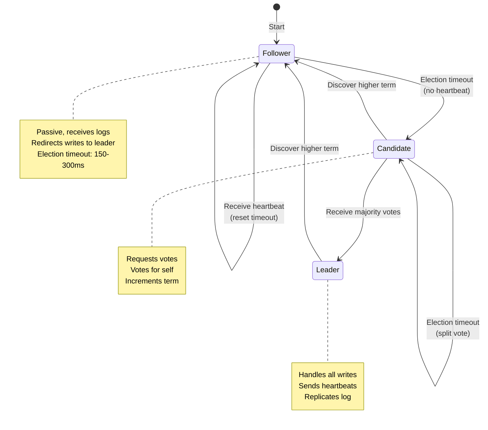
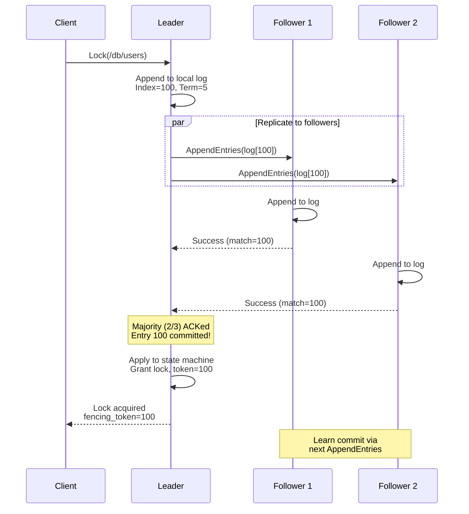
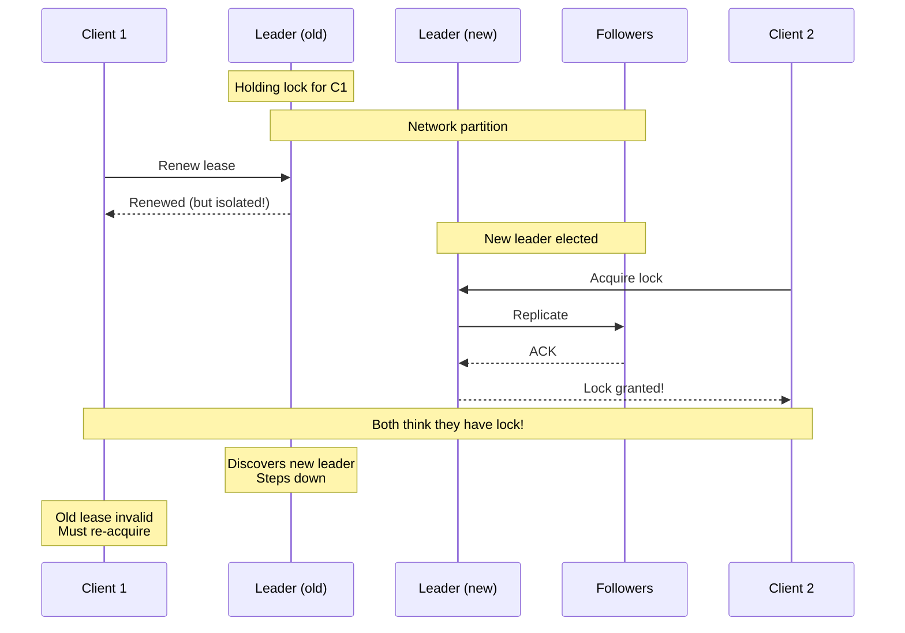

# Deep Dive and Bottlenecks

[← Back to Index](./00-index.md)

---

## Deep Dive 1: Fencing Tokens (Critical for Correctness)

### The Fundamental Problem

A distributed lock without fencing tokens provides only an **illusion** of safety. Here's why:

```
┌─────────────────────────────────────────────────────────────────┐
│                THE GC PAUSE PROBLEM                              │
├─────────────────────────────────────────────────────────────────┤
│                                                                  │
│  Timeline:                                                       │
│  ─────────────────────────────────────────────────────────────► │
│                                                                  │
│  T1    T2         T3         T4         T5         T6    T7     │
│   │     │          │          │          │          │     │     │
│   │     │          │          │          │          │     │     │
│   ▼     ▼          ▼          ▼          ▼          ▼     ▼     │
│                                                                  │
│  ┌─────────────────────────────────────────────────────────┐   │
│  │ Client A:                                                │   │
│  │  [Acquire]   [GC Pause..........................]  [Write]│  │
│  │   token=100   (Thinks it has lock)              (Stale!) │   │
│  └─────────────────────────────────────────────────────────┘   │
│                                                                  │
│  ┌─────────────────────────────────────────────────────────┐   │
│  │ Lock Service:                                            │   │
│  │             [Lease expires]    [Grant to B]              │   │
│  │              (A's lock gone)    token=101                │   │
│  └─────────────────────────────────────────────────────────┘   │
│                                                                  │
│  ┌─────────────────────────────────────────────────────────┐   │
│  │ Client B:                                                │   │
│  │                              [Acquire]   [Write]         │   │
│  │                               token=101                  │   │
│  └─────────────────────────────────────────────────────────┘   │
│                                                                  │
│  ┌─────────────────────────────────────────────────────────┐   │
│  │ Storage (Without fencing):                               │   │
│  │                                    [Write B] [Write A]   │   │
│  │                                     value=X   value=Y    │   │
│  │                                               ↑          │   │
│  │                                     CORRUPTED! A's stale │   │
│  │                                     write overwrites B   │   │
│  └─────────────────────────────────────────────────────────┘   │
│                                                                  │
│  ┌─────────────────────────────────────────────────────────┐   │
│  │ Storage (With fencing):                                  │   │
│  │                                    [Write B] [Reject A]  │   │
│  │                                     tok=101   tok=100    │   │
│  │                                               100 < 101  │   │
│  │                                               REJECTED!  │   │
│  │                                     Data integrity OK    │   │
│  └─────────────────────────────────────────────────────────┘   │
│                                                                  │
└─────────────────────────────────────────────────────────────────┘
```

### Why Can't We Just "Check the Lock"?

```
// WRONG: This is NOT safe
FUNCTION unsafe_write(data):
    IF lock_service.still_have_lock(my_lock):
        storage.write(data)  // Race condition!

// The check and write are not atomic.
// Lock can expire between check and write.
// This is the "check-then-act" race condition.
```

### The Only Safe Pattern

```
// CORRECT: Fencing token validation at storage layer
FUNCTION safe_write(data, fencing_token):
    storage.write_with_fencing(data, fencing_token)

// Storage rejects stale tokens, even if caller is slow
```

### Sources of Fencing Tokens

| System | Fencing Token | Monotonicity Guarantee |
|--------|---------------|------------------------|
| etcd | `mod_revision` | Raft log index, globally monotonic |
| ZooKeeper | `zxid` | ZAB transaction ID, globally monotonic |
| Consul | `ModifyIndex` | Raft log index, globally monotonic |
| Chubby | Sequence number | Paxos log position |
| Redlock | **None** | Cannot provide fencing |

### Fencing Token Properties

```
REQUIREMENTS for a valid fencing token:

1. MONOTONICALLY INCREASING
   - Each new lock acquisition gets a higher token
   - Guarantee: token(lock_N+1) > token(lock_N)

2. GLOBALLY UNIQUE
   - No two lock grants have the same token
   - Even across different keys (in same system)

3. SURVIVES FAILURES
   - Token must be durable (committed via consensus)
   - New leader must continue from last committed value

4. DERIVABLE FROM CONSENSUS
   - Best: Use Raft log index, ZAB zxid directly
   - These are naturally monotonic and unique
```

---

## Deep Dive 2: Consensus Protocol Internals (Raft)

### Raft Leader Election



### Raft Log Replication



### Write Commitment Flow

```
ALGORITHM leader_handle_write(command):
    // Step 1: Append to local log
    entry = LogEntry(
        term = current_term,
        index = log.next_index(),
        command = command
    )
    log.append(entry)

    // Step 2: Replicate to followers in parallel
    responses = parallel_for follower IN followers:
        response = follower.append_entries(entry)
        RETURN response

    // Step 3: Count successful replications
    success_count = 1  // Leader counts as 1
    FOR response IN responses:
        IF response.success:
            success_count += 1

    // Step 4: Commit if majority
    IF success_count >= majority:
        commit_index = entry.index
        apply_to_state_machine(entry)
        RETURN success
    ELSE:
        // Will retry via heartbeat
        RETURN pending


ALGORITHM follower_handle_append_entries(entries, leader_commit):
    // Append entries to log
    FOR entry IN entries:
        log.append(entry)

    // Apply committed entries
    WHILE last_applied < leader_commit:
        last_applied += 1
        apply_to_state_machine(log[last_applied])

    RETURN success
```

### Election Safety

```
┌─────────────────────────────────────────────────────────────────┐
│                RAFT SAFETY PROPERTIES                            │
├─────────────────────────────────────────────────────────────────┤
│                                                                  │
│  1. Election Safety:                                             │
│     At most one leader per term                                 │
│     Proof: Majority required, majorities overlap                │
│                                                                  │
│  2. Leader Append-Only:                                          │
│     Leader never overwrites or deletes log entries              │
│     Only appends new entries                                    │
│                                                                  │
│  3. Log Matching:                                                │
│     If two logs have entry with same index and term,            │
│     all preceding entries are identical                         │
│                                                                  │
│  4. Leader Completeness:                                         │
│     If entry committed in term T, it appears in all             │
│     leaders of terms > T                                        │
│                                                                  │
│  5. State Machine Safety:                                        │
│     If server applies entry at index i, no other server         │
│     applies a different entry at index i                        │
│                                                                  │
│  Implication for Locks:                                          │
│  • Committed lock grants are never lost                         │
│  • Fencing tokens (log index) are never reused                  │
│  • All nodes agree on lock state                                │
│                                                                  │
└─────────────────────────────────────────────────────────────────┘
```

---

## Deep Dive 3: The Redlock Controversy

### Redlock Algorithm Review

```
ALGORITHM Redlock:
    INPUT: resource_name, ttl

    start_time = NOW_MONOTONIC()
    acquired = 0
    clients = []

    // Try to acquire on all N independent Redis instances
    FOR instance IN redis_instances:
        success = instance.SET(resource_name, random_value, NX, PX=ttl)
        IF success:
            acquired += 1
            clients.append(instance)

    elapsed = NOW_MONOTONIC() - start_time
    validity = ttl - elapsed - CLOCK_DRIFT_FACTOR

    IF acquired >= N/2 + 1 AND validity > 0:
        RETURN (true, validity)
    ELSE:
        // Release all acquired locks
        FOR instance IN clients:
            instance.DEL(resource_name)
        RETURN (false, 0)
```

### Martin Kleppmann's Critique

```
┌─────────────────────────────────────────────────────────────────┐
│            KLEPPMANN'S ARGUMENTS AGAINST REDLOCK                 │
├─────────────────────────────────────────────────────────────────┤
│                                                                  │
│  ARGUMENT 1: No Fencing Tokens                                   │
│  ─────────────────────────────────────────────────────────────  │
│  • Redlock provides no monotonic token                          │
│  • Storage cannot detect stale lock holders                     │
│  • GC pause problem is not addressed                            │
│                                                                  │
│  ARGUMENT 2: Timing Assumptions                                  │
│  ─────────────────────────────────────────────────────────────  │
│  • Assumes bounded network delays                               │
│  • Assumes bounded process pauses                               │
│  • Assumes bounded clock drift                                  │
│  • Real systems violate these assumptions                       │
│                                                                  │
│  ARGUMENT 3: Clock Drift Problem                                 │
│  ─────────────────────────────────────────────────────────────  │
│  • If Redis instance's clock jumps forward                      │
│  • Lock expires earlier than expected                           │
│  • Another client can acquire before first is done              │
│                                                                  │
│  Example:                                                        │
│    T0: Client A acquires lock (TTL=10s) on Redis 1,2,3         │
│    T1: Redis 1's clock jumps forward 10 seconds                │
│    T1: Redis 1 expires the lock                                │
│    T2: Client B acquires lock on Redis 1,4,5 (majority!)       │
│    T2: Both A and B think they have the lock                   │
│                                                                  │
│  CONCLUSION:                                                     │
│  ─────────────────────────────────────────────────────────────  │
│  "I think the Redlock algorithm is a poor choice because it     │
│  is 'neither fish nor fowl': it is unnecessarily heavyweight   │
│  and expensive for efficiency-optimization locks, but it is    │
│  not sufficiently safe for situations in which correctness     │
│  depends on the lock."                                          │
│                           - Martin Kleppmann (2016)             │
│                                                                  │
└─────────────────────────────────────────────────────────────────┘
```

### Antirez's (Salvatore Sanfilippo) Response

```
┌─────────────────────────────────────────────────────────────────┐
│            ANTIREZ'S DEFENSE OF REDLOCK                          │
├─────────────────────────────────────────────────────────────────┤
│                                                                  │
│  COUNTER-ARGUMENT 1: Clock Drift                                 │
│  ─────────────────────────────────────────────────────────────  │
│  • Assumes reasonable clock behavior (NTP)                      │
│  • Clock jumps are operator errors, not normal                  │
│  • Most systems assume bounded clock drift                      │
│                                                                  │
│  COUNTER-ARGUMENT 2: Practical Safety                            │
│  ─────────────────────────────────────────────────────────────  │
│  • For practical use, Redlock is safe enough                    │
│  • Many production systems don't need perfect safety            │
│  • Cost of consensus too high for many use cases                │
│                                                                  │
│  COUNTER-ARGUMENT 3: Auto-Release                                │
│  ─────────────────────────────────────────────────────────────  │
│  • Redlock auto-releases on TTL expiry                          │
│  • Combined with reasonable TTL, limits damage window           │
│  • GC pause must exceed TTL to cause problems                   │
│                                                                  │
│  KEY CONCESSION:                                                 │
│  ─────────────────────────────────────────────────────────────  │
│  • Fencing tokens ARE necessary for correctness                 │
│  • Redlock alone doesn't provide them                           │
│  • Application can implement its own fencing                    │
│                                                                  │
└─────────────────────────────────────────────────────────────────┘
```

### The Verdict: When to Use What

| Use Case | Redlock Safe? | Recommendation |
|----------|---------------|----------------|
| **Efficiency locks** (avoid duplicate work) | Yes | OK to use Redlock |
| **Correctness locks** (mutual exclusion required) | **No** | Use consensus-based (ZK, etcd) |
| **Leader election** | **No** | Use consensus-based |
| **Rate limiting** | Yes | OK to use Redlock |
| **Distributed transactions** | **No** | Use consensus-based |
| **Cache stampede prevention** | Yes | OK to use Redlock |

### Decision Matrix

```
┌─────────────────────────────────────────────────────────────────┐
│            LOCK SYSTEM SELECTION GUIDE                           │
├─────────────────────────────────────────────────────────────────┤
│                                                                  │
│  Is duplicate work acceptable if lock fails?                    │
│                     │                                            │
│            ┌────────┴────────┐                                  │
│            │                 │                                   │
│           YES               NO                                   │
│            │                 │                                   │
│            ▼                 ▼                                   │
│     ┌──────────────┐  Do you need fencing tokens?              │
│     │ EFFICIENCY   │         │                                  │
│     │ LOCK         │  ┌──────┴──────┐                          │
│     │              │  │             │                           │
│     │ Options:     │ YES           NO (but should!)            │
│     │ • Redlock    │  │             │                           │
│     │ • Single     │  ▼             ▼                           │
│     │   Redis      │  ┌──────────────────────────┐             │
│     └──────────────┘  │ CORRECTNESS LOCK          │             │
│                       │                           │             │
│                       │ Options:                  │             │
│                       │ • ZooKeeper               │             │
│                       │ • etcd                    │             │
│                       │ • Consul                  │             │
│                       │ • Chubby (internal)       │             │
│                       │                           │             │
│                       │ NEVER Redlock for this!   │             │
│                       └──────────────────────────┘             │
│                                                                  │
└─────────────────────────────────────────────────────────────────┘
```

---

## Bottleneck Analysis

### Bottleneck 1: Leader as Single Write Point

**Problem:** All writes go through a single leader node.

```
┌─────────────────────────────────────────────────────────────────┐
│                LEADER BOTTLENECK                                 │
├─────────────────────────────────────────────────────────────────┤
│                                                                  │
│  All clients                                                     │
│      │                                                           │
│      ▼                                                           │
│  ┌───────┐                                                      │
│  │Leader │ ← All writes funnel here                             │
│  │       │   CPU bound on log serialization                     │
│  │       │   Network bound on replication                       │
│  └───────┘                                                      │
│      │                                                           │
│      ├────────────┬────────────┐                                │
│      ▼            ▼            ▼                                │
│  ┌───────┐   ┌───────┐   ┌───────┐                             │
│  │Follower│  │Follower│  │Follower│                             │
│  └───────┘   └───────┘   └───────┘                             │
│                                                                  │
│  Typical limits:                                                 │
│  • etcd: 10K-50K writes/sec                                     │
│  • ZooKeeper: 10K-100K writes/sec                               │
│                                                                  │
└─────────────────────────────────────────────────────────────────┘
```

**Solutions:**

| Solution | Trade-off | When to Use |
|----------|-----------|-------------|
| Namespace sharding | Complexity, cross-shard locks hard | > 50K writes/sec |
| Read replicas | Stale reads possible | Read-heavy workloads |
| Batching | Latency increase | High throughput needed |
| Multiple clusters | Operational complexity | Different lock domains |

### Bottleneck 2: Cross-Region Latency

**Problem:** Consensus requires majority ACK, adding network RTT.

```
┌─────────────────────────────────────────────────────────────────┐
│                CROSS-REGION LATENCY                              │
├─────────────────────────────────────────────────────────────────┤
│                                                                  │
│  Region A              Region B              Region C            │
│  (US-East)             (US-West)             (Europe)            │
│  ┌───────┐             ┌───────┐             ┌───────┐          │
│  │Leader │────60ms────▶│Follower│            │Follower│          │
│  │       │             │       │             │       │          │
│  │       │─────────────120ms──────────────▶│       │          │
│  └───────┘             └───────┘             └───────┘          │
│                                                                  │
│  Lock latency = RTT to majority                                 │
│  Best case: 60ms (2 US nodes)                                   │
│  Worst case: 120ms (if Europe node needed)                      │
│                                                                  │
└─────────────────────────────────────────────────────────────────┘
```

**Solutions:**

| Solution | Latency | Availability | Complexity |
|----------|---------|--------------|------------|
| Single region | < 5ms | Lower (region failure) | Low |
| 3 regions, leader in primary | 60-120ms | High | Medium |
| Witness nodes | 60ms | High | Medium |
| Regional lock services | < 5ms | Per-region only | High |

### Bottleneck 3: Watch Storm

**Problem:** Mass watch notifications can overwhelm the system.

```
┌─────────────────────────────────────────────────────────────────┐
│                WATCH STORM SCENARIO                              │
├─────────────────────────────────────────────────────────────────┤
│                                                                  │
│  10,000 clients watching /config/settings                       │
│                                                                  │
│  Admin updates /config/settings                                 │
│      │                                                           │
│      ▼                                                           │
│  ┌─────────────────────────────────────────────────────────┐   │
│  │                                                          │   │
│  │  Watch Hub: "Must notify 10,000 clients"                │   │
│  │                                                          │   │
│  │  Option A: Notify all at once                           │   │
│  │           → Network saturation                          │   │
│  │           → Client overload                             │   │
│  │           → Thundering herd to storage                  │   │
│  │                                                          │   │
│  │  Option B: Batch notifications                          │   │
│  │           → Some clients get delayed notification       │   │
│  │           → Fairer resource usage                       │   │
│  │                                                          │   │
│  └─────────────────────────────────────────────────────────┘   │
│                                                                  │
└─────────────────────────────────────────────────────────────────┘
```

**Solutions:**

1. **Rate limit notifications**: Cap notifications per second
2. **Batch by prefix**: Group related watches
3. **Bloom filter**: Reduce false positive notifications
4. **Client-side polling fallback**: Degrade gracefully

### Bottleneck 4: Lock Contention Hot Spots

**Problem:** Popular locks create serialization points.

```
SCENARIO: Database migration lock

1000 pods trying to acquire /locks/db/migration

  Pod 1: [Acquire] [Hold 5 min] [Release]
  Pod 2:          [Wait........................] [Acquire]
  Pod 3:          [Wait............................................
  ...
  Pod 1000:       [Wait............................................

Total wait time for last pod: 5000 minutes!
```

**Solutions:**

| Solution | Description | When to Use |
|----------|-------------|-------------|
| Lock timeout | Fail fast, retry later | Contention is occasional |
| Lock sharding | `/locks/db/migration/{0-9}` | Can parallelize work |
| Queue-based | Process in order, batch | Need fairness |
| Optimistic locking | Use fencing tokens, no lock | Conflicts are rare |

---

## Concurrency Issues

### Race Condition: Double Grant During Election



**Mitigation:**
- Raft guarantees: Old leader cannot commit after new leader elected
- Lease bound to term: Lease invalid when term changes
- Client must check fencing token is accepted before proceeding

### Race Condition: Lease Expiry vs Renewal

```
TIMELINE:
  T0: Client acquires lock, lease TTL = 30s
  T10: Client sends renewal request
  T10.001: Network delay starts
  T30: Lease expires on server (renewal not received yet)
  T30.002: Server grants lock to another client
  T35: Original renewal arrives
  T35: Server: "Lease not found" (already expired and cleaned up)

PROBLEM: Client thought it was renewing, but lease was already gone

SOLUTION: Client must:
  1. Renew with sufficient margin (TTL/3)
  2. Treat renewal failure as lock lost
  3. Re-acquire lock before continuing work
  4. Always use fencing token with storage
```

### Race Condition: Watch and Modify

```
// DANGEROUS: Check-then-act with watch

FUNCTION dangerous_update(key):
    value = lock_service.get(key)
    watch = lock_service.watch(key)

    // Another client might modify between get and watch setup
    // Watch won't see the modification

    IF watch.wait_for_change():
        // We missed the change that happened between get and watch!
        handle_change()

// SAFE: Use revision-based watch

FUNCTION safe_update(key):
    response = lock_service.get(key)
    current_revision = response.revision

    watch = lock_service.watch(key, start_revision=current_revision + 1)
    // Now we won't miss any changes after our read

    IF watch.wait_for_change():
        handle_change()
```

---

## Anti-Patterns

### Anti-Pattern 1: Ignoring Fencing Tokens

```
// WRONG: Assuming lock means exclusive access
FUNCTION bad_write(lock, data):
    IF lock.is_held():
        storage.write(data)  // Unsafe!

// CORRECT: Use fencing token
FUNCTION good_write(lock, data):
    storage.write_with_token(data, lock.fencing_token)
```

### Anti-Pattern 2: Long Lock Hold Times

```
// WRONG: Holding lock for entire operation
FUNCTION bad_long_operation():
    lock = acquire_lock("/resource")
    result = slow_network_call()  // 30 seconds
    process(result)               // 10 seconds
    save(result)                  // 1 second
    release_lock(lock)

// CORRECT: Minimize lock scope
FUNCTION good_long_operation():
    result = slow_network_call()  // No lock needed
    process(result)               // No lock needed

    lock = acquire_lock("/resource")
    save(result)                  // Only lock for write
    release_lock(lock)
```

### Anti-Pattern 3: Not Handling Lock Loss

```
// WRONG: Assuming lock is never lost
FUNCTION bad_critical_section():
    lock = acquire_lock()
    // ... long operation ...
    // Lock might have expired!
    do_critical_write()
    release_lock()

// CORRECT: Check lock validity before critical operations
FUNCTION good_critical_section():
    lock = acquire_lock()

    FOR step IN steps:
        IF NOT renew_lock(lock):
            ABORT("Lost lock during operation")
        do_step(step)

    do_critical_write_with_fencing(lock.fencing_token)
    release_lock()
```

### Anti-Pattern 4: Watching Lock Holder Instead of Predecessor

```
// WRONG: All waiters watch the lock holder (herd effect)
FUNCTION bad_wait_for_lock(lock_path):
    current_holder = get_lock_holder(lock_path)
    watch(current_holder)  // ALL waiters watch same node

    // When holder releases:
    // → All N waiters notified
    // → All N try to acquire
    // → N-1 fail
    // → Massive load spike

// CORRECT: Each waiter watches only predecessor (chain)
FUNCTION good_wait_for_lock(lock_path):
    my_node = create_sequential_node(lock_path)
    predecessor = get_predecessor(my_node)
    watch(predecessor)  // Only watch node before me

    // When predecessor releases:
    // → Only I am notified
    // → I check if I'm first
    // → O(1) notifications per release
```

---

## Key Takeaways for Interviews

| Topic | Key Insight |
|-------|-------------|
| Fencing tokens | **Required** for correctness, not optional |
| Consensus | Guarantees linearizability and durability |
| Redlock | Safe for efficiency, **unsafe** for correctness |
| Leader bottleneck | Single write point, shard if needed |
| Watch efficiency | Chain watches to avoid herd effect |
| Lease renewal | Renew at TTL/3, treat failure as lock lost |
| Lock scope | Minimize hold time, use fencing for writes |
