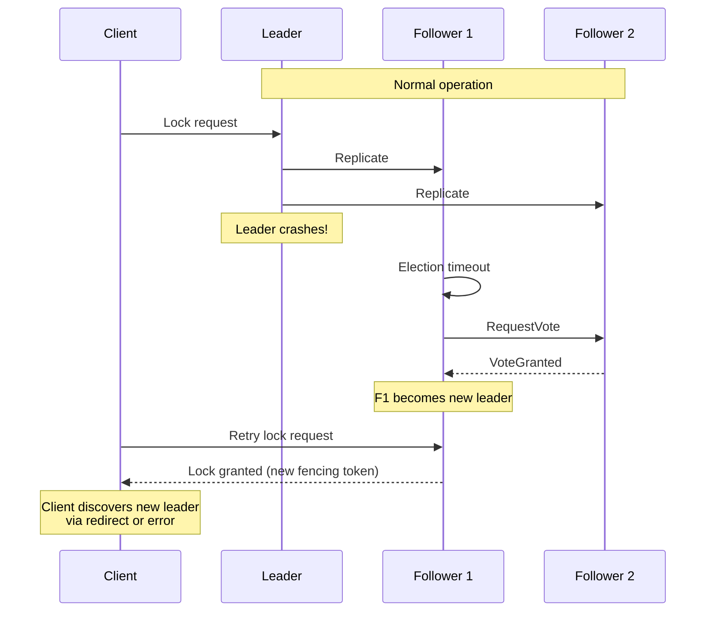

# Scalability and Reliability

[← Back to Index](./00-index.md)

---

## Scaling Strategies

### Vertical Scaling

| Resource | Scaling Benefit | Limit |
|----------|-----------------|-------|
| CPU | More Raft processing, faster apply | Single-threaded consensus |
| Memory | Larger watch set, faster reads | Cost, diminishing returns |
| Disk (NVMe) | Faster log writes, lower latency | Bandwidth, not capacity |
| Network | More concurrent connections | Usually not bottleneck |

**Recommendation:** Start with 4-8 cores, 16-32GB RAM, NVMe SSD. Vertical scaling has limited returns due to single-leader writes.

### Horizontal Scaling Patterns

#### Pattern 1: Namespace Sharding

```
┌─────────────────────────────────────────────────────────────────┐
│                NAMESPACE SHARDING                                │
├─────────────────────────────────────────────────────────────────┤
│                                                                  │
│  Client Request: Lock("/team-a/db/users")                       │
│                     │                                            │
│                     ▼                                            │
│              ┌──────────────┐                                   │
│              │ Router/Proxy │                                   │
│              │              │                                   │
│              │ hash("/team-a")                                  │
│              │ → Cluster 1  │                                   │
│              └──────┬───────┘                                   │
│                     │                                            │
│        ┌───────────┼───────────┐                               │
│        ▼           ▼           ▼                               │
│  ┌──────────┐ ┌──────────┐ ┌──────────┐                       │
│  │Cluster 1 │ │Cluster 2 │ │Cluster 3 │                       │
│  │/team-a/* │ │/team-b/* │ │/team-c/* │                       │
│  │/team-d/* │ │/team-e/* │ │/team-f/* │                       │
│  └──────────┘ └──────────┘ └──────────┘                       │
│                                                                  │
│  Pros:                                                          │
│  • Linear write scaling                                         │
│  • Isolation between namespaces                                 │
│  • Independent failure domains                                  │
│                                                                  │
│  Cons:                                                          │
│  • No cross-namespace locks                                     │
│  • Routing complexity                                           │
│  • Uneven load distribution                                     │
│                                                                  │
└─────────────────────────────────────────────────────────────────┘
```

#### Pattern 2: Hierarchical Locking

```
┌─────────────────────────────────────────────────────────────────┐
│                HIERARCHICAL LOCKING                              │
├─────────────────────────────────────────────────────────────────┤
│                                                                  │
│  Lock hierarchy: /database/schema/table/row                     │
│                                                                  │
│  ┌─────────────────────────────────────────────────────────┐   │
│  │ Level 1: /database (coarse-grained)                      │   │
│  │   • Single global lock service                          │   │
│  │   • Low contention                                      │   │
│  └─────────────────────────────────────────────────────────┘   │
│                     │                                            │
│                     ▼                                            │
│  ┌─────────────────────────────────────────────────────────┐   │
│  │ Level 2: /database/users (schema-level)                  │   │
│  │   • Per-schema lock services                            │   │
│  │   • Medium contention                                   │   │
│  └─────────────────────────────────────────────────────────┘   │
│                     │                                            │
│                     ▼                                            │
│  ┌─────────────────────────────────────────────────────────┐   │
│  │ Level 3: /database/users/123 (row-level)                 │   │
│  │   • Sharded lock services                               │   │
│  │   • High contention on hot rows                         │   │
│  │   • Consider optimistic locking here                    │   │
│  └─────────────────────────────────────────────────────────┘   │
│                                                                  │
│  Rule: Must hold parent lock before acquiring child lock       │
│                                                                  │
└─────────────────────────────────────────────────────────────────┘
```

#### Pattern 3: Read Replicas for Watches

```
┌─────────────────────────────────────────────────────────────────┐
│                READ REPLICAS FOR WATCHES                         │
├─────────────────────────────────────────────────────────────────┤
│                                                                  │
│            ┌─────────────────────────────────────┐              │
│            │         WRITE CLUSTER               │              │
│            │  ┌───────┐  ┌───────┐  ┌───────┐   │              │
│            │  │Leader │  │Follow │  │Follow │   │              │
│            │  └───────┘  └───────┘  └───────┘   │              │
│            └─────────────────────────────────────┘              │
│                           │                                      │
│                    Async replication                             │
│                           │                                      │
│        ┌─────────────────┼─────────────────┐                   │
│        ▼                 ▼                 ▼                    │
│  ┌───────────┐    ┌───────────┐    ┌───────────┐              │
│  │Read Replica│   │Read Replica│   │Read Replica│              │
│  │ Region A  │   │ Region B  │   │ Region C  │              │
│  │           │   │           │   │           │              │
│  │ 10K       │   │ 10K       │   │ 10K       │              │
│  │ watches   │   │ watches   │   │ watches   │              │
│  └───────────┘   └───────────┘   └───────────┘              │
│                                                                  │
│  Trade-off: Watch notifications may be slightly delayed        │
│  Use case: Configuration distribution, not lock acquisition   │
│                                                                  │
└─────────────────────────────────────────────────────────────────┘
```

### Scaling Limits

| Metric | Single Cluster Limit | With Sharding |
|--------|----------------------|---------------|
| Write ops/sec | 10K-50K | 100K+ |
| Active locks | 100K+ | Millions |
| Watch connections | 50K-100K | Millions |
| Nodes | 5-7 (odd number) | 5-7 per shard |

---

## Fault Tolerance

### Single Node Failure



**Recovery Time:**
- Election timeout: 1-2 seconds
- Client retry: 1-3 retries
- Total: 3-10 seconds typical

### Network Partition

```
┌─────────────────────────────────────────────────────────────────┐
│                NETWORK PARTITION SCENARIOS                       │
├─────────────────────────────────────────────────────────────────┤
│                                                                  │
│  SCENARIO 1: Leader isolated (minority partition)               │
│                                                                  │
│  [Leader] ════X════ [Follower 1] ──── [Follower 2]             │
│                                                                  │
│  Result:                                                         │
│  • Old leader cannot commit (no majority)                       │
│  • Followers elect new leader                                   │
│  • Old leader's uncommitted ops are lost                        │
│  • Clients on old leader's side cannot acquire locks            │
│  • System remains SAFE (no dual grants)                         │
│                                                                  │
│  ──────────────────────────────────────────────────────────────│
│                                                                  │
│  SCENARIO 2: Leader in majority partition                       │
│                                                                  │
│  [Leader] ──── [Follower 1] ════X════ [Follower 2]             │
│                                                                  │
│  Result:                                                         │
│  • Leader + F1 = majority, can commit                          │
│  • F2 isolated, cannot participate                              │
│  • System continues operating                                   │
│  • F2 catches up when partition heals                          │
│                                                                  │
│  ──────────────────────────────────────────────────────────────│
│                                                                  │
│  SCENARIO 3: No majority possible                               │
│                                                                  │
│  [Node 1] ════X════ [Node 2] ════X════ [Node 3]                │
│                                                                  │
│  Result:                                                         │
│  • No partition has majority                                    │
│  • All nodes become candidates repeatedly                       │
│  • No progress until partition heals                           │
│  • System UNAVAILABLE but SAFE                                  │
│                                                                  │
└─────────────────────────────────────────────────────────────────┘
```

### Handling Lease Expiry During Partition

```
SCENARIO: Client's lock expires during partition

Timeline:
  T0:  Client A acquires lock (lease TTL=30s)
  T5:  Network partition isolates Client A from cluster
  T10: Client A's renewal request fails (can't reach leader)
  T15: Client A retries renewal
  T20: Client A retries again
  T30: Lease expires on cluster (Client A still partitioned)
  T31: Client B acquires lock
  T35: Partition heals
  T36: Client A tries to use lock → Storage rejects (fencing token)

Key insight: Fencing tokens protect even when lease expiry detection is delayed
```

### Leader Failover Protocol

```
FUNCTION handle_leader_change(old_leader, new_leader):
    // Client-side handling

    // Step 1: Detect leader change
    IF connection to old_leader fails:
        // Or receive redirect response
        discover_new_leader()

    // Step 2: Reconnect to new leader
    connection = connect(new_leader)

    // Step 3: Verify lease status
    lease_status = connection.lease_time_to_live(my_lease_id)

    IF lease_status.ttl > 0:
        // Lease still valid, locks still held
        CONTINUE normal operation
    ELSE:
        // Lease expired during failover
        // Must re-acquire locks
        FOR lock IN held_locks:
            reacquire_lock(lock)

    // Step 4: Re-establish watches
    FOR watch IN active_watches:
        re_register_watch(watch, from_revision=last_seen_revision)
```

---

## Disaster Recovery

### Multi-Region Deployment Options

#### Option 1: Single Region with Cross-Region Backups

```
┌─────────────────────────────────────────────────────────────────┐
│                SINGLE REGION + BACKUPS                           │
├─────────────────────────────────────────────────────────────────┤
│                                                                  │
│  Primary Region (US-East)                                       │
│  ┌─────────────────────────────────────────────────────────┐   │
│  │  ┌───────┐  ┌───────┐  ┌───────┐                        │   │
│  │  │Leader │  │Follow │  │Follow │                        │   │
│  │  └───────┘  └───────┘  └───────┘                        │   │
│  │           Active cluster                                 │   │
│  └─────────────────────────────────────────────────────────┘   │
│                           │                                      │
│                    Periodic snapshots                            │
│                           │                                      │
│                           ▼                                      │
│  Backup Region (US-West)                                        │
│  ┌─────────────────────────────────────────────────────────┐   │
│  │                                                          │   │
│  │        Object Storage (snapshots + logs)                │   │
│  │                                                          │   │
│  └─────────────────────────────────────────────────────────┘   │
│                                                                  │
│  RTO: Minutes (provision new cluster from backup)              │
│  RPO: Snapshot interval (potentially hours of data loss)       │
│                                                                  │
└─────────────────────────────────────────────────────────────────┘
```

#### Option 2: Multi-Region Raft (Synchronous)

```
┌─────────────────────────────────────────────────────────────────┐
│                MULTI-REGION RAFT                                 │
├─────────────────────────────────────────────────────────────────┤
│                                                                  │
│  US-East (Primary)     US-West            Europe                │
│  ┌───────────────┐    ┌───────────┐      ┌───────────┐        │
│  │ Node 1        │    │ Node 3    │      │ Node 5    │        │
│  │ (Leader)      │◄──►│           │◄────►│ (Witness) │        │
│  │ Node 2        │    │ Node 4    │      │           │        │
│  └───────────────┘    └───────────┘      └───────────┘        │
│                                                                  │
│  Latency: US-East to US-West = 60ms                            │
│           US-East to Europe = 100ms                             │
│                                                                  │
│  Write latency: Majority RTT = 60ms (if 2 US nodes + leader)   │
│                                                                  │
│  RTO: Seconds (automatic failover)                             │
│  RPO: Zero (synchronous replication)                           │
│                                                                  │
│  Trade-off: Higher latency for all writes                      │
│                                                                  │
└─────────────────────────────────────────────────────────────────┘
```

#### Option 3: Active-Passive with Async Replication

```
┌─────────────────────────────────────────────────────────────────┐
│                ACTIVE-PASSIVE ASYNC                              │
├─────────────────────────────────────────────────────────────────┤
│                                                                  │
│  Primary (Active)          Secondary (Standby)                  │
│  ┌───────────────────┐    ┌───────────────────┐                │
│  │  ┌───────┐        │    │  ┌───────┐        │                │
│  │  │Leader │────────┼────▶ │Follower│        │                │
│  │  └───────┘        │Async│ │(Learner)       │                │
│  │  ┌───────┐        │    │  └───────┘        │                │
│  │  │Follow │        │    │  ┌───────┐        │                │
│  │  └───────┘        │    │  │Follow │        │                │
│  │  ┌───────┐        │    │  └───────┘        │                │
│  │  │Follow │        │    │  ┌───────┐        │                │
│  │  └───────┘        │    │  │Follow │        │                │
│  └───────────────────┘    └───────────────────┘                │
│                                                                  │
│  Normal: All traffic to Primary                                 │
│  Failover: Promote Secondary, update DNS                       │
│                                                                  │
│  RTO: Minutes (manual or automated failover)                   │
│  RPO: Replication lag (typically < 1 second)                   │
│                                                                  │
└─────────────────────────────────────────────────────────────────┘
```

### Disaster Recovery Procedures

```
PROCEDURE: Region Failover

PRE-REQUISITES:
  - Secondary region provisioned and synced
  - DNS TTL set low (< 60 seconds)
  - Runbook tested quarterly

STEPS:
  1. DETECT: Primary region unhealthy for > 5 minutes
  2. DECIDE: Confirm failover (potential data loss if async)
  3. FENCE: Ensure primary cannot accept writes
     - Update security groups/firewall rules
     - Revoke primary's certificates
  4. PROMOTE: Start secondary cluster as primary
     - Update configuration
     - Start accepting writes
  5. REDIRECT: Update DNS/load balancer
     - Point clients to new primary
  6. VERIFY: Confirm clients connecting to new primary
  7. NOTIFY: Alert operations team

ROLLBACK:
  - If primary recovers, treat as new secondary
  - Never allow old primary to accept writes
  - Sync from new primary to old primary
```

### Backup and Restore

```
SNAPSHOT STRATEGY:

  Frequency: Every 10,000 log entries OR every hour
  Retention: 24 hours locally, 30 days in object storage
  Contents: State machine snapshot + metadata

RESTORE PROCEDURE:

  1. Stop cluster (or provision new nodes)
  2. Copy latest snapshot to each node
  3. Copy Raft log entries since snapshot
  4. Start nodes in recovery mode
  5. Apply log entries to reach consistent state
  6. Resume normal operation

POINT-IN-TIME RECOVERY:

  // If need to restore to specific revision
  revision_target = 15890

  1. Find snapshot before target revision
  2. Restore snapshot
  3. Replay log entries up to target revision
  4. Stop before applying entries beyond target
```

---

## High Availability Configuration

### 5-Node Cluster Configuration

```yaml
# Example etcd-style configuration
cluster:
  name: lock-manager-prod
  initial_cluster_state: new

nodes:
  - name: node-1
    address: 10.0.1.10:2380
    client_address: 10.0.1.10:2379
    availability_zone: us-east-1a

  - name: node-2
    address: 10.0.1.11:2380
    client_address: 10.0.1.11:2379
    availability_zone: us-east-1b

  - name: node-3
    address: 10.0.1.12:2380
    client_address: 10.0.1.12:2379
    availability_zone: us-east-1c

  - name: node-4
    address: 10.0.1.13:2380
    client_address: 10.0.1.13:2379
    availability_zone: us-east-1a

  - name: node-5
    address: 10.0.1.14:2380
    client_address: 10.0.1.14:2379
    availability_zone: us-east-1b

raft:
  election_timeout: 1000ms
  heartbeat_interval: 100ms
  snapshot_count: 10000

lease:
  min_ttl: 5s
  max_ttl: 1h
  default_ttl: 30s
```

### Anti-Affinity Rules

```yaml
# Kubernetes pod anti-affinity
apiVersion: apps/v1
kind: StatefulSet
metadata:
  name: lock-manager
spec:
  replicas: 5
  template:
    spec:
      affinity:
        podAntiAffinity:
          requiredDuringSchedulingIgnoredDuringExecution:
            - labelSelector:
                matchLabels:
                  app: lock-manager
              topologyKey: topology.kubernetes.io/zone
          preferredDuringSchedulingIgnoredDuringExecution:
            - weight: 100
              podAffinityTerm:
                labelSelector:
                  matchLabels:
                    app: lock-manager
                topologyKey: kubernetes.io/hostname
```

### Load Balancer Configuration

```
┌─────────────────────────────────────────────────────────────────┐
│                LOAD BALANCER FOR LOCK MANAGER                    │
├─────────────────────────────────────────────────────────────────┤
│                                                                  │
│  Clients                                                         │
│      │                                                           │
│      ▼                                                           │
│  ┌───────────────────────────────────────────────────────────┐ │
│  │                    L4 Load Balancer                        │ │
│  │                                                            │ │
│  │  Health check: TCP port 2379                              │ │
│  │  Algorithm: Round-robin (client handles leader discovery) │ │
│  │                                                            │ │
│  │  OR: Expose all nodes, let client library handle routing  │ │
│  └───────────────────────────────────────────────────────────┘ │
│          │         │         │         │         │              │
│          ▼         ▼         ▼         ▼         ▼              │
│       Node 1    Node 2    Node 3    Node 4    Node 5            │
│                                                                  │
│  Note: Client libraries typically:                              │
│  1. Connect to any node                                         │
│  2. Discover leader from member list                           │
│  3. Send writes to leader directly                             │
│  4. Automatically redirect on leader change                    │
│                                                                  │
└─────────────────────────────────────────────────────────────────┘
```

---

## Operational Procedures

### Rolling Upgrade

```
PROCEDURE: Zero-Downtime Upgrade

1. PREPARE:
   - Verify new version compatibility
   - Test in staging environment
   - Ensure cluster health (5/5 nodes healthy)

2. UPGRADE FOLLOWERS FIRST (one at a time):
   FOR follower IN [node-5, node-4, node-3, node-2]:
     a. Drain connections from follower
     b. Stop follower
     c. Upgrade binary
     d. Start follower
     e. Wait for follower to catch up
     f. Verify health
     g. Wait 1 minute before next

3. UPGRADE LEADER LAST:
   a. Trigger leader transfer to upgraded follower
      $ lockctl member transfer-leadership node-2
   b. Wait for leader transfer complete
   c. Stop old leader (now follower)
   d. Upgrade binary
   e. Start node
   f. Wait for catch up

4. VERIFY:
   - All nodes on new version
   - Cluster healthy
   - No client errors
```

### Adding/Removing Nodes

```
PROCEDURE: Add Node to Cluster

1. PREPARE NEW NODE:
   - Provision server
   - Install lock manager software
   - Configure with cluster discovery

2. ADD TO CLUSTER:
   $ lockctl member add node-6 --peer-urls=https://10.0.1.15:2380

3. START NEW NODE:
   $ lockctl start --initial-cluster-state=existing

4. VERIFY:
   $ lockctl member list
   - Should show 6 members (if expanding from 5)

5. WAIT FOR SYNC:
   - Node will sync state from leader
   - May take minutes for large state

NOTE: Cluster size must remain odd (3, 5, 7)
      Adding 6th node means you must add 7th


PROCEDURE: Remove Node from Cluster

1. ENSURE QUORUM:
   - Removing node must not break quorum
   - For 5-node cluster, can safely remove 1

2. TRANSFER LEADERSHIP (if removing leader):
   $ lockctl member transfer-leadership node-2

3. REMOVE FROM CLUSTER:
   $ lockctl member remove node-5

4. STOP NODE:
   $ lockctl stop

5. DECOMMISSION:
   - Clean up storage
   - Release resources
```

---

## Reliability Checklist

| Category | Item | Status |
|----------|------|--------|
| **Redundancy** | 5-node cluster (tolerate 2 failures) | Required |
| **Redundancy** | Nodes spread across availability zones | Required |
| **Redundancy** | No SPOF in network path | Required |
| **Backup** | Automated snapshots | Required |
| **Backup** | Off-site backup storage | Required |
| **Backup** | Tested restore procedure | Required |
| **Monitoring** | Leader health monitoring | Required |
| **Monitoring** | Replication lag alerting | Required |
| **Monitoring** | Lock contention metrics | Recommended |
| **DR** | Documented failover procedure | Required |
| **DR** | Quarterly DR drills | Recommended |
| **Security** | mTLS between nodes | Required |
| **Security** | Client authentication | Required |
| **Operations** | Rolling upgrade procedure | Required |
| **Operations** | On-call runbook | Required |
