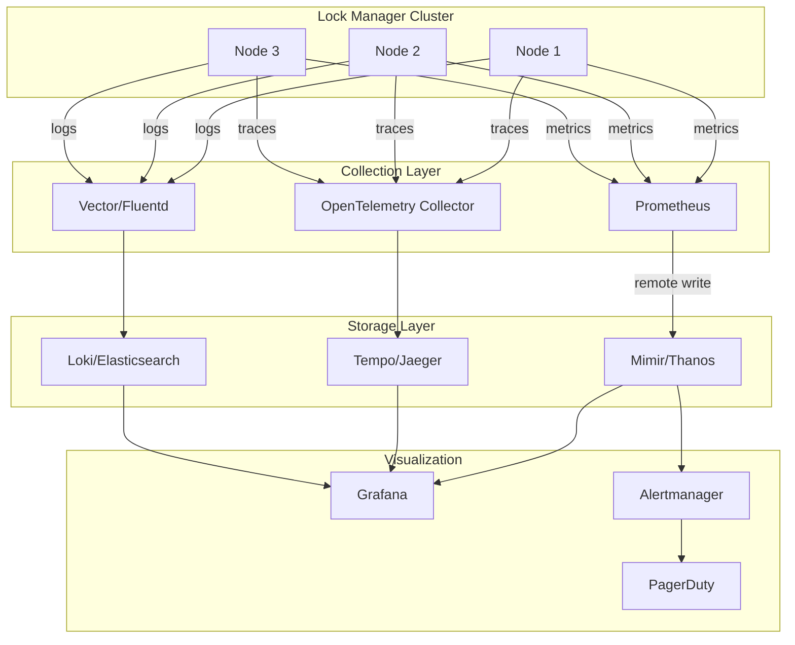

# Observability

[← Back to Index](./00-index.md)

---

## Metrics

### Lock Metrics

| Metric | Type | Description | Labels |
|--------|------|-------------|--------|
| `lock_acquire_total` | Counter | Total lock acquisition attempts | status, lock_path |
| `lock_acquire_duration_seconds` | Histogram | Lock acquisition latency | status, lock_path |
| `lock_release_total` | Counter | Total lock releases | lock_path |
| `lock_held_duration_seconds` | Histogram | How long locks are held | lock_path |
| `lock_waiters_current` | Gauge | Current waiters per lock | lock_path |
| `lock_contention_ratio` | Gauge | Ratio of contended acquires | lock_path |
| `locks_active_total` | Gauge | Total active locks | - |

### Lease Metrics

| Metric | Type | Description | Labels |
|--------|------|-------------|--------|
| `lease_grant_total` | Counter | Total leases granted | - |
| `lease_revoke_total` | Counter | Total leases revoked | reason |
| `lease_expire_total` | Counter | Total leases expired | - |
| `lease_renew_total` | Counter | Total lease renewals | status |
| `lease_ttl_seconds` | Histogram | Granted lease TTLs | - |
| `leases_active_total` | Gauge | Current active leases | - |

### Raft Metrics

| Metric | Type | Description | Labels |
|--------|------|-------------|--------|
| `raft_is_leader` | Gauge | 1 if this node is leader | - |
| `raft_term` | Gauge | Current Raft term | - |
| `raft_committed_index` | Gauge | Last committed log index | - |
| `raft_applied_index` | Gauge | Last applied log index | - |
| `raft_leader_changes_total` | Counter | Number of leader elections | - |
| `raft_proposals_total` | Counter | Total proposals | status |
| `raft_proposal_duration_seconds` | Histogram | Proposal latency | status |
| `raft_replication_lag_entries` | Gauge | Entries behind leader | follower_id |

### Client Metrics

| Metric | Type | Description | Labels |
|--------|------|-------------|--------|
| `client_connections_current` | Gauge | Active client connections | - |
| `client_requests_total` | Counter | Total client requests | method, status |
| `client_request_duration_seconds` | Histogram | Request latency | method |
| `watch_streams_current` | Gauge | Active watch streams | - |
| `watch_events_sent_total` | Counter | Watch events sent | - |

### System Metrics

| Metric | Type | Description | Labels |
|--------|------|-------------|--------|
| `process_cpu_seconds_total` | Counter | CPU time used | - |
| `process_resident_memory_bytes` | Gauge | Memory usage | - |
| `go_goroutines` | Gauge | Number of goroutines | - |
| `disk_write_bytes_total` | Counter | Bytes written to disk | - |
| `disk_read_bytes_total` | Counter | Bytes read from disk | - |
| `network_bytes_sent_total` | Counter | Bytes sent | peer_id |
| `network_bytes_received_total` | Counter | Bytes received | peer_id |

---

## Metric Examples (Prometheus Format)

```prometheus
# HELP lock_acquire_duration_seconds Time to acquire a lock
# TYPE lock_acquire_duration_seconds histogram
lock_acquire_duration_seconds_bucket{status="success",lock_path="/db/users",le="0.005"} 156
lock_acquire_duration_seconds_bucket{status="success",lock_path="/db/users",le="0.01"} 289
lock_acquire_duration_seconds_bucket{status="success",lock_path="/db/users",le="0.025"} 412
lock_acquire_duration_seconds_bucket{status="success",lock_path="/db/users",le="0.05"} 450
lock_acquire_duration_seconds_bucket{status="success",lock_path="/db/users",le="0.1"} 455
lock_acquire_duration_seconds_bucket{status="success",lock_path="/db/users",le="+Inf"} 458
lock_acquire_duration_seconds_sum{status="success",lock_path="/db/users"} 3.456
lock_acquire_duration_seconds_count{status="success",lock_path="/db/users"} 458

# HELP raft_is_leader Whether this node is the Raft leader
# TYPE raft_is_leader gauge
raft_is_leader{node_id="node-1"} 1
raft_is_leader{node_id="node-2"} 0
raft_is_leader{node_id="node-3"} 0

# HELP lock_waiters_current Current number of waiters per lock
# TYPE lock_waiters_current gauge
lock_waiters_current{lock_path="/db/migration"} 5
lock_waiters_current{lock_path="/cache/warmup"} 0

# HELP lease_expire_total Total leases expired
# TYPE lease_expire_total counter
lease_expire_total 42

# HELP raft_replication_lag_entries Entries behind leader
# TYPE raft_replication_lag_entries gauge
raft_replication_lag_entries{follower_id="node-2"} 0
raft_replication_lag_entries{follower_id="node-3"} 2
```

---

## Alerting Rules

### Critical Alerts

```yaml
groups:
  - name: lock-manager-critical
    rules:
      # No leader elected
      - alert: LockManagerNoLeader
        expr: sum(raft_is_leader) == 0
        for: 30s
        labels:
          severity: critical
        annotations:
          summary: "No Raft leader elected"
          description: "Lock manager cluster has no leader for 30+ seconds"
          runbook: "https://runbooks/lock-manager/no-leader"

      # Cluster has lost quorum
      - alert: LockManagerQuorumLost
        expr: count(up{job="lock-manager"} == 1) < 3
        for: 1m
        labels:
          severity: critical
        annotations:
          summary: "Lock manager quorum lost"
          description: "Fewer than 3 nodes are healthy"

      # High lock acquisition failure rate
      - alert: LockAcquireFailureRateHigh
        expr: |
          sum(rate(lock_acquire_total{status="failure"}[5m]))
          /
          sum(rate(lock_acquire_total[5m])) > 0.1
        for: 5m
        labels:
          severity: critical
        annotations:
          summary: "High lock acquisition failure rate"
          description: "More than 10% of lock acquisitions are failing"
```

### Warning Alerts

```yaml
groups:
  - name: lock-manager-warning
    rules:
      # High lock contention
      - alert: LockHighContention
        expr: lock_waiters_current > 10
        for: 5m
        labels:
          severity: warning
        annotations:
          summary: "High lock contention on {{ $labels.lock_path }}"
          description: "Lock has {{ $value }} waiters"

      # Raft replication lag
      - alert: RaftReplicationLag
        expr: raft_replication_lag_entries > 100
        for: 2m
        labels:
          severity: warning
        annotations:
          summary: "Raft replication lag on {{ $labels.follower_id }}"
          description: "Follower is {{ $value }} entries behind leader"

      # Lock acquisition latency high
      - alert: LockAcquireLatencyHigh
        expr: |
          histogram_quantile(0.99,
            sum(rate(lock_acquire_duration_seconds_bucket[5m])) by (le)
          ) > 0.05
        for: 5m
        labels:
          severity: warning
        annotations:
          summary: "Lock acquisition p99 latency is {{ $value | humanizeDuration }}"

      # Leader changes too frequent
      - alert: FrequentLeaderChanges
        expr: increase(raft_leader_changes_total[1h]) > 3
        labels:
          severity: warning
        annotations:
          summary: "Frequent Raft leader changes"
          description: "{{ $value }} leader changes in the last hour"

      # Lease expiry spike
      - alert: LeaseExpirySpike
        expr: rate(lease_expire_total[5m]) > 10
        for: 2m
        labels:
          severity: warning
        annotations:
          summary: "Unusual lease expiry rate"
          description: "{{ $value }} leases expiring per second"

      # Disk usage high
      - alert: LockManagerDiskUsageHigh
        expr: |
          (node_filesystem_size_bytes{mountpoint="/data"} -
           node_filesystem_avail_bytes{mountpoint="/data"})
          / node_filesystem_size_bytes{mountpoint="/data"} > 0.8
        for: 10m
        labels:
          severity: warning
        annotations:
          summary: "Disk usage above 80%"
```

---

## Logging

### Log Format (Structured JSON)

```json
{
  "timestamp": "2025-01-20T10:15:30.123456Z",
  "level": "INFO",
  "logger": "lock-manager.raft",
  "message": "Lock acquired",
  "fields": {
    "lock_path": "/db/users/schema-migration",
    "holder_id": "payment-service-abc123",
    "lease_id": 7587848390234,
    "fencing_token": 15892,
    "wait_time_ms": 45,
    "trace_id": "abc123def456",
    "span_id": "789ghi"
  },
  "context": {
    "node_id": "node-1",
    "raft_term": 42,
    "revision": 15892
  }
}
```

### Log Levels

| Level | Use Case | Example |
|-------|----------|---------|
| DEBUG | Detailed debugging | Raft message details |
| INFO | Normal operations | Lock acquired/released |
| WARN | Recoverable issues | Lease renewal delayed |
| ERROR | Failures | Lock acquisition failed |
| FATAL | Unrecoverable | Data corruption detected |

### Key Log Events

```
# Lock lifecycle
INFO  Lock acquired          lock_path=/db/users holder=svc-a token=100
INFO  Lock released          lock_path=/db/users holder=svc-a
WARN  Lock wait timeout      lock_path=/db/users waiter=svc-b wait_time=30s

# Lease lifecycle
INFO  Lease granted          lease_id=123 ttl=30s client=svc-a
INFO  Lease renewed          lease_id=123 new_ttl=30s
WARN  Lease expired          lease_id=123 held_locks=2
ERROR Lease renew failed     lease_id=123 error="connection refused"

# Raft events
INFO  Became leader          term=42 node=node-1
INFO  Lost leadership        term=42 node=node-1 new_leader=node-2
WARN  Slow proposal          index=15890 latency=500ms
ERROR Proposal failed        index=15891 error="no quorum"

# Client events
INFO  Client connected       client_id=svc-a remote_addr=10.0.2.5
WARN  Client disconnected    client_id=svc-a reason="connection reset"
```

---

## Distributed Tracing

### Trace Propagation

```
┌─────────────────────────────────────────────────────────────────┐
│                DISTRIBUTED TRACE                                 │
├─────────────────────────────────────────────────────────────────┤
│                                                                  │
│  Client Application                                              │
│  ┌─────────────────────────────────────────────────────────┐   │
│  │ Span: process-order                                      │   │
│  │ trace_id: abc123                                         │   │
│  │ span_id: span-1                                          │   │
│  │                                                          │   │
│  │   ┌─────────────────────────────────────────────────┐   │   │
│  │   │ Span: acquire-lock                               │   │   │
│  │   │ trace_id: abc123                                 │   │   │
│  │   │ parent_span_id: span-1                          │   │   │
│  │   │ span_id: span-2                                  │   │   │
│  │   └─────────────────────────────────────────────────┘   │   │
│  └─────────────────────────────────────────────────────────┘   │
│                           │                                      │
│                           │ gRPC metadata:                       │
│                           │ traceparent: 00-abc123-span2-01     │
│                           ▼                                      │
│  Lock Manager                                                    │
│  ┌─────────────────────────────────────────────────────────┐   │
│  │ Span: handle-lock-request                                │   │
│  │ trace_id: abc123                                         │   │
│  │ parent_span_id: span-2                                   │   │
│  │ span_id: span-3                                          │   │
│  │                                                          │   │
│  │   ┌─────────────────────────────────────────────────┐   │   │
│  │   │ Span: raft-propose                               │   │   │
│  │   │ span_id: span-4                                  │   │   │
│  │   └─────────────────────────────────────────────────┘   │   │
│  │                                                          │   │
│  │   ┌─────────────────────────────────────────────────┐   │   │
│  │   │ Span: raft-replicate                             │   │   │
│  │   │ span_id: span-5                                  │   │   │
│  │   └─────────────────────────────────────────────────┘   │   │
│  │                                                          │   │
│  │   ┌─────────────────────────────────────────────────┐   │   │
│  │   │ Span: apply-state-machine                        │   │   │
│  │   │ span_id: span-6                                  │   │   │
│  │   └─────────────────────────────────────────────────┘   │   │
│  └─────────────────────────────────────────────────────────┘   │
│                                                                  │
└─────────────────────────────────────────────────────────────────┘
```

### Span Attributes

```yaml
# Lock operation span
span:
  name: "lock.acquire"
  kind: CLIENT
  attributes:
    lock.path: "/db/users"
    lock.operation: "acquire"
    lock.fencing_token: 15892
    lock.wait_time_ms: 45
    rpc.service: "LockService"
    rpc.method: "Lock"
  events:
    - name: "lock.queued"
      timestamp: "2025-01-20T10:15:30.100Z"
    - name: "lock.acquired"
      timestamp: "2025-01-20T10:15:30.145Z"
```

---

## Dashboard Design

### Overview Dashboard

```
┌─────────────────────────────────────────────────────────────────┐
│                 LOCK MANAGER OVERVIEW                            │
├─────────────────────────────────────────────────────────────────┤
│                                                                  │
│  ┌─────────────┐  ┌─────────────┐  ┌─────────────┐  ┌─────────┐│
│  │   LEADER    │  │  HEALTHY    │  │   ACTIVE    │  │  LEASE  ││
│  │   node-1    │  │    5/5      │  │   LOCKS     │  │  COUNT  ││
│  │             │  │   nodes     │  │    847      │  │  1,234  ││
│  └─────────────┘  └─────────────┘  └─────────────┘  └─────────┘│
│                                                                  │
│  Lock Operations                    Lock Latency (p99)          │
│  ┌─────────────────────────────┐   ┌─────────────────────────┐ │
│  │  ▄▄▄█████████████▄▄▄       │   │                    ___   │ │
│  │  Acquire: 156/s             │   │  Acquire  ___----     │ │
│  │  Release: 148/s             │   │          15ms           │ │
│  │  Renew: 89/s                │   │                         │ │
│  └─────────────────────────────┘   └─────────────────────────┘ │
│                                                                  │
│  Raft Metrics                       Top Contended Locks         │
│  ┌─────────────────────────────┐   ┌─────────────────────────┐ │
│  │  Term: 42                    │   │ /db/migration    5 wait│ │
│  │  Committed: 15892            │   │ /cache/warmup    3 wait│ │
│  │  Applied: 15892              │   │ /queue/process   2 wait│ │
│  │  Lag: 0 entries              │   │                         │ │
│  └─────────────────────────────┘   └─────────────────────────┘ │
│                                                                  │
│  Cluster Status                                                  │
│  ┌─────────────────────────────────────────────────────────┐   │
│  │  node-1 (Leader)  ● Healthy  CPU: 45%  Mem: 2.1GB       │   │
│  │  node-2           ● Healthy  CPU: 12%  Mem: 1.8GB       │   │
│  │  node-3           ● Healthy  CPU: 15%  Mem: 1.9GB       │   │
│  │  node-4           ● Healthy  CPU: 11%  Mem: 1.7GB       │   │
│  │  node-5           ● Healthy  CPU: 14%  Mem: 1.8GB       │   │
│  └─────────────────────────────────────────────────────────┘   │
│                                                                  │
└─────────────────────────────────────────────────────────────────┘
```

### Raft Health Dashboard

```
┌─────────────────────────────────────────────────────────────────┐
│                 RAFT CLUSTER HEALTH                              │
├─────────────────────────────────────────────────────────────────┤
│                                                                  │
│  Leader Timeline (last 24h)                                     │
│  ┌─────────────────────────────────────────────────────────┐   │
│  │ node-1 ████████████████████████████████████████████████│   │
│  │ node-2            ████                                  │   │
│  │ node-3                                                  │   │
│  │ 00:00        06:00        12:00        18:00     24:00 │   │
│  └─────────────────────────────────────────────────────────┘   │
│  Leader changes: 2 in last 24h                                  │
│                                                                  │
│  Replication Lag                    Proposal Latency            │
│  ┌─────────────────────────────┐   ┌─────────────────────────┐ │
│  │  node-2: 0 entries          │   │  p50:  2ms              │ │
│  │  node-3: 0 entries          │   │  p90:  5ms              │ │
│  │  node-4: 1 entry            │   │  p99: 12ms              │ │
│  │  node-5: 0 entries          │   │  p999: 45ms             │ │
│  └─────────────────────────────┘   └─────────────────────────┘ │
│                                                                  │
│  Log Growth                         Snapshot Status             │
│  ┌─────────────────────────────┐   ┌─────────────────────────┐ │
│  │  Committed: 15,892          │   │  Last: 2h ago           │ │
│  │  Applied: 15,892            │   │  Size: 4.2 MB           │ │
│  │  Log size: 128 MB           │   │  Next: in 8,108 entries │ │
│  └─────────────────────────────┘   └─────────────────────────┘ │
│                                                                  │
└─────────────────────────────────────────────────────────────────┘
```

---

## Observability Architecture



---

## Key SLIs for SLO

| SLI | Target | Measurement |
|-----|--------|-------------|
| Availability | 99.99% | `successful_requests / total_requests` |
| Lock Latency (p99) | < 20ms | `histogram_quantile(0.99, lock_acquire_duration_seconds)` |
| Lock Success Rate | > 99.9% | `lock_acquire{status="success"} / lock_acquire_total` |
| Leader Availability | 99.99% | `time_with_leader / total_time` |
| Replication Lag | < 100 entries | `max(raft_replication_lag_entries)` |

---

## Runbook Quick Reference

| Alert | Immediate Action |
|-------|------------------|
| No Leader | Check node health, network connectivity, force election if needed |
| Quorum Lost | Restore failed nodes, check cloud provider status |
| High Latency | Check disk I/O, network latency, reduce load |
| High Contention | Review lock usage patterns, add sharding |
| Replication Lag | Check follower disk/network, consider removal if unhealthy |
| Disk Full | Compact logs, increase disk, trigger snapshot |
