# High-Level Design

[← Back to Index](./00-index.md)

---

## The Hash Ring Concept

### Core Idea

Consistent hashing maps both **keys** and **nodes** onto a circular hash space (the "ring"). The ring represents all possible hash values from 0 to 2^32-1 (or 2^64-1), arranged in a circle where the maximum value wraps around to 0.

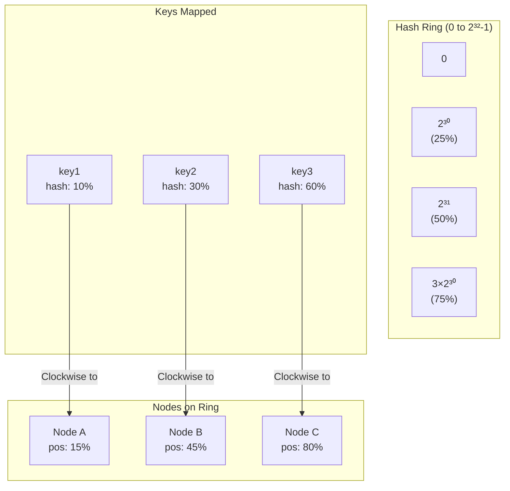

### Key Assignment Rule

**A key is assigned to the first node encountered when walking CLOCKWISE from the key's hash position.**

```
┌─────────────────────────────────────────────────────────────────────┐
│                        HASH RING VISUALIZATION                       │
├─────────────────────────────────────────────────────────────────────┤
│                                                                      │
│                              0 (top)                                 │
│                                │                                     │
│                           ┌────┴────┐                               │
│                      ────/    [A]    \────        Node A at 10%     │
│                    /                      \                          │
│                  /                          \                        │
│                /                              \                      │
│               │                                │                     │
│          [C]  │                                │  [B]                │
│   Node C ─────│                                │───── Node B         │
│   at 75%      │                                │      at 40%        │
│               │                                │                     │
│                \                              /                      │
│                  \                          /                        │
│                    \                      /                          │
│                      ────\          /────                           │
│                           └────┬────┘                               │
│                                │                                     │
│                           (50% - bottom)                            │
│                                                                      │
│  Key Assignment:                                                     │
│  • key "user:123" hashes to 5%   → walks to A (first node ≥ 5%)    │
│  • key "order:456" hashes to 25% → walks to B (first node ≥ 25%)   │
│  • key "product:789" hashes to 50% → walks to C (first node ≥ 50%) │
│                                                                      │
└─────────────────────────────────────────────────────────────────────┘
```

---

## Why the Ring Works: Minimal Disruption

### Adding a Node

When a new node joins, it only takes keys from its immediate predecessor's range.

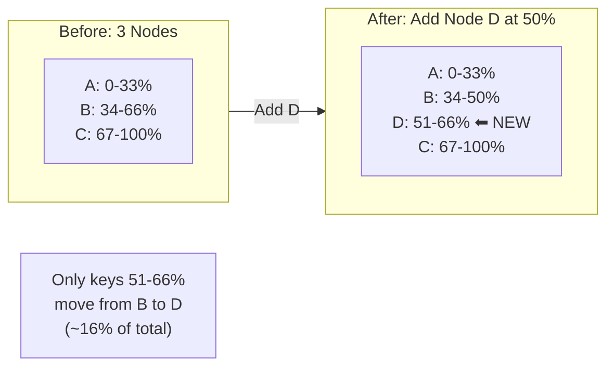

### Removing a Node

When a node leaves, its keys move to its successor.

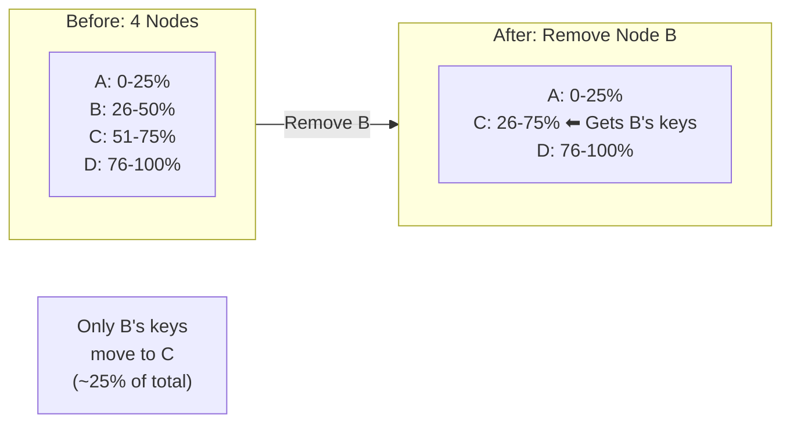

### Mathematical Proof of Minimal Disruption

```
Given:
  - N nodes in the ring
  - K total keys
  - Each node owns approximately K/N keys

When adding 1 node:
  - New node takes a portion from 1 successor
  - Keys moved ≈ K/N (from one node's range)
  - Fraction moved = (K/N) / K = 1/N

When removing 1 node:
  - Removed node's keys go to 1 successor
  - Keys moved = K/N (exactly one node's keys)
  - Fraction moved = 1/N

Compare to Modulo Hashing:
  - Changing from N to N+1 nodes
  - hash(key) % N → hash(key) % (N+1)
  - Almost ALL keys change assignment
  - Fraction moved ≈ (N-1)/N ≈ 1 - 1/N

Example (N = 100 nodes, K = 1M keys):
  Consistent Hashing: ~10,000 keys move (1%)
  Modulo Hashing: ~990,000 keys move (99%)
```

---

## Virtual Nodes (VNodes)

### The Problem with Basic Consistent Hashing

With only one position per node, key distribution can be highly uneven:

```
┌─────────────────────────────────────────────────────────────────────┐
│  PROBLEM: 3 Nodes with Single Positions                              │
├─────────────────────────────────────────────────────────────────────┤
│                                                                      │
│  Ring positions (random hash values):                                │
│    Node A: 10%                                                       │
│    Node B: 15%    ← A and B are close together!                     │
│    Node C: 80%                                                       │
│                                                                      │
│  Key Distribution:                                                   │
│    Node A: keys in range [80%, 10%]  = 30% of keys                  │
│    Node B: keys in range [10%, 15%]  = 5% of keys   ← UNFAIR!       │
│    Node C: keys in range [15%, 80%]  = 65% of keys  ← OVERLOADED!   │
│                                                                      │
│  With 1M total keys:                                                 │
│    Node A: 300,000 keys                                              │
│    Node B: 50,000 keys   (6x less than C!)                          │
│    Node C: 650,000 keys                                              │
│                                                                      │
└─────────────────────────────────────────────────────────────────────┘
```

### The Solution: Virtual Nodes

Each physical node is represented by multiple positions (virtual nodes) on the ring:

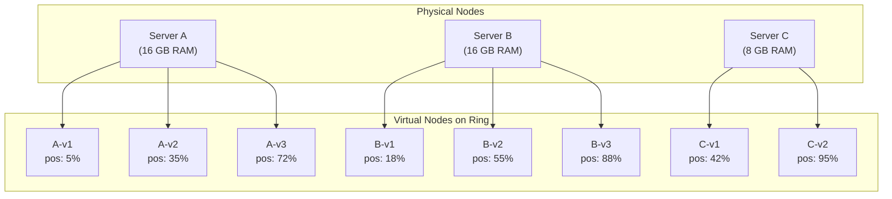

### Virtual Node Distribution

```
┌─────────────────────────────────────────────────────────────────────┐
│  VIRTUAL NODES: Even Distribution                                    │
├─────────────────────────────────────────────────────────────────────┤
│                                                                      │
│  With V=150 virtual nodes per physical node:                         │
│                                                                      │
│  Ring (simplified view):                                             │
│  0%────────────────────────────────────────────────────────────100% │
│  │A│B│C│A│B│C│A│B│C│A│B│C│A│B│C│A│B│C│...│A│B│C│A│B│C│             │
│                                                                      │
│  Each physical node's virtual nodes are spread across the ring,     │
│  creating roughly equal-sized segments.                              │
│                                                                      │
│  Statistical Effect:                                                 │
│  - With 3 nodes × 150 vnodes = 450 positions                        │
│  - Average segment size = 100% / 450 ≈ 0.22% of ring                │
│  - Each physical node owns ~33.3% ± small variance                  │
│                                                                      │
│  Distribution Quality vs VNode Count:                                │
│  ┌────────────┬─────────────────────────────────────┐               │
│  │ VNodes     │ Standard Deviation (% of mean)      │               │
│  ├────────────┼─────────────────────────────────────┤               │
│  │ 1          │ 50-100%  (highly variable)          │               │
│  │ 50         │ ~14%                                │               │
│  │ 150        │ ~8%                                 │               │
│  │ 500        │ ~4%                                 │               │
│  └────────────┴─────────────────────────────────────┘               │
│                                                                      │
└─────────────────────────────────────────────────────────────────────┘
```

### Weighted Virtual Nodes for Heterogeneous Capacity

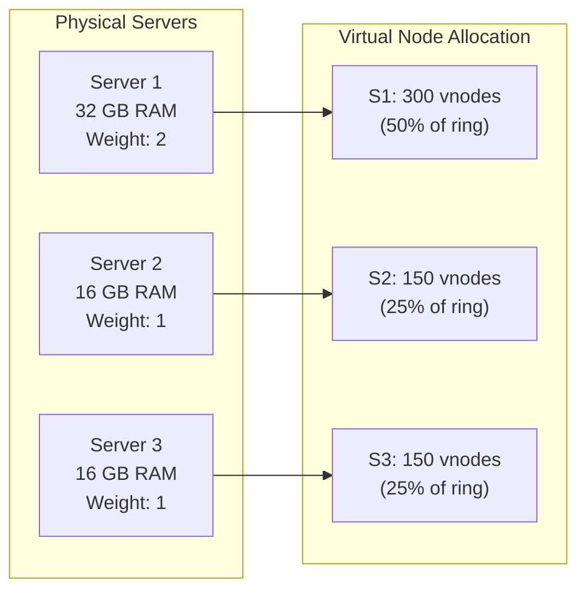

---

## Data Flow: Key Lookup

### Lookup Process

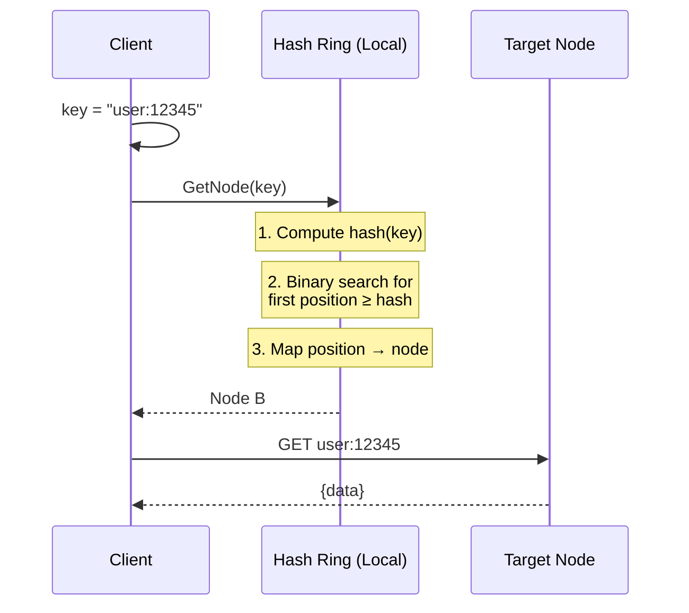

### Lookup with Replication

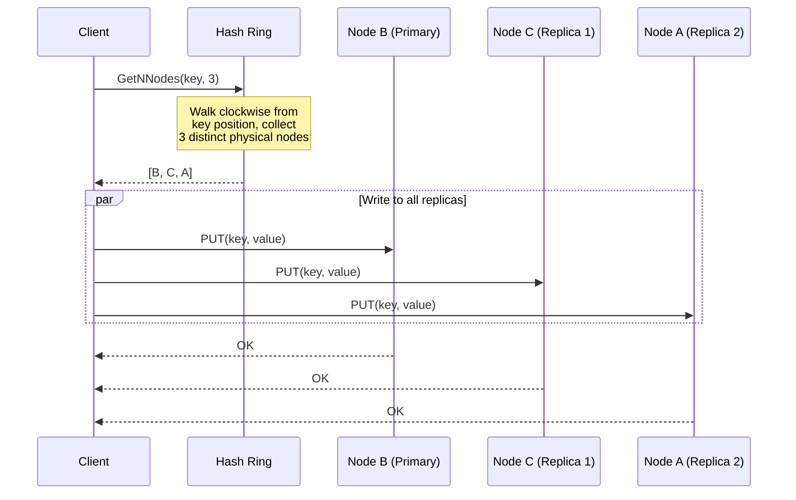

---

## Replication Using the Ring

### Preference List (Dynamo-style)

The ring naturally provides a **preference list** for replication:

```
┌─────────────────────────────────────────────────────────────────────┐
│  PREFERENCE LIST FOR KEY                                             │
├─────────────────────────────────────────────────────────────────────┤
│                                                                      │
│  Given: Replication factor N = 3                                     │
│                                                                      │
│  For key "user:123":                                                 │
│    1. Hash key → position 25% on ring                               │
│    2. Walk clockwise to find first node: B (at 30%)                 │
│    3. Continue walking for N-1 more PHYSICAL nodes: C, A            │
│    4. Preference list = [B, C, A]                                   │
│                                                                      │
│  Ring:                                                               │
│    [A-v1]───[key]───[B-v2]───[C-v1]───[B-v1]───[A-v2]───[C-v2]     │
│      10%     25%      30%      45%      60%      75%      90%       │
│                                                                      │
│  Note: Skip B-v1 because B is already in list (only physical nodes) │
│                                                                      │
│  Read/Write Quorum:                                                  │
│    - Write to W nodes (e.g., W=2)                                   │
│    - Read from R nodes (e.g., R=2)                                  │
│    - Where R + W > N for consistency                                │
│                                                                      │
└─────────────────────────────────────────────────────────────────────┘
```

### Zone-Aware Replica Selection

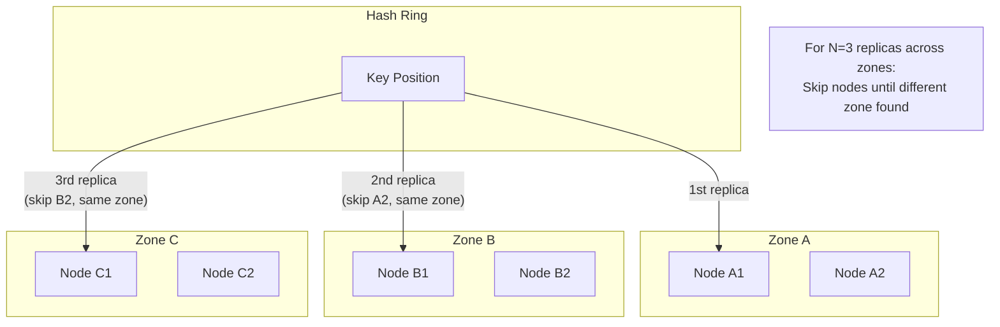

---

## Comparison: Alternative Partitioning Strategies

### Modulo Hashing vs Consistent Hashing

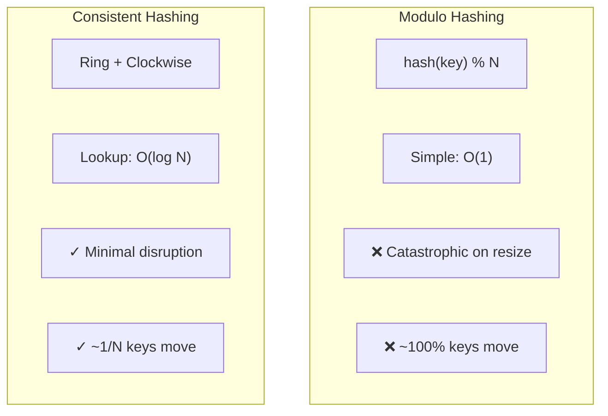

### Consistent Hashing vs Hash Slots (Redis)

| Aspect | Consistent Hashing | Hash Slots (Redis) |
|--------|-------------------|-------------------|
| **Approach** | Continuous ring, vnodes | Fixed 16,384 slots |
| **Slot Assignment** | Hash → ring position | CRC16(key) % 16384 |
| **Rebalancing** | Automatic with vnodes | Manual slot migration |
| **Flexibility** | Any number of nodes | Best with slot multiples |
| **Complexity** | Higher (ring management) | Lower (slot → node map) |
| **Used By** | Cassandra, Dynamo | Redis Cluster |

```
┌─────────────────────────────────────────────────────────────────────┐
│  REDIS HASH SLOTS                                                    │
├─────────────────────────────────────────────────────────────────────┤
│                                                                      │
│  Total Slots: 16,384 (fixed)                                        │
│                                                                      │
│  Slot Assignment (example with 3 nodes):                            │
│    Node A: slots 0-5460                                             │
│    Node B: slots 5461-10922                                         │
│    Node C: slots 10923-16383                                        │
│                                                                      │
│  Key Lookup:                                                         │
│    slot = CRC16(key) % 16384                                        │
│    node = slot_to_node_map[slot]                                    │
│                                                                      │
│  Adding Node D:                                                      │
│    Manually migrate slots from A, B, C to D                         │
│    e.g., D gets slots 0-1000, 5461-6461, 10923-11923               │
│                                                                      │
│  Trade-off: More predictable, but requires manual rebalancing       │
│                                                                      │
└─────────────────────────────────────────────────────────────────────┘
```

### Consistent Hashing vs Range Partitioning

| Aspect | Consistent Hashing | Range Partitioning |
|--------|-------------------|-------------------|
| **Key Distribution** | Hash-based (uniform) | Key-range based |
| **Range Queries** | Not supported | Efficient |
| **Hot Spots** | Less likely | Common (sequential keys) |
| **Rebalancing** | Hash-based | Split ranges |
| **Used By** | Cassandra, Dynamo | HBase, Bigtable |

---

## Node Membership Management

### Membership Protocol Options

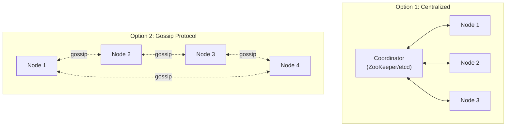

### Membership View Consistency

```
┌─────────────────────────────────────────────────────────────────────┐
│  MEMBERSHIP VIEW CONSISTENCY                                         │
├─────────────────────────────────────────────────────────────────────┤
│                                                                      │
│  Challenge: All nodes must agree on ring state for consistent       │
│             key-to-node mapping                                      │
│                                                                      │
│  Approaches:                                                         │
│                                                                      │
│  1. Strong Consistency (ZooKeeper/etcd)                             │
│     + All nodes see same ring at same time                          │
│     + No routing inconsistency                                       │
│     - Higher latency for membership changes                         │
│     - Dependency on coordination service                             │
│                                                                      │
│  2. Eventual Consistency (Gossip)                                   │
│     + Decentralized, no SPOF                                        │
│     + Scales to large clusters                                      │
│     - Temporary routing inconsistency during changes                │
│     - Requires handling of stale views                              │
│                                                                      │
│  3. Client-Side Caching with TTL                                    │
│     + Reduces coordination overhead                                  │
│     + Fast lookups from local ring                                  │
│     - Stale during TTL window                                       │
│     - Need cache invalidation on changes                            │
│                                                                      │
│  Production Choice: Gossip + request forwarding for stale views     │
│                                                                      │
└─────────────────────────────────────────────────────────────────────┘
```

---

## Architecture Pattern Checklist

| Pattern | Decision | Rationale |
|---------|----------|-----------|
| ✅ Hash Function | MD5/xxHash/MurmurHash | Uniform distribution, deterministic |
| ✅ Ring Size | 2^32 | Standard, sufficient for all practical scales |
| ✅ Virtual Nodes | 150-200 per physical node | Balance distribution vs memory |
| ✅ Lookup Structure | Sorted array | Simple, fast binary search |
| ✅ Replication | Clockwise N nodes | Natural preference list |
| ✅ Membership | Gossip + forwarding | Scalable, handles inconsistency |
| ✅ Weighted Nodes | VNode count proportional | Support heterogeneous capacity |

---

## Key Architectural Decisions

### Decision 1: Hash Function Selection

| Option | Speed | Distribution | Compatibility | Recommendation |
|--------|-------|--------------|---------------|----------------|
| MD5 | Medium | Excellent | High (Ketama) | **Interoperability** |
| xxHash | Very Fast | Excellent | Lower | **Performance critical** |
| MurmurHash3 | Fast | Excellent | Medium | General purpose |
| CRC32 | Very Fast | Good | High | Redis compatibility |

**Recommendation:** xxHash for new systems, MD5/Ketama for Memcached compatibility.

### Decision 2: Virtual Node Count

| Nodes | Recommended VNodes | Memory | Distribution Quality |
|-------|-------------------|--------|---------------------|
| < 10 | 200-500 | ~100 KB | Excellent required |
| 10-100 | 150-200 | ~1-3 MB | Good balance |
| 100-1000 | 100-150 | ~15-30 MB | Acceptable |
| > 1000 | 50-100 | Memory concern | Statistical averaging helps |

**Recommendation:** 150 vnodes for most deployments.

### Decision 3: Ring Data Structure

| Option | Lookup | Insert/Delete | Memory | Recommendation |
|--------|--------|---------------|--------|----------------|
| Sorted Array | O(log n) | O(n) | Compact | **Stable membership** |
| Red-Black Tree | O(log n) | O(log n) | Higher | Frequent changes |
| Skip List | O(log n) | O(log n) | Higher | Concurrent access |

**Recommendation:** Sorted array (membership changes are infrequent).

---

## Integration Points

### Where Consistent Hashing Fits

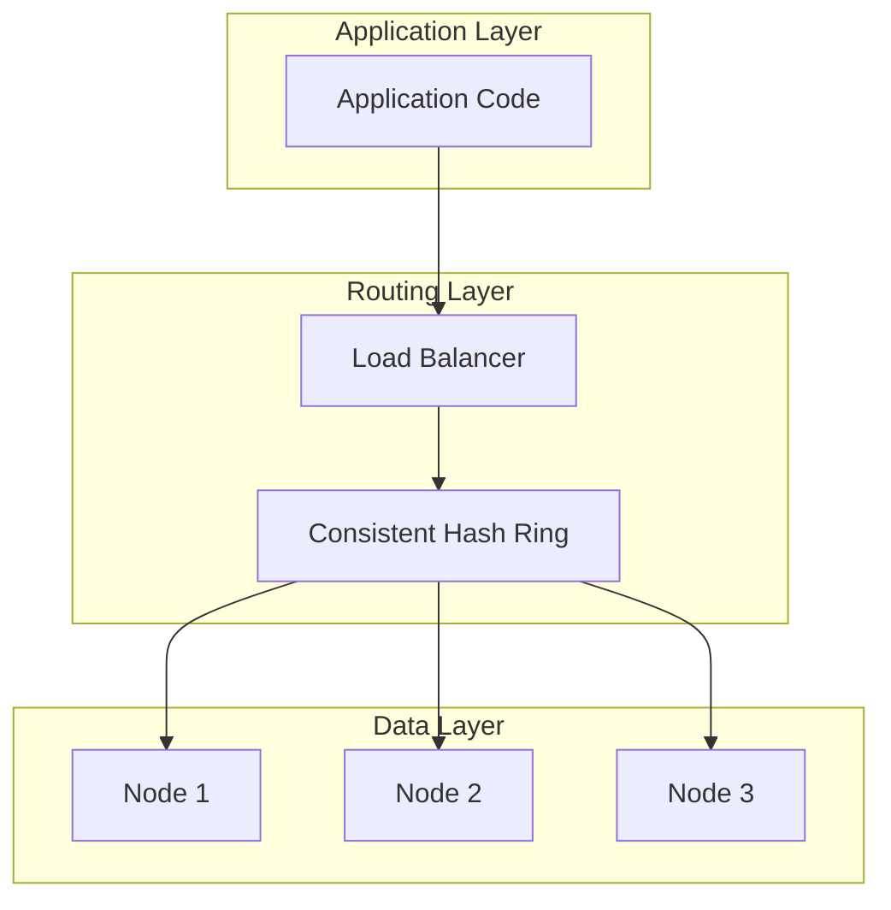

### Common Integration Patterns

| Pattern | Description | Example |
|---------|-------------|---------|
| **Client-side** | Ring in application | Memcached clients |
| **Proxy-side** | Ring in proxy layer | Mcrouter, Twemproxy |
| **Embedded** | Ring in database nodes | Cassandra, Riak |
| **Load Balancer** | Ring in LB | Envoy, HAProxy |
