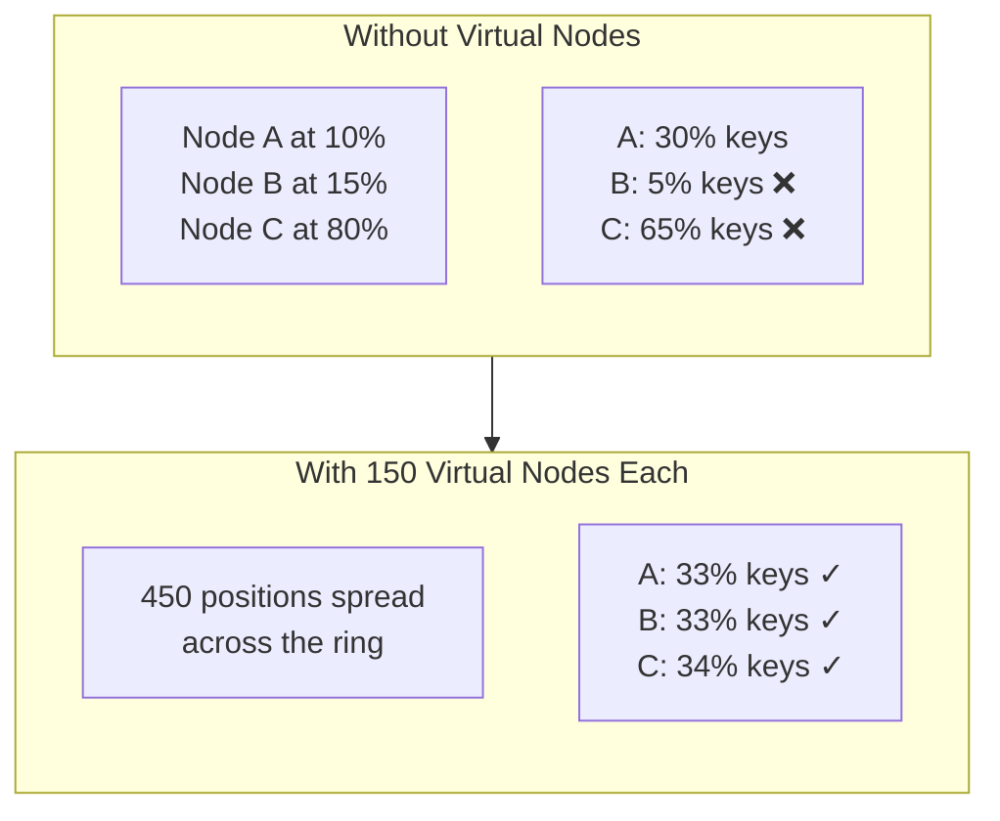
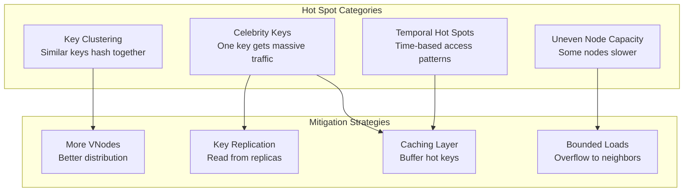
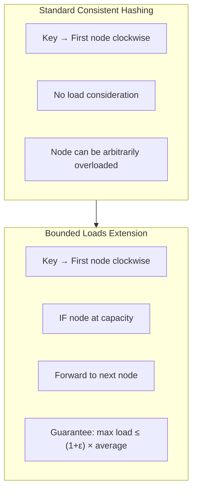
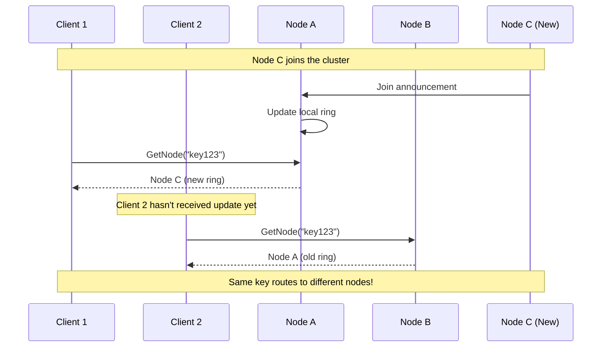
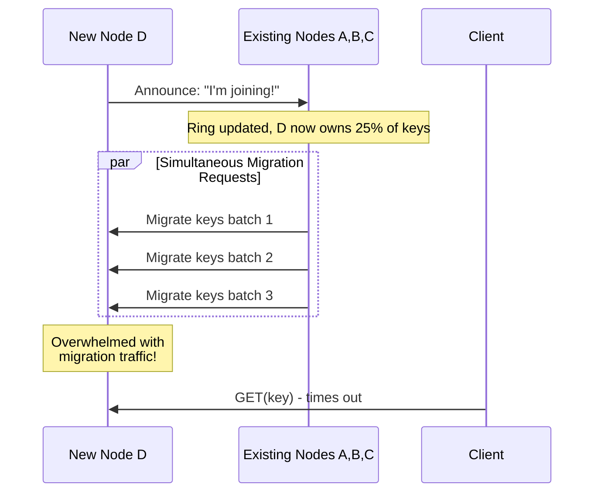
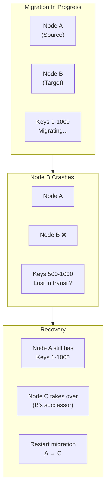

# Deep Dive & Bottlenecks

[← Back to Index](./00-index.md)

---

## Critical Component 1: Virtual Node Distribution

### Why Virtual Nodes Are Critical

Without virtual nodes, key distribution can be highly skewed, leading to overloaded nodes and poor resource utilization.



### Distribution Analysis

```
┌─────────────────────────────────────────────────────────────────────┐
│  STATISTICAL ANALYSIS OF KEY DISTRIBUTION                            │
├─────────────────────────────────────────────────────────────────────┤
│                                                                      │
│  Model: N physical nodes, V virtual nodes each, K total keys         │
│                                                                      │
│  Expected keys per physical node:                                    │
│    μ = K / N                                                         │
│                                                                      │
│  Standard deviation (with V vnodes):                                 │
│    σ ≈ √(K / N) × √(1 / V) = √(K / (N × V))                         │
│                                                                      │
│  Coefficient of Variation:                                           │
│    CV = σ / μ = √(N / (K × V))                                      │
│                                                                      │
│  Example: K=1M keys, N=10 nodes, V=150 vnodes                       │
│    μ = 100,000 keys/node                                            │
│    σ ≈ √(1,000,000 / (10 × 150)) ≈ 25.8 keys                       │
│    CV ≈ 0.026% (excellent uniformity!)                              │
│                                                                      │
│  But with V=1 (no virtual nodes):                                   │
│    σ ≈ √(1,000,000 / 10) ≈ 316 keys                                │
│    CV ≈ 0.3% (still okay statistically, but...)                     │
│    PROBLEM: This assumes uniform node positions!                     │
│    With random positions, variance can be 50%+ in practice          │
│                                                                      │
└─────────────────────────────────────────────────────────────────────┘
```

### VNode Count Trade-offs

| VNode Count | Memory (100 nodes) | Distribution CV | Use Case |
|-------------|-------------------|-----------------|----------|
| 1 | 2 KB | 30-50% | Never use |
| 50 | 80 KB | ~14% | Small test clusters |
| **150** | 240 KB | **~8%** | **Production default** |
| 500 | 800 KB | ~4% | Strict SLOs |
| 1000 | 1.6 MB | ~3% | Extreme uniformity |

---

## Critical Component 2: Hot Spot Handling

### Types of Hot Spots



### Hot Key (Celebrity) Problem

```
┌─────────────────────────────────────────────────────────────────────┐
│  CELEBRITY KEY PROBLEM                                               │
├─────────────────────────────────────────────────────────────────────┤
│                                                                      │
│  Scenario: Social media, celebrity "taylor_swift" has 100M followers │
│                                                                      │
│  Problem:                                                            │
│    key = "user:taylor_swift"                                        │
│    hash(key) = 0x3A7B...                                            │
│    → Always maps to Node B                                          │
│    → Node B receives 1000x normal traffic                           │
│    → Other nodes idle, Node B overloaded                            │
│                                                                      │
│  Solutions:                                                          │
│                                                                      │
│  1. Key Salting / Sharding                                          │
│     ─────────────────────                                            │
│     Split one key into multiple:                                     │
│     "user:taylor_swift:0", "user:taylor_swift:1", ...               │
│     Read from random shard, write to all shards                      │
│     Pros: Distributes load                                           │
│     Cons: Adds complexity, eventual consistency                      │
│                                                                      │
│  2. Local Caching                                                    │
│     ─────────────────                                                │
│     Cache hot keys in application memory                             │
│     TTL-based or LRU eviction                                        │
│     Pros: Sub-ms latency, reduces backend load                       │
│     Cons: Memory per app server, stale data                          │
│                                                                      │
│  3. Read Replicas                                                    │
│     ───────────────                                                  │
│     Route reads to any replica in preference list                    │
│     GetNNodes(key, 3) → pick random one for read                    │
│     Pros: Natural with consistent hashing                            │
│     Cons: Eventual consistency for reads                             │
│                                                                      │
│  4. Bounded Loads (see below)                                        │
│     ──────────────────────────                                       │
│     Automatically overflow to next node                              │
│                                                                      │
└─────────────────────────────────────────────────────────────────────┘
```

---

## Critical Component 3: Consistent Hashing with Bounded Loads

### The Problem

Standard consistent hashing doesn't guarantee balanced load - some nodes can get significantly more traffic than others, especially with uneven key access patterns.

### Google's Bounded Loads Extension



### Algorithm: Bounded Load Lookup

```
ALGORITHM GetNodeWithBoundedLoad(key: String, epsilon: Float) → Node:
    // Find node with load balancing guarantee

    INPUT:
        key: The key to look up
        epsilon: Load balancing parameter (e.g., 0.25 for 25% tolerance)

    CONSTANTS:
        totalKeys: Current total keys in system
        numNodes: Number of physical nodes
        averageLoad = totalKeys / numNodes
        capacity = ceil((1 + epsilon) * averageLoad)

    PROCESS:
        keyPosition = Hash(key)
        index = BinarySearchCeiling(ring, keyPosition)
        IF index == -1: index = 0

        // Walk clockwise until finding non-full node
        startIndex = index
        WHILE TRUE:
            ringPos = ring[index]
            node = nodeMap[ringPos.nodeId]

            IF node.currentLoad < capacity:
                node.currentLoad++
                RETURN node

            // Node is at capacity, try next
            index = (index + 1) % ring.length

            // Detect full loop (shouldn't happen with proper epsilon)
            IF index == startIndex:
                // All nodes full - increase capacity or add nodes
                RETURN Error("All nodes at capacity")

    PROPERTIES:
        - Every node has load ≤ (1 + ε) × average
        - Adding/removing items causes O(1/ε²) reassignments
        - Lookup is O(log n) + O(1/ε) expected

    TRADE-OFF:
        - Smaller ε: Better balance, more reassignments
        - Larger ε: Fewer reassignments, less balanced
        - Recommended: ε = 0.25 (25% tolerance)
```

### Bounded Loads in Practice

```
┌─────────────────────────────────────────────────────────────────────┐
│  BOUNDED LOADS EXAMPLE                                               │
├─────────────────────────────────────────────────────────────────────┤
│                                                                      │
│  Setup: 4 nodes, 1000 keys, ε = 0.25                                │
│  Average load = 1000/4 = 250                                        │
│  Capacity = ceil(1.25 × 250) = 313                                  │
│                                                                      │
│  Standard Consistent Hashing (possible outcome):                     │
│    Node A: 180 keys                                                  │
│    Node B: 420 keys ← 68% above average!                            │
│    Node C: 220 keys                                                  │
│    Node D: 180 keys                                                  │
│                                                                      │
│  With Bounded Loads:                                                 │
│    Node A: 260 keys                                                  │
│    Node B: 313 keys ← capped, overflow forwarded                    │
│    Node C: 267 keys                                                  │
│    Node D: 260 keys                                                  │
│                                                                      │
│  Note: 107 keys that would have gone to B (420-313) are             │
│        forwarded to subsequent nodes.                                │
│                                                                      │
│  Real-world usage:                                                   │
│    - Google Cloud Pub/Sub                                           │
│    - HAProxy load balancer                                          │
│    - Envoy proxy (ring hash with bounded loads)                     │
│                                                                      │
└─────────────────────────────────────────────────────────────────────┘
```

---

## Bottleneck 1: Membership View Inconsistency

### The Problem

In distributed systems, different nodes may have temporarily different views of the ring, causing routing inconsistencies.



### Mitigation Strategies

```
┌─────────────────────────────────────────────────────────────────────┐
│  MEMBERSHIP CONSISTENCY STRATEGIES                                   │
├─────────────────────────────────────────────────────────────────────┤
│                                                                      │
│  1. Request Forwarding                                               │
│  ─────────────────────                                               │
│     When a node receives a request for a key it doesn't own:        │
│     - Check if it should own it based on its ring view              │
│     - If not, forward to the node that should own it                │
│     - The receiving node handles it or forwards again               │
│                                                                      │
│     Pros: Eventually reaches correct node                            │
│     Cons: Extra network hops, latency                                │
│                                                                      │
│  2. Epoch-Based Versioning                                           │
│  ──────────────────────────                                          │
│     Each ring version has a monotonic epoch number                  │
│     Requests include epoch: GET(key, epoch=47)                      │
│     Nodes reject requests with stale epochs                         │
│                                                                      │
│     Pros: Detects staleness explicitly                               │
│     Cons: Requires epoch synchronization                             │
│                                                                      │
│  3. Consistent Membership (ZooKeeper)                                │
│  ──────────────────────────────────────                              │
│     All membership changes go through consensus                     │
│     Nodes watch membership znode for updates                        │
│     Strong consistency guarantees                                    │
│                                                                      │
│     Pros: No inconsistency window                                    │
│     Cons: Slower membership changes, external dependency            │
│                                                                      │
│  4. Gossip with Crashing Semantic                                   │
│  ─────────────────────────────────                                   │
│     Gossip spreads membership info                                  │
│     Old node continues serving until new node ready                 │
│     Handoff happens atomically per key range                        │
│                                                                      │
│     Pros: Decentralized, scalable                                    │
│     Cons: Temporary inconsistency during convergence                │
│                                                                      │
│  RECOMMENDATION: Gossip + Forwarding (Dynamo-style)                 │
│                                                                      │
└─────────────────────────────────────────────────────────────────────┘
```

---

## Bottleneck 2: Rebalancing During Node Changes

### Node Addition Thundering Herd



### Mitigation: Staged Migration

```
┌─────────────────────────────────────────────────────────────────────┐
│  STAGED MIGRATION APPROACH                                           │
├─────────────────────────────────────────────────────────────────────┤
│                                                                      │
│  Phase 1: Announce (t=0)                                             │
│  ────────────────────────                                            │
│    - New node joins gossip/membership                                │
│    - Does NOT yet appear in hash ring                                │
│    - Begins warming up (pre-fetching, healthchecks)                  │
│                                                                      │
│  Phase 2: Shadow (t=30s)                                             │
│  ────────────────────────                                            │
│    - New node appears in ring for READS only                         │
│    - Old nodes still handle writes for disputed ranges              │
│    - Background migration of existing data                           │
│                                                                      │
│  Phase 3: Migration (t=5min)                                         │
│  ────────────────────────────                                        │
│    - Throttled key migration (e.g., 10,000 keys/sec)                │
│    - Old node: mark keys as "migrating"                              │
│    - Read from old, write to both during migration                  │
│                                                                      │
│  Phase 4: Cutover (t=30min)                                          │
│  ─────────────────────────                                           │
│    - New node fully responsible for its key ranges                  │
│    - Old node stops serving migrated ranges                         │
│    - Delete migrated data from old node                              │
│                                                                      │
│  Benefits:                                                           │
│    - No thundering herd                                              │
│    - Gradual load shift                                              │
│    - Rollback possible at any phase                                 │
│                                                                      │
└─────────────────────────────────────────────────────────────────────┘
```

---

## Bottleneck 3: Hash Function Computation

### Performance Considerations

```
┌─────────────────────────────────────────────────────────────────────┐
│  HASH FUNCTION PERFORMANCE IMPACT                                    │
├─────────────────────────────────────────────────────────────────────┤
│                                                                      │
│  Scenario: 1M requests/second, each needs hash computation          │
│                                                                      │
│  Hash Function Costs:                                                │
│    MD5:    ~300 ns/hash × 1M = 300ms of CPU/second (30% of a core) │
│    xxHash: ~20 ns/hash × 1M = 20ms of CPU/second (2% of a core)    │
│                                                                      │
│  Optimization Strategies:                                            │
│                                                                      │
│  1. Hash Caching                                                     │
│     ──────────────                                                   │
│     Cache hash(key) → position for frequently accessed keys         │
│     LRU cache of recent lookups                                      │
│     Trade memory for CPU                                             │
│                                                                      │
│  2. Batch Hashing                                                    │
│     ─────────────                                                    │
│     SIMD-accelerated hash for multiple keys                         │
│     Process 4-8 keys in parallel                                    │
│                                                                      │
│  3. Pre-computed Hash in Key                                         │
│     ──────────────────────────                                       │
│     Application includes hash in request: {key, hash}               │
│     Eliminates hash computation at routing layer                    │
│                                                                      │
│  4. Consistent Hash + Local Cache                                    │
│     ──────────────────────────────                                   │
│     Hot keys: local cache (no hash lookup needed)                   │
│     Cold keys: consistent hash lookup                                │
│                                                                      │
└─────────────────────────────────────────────────────────────────────┘
```

---

## Race Conditions

### Concurrent Ring Updates

```
SCENARIO: Node A and Node B join simultaneously

Timeline:
  t=0:  Cluster has nodes [X, Y, Z]
  t=1:  Node A starts joining (gossip to X)
  t=2:  Node B starts joining (gossip to Y)
  t=3:  X thinks cluster is [X, Y, Z, A]
  t=4:  Y thinks cluster is [X, Y, Z, B]
  t=5:  Z thinks cluster is [X, Y, Z]

PROBLEMS:
  - Different nodes have different ring views
  - Keys may be routed to wrong nodes
  - Data may be written to nodes that shouldn't own it

SOLUTIONS:

1. Serialized Membership Changes
   - Use consensus (Raft/Paxos) for membership
   - Only one node can join at a time
   - Pros: Strong consistency
   - Cons: Slow joins, coordinator bottleneck

2. Crashing Consistency
   - New node doesn't serve until fully integrated
   - "Pending" state visible to all
   - Wait for gossip convergence before activating
   - Pros: Eventually consistent, scalable
   - Cons: Longer join time

3. Vector Clocks for Membership
   - Each membership change has vector clock
   - Detect concurrent updates
   - Merge or reject conflicting changes
   - Used by: Riak
```

### Concurrent Key Access During Migration

```
SCENARIO: Key being migrated, concurrent read/write

Timeline:
  t=0:  Key K on Node A
  t=1:  Migration starts: K moving A → B
  t=2:  Client 1 reads K from A (gets old value)
  t=3:  Client 2 writes K to B (new value)
  t=4:  Migration copies A's value to B (overwrites!)
  t=5:  Read from B gets old value - WRITE LOST!

SOLUTIONS:

1. Two-Phase Migration
   Phase 1: Stop writes to migrating keys
   Phase 2: Migrate data
   Phase 3: Resume writes on new node
   Cons: Write unavailability during migration

2. Write Forwarding
   During migration, writes go to BOTH old and new node
   Reads can come from either
   Cons: Double writes, coordination

3. Version-Based Resolution
   Each value has version/timestamp
   Higher version wins on conflict
   Last-write-wins semantics
   Used by: Cassandra, DynamoDB

4. Ownership Token
   Key carries "owner epoch" tag
   Only current owner can write
   Explicitly transfer ownership before serving
   Cons: Extra coordination
```

---

## Failure Scenarios

### Node Crash During Migration



### Handling Strategies

| Scenario | Detection | Recovery |
|----------|-----------|----------|
| Target crashes mid-migration | Heartbeat timeout | Restart migration to new target |
| Source crashes mid-migration | Heartbeat timeout | Target has partial, mark incomplete |
| Network partition | Gossip divergence | Freeze migration, wait for heal |
| Both crash | Both timeouts | Replicas take over, reconcile later |

---

## Performance Optimization Summary

| Bottleneck | Impact | Mitigation | Trade-off |
|------------|--------|------------|-----------|
| VNode distribution | Load imbalance | More vnodes | Memory |
| Hot keys | Single node overload | Bounded loads, replicas | Complexity |
| Membership inconsistency | Misrouting | Forwarding, epochs | Latency |
| Migration thundering | New node overload | Staged migration | Time |
| Hash computation | CPU overhead | Caching, faster hash | Memory |
| Concurrent updates | Data loss/inconsistency | Versioning, locks | Complexity |
