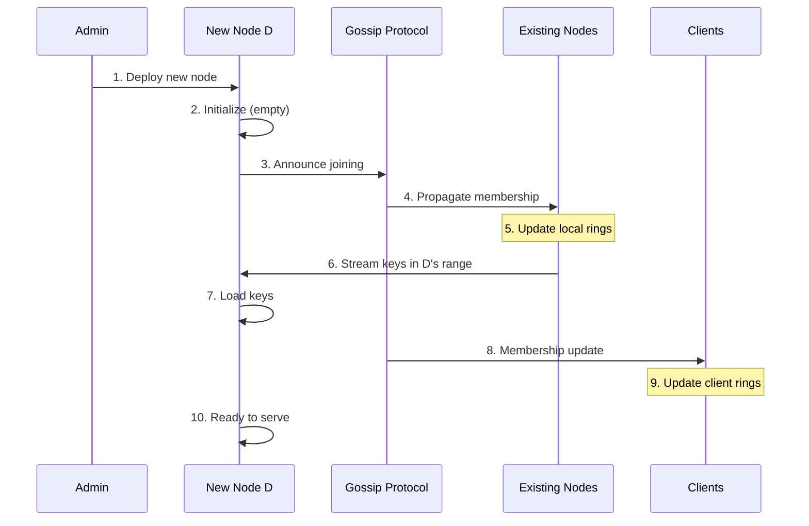
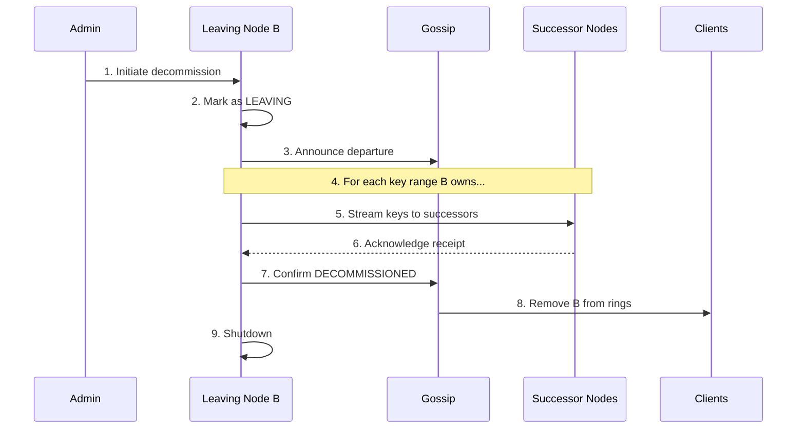
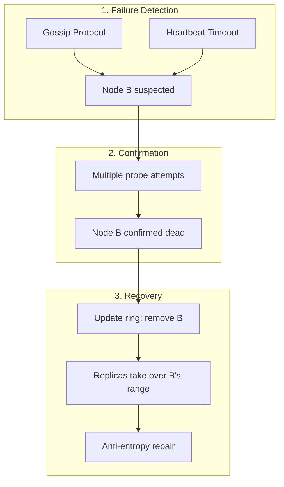
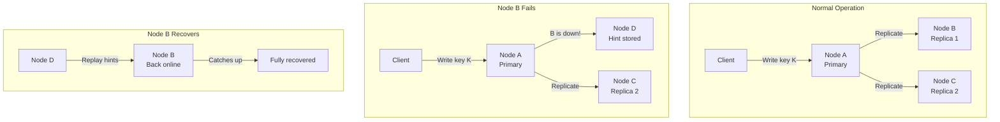
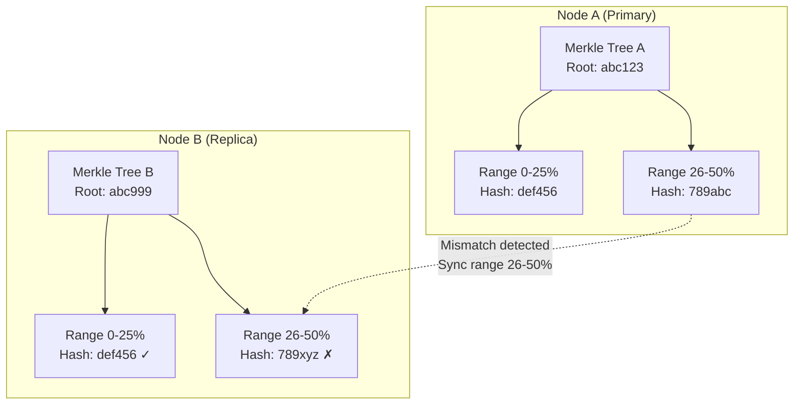

# Scalability & Reliability

[← Back to Index](./00-index.md)

---

## Scalability Properties

### Why Consistent Hashing Scales

```
┌─────────────────────────────────────────────────────────────────────┐
│  SCALABILITY CHARACTERISTICS                                         │
├─────────────────────────────────────────────────────────────────────┤
│                                                                      │
│  1. LINEAR SCALING                                                   │
│     ─────────────────                                                │
│     Adding N nodes → system can handle ~N× more data/traffic        │
│     Each node handles roughly 1/N of total keys                     │
│                                                                      │
│  2. INCREMENTAL SCALING                                              │
│     ────────────────────                                             │
│     Add 1 node: only ~1/N keys need to move                         │
│     No full rebalance required                                       │
│     Can scale one node at a time                                     │
│                                                                      │
│  3. DECENTRALIZED                                                    │
│     ──────────────                                                   │
│     No single point of failure for routing                          │
│     Each client can compute ring independently                      │
│     No centralized router bottleneck                                │
│                                                                      │
│  4. PREDICTABLE PERFORMANCE                                          │
│     ────────────────────────                                         │
│     Lookup: O(log N) regardless of data size                        │
│     Memory: O(N × V) independent of key count                       │
│                                                                      │
└─────────────────────────────────────────────────────────────────────┘
```

### Scaling Metrics

| Cluster Size | Lookup Time | Ring Memory | Keys per Add | Real-World Example |
|--------------|-------------|-------------|--------------|-------------------|
| 10 nodes | ~0.5 μs | 24 KB | 10% | Small startup |
| 100 nodes | ~0.8 μs | 240 KB | 1% | Growing company |
| 1,000 nodes | ~1.2 μs | 2.4 MB | 0.1% | Large enterprise |
| 10,000 nodes | ~1.6 μs | 24 MB | 0.01% | Hyperscale (rare) |

---

## Node Addition

### Step-by-Step Process



### Addition Algorithm

```
ALGORITHM AddNodeToCluster(newNode: Node):

    PHASE 1: ANNOUNCE
    ──────────────────
    newNode.status = JOINING
    Gossip.Broadcast(NodeJoinEvent(newNode))
    WaitForConvergence(timeout: 30s)

    PHASE 2: CALCULATE KEY RANGES
    ─────────────────────────────
    positions = GenerateVNodePositions(newNode.id, vnodeCount)
    keyRanges = []

    FOR EACH pos IN positions:
        predecessor = Ring.GetPredecessor(pos)
        currentOwner = Ring.GetSuccessor(pos)

        keyRanges.append({
            start: predecessor.position,
            end: pos,
            source: currentOwner
        })

    PHASE 3: STREAM DATA
    ────────────────────
    FOR EACH range IN keyRanges:
        // Throttled streaming to avoid overload
        keys = range.source.GetKeysInRange(range.start, range.end)

        FOR batch IN keys.Batches(size: 1000):
            newNode.BulkInsert(batch)
            range.source.MarkMigrated(batch)
            Sleep(10ms)  // Throttling

    PHASE 4: ACTIVATE
    ─────────────────
    newNode.status = ACTIVE
    Ring.AddPositions(positions)
    Gossip.Broadcast(NodeActiveEvent(newNode))

    PHASE 5: CLEANUP
    ────────────────
    FOR EACH range IN keyRanges:
        range.source.DeleteMigratedKeys(range)

    RETURN keysMigrated: Sum(keyRanges.keyCount)
```

### Key Movement Calculation

```
┌─────────────────────────────────────────────────────────────────────┐
│  KEY MOVEMENT ON NODE ADDITION                                       │
├─────────────────────────────────────────────────────────────────────┤
│                                                                      │
│  Given:                                                              │
│    N = current number of nodes                                      │
│    K = total keys in system                                         │
│    V = virtual nodes per physical node                              │
│                                                                      │
│  When adding 1 node:                                                │
│    Expected keys moved ≈ K / (N + 1)                                │
│                                                                      │
│  Example (N=10, K=1M):                                              │
│    Keys moved ≈ 1,000,000 / 11 ≈ 90,909 keys (9.09%)               │
│                                                                      │
│  Distribution of source nodes:                                       │
│    New node's vnodes take keys from multiple existing nodes         │
│    With V=150 vnodes spread across ring:                            │
│    - Each existing node gives up ~1/N of the moved keys            │
│    - Load on each source node: ~90,909/10 ≈ 9,091 keys             │
│                                                                      │
│  Compare to modulo hashing:                                          │
│    Keys moved = K × N/(N+1) ≈ 1,000,000 × 10/11 ≈ 909,091 (90.9%) │
│                                                                      │
│  Consistent hashing: 10× fewer keys moved!                          │
│                                                                      │
└─────────────────────────────────────────────────────────────────────┘
```

---

## Node Removal

### Planned Removal (Graceful)



### Unplanned Removal (Crash)



### Removal Algorithm

```
ALGORITHM RemoveNodeFromCluster(nodeId: String, graceful: Boolean):

    node = Ring.GetNode(nodeId)

    IF graceful:
        PHASE 1: PREPARE
        ────────────────
        node.status = LEAVING
        Gossip.Broadcast(NodeLeavingEvent(node))
        WaitForConvergence(timeout: 30s)

        PHASE 2: TRANSFER DATA
        ──────────────────────
        FOR EACH pos IN node.positions:
            successor = Ring.GetSuccessor(pos)
            keys = node.GetKeysForPosition(pos)

            // Stream to successor (who will now own this range)
            FOR batch IN keys.Batches(size: 1000):
                successor.BulkInsert(batch)
                Sleep(10ms)  // Throttling

        PHASE 3: DECOMMISSION
        ─────────────────────
        node.status = DECOMMISSIONED
        Ring.RemovePositions(node.positions)
        Gossip.Broadcast(NodeRemovedEvent(node))

    ELSE:  // Crash - immediate removal
        PHASE 1: DETECT
        ───────────────
        // Already detected by gossip failure detector

        PHASE 2: REMOVE FROM RING
        ─────────────────────────
        Ring.RemovePositions(node.positions)
        Gossip.Broadcast(NodeRemovedEvent(node))

        PHASE 3: REPAIR FROM REPLICAS
        ─────────────────────────────
        FOR EACH pos IN node.positions:
            successor = Ring.GetSuccessor(pos)
            replicaSources = Ring.GetReplicas(pos)

            // Repair from replicas (anti-entropy)
            FOR EACH replica IN replicaSources:
                IF replica.id != nodeId:
                    missingKeys = successor.GetMissingKeys(pos.range)
                    replica.StreamKeys(missingKeys, successor)
                    BREAK  // One replica is enough
```

---

## Failure Handling

### Failure Detection Methods

| Method | Detection Time | False Positive Rate | Scalability |
|--------|----------------|---------------------|-------------|
| Heartbeat | 3-10 seconds | Low | O(n) connections |
| Gossip (Phi Accrual) | 5-30 seconds | Very Low | O(1) per node |
| Hybrid | 5-15 seconds | Low | O(√n) |

### Gossip-Based Failure Detection

```
┌─────────────────────────────────────────────────────────────────────┐
│  PHI ACCRUAL FAILURE DETECTOR (Cassandra-style)                      │
├─────────────────────────────────────────────────────────────────────┤
│                                                                      │
│  Concept: Instead of binary alive/dead, compute probability         │
│                                                                      │
│  Phi (φ) = -log10(P(node is alive | no heartbeat for t seconds))   │
│                                                                      │
│  φ = 1  → 10% chance node is actually down                          │
│  φ = 2  → 1% chance node is actually down                           │
│  φ = 8  → 0.000001% chance (effectively confirmed dead)             │
│                                                                      │
│  Adaptive:                                                           │
│    - Tracks heartbeat arrival times                                 │
│    - Computes statistical distribution                               │
│    - Adjusts for network latency variations                         │
│                                                                      │
│  Configuration:                                                      │
│    phi_threshold: 8 (typical)                                       │
│    heartbeat_interval: 1 second                                     │
│    min_samples: 10 heartbeats before conclusions                    │
│                                                                      │
│  Benefits:                                                           │
│    - Adapts to network conditions                                   │
│    - Low false positives                                            │
│    - Works well in WAN settings                                     │
│                                                                      │
└─────────────────────────────────────────────────────────────────────┘
```

### Hinted Handoff (Dynamo-Style)



### Hinted Handoff Algorithm

```
ALGORITHM WriteWithHintedHandoff(key, value, replicas):

    successCount = 0
    hints = []

    FOR EACH node IN replicas:
        TRY:
            node.Write(key, value)
            successCount++

        CATCH NodeUnavailable:
            // Store hint on next available node
            hintTarget = Ring.GetNextAvailableNode(node)
            hint = {
                targetNode: node.id,
                key: key,
                value: value,
                timestamp: Now()
            }
            hintTarget.StoreHint(hint)
            hints.append(hint)

    IF successCount >= WriteQuorum:
        RETURN Success(hints)
    ELSE:
        RETURN Failure("Insufficient replicas")


ALGORITHM ReplayHints(targetNode):
    // Called when a node comes back online

    FOR EACH node IN AllNodes:
        hints = node.GetHintsFor(targetNode.id)

        FOR EACH hint IN hints:
            TRY:
                targetNode.Write(hint.key, hint.value)
                node.DeleteHint(hint)
            CATCH:
                // Will retry later
                CONTINUE
```

---

## Anti-Entropy Repair

### Merkle Tree Synchronization



### Repair Algorithm

```
ALGORITHM PeriodicAntiEntropy():

    FOR EACH keyRange IN myOwnedRanges:
        replicas = Ring.GetReplicas(keyRange)

        FOR EACH replica IN replicas:
            myTree = BuildMerkleTree(keyRange)
            theirTree = replica.GetMerkleTree(keyRange)

            differences = CompareMerkleTrees(myTree, theirTree)

            FOR EACH diffRange IN differences:
                // Determine who has newer data
                myKeys = GetKeysInRange(diffRange)
                theirKeys = replica.GetKeysInRange(diffRange)

                FOR EACH key IN Union(myKeys, theirKeys):
                    myVersion = GetVersion(key)
                    theirVersion = replica.GetVersion(key)

                    IF myVersion > theirVersion:
                        replica.Write(key, GetValue(key))
                    ELSE IF theirVersion > myVersion:
                        Write(key, replica.GetValue(key))
                    // Equal versions: no action needed

    SCHEDULE NextRun(interval: 1 hour)
```

---

## Disaster Recovery

### Multi-Region Considerations

```
┌─────────────────────────────────────────────────────────────────────┐
│  MULTI-REGION CONSISTENT HASHING                                     │
├─────────────────────────────────────────────────────────────────────┤
│                                                                      │
│  Option 1: Single Global Ring                                        │
│  ─────────────────────────────                                       │
│    - All nodes worldwide on one ring                                │
│    - Zone-aware replica placement                                   │
│    - Cross-region latency for some operations                       │
│                                                                      │
│    Ring: [US-A, EU-B, US-C, ASIA-D, EU-E, US-F, ...]               │
│    Replication: Pick N nodes from different regions                 │
│                                                                      │
│  Option 2: Per-Region Rings                                         │
│  ─────────────────────────────                                       │
│    - Separate ring per region                                       │
│    - Async replication between regions                              │
│    - Lower latency, higher complexity                               │
│                                                                      │
│    US Ring: [US-A, US-B, US-C]                                      │
│    EU Ring: [EU-A, EU-B, EU-C]                                      │
│    Cross-region: Async CDC between rings                            │
│                                                                      │
│  Option 3: Hierarchical Rings                                        │
│  ─────────────────────────────                                       │
│    - Global ring for region selection                               │
│    - Local ring within region                                       │
│                                                                      │
│    Level 1: hash(key) → Region (US, EU, ASIA)                      │
│    Level 2: hash(key) → Node within region                         │
│                                                                      │
└─────────────────────────────────────────────────────────────────────┘
```

### Recovery Objectives

| Scenario | RTO | RPO | Strategy |
|----------|-----|-----|----------|
| Single node failure | 0 (automatic) | 0 (sync replicas) | Replica takeover |
| AZ failure | < 1 minute | 0 (cross-AZ replicas) | Route to other AZs |
| Region failure | < 5 minutes | < 1 minute (async) | Failover to DR region |
| Full cluster loss | Hours | Last backup | Restore from backup |

### Backup and Restore

```
ALGORITHM BackupCluster():

    FOR EACH node IN Ring.GetAllNodes():
        // Consistent snapshot using virtual time
        snapshotTime = GlobalClock.Now()

        data = node.GetAllDataAsOf(snapshotTime)
        ring = Ring.Serialize()

        backup = {
            timestamp: snapshotTime,
            nodeId: node.id,
            data: data,
            ringState: ring
        }

        ObjectStorage.Upload(backup)


ALGORITHM RestoreCluster(backupTimestamp):

    // 1. Restore ring state
    ringBackup = ObjectStorage.Get("ring-{backupTimestamp}")
    Ring.Restore(ringBackup)

    // 2. Restore each node's data
    FOR EACH nodeBackup IN ObjectStorage.List("node-*-{backupTimestamp}"):
        node = Ring.GetNode(nodeBackup.nodeId)
        node.BulkLoad(nodeBackup.data)

    // 3. Run anti-entropy to fix any inconsistencies
    FOR EACH node IN Ring.GetAllNodes():
        node.TriggerAntiEntropy()
```

---

## Reliability Patterns Summary

| Pattern | Purpose | When to Use |
|---------|---------|-------------|
| **Virtual Nodes** | Even distribution | Always (150+ vnodes) |
| **Bounded Loads** | Prevent overload | Load-sensitive systems |
| **Hinted Handoff** | Temporary failure handling | AP systems (Dynamo) |
| **Anti-Entropy** | Long-term consistency | All replicated systems |
| **Merkle Trees** | Efficient sync detection | Large datasets |
| **Gossip Protocol** | Decentralized membership | Large clusters (100+) |
| **Phi Accrual** | Adaptive failure detection | Variable network conditions |
| **Zone-Aware Placement** | Fault isolation | Multi-AZ deployments |
